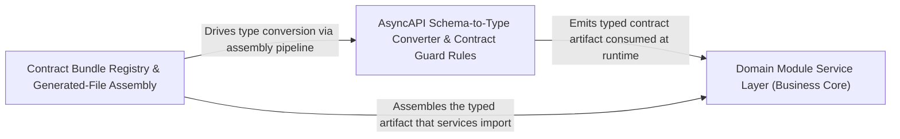

---
tags:
  - 2repo
  - 2repo/arch
  - project/boilerplate-node-backend
type: architecture
component: AsyncAPI_Type_Generation_Contract_Registry
---

## Details

The type-generation core of the contract pipeline. generate-asyncapi-types.ts parses the committed asyncapi.yaml, uses a recursive schemaToType walker to convert JSON-Schema payloads into TypeScript interface strings, deduplicates message-level type aliases, renders channel-namespace constants, builds the SSE payload map, and assembles the final generated file. The bundle-registry layer provides the ContractBundle type and the authored/generated distinction. The ESLint rule controller-chain-must-catch enforces that every controller promise chain ends in .catch(), protecting the runtime error-handling contract.

### Domain Module Service Layer (Business Core)
The per-module business-logic services that consume the generated contract types at runtime. This group spans the e-commerce domain modules (products, users, orders, inventory, feedback) and their service/orchestration code — create/update/updateById/remove operations, input filter types (LevelFilters, PaginationInput), email payload shaping (InvoiceOrder, OrderLines), and demo seeding (seedUsersCollection). It represents the consumer side of the contract pipeline: the typed payloads and channel constants produced by the generator are what these services import and validate against.

**Related Classes/Methods**:

- `src.modules.products.service.create`:148-168
- `src.modules.orders.emails.InvoiceOrder`:70-72
- `src.modules.inventory.service.LevelFilters`:67-69
- `src.modules.users.service.create`:86-105
- `src.modules.users.demo.seedUsersCollection`:56-57

**Source Files:**

- `src/infrastructure/persistence/search.ts`
  - `src.infrastructure.persistence.search.PaginationInput` (L9-L15) - Interface
- `src/modules/delivery/controllers/get-shipment-by-order.ts`
  - `src.modules.delivery.controllers.get-shipment-by-order.getShipmentByOrder` (L11-L18) - Class
  - `src.modules.delivery.controllers.get-shipment-by-order.getShipmentByOrder.then() callback` (L14-L17) - Function
- `src/modules/feedback/service.ts`
  - `src.modules.feedback.service.search` (L117-L147) - Class
  - `src.modules.feedback.service.search.then() callback` (L138-L147) - Function
- `src/modules/inventory/service.ts`
  - `src.modules.inventory.service.LevelFilters` (L67-L69) - Interface
- `src/modules/orders/emails.ts`
  - `src.modules.orders.emails.OrderLines` (L21-L25) - Interface
  - `src.modules.orders.emails.InvoiceOrder` (L70-L72) - Interface
- `src/modules/products/repository.ts`
  - `src.modules.products.repository.AvailabilityRow` (L18-L24) - Interface
- `src/modules/products/service.ts`
  - `src.modules.products.service.sanitizeStringArray` (L48-L51) - Class
  - `src.modules.products.service.sanitizeStringArray.values.map() callback` (L50-L50) - Function
  - `src.modules.products.service.create` (L148-L168) - Class
  - `src.modules.products.service.create.then() callback` (L158-L168) - Function
  - `src.modules.products.service.update` (L177-L215) - Class
  - `src.modules.products.service.update.then() callback` (L207-L214) - Function
  - `src.modules.products.service.update.then() callback.then() callback` (L213-L213) - Function
  - `src.modules.products.service.updateById` (L229-L247) - Class
  - `src.modules.products.service.updateById.then() callback` (L234-L247) - Function
  - `src.modules.products.service.updateById.then() callback.then() callback` (L236-L246) - Function
- `src/modules/users/demo.ts`
  - `src.modules.users.demo.seedUsersCollection` (L56-L57) - Class
  - `src.modules.users.demo.seedUsersCollection.userFixtures.map() callback` (L57-L57) - Function
- `src/modules/users/service.ts`
  - `src.modules.users.service.create` (L86-L105) - Class
  - `src.modules.users.service.create.then() callback` (L87-L105) - Function
  - `src.modules.users.service.update` (L117-L131) - Class
  - `src.modules.users.service.update.then() callback` (L130-L130) - Function
  - `src.modules.users.service.updateById` (L137-L166) - Class
  - `src.modules.users.service.updateById.then() callback` (L143-L166) - Function
  - `src.modules.users.service.updateById.then() callback.then() callback` (L145-L165) - Function
  - `src.modules.users.service.remove` (L180-L195) - Class
  - `src.modules.users.service.remove.then() callback` (L194-L194) - Function
  - `src.modules.users.service.removeById` (L269-L276) - Class
  - `src.modules.users.service.removeById.then() callback` (L273-L276) - Function

### AsyncAPI Schema-to-Type Converter & Contract Guard Rules
The type-generation engine and its quality guards. schemaToType is the recursive JSON-Schema to TypeScript walker (handling $ref, oneOf/anyOf/allOf, enums, arrays, objects, additionalProperties, and primitives), and messageTypeBlocks performs the message-level alias deduplication that keeps one alias per shared payload shape. This group also carries the ESLint rule controllerChainMustCatch that enforces every controller promise chain ends in .catch(), plus the mutation-baseline comparison and heap-retainer/test-result reporting scripts that guard the generated output's correctness.

**Related Classes/Methods**:

- `scripts.generate-asyncapi-types.schemaToType`:132-183
- `scripts.generate-asyncapi-types.messageTypeBlocks`:372-382
- `scripts.mutation-baseline.compareToBaseline`:120-139

**Source Files:**

- `scripts/generate-asyncapi-types.ts`
  - `scripts.generate-asyncapi-types.schemaToType` (L132-L183) - Class
  - `scripts.generate-asyncapi-types.schemaToType.schema.oneOf.map() callback` (L140-L140) - Function
  - `scripts.generate-asyncapi-types.schemaToType.schema.anyOf.map() callback` (L143-L143) - Function
  - `scripts.generate-asyncapi-types.schemaToType.schema.allOf.map() callback` (L146-L146) - Function
  - `scripts.generate-asyncapi-types.schemaToType.schema.enum.map() callback` (L149-L149) - Function
  - `scripts.generate-asyncapi-types.schemaToType.properties` (L155-L159) - Class
  - `scripts.generate-asyncapi-types.schemaToType.properties.map() callback` (L155-L159) - Function
  - `scripts.generate-asyncapi-types.messageTypeBlocks` (L372-L382) - Class
  - `scripts.generate-asyncapi-types.messageTypeBlocks.map() callback` (L373-L381) - Function
- `scripts/mutation-baseline.ts`
  - `scripts.mutation-baseline.compareToBaseline` (L120-L139) - Class
  - `scripts.mutation-baseline.compareToBaseline.files.map() callback` (L127-L138) - Function
- `scripts/report-test-results.ts`
  - `scripts.report-test-results.covered.toSorted() callback` (L271-L272) - Function
  - `scripts.report-test-results.covered` (L271-L273) - Class
- `scripts/spec-identity.ts`
  - `scripts.spec-identity.SharedFile` (L32-L35) - Interface
  - `scripts.spec-identity.SpecComparison` (L112-L122) - Interface
  - `scripts.spec-identity.sharedFileProblems` (L176-L177) - Class
  - `scripts.spec-identity.sharedFileProblems.comparisons.filter() callback` (L177-L177) - Function

### Contract Bundle Registry & Generated-File Assembly
The registry and assembly layer. bundle-registry.ts exposes the CONTRACT_BUNDLES catalog and findBundle, encoding the authored (committed, shared) vs. generated (.gitignore'd client collections) distinction that the CLI, staleness check, and cross-cutting tests all iterate over. On the generation side, this group holds the assembly path of generate-asyncapi-types.ts — the generator.generate(...).then(...) pipeline that maps Modelina model blocks, builds the SSE payload map, and assembles the final generated file via buildOutput — plus the report/heap-retainer scripts that surface generation and test outcomes.

**Related Classes/Methods**:

- `scripts.contracts.bundle-registry.findBundle`:44-45
- `scripts.report-heap-retainers.main`:121-219
- `scripts.report-test-results.failures`:210-220

**Source Files:**

- `eslint/rules/controller-chain-must-catch.ts`
  - `eslint.rules.controller-chain-must-catch.controllerChainMustCatch` (L83-L111) - Class
  - `eslint.rules.controller-chain-must-catch.controllerChainMustCatch.create` (L94-L110) - Method
  - `eslint.rules.controller-chain-must-catch.controllerChainMustCatch.create.CallExpression` (L96-L108) - Method
- `scripts/contracts/bundle-registry.ts`
  - `scripts.contracts.bundle-registry.findBundle` (L44-L45) - Class
  - `scripts.contracts.bundle-registry.findBundle.CONTRACT_BUNDLES.find() callback` (L45-L45) - Function
- `scripts/generate-asyncapi-types.ts`
  - `scripts.generate-asyncapi-types.then() callback.modelBlocks` (L425-L428) - Class
  - `scripts.generate-asyncapi-types.then() callback.modelBlocks.models.map() callback` (L426-L427) - Function
- `scripts/mutation-baseline.ts`
  - `scripts.mutation-baseline.scoresFromReport.scored` (L74-L74) - Class
  - `scripts.mutation-baseline.scoresFromReport.scored.mutants.filter() callback` (L74-L74) - Function
- `scripts/report-heap-retainers.ts`
  - `scripts.report-heap-retainers.streamArray` (L49-L106) - Class
  - `scripts.report-heap-retainers.streamArray.<function>` (L50-L106) - Function
  - `scripts.report-heap-retainers.streamArray.<function>.stream.on('data') callback` (L59-L103) - Function
  - `scripts.report-heap-retainers.streamArray.<function>.stream.on('close') callback` (L105-L105) - Function
  - `scripts.report-heap-retainers.readInts` (L109-L119) - Class
  - `scripts.report-heap-retainers.readInts.streamArray() callback` (L112-L116) - Function
  - `scripts.report-heap-retainers.main` (L121-L268) - Class
  - `scripts.report-heap-retainers.main.streamArray('strings') callback` (L193-L201) - Function
- `scripts/report-test-results.ts`
  - `scripts.report-test-results.wall` (L158-L161) - Class
  - `scripts.report-test-results.wall.report.testResults.reduce() callback` (L159-L159) - Function
  - `scripts.report-test-results.failures.report.testResults.flatMap() callback` (L210-L219) - Function
  - `scripts.report-test-results.failures` (L210-L220) - Class
  - `scripts.report-test-results.failures.report.testResults.flatMap() callback.suite.assertionResults.filter() callback` (L212-L212) - Function
  - `scripts.report-test-results.failures.report.testResults.flatMap() callback.map() callback` (L213-L219) - Function
