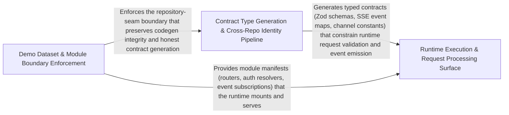

---
tags:
  - 2repo
  - 2repo/arch
  - project/boilerplate-node-backend
type: architecture
component: AsyncAPI_Type_Generation_Cross_Repo_Spec_Identity
---

## Details

The typed-artifact and cross-repo consistency half of the pipeline. It generates the TypeScript realtime contract types from the merged asyncapi.yaml — walking channels, messages and $ref-ed JSON schemas to emit payload interfaces, message aliases, per-namespace channel constants/unions and SSE event maps into src/types/asyncapi.generated.ts, with a --check mode that fails when the committed types no longer match the contract. It also enforces cross-repo identity (not equivalence) of the shared contract files between this backend and the paired frontend, so a one-line spec edit cannot silently fork what both sides believe they share.

### Contract Type Generation & Cross-Repo Identity Pipeline
The core generation-and-consistency engine. Reads asyncapi.yaml, walks channels/messages/$ref schemas via Modelina to emit payload interfaces, deduplicated message aliases, per-namespace channel constant objects and union types, and SSE event name/payload maps into src/types/asyncapi.generated.ts. A --check flag asserts the committed file is byte-current (exit 1 on drift). In parallel, spec-identity.ts hashes every backend-owned shared file against the sibling checkout and reports match | drift | missing-here | missing-there. sync-shared-files-to-frontend.ts runs staleness gates before copying each shared file into the frontend. build-contract-bundles.ts assembles committed bundle documents from fragments and supports --check to detect stale bundles. mutation-baseline.ts provides a per-file mutation-score ratchet that prevents a strong file from masking a weak one.

**Related Classes/Methods**:

- `scripts.generate-asyncapi-types.AsyncApiDocument`:55-60
- `scripts.generate-asyncapi-types.channelNamespaceBlocks`:354-356
- `scripts.spec-identity.compareSharedFiles`:144-173
- `scripts.mutation-baseline.MutationBaseline`:42-47

**Source Files:**

- `scripts/build-contract-bundles.ts`
  - `scripts.build-contract-bundles.CONTRACT_BUNDLES.map() callback` (L40-L40) - Function
  - `scripts.build-contract-bundles.bundle.stale` (L51-L51) - Class
  - `scripts.build-contract-bundles.bundle.stale.bundles.filter() callback` (L51-L51) - Function
  - `scripts.build-contract-bundles.stale.map() callback` (L129-L129) - Function
- `scripts/generate-asyncapi-types.ts`
  - `scripts.generate-asyncapi-types.AsyncApiOperation` (L27-L31) - Interface
  - `scripts.generate-asyncapi-types.AsyncApiChannel` (L33-L36) - Interface
  - `scripts.generate-asyncapi-types.AsyncApiMessage` (L38-L40) - Interface
  - `scripts.generate-asyncapi-types.JsonSchema` (L42-L53) - Interface
  - `scripts.generate-asyncapi-types.AsyncApiDocument` (L55-L60) - Interface
  - `scripts.generate-asyncapi-types.renderPayloadMap.rows` (L266-L270) - Class
  - `scripts.generate-asyncapi-types.renderPayloadMap.rows.entries.map() callback` (L268-L268) - Function
  - `scripts.generate-asyncapi-types.channelNamespaceBlocks` (L354-L356) - Class
  - `scripts.generate-asyncapi-types.channelNamespaceBlocks.map() callback` (L355-L355) - Function
  - `scripts.generate-asyncapi-types.then() callback` (L424-L449) - Function
  - `scripts.generate-asyncapi-types.catch() callback` (L450-L453) - Function
- `scripts/mutation-baseline.ts`
  - `scripts.mutation-baseline.MutationReport` (L38-L40) - Interface
  - `scripts.mutation-baseline.MutationBaseline` (L42-L47) - Interface
  - `scripts.mutation-baseline.FileComparison` (L51-L56) - Interface
  - `scripts.mutation-baseline.scoresFromReport.killed` (L82-L82) - Class
  - `scripts.mutation-baseline.scoresFromReport.killed.scored.filter() callback` (L82-L82) - Function
- `scripts/report-test-results.ts`
  - `scripts.report-test-results.suite.assertionResults.filter() callback` (L139-L139) - Function
- `scripts/run-demo-server.ts`
  - `scripts.run-demo-server.waitForDatabase` (L41-L56) - Class
  - `scripts.run-demo-server.waitForDatabase.<function>` (L42-L56) - Function
  - `scripts.run-demo-server.then() callback` (L59-L89) - Function
  - `scripts.run-demo-server.catch() callback` (L90-L93) - Function
- `scripts/spec-identity.ts`
  - `scripts.spec-identity.compareSharedFiles` (L144-L173) - Class
  - `scripts.spec-identity.compareSharedFiles.SHARED_FILES.map() callback` (L149-L173) - Function
- `scripts/sync-shared-files-to-frontend.ts`
  - `scripts.sync-shared-files-to-frontend.Outcome` (L74-L78) - Interface
  - `scripts.sync-shared-files-to-frontend.outcomes` (L80-L95) - Class
  - `scripts.sync-shared-files-to-frontend.outcomes.SHARED_FILES.map() callback` (L80-L95) - Function
  - `scripts.sync-shared-files-to-frontend.of` (L99-L99) - Class
  - `scripts.sync-shared-files-to-frontend.of.outcomes.filter() callback` (L99-L99) - Function

### Demo Dataset & Module Boundary Enforcement
The data-and-rule layer that the cross-repo identity pipeline guards. The demo dataset (account address books, product catalog) is one of the backend-owned shared files that must be byte-identical in the frontend; seedAddressBooksCollection and seedProductById produce the canonical seed data that export-demo-dataset.ts serializes and sync-shared-files-to-frontend.ts copies after its staleness gate. The demo-outbox adapter records outbound emails in-memory during demo mode, giving the demo server a deterministic, inspectable side-effect surface. The no-persistence-imports ESLint rule enforces the architectural boundary that module controllers/services must not import Mongoose models directly — preserving the repository seam that the contract-first pipeline depends on for clean codegen. Module resolve functions wire each domain module's controllers, services, and repositories into the registry, establishing the composition root that the contract bundles describe.

**Related Classes/Methods**:

- `src.modules.account.demo.seedAddressBooksCollection`:110-111

**Source Files:**

- `eslint/rules/no-persistence-imports.ts`
  - `eslint.rules.no-persistence-imports.noPersistenceImports.create.ImportDeclaration.name.find() callback` (L109-L110) - Function
  - `eslint.rules.no-persistence-imports.noPersistenceImports.create.ImportDeclaration.name` (L109-L111) - Class
  - `eslint.rules.no-persistence-imports.noPersistenceImports.create.ImportDeclaration.name.find() callback.bindings.some() callback` (L110-L110) - Function
- `src/infrastructure/adapters/demo-outbox.ts`
  - `src.infrastructure.adapters.demo-outbox.DemoOutboxEmail` (L18-L26) - Interface
  - `src.infrastructure.adapters.demo-outbox.recordDemoEmail.lines.filter() callback` (L50-L50) - Function
  - `src.infrastructure.adapters.demo-outbox.recordDemoEmail.lines.map() callback` (L51-L51) - Function
- `src/modules/account/demo.ts`
  - `src.modules.account.demo.seedAddressBooksCollection` (L110-L111) - Class
  - `src.modules.account.demo.seedAddressBooksCollection.addressBookFixtures.map() callback` (L111-L111) - Function
- `src/modules/products/demo.ts`
  - `src.modules.products.demo.seedProductById.product` (L148-L148) - Class
  - `src.modules.products.demo.seedProductById.product.productFixtures.find() callback` (L148-L148) - Function

### Runtime Execution & Request Processing Surface
The runtime layer where the generated contract types are consumed. cluster.ts is the process entry point: it initializes OTel tracing, forks worker processes, and implements crash-detection with exponential-backoff respawn and coordinated shutdown — the execution substrate that the realtime SSE channels (typed by SseEventPayloadMap) deliver over. readInput in the HTTP request adapter deserializes and validates inbound request bodies against the Zod schemas generated from openapi.yaml, closing the loop from contract → types → runtime validation. storeUploadedImages in the storage adapter persists binary uploads (the ImageStore port-and-adapter seam), and putFeedbackStatus in the feedback controller is a representative synchronous request-path handler that exercises the full middleware → controller → service → repository flow the contract describes. Together these entities form the consumer side of the pipeline: the generated types constrain what the runtime accepts and emits.

**Related Classes/Methods**:

- `src.modules.feedback.controllers.put-feedback-status.putFeedbackStatus`:23-39
- `src.modules.account.module.resolve`:35-49

**Source Files:**

- `src/cluster.ts`
  - `src.cluster.cluster.on('exit') callback.recentCrashes` (L140-L140) - Class
  - `src.cluster.cluster.on('exit') callback.recentCrashes.crashHistory.filter() callback` (L140-L140) - Function
- `src/infrastructure/adapters/logger.ts`
  - `src.infrastructure.adapters.logger.redactSensitiveFields` (L59-L79) - Class
  - `src.infrastructure.adapters.logger.redactSensitiveFields.input.map() callback` (L62-L62) - Function
  - `src.infrastructure.adapters.logger.redactFormat` (L114-L129) - Class
  - `src.infrastructure.adapters.logger.redactFormat.winston.format() callback` (L114-L129) - Function
  - `src.infrastructure.adapters.logger.prettyFormat` (L166-L179) - Class
  - `src.infrastructure.adapters.logger.prettyFormat.winston.format.printf() callback` (L172-L178) - Function
- `src/infrastructure/adapters/storage.ts`
  - `src.infrastructure.adapters.storage.storeUploadedImages.then() callback.failed` (L350-L350) - Class
  - `src.infrastructure.adapters.storage.storeUploadedImages.then() callback.failed.results.find() callback` (L350-L350) - Function
- `src/infrastructure/http/request.ts`
  - `src.infrastructure.http.request.readInput.undecoded` (L285-L285) - Class
  - `src.infrastructure.http.request.readInput.undecoded.stated.find() callback` (L285-L285) - Function
- `src/modules/account/module.ts`
  - `src.modules.account.module.resolve` (L35-L49) - Class
  - `src.modules.account.module.resolve.<function>` (L35-L49) - Function
  - `src.modules.account.module.resolve.<function>.then() callback` (L39-L48) - Function
- `src/modules/feedback/controllers/put-feedback-status.ts`
  - `src.modules.feedback.controllers.put-feedback-status.putFeedbackStatus` (L23-L39) - Class
  - `src.modules.feedback.controllers.put-feedback-status.putFeedbackStatus.then() callback` (L34-L37) - Function
