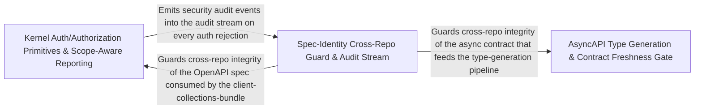

---
tags:
  - 2repo
  - 2repo/arch
  - project/boilerplate-node-backend
type: architecture
component: AsyncAPI_Type_Generation_Spec_Identity_Cross_Repo_Guard
---

## Details

Generates typed TypeScript from the AsyncAPI contract (rendering literal arrays for channel/operation names that controllers import), and enforces cross-repo spec identity: a set of files must be byte-for-byte identical between this backend repo and the paired frontend. The spec-identity check is deliberately a hash comparison (identity, not equivalence) to catch silent forks that would still pass each repo's own CI. The AsyncAPI type generation is the contract-to-code step that produces the typed event names. Together these form the contract integrity axis: the types are generated from the contract, and the contract is guarded against drift across repos. The group also carries the kernel authentication/authorization primitives that the scripts reference for scope-aware reporting.

### AsyncAPI Type Generation & Contract Freshness Gate
The contract-to-code pipeline. Reads asyncapi.yaml, resolves every message payload to a concrete TypeScript type, groups channels by namespace into constant objects and union types, renders the SSE event-name literal array and the SseEventPayloadMap interface, deduplicates message-level aliases, and writes the combined output to src/types/asyncapi.generated.ts. In --check mode it writes nothing and exits 1 on any mismatch, serving as the CI freshness gate. Also carries the mutation-baseline regression formatter and the test-results reporter that surface generation drift in CI output.

**Related Classes/Methods**:

- `src.kernel.authentication.resolveRefreshToken`:59-60

**Source Files:**

- `scripts/generate-asyncapi-types.ts`
  - `scripts.generate-asyncapi-types.renderLiteralArray.lines` (L251-L251) - Class
  - `scripts.generate-asyncapi-types.renderLiteralArray.lines.values.map() callback` (L251-L251) - Function
- `scripts/report-test-results.ts`
  - `scripts.report-test-results.width` (L170-L170) - Class
  - `scripts.report-test-results.width.rows.map() callback` (L170-L170) - Function
- `src/cluster.ts`
  - `src.cluster.startPrimaryShutdown.forceShutdownTimer` (L106-L113) - Class
  - `src.cluster.startPrimaryShutdown.forceShutdownTimer.setTimeout() callback` (L106-L113) - Function
- `src/infrastructure/http/uploads.ts`
  - `src.infrastructure.http.uploads.getFormFiles.paths` (L47-L49) - Class
  - `src.infrastructure.http.uploads.getFormFiles.paths.request.files.map() callback` (L48-L48) - Function
  - `src.infrastructure.http.uploads.getFormFiles.paths.flatMap() callback` (L49-L49) - Function
  - `src.infrastructure.http.uploads.getFormFiles.paths.flatMap() callback.files.map() callback` (L49-L49) - Function
- `src/infrastructure/observability/metrics-http.ts`
  - `src.infrastructure.observability.metrics-http._processUptimeGauge` (L41-L53) - Class
  - `src.infrastructure.observability.metrics-http._processUptimeGauge.collect` (L50-L52) - Method
  - `src.infrastructure.observability.metrics-http.sumMetricValues` (L212-L213) - Class
  - `src.infrastructure.observability.metrics-http.sumMetricValues.values.reduce() callback` (L213-L213) - Function
  - `src.infrastructure.observability.metrics-http.getHttpRequestCounters` (L302-L308) - Class
  - `src.infrastructure.observability.metrics-http.getHttpRequestCounters.then() callback` (L304-L307) - Function
- `src/infrastructure/observability/stream.ts`
  - `src.infrastructure.observability.stream.buildObservabilityPayload` (L69-L90) - Class
  - `src.infrastructure.observability.stream.buildObservabilityPayload.then() callback` (L73-L89) - Function
  - `src.infrastructure.observability.stream.writeMetricsEvent` (L99-L106) - Class
  - `src.infrastructure.observability.stream.writeMetricsEvent.then() callback` (L102-L104) - Function
  - `src.infrastructure.observability.stream.writeMetricsEvent.catch() callback` (L105-L105) - Function
  - `src.infrastructure.observability.stream.streamObservabilityMetrics.updatesInterval` (L133-L135) - Class
  - `src.infrastructure.observability.stream.streamObservabilityMetrics.updatesInterval.setInterval() callback` (L133-L135) - Function
  - `src.infrastructure.observability.stream.streamObservabilityMetrics.heartbeatInterval` (L139-L141) - Class
  - `src.infrastructure.observability.stream.streamObservabilityMetrics.heartbeatInterval.setInterval() callback` (L139-L141) - Function
- `src/kernel/authentication.ts`
  - `src.kernel.authentication.resolveRefreshToken` (L59-L60) - Class
  - `src.kernel.authentication.resolveRefreshToken.then() callback` (L60-L60) - Function
- `src/kernel/middlewares/authorizations.ts`
  - `src.kernel.middlewares.authorizations.isAdminViaCookie.then() callback` (L148-L171) - Function
- `src/modules/delivery/controllers/post-courier-advance.ts`
  - `src.modules.delivery.controllers.post-courier-advance.postCourierAdvance` (L13-L19) - Class
  - `src.modules.delivery.controllers.post-courier-advance.postCourierAdvance.then() callback` (L16-L18) - Function

### Kernel Auth/Authorization Primitives & Scope-Aware Reporting
The domain-agnostic kernel layer that answers two questions the scripts and middlewares need: who is the caller (authentication) and which rows may that caller see (authorization). resolveAccessToken / resolveRefreshToken delegate to a resolver registered at boot by the account module, keeping the kernel free of any module import. createVisibilityScope and createOwnerScope encode the shared admin-bypass / non-admin-narrow rule as a restrictNonAdmin combinator. The client-collections-bundle assembler and the rate-limit store / request context provide the reporting surface the scripts use when they need to describe which contract collections a given caller can reach.

**Related Classes/Methods**:

- `src.kernel.authentication.resolveAccessToken`:55-56
- `src.kernel.authorization.createVisibilityScope`:67-68
- `scripts.contracts.client-collections-bundle.sections`:56-57
- `src.kernel.middlewares.authorizations.getAuth`:25-49

**Source Files:**

- `scripts/contracts/client-collections-bundle.ts`
  - `scripts.contracts.client-collections-bundle.sections` (L56-L57) - Class
  - `scripts.contracts.client-collections-bundle.sections.SECTION_ORDER.map() callback` (L57-L57) - Function
- `src/infrastructure/http/middlewares/rate-limit-store.ts`
  - `src.infrastructure.http.middlewares.rate-limit-store.stopRateLimitStore` (L271-L283) - Class
  - `src.infrastructure.http.middlewares.rate-limit-store.stopRateLimitStore.then() callback` (L281-L281) - Function
- `src/infrastructure/http/request.ts`
  - `src.infrastructure.http.request.RequestInputDeclaration` (L152-L176) - Interface
  - `src.infrastructure.http.request.readInput.stated` (L279-L281) - Class
  - `src.infrastructure.http.request.readInput.stated.sources.map() callback` (L280-L280) - Function
  - `src.infrastructure.http.request.readInput.stated.filter() callback` (L281-L281) - Function
  - `src.infrastructure.http.request.CallerContext` (L326-L350) - Interface
- `src/kernel/authentication.ts`
  - `src.kernel.authentication.resolveAccessToken` (L55-L56) - Class
  - `src.kernel.authentication.resolveAccessToken.then() callback` (L56-L56) - Function
- `src/kernel/authorization.ts`
  - `src.kernel.authorization.createVisibilityScope` (L67-L68) - Class
  - `src.kernel.authorization.createVisibilityScope.restrictNonAdmin() callback` (L68-L68) - Function
- `src/kernel/middlewares/authorizations.ts`
  - `src.kernel.middlewares.authorizations.getAuth` (L25-L49) - Class
  - `src.kernel.middlewares.authorizations.getAuth.then() callback` (L34-L44) - Function
  - `src.kernel.middlewares.authorizations.getAuth.catch() callback` (L45-L47) - Function
- `src/modules/account/services/authentication.ts`
  - `src.modules.account.services.authentication.sessionRevoke` (L156-L170) - Class
  - `src.modules.account.services.authentication.sessionRevoke.then() callback` (L161-L170) - Function
- `src/modules/wishlist/service.ts`
  - `src.modules.wishlist.service.wishlistRemove` (L71-L84) - Class
  - `src.modules.wishlist.service.wishlistRemove.then() callback` (L76-L84) - Function

### Spec-Identity Cross-Repo Guard & Audit Stream
The cross-repo drift detector and its reporting surface. SHARED_FILES declares the exact set of files that must be byte-for-byte identical between this backend and the paired frontend. compareSharedFiles hashes each pair with SHA-256 and classifies the result as match, drift, missing-here, or missing-there; formatSharedFileProblems renders the human-readable failure message with exact remediation commands. The audit-event types and the observability stream provide the runtime reporting channel that surfaces contract-state changes and token-cleanup activity into the metrics pipeline, closing the loop between the static guard and the live system.

**Related Classes/Methods**:

- `src.infrastructure.observability.audit.AuditEntry`:85-90

**Source Files:**

- `scripts/mutation-baseline.ts`
  - `scripts.mutation-baseline.formatRegressions.lines` (L184-L187) - Class
  - `scripts.mutation-baseline.formatRegressions.lines.regressed.map() callback` (L185-L186) - Function
- `src/infrastructure/observability/audit.ts`
  - `src.infrastructure.observability.audit.AuditEvent` (L57-L79) - Interface
  - `src.infrastructure.observability.audit.AuditEntry` (L85-L90) - Interface
- `src/modules/account/services/addresses.ts`
  - `src.modules.account.services.addresses.addressForCheckout` (L89-L97) - Class
  - `src.modules.account.services.addresses.addressForCheckout.then() callback` (L93-L97) - Function
  - `src.modules.account.services.addresses.addressForCheckout.then() callback.book.items.find() callback` (L96-L96) - Function
- `src/modules/account/services/authentication.ts`
  - `src.modules.account.services.authentication.signup.outcome` (L285-L304) - Class
  - `src.modules.account.services.authentication.signup.outcome.then() callback.then() callback` (L301-L301) - Function
  - `src.modules.account.services.authentication.signup.outcome.catch() callback` (L303-L303) - Function
  - `src.modules.account.services.authentication.signup.outcome.then() callback` (L306-L334) - Function
- `src/modules/account/services/token-cleanup.ts`
  - `src.modules.account.services.token-cleanup.runTokenCleanup` (L16-L38) - Class
  - `src.modules.account.services.token-cleanup.runTokenCleanup.then() callback` (L20-L22) - Function
  - `src.modules.account.services.token-cleanup.runTokenCleanup.catch() callback` (L23-L37) - Function
  - `src.modules.account.services.token-cleanup.adminTokenCleanup.then() callback` (L52-L60) - Function
- `src/modules/cart/services/checkout.ts`
  - `src.modules.cart.services.checkout.orderConfirm.then() callback` (L270-L294) - Function
- `src/modules/cart/services/items.ts`
  - `src.modules.cart.services.items.cartItemAdd` (L125-L139) - Class
  - `src.modules.cart.services.items.cartItemAdd.then() callback` (L131-L139) - Function
- `src/modules/delivery/domain/rates.ts`
  - `src.modules.delivery.domain.rates.findShippingMethod` (L29-L30) - Class
  - `src.modules.delivery.domain.rates.findShippingMethod.SHIPPING_METHODS.find() callback` (L30-L30) - Function
- `src/modules/orders/service.ts`
  - `src.modules.orders.service.create.then() callback.orderItems` (L153-L156) - Class
  - `src.modules.orders.service.create.then() callback.orderItems.resolvedItems.map() callback` (L153-L156) - Function
  - `src.modules.orders.service.update.updateItemsPromise.then() callback.then() callback` (L310-L320) - Function
  - `src.modules.orders.service.updateById.then() callback.then() callback` (L338-L349) - Function
  - `src.modules.orders.service.withActions` (L450-L465) - Function
  - `src.modules.orders.service.cancelById.then() callback` (L511-L572) - Function
