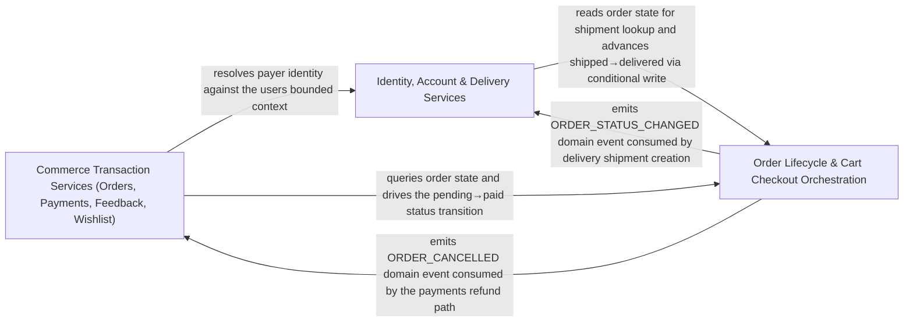

---
tags:
  - 2repo
  - 2repo/arch
  - project/boilerplate-node-backend
type: architecture
component: Business_Service_Orchestration_Orders_Payments_Delivery_Feedback
---

## Details

The service-layer orchestration where business modules consume the platform core to implement their domain logic. Contains service methods for orders (search, cancel, remove, anonymize, update), payments (createIntent, confirmPayment), delivery (getForOrder), and feedback (search), along with the account module's authentication, profile, tokens, and verification services. These services call the kernel's authorization scopes to narrow queries, emit domain events to notify other modules, and respond through the canonical envelope. The group also includes the validationErrors helper that translates Zod errors into the structured ResponseErrorItem[] format.

### Commerce Transaction Services (Orders, Payments, Feedback, Wishlist)
The read/write service surface for the four customer-facing commerce modules. It owns order search/cancel, the full payment lifecycle (intent creation, confirmation, refund, payer resolution), feedback search, and wishlist views/removal. These services are the primary consumers of the kernel authorization scopes and the canonical response envelope, and they emit domain events that other modules (delivery, inventory) observe.

**Related Classes/Methods**:

- `src.modules.payments.service.createIntent`:106-137
- `src.modules.payments.service.confirmPayment`:151-253
- `src.modules.orders.service.search`:51-66
- `src.modules.feedback.service.search`:135-165
- `src.modules.wishlist.service.wishlistRemove`:72-85

**Source Files:**

- `src/modules/cart/services/items.ts`
  - `src.modules.cart.services.items.cartGetForView` (L46-L53) - Class
  - `src.modules.cart.services.items.cartGetForView.then() callback` (L47-L53) - Function
- `src/modules/feedback/service.ts`
  - `src.modules.feedback.service.search` (L135-L165) - Class
  - `src.modules.feedback.service.search.then() callback` (L156-L165) - Function
- `src/modules/orders/domain/lifecycle.ts`
  - `src.modules.orders.domain.lifecycle.statusesLeadingTo` (L74-L75) - Class
  - `src.modules.orders.domain.lifecycle.statusesLeadingTo.filter() callback` (L75-L75) - Function
- `src/modules/orders/service.ts`
  - `src.modules.orders.service.search` (L51-L66) - Class
  - `src.modules.orders.service.search.then() callback` (L59-L66) - Function
  - `src.modules.orders.service.cancelById` (L496-L577) - Class
  - `src.modules.orders.service.cancelById.then() callback` (L521-L576) - Function
  - `src.modules.orders.service.cancelById.then() callback.then() callback` (L566-L574) - Function
- `src/modules/payments/providers/fake.ts`
  - `src.modules.payments.providers.fake.fakePaymentProvider` (L23-L39) - Class
  - `src.modules.payments.providers.fake.fakePaymentProvider.charge` (L26-L33) - Method
  - `src.modules.payments.providers.fake.fakePaymentProvider.refund` (L35-L38) - Method
- `src/modules/payments/providers/index.ts`
  - `src.modules.payments.providers.index.PaymentProvider` (L17-L35) - Interface
  - `src.modules.payments.providers.index.PaymentProvider.charge` (L28-L28) - Method
  - `src.modules.payments.providers.index.PaymentProvider.refund` (L34-L34) - Method
- `src/modules/payments/service.ts`
  - `src.modules.payments.service.resolvePayerId` (L72-L85) - Class
  - `src.modules.payments.service.resolvePayerId.then() callback` (L77-L83) - Function
  - `src.modules.payments.service.resolvePayerId.catch() callback` (L84-L84) - Function
  - `src.modules.payments.service.createIntent` (L106-L137) - Class
  - `src.modules.payments.service.createIntent.then() callback` (L110-L137) - Function
  - `src.modules.payments.service.then() callback.then() callback` (L120-L125) - Function
  - `src.modules.payments.service.createIntent.then() callback.then() callback` (L127-L135) - Function
  - `src.modules.payments.service.confirmPayment` (L151-L253) - Class
  - `src.modules.payments.service.then() callback` (L159-L226) - Function
  - `src.modules.payments.service.confirmPayment.then() callback` (L227-L253) - Function
  - `src.modules.payments.service.getForOrder` (L261-L273) - Class
  - `src.modules.payments.service.getForOrder.then() callback` (L265-L273) - Function
  - `src.modules.payments.service.getForOrder.then() callback.then() callback` (L272-L272) - Function
  - `src.modules.payments.service.performRefund` (L310-L332) - Class
  - `src.modules.payments.service.performRefund.then() callback` (L313-L332) - Function
  - `src.modules.payments.service.performRefund.then() callback.then() callback` (L317-L331) - Function
  - `src.modules.payments.service.refundByOrder` (L343-L363) - Class
  - `src.modules.payments.service.refundByOrder.then() callback` (L348-L363) - Function
  - `src.modules.payments.service.refundByOrder.then() callback.then() callback` (L353-L361) - Function
- `src/modules/products/demo.ts`
  - `src.modules.products.demo.seedProductById.product` (L167-L167) - Class
  - `src.modules.products.demo.seedProductById.product.productFixtures.find() callback` (L167-L167) - Function
- `src/modules/wishlist/service.ts`
  - `src.modules.wishlist.service.WishlistView` (L27-L29) - Interface
  - `src.modules.wishlist.service.toWishlistView.items.map() callback` (L33-L33) - Function
  - `src.modules.wishlist.service.wishlistRemove` (L72-L85) - Class
  - `src.modules.wishlist.service.wishlistRemove.then() callback` (L77-L85) - Function

### Identity, Account & Delivery Services
The account/identity orchestration plus the delivery read path and the shared response-envelope helper. It covers the account module's authentication (signup/login/reauth/logout), profile, tokens, and verification services, the users module's create/update, the delivery module's getForOrder, and the validationErrors helper that converts Zod errors into the structured ResponseErrorItem[] format consumed by every service.

**Related Classes/Methods**:

- `src.modules.account.services.authentication.login`:392-425
- `src.modules.account.services.addresses.addressAdd`:49-55
- `src.modules.users.service.create`:88-133
- `src.modules.delivery.service.getForOrder`:48-58
- `src.infrastructure.http.response.validationErrors`:224-232

**Source Files:**

- `src/infrastructure/http/response.ts`
  - `src.infrastructure.http.response.validationErrors` (L224-L232) - Class
  - `src.infrastructure.http.response.validationErrors.error.issues.map() callback` (L225-L232) - Function
- `src/modules/account/services/addresses.ts`
  - `src.modules.account.services.addresses.AddressesView` (L22-L24) - Interface
  - `src.modules.account.services.addresses.addressAdd` (L49-L55) - Class
  - `src.modules.account.services.addresses.addressAdd.then() callback` (L55-L55) - Function
  - `src.modules.account.services.addresses.addressRemove` (L69-L76) - Class
  - `src.modules.account.services.addresses.addressRemove.then() callback` (L73-L76) - Function
  - `src.modules.account.services.addresses.then() callback.book.items.find() callback` (L90-L90) - Function
- `src/modules/account/services/authentication.ts`
  - `src.modules.account.services.authentication.logoutCurrentSession` (L202-L225) - Class
  - `src.modules.account.services.authentication.logoutCurrentSession.then() callback` (L207-L224) - Function
  - `src.modules.account.services.authentication.signup` (L299-L387) - Class
  - `src.modules.account.services.authentication.signup.parseResult` (L314-L331) - Class
  - `src.modules.account.services.authentication.signup.parseResult.superRefine() callback` (L318-L324) - Function
  - `src.modules.account.services.authentication.signup.outcome` (L333-L356) - Class
  - `src.modules.account.services.authentication.signup.outcome.then() callback.then() callback` (L351-L352) - Function
  - `src.modules.account.services.authentication.signup.outcome.catch() callback` (L355-L355) - Function
  - `src.modules.account.services.authentication.signup.outcome.then() callback` (L358-L386) - Function
  - `src.modules.account.services.authentication.login` (L392-L425) - Class
  - `src.modules.account.services.authentication.login.then() callback` (L410-L422) - Function
  - `src.modules.account.services.authentication.login.then() callback.then() callback` (L417-L421) - Function
  - `src.modules.account.services.authentication.login.catch() callback` (L423-L423) - Function
  - `src.modules.account.services.authentication.reauth` (L498-L527) - Class
  - `src.modules.account.services.authentication.outcome.then() callback` (L506-L515) - Function
- `src/modules/account/services/profile.ts`
  - `src.modules.account.services.profile.removeOwnAccount` (L171-L208) - Class
  - `src.modules.account.services.profile.removeOwnAccount.then() callback` (L182-L207) - Function
  - `src.modules.account.services.profile.updateProfile` (L244-L280) - Class
  - `src.modules.account.services.profile.updateProfile.outcome` (L251-L268) - Class
  - `src.modules.account.services.profile.updateProfile.outcome.catch() callback` (L267-L267) - Function
  - `src.modules.account.services.profile.updateProfile.outcome.then() callback` (L270-L279) - Function
- `src/modules/account/services/tokens.ts`
  - `src.modules.account.services.tokens.sessionsList` (L83-L99) - Class
  - `src.modules.account.services.tokens.sessionsList.then() callback` (L88-L99) - Function
  - `src.modules.account.services.tokens.then() callback.sessions` (L91-L96) - Class
  - `src.modules.account.services.tokens.sessionsList.then() callback.sessions.user.tokens.filter() callback` (L95-L95) - Function
  - `src.modules.account.services.tokens.sessionsList.then() callback.sessions.map() callback` (L96-L96) - Function
- `src/modules/account/services/verification.ts`
  - `src.modules.account.services.verification.completeEmailVerification` (L110-L126) - Class
  - `src.modules.account.services.verification.completeEmailVerification.then() callback` (L115-L125) - Function
- `src/modules/delivery/service.ts`
  - `src.modules.delivery.service.getForOrder` (L48-L58) - Class
  - `src.modules.delivery.service.getForOrder.then() callback` (L52-L58) - Function
  - `src.modules.delivery.service.getForOrder.then() callback.then() callback` (L54-L57) - Function
- `src/modules/users/service.ts`
  - `src.modules.users.service.create` (L88-L133) - Class
  - `src.modules.users.service.create.then() callback` (L103-L132) - Function
  - `src.modules.users.service.create.then() callback.then() callback` (L131-L131) - Function
  - `src.modules.users.service.update` (L141-L193) - Class
  - `src.modules.users.service.update.then() callback` (L178-L192) - Function
  - `src.modules.users.service.updateById` (L196-L228) - Class
  - `src.modules.users.service.updateById.then() callback` (L202-L228) - Function
  - `src.modules.users.service.updateById.then() callback.then() callback` (L207-L227) - Function

### Order Lifecycle & Cart Checkout Orchestration
The write-path orchestration that moves orders through their lifecycle and drives the cart-to-checkout transition. It owns the order mutation services (update, remove, anonymize-due), the order domain rules (statusesReachableFrom, OrderLineCandidate, canTransition), the cart services (orderConfirm, cartItemUpdateQuantity, cartItemRemoveById), and the product read/update services that feed checkout.

**Related Classes/Methods**:

- `src.modules.orders.service.update`:238-331
- `src.modules.orders.service.anonymizeDueOrders`:441-445
- `src.modules.cart.services.checkout.orderConfirm`:241-270
- `src.modules.orders.domain.lifecycle.statusesReachableFrom`:63-67
- `src.modules.products.service.getByIdViewed`:124-137

**Source Files:**

- `src/modules/cart/services/checkout.ts`
  - `src.modules.cart.services.checkout.orderConfirm` (L241-L270) - Class
  - `src.modules.cart.services.checkout.orderConfirm.catch() callback` (L248-L248) - Function
  - `src.modules.cart.services.checkout.orderConfirm.then() callback` (L249-L270) - Function
- `src/modules/cart/services/items.ts`
  - `src.modules.cart.services.items.cartItemUpdateQuantity` (L116-L130) - Class
  - `src.modules.cart.services.items.cartItemUpdateQuantity.then() callback` (L122-L130) - Function
  - `src.modules.cart.services.items.cartItemRemoveById` (L149-L171) - Class
  - `src.modules.cart.services.items.cartItemRemoveById.then() callback` (L154-L171) - Function
  - `src.modules.cart.services.items.cartItemRemoveById.then() callback.then() callback` (L170-L170) - Function
- `src/modules/orders/domain/lifecycle.ts`
  - `src.modules.orders.domain.lifecycle.statusesReachableFrom` (L63-L67) - Class
  - `src.modules.orders.domain.lifecycle.statusesReachableFrom.filter() callback` (L67-L67) - Function
- `src/modules/orders/domain/rules.ts`
  - `src.modules.orders.domain.rules.OrderLineCandidate` (L8-L11) - Interface
  - `src.modules.orders.domain.rules.checkOrderLines` (L25-L30) - Class
  - `src.modules.orders.domain.rules.checkOrderLines.lines.some() callback` (L27-L27) - Function
- `src/modules/orders/service.ts`
  - `src.modules.orders.service.create.verdict` (L169-L171) - Class
  - `src.modules.orders.service.create.verdict.resolvedItems.map() callback` (L170-L170) - Function
  - `src.modules.orders.service.update` (L238-L331) - Class
  - `src.modules.orders.service.update.updateItemsPromise` (L287-L315) - Class
  - `src.modules.orders.service.updateItemsPromise.then() callback` (L289-L314) - Function
  - `src.modules.orders.service.update.updateItemsPromise.then() callback.requestedItems.map() callback` (L299-L302) - Function
  - `src.modules.orders.service.update.updateItemsPromise.then() callback.requestedItems.map() callback.then() callback` (L302-L302) - Function
  - `src.modules.orders.service.updateItemsPromise.then() callback.then() callback` (L304-L313) - Function
  - `src.modules.orders.service.update.updateItemsPromise.then() callback.then() callback.missingProduct` (L305-L305) - Class
  - `src.modules.orders.service.update.updateItemsPromise.then() callback.then() callback.missingProduct.resolvedItems.some() callback` (L305-L305) - Function
  - `src.modules.orders.service.update.updateItemsPromise.then() callback.then() callback.resolvedItems.map() callback` (L308-L311) - Function
  - `src.modules.orders.service.update.updateItemsPromise.then() callback` (L317-L330) - Function
  - `src.modules.orders.service.update.updateItemsPromise.then() callback.then() callback` (L319-L329) - Function
  - `src.modules.orders.service.updateById` (L340-L362) - Class
  - `src.modules.orders.service.updateById.then() callback` (L345-L362) - Function
  - `src.modules.orders.service.updateById.then() callback.then() callback` (L350-L361) - Function
  - `src.modules.orders.service.remove` (L373-L397) - Class
  - `src.modules.orders.service.remove.then() callback` (L396-L396) - Function
  - `src.modules.orders.service.removeById` (L406-L414) - Class
  - `src.modules.orders.service.removeById.then() callback` (L412-L413) - Function
  - `src.modules.orders.service.anonymizeDueOrders` (L441-L445) - Class
  - `src.modules.orders.service.anonymizeDueOrders.then() callback` (L442-L445) - Function
- `src/modules/products/service.ts`
  - `src.modules.products.service.getByIdViewed` (L124-L137) - Class
  - `src.modules.products.service.getByIdViewed.then() callback` (L129-L137) - Function
  - `src.modules.products.service.updateById` (L247-L268) - Class
  - `src.modules.products.service.updateById.then() callback` (L252-L268) - Function
  - `src.modules.products.service.updateById.then() callback.then() callback` (L257-L267) - Function
