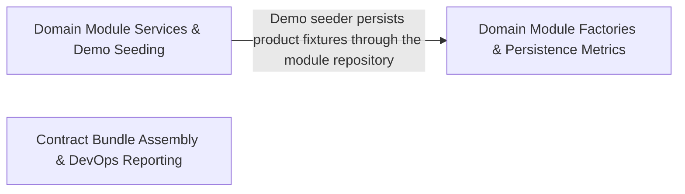

---
tags:
  - 2repo
  - 2repo/arch
  - project/boilerplate-node-backend
type: architecture
component: Contract_Bundle_Assembly_DevOps_Reporting
---

## Details

The assembly and CI-gate half of the contract pipeline. build-contract-bundles.ts iterates the bundle registry, assembles each document from its fragments, and either writes the committed output or runs a --check staleness assertion. The bundle definitions declare fragment sources, output paths, and the authored-vs-generated distinction. In parallel, the DevOps reporting cluster provides the CI gates: mutation-score baselines, heap-retainer analysis, and test-result summaries.

### Domain Module Factories & Persistence Metrics
The per-domain factory/override layer and persistence-side instrumentation of the e-commerce modules. It holds the module factory identities and per-module override registries (account, cart, wishlist), the inventory Prometheus metrics (inventoryReservedUnitsTotal, productsLowStockTotal and their .collect hooks), the inventory movement service (listMovements), and the products repository (productRepository.adjustUnits). This is the domain/persistence axis of the modular architecture — the swappable e-commerce module internals that the contract pipeline ultimately documents.

**Related Classes/Methods**:

- `src.modules.inventory.metrics.inventoryReservedUnitsTotal`:41-48
- `src.modules.inventory.service.listMovements`:490-497
- `src.modules.products.repository.productRepository`:39-374
- `src.modules.cart.factory.CartOverrides`:29-34
- `src.modules.account.factory.AddressBookOverrides`:26-31

**Source Files:**

- `src/infrastructure/persistence/factory.ts`
  - `src.infrastructure.persistence.factory.FactoryIdentity` (L17-L22) - Interface
- `src/modules/account/factory.ts`
  - `src.modules.account.factory.AddressBookOverrides` (L26-L31) - Interface
- `src/modules/cart/factory.ts`
  - `src.modules.cart.factory.CartOverrides` (L29-L34) - Interface
- `src/modules/cart/services/checkout.ts`
  - `src.modules.cart.services.checkout.orderConfirm.then() callback.then() callback.then() callback.joined` (L165-L165) - Class
  - `src.modules.cart.services.checkout.orderConfirm.then() callback.then() callback.then() callback.joined.lines.filter() callback` (L165-L165) - Function
  - `src.modules.cart.services.checkout.orderConfirm.<function>.then() callback.then() callback.orderItems` (L167-L170) - Class
  - `src.modules.cart.services.checkout.orderConfirm.<function>.then() callback.then() callback.orderItems.joined.map() callback` (L167-L170) - Function
- `src/modules/cart/services/reorder.ts`
  - `src.modules.cart.services.reorder.ReorderLine` (L31-L36) - Interface
  - `src.modules.cart.services.reorder.then() callback` (L74-L121) - Function
  - `src.modules.cart.services.reorder.reorderIntoCart.<function>.requested` (L83-L89) - Class
  - `src.modules.cart.services.reorder.reorderIntoCart.<function>.requested.order.items.map() callback` (L83-L89) - Function
  - `src.modules.cart.services.reorder.reorderIntoCart.<function>.requested.map() callback` (L93-L96) - Function
  - `src.modules.cart.services.reorder.reorderIntoCart.<function>.requested.map() callback.then() callback` (L96-L96) - Function
  - `src.modules.cart.services.reorder.<function>.then() callback.then() callback` (L118-L118) - Function
- `src/modules/inventory/metrics.ts`
  - `src.modules.inventory.metrics.productsLowStockTotal` (L23-L30) - Class
  - `src.modules.inventory.metrics.productsLowStockTotal.collect` (L27-L29) - Method
  - `src.modules.inventory.metrics.inventoryReservedUnitsTotal` (L41-L48) - Class
  - `src.modules.inventory.metrics.inventoryReservedUnitsTotal.collect` (L45-L47) - Method
- `src/modules/inventory/service.ts`
  - `src.modules.inventory.service.listMovements` (L490-L497) - Class
  - `src.modules.inventory.service.listMovements.then() callback` (L497-L497) - Function
- `src/modules/products/repository.ts`
  - `src.modules.products.repository.productRepository` (L39-L374) - Class
  - `src.modules.products.repository.productRepository.publicScope` (L78-L78) - Method
  - `src.modules.products.repository.productRepository.findByIdScoped` (L94-L95) - Method
  - `src.modules.products.repository.productRepository.findPublicById` (L108-L109) - Method
  - `src.modules.products.repository.productRepository.facets` (L120-L148) - Method
  - `src.modules.products.repository.productRepository.facets.then() callback` (L142-L148) - Function
  - `src.modules.products.repository.productRepository.facets.then() callback.categories.map() callback` (L143-L146) - Function
  - `src.modules.products.repository.productRepository.facets.then() callback.tags.map() callback` (L147-L147) - Function
  - `src.modules.products.repository.productRepository.reserveUnits` (L177-L188) - Method
  - `src.modules.products.repository.productRepository.reserveUnits.then() callback` (L188-L188) - Function
  - `src.modules.products.repository.productRepository.commitUnits` (L200-L212) - Method
  - `src.modules.products.repository.productRepository.commitUnits.then() callback` (L212-L212) - Function
  - `src.modules.products.repository.productRepository.releaseUnits` (L224-L232) - Method
  - `src.modules.products.repository.productRepository.releaseUnits.then() callback` (L232-L232) - Function
  - `src.modules.products.repository.productRepository.receiveUnits` (L241-L249) - Method
  - `src.modules.products.repository.productRepository.receiveUnits.then() callback` (L249-L249) - Function
  - `src.modules.products.repository.productRepository.adjustUnits` (L262-L273) - Method
  - `src.modules.products.repository.productRepository.adjustUnits.then() callback` (L273-L273) - Function
  - `src.modules.products.repository.productRepository.countLowAvailability` (L285-L291) - Method
  - `src.modules.products.repository.productRepository.sumReserved` (L302-L305) - Method
  - `src.modules.products.repository.productRepository.sumReserved.then() callback` (L305-L305) - Function
  - `src.modules.products.repository.productRepository.availabilityPage` (L329-L373) - Method
  - `src.modules.products.repository.productRepository.availabilityPage.then() callback` (L370-L373) - Function
- `src/modules/wishlist/factory.ts`
  - `src.modules.wishlist.factory.WishlistOverrides` (L18-L29) - Interface

### Domain Module Services & Demo Seeding
The service/orchestration and demo-data axis of the domain modules, plus the cluster respawn scheduler. It contains the feedback status services (updateStatus, updateStatusById), the products demo seeder (seedProductsCollection) and search service (searchViewed), the users model/service (UserDocument, UserRecord, getById), and the cluster respawn timer (scheduleRespawn). This represents the business-core orchestration and seed/demo data layer that the contract-first pipeline exposes through the API surface.

**Related Classes/Methods**:

- `src.modules.feedback.service.updateStatus`:149-159
- `src.modules.products.demo.seedProductsCollection`:155-156
- `src.modules.users.model.UserDocument`:90-93
- `src.modules.users.service.getById`:68-71

**Source Files:**

- `src/cluster.ts`
  - `src.cluster.scheduleRespawn.timer` (L74-L77) - Class
  - `src.cluster.scheduleRespawn.timer.setTimeout() callback` (L74-L77) - Function
- `src/modules/feedback/controllers/post-feedback-contact.ts`
  - `src.modules.feedback.controllers.post-feedback-contact.postFeedbackContact` (L25-L42) - Class
  - `src.modules.feedback.controllers.post-feedback-contact.postFeedbackContact.then() callback` (L38-L40) - Function
- `src/modules/feedback/service.ts`
  - `src.modules.feedback.service.updateStatus` (L149-L159) - Class
  - `src.modules.feedback.service.updateStatus.then() callback` (L158-L158) - Function
  - `src.modules.feedback.service.updateStatusById` (L161-L181) - Class
  - `src.modules.feedback.service.updateStatusById.then() callback` (L166-L181) - Function
  - `src.modules.feedback.service.updateStatusById.then() callback.then() callback` (L168-L180) - Function
- `src/modules/products/demo.ts`
  - `src.modules.products.demo.seedProductsCollection` (L155-L156) - Class
  - `src.modules.products.demo.seedProductsCollection.productFixtures.map() callback` (L156-L156) - Function
- `src/modules/products/service.ts`
  - `src.modules.products.service.searchViewed` (L89-L106) - Class
  - `src.modules.products.service.searchViewed.then() callback` (L94-L106) - Function
- `src/modules/users/model.ts`
  - `src.modules.users.model.TokenType` (L19-L22) - Enum
  - `src.modules.users.model.Token` (L28-L49) - Interface
  - `src.modules.users.model.UserRecord` (L60-L85) - Interface
  - `src.modules.users.model.UserDocument` (L90-L93) - Interface
  - `src.modules.users.model.userSchema.pre('save') callback` (L304-L310) - Function
  - `src.modules.users.model.userSchema.pre('save') callback.then() callback` (L307-L309) - Function
  - `src.modules.users.model.tokenAdd.then() callback` (L359-L365) - Function
  - `src.modules.users.model.tokenRemoveAll.then() callback` (L374-L380) - Function
  - `src.modules.users.model.tokenRemoveAll.then() callback.tokens.filter() callback` (L379-L379) - Function
- `src/modules/users/service.ts`
  - `src.modules.users.service.getById` (L68-L71) - Class
  - `src.modules.users.service.getById.then() callback` (L70-L70) - Function

### Contract Bundle Assembly & DevOps Reporting
The assembly and CI-gate half of the contract pipeline. build-contract-bundles.ts iterates the bundle registry, assembles each document from its fragments, and either writes the committed output or runs a --check staleness assertion. The bundle definitions declare fragment sources, output paths, and the authored-vs-generated distinction (bundle-kinds.ts), while generate-asyncapi-types.ts produces the typed realtime client from the assembled contract. In parallel, the DevOps reporting cluster provides the CI gates: mutation-baseline.ts (per-file mutation-score ratchet), run-mutation-tests.ts (Stryker wrapper with OOM-loop detection), report-heap-summary.ts (streaming heap-snapshot analysis), and report-test-results.ts (per-module test-result summaries).

**Related Classes/Methods**:

- `scripts.generate-asyncapi-types.collectChannelMessageEntries`:223-241
- `scripts.report-heap-summary.streamArray`:50-112

**Source Files:**

- `scripts/build-contract-bundles.ts`
  - `scripts.build-contract-bundles.named` (L34-L34) - Class
  - `scripts.build-contract-bundles.named.arguments_.filter() callback` (L34-L34) - Function
  - `scripts.build-contract-bundles.generated` (L72-L72) - Class
  - `scripts.build-contract-bundles.generated.selected.filter() callback` (L72-L72) - Function
  - `scripts.build-contract-bundles.generated.map() callback` (L80-L80) - Function
- `scripts/contracts/analytics-events-bundle.ts`
  - `scripts.contracts.analytics-events-bundle.sectionsInScope` (L115-L116) - Class
  - `scripts.contracts.analytics-events-bundle.sectionsInScope.SECTIONS.filter() callback` (L116-L116) - Function
  - `scripts.contracts.analytics-events-bundle.analyticsEventsBundle` (L264-L277) - Class
  - `scripts.contracts.analytics-events-bundle.analyticsEventsBundle.sources` (L276-L276) - Method
  - `scripts.contracts.analytics-events-bundle.analyticsEventsBundle.sources.map() callback` (L276-L276) - Function
- `scripts/contracts/asyncapi-bundles.ts`
  - `scripts.contracts.asyncapi-bundles.sectionsInScope` (L43-L46) - Class
  - `scripts.contracts.asyncapi-bundles.sectionsInScope.ASYNC_SECTION_ORDER.filter() callback` (L46-L46) - Function
  - `scripts.contracts.asyncapi-bundles.asyncapiBundle` (L159-L170) - Class
  - `scripts.contracts.asyncapi-bundles.asyncapiBundle.content` (L164-L164) - Method
  - `scripts.contracts.asyncapi-bundles.asyncapiBundle.sources` (L165-L168) - Method
  - `scripts.contracts.asyncapi-bundles.asyncapiBundle.sources.map() callback` (L167-L167) - Function
  - `scripts.contracts.asyncapi-bundles.asyncapiPublicBundle` (L179-L189) - Class
  - `scripts.contracts.asyncapi-bundles.asyncapiPublicBundle.content` (L183-L183) - Method
  - `scripts.contracts.asyncapi-bundles.asyncapiPublicBundle.sources` (L184-L187) - Method
  - `scripts.contracts.asyncapi-bundles.asyncapiPublicBundle.sources.map() callback` (L186-L186) - Function
- `scripts/contracts/bundle-kinds.ts`
  - `scripts.contracts.bundle-kinds.BundleIdentity` (L30-L51) - Interface
  - `scripts.contracts.bundle-kinds.CompiledBundle` (L62-L67) - Interface
  - `scripts.contracts.bundle-kinds.GeneratedBundle` (L77-L80) - Interface
- `scripts/contracts/openapi-bundle.ts`
  - `scripts.contracts.openapi-bundle.openapiBundle` (L159-L166) - Class
  - `scripts.contracts.openapi-bundle.openapiBundle.sources` (L165-L165) - Method
  - `scripts.contracts.openapi-bundle.openapiBundle.sources.MODULE_SECTIONS.map() callback` (L165-L165) - Function
- `scripts/generate-asyncapi-types.ts`
  - `scripts.generate-asyncapi-types.collectChannelMessageEntries` (L223-L241) - Class
  - `scripts.generate-asyncapi-types.collectChannelMessageEntries.filter() callback` (L230-L230) - Function
  - `scripts.generate-asyncapi-types.collectChannelMessageEntries.map() callback` (L231-L240) - Function
  - `scripts.generate-asyncapi-types.collectChannelMessageEntries.toSorted() callback` (L241-L241) - Function
  - `scripts.generate-asyncapi-types.modelNameConstraints` (L333-L335) - Class
  - `scripts.generate-asyncapi-types.modelNameConstraints.NAMING_FORMATTER` (L334-L334) - Method
- `scripts/mutation-baseline.ts`
  - `scripts.mutation-baseline.missingFromReport` (L149-L155) - Class
  - `scripts.mutation-baseline.missingFromReport.filter() callback` (L154-L154) - Function
- `scripts/report-heap-summary.ts`
  - `scripts.report-heap-summary.streamArray` (L50-L112) - Class
  - `scripts.report-heap-summary.streamArray.<function>` (L51-L112) - Function
  - `scripts.report-heap-summary.streamArray.<function>.stream.on('data') callback` (L61-L108) - Function
  - `scripts.report-heap-summary.streamArray.<function>.stream.on('close') callback` (L111-L111) - Function
  - `scripts.report-heap-summary.main` (L114-L194) - Class
  - `scripts.report-heap-summary.main.streamArray('nodes') callback` (L131-L165) - Function
  - `scripts.report-heap-summary.main.ranked` (L167-L167) - Class
  - `scripts.report-heap-summary.main.ranked.toSorted() callback` (L167-L167) - Function
  - `scripts.report-heap-summary.main.streamArray('strings') callback` (L174-L181) - Function
- `scripts/report-test-results.ts`
  - `scripts.report-test-results.rows.toSorted() callback` (L152-L153) - Function
  - `scripts.report-test-results.rows` (L152-L154) - Class
  - `scripts.report-test-results.slowestTests` (L193-L202) - Class
  - `scripts.report-test-results.slowestTests.report.testResults.flatMap() callback` (L194-L199) - Function
  - `scripts.report-test-results.slowestTests.report.testResults.flatMap() callback.suite.assertionResults.map() callback` (L195-L199) - Function
  - `scripts.report-test-results.slowestTests.toSorted() callback` (L201-L201) - Function
- `scripts/run-mutation-tests.ts`
  - `scripts.run-mutation-tests.wasPassed` (L44-L44) - Class
  - `scripts.run-mutation-tests.wasPassed.passthrough.some() callback` (L44-L44) - Function
