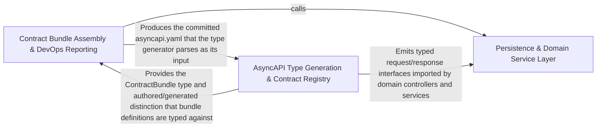

---
tags:
  - 2repo
  - 2repo/arch
  - project/boilerplate-node-backend
type: architecture
component: Contract_Bundle_Building_AsyncAPI_Type_Generation
---

## Details

Builds the OpenAPI/AsyncAPI contract bundles and generates typed AsyncAPI payloads (schema-to-type, channel/message blocks) from the bundle registry, with a secondary controller-chain ESLint guard.

### Persistence & Domain Service Layer [[Expand]](./Persistence_Domain_Service_Layer.md)
The data-access and business-rule tier that the contract surface describes. Provides a generic createBaseRepository factory (CRUD + serialization), per-module repositories (account, cart, inventory, payments), seed/export utilities, and domain services that encode invariants (stock reservation, payment confirmation, token lifecycle). This is the 'what the API does' half of the contract.

**Related Classes/Methods**:

- `src.infrastructure.persistence.base-repository.createBaseRepository`:222-346
- `src.infrastructure.persistence.factory.compact`:51-52
- `src.infrastructure.persistence.seed.exportCollection`:71-80
- `src.modules.payments.service.confirmPayment`:168-271
- `src.modules.inventory.service.isStockBoundToOrder`:295-298

**Source Files:**

- `scripts/run-prism-smoke-test.ts`
  - `scripts.run-prism-smoke-test.prism.stdout.on('data') callback` (L29-L29) - Function
  - `scripts.run-prism-smoke-test.prism.stderr.on('data') callback` (L30-L30) - Function
  - `scripts.run-prism-smoke-test.process.on('SIGINT') callback` (L37-L37) - Function
- `src/infrastructure/persistence/base-repository.ts`
  - `src.infrastructure.persistence.base-repository.createBaseRepository` (L222-L346) - Function
  - `src.infrastructure.persistence.base-repository.createBaseRepository.normalize.transformed.items.map() callback` (L237-L238) - Function
  - `src.infrastructure.persistence.base-repository.createBaseRepository.normalize.transformed` (L237-L239) - Class
- `src/infrastructure/persistence/factory.ts`
  - `src.infrastructure.persistence.factory.compact` (L51-L52) - Class
  - `src.infrastructure.persistence.factory.compact.filter() callback` (L52-L52) - Function
- `src/infrastructure/persistence/seed.ts`
  - `src.infrastructure.persistence.seed.SeedRepository` (L22-L25) - Interface
  - `src.infrastructure.persistence.seed.exportCollection` (L71-L80) - Class
  - `src.infrastructure.persistence.seed.exportCollection.then() callback` (L80-L80) - Function
  - `src.infrastructure.persistence.seed.exportCollection.then() callback.documents.map() callback` (L80-L80) - Function
- `src/kernel/registry.ts`
  - `src.kernel.registry.ContextEdge` (L31-L43) - Interface
- `src/modules/account/repository.ts`
  - `src.modules.account.repository.addressBookRepository` (L24-L118) - Class
  - `src.modules.account.repository.addressBookRepository.findByUserId` (L43-L44) - Method
  - `src.modules.account.repository.addressBookRepository.addEntry` (L53-L63) - Method
  - `src.modules.account.repository.addressBookRepository.updateEntry` (L73-L91) - Method
  - `src.modules.account.repository.addressBookRepository.removeEntry` (L97-L106) - Method
  - `src.modules.account.repository.addressBookRepository.removeEntry.entry` (L99-L99) - Class
  - `src.modules.account.repository.addressBookRepository.removeEntry.entry.book.items.find() callback` (L99-L99) - Function
  - `src.modules.account.repository.addressBookRepository.removeEntry.book.items.filter() callback` (L102-L102) - Function
  - `src.modules.account.repository.addressBookRepository.deleteByUserId` (L111-L117) - Method
  - `src.modules.account.repository.addressBookRepository.deleteByUserId.then() callback` (L115-L117) - Function
- `src/modules/account/services/addresses.ts`
  - `src.modules.account.services.addresses.addressesGet` (L47-L48) - Class
  - `src.modules.account.services.addresses.addressesGet.then() callback` (L48-L48) - Function
  - `src.modules.account.services.addresses.addressAdd` (L51-L57) - Class
  - `src.modules.account.services.addresses.addressAdd.then() callback` (L57-L57) - Function
- `src/modules/account/services/profile.ts`
  - `src.modules.account.services.profile.validatePasswordChange.parseResult` (L51-L69) - Class
  - `src.modules.account.services.profile.validatePasswordChange.parseResult.superRefine() callback` (L58-L65) - Function
  - `src.modules.account.services.profile.updateProfile.outcome` (L247-L261) - Class
  - `src.modules.account.services.profile.updateProfile.outcome.catch() callback` (L260-L260) - Function
  - `src.modules.account.services.profile.updateProfile.outcome.then() callback` (L263-L272) - Function
- `src/modules/account/services/tokens.ts`
  - `src.modules.account.services.tokens.findLiveToken` (L62-L74) - Class
  - `src.modules.account.services.tokens.findLiveToken.then() callback` (L66-L74) - Function
  - `src.modules.account.services.tokens.then() callback.sessions` (L128-L130) - Class
- `src/modules/account/session/config.ts`
  - `src.modules.account.session.config.RefreshTokenExpiryTime` (L12-L16) - Enum
- `src/modules/account/session/jwt.ts`
  - `src.modules.account.session.jwt.TokenData` (L22-L24) - Interface
  - `src.modules.account.session.jwt.verifyAccessToken` (L33-L42) - Class
  - `src.modules.account.session.jwt.verifyAccessToken.<function>` (L34-L42) - Function
  - `src.modules.account.session.jwt.verifyAccessToken.<function>.verify() callback` (L35-L41) - Function
  - `src.modules.account.session.jwt.verifyRefreshToken` (L50-L68) - Class
  - `src.modules.account.session.jwt.verifyRefreshToken.<function>` (L51-L68) - Function
  - `src.modules.account.session.jwt.verifyRefreshToken.<function>.verify() callback` (L52-L67) - Function
  - `src.modules.account.session.jwt.verifyRefreshToken.<function>.verify() callback.then() callback` (L59-L65) - Function
  - `src.modules.account.session.jwt.verifyRefreshToken.<function>.verify() callback.catch() callback` (L66-L66) - Function
  - `src.modules.account.session.jwt.createRefreshToken` (L76-L102) - Class
  - `src.modules.account.session.jwt.createRefreshToken.then() callback` (L80-L102) - Function
  - `src.modules.account.session.jwt.recordRefreshTokenUse` (L121-L125) - Class
  - `src.modules.account.session.jwt.recordRefreshTokenUse.then() callback` (L124-L124) - Function
  - `src.modules.account.session.jwt.recordRefreshTokenUse.catch() callback` (L125-L125) - Function
  - `src.modules.account.session.jwt.createAccessToken` (L132-L138) - Class
  - `src.modules.account.session.jwt.createAccessToken.then() callback` (L133-L137) - Function
- `src/modules/cart/repository.ts`
  - `src.modules.cart.repository.cartRepository` (L78-L184) - Class
  - `src.modules.cart.repository.cartRepository.findByUserId` (L100-L100) - Method
  - `src.modules.cart.repository.cartRepository.removeLine` (L111-L118) - Method
  - `src.modules.cart.repository.cartRepository.clearLines` (L124-L131) - Method
  - `src.modules.cart.repository.cartRepository.clearLinesIfUnchanged` (L150-L158) - Method
  - `src.modules.cart.repository.cartRepository.deleteByUserId` (L166-L172) - Method
  - `src.modules.cart.repository.cartRepository.deleteByUserId.then() callback` (L170-L172) - Function
  - `src.modules.cart.repository.cartRepository.removeProductFromAll` (L177-L183) - Method
- `src/modules/cart/services/cleanup.ts`
  - `src.modules.cart.services.cleanup.productRemoveFromCartsById` (L31-L43) - Class
  - `src.modules.cart.services.cleanup.productRemoveFromCartsById.then() callback` (L36-L41) - Function
  - `src.modules.cart.services.cleanup.productRemoveFromCartsById.catch() callback` (L43-L43) - Function
- `src/modules/cart/services/items.ts`
  - `src.modules.cart.services.items.cartGet` (L29-L30) - Class
  - `src.modules.cart.services.items.cartGet.then() callback` (L30-L30) - Function
  - `src.modules.cart.services.items.cartItemRemoveById` (L177-L199) - Class
  - `src.modules.cart.services.items.cartItemRemoveById.then() callback.then() callback` (L198-L198) - Function
- `src/modules/inventory/repository.ts`
  - `src.modules.inventory.repository.toReservationItems` (L31-L37) - Class
  - `src.modules.inventory.repository.toReservationItems.lines.map() callback` (L34-L37) - Function
  - `src.modules.inventory.repository.reservationRepository` (L59-L151) - Class
  - `src.modules.inventory.repository.reservationRepository.insertHold` (L89-L101) - Method
  - `src.modules.inventory.repository.reservationRepository.insertHold.then() callback` (L97-L97) - Function
  - `src.modules.inventory.repository.reservationRepository.insertHold.catch() callback` (L98-L101) - Function
  - `src.modules.inventory.repository.reservationRepository.findByOrderId` (L109-L110) - Method
  - `src.modules.inventory.repository.reservationRepository.claimStatus` (L125-L132) - Method
  - `src.modules.inventory.repository.reservationRepository.findExpired` (L145-L150) - Method
- `src/modules/inventory/service.ts`
  - `src.modules.inventory.service.isStockBoundToOrder` (L295-L298) - Class
  - `src.modules.inventory.service.isStockBoundToOrder.then() callback` (L298-L298) - Function
- `src/modules/payments/providers/fake.ts`
  - `src.modules.payments.providers.fake.fakePaymentProvider` (L36-L52) - Class
  - `src.modules.payments.providers.fake.fakePaymentProvider.charge` (L39-L46) - Method
  - `src.modules.payments.providers.fake.fakePaymentProvider.refund` (L48-L51) - Method
- `src/modules/payments/providers/index.ts`
  - `src.modules.payments.providers.index.PaymentProvider` (L24-L43) - Interface
  - `src.modules.payments.providers.index.PaymentProvider.charge` (L36-L36) - Method
  - `src.modules.payments.providers.index.PaymentProvider.refund` (L42-L42) - Method
- `src/modules/payments/repository.ts`
  - `src.modules.payments.repository.paymentRepository` (L21-L126) - Class
  - `src.modules.payments.repository.paymentRepository.ownerScope` (L58-L58) - Method
  - `src.modules.payments.repository.paymentRepository.findByIdScoped` (L71-L72) - Method
  - `src.modules.payments.repository.paymentRepository.findByOrderId` (L81-L82) - Method
  - `src.modules.payments.repository.paymentRepository.upsertIntent` (L95-L112) - Method
  - `src.modules.payments.repository.paymentRepository.upsertIntent.catch() callback` (L109-L112) - Function
  - `src.modules.payments.repository.paymentRepository.updateStatusIfIn` (L118-L125) - Method
- `src/modules/payments/service.ts`
  - `src.modules.payments.service.resolvePayerId` (L89-L99) - Class
  - `src.modules.payments.service.resolvePayerId.then() callback` (L92-L98) - Function
  - `src.modules.payments.service.resolvePayerId.catch() callback` (L99-L99) - Function
  - `src.modules.payments.service.createIntent` (L123-L154) - Class
  - `src.modules.payments.service.createIntent.then() callback` (L127-L154) - Function
  - `src.modules.payments.service.then() callback.then() callback` (L137-L142) - Function
  - `src.modules.payments.service.createIntent.then() callback.then() callback` (L144-L152) - Function
  - `src.modules.payments.service.confirmPayment` (L168-L271) - Class
  - `src.modules.payments.service.then() callback` (L176-L244) - Function
  - `src.modules.payments.service.confirmPayment.then() callback` (L245-L271) - Function
  - `src.modules.payments.service.confirmPayment.then() callback.declined` (L250-L251) - Class
  - `src.modules.payments.service.confirmPayment.then() callback.declined.result.errors.some() callback` (L251-L251) - Function
  - `src.modules.payments.service.getForOrder` (L279-L291) - Class
  - `src.modules.payments.service.getForOrder.then() callback` (L283-L291) - Function
  - `src.modules.payments.service.getForOrder.then() callback.then() callback` (L290-L290) - Function
  - `src.modules.payments.service.performRefund` (L329-L342) - Class
  - `src.modules.payments.service.performRefund.then() callback` (L332-L342) - Function
  - `src.modules.payments.service.performRefund.then() callback.then() callback` (L336-L341) - Function
  - `src.modules.payments.service.refundByOrder` (L354-L373) - Class
  - `src.modules.payments.service.refundByOrder.then() callback` (L358-L373) - Function
  - `src.modules.payments.service.refundByOrder.then() callback.then() callback` (L363-L371) - Function
  - `src.modules.payments.service.refundForOrder` (L385-L386) - Class
  - `src.modules.payments.service.refundForOrder.then() callback` (L386-L386) - Function
- `src/modules/products/model.ts`
  - `src.modules.products.model.title.error` (L76-L76) - Method
  - `src.modules.products.model.zodProductSchema.title.error` (L77-L77) - Method
  - `src.modules.products.model.price.error` (L80-L80) - Method
  - `src.modules.products.model.zodProductSchema.price.error` (L81-L81) - Method
- `src/modules/users/model.ts`
  - `src.modules.users.model.UserMethods` (L98-L105) - Interface
- `src/modules/users/repository.ts`
  - `src.modules.users.repository.userRepository` (L27-L223) - Class
  - `src.modules.users.repository.userRepository.updateMany` (L63-L64) - Method
  - `src.modules.users.repository.userRepository.findByIdWithCredentials` (L69-L70) - Method
  - `src.modules.users.repository.userRepository.findOneWithCredentials` (L75-L76) - Method
  - `src.modules.users.repository.userRepository.findByToken` (L96-L100) - Method
  - `src.modules.users.repository.userRepository.tokenRemove` (L116-L125) - Method
  - `src.modules.users.repository.userRepository.tokenRemoveByValue` (L141-L148) - Method
  - `src.modules.users.repository.userRepository.tokenRemoveExpired` (L161-L171) - Method
  - `src.modules.users.repository.userRepository.tokenRemoveExpired.then() callback` (L170-L170) - Function
  - `src.modules.users.repository.userRepository.findByTokenValue` (L182-L182) - Method
  - `src.modules.users.repository.userRepository.tokenTouch` (L193-L200) - Method
  - `src.modules.users.repository.userRepository.sessionRemove` (L215-L222) - Method
- `src/modules/wishlist/repository.ts`
  - `src.modules.wishlist.repository.wishlistRepository` (L25-L106) - Class
  - `src.modules.wishlist.repository.wishlistRepository.findByUserId` (L40-L41) - Method
  - `src.modules.wishlist.repository.wishlistRepository.addLine` (L61-L68) - Method
  - `src.modules.wishlist.repository.wishlistRepository.removeLine` (L75-L82) - Method
  - `src.modules.wishlist.repository.wishlistRepository.deleteByUserId` (L88-L94) - Method
  - `src.modules.wishlist.repository.wishlistRepository.deleteByUserId.then() callback` (L92-L94) - Function
  - `src.modules.wishlist.repository.wishlistRepository.removeProductFromAll` (L99-L105) - Method
- `src/modules/wishlist/service.ts`
  - `src.modules.wishlist.service.wishlistGet` (L38-L39) - Class
  - `src.modules.wishlist.service.wishlistGet.then() callback` (L39-L39) - Function
  - `src.modules.wishlist.service.wishlistMoveToCart.then() callback.saved` (L107-L107) - Class
  - `src.modules.wishlist.service.wishlistMoveToCart.then() callback.saved.wishlist.items.some() callback` (L107-L107) - Function

### Contract Bundle Assembly & DevOps Reporting [[Expand]](./Contract_Bundle_Assembly_DevOps_Reporting.md)
The assembly and CI-gate half of the contract pipeline. build-contract-bundles.ts iterates the bundle registry, assembles each document from its fragments, and either writes the committed output or runs a --check staleness assertion. The bundle definitions declare fragment sources, output paths, and the authored-vs-generated distinction. In parallel, the DevOps reporting cluster provides the CI gates: mutation-score baselines, heap-retainer analysis, and test-result summaries.

**Related Classes/Methods**:

- `scripts.contracts.asyncapi-bundles.asyncapiBundle`:159-170

**Source Files:**

- `scripts/build-contract-bundles.ts`
  - `scripts.build-contract-bundles.named` (L34-L34) - Class
  - `scripts.build-contract-bundles.named.arguments_.filter() callback` (L34-L34) - Function
  - `scripts.build-contract-bundles.generated` (L72-L72) - Class
  - `scripts.build-contract-bundles.generated.selected.filter() callback` (L72-L72) - Function
  - `scripts.build-contract-bundles.generated.map() callback` (L80-L80) - Function
- `scripts/contracts/analytics-events-bundle.ts`
  - `scripts.contracts.analytics-events-bundle.sectionsInScope` (L115-L116) - Class
  - `scripts.contracts.analytics-events-bundle.sectionsInScope.SECTIONS.filter() callback` (L116-L116) - Function
  - `scripts.contracts.analytics-events-bundle.analyticsEventsBundle` (L264-L277) - Class
  - `scripts.contracts.analytics-events-bundle.analyticsEventsBundle.sources` (L276-L276) - Method
  - `scripts.contracts.analytics-events-bundle.analyticsEventsBundle.sources.map() callback` (L276-L276) - Function
- `scripts/contracts/asyncapi-bundles.ts`
  - `scripts.contracts.asyncapi-bundles.sectionsInScope` (L43-L46) - Class
  - `scripts.contracts.asyncapi-bundles.sectionsInScope.ASYNC_SECTION_ORDER.filter() callback` (L46-L46) - Function
  - `scripts.contracts.asyncapi-bundles.asyncapiBundle` (L159-L170) - Class
  - `scripts.contracts.asyncapi-bundles.asyncapiBundle.content` (L164-L164) - Method
  - `scripts.contracts.asyncapi-bundles.asyncapiBundle.sources` (L165-L168) - Method
  - `scripts.contracts.asyncapi-bundles.asyncapiBundle.sources.map() callback` (L167-L167) - Function
  - `scripts.contracts.asyncapi-bundles.asyncapiPublicBundle` (L179-L189) - Class
  - `scripts.contracts.asyncapi-bundles.asyncapiPublicBundle.content` (L183-L183) - Method
  - `scripts.contracts.asyncapi-bundles.asyncapiPublicBundle.sources` (L184-L187) - Method
  - `scripts.contracts.asyncapi-bundles.asyncapiPublicBundle.sources.map() callback` (L186-L186) - Function
- `scripts/contracts/bundle-kinds.ts`
  - `scripts.contracts.bundle-kinds.BundleIdentity` (L30-L51) - Interface
  - `scripts.contracts.bundle-kinds.CompiledBundle` (L62-L67) - Interface
  - `scripts.contracts.bundle-kinds.GeneratedBundle` (L77-L80) - Interface
- `scripts/contracts/openapi-bundle.ts`
  - `scripts.contracts.openapi-bundle.openapiBundle` (L159-L166) - Class
  - `scripts.contracts.openapi-bundle.openapiBundle.sources` (L165-L165) - Method
  - `scripts.contracts.openapi-bundle.openapiBundle.sources.MODULE_SECTIONS.map() callback` (L165-L165) - Function
- `scripts/generate-asyncapi-types.ts`
  - `scripts.generate-asyncapi-types.collectChannelMessageEntries` (L223-L241) - Class
  - `scripts.generate-asyncapi-types.collectChannelMessageEntries.filter() callback` (L230-L230) - Function
  - `scripts.generate-asyncapi-types.collectChannelMessageEntries.map() callback` (L231-L240) - Function
  - `scripts.generate-asyncapi-types.collectChannelMessageEntries.toSorted() callback` (L241-L241) - Function
  - `scripts.generate-asyncapi-types.modelNameConstraints` (L333-L335) - Class
  - `scripts.generate-asyncapi-types.modelNameConstraints.NAMING_FORMATTER` (L334-L334) - Method
- `scripts/mutation-baseline.ts`
  - `scripts.mutation-baseline.missingFromReport` (L149-L155) - Class
  - `scripts.mutation-baseline.missingFromReport.filter() callback` (L154-L154) - Function
- `scripts/report-heap-summary.ts`
  - `scripts.report-heap-summary.streamArray` (L50-L112) - Class
  - `scripts.report-heap-summary.streamArray.<function>` (L51-L112) - Function
  - `scripts.report-heap-summary.streamArray.<function>.stream.on('data') callback` (L61-L108) - Function
  - `scripts.report-heap-summary.streamArray.<function>.stream.on('close') callback` (L111-L111) - Function
  - `scripts.report-heap-summary.main` (L114-L194) - Class
  - `scripts.report-heap-summary.main.streamArray('nodes') callback` (L131-L165) - Function
  - `scripts.report-heap-summary.main.ranked` (L167-L167) - Class
  - `scripts.report-heap-summary.main.ranked.toSorted() callback` (L167-L167) - Function
  - `scripts.report-heap-summary.main.streamArray('strings') callback` (L174-L181) - Function
- `scripts/report-test-results.ts`
  - `scripts.report-test-results.rows.toSorted() callback` (L152-L153) - Function
  - `scripts.report-test-results.rows` (L152-L154) - Class
  - `scripts.report-test-results.slowestTests` (L193-L202) - Class
  - `scripts.report-test-results.slowestTests.report.testResults.flatMap() callback` (L194-L199) - Function
  - `scripts.report-test-results.slowestTests.report.testResults.flatMap() callback.suite.assertionResults.map() callback` (L195-L199) - Function
  - `scripts.report-test-results.slowestTests.toSorted() callback` (L201-L201) - Function
- `scripts/run-mutation-tests.ts`
  - `scripts.run-mutation-tests.wasPassed` (L44-L44) - Class
  - `scripts.run-mutation-tests.wasPassed.passthrough.some() callback` (L44-L44) - Function
- `src/cluster.ts`
  - `src.cluster.scheduleRespawn.timer` (L74-L77) - Class
  - `src.cluster.scheduleRespawn.timer.setTimeout() callback` (L74-L77) - Function
- `src/infrastructure/persistence/factory.ts`
  - `src.infrastructure.persistence.factory.FactoryIdentity` (L17-L22) - Interface
- `src/modules/account/factory.ts`
  - `src.modules.account.factory.AddressBookOverrides` (L26-L31) - Interface
- `src/modules/cart/factory.ts`
  - `src.modules.cart.factory.CartOverrides` (L29-L34) - Interface
- `src/modules/cart/services/checkout.ts`
  - `src.modules.cart.services.checkout.orderConfirm.then() callback.then() callback.then() callback.joined` (L165-L165) - Class
  - `src.modules.cart.services.checkout.orderConfirm.then() callback.then() callback.then() callback.joined.lines.filter() callback` (L165-L165) - Function
  - `src.modules.cart.services.checkout.orderConfirm.<function>.then() callback.then() callback.orderItems` (L167-L170) - Class
  - `src.modules.cart.services.checkout.orderConfirm.<function>.then() callback.then() callback.orderItems.joined.map() callback` (L167-L170) - Function
- `src/modules/cart/services/reorder.ts`
  - `src.modules.cart.services.reorder.ReorderLine` (L31-L36) - Interface
  - `src.modules.cart.services.reorder.then() callback` (L74-L121) - Function
  - `src.modules.cart.services.reorder.reorderIntoCart.<function>.requested` (L83-L89) - Class
  - `src.modules.cart.services.reorder.reorderIntoCart.<function>.requested.order.items.map() callback` (L83-L89) - Function
  - `src.modules.cart.services.reorder.reorderIntoCart.<function>.requested.map() callback` (L93-L96) - Function
  - `src.modules.cart.services.reorder.reorderIntoCart.<function>.requested.map() callback.then() callback` (L96-L96) - Function
  - `src.modules.cart.services.reorder.<function>.then() callback.then() callback` (L118-L118) - Function
- `src/modules/feedback/controllers/post-feedback-contact.ts`
  - `src.modules.feedback.controllers.post-feedback-contact.postFeedbackContact` (L25-L42) - Class
  - `src.modules.feedback.controllers.post-feedback-contact.postFeedbackContact.then() callback` (L38-L40) - Function
- `src/modules/feedback/service.ts`
  - `src.modules.feedback.service.updateStatus` (L149-L159) - Class
  - `src.modules.feedback.service.updateStatus.then() callback` (L158-L158) - Function
  - `src.modules.feedback.service.updateStatusById` (L161-L181) - Class
  - `src.modules.feedback.service.updateStatusById.then() callback` (L166-L181) - Function
  - `src.modules.feedback.service.updateStatusById.then() callback.then() callback` (L168-L180) - Function
- `src/modules/inventory/metrics.ts`
  - `src.modules.inventory.metrics.productsLowStockTotal` (L23-L30) - Class
  - `src.modules.inventory.metrics.productsLowStockTotal.collect` (L27-L29) - Method
  - `src.modules.inventory.metrics.inventoryReservedUnitsTotal` (L41-L48) - Class
  - `src.modules.inventory.metrics.inventoryReservedUnitsTotal.collect` (L45-L47) - Method
- `src/modules/inventory/service.ts`
  - `src.modules.inventory.service.listMovements` (L490-L497) - Class
  - `src.modules.inventory.service.listMovements.then() callback` (L497-L497) - Function
- `src/modules/products/demo.ts`
  - `src.modules.products.demo.seedProductsCollection` (L155-L156) - Class
  - `src.modules.products.demo.seedProductsCollection.productFixtures.map() callback` (L156-L156) - Function
- `src/modules/products/repository.ts`
  - `src.modules.products.repository.productRepository` (L39-L374) - Class
  - `src.modules.products.repository.productRepository.publicScope` (L78-L78) - Method
  - `src.modules.products.repository.productRepository.findByIdScoped` (L94-L95) - Method
  - `src.modules.products.repository.productRepository.findPublicById` (L108-L109) - Method
  - `src.modules.products.repository.productRepository.facets` (L120-L148) - Method
  - `src.modules.products.repository.productRepository.facets.then() callback` (L142-L148) - Function
  - `src.modules.products.repository.productRepository.facets.then() callback.categories.map() callback` (L143-L146) - Function
  - `src.modules.products.repository.productRepository.facets.then() callback.tags.map() callback` (L147-L147) - Function
  - `src.modules.products.repository.productRepository.reserveUnits` (L177-L188) - Method
  - `src.modules.products.repository.productRepository.reserveUnits.then() callback` (L188-L188) - Function
  - `src.modules.products.repository.productRepository.commitUnits` (L200-L212) - Method
  - `src.modules.products.repository.productRepository.commitUnits.then() callback` (L212-L212) - Function
  - `src.modules.products.repository.productRepository.releaseUnits` (L224-L232) - Method
  - `src.modules.products.repository.productRepository.releaseUnits.then() callback` (L232-L232) - Function
  - `src.modules.products.repository.productRepository.receiveUnits` (L241-L249) - Method
  - `src.modules.products.repository.productRepository.receiveUnits.then() callback` (L249-L249) - Function
  - `src.modules.products.repository.productRepository.adjustUnits` (L262-L273) - Method
  - `src.modules.products.repository.productRepository.adjustUnits.then() callback` (L273-L273) - Function
  - `src.modules.products.repository.productRepository.countLowAvailability` (L285-L291) - Method
  - `src.modules.products.repository.productRepository.sumReserved` (L302-L305) - Method
  - `src.modules.products.repository.productRepository.sumReserved.then() callback` (L305-L305) - Function
  - `src.modules.products.repository.productRepository.availabilityPage` (L329-L373) - Method
  - `src.modules.products.repository.productRepository.availabilityPage.then() callback` (L370-L373) - Function
- `src/modules/products/service.ts`
  - `src.modules.products.service.searchViewed` (L89-L106) - Class
  - `src.modules.products.service.searchViewed.then() callback` (L94-L106) - Function
- `src/modules/users/model.ts`
  - `src.modules.users.model.TokenType` (L19-L22) - Enum
  - `src.modules.users.model.Token` (L28-L49) - Interface
  - `src.modules.users.model.UserRecord` (L60-L85) - Interface
  - `src.modules.users.model.UserDocument` (L90-L93) - Interface
  - `src.modules.users.model.userSchema.pre('save') callback` (L304-L310) - Function
  - `src.modules.users.model.userSchema.pre('save') callback.then() callback` (L307-L309) - Function
  - `src.modules.users.model.tokenAdd.then() callback` (L359-L365) - Function
  - `src.modules.users.model.tokenRemoveAll.then() callback` (L374-L380) - Function
  - `src.modules.users.model.tokenRemoveAll.then() callback.tokens.filter() callback` (L379-L379) - Function
- `src/modules/users/service.ts`
  - `src.modules.users.service.getById` (L68-L71) - Class
  - `src.modules.users.service.getById.then() callback` (L70-L70) - Function
- `src/modules/wishlist/factory.ts`
  - `src.modules.wishlist.factory.WishlistOverrides` (L18-L29) - Interface

### AsyncAPI Type Generation & Contract Registry [[Expand]](./AsyncAPI_Type_Generation_Contract_Registry.md)
The type-generation core of the contract pipeline. generate-asyncapi-types.ts parses the committed asyncapi.yaml, uses a recursive schemaToType walker to convert JSON-Schema payloads into TypeScript interface strings, deduplicates message-level type aliases, renders channel-namespace constants, builds the SSE payload map, and assembles the final generated file. The bundle-registry layer provides the ContractBundle type and the authored/generated distinction. The ESLint rule controller-chain-must-catch enforces that every controller promise chain ends in .catch(), protecting the runtime error-handling contract.

**Related Classes/Methods**:

- `scripts.generate-asyncapi-types.schemaToType`:132-183
- `scripts.generate-asyncapi-types.messageTypeBlocks`:372-382
- `eslint.rules.controller-chain-must-catch.controllerChainMustCatch`:83-111

**Source Files:**

- `eslint/rules/controller-chain-must-catch.ts`
  - `eslint.rules.controller-chain-must-catch.controllerChainMustCatch` (L83-L111) - Class
  - `eslint.rules.controller-chain-must-catch.controllerChainMustCatch.create` (L94-L110) - Method
  - `eslint.rules.controller-chain-must-catch.controllerChainMustCatch.create.CallExpression` (L96-L108) - Method
- `scripts/contracts/bundle-registry.ts`
  - `scripts.contracts.bundle-registry.findBundle` (L44-L45) - Class
  - `scripts.contracts.bundle-registry.findBundle.CONTRACT_BUNDLES.find() callback` (L45-L45) - Function
- `scripts/generate-asyncapi-types.ts`
  - `scripts.generate-asyncapi-types.schemaToType` (L132-L183) - Class
  - `scripts.generate-asyncapi-types.schemaToType.schema.oneOf.map() callback` (L140-L140) - Function
  - `scripts.generate-asyncapi-types.schemaToType.schema.anyOf.map() callback` (L143-L143) - Function
  - `scripts.generate-asyncapi-types.schemaToType.schema.allOf.map() callback` (L146-L146) - Function
  - `scripts.generate-asyncapi-types.schemaToType.schema.enum.map() callback` (L149-L149) - Function
  - `scripts.generate-asyncapi-types.schemaToType.properties` (L155-L159) - Class
  - `scripts.generate-asyncapi-types.schemaToType.properties.map() callback` (L155-L159) - Function
  - `scripts.generate-asyncapi-types.messageTypeBlocks` (L372-L382) - Class
  - `scripts.generate-asyncapi-types.messageTypeBlocks.map() callback` (L373-L381) - Function
  - `scripts.generate-asyncapi-types.then() callback.modelBlocks` (L425-L428) - Class
  - `scripts.generate-asyncapi-types.then() callback.modelBlocks.models.map() callback` (L426-L427) - Function
- `scripts/mutation-baseline.ts`
  - `scripts.mutation-baseline.scoresFromReport.scored` (L74-L74) - Class
  - `scripts.mutation-baseline.scoresFromReport.scored.mutants.filter() callback` (L74-L74) - Function
  - `scripts.mutation-baseline.compareToBaseline` (L120-L139) - Class
  - `scripts.mutation-baseline.compareToBaseline.files.map() callback` (L127-L138) - Function
- `scripts/report-heap-retainers.ts`
  - `scripts.report-heap-retainers.streamArray` (L49-L106) - Class
  - `scripts.report-heap-retainers.streamArray.<function>` (L50-L106) - Function
  - `scripts.report-heap-retainers.streamArray.<function>.stream.on('data') callback` (L59-L103) - Function
  - `scripts.report-heap-retainers.streamArray.<function>.stream.on('close') callback` (L105-L105) - Function
  - `scripts.report-heap-retainers.readInts` (L109-L119) - Class
  - `scripts.report-heap-retainers.readInts.streamArray() callback` (L112-L116) - Function
  - `scripts.report-heap-retainers.main` (L121-L268) - Class
  - `scripts.report-heap-retainers.main.streamArray('strings') callback` (L193-L201) - Function
- `scripts/report-test-results.ts`
  - `scripts.report-test-results.wall` (L158-L161) - Class
  - `scripts.report-test-results.wall.report.testResults.reduce() callback` (L159-L159) - Function
  - `scripts.report-test-results.failures.report.testResults.flatMap() callback` (L210-L219) - Function
  - `scripts.report-test-results.failures` (L210-L220) - Class
  - `scripts.report-test-results.failures.report.testResults.flatMap() callback.suite.assertionResults.filter() callback` (L212-L212) - Function
  - `scripts.report-test-results.failures.report.testResults.flatMap() callback.map() callback` (L213-L219) - Function
  - `scripts.report-test-results.covered.toSorted() callback` (L271-L272) - Function
  - `scripts.report-test-results.covered` (L271-L273) - Class
- `scripts/spec-identity.ts`
  - `scripts.spec-identity.SharedFile` (L32-L35) - Interface
  - `scripts.spec-identity.SpecComparison` (L112-L122) - Interface
  - `scripts.spec-identity.sharedFileProblems` (L176-L177) - Class
  - `scripts.spec-identity.sharedFileProblems.comparisons.filter() callback` (L177-L177) - Function
- `src/infrastructure/persistence/search.ts`
  - `src.infrastructure.persistence.search.PaginationInput` (L9-L15) - Interface
- `src/modules/delivery/controllers/get-shipment-by-order.ts`
  - `src.modules.delivery.controllers.get-shipment-by-order.getShipmentByOrder` (L11-L18) - Class
  - `src.modules.delivery.controllers.get-shipment-by-order.getShipmentByOrder.then() callback` (L14-L17) - Function
- `src/modules/feedback/service.ts`
  - `src.modules.feedback.service.search` (L117-L147) - Class
  - `src.modules.feedback.service.search.then() callback` (L138-L147) - Function
- `src/modules/inventory/service.ts`
  - `src.modules.inventory.service.LevelFilters` (L67-L69) - Interface
- `src/modules/orders/emails.ts`
  - `src.modules.orders.emails.OrderLines` (L21-L25) - Interface
  - `src.modules.orders.emails.InvoiceOrder` (L70-L72) - Interface
- `src/modules/products/repository.ts`
  - `src.modules.products.repository.AvailabilityRow` (L18-L24) - Interface
- `src/modules/products/service.ts`
  - `src.modules.products.service.sanitizeStringArray` (L48-L51) - Class
  - `src.modules.products.service.sanitizeStringArray.values.map() callback` (L50-L50) - Function
  - `src.modules.products.service.create` (L148-L168) - Class
  - `src.modules.products.service.create.then() callback` (L158-L168) - Function
  - `src.modules.products.service.update` (L177-L215) - Class
  - `src.modules.products.service.update.then() callback` (L207-L214) - Function
  - `src.modules.products.service.update.then() callback.then() callback` (L213-L213) - Function
  - `src.modules.products.service.updateById` (L229-L247) - Class
  - `src.modules.products.service.updateById.then() callback` (L234-L247) - Function
  - `src.modules.products.service.updateById.then() callback.then() callback` (L236-L246) - Function
- `src/modules/users/demo.ts`
  - `src.modules.users.demo.seedUsersCollection` (L56-L57) - Class
  - `src.modules.users.demo.seedUsersCollection.userFixtures.map() callback` (L57-L57) - Function
- `src/modules/users/service.ts`
  - `src.modules.users.service.create` (L86-L105) - Class
  - `src.modules.users.service.create.then() callback` (L87-L105) - Function
  - `src.modules.users.service.update` (L117-L131) - Class
  - `src.modules.users.service.update.then() callback` (L130-L130) - Function
  - `src.modules.users.service.updateById` (L137-L166) - Class
  - `src.modules.users.service.updateById.then() callback` (L143-L166) - Function
  - `src.modules.users.service.updateById.then() callback.then() callback` (L145-L165) - Function
  - `src.modules.users.service.remove` (L180-L195) - Class
  - `src.modules.users.service.remove.then() callback` (L194-L194) - Function
  - `src.modules.users.service.removeById` (L269-L276) - Class
  - `src.modules.users.service.removeById.then() callback` (L273-L276) - Function
