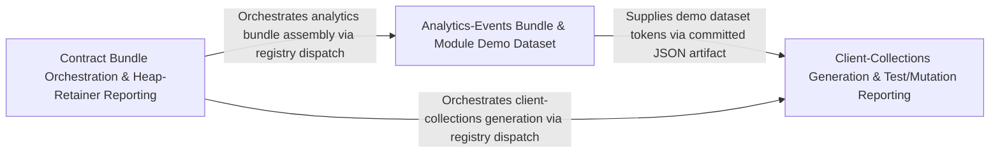

---
tags:
  - 2repo
  - 2repo/arch
  - project/boilerplate-node-backend
type: architecture
component: Contract_Bundle_Orchestration_Test_Heap_Reporting
---

## Details

The composition root of the contract pipeline. It owns bundle selection (named vs. full run, --check staleness semantics, generated-vs-authored distinction) and drives the assembly of the committed bundles, including the opt-in client collections (Bruno/Insomnia/Mockoon/Postman) built from the committed OpenAPI contract plus per-module probes.ts and the demo dataset. It also carries the secondary reporting surface — test-result bucketing and heap-retainer/heap-summary reporting — that surfaces run health alongside the contract build.

### Analytics-Events Bundle & Module Demo Dataset
Owns the assembly of the analytics-events contract bundle and the per-module demo/seed dataset that the contract probes reference. It validates that the assembled analytics slice matches the source records (assertSliceMatches) and supplies the seed facts (orders, cart items, inventory stock lines) that the client-collection probes tokenize rather than hard-code. This is the data + slice half of the contract pipeline: it turns module domain records into a verifiable, committed analytics bundle and the fixture tokens the probes consume.

**Related Classes/Methods**:

- `src.modules.orders.demo.seedOrdersCollection`:138-139
- `src.modules.cart.model.CartItem`:32-35
- `src.modules.inventory.service.StockLine`:43-46

**Source Files:**

- `scripts/contracts/analytics-events-bundle.ts`
  - `scripts.contracts.analytics-events-bundle.assertSliceMatches.sliced` (L203-L203) - Class
  - `scripts.contracts.analytics-events-bundle.assertSliceMatches.sliced.map() callback` (L203-L203) - Function
- `scripts/report-heap-summary.ts`
  - `scripts.report-heap-summary.streamArray('nodes') callback` (L131-L165) - Function
- `src/infrastructure/http/middlewares/request-logger.ts`
  - `src.infrastructure.http.middlewares.request-logger.requestLogger` (L10-L35) - Class
  - `src.infrastructure.http.middlewares.request-logger.requestLogger.response.once('finish') callback` (L14-L32) - Function
- `src/infrastructure/i18n/context.ts`
  - `src.infrastructure.i18n.context.LocaleContext` (L26-L29) - Interface
- `src/infrastructure/persistence/base-repository.ts`
  - `src.infrastructure.persistence.base-repository.createBaseRepository.deleteOne.then() callback` (L297-L297) - Function
  - `src.infrastructure.persistence.base-repository.createBaseRepository.search.then() callback` (L322-L328) - Function
- `src/kernel/events.ts`
  - `src.kernel.events.DomainEventMap` (L22-L22) - Interface
- `src/modules/account/services/addresses.ts`
  - `src.modules.account.services.addresses.AddressesView` (L26-L28) - Interface
  - `src.modules.account.services.addresses.toView.addresses.map() callback` (L43-L43) - Function
  - `src.modules.account.services.addresses.then() callback.book.items.find() callback` (L95-L95) - Function
- `src/modules/cart/model.ts`
  - `src.modules.cart.model.CartItem` (L32-L35) - Interface
- `src/modules/cart/services/checkout.ts`
  - `src.modules.cart.services.checkout.toStockLines` (L42-L43) - Class
  - `src.modules.cart.services.checkout.toStockLines.lines.map() callback` (L43-L43) - Function
  - `src.modules.cart.services.checkout.orderConfirm` (L85-L294) - Class
  - `src.modules.cart.services.checkout.orderConfirm.<function>` (L93-L268) - Function
  - `src.modules.cart.services.checkout.orderConfirm.<function>.then() callback` (L127-L267) - Function
  - `src.modules.cart.services.checkout.orderConfirm.<function>.then() callback.then() callback.joined` (L165-L165) - Class
  - `src.modules.cart.services.checkout.orderConfirm.<function>.then() callback.then() callback.joined.lines.filter() callback` (L165-L165) - Function
  - `src.modules.cart.services.checkout.orderConfirm.<function>.then() callback.then() callback.then() callback` (L197-L265) - Function
  - `src.modules.cart.services.checkout.orderConfirm.<function>.then() callback.then() callback.then() callback.then() callback` (L228-L264) - Function
  - `src.modules.cart.services.checkout.orderConfirm.<function>.then() callback.then() callback.then() callback.then() callback.then() callback` (L256-L262) - Function
  - `src.modules.cart.services.checkout.orderConfirm.catch() callback` (L269-L269) - Function
- `src/modules/cart/services/items.ts`
  - `src.modules.cart.services.items.cartRemove` (L207-L217) - Class
  - `src.modules.cart.services.items.cartRemove.then() callback` (L208-L216) - Function
- `src/modules/cart/services/view.ts`
  - `src.modules.cart.services.view.CartLine` (L24-L27) - Interface
  - `src.modules.cart.services.view.CartView` (L38-L41) - Interface
  - `src.modules.cart.services.view.PopulatedCart` (L50-L52) - Interface
  - `src.modules.cart.services.view.readCartLines` (L63-L76) - Class
  - `src.modules.cart.services.view.readCartLines.productIds` (L66-L66) - Class
  - `src.modules.cart.services.view.readCartLines.productIds.cart.items.map() callback` (L66-L66) - Function
  - `src.modules.cart.services.view.readCartLines.then() callback` (L69-L74) - Function
  - `src.modules.cart.services.view.readCartLines.then() callback.items.map() callback` (L70-L74) - Function
  - `src.modules.cart.services.view.toCartView` (L87-L101) - Class
  - `src.modules.cart.services.view.toCartView.then() callback` (L88-L101) - Function
  - `src.modules.cart.services.view.toCartView.then() callback.items.lines.map() callback` (L91-L94) - Function
- `src/modules/inventory/service.ts`
  - `src.modules.inventory.service.StockLine` (L43-L46) - Interface
  - `src.modules.inventory.service.StockShortfall` (L49-L54) - Interface
  - `src.modules.inventory.service.MovementFilters` (L72-L75) - Interface
- `src/modules/orders/demo.ts`
  - `src.modules.orders.demo.seedOrdersCollection` (L138-L139) - Class
  - `src.modules.orders.demo.seedOrdersCollection.orderFixtures.map() callback` (L139-L139) - Function
- `src/modules/orders/emails.ts`
  - `src.modules.orders.emails.orderConfirmEmail.data.lines.order.items.map() callback` (L50-L55) - Function
  - `src.modules.orders.emails.invoiceDocument.lines.order.items.map() callback` (L88-L93) - Function
- `src/modules/wishlist/service.ts`
  - `src.modules.wishlist.service.WishlistView` (L26-L28) - Interface
  - `src.modules.wishlist.service.toWishlistView.items.map() callback` (L32-L32) - Function

### Client-Collections Generation & Test/Mutation Reporting
The opt-in client-collection generator plus the test/mutation run-health surface. It builds the four tool documents (Bruno/Insomnia/Mockoon/Postman) from the committed OpenAPI contract, the per-module PROBES map, and the demo dataset tokens, exposing allProbes for coverage checks and contentFor for each tool's committed document. In parallel it carries the secondary reporting: per-module test-result bucketing (Report/Bucket/SuiteResult) and the Stryker mutation-test runner with its OOM/strand-loop guard. This is the generate collections + report run health half of the pipeline.

**Related Classes/Methods**:

- `scripts.run-mutation-tests.main`:78-124

**Source Files:**

- `scripts/run-mutation-tests.ts`
  - `scripts.run-mutation-tests.main` (L78-L124) - Class
  - `scripts.run-mutation-tests.main.stryker.stdout.on('data') callback` (L99-L119) - Function
  - `scripts.run-mutation-tests.main.stryker.on('exit') callback` (L121-L123) - Function
- `src/cluster.ts`
  - `src.cluster.process.on('SIGTERM') callback` (L158-L158) - Function
  - `src.cluster.process.on('SIGINT') callback` (L159-L159) - Function
- `src/infrastructure/adapters/mailer.ts`
  - `src.infrastructure.adapters.mailer.withSpan('email.send') callback.then() callback` (L191-L200) - Function
- `src/modules/account/model.ts`
  - `src.modules.account.model.AddressItem` (L19-L34) - Interface
  - `src.modules.account.model.AddressBookDocument` (L37-L42) - Interface
- `src/modules/delivery/service.ts`
  - `src.modules.delivery.service.shipOrder.user` (L82-L82) - Class
  - `src.modules.delivery.service.shipOrder.user.catch() callback` (L82-L82) - Function
- `src/modules/products/model.ts`
  - `src.modules.products.model.ProductSnapshot` (L28-L37) - Interface
  - `src.modules.products.model.ProductDocument` (L42-L42) - Interface

### Contract Bundle Orchestration & Heap-Retainer Reporting
The top-level composition root of the contract pipeline. It owns bundle selection (named vs. full run, --check staleness semantics, generated-vs-authored distinction), validates unknown bundle names, and drives assembly of the committed bundles while refusing --check for the generated client collections. It also carries the heap-retainer reporting surface (report-heap-retainers) that answers who is holding these? by building the reverse edge index of a heap snapshot, and wires the demo/telemetry install hooks that the contract build depends on. This is the orchestrate the build + report heap health half of the pipeline.

**Related Classes/Methods**:

- `src.app.demo.installDemo`:45-58
- `src.app.telemetry.installTelemetry`:23-43

**Source Files:**

- `scripts/build-contract-bundles.ts`
  - `scripts.build-contract-bundles.unknown` (L36-L36) - Class
  - `scripts.build-contract-bundles.unknown.named.filter() callback` (L36-L36) - Function
- `scripts/contracts/client-collections-bundle.ts`
  - `scripts.contracts.client-collections-bundle.allProbes` (L260-L261) - Class
  - `scripts.contracts.client-collections-bundle.allProbes.requests.filter() callback` (L261-L261) - Function
  - `scripts.contracts.client-collections-bundle.contentFor` (L264-L269) - Class
  - `scripts.contracts.client-collections-bundle.contentFor.<function>` (L264-L269) - Function
- `scripts/report-heap-retainers.ts`
  - `scripts.report-heap-retainers.main.totalBytes` (L213-L213) - Class
  - `scripts.report-heap-retainers.main.totalBytes.targets.reduce() callback` (L213-L213) - Function
- `scripts/report-test-results.ts`
  - `scripts.report-test-results.SuiteResult` (L51-L63) - Interface
  - `scripts.report-test-results.Report` (L65-L71) - Interface
  - `scripts.report-test-results.Bucket` (L124-L129) - Interface
  - `scripts.report-test-results.labelWidth` (L274-L274) - Class
  - `scripts.report-test-results.labelWidth.covered.map() callback` (L274-L274) - Function
- `src/app/demo.ts`
  - `src.app.demo.runDemoSeed` (L34-L43) - Class
  - `src.app.demo.runDemoSeed.then() callback.enabledModules.map() callback` (L38-L38) - Function
  - `src.app.demo.runDemoSeed.then() callback` (L41-L43) - Function
  - `src.app.demo.installDemo` (L45-L58) - Class
  - `src.app.demo.installDemo.app.post('/__demo/reset') callback` (L46-L53) - Function
  - `src.app.demo.installDemo.app.post('/__demo/reset') callback.then() callback` (L48-L48) - Function
  - `src.app.demo.installDemo.app.post('/__demo/reset') callback.catch() callback` (L49-L52) - Function
  - `src.app.demo.installDemo.app.get('/__demo/emails') callback` (L55-L57) - Function
- `src/app/telemetry.ts`
  - `src.app.telemetry.installTelemetry` (L23-L43) - Class
  - `src.app.telemetry.installTelemetry.app.use() callback` (L27-L42) - Function
  - `src.app.telemetry.installTelemetry.app.use() callback.response.once('finish') callback` (L30-L40) - Function
- `src/infrastructure/adapters/mailer.ts`
  - `src.infrastructure.adapters.mailer.EmailContent` (L248-L264) - Interface
  - `src.infrastructure.adapters.mailer.then() callback` (L289-L289) - Function
- `src/infrastructure/i18n/negotiate.ts`
  - `src.infrastructure.i18n.negotiate.negotiateLocale.lowercaseSupported` (L31-L31) - Class
  - `src.infrastructure.i18n.negotiate.negotiateLocale.lowercaseSupported.supported.map() callback` (L31-L31) - Function
  - `src.infrastructure.i18n.negotiate.negotiateLocale.candidates` (L33-L53) - Class
  - `src.infrastructure.i18n.negotiate.negotiateLocale.candidates.map() callback` (L35-L50) - Function
  - `src.infrastructure.i18n.negotiate.negotiateLocale.candidates.filter() callback` (L51-L51) - Function
  - `src.infrastructure.i18n.negotiate.negotiateLocale.candidates.toSorted() callback` (L53-L53) - Function
