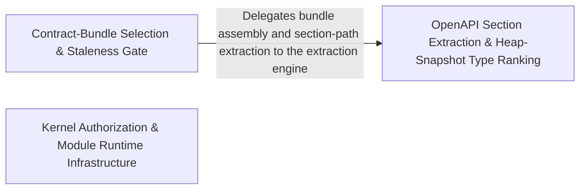

---
tags:
  - 2repo
  - 2repo/arch
  - project/boilerplate-node-backend
type: architecture
component: Contract_Bundle_Selection_Slowest_Suite_Test_Reporting
---

## Details

Orchestrates the contract-bundle build pipeline: selects authored (committed) vs. generated (client collections) bundles by name, assembles them from fragments via redocly bundle / section compilation, checks staleness against committed copies, and writes only drifted outputs. In parallel, parses Jest's JSON test report to produce per-module bucket summaries (suites/tests/failed/time), ranks the slowest suites and tests, and lists failures by module. The bundle selection is the contract-first generation pipeline entry point; the test reporting is the performance observability entry point. The group also carries the OpenAPI section/path extraction and the client-collection section builder that drive the four tool emitters.

### Contract-Bundle Selection & Staleness Gate
The contract-first generation pipeline entry point and performance-observability entry point. Parses CLI arguments to select authored vs. generated bundles by name, validates bundle names against the registry, assembles each bundle from YAML fragments, checks staleness by comparing assembled output against the committed copy, and writes only drifted outputs. In --check mode it acts as a CI gate. In parallel, it parses Jest's JSON test report to produce per-module bucket summaries, ranks the slowest suites and tests by wall-clock duration, and lists failures grouped by module.

**Related Classes/Methods**:

- `scripts.build-contract-bundles.selected`
- `scripts.contracts.analytics-events-bundle.content.slices`:245-249

**Source Files:**

- `scripts/build-contract-bundles.ts`
  - `scripts.build-contract-bundles.selected` (L64-L64) - Class
  - `scripts.build-contract-bundles.selected.named.map() callback` (L64-L64) - Function
- `scripts/contracts/analytics-events-bundle.ts`
  - `scripts.contracts.analytics-events-bundle.content.slices` (L245-L249) - Class
  - `scripts.contracts.analytics-events-bundle.content.slices.map() callback` (L245-L249) - Function

### OpenAPI Section Extraction & Heap-Snapshot Type Ranking
The extraction and ranking layer providing the section/path extraction engine and the heap-snapshot streaming ranker. On the contract side, it parses the root OpenAPI spec to identify system-owned paths and extracts per-module path lists via textual regex over YAML source. On the diagnostics side, it streams a V8 .heapsnapshot file in chunks, aggregates retained-size by type, and ranks the top-N dominant types. Both flows share the extract → aggregate → rank pattern over a large structured source.

**Related Classes/Methods**:

- `scripts.contracts.openapi-bundle.rootPaths`:85-92
- `scripts.contracts.openapi-bundle.sectionPaths`:95-100
- `scripts.report-heap-summary.main.wanted`

**Source Files:**

- `scripts/contracts/openapi-bundle.ts`
  - `scripts.contracts.openapi-bundle.rootPaths` (L85-L92) - Class
  - `scripts.contracts.openapi-bundle.rootPaths.filter() callback` (L90-L90) - Function
  - `scripts.contracts.openapi-bundle.rootPaths.map() callback` (L91-L91) - Function
  - `scripts.contracts.openapi-bundle.sectionPaths` (L95-L100) - Class
  - `scripts.contracts.openapi-bundle.sectionPaths.map() callback` (L99-L99) - Function
- `scripts/report-heap-summary.ts`
  - `scripts.report-heap-summary.main.wanted` (L168-L168) - Class
  - `scripts.report-heap-summary.main.wanted.ranked.map() callback` (L168-L168) - Function
- `scripts/report-test-results.ts`
  - `scripts.report-test-results.slowestSuites` (L181-L187) - Class
  - `scripts.report-test-results.slowestSuites.report.testResults.map() callback` (L182-L185) - Function
  - `scripts.report-test-results.slowestSuites.toSorted() callback` (L186-L186) - Function

### Kernel Authorization & Module Runtime Infrastructure
The domain-agnostic kernel primitives and module-level runtime infrastructure that the e-commerce domain modules depend on. Includes the kernel's authorization scope factory with restrictNonAdmin guard, HTTP validation-message registration mapping Zod error codes to i18n-localised messages, the i18n locale-override refresh loop, the observability heap-size-limit gauge exposing V8 heap headroom as a Prometheus metric, and module-level controllers and services forming the business-core execution path.

**Related Classes/Methods**:

- `src.kernel.authorization.createOwnerScope`:52-53
- `src.infrastructure.http.validation-messages.registerValidationMessages`:102-104
- `src.infrastructure.observability.metrics-http._heapSizeLimitGauge`:68-75
- `src.modules.account.controllers.delete-expired-tokens.deleteExpiredTokens`:13-32
- `src.infrastructure.i18n.overrides.startLocaleOverrideRefresh`:132-136

**Source Files:**

- `src/infrastructure/http/validation-messages.ts`
  - `src.infrastructure.http.validation-messages.registerValidationMessages` (L102-L104) - Class
  - `src.infrastructure.http.validation-messages.registerValidationMessages.customError` (L103-L103) - Method
- `src/infrastructure/i18n/overrides.ts`
  - `src.infrastructure.i18n.overrides.startLocaleOverrideRefresh` (L132-L136) - Class
  - `src.infrastructure.i18n.overrides.startLocaleOverrideRefresh.setInterval() callback` (L134-L134) - Function
- `src/infrastructure/observability/metrics-http.ts`
  - `src.infrastructure.observability.metrics-http._heapSizeLimitGauge` (L68-L75) - Class
  - `src.infrastructure.observability.metrics-http._heapSizeLimitGauge.collect` (L72-L74) - Method
- `src/kernel/authorization.ts`
  - `src.kernel.authorization.createOwnerScope` (L52-L53) - Class
  - `src.kernel.authorization.createOwnerScope.restrictNonAdmin() callback` (L53-L53) - Function
- `src/modules/account/controllers/delete-expired-tokens.ts`
  - `src.modules.account.controllers.delete-expired-tokens.deleteExpiredTokens` (L13-L32) - Class
  - `src.modules.account.controllers.delete-expired-tokens.deleteExpiredTokens.then() callback` (L19-L30) - Function
- `src/modules/account/controllers/post-login.ts`
  - `src.modules.account.controllers.post-login.postLogin` (L74-L155) - Class
  - `src.modules.account.controllers.post-login.then() callback` (L109-L109) - Function
  - `src.modules.account.controllers.post-login.postLogin.then() callback` (L110-L148) - Function
  - `src.modules.account.controllers.post-login.then() callback.then() callback` (L130-L138) - Function
  - `src.modules.account.controllers.post-login.postLogin.then() callback.then() callback` (L139-L147) - Function
  - `src.modules.account.controllers.post-login.postLogin.catch() callback` (L149-L154) - Function
- `src/modules/account/services/authentication.ts`
  - `src.modules.account.services.authentication.requestAccountDeletion.then() callback` (L70-L89) - Function
  - `src.modules.account.services.authentication.logoutCurrentSession` (L180-L193) - Class
  - `src.modules.account.services.authentication.logoutCurrentSession.then() callback` (L185-L192) - Function
  - `src.modules.account.services.authentication.signup` (L255-L335) - Class
  - `src.modules.account.services.authentication.tokenRemoveAll` (L377-L411) - Class
  - `src.modules.account.services.authentication.tokenRemoveAll.then() callback.then() callback` (L399-L399) - Function
  - `src.modules.account.services.authentication.tokenRemoveAll.catch() callback` (L402-L402) - Function
  - `src.modules.account.services.authentication.tokenRemoveAll.then() callback` (L403-L411) - Function
- `src/modules/cart/demo.ts`
  - `src.modules.cart.demo.seedCartsCollection` (L50-L51) - Class
  - `src.modules.cart.demo.seedCartsCollection.cartFixtures.map() callback` (L51-L51) - Function
- `src/modules/cart/services/reorder.ts`
  - `src.modules.cart.services.reorder.reorderIntoCart.then() callback.then() callback.addable` (L99-L99) - Class
  - `src.modules.cart.services.reorder.reorderIntoCart.then() callback.then() callback.addable.lines.filter() callback` (L99-L99) - Function
  - `src.modules.cart.services.reorder.reorderIntoCart.then() callback` (L123-L139) - Function
- `src/modules/delivery/service.ts`
  - `src.modules.delivery.service.getForOrder` (L52-L62) - Class
  - `src.modules.delivery.service.getForOrder.then() callback` (L56-L62) - Function
  - `src.modules.delivery.service.getForOrder.then() callback.then() callback` (L58-L61) - Function
- `src/modules/orders/service.ts`
  - `src.modules.orders.service.update.updateItemsPromise.then() callback.then() callback.missingProduct` (L296-L296) - Class
  - `src.modules.orders.service.update.updateItemsPromise.then() callback.then() callback.missingProduct.resolvedItems.some() callback` (L296-L296) - Function
- `src/modules/wishlist/demo.ts`
  - `src.modules.wishlist.demo.seedWishlistsCollection` (L48-L49) - Class
  - `src.modules.wishlist.demo.seedWishlistsCollection.wishlistFixtures.map() callback` (L49-L49) - Function
