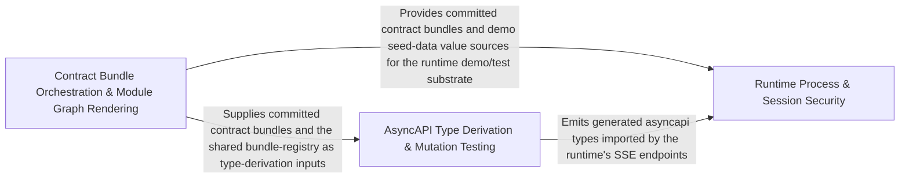

---
tags:
  - 2repo
  - 2repo/arch
  - project/boilerplate-node-backend
type: architecture
component: Contract_Type_Graph_Derivation
---

## Details

The downstream derivation layer that transforms committed contracts into machine-consumable artefacts. It generates TypeScript channel/message/model types from the AsyncAPI document (for gen:asyncapi), builds the module dependency and event-edge graph (for architecture documentation and tooling), and orchestrates the two-phase build ordering (compiled bundles first, then generated collections) that ensures derived artefacts always read a current contract.

### Runtime Process & Session Security
This sub-component owns the server's process lifecycle and the session-security primitives that the contract-driven test and demo infrastructure relies on. It manages the primary/secondary cluster model (graceful SIGINT/SIGTERM handling, forced-shutdown timers), exports seed collections for deterministic demo data, and implements the JWT refresh-token rotation protocol (reuse detection, reissue, revocation) that the account module's authentication service depends on. It is the runtime substrate that makes the contract's auth endpoints exercisable in both production and the paired-frontend demo.

**Related Classes/Methods**:

- `src.infrastructure.persistence.seed.exportCollection`:95-104
- `src.modules.account.services.authentication.refreshAccessToken`:249-294
- `src.modules.account.session.jwt.recordRefreshTokenUse`:189-193

**Source Files:**

- `src/cluster.ts`
  - `src.cluster.startPrimaryShutdown.forceShutdownTimer` (L106-L113) - Class
  - `src.cluster.startPrimaryShutdown.forceShutdownTimer.setTimeout() callback` (L106-L113) - Function
  - `src.cluster.cluster.on('exit') callback` (L120-L156) - Function
  - `src.cluster.process.on('SIGTERM') callback` (L158-L158) - Function
  - `src.cluster.process.on('SIGINT') callback` (L159-L159) - Function
- `src/infrastructure/persistence/seed.ts`
  - `src.infrastructure.persistence.seed.exportCollection` (L95-L104) - Class
  - `src.infrastructure.persistence.seed.exportCollection.then() callback` (L104-L104) - Function
  - `src.infrastructure.persistence.seed.exportCollection.then() callback.documents.map() callback` (L104-L104) - Function
- `src/modules/account/repository.ts`
  - `src.modules.account.repository.addressBookRepository.updateEntry.entry` (L76-L76) - Class
  - `src.modules.account.repository.addressBookRepository.updateEntry.entry.book.items.find() callback` (L76-L76) - Function
- `src/modules/account/services/authentication.ts`
  - `src.modules.account.services.authentication.MissingRefreshTokenError` (L231-L236) - Class
  - `src.modules.account.services.authentication.MissingRefreshTokenError.constructor` (L232-L235) - Constructor
  - `src.modules.account.services.authentication.refreshAccessToken` (L249-L294) - Class
  - `src.modules.account.services.authentication.refreshAccessToken.then() callback` (L257-L265) - Function
  - `src.modules.account.services.authentication.refreshAccessToken.catch() callback` (L266-L294) - Function
- `src/modules/account/session/jwt.ts`
  - `src.modules.account.session.jwt.recordRefreshTokenUse` (L189-L193) - Class
  - `src.modules.account.session.jwt.recordRefreshTokenUse.then() callback` (L192-L192) - Function
  - `src.modules.account.session.jwt.recordRefreshTokenUse.catch() callback` (L193-L193) - Function
  - `src.modules.account.session.jwt.TokenReuseError` (L222-L227) - Class
  - `src.modules.account.session.jwt.TokenReuseError.constructor` (L223-L226) - Constructor
  - `src.modules.account.session.jwt.revokeAllRefreshTokens` (L230-L233) - Class
  - `src.modules.account.session.jwt.revokeAllRefreshTokens.then() callback` (L233-L233) - Function
  - `src.modules.account.session.jwt.reissueRotated` (L246-L273) - Class
  - `src.modules.account.session.jwt.reissueRotated.then() callback` (L252-L273) - Function
  - `src.modules.account.session.jwt.reissueRotated.then() callback.then() callback.then() callback` (L264-L264) - Function
  - `src.modules.account.session.jwt.reissueRotated.then() callback.then() callback` (L265-L272) - Function
  - `src.modules.account.session.jwt.rotateRefreshToken` (L300-L358) - Class
  - `src.modules.account.session.jwt.rotateRefreshToken.<function>` (L303-L312) - Function
  - `src.modules.account.session.jwt.rotateRefreshToken.<function>.verify() callback` (L305-L311) - Function
  - `src.modules.account.session.jwt.rotateRefreshToken.then() callback` (L312-L358) - Function
  - `src.modules.account.session.jwt.rotateRefreshToken.then() callback.then() callback` (L323-L357) - Function
  - `src.modules.account.session.jwt.rotateRefreshToken.then() callback.then() callback.then() callback` (L326-L356) - Function
  - `src.modules.account.session.jwt.rotateRefreshToken.then() callback.then() callback.then() callback.then() callback` (L353-L355) - Function

### Contract Bundle Orchestration & Module Graph Rendering
This sub-component is the build orchestrator for the contract pipeline. It assembles authored contract bundles (OpenAPI, AsyncAPI) from per-module YAML fragments via redocly bundle, enforcing the two-phase ordering where compiled bundles are written before any generated collection reads them; generates the module dependency and event-edge graph by invoking dependency-cruiser over src/modules/, reading domain-event subscriptions from each module's events.ts, and rendering Mermaid flowcharts into docs/modules/index.md and per-module pages between HTML markers; and syncs byte-identical shared files (the generated types, contract bundles) to the paired frontend repo. The --check mode turns every artefact into a CI gate that fails on drift.

**Related Classes/Methods**:

- `scripts.build-contract-bundles.authored`
- `scripts.generate-module-graph.render`:214-258
- `scripts.generate-module-graph.renderNeighbourhood`:159-212
- `scripts.generate-module-graph.readEventEdges`:129-156
- `scripts.sync-shared-files-to-frontend.list`:101-102

**Source Files:**

- `scripts/build-contract-bundles.ts`
  - `scripts.build-contract-bundles.named` (L34-L34) - Class
  - `scripts.build-contract-bundles.named.arguments_.filter() callback` (L34-L34) - Function
  - `scripts.build-contract-bundles.CONTRACT_BUNDLES.map() callback` (L40-L40) - Function
  - `scripts.build-contract-bundles.bundle` (L48-L53) - Class
  - `scripts.build-contract-bundles.bundle.stale` (L50-L50) - Class
  - `scripts.build-contract-bundles.bundle.stale.assembled.filter() callback` (L50-L50) - Function
  - `scripts.build-contract-bundles.bundle.stale.map() callback` (L52-L52) - Function
  - `scripts.build-contract-bundles.authored` (L107-L107) - Class
  - `scripts.build-contract-bundles.authored.CONTRACT_BUNDLES.filter() callback` (L107-L107) - Function
  - `scripts.build-contract-bundles.stale.map() callback` (L128-L128) - Function
- `scripts/generate-module-graph.ts`
  - `scripts.generate-module-graph.EventEdge` (L42-L46) - Interface
  - `scripts.generate-module-graph.Target` (L49-L54) - Interface
  - `scripts.generate-module-graph.readEdges` (L74-L107) - Class
  - `scripts.generate-module-graph.readEdges.edges.toSorted() callback` (L106-L106) - Function
  - `scripts.generate-module-graph.readEventEdges` (L129-L156) - Class
  - `scripts.generate-module-graph.readEventEdges.edges.toSorted() callback` (L151-L154) - Function
  - `scripts.generate-module-graph.renderNeighbourhood` (L159-L212) - Class
  - `scripts.generate-module-graph.renderNeighbourhood.byKind` (L182-L183) - Class
  - `scripts.generate-module-graph.renderNeighbourhood.byKind.map() callback` (L183-L183) - Function
  - `scripts.generate-module-graph.renderNeighbourhood.byKind.neighbours.filter() callback` (L183-L183) - Function
  - `scripts.generate-module-graph.render` (L214-L258) - Class
  - `scripts.generate-module-graph.render.declare` (L217-L217) - Class
  - `scripts.generate-module-graph.render.declare.names.map() callback` (L217-L217) - Function
  - `scripts.generate-module-graph.render.byKind` (L218-L219) - Class
  - `scripts.generate-module-graph.render.byKind.map() callback` (L219-L219) - Function
  - `scripts.generate-module-graph.render.byKind.names.filter() callback` (L219-L219) - Function
  - `scripts.generate-module-graph.render.edges.map() callback` (L228-L228) - Function
  - `scripts.generate-module-graph.render.names.map() callback` (L247-L251) - Function
  - `scripts.generate-module-graph.names.map() callback.reaches` (L248-L248) - Class
  - `scripts.generate-module-graph.render.names.map() callback.reaches.edges.filter() callback` (L248-L248) - Function
  - `scripts.generate-module-graph.render.names.map() callback.reaches.map() callback` (L248-L248) - Function
  - `scripts.generate-module-graph.names.map() callback.reached` (L249-L249) - Class
  - `scripts.generate-module-graph.render.names.map() callback.reached.edges.filter() callback` (L249-L249) - Function
  - `scripts.generate-module-graph.render.names.map() callback.reached.map() callback` (L249-L249) - Function
  - `scripts.generate-module-graph.render.toSorted() callback` (L252-L252) - Function
  - `scripts.generate-module-graph.render.map() callback` (L254-L255) - Function
  - `scripts.generate-module-graph.targets` (L297-L312) - Class
  - `scripts.generate-module-graph.targets.map() callback` (L305-L310) - Function
  - `scripts.generate-module-graph.then() callback` (L323-L325) - Function
- `scripts/mutation-baseline.ts`
  - `scripts.mutation-baseline.scoresFromReport.killed` (L111-L111) - Class
  - `scripts.mutation-baseline.scoresFromReport.killed.scored.filter() callback` (L111-L111) - Function
- `scripts/sync-shared-files-to-frontend.ts`
  - `scripts.sync-shared-files-to-frontend.list` (L101-L102) - Class
  - `scripts.sync-shared-files-to-frontend.list.items.map() callback` (L102-L102) - Function

### AsyncAPI Type Derivation & Mutation Testing
This sub-component is the type and artefact derivation engine. It parses the committed asyncapi.yaml and, via @asyncapi/modelina, generates the TypeScript payload interfaces, message aliases, per-namespace channel constants, and SSE event-name/payload maps into src/types/asyncapi.generated.ts; compiles the per-module OpenAPI fragments into the committed openapi.yaml (with MODULE_SECTIONS membership guarded against src/modules.ts drift); configures the four client collections (Bruno, Insomnia, Mockoon, Postman) by wiring module-owned paths, seed-data value sources, and rejection probes into the @guebbit/openapi-runnable-collections emitter; and provides the mutation-testing harness (MutationBaseline, compareToBaseline, run-mutation-diff) that detects when a contract change silently alters generated types, plus the test-result reporter that surfaces failures and wall-clock timing.

**Related Classes/Methods**:

- `scripts.generate-asyncapi-types.collectChannelMessageEntries`:146-163
- `scripts.generate-asyncapi-types.toPascalCase`:90-97
- `scripts.contracts.client-collections-bundle.sections`:56-57
- `scripts.mutation-baseline.compareToBaseline`:156-175

**Source Files:**

- `scripts/contracts/client-collections-bundle.ts`
  - `scripts.contracts.client-collections-bundle.sections` (L56-L57) - Class
  - `scripts.contracts.client-collections-bundle.sections.SECTION_ORDER.map() callback` (L57-L57) - Function
- `scripts/contracts/openapi-bundle.ts`
  - `scripts.contracts.openapi-bundle.rootPaths` (L122-L129) - Class
  - `scripts.contracts.openapi-bundle.rootPaths.filter() callback` (L127-L127) - Function
  - `scripts.contracts.openapi-bundle.rootPaths.map() callback` (L128-L128) - Function
  - `scripts.contracts.openapi-bundle.sectionPaths` (L132-L137) - Class
  - `scripts.contracts.openapi-bundle.sectionPaths.map() callback` (L136-L136) - Function
- `scripts/generate-asyncapi-types.ts`
  - `scripts.generate-asyncapi-types.toPascalCase` (L90-L97) - Class
  - `scripts.generate-asyncapi-types.toPascalCase.map() callback` (L96-L96) - Function
  - `scripts.generate-asyncapi-types.collectChannelMessageEntries` (L146-L163) - Class
  - `scripts.generate-asyncapi-types.collectChannelMessageEntries.filter() callback` (L152-L152) - Function
  - `scripts.generate-asyncapi-types.collectChannelMessageEntries.map() callback` (L153-L162) - Function
  - `scripts.generate-asyncapi-types.collectChannelMessageEntries.toSorted() callback` (L163-L163) - Function
  - `scripts.generate-asyncapi-types.renderPayloadMap.rows` (L188-L192) - Class
  - `scripts.generate-asyncapi-types.renderPayloadMap.rows.entries.map() callback` (L190-L190) - Function
  - `scripts.generate-asyncapi-types.modelNameConstraints` (L255-L257) - Class
  - `scripts.generate-asyncapi-types.modelNameConstraints.NAMING_FORMATTER` (L256-L256) - Method
  - `scripts.generate-asyncapi-types.messageTypeBlocks` (L294-L304) - Class
  - `scripts.generate-asyncapi-types.messageTypeBlocks.map() callback` (L295-L303) - Function
- `scripts/generate-module-graph.ts`
  - `scripts.generate-module-graph.render.isolated` (L220-L220) - Class
  - `scripts.generate-module-graph.render.isolated.map() callback` (L220-L220) - Function
  - `scripts.generate-module-graph.render.isolated.names.filter() callback` (L220-L220) - Function
- `scripts/mutation-baseline.ts`
  - `scripts.mutation-baseline.MutationProfile` (L35-L40) - Interface
  - `scripts.mutation-baseline.MutationReport` (L67-L69) - Interface
  - `scripts.mutation-baseline.MutationBaseline` (L71-L76) - Interface
  - `scripts.mutation-baseline.FileComparison` (L80-L85) - Interface
  - `scripts.mutation-baseline.compareToBaseline` (L156-L175) - Class
  - `scripts.mutation-baseline.compareToBaseline.files.map() callback` (L163-L174) - Function
- `scripts/report-test-results.ts`
  - `scripts.report-test-results.wall` (L157-L160) - Class
  - `scripts.report-test-results.wall.report.testResults.reduce() callback` (L158-L158) - Function
  - `scripts.report-test-results.failures.report.testResults.flatMap() callback` (L209-L218) - Function
  - `scripts.report-test-results.failures` (L209-L219) - Class
  - `scripts.report-test-results.failures.report.testResults.flatMap() callback.suite.assertionResults.filter() callback` (L211-L211) - Function
  - `scripts.report-test-results.failures.report.testResults.flatMap() callback.map() callback` (L212-L218) - Function
- `scripts/run-mutation-diff.ts`
  - `scripts.run-mutation-diff.changedFiles` (L70-L79) - Class
  - `scripts.run-mutation-diff.changedFiles.map() callback` (L76-L76) - Function
  - `scripts.run-mutation-diff.filter() callback` (L77-L77) - Function
  - `scripts.run-mutation-diff.changedFiles.filter() callback` (L79-L79) - Function
