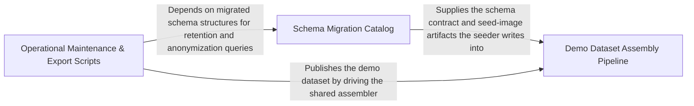

---
tags:
  - 2repo
  - 2repo/arch
  - project/boilerplate-node-backend
type: architecture
component: Database_Migrations_Demo_Dataset
---

## Details

Owns the MongoDB schema evolution (timestamped migration files), the demo dataset assembly pipeline (seed → serialize → export), and operational maintenance scripts (reap-orders, reap-quarantine, reap-inactive-accounts, generate-seed-images, cache-clear) that keep the database healthy and the demo profile reproducible.

### Schema Migration Catalog [[Expand]](./Schema_Migration_Catalog.md)
The ordered, timestamped, reversible migration files that own MongoDB schema evolution — index creation/pruning, column renames and backfills, soft-delete flags, and locale-collection shaping. Each migration exposes up/down and is written to be idempotent and lossless (e.g. $rename guarded by $exists). This is the SCHEMA half of the subsystem, deliberately separated from the DATA half owned by the seeder. It also carries the reproducible seed-image generation that feeds the demo catalogue.

**Related Classes/Methods**: _None_

**Source Files:**

- `db/demo/assemble.ts`
  - `db.demo.assemble.reconcileShapes.orphaned` (L148-L148) - Class
  - `db.demo.assemble.reconcileShapes.orphaned.filter() callback` (L148-L148) - Function
  - `db.demo.assemble.reconcileShapes.problems` (L150-L158) - Class
  - `db.demo.assemble.reconcileShapes.problems.unlabelled.map() callback` (L152-L153) - Function
  - `db.demo.assemble.reconcileShapes.problems.orphaned.map() callback` (L156-L156) - Function
- `db/demo/index.ts`
  - `db.demo.index.seed.perModule` (L62-L64) - Class
  - `db.demo.index.seed.perModule.enabledModules.map() callback` (L63-L63) - Function
- `db/migrations/20240101000000-initial-indexes.js`
  - `db.migrations.20240101000000-initial-indexes.<unknown>` (L27-L81) - Class
  - `db.migrations.20240101000000-initial-indexes.<unknown>.up` (L28-L59) - Method
  - `db.migrations.20240101000000-initial-indexes.<unknown>.down` (L61-L80) - Method
- `db/migrations/20260806140000-image-url-separators.js`
  - `db.migrations.20260806140000-image-url-separators.<unknown>` (L84-L129) - Class
  - `db.migrations.20260806140000-image-url-separators.<unknown>.up` (L85-L116) - Method
  - `db.migrations.20260806140000-image-url-separators.<unknown>.down` (L118-L128) - Method
- `db/migrations/20260808200000-users-email-unique.js`
  - `db.migrations.20260808200000-users-email-unique.<unknown>` (L47-L98) - Class
  - `db.migrations.20260808200000-users-email-unique.<unknown>.up` (L48-L79) - Method
  - `db.migrations.20260808200000-users-email-unique.<unknown>.down` (L81-L97) - Method
- `db/migrations/20260813091000-product-stock-column.js`
  - `db.migrations.20260813091000-product-stock-column.<unknown>` (L14-L28) - Class
  - `db.migrations.20260813091000-product-stock-column.<unknown>.up` (L15-L19) - Method
  - `db.migrations.20260813091000-product-stock-column.<unknown>.down` (L21-L27) - Method
- `db/migrations/20260817120000-inventory-counters.js`
  - `db.migrations.20260817120000-inventory-counters.<unknown>` (L30-L89) - Class
  - `db.migrations.20260817120000-inventory-counters.<unknown>.up` (L31-L73) - Method
  - `db.migrations.20260817120000-inventory-counters.<unknown>.up.catch() callback` (L70-L72) - Function
  - `db.migrations.20260817120000-inventory-counters.<unknown>.down` (L75-L88) - Method
- `db/migrations/20260818160000-locale-base-language.js`
  - `db.migrations.20260818160000-locale-base-language.<unknown>` (L21-L45) - Class
  - `db.migrations.20260818160000-locale-base-language.<unknown>.up` (L22-L35) - Method
  - `db.migrations.20260818160000-locale-base-language.<unknown>.down` (L37-L44) - Method
- `db/migrations/20260901120000-hash-user-tokens.js`
  - `db.migrations.20260901120000-hash-user-tokens.<unknown>.up.tokens.user.tokens.map() callback` (L38-L39) - Function
  - `db.migrations.20260901120000-hash-user-tokens.<unknown>.up.tokens` (L38-L40) - Class
- `db/migrations/20260901230000-orders-detach-orphaned-userid.js`
  - `db.migrations.20260901230000-orders-detach-orphaned-userid.<unknown>` (L20-L47) - Class
  - `db.migrations.20260901230000-orders-detach-orphaned-userid.<unknown>.up` (L21-L32) - Method
  - `db.migrations.20260901230000-orders-detach-orphaned-userid.<unknown>.down` (L34-L46) - Method
- `k6/browse.js`
  - `k6.browse.default` (L51-L72) - Function
  - `k6.browse.default.group('catalogue') callback` (L52-L66) - Function
  - `k6.browse.default.group('catalogue') callback.'list answers 200'` (L55-L55) - Method
  - `k6.browse.default.group('catalogue') callback.'list carries items'` (L56-L56) - Method
  - `k6.browse.default.group('catalogue') callback.'detail answers 200'` (L64-L64) - Method
  - `k6.browse.default.group('facets') callback` (L68-L71) - Function
  - `k6.browse.default.group('facets') callback.'facets answer 200'` (L70-L70) - Method
- `scripts/generate-seed-images.ts`
  - `scripts.generate-seed-images.ImageEntry` (L32-L35) - Interface
  - `scripts.generate-seed-images.catch() callback` (L145-L148) - Function
- `scripts/reap-quarantine.ts`
  - `scripts.reap-quarantine.runScript() callback` (L61-L61) - Function
- `scripts/regenerate-artifacts.ts`
  - `scripts.regenerate-artifacts.Step` (L31-L36) - Interface
- `src/globals.d.ts`
  - `src.globals.d.'express-serve-static-core'.Request` (L12-L39) - Interface
- `src/infrastructure/adapters/filesystem.ts`
  - `src.infrastructure.adapters.filesystem.deleteFile` (L47-L56) - Class
  - `src.infrastructure.adapters.filesystem.deleteFile.toolkitDeleteFile() callback` (L49-L55) - Function
- `src/infrastructure/adapters/image-signatures.ts`
  - `src.infrastructure.adapters.image-signatures.ImageFormat` (L19-L30) - Interface
  - `src.infrastructure.adapters.image-signatures.identifyImage` (L89-L94) - Class
  - `src.infrastructure.adapters.image-signatures.identifyImage.SUPPORTED_IMAGE_FORMATS.find() callback` (L91-L93) - Function
  - `src.infrastructure.adapters.image-signatures.identifyImage.SUPPORTED_IMAGE_FORMATS.find() callback.format.bytes.every() callback` (L93-L93) - Function
- `src/infrastructure/adapters/image-store.ts`
  - `src.infrastructure.adapters.image-store.ImageStore` (L24-L92) - Interface
  - `src.infrastructure.adapters.image-store.ImageStore.quarantine` (L34-L34) - Method
  - `src.infrastructure.adapters.image-store.ImageStore.readQuarantined` (L43-L43) - Method
  - `src.infrastructure.adapters.image-store.ImageStore.removeQuarantined` (L54-L54) - Method
  - `src.infrastructure.adapters.image-store.ImageStore.promote` (L67-L67) - Method
  - `src.infrastructure.adapters.image-store.ImageStore.putDerivative` (L79-L79) - Method
  - `src.infrastructure.adapters.image-store.ImageStore.remove` (L91-L91) - Method
  - `src.infrastructure.adapters.image-store.filesystemImageStore` (L160-L218) - Class
  - `src.infrastructure.adapters.image-store.filesystemImageStore.quarantine` (L161-L169) - Method
  - `src.infrastructure.adapters.image-store.filesystemImageStore.readQuarantined` (L171-L171) - Method
  - `src.infrastructure.adapters.image-store.filesystemImageStore.removeQuarantined` (L173-L173) - Method
  - `src.infrastructure.adapters.image-store.filesystemImageStore.promote` (L175-L184) - Method
  - `src.infrastructure.adapters.image-store.filesystemImageStore.putDerivative` (L186-L193) - Method
  - `src.infrastructure.adapters.image-store.filesystemImageStore.remove` (L195-L217) - Method
  - `src.infrastructure.adapters.image-store.filesystemImageStore.remove.then() callback` (L215-L215) - Function
- `src/infrastructure/adapters/image.worker.ts`
  - `src.infrastructure.adapters.image.worker.DigestedImageUrls` (L35-L40) - Interface
  - `src.infrastructure.adapters.image.worker.digestQuarantinedImage` (L83-L101) - Class
  - `src.infrastructure.adapters.image.worker.digestQuarantinedImage.then() callback` (L84-L101) - Function
  - `src.infrastructure.adapters.image.worker.then() callback.then() callback` (L90-L94) - Function
  - `src.infrastructure.adapters.image.worker.digestQuarantinedImage.then() callback.then() callback` (L96-L99) - Function
  - `src.infrastructure.adapters.image.worker.digestQuarantinedImage.then() callback.then() callback.then() callback` (L99-L99) - Function
  - `src.infrastructure.adapters.image.worker.settleWriteback` (L115-L134) - Class
  - `src.infrastructure.adapters.image.worker.settleWriteback.then() callback` (L122-L134) - Function
  - `src.infrastructure.adapters.image.worker.settleWriteback.then() callback.then() callback` (L133-L133) - Function
  - `src.infrastructure.adapters.image.worker.handleImageDigestJob` (L143-L173) - Class
  - `src.infrastructure.adapters.image.worker.handleImageDigestJob.then() callback` (L161-L162) - Function
  - `src.infrastructure.adapters.image.worker.handleImageDigestJob.then() callback.then() callback` (L162-L162) - Function
  - `src.infrastructure.adapters.image.worker.handleImageDigestJob.catch() callback` (L164-L172) - Function
  - `src.infrastructure.adapters.image.worker.handleImageDigestJob.catch() callback.then() callback` (L171-L171) - Function
  - `src.infrastructure.adapters.image.worker.enqueueImageDigest.runInline` (L189-L194) - Class
  - `src.infrastructure.adapters.image.worker.enqueueImageDigest.runInline.then() callback` (L190-L193) - Function
- `src/infrastructure/adapters/mailer.ts`
  - `src.infrastructure.adapters.mailer.withSpan('email.send') callback.then() callback` (L180-L189) - Function
  - `src.infrastructure.adapters.mailer.EmailContent` (L229-L241) - Interface
  - `src.infrastructure.adapters.mailer.then() callback` (L265-L265) - Function
- `src/infrastructure/adapters/storage.ts`
  - `src.infrastructure.adapters.storage.withLocaleRestored` (L196-L205) - Class
  - `src.infrastructure.adapters.storage.withLocaleRestored.<function>` (L198-L205) - Function
  - `src.infrastructure.adapters.storage.withLocaleRestored.<function>.middleware() callback` (L199-L205) - Function
  - `src.infrastructure.adapters.storage.withLocaleRestored.<function>.middleware() callback.runWithLocaleContext() callback` (L204-L204) - Function
  - `src.infrastructure.adapters.storage.validateUploadedImages` (L220-L267) - Class
  - `src.infrastructure.adapters.storage.validateUploadedImages.paths.map() callback` (L234-L234) - Function
  - `src.infrastructure.adapters.storage.validateUploadedImages.then() callback` (L235-L265) - Function
  - `src.infrastructure.adapters.storage.validateUploadedImages.then() callback.then() callback` (L256-L263) - Function
  - `src.infrastructure.adapters.storage.validateUploadedImages.catch() callback` (L266-L266) - Function
  - `src.infrastructure.adapters.storage.quarantineUploadedImages` (L281-L331) - Class
  - `src.infrastructure.adapters.storage.quarantineUploadedImages.staged.map() callback` (L291-L291) - Function
  - `src.infrastructure.adapters.storage.quarantineUploadedImages.then() callback` (L292-L329) - Function
  - `src.infrastructure.adapters.storage.quarantineUploadedImages.then() callback.staged.map() callback` (L298-L298) - Function
  - `src.infrastructure.adapters.storage.quarantineUploadedImages.then() callback.results.filter() callback` (L302-L302) - Function
  - `src.infrastructure.adapters.storage.quarantineUploadedImages.then() callback.map() callback` (L303-L303) - Function
  - `src.infrastructure.adapters.storage.then() callback.then() callback` (L304-L304) - Function
  - `src.infrastructure.adapters.storage.quarantineUploadedImages.then() callback.then() callback` (L319-L323) - Function
  - `src.infrastructure.adapters.storage.then() callback.then() callback.digested.map() callback` (L320-L320) - Function
  - `src.infrastructure.adapters.storage.quarantineUploadedImages.then() callback.then() callback.digested.map() callback` (L321-L321) - Function
  - `src.infrastructure.adapters.storage.quarantineUploadedImages.then() callback.catch() callback` (L324-L327) - Function
  - `src.infrastructure.adapters.storage.quarantineUploadedImages.then() callback.catch() callback.keys.map() callback` (L325-L325) - Function
  - `src.infrastructure.adapters.storage.quarantineUploadedImages.then() callback.catch() callback.then() callback` (L325-L326) - Function
- `src/infrastructure/http/errors.ts`
  - `src.infrastructure.http.errors.ExtendedError` (L25-L67) - Class
  - `src.infrastructure.http.errors.ExtendedError.constructor` (L44-L66) - Constructor
- `src/infrastructure/http/uploads.ts`
  - `src.infrastructure.http.uploads.getFormFiles` (L29-L48) - Function
- `src/infrastructure/persistence/search.ts`
  - `src.infrastructure.persistence.search.PaginationResult` (L20-L24) - Interface
  - `src.infrastructure.persistence.search.PaginatedMeta` (L27-L32) - Interface
- `src/infrastructure/runtime/otel-sdk.ts`
  - `src.infrastructure.runtime.otel-sdk.buildProcessors.headers.map() callback` (L68-L73) - Function
- `src/infrastructure/runtime/server-lifecycle.ts`
  - `src.infrastructure.runtime.server-lifecycle.registerSignalHandlers` (L86-L129) - Class
  - `src.infrastructure.runtime.server-lifecycle.registerSignalHandlers.onProcessSignal` (L91-L123) - Class
  - `src.infrastructure.runtime.server-lifecycle.registerSignalHandlers.onProcessSignal.forcedExitTimer` (L97-L100) - Class
  - `src.infrastructure.runtime.server-lifecycle.registerSignalHandlers.onProcessSignal.forcedExitTimer.setTimeout() callback` (L97-L100) - Function
  - `src.infrastructure.runtime.server-lifecycle.onProcessSignal.then() callback` (L108-L108) - Function
  - `src.infrastructure.runtime.server-lifecycle.registerSignalHandlers.onProcessSignal.then() callback` (L109-L114) - Function
  - `src.infrastructure.runtime.server-lifecycle.registerSignalHandlers.onProcessSignal.catch() callback` (L115-L122) - Function
  - `src.infrastructure.runtime.server-lifecycle.registerSignalHandlers.process.on('SIGTERM') callback` (L126-L126) - Function
  - `src.infrastructure.runtime.server-lifecycle.registerSignalHandlers.process.on('SIGINT') callback` (L128-L128) - Function
- `src/modules/account/analytics.ts`
  - `src.modules.account.analytics.'@infrastructure/observability/analytics'.AnalyticsEventMap` (L24-L26) - Interface
- `src/modules/account/audit.ts`
  - `src.modules.account.audit.'@infrastructure/observability/audit'.AuditActionMap` (L51-L53) - Interface
- `src/modules/audit-logs/model.ts`
  - `src.modules.audit-logs.model.AuditLogDocument` (L34-L36) - Interface
- `src/modules/cart/analytics.ts`
  - `src.modules.cart.analytics.'@infrastructure/observability/analytics'.AnalyticsEventMap` (L34-L36) - Interface
- `src/modules/cart/audit.ts`
  - `src.modules.cart.audit.'@infrastructure/observability/audit'.AuditActionMap` (L21-L23) - Interface
- `src/modules/cart/model.ts`
  - `src.modules.cart.model.CartDocument` (L34-L50) - Interface
- `src/modules/delivery/audit.ts`
  - `src.modules.delivery.audit.'@infrastructure/observability/audit'.AuditActionMap` (L17-L19) - Interface
- `src/modules/feedback/audit.ts`
  - `src.modules.feedback.audit.'@infrastructure/observability/audit'.AuditActionMap` (L18-L20) - Interface
- `src/modules/feedback/model.ts`
  - `src.modules.feedback.model.FeedbackRequestDocument` (L29-L34) - Interface
- `src/modules/inventory/audit.ts`
  - `src.modules.inventory.audit.'@infrastructure/observability/audit'.AuditActionMap` (L20-L22) - Interface
- `src/modules/inventory/events.ts`
  - `src.modules.inventory.events.'@kernel/events'.DomainEventMap` (L14-L21) - Interface
- `src/modules/locales/audit.ts`
  - `src.modules.locales.audit.'@infrastructure/observability/audit'.AuditActionMap` (L27-L29) - Interface
- `src/modules/locales/module.ts`
  - `src.modules.locales.module.registerLocaleOverrideProvider() callback` (L31-L31) - Function
- `src/modules/orders/analytics.ts`
  - `src.modules.orders.analytics.'@infrastructure/observability/analytics'.AnalyticsEventMap` (L26-L28) - Interface
- `src/modules/orders/audit.ts`
  - `src.modules.orders.audit.'@infrastructure/observability/audit'.AuditActionMap` (L25-L27) - Interface
- `src/modules/orders/events.ts`
  - `src.modules.orders.events.'@kernel/events'.DomainEventMap` (L13-L28) - Interface
- `src/modules/orders/service.ts`
  - `src.modules.orders.service.detachUserId` (L425-L433) - Class
  - `src.modules.orders.service.detachUserId.then() callback` (L429-L432) - Function
- `src/modules/payments/analytics.ts`
  - `src.modules.payments.analytics.'@infrastructure/observability/analytics'.AnalyticsEventMap` (L18-L20) - Interface
- `src/modules/payments/audit.ts`
  - `src.modules.payments.audit.'@infrastructure/observability/audit'.AuditActionMap` (L16-L18) - Interface
- `src/modules/products/analytics.ts`
  - `src.modules.products.analytics.'@infrastructure/observability/analytics'.AnalyticsEventMap` (L18-L20) - Interface
- `src/modules/products/audit.ts`
  - `src.modules.products.audit.'@infrastructure/observability/audit'.AuditActionMap` (L17-L19) - Interface
- `src/modules/products/events.ts`
  - `src.modules.products.events.'@kernel/events'.DomainEventMap` (L10-L19) - Interface
- `src/modules/products/service.ts`
  - `src.modules.products.service.sanitizeStringArray` (L47-L50) - Class
  - `src.modules.products.service.sanitizeStringArray.values.map() callback` (L49-L49) - Function
  - `src.modules.products.service.create` (L163-L186) - Class
  - `src.modules.products.service.create.then() callback` (L176-L186) - Function
  - `src.modules.products.service.update` (L195-L238) - Class
  - `src.modules.products.service.update.then() callback` (L232-L237) - Function
  - `src.modules.products.service.update.then() callback.then() callback` (L234-L235) - Function
- `src/modules/users/analytics.ts`
  - `src.modules.users.analytics.'@infrastructure/observability/analytics'.AnalyticsEventMap` (L21-L23) - Interface
- `src/modules/users/audit.ts`
  - `src.modules.users.audit.'@infrastructure/observability/audit'.AuditActionMap` (L27-L29) - Interface
- `src/modules/users/events.ts`
  - `src.modules.users.events.'@kernel/events'.DomainEventMap` (L10-L23) - Interface
- `src/modules/wishlist/analytics.ts`
  - `src.modules.wishlist.analytics.'@infrastructure/observability/analytics'.AnalyticsEventMap` (L19-L21) - Interface
- `src/types/auth-context.ts`
  - `src.types.auth-context.AuthContext` (L10-L29) - Interface

### Demo Dataset Assembly Pipeline [[Expand]](./Demo_Dataset_Assembly_Pipeline.md)
The DATA half of the subsystem — the demo seeder runner and the single shared assembler that turns whatever is in the database into the published, byte-stable demo-data.json. db/demo/index.ts is the domain-agnostic runner (connection, production gate, walk over enabledModules, cache invalidation); db/demo/assemble.ts reads rows back through the real serializers, flattens to plain JSON, sorts keys for determinism, and validates that every <something>Id reference resolves to a published record. This is the seed → serialize → export core that both the export script and the migration demo-data test import, guaranteeing one definition of the dataset.

**Related Classes/Methods**: _None_

**Source Files:**

- `db/demo/assemble.ts`
  - `db.demo.assemble.reconcileShapes.unlabelled` (L147-L147) - Class
  - `db.demo.assemble.reconcileShapes.unlabelled.filter() callback` (L147-L147) - Function
  - `db.demo.assemble.assembleDemoDataset.sections` (L168-L170) - Class
  - `db.demo.assemble.assembleDemoDataset.sections.enabledModules.map() callback` (L169-L169) - Function
- `db/migrations/20260806120000-user-locale.js`
  - `db.migrations.20260806120000-user-locale.<unknown>` (L19-L34) - Class
  - `db.migrations.20260806120000-user-locale.<unknown>.up` (L20-L24) - Method
  - `db.migrations.20260806120000-user-locale.<unknown>.down` (L26-L33) - Method
- `db/migrations/20260808120000-user-active-column.js`
  - `db.migrations.20260808120000-user-active-column.<unknown>` (L16-L30) - Class
  - `db.migrations.20260808120000-user-active-column.<unknown>.up` (L17-L21) - Method
  - `db.migrations.20260808120000-user-active-column.<unknown>.down` (L23-L29) - Method
- `db/migrations/20260808200000-users-email-unique.js`
  - `db.migrations.20260808200000-users-email-unique.<unknown>.up.report` (L52-L54) - Class
  - `db.migrations.20260808200000-users-email-unique.<unknown>.up.report.duplicates.map() callback` (L53-L53) - Function
- `db/migrations/20260810120000-orders-soft-delete.js`
  - `db.migrations.20260810120000-orders-soft-delete.<unknown>` (L16-L42) - Class
  - `db.migrations.20260810120000-orders-soft-delete.<unknown>.up` (L17-L21) - Method
  - `db.migrations.20260810120000-orders-soft-delete.<unknown>.down` (L23-L41) - Method
- `db/migrations/20260817140000-locale-collections.js`
  - `db.migrations.20260817140000-locale-collections.<unknown>` (L31-L67) - Class
  - `db.migrations.20260817140000-locale-collections.<unknown>.up` (L32-L43) - Method
  - `db.migrations.20260817140000-locale-collections.<unknown>.down` (L45-L66) - Method
- `db/migrations/20260822120000-locale-entry-tenant.js`
  - `db.migrations.20260822120000-locale-entry-tenant.<unknown>` (L23-L82) - Class
  - `db.migrations.20260822120000-locale-entry-tenant.<unknown>.up` (L24-L56) - Method
  - `db.migrations.20260822120000-locale-entry-tenant.<unknown>.down` (L58-L81) - Method
- `src/app.ts`
  - `src.app.startServer.then() callback.<function>.server` (L113-L117) - Class
  - `src.app.startServer.then() callback.<function>.server.app.listen() callback` (L113-L117) - Function
- `src/infrastructure/adapters/cache.ts`
  - `src.infrastructure.adapters.cache.cacheConnection` (L51-L103) - Class
  - `src.infrastructure.adapters.cache.cacheConnection.isReady` (L57-L57) - Method
  - `src.infrastructure.adapters.cache.cacheConnection.connect` (L58-L85) - Method
  - `src.infrastructure.adapters.cache.cacheConnection.connect.then() callback` (L84-L84) - Function
  - `src.infrastructure.adapters.cache.cacheConnection.close` (L86-L102) - Method
  - `src.infrastructure.adapters.cache.close.then() callback` (L96-L96) - Function
  - `src.infrastructure.adapters.cache.cacheConnection.close.then() callback` (L99-L99) - Function
  - `src.infrastructure.adapters.cache.getCacheValue` (L139-L156) - Class
  - `src.infrastructure.adapters.cache.getCacheValue.then() callback` (L142-L148) - Function
  - `src.infrastructure.adapters.cache.getCacheValue.then() callback.then() callback` (L147-L147) - Function
  - `src.infrastructure.adapters.cache.getCacheValue.catch() callback` (L149-L156) - Function
  - `src.infrastructure.adapters.cache.setCacheValue` (L167-L213) - Class
  - `src.infrastructure.adapters.cache.setCacheValue.then() callback` (L183-L205) - Function
  - `src.infrastructure.adapters.cache.setCacheValue.then() callback.then() callback.cacheTags.map() callback` (L199-L199) - Function
  - `src.infrastructure.adapters.cache.setCacheValue.then() callback.then() callback` (L203-L203) - Function
  - `src.infrastructure.adapters.cache.setCacheValue.catch() callback` (L206-L212) - Function
  - `src.infrastructure.adapters.cache.invalidateCacheTags` (L225-L267) - Class
  - `src.infrastructure.adapters.cache.invalidateCacheTags.then() callback` (L231-L258) - Function
  - `src.infrastructure.adapters.cache.invalidateCacheTags.then() callback.cacheTags.map() callback` (L238-L253) - Function
  - `src.infrastructure.adapters.cache.then() callback.cacheTags.map() callback.then() callback` (L247-L247) - Function
  - `src.infrastructure.adapters.cache.invalidateCacheTags.then() callback.cacheTags.map() callback.then() callback.then() callback` (L251-L251) - Function
  - `src.infrastructure.adapters.cache.invalidateCacheTags.then() callback.then() callback` (L254-L257) - Function
  - `src.infrastructure.adapters.cache.invalidateCacheTags.then() callback.then() callback.deleted.perTag.reduce() callback` (L255-L255) - Function
  - `src.infrastructure.adapters.cache.invalidateCacheTags.catch() callback` (L259-L266) - Function
  - `src.infrastructure.adapters.cache.ClearCacheResult` (L276-L287) - Interface
- `src/infrastructure/adapters/image-signatures.ts`
  - `src.infrastructure.adapters.image-signatures.extensionForImage` (L135-L136) - Class
  - `src.infrastructure.adapters.image-signatures.extensionForImage.SUPPORTED_IMAGE_FORMATS.find() callback` (L136-L136) - Function
- `src/infrastructure/adapters/managed-connection.ts`
  - `src.infrastructure.adapters.managed-connection.ManagedConnectionOptions` (L17-L65) - Interface
  - `src.infrastructure.adapters.managed-connection.ManagedConnection` (L68-L111) - Interface
  - `src.infrastructure.adapters.managed-connection.manageConnection` (L119-L249) - Class
  - `src.infrastructure.adapters.managed-connection.manageConnection.NotConfigured` (L159-L159) - Class
  - `src.infrastructure.adapters.managed-connection.manageConnection.attempt.running` (L167-L184) - Class
  - `src.infrastructure.adapters.managed-connection.manageConnection.attempt.running.then() callback` (L168-L175) - Function
  - `src.infrastructure.adapters.managed-connection.manageConnection.attempt.running.catch() callback` (L176-L180) - Function
  - `src.infrastructure.adapters.managed-connection.manageConnection.attempt.running.finally() callback` (L181-L184) - Function
  - `src.infrastructure.adapters.managed-connection.get` (L199-L207) - Class
  - `src.infrastructure.adapters.managed-connection.manageConnection.get.catch() callback` (L206-L206) - Function
  - `src.infrastructure.adapters.managed-connection.manageConnection.state` (L213-L220) - Method
  - `src.infrastructure.adapters.managed-connection.manageConnection.forget` (L222-L224) - Method
  - `src.infrastructure.adapters.managed-connection.manageConnection.stop` (L228-L247) - Method
  - `src.infrastructure.adapters.managed-connection.manageConnection.stop.catch() callback` (L240-L240) - Function
  - `src.infrastructure.adapters.managed-connection.manageConnection.stop.finally() callback` (L241-L245) - Function
- `src/infrastructure/adapters/queue.ts`
  - `src.infrastructure.adapters.queue.queueConnection` (L85-L146) - Class
  - `src.infrastructure.adapters.queue.queueConnection.isReady` (L94-L94) - Method
  - `src.infrastructure.adapters.queue.queueConnection.connect` (L95-L128) - Method
  - `src.infrastructure.adapters.queue.connect.then() callback` (L106-L116) - Function
  - `src.infrastructure.adapters.queue.connect.then() callback.superviseHandle() callback` (L109-L112) - Function
  - `src.infrastructure.adapters.queue.queueConnection.connect.then() callback` (L117-L126) - Function
  - `src.infrastructure.adapters.queue.queueConnection.connect.then() callback.superviseHandle() callback` (L122-L124) - Function
  - `src.infrastructure.adapters.queue.queueConnection.close` (L129-L145) - Method
  - `src.infrastructure.adapters.queue.queueConnection.close.finally() callback` (L141-L143) - Function
  - `src.infrastructure.adapters.queue.then() callback` (L238-L238) - Function
  - `src.infrastructure.adapters.queue.PublishOptions` (L259-L270) - Interface
  - `src.infrastructure.adapters.queue.ConsumeOptions` (L319-L328) - Interface
  - `src.infrastructure.adapters.queue.then() callback.then() callback` (L427-L427) - Function
- `src/infrastructure/http/middlewares/cache.ts`
  - `src.infrastructure.http.middlewares.cache.CachedResponse` (L20-L23) - Interface
  - `src.infrastructure.http.middlewares.cache.CacheOptions` (L124-L154) - Interface
  - `src.infrastructure.http.middlewares.cache.armCacheWrite` (L221-L240) - Class
  - `src.infrastructure.http.middlewares.cache.armCacheWrite.<function>` (L228-L239) - Function
  - `src.infrastructure.http.middlewares.cache.setCache` (L250-L342) - Class
  - `src.infrastructure.http.middlewares.cache.setCache.<function>` (L255-L341) - Function
  - `src.infrastructure.http.middlewares.cache.setCache.<function>.then() callback` (L325-L340) - Function
  - `src.infrastructure.http.middlewares.cache.invalidateCache` (L367-L389) - Class
  - `src.infrastructure.http.middlewares.cache.invalidateCache.<function>` (L368-L389) - Function
  - `src.infrastructure.http.middlewares.cache.invalidateCache.<function>.response.on('finish') callback` (L369-L386) - Function
  - `src.infrastructure.http.middlewares.cache.invalidateCache.<function>.response.on('finish') callback.then() callback` (L373-L385) - Function
- `src/infrastructure/http/middlewares/rate-limit-store.ts`
  - `src.infrastructure.http.middlewares.rate-limit-store.build` (L52-L70) - Class
  - `src.infrastructure.http.middlewares.rate-limit-store.build.redisClient.on('error') callback` (L67-L67) - Function
  - `src.infrastructure.http.middlewares.rate-limit-store.connectionFor` (L80-L132) - Class
  - `src.infrastructure.http.middlewares.rate-limit-store.connectionFor.connection` (L89-L121) - Class
  - `src.infrastructure.http.middlewares.rate-limit-store.connectionFor.connection.isEnabled` (L95-L95) - Method
  - `src.infrastructure.http.middlewares.rate-limit-store.connectionFor.connection.connect` (L96-L108) - Method
  - `src.infrastructure.http.middlewares.rate-limit-store.connection.connect.then() callback` (L101-L101) - Function
  - `src.infrastructure.http.middlewares.rate-limit-store.connectionFor.connection.connect.then() callback` (L102-L106) - Function
  - `src.infrastructure.http.middlewares.rate-limit-store.connectionFor.connection.isReady` (L109-L109) - Method
  - `src.infrastructure.http.middlewares.rate-limit-store.connectionFor.connection.close` (L110-L118) - Method
  - `src.infrastructure.http.middlewares.rate-limit-store.connection.close.then() callback` (L114-L114) - Function
  - `src.infrastructure.http.middlewares.rate-limit-store.connectionFor.connection.close.then() callback` (L115-L115) - Function
  - `src.infrastructure.http.middlewares.rate-limit-store.connectionFor.connection.onRecovered` (L119-L120) - Method
  - `src.infrastructure.http.middlewares.rate-limit-store.connectionFor.forget` (L125-L128) - Method
  - `src.infrastructure.http.middlewares.rate-limit-store.send` (L141-L157) - Class
  - `src.infrastructure.http.middlewares.rate-limit-store.send.then() callback` (L144-L155) - Function
  - `src.infrastructure.http.middlewares.rate-limit-store.send.then() callback.catch() callback` (L150-L155) - Function
  - `src.infrastructure.http.middlewares.rate-limit-store.lazyRedisStore` (L167-L208) - Class
  - `src.infrastructure.http.middlewares.rate-limit-store.lazyRedisStore.store` (L171-L197) - Class
  - `src.infrastructure.http.middlewares.rate-limit-store.lazyRedisStore.store.sendCommand` (L177-L177) - Method
  - `src.infrastructure.http.middlewares.rate-limit-store.lazyRedisStore.store.catch() callback` (L187-L193) - Function
  - `src.infrastructure.http.middlewares.rate-limit-store.lazyRedisStore.init` (L200-L202) - Method
  - `src.infrastructure.http.middlewares.rate-limit-store.lazyRedisStore.increment` (L203-L203) - Method
  - `src.infrastructure.http.middlewares.rate-limit-store.lazyRedisStore.decrement` (L204-L204) - Method
  - `src.infrastructure.http.middlewares.rate-limit-store.lazyRedisStore.resetKey` (L205-L205) - Method
  - `src.infrastructure.http.middlewares.rate-limit-store.lazyRedisStore.get` (L206-L206) - Method
- `src/infrastructure/http/middlewares/rate-limit.ts`
  - `src.infrastructure.http.middlewares.rate-limit.mfaChallengeLimiter` (L222-L243) - Class
  - `src.infrastructure.http.middlewares.rate-limit.mfaChallengeLimiter.keyGenerator` (L233-L242) - Method

### Operational Maintenance & Export Scripts [[Expand]](./Operational_Maintenance_Export_Scripts.md)
The one-shot operational scripts that keep the database healthy and the demo profile reproducible. This includes the demo-dataset publisher (export-demo-dataset.ts, which seeds a throwaway in-memory DB and writes/--checks demo-data.json), the periodic PII/retention reapers (reap-orders, reap-inactive-accounts, reap-quarantine), and the manual cache invalidation (cache-clear.ts). All are wrapped by the shared runScript harness for non-zero exit codes, guaranteed cleanup, and readable errors. This group is the keep-it-healthy-and-reproducible surface of the subsystem.

**Related Classes/Methods**:

- `scripts.export-demo-dataset.run`:34-71
- `scripts.reap-orders.main`:24-27

**Source Files:**

- `db/cache-clear.ts`
  - `db.cache-clear.runScript() callback` (L41-L41) - Function
- `db/demo/assemble.ts`
  - `db.demo.assemble.sortKeys` (L74-L82) - Class
  - `db.demo.assemble.sortKeys.value.map() callback` (L75-L75) - Function
  - `db.demo.assemble.sortKeys.toSorted() callback` (L79-L79) - Function
  - `db.demo.assemble.sortKeys.map() callback` (L80-L80) - Function
  - `db.demo.assemble.assembleDemoDataset` (L167-L206) - Class
  - `db.demo.assemble.assembleDemoDataset.shapes` (L186-L189) - Class
  - `db.demo.assemble.assembleDemoDataset.shapes.enabledModules.map() callback` (L188-L188) - Function
  - `db.demo.assemble.assembleDemoDataset.dangling.map() callback` (L202-L202) - Function
- `db/demo/index.ts`
  - `db.demo.index.seed` (L38-L92) - Function
  - `db.demo.index.seed.created` (L67-L67) - Class
  - `db.demo.index.seed.created.results.filter() callback` (L67-L67) - Function
  - `db.demo.index.runScript() callback` (L100-L100) - Function
- `db/migrations/20260808160000-cart-collection.js`
  - `db.migrations.20260808160000-cart-collection.<unknown>` (L24-L99) - Class
  - `db.migrations.20260808160000-cart-collection.<unknown>.up` (L25-L58) - Method
  - `db.migrations.20260808160000-cart-collection.<unknown>.up.updateOne.update.$set.items.user.cart.items.map() callback` (L38-L41) - Function
  - `db.migrations.20260808160000-cart-collection.<unknown>.down` (L60-L98) - Method
  - `db.migrations.20260808160000-cart-collection.<unknown>.down.updateOne.update.$set.cart.items.cart.items.map() callback` (L74-L77) - Function
  - `db.migrations.20260808160000-cart-collection.<unknown>.down.catch() callback` (L95-L97) - Function
- `db/migrations/20260808180000-prune-unused-indexes.js`
  - `db.migrations.20260808180000-prune-unused-indexes.<unknown>` (L34-L55) - Class
  - `db.migrations.20260808180000-prune-unused-indexes.<unknown>.up` (L35-L43) - Method
  - `db.migrations.20260808180000-prune-unused-indexes.<unknown>.down` (L45-L54) - Method
- `db/migrations/20260813090000-user-verified-column.js`
  - `db.migrations.20260813090000-user-verified-column.<unknown>` (L15-L29) - Class
  - `db.migrations.20260813090000-user-verified-column.<unknown>.up` (L16-L20) - Method
  - `db.migrations.20260813090000-user-verified-column.<unknown>.down` (L22-L28) - Method
- `db/migrations/20260818120000-locale-entry-scope.js`
  - `db.migrations.20260818120000-locale-entry-scope.<unknown>` (L21-L68) - Class
  - `db.migrations.20260818120000-locale-entry-scope.<unknown>.up` (L22-L42) - Method
  - `db.migrations.20260818120000-locale-entry-scope.<unknown>.down` (L44-L67) - Method
- `db/migrations/20260901120000-hash-user-tokens.js`
  - `db.migrations.20260901120000-hash-user-tokens.<unknown>` (L30-L57) - Class
  - `db.migrations.20260901120000-hash-user-tokens.<unknown>.up` (L31-L43) - Method
  - `db.migrations.20260901120000-hash-user-tokens.<unknown>.down` (L45-L56) - Method
- `scripts/contracts/openapi-bundle.ts`
  - `scripts.contracts.openapi-bundle.assertModuleSectionsAreCurrent.missing` (L82-L82) - Class
  - `scripts.contracts.openapi-bundle.assertModuleSectionsAreCurrent.missing.filter() callback` (L82-L82) - Function
- `scripts/export-demo-dataset.ts`
  - `scripts.export-demo-dataset.run` (L34-L71) - Class
  - `scripts.export-demo-dataset.run.enabledModules.map() callback` (L42-L42) - Function
  - `scripts.export-demo-dataset.then() callback` (L75-L78) - Function
- `scripts/generate-module-graph.ts`
  - `scripts.generate-module-graph.renderNeighbourhood.reaches` (L164-L164) - Class
  - `scripts.generate-module-graph.renderNeighbourhood.reaches.edges.filter() callback` (L164-L164) - Function
  - `scripts.generate-module-graph.renderNeighbourhood.reaches.map() callback` (L198-L198) - Function
- `scripts/reap-inactive-accounts.ts`
  - `scripts.reap-inactive-accounts.initI18n` (L66-L78) - Class
  - `scripts.reap-inactive-accounts.initI18n.enabledModules.map() callback` (L69-L69) - Function
  - `scripts.reap-inactive-accounts.initI18n.filter() callback` (L70-L70) - Function
  - `scripts.reap-inactive-accounts.runScript() callback` (L127-L127) - Function
- `scripts/reap-orders.ts`
  - `scripts.reap-orders.main` (L24-L27) - Class
  - `scripts.reap-orders.then() callback` (L26-L26) - Function
  - `scripts.reap-orders.main.then() callback` (L27-L27) - Function
- `scripts/report-test-results.ts`
  - `scripts.report-test-results.SuiteResult` (L51-L62) - Interface
  - `scripts.report-test-results.Report` (L64-L70) - Interface
  - `scripts.report-test-results.Bucket` (L123-L128) - Interface
  - `scripts.report-test-results.suite.assertionResults.filter() callback` (L138-L138) - Function
  - `scripts.report-test-results.width` (L169-L169) - Class
  - `scripts.report-test-results.width.rows.map() callback` (L169-L169) - Function
  - `scripts.report-test-results.labelWidth` (L273-L273) - Class
  - `scripts.report-test-results.labelWidth.covered.map() callback` (L273-L273) - Function
- `scripts/run-demo-server.ts`
  - `scripts.run-demo-server.waitForDatabase` (L42-L57) - Class
  - `scripts.run-demo-server.waitForDatabase.<function>` (L43-L57) - Function
  - `scripts.run-demo-server.then() callback` (L60-L90) - Function
  - `scripts.run-demo-server.then() callback.process.once() callback` (L66-L71) - Function
  - `scripts.run-demo-server.then() callback.process.once() callback.catch() callback` (L69-L69) - Function
  - `scripts.run-demo-server.then() callback.process.once() callback.then() callback` (L70-L70) - Function
  - `scripts.run-demo-server.then() callback.then() callback.waitForDatabase() callback` (L82-L82) - Function
  - `scripts.run-demo-server.then() callback.then() callback` (L85-L89) - Function
  - `scripts.run-demo-server.catch() callback` (L91-L94) - Function
- `scripts/run-mutation-tests.ts`
  - `scripts.run-mutation-tests.wasPassed` (L44-L44) - Class
  - `scripts.run-mutation-tests.wasPassed.passthrough.some() callback` (L44-L44) - Function
- `src/app.ts`
  - `src.app.startServer` (L64-L121) - Class
  - `src.app.then() callback` (L69-L69) - Function
  - `src.app.startServer.then() callback.enabledModules.map() callback` (L79-L79) - Function
  - `src.app.startServer.then() callback.filter() callback` (L80-L80) - Function
  - `src.app.startServer.then() callback` (L109-L118) - Function
  - `src.app.startServer.then() callback.<function>` (L110-L118) - Function
  - `src.app.stopServer` (L126-L135) - Class
  - `src.app.stopServer.finally() callback` (L129-L132) - Function
  - `src.app.catch() callback` (L175-L176) - Function
- `src/app/security.ts`
  - `src.app.security.installSecurity` (L45-L118) - Class
  - `src.app.security.installSecurity.origin` (L81-L92) - Method
- `src/app/workers.ts`
  - `src.app.workers.registerWorkers` (L29-L54) - Class
  - `src.app.workers.registerWorkers.registerImageWritebackResolver() callback` (L37-L37) - Function
  - `src.app.workers.registerWorkers.then() callback` (L51-L53) - Function
- `src/infrastructure/adapters/cache.ts`
  - `src.infrastructure.adapters.cache.startCache` (L126-L126) - Class
  - `src.infrastructure.adapters.cache.startCache.then() callback` (L126-L126) - Function
  - `src.infrastructure.adapters.cache.clearCache` (L327-L354) - Class
  - `src.infrastructure.adapters.cache.clearCache.then() callback` (L330-L344) - Function
  - `src.infrastructure.adapters.cache.clearCache.then() callback.then() callback` (L340-L343) - Function
  - `src.infrastructure.adapters.cache.clearCache.catch() callback` (L345-L354) - Function
- `src/infrastructure/adapters/image.worker.ts`
  - `src.infrastructure.adapters.image.worker.enqueueImageDigest` (L185-L208) - Class
  - `src.infrastructure.adapters.image.worker.enqueueImageDigest.then() callback` (L201-L207) - Function
- `src/infrastructure/adapters/queue.ts`
  - `src.infrastructure.adapters.queue.startQueue` (L168-L168) - Class
  - `src.infrastructure.adapters.queue.startQueue.then() callback` (L168-L168) - Function
  - `src.infrastructure.adapters.queue.assertJobQueue` (L235-L255) - Class
  - `src.infrastructure.adapters.queue.assertJobQueue.then() callback` (L255-L255) - Function
  - `src.infrastructure.adapters.queue.publishToQueue` (L283-L315) - Class
  - `src.infrastructure.adapters.queue.publishToQueue.then() callback` (L286-L315) - Function
  - `src.infrastructure.adapters.queue.publishToQueue.then() callback.then() callback` (L295-L304) - Function
  - `src.infrastructure.adapters.queue.publishToQueue.then() callback.catch() callback` (L310-L313) - Function
  - `src.infrastructure.adapters.queue.handleDelivery` (L364-L399) - Class
  - `src.infrastructure.adapters.queue.handleDelivery.then() callback` (L390-L395) - Function
  - `src.infrastructure.adapters.queue.handleDelivery.catch() callback` (L398-L398) - Function
  - `src.infrastructure.adapters.queue.consumeFromQueue` (L413-L442) - Class
  - `src.infrastructure.adapters.queue.consumeFromQueue.then() callback` (L416-L442) - Function
  - `src.infrastructure.adapters.queue.consumeFromQueue.then() callback.then() callback.ch.consume() callback` (L431-L437) - Function
  - `src.infrastructure.adapters.queue.consumeFromQueue.then() callback.then() callback` (L440-L440) - Function
- `src/infrastructure/adapters/storage.ts`
  - `src.infrastructure.adapters.storage.upload` (L352-L354) - Class
  - `src.infrastructure.adapters.storage.upload.single` (L353-L353) - Method
- `src/infrastructure/http/validation-messages.ts`
  - `src.infrastructure.http.validation-messages.registerValidationMessages` (L88-L91) - Class
  - `src.infrastructure.http.validation-messages.registerValidationMessages.customError` (L90-L90) - Method
- `src/infrastructure/i18n/catalog.ts`
  - `src.infrastructure.i18n.catalog.listSupportedLocales` (L38-L54) - Class
  - `src.infrastructure.i18n.catalog.listSupportedLocales.declared` (L41-L43) - Class
  - `src.infrastructure.i18n.catalog.listSupportedLocales.declared.map() callback` (L42-L42) - Function
  - `src.infrastructure.i18n.catalog.listSupportedLocales.filter() callback` (L49-L49) - Function
  - `src.infrastructure.i18n.catalog.listSupportedLocales.map() callback` (L50-L50) - Function
  - `src.infrastructure.i18n.catalog.loadLocaleResources` (L147-L153) - Class
  - `src.infrastructure.i18n.catalog.loadLocaleResources.map() callback` (L149-L152) - Function
- `src/infrastructure/i18n/overrides.ts`
  - `src.infrastructure.i18n.overrides.startLocaleOverrideRefresh` (L123-L127) - Class
  - `src.infrastructure.i18n.overrides.startLocaleOverrideRefresh.setInterval() callback` (L125-L125) - Function
- `src/infrastructure/runtime/database.ts`
  - `src.infrastructure.runtime.database.start.attemptConnect` (L61-L79) - Class
  - `src.infrastructure.runtime.database.attemptConnect.then() callback` (L66-L66) - Function
  - `src.infrastructure.runtime.database.start.attemptConnect.then() callback` (L67-L78) - Function
  - `src.infrastructure.runtime.database.start.attemptConnect.then() callback.then() callback` (L77-L77) - Function
  - `src.infrastructure.runtime.database.stopDatabase` (L91-L101) - Class
  - `src.infrastructure.runtime.database.stopDatabase.then() callback` (L94-L100) - Function
- `src/infrastructure/runtime/server-lifecycle.ts`
  - `src.infrastructure.runtime.server-lifecycle.closeServer` (L45-L54) - Class
  - `src.infrastructure.runtime.server-lifecycle.closeServer.<function>` (L46-L54) - Function
  - `src.infrastructure.runtime.server-lifecycle.closeServer.<function>.server.close() callback` (L47-L53) - Function
  - `src.infrastructure.runtime.server-lifecycle.shutdownInfra` (L63-L79) - Class
  - `src.infrastructure.runtime.server-lifecycle.shutdownInfra.then() callback` (L79-L79) - Function
- `src/kernel/registry.ts`
  - `src.kernel.registry.resolveImageTargets` (L171-L178) - Class
  - `src.kernel.registry.resolveImageTargets.appModules.flatMap() callback` (L177-L177) - Function
