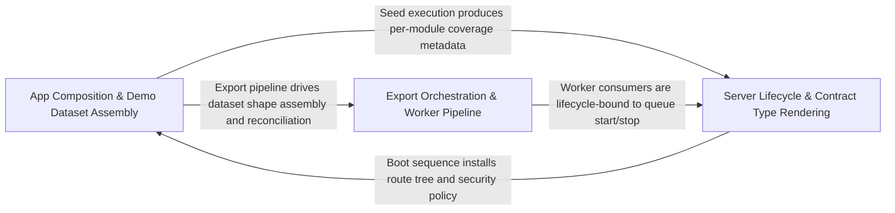

---
tags:
  - 2repo
  - 2repo/arch
  - project/boilerplate-node-backend
type: architecture
component: Demo_Dataset_Export_Test_Reporting
---

## Details

Produces the demo dataset and clears the DB cache, and reports test results (coverage, failures, slowest tests), with secondary AsyncAPI type rendering and app-server lifecycle support.

### App Composition & Demo Dataset Assembly [[Expand]](./App_Composition_Demo_Dataset_Assembly.md)
The composition root of the demo pipeline. It owns the broadest surface (39 files, 138 symbols) and is the single entry point that assembles the demo dataset by walking every registered module's seed contribution, sorts keys deterministically, and produces a single canonical JSON document. It wires the Express app by mounting module route trees, serving the EJS-rendered reference UI, injecting per-request correlation metadata, and configuring CORS. It also provides the export entry point that orchestrates the full sequence: clear cache, assemble, seed, and emit the artefact. Architecturally this group is the hub of the subsystem: every other sub-component either feeds data into it or consumes its output.

**Related Classes/Methods**:

- `scripts.export-demo-dataset.run`:34-71
- `db.demo.assemble.assembleDemoDataset`:167-206
- `src.app.routes.installRoutes`:26-48
- `src.app.security.allowedOrigins`:27-32

**Source Files:**

- `db/demo/assemble.ts`
  - `db.demo.assemble.sortKeys` (L74-L82) - Class
  - `db.demo.assemble.sortKeys.value.map() callback` (L75-L75) - Function
  - `db.demo.assemble.sortKeys.toSorted() callback` (L79-L79) - Function
  - `db.demo.assemble.sortKeys.map() callback` (L80-L80) - Function
  - `db.demo.assemble.reconcileShapes.problems` (L150-L158) - Class
  - `db.demo.assemble.reconcileShapes.problems.unlabelled.map() callback` (L152-L153) - Function
  - `db.demo.assemble.reconcileShapes.problems.orphaned.map() callback` (L156-L156) - Function
  - `db.demo.assemble.assembleDemoDataset` (L167-L206) - Class
  - `db.demo.assemble.assembleDemoDataset.dangling.map() callback` (L202-L202) - Function
- `db/demo/index.ts`
  - `db.demo.index.runScript() callback` (L100-L100) - Function
- `scripts/export-demo-dataset.ts`
  - `scripts.export-demo-dataset.run` (L34-L71) - Class
  - `scripts.export-demo-dataset.run.enabledModules.map() callback` (L42-L42) - Function
- `src/app/request-context.ts`
  - `src.app.request-context.installRequestContext` (L19-L40) - Class
  - `src.app.request-context.installRequestContext.app.use() callback` (L23-L28) - Function
- `src/app/routes.ts`
  - `src.app.routes.installRoutes` (L26-L48) - Class
  - `src.app.routes.installRoutes.app.use() callback` (L45-L47) - Function
- `src/app/security.ts`
  - `src.app.security.allowedOrigins` (L27-L32) - Class
  - `src.app.security.allowedOrigins.map() callback` (L30-L30) - Function
- `src/app/static-assets.ts`
  - `src.app.static-assets.installStatic` (L13-L40) - Class
  - `src.app.static-assets.installStatic.setHeaders` (L35-L37) - Method
- `src/app/workers.ts`
  - `src.app.workers.registerWorkers` (L20-L30) - Class
  - `src.app.workers.registerWorkers.then() callback` (L27-L29) - Function
- `src/infrastructure/adapters/email.worker.ts`
  - `src.infrastructure.adapters.email.worker.handleEmailJob` (L23-L49) - Class
  - `src.infrastructure.adapters.email.worker.handleEmailJob.then() callback` (L42-L42) - Function
  - `src.infrastructure.adapters.email.worker.handleEmailJob.catch() callback` (L43-L48) - Function
- `src/infrastructure/adapters/mailer.ts`
  - `src.infrastructure.adapters.mailer.nodemailer` (L148-L212) - Class
  - `src.infrastructure.adapters.mailer.nodemailer.withSpan('email.send') callback` (L160-L211) - Function
  - `src.infrastructure.adapters.mailer.nodemailer.withSpan('email.send') callback.then() callback` (L202-L207) - Function
  - `src.infrastructure.adapters.mailer.enqueueEmail` (L282-L310) - Class
  - `src.infrastructure.adapters.mailer.enqueueEmail.then() callback` (L298-L309) - Function
  - `src.infrastructure.adapters.mailer.enqueueEmail.then() callback.then() callback` (L301-L301) - Function
- `src/infrastructure/adapters/pdf.worker.ts`
  - `src.infrastructure.adapters.pdf.worker.then() callback` (L36-L36) - Function
- `src/infrastructure/adapters/queue.ts`
  - `src.infrastructure.adapters.queue.assertJobQueue` (L225-L240) - Class
  - `src.infrastructure.adapters.queue.assertJobQueue.then() callback` (L240-L240) - Function
  - `src.infrastructure.adapters.queue.publishToQueue` (L271-L304) - Class
  - `src.infrastructure.adapters.queue.publishToQueue.then() callback` (L274-L304) - Function
  - `src.infrastructure.adapters.queue.publishToQueue.then() callback.then() callback` (L283-L291) - Function
  - `src.infrastructure.adapters.queue.publishToQueue.then() callback.catch() callback` (L299-L302) - Function
  - `src.infrastructure.adapters.queue.consumeFromQueue` (L339-L405) - Class
  - `src.infrastructure.adapters.queue.consumeFromQueue.then() callback` (L342-L405) - Function
  - `src.infrastructure.adapters.queue.consumeFromQueue.then() callback.then() callback.ch.consume() callback` (L357-L400) - Function
  - `src.infrastructure.adapters.queue.consumeFromQueue.then() callback.then() callback.ch.consume() callback.then() callback` (L391-L396) - Function
  - `src.infrastructure.adapters.queue.consumeFromQueue.then() callback.then() callback.ch.consume() callback.catch() callback` (L399-L399) - Function
  - `src.infrastructure.adapters.queue.consumeFromQueue.then() callback.then() callback` (L403-L403) - Function
- `src/infrastructure/adapters/storage.ts`
  - `src.infrastructure.adapters.storage.validateUploadedImages.then() callback.rejected` (L284-L288) - Class
  - `src.infrastructure.adapters.storage.validateUploadedImages.then() callback.rejected.paths.filter() callback` (L285-L287) - Function
  - `src.infrastructure.adapters.storage.validateUploadedImages.then() callback.rejected.map() callback` (L304-L304) - Function
- `src/infrastructure/i18n/overrides.ts`
  - `src.infrastructure.i18n.overrides.refreshLocaleOverrides` (L105-L118) - Class
  - `src.infrastructure.i18n.overrides.refreshLocaleOverrides.then() callback` (L109-L109) - Function
  - `src.infrastructure.i18n.overrides.refreshLocaleOverrides.catch() callback` (L110-L117) - Function
- `src/infrastructure/persistence/base-repository.ts`
  - `src.infrastructure.persistence.base-repository.BaseRepository` (L164-L209) - Interface
  - `src.infrastructure.persistence.base-repository.createBaseRepository.search.then() callback.then() callback` (L324-L327) - Function
  - `src.infrastructure.persistence.base-repository.createBaseRepository.buildWhere` (L344-L344) - Method
- `src/infrastructure/persistence/search.ts`
  - `src.infrastructure.persistence.search.addTextFilter` (L133-L143) - Class
  - `src.infrastructure.persistence.search.addTextFilter.fields.map() callback` (L140-L142) - Function
- `src/infrastructure/runtime/otel-sdk.ts`
  - `src.infrastructure.runtime.otel-sdk.buildProcessors.headers.map() callback` (L67-L72) - Function
- `src/modules/account/controllers/delete-account-request.ts`
  - `src.modules.account.controllers.delete-account-request.deleteAccountRequest` (L23-L47) - Class
  - `src.modules.account.controllers.delete-account-request.deleteAccountRequest.then() callback` (L29-L45) - Function
  - `src.modules.account.controllers.delete-account-request.deleteAccountRequest.then() callback.then() callback` (L36-L44) - Function
  - `src.modules.account.controllers.delete-account-request.deleteAccountRequest.catch() callback` (L46-L46) - Function
- `src/modules/account/services/authentication.ts`
  - `src.modules.account.services.authentication.requestAccountDeletion` (L69-L89) - Class
  - `src.modules.account.services.authentication.requestPasswordReset` (L116-L147) - Class
  - `src.modules.account.services.authentication.requestPasswordReset.then() callback` (L123-L146) - Function
  - `src.modules.account.services.authentication.requestPasswordReset.then() callback.then() callback` (L127-L144) - Function
  - `src.modules.account.services.authentication.outcome.then() callback` (L288-L302) - Function
- `src/modules/account/services/tokens.ts`
  - `src.modules.account.services.tokens.findLiveToken.then() callback.entry` (L69-L69) - Class
  - `src.modules.account.services.tokens.findLiveToken.then() callback.entry.user.tokens.find() callback` (L69-L69) - Function
- `src/modules/cart/services/checkout.ts`
  - `src.modules.cart.services.checkout.orderConfirm.then() callback.then() callback.then() callback.orderItems` (L167-L170) - Class
  - `src.modules.cart.services.checkout.orderConfirm.then() callback.then() callback.then() callback.orderItems.joined.map() callback` (L167-L170) - Function
  - `src.modules.cart.services.checkout.orderConfirm.then() callback.then() callback.then() callback.then() callback.then() callback` (L228-L264) - Function
- `src/modules/cart/services/reorder.ts`
  - `src.modules.cart.services.reorder.reorderIntoCart.<function>.then() callback.addable` (L99-L99) - Class
  - `src.modules.cart.services.reorder.reorderIntoCart.<function>.then() callback.addable.lines.filter() callback` (L99-L99) - Function
- `src/modules/feedback/controllers/get-feedback.ts`
  - `src.modules.feedback.controllers.get-feedback.getFeedback` (L35-L66) - Class
  - `src.modules.feedback.controllers.get-feedback.getFeedback.then() callback` (L64-L64) - Function
- `src/modules/locales/controllers/delete-locale-entry.ts`
  - `src.modules.locales.controllers.delete-locale-entry.deleteLocaleEntry` (L21-L37) - Class
  - `src.modules.locales.controllers.delete-locale-entry.deleteLocaleEntry.then() callback` (L27-L36) - Function
- `src/modules/locales/controllers/delete-locale.ts`
  - `src.modules.locales.controllers.delete-locale.deleteLocale` (L21-L34) - Class
  - `src.modules.locales.controllers.delete-locale.deleteLocale.then() callback` (L24-L33) - Function
- `src/modules/locales/controllers/get-locale-entries.ts`
  - `src.modules.locales.controllers.get-locale-entries.getLocaleEntries` (L21-L53) - Class
  - `src.modules.locales.controllers.get-locale-entries.getLocaleEntries.then() callback` (L47-L50) - Function
- `src/modules/locales/controllers/get-locale-messages.ts`
  - `src.modules.locales.controllers.get-locale-messages.getLocaleMessages` (L24-L36) - Class
  - `src.modules.locales.controllers.get-locale-messages.getLocaleMessages.then() callback` (L31-L34) - Function
- `src/modules/locales/controllers/get-locales.ts`
  - `src.modules.locales.controllers.get-locales.getLocales` (L24-L30) - Class
  - `src.modules.locales.controllers.get-locales.getLocales.then() callback` (L29-L29) - Function
- `src/modules/locales/controllers/write-locale-entries.ts`
  - `src.modules.locales.controllers.write-locale-entries.createLocaleEntry` (L58-L75) - Class
  - `src.modules.locales.controllers.write-locale-entries.createLocaleEntry.then() callback` (L67-L73) - Function
  - `src.modules.locales.controllers.write-locale-entries.updateLocaleEntry` (L84-L106) - Class
  - `src.modules.locales.controllers.write-locale-entries.updateLocaleEntry.then() callback` (L98-L104) - Function
  - `src.modules.locales.controllers.write-locale-entries.importEntries` (L109-L125) - Class
  - `src.modules.locales.controllers.write-locale-entries.importEntries.then() callback` (L118-L124) - Function
  - `src.modules.locales.controllers.write-locale-entries.importEntries.catch() callback` (L125-L125) - Function
- `src/modules/locales/controllers/write-locales.ts`
  - `src.modules.locales.controllers.write-locales.createLocale` (L40-L58) - Class
  - `src.modules.locales.controllers.write-locales.createLocale.then() callback` (L52-L56) - Function
  - `src.modules.locales.controllers.write-locales.updateLocale` (L67-L85) - Class
  - `src.modules.locales.controllers.write-locales.updateLocale.then() callback` (L79-L83) - Function
- `src/modules/locales/demo.ts`
  - `src.modules.locales.demo.seedLocalesCollection.languages` (L273-L275) - Class
  - `src.modules.locales.demo.seedLocalesCollection.languages.localeFixtures.map() callback` (L274-L274) - Function
  - `src.modules.locales.demo.seedLocalesCollection.entries` (L276-L278) - Class
  - `src.modules.locales.demo.seedLocalesCollection.entries.localeEntryFixtures.map() callback` (L277-L277) - Function
- `src/modules/locales/model.ts`
  - `src.modules.locales.model.LocaleDocument` (L30-L33) - Interface
  - `src.modules.locales.model.LocaleMessageDocument` (L36-L40) - Interface
- `src/modules/locales/repository.ts`
  - `src.modules.locales.repository.EntryInput` (L37-L40) - Interface
  - `src.modules.locales.repository.ImportCounts` (L43-L47) - Interface
  - `src.modules.locales.repository.importEntries.removedKeys` (L233-L233) - Class
  - `src.modules.locales.repository.importEntries.removedKeys.filter() callback` (L233-L233) - Function
  - `src.modules.locales.repository.importEntries.created` (L249-L249) - Class
  - `src.modules.locales.repository.importEntries.created.filter() callback` (L249-L249) - Function
- `src/modules/orders/controllers/get-order-invoice.ts`
  - `src.modules.orders.controllers.get-order-invoice.getOrderInvoice` (L20-L73) - Class
  - `src.modules.orders.controllers.get-order-invoice.getOrderInvoice.then() callback` (L30-L71) - Function
  - `src.modules.orders.controllers.get-order-invoice.getOrderInvoice.then() callback.then() callback` (L61-L70) - Function
- `src/modules/orders/controllers/get-order-item.ts`
  - `src.modules.orders.controllers.get-order-item.getOrderItem` (L25-L47) - Class
  - `src.modules.orders.controllers.get-order-item.getOrderItem.then() callback` (L37-L45) - Function
- `src/modules/orders/domain/rules.ts`
  - `src.modules.orders.domain.rules.checkOrderLines` (L23-L28) - Class
  - `src.modules.orders.domain.rules.checkOrderLines.lines.some() callback` (L25-L25) - Function
- `src/modules/orders/repository.ts`
  - `src.modules.orders.repository.search` (L57-L85) - Class
  - `src.modules.orders.repository.search.then() callback` (L72-L83) - Function
  - `src.modules.orders.repository.search.then() callback.then() callback` (L79-L82) - Function
  - `src.modules.orders.repository.findByIdScoped` (L110-L122) - Class
  - `src.modules.orders.repository.then() callback` (L114-L114) - Function
  - `src.modules.orders.repository.findByIdScoped.then() callback` (L117-L120) - Function
- `src/modules/orders/service.ts`
  - `src.modules.orders.service.create` (L131-L215) - Class
  - `src.modules.orders.service.create.items.map() callback` (L141-L142) - Function
  - `src.modules.orders.service.create.items.map() callback.then() callback` (L142-L142) - Function
  - `src.modules.orders.service.create.then() callback` (L144-L214) - Function
  - `src.modules.orders.service.create.then() callback.verdict` (L145-L147) - Class
  - `src.modules.orders.service.create.then() callback.verdict.resolvedItems.map() callback` (L146-L146) - Function
  - `src.modules.orders.service.create.then() callback.then() callback` (L174-L213) - Function
  - `src.modules.orders.service.update.updateItemsPromise` (L278-L306) - Class
  - `src.modules.orders.service.update.updateItemsPromise.then() callback.requestedItems.map() callback` (L290-L293) - Function
  - `src.modules.orders.service.update.updateItemsPromise.then() callback.requestedItems.map() callback.then() callback` (L293-L293) - Function
  - `src.modules.orders.service.update.updateItemsPromise.then() callback.then() callback.resolvedItems.map() callback` (L299-L302) - Function
  - `src.modules.orders.service.update.updateItemsPromise.then() callback` (L308-L321) - Function

### Server Lifecycle & Contract Type Rendering [[Expand]](./Server_Lifecycle_Contract_Type_Rendering.md)
This sub-component owns the runtime boundary and the contract-first type generation seam. startServer boots the Express listener, installs the request-context middleware, and resolves a handle; stopServer performs graceful shutdown, flushing the cache, draining the queue, and closing storage handles. The then()/finally() callbacks make the lifecycle an explicit async state machine. renderChannelNamespace.entries walks the AsyncAPI document's channel map and emits the TypeScript type declarations that the generated client consumes, serving as the contract-to-code bridge. reconcileShapes.orphaned detects demo-data shapes that have no corresponding module seed and either prunes or flags them. seed.perModule tracks which modules contributed rows, enabling the export report to list coverage per bounded context. In the flow diagram this group sits between the composition root and the export orchestrator.

**Related Classes/Methods**:

- `src.app.startServer`:59-117

**Source Files:**

- `db/cache-clear.ts`
  - `db.cache-clear.runScript() callback` (L41-L41) - Function
- `db/demo/assemble.ts`
  - `db.demo.assemble.reconcileShapes.orphaned` (L148-L148) - Class
  - `db.demo.assemble.reconcileShapes.orphaned.filter() callback` (L148-L148) - Function
  - `db.demo.assemble.assembleDemoDataset.sections` (L168-L170) - Class
  - `db.demo.assemble.assembleDemoDataset.sections.enabledModules.map() callback` (L169-L169) - Function
- `db/demo/index.ts`
  - `db.demo.index.seed` (L38-L92) - Function
  - `db.demo.index.seed.created` (L67-L67) - Class
  - `db.demo.index.seed.created.results.filter() callback` (L67-L67) - Function
- `scripts/generate-asyncapi-types.ts`
  - `scripts.generate-asyncapi-types.renderChannelNamespace.entries` (L301-L303) - Class
  - `scripts.generate-asyncapi-types.renderChannelNamespace.entries.channelNames.map() callback` (L302-L302) - Function
- `src/app.ts`
  - `src.app.startServer` (L59-L117) - Class
  - `src.app.startServer.then() callback.enabledModules.map() callback` (L75-L75) - Function
  - `src.app.startServer.then() callback.filter() callback` (L76-L76) - Function
  - `src.app.startServer.then() callback` (L105-L114) - Function
  - `src.app.startServer.then() callback.<function>` (L106-L114) - Function
  - `src.app.startServer.then() callback.<function>.server` (L109-L113) - Class
  - `src.app.startServer.then() callback.<function>.server.app.listen() callback` (L109-L113) - Function
- `src/infrastructure/adapters/cache.ts`
  - `src.infrastructure.adapters.cache.cacheConnection` (L60-L112) - Class
  - `src.infrastructure.adapters.cache.cacheConnection.isReady` (L66-L66) - Method
  - `src.infrastructure.adapters.cache.cacheConnection.connect` (L67-L94) - Method
  - `src.infrastructure.adapters.cache.cacheConnection.connect.then() callback` (L93-L93) - Function
  - `src.infrastructure.adapters.cache.cacheConnection.close` (L95-L111) - Method
  - `src.infrastructure.adapters.cache.cacheConnection.close.then() callback` (L108-L108) - Function
  - `src.infrastructure.adapters.cache.clearCache` (L326-L367) - Class
  - `src.infrastructure.adapters.cache.clearCache.then() callback` (L329-L357) - Function
  - `src.infrastructure.adapters.cache.clearCache.catch() callback` (L358-L367) - Function
- `src/infrastructure/adapters/queue.ts`
  - `src.infrastructure.adapters.queue.queueConnection` (L90-L151) - Class
  - `src.infrastructure.adapters.queue.queueConnection.isReady` (L99-L99) - Method
  - `src.infrastructure.adapters.queue.queueConnection.connect` (L100-L133) - Method
  - `src.infrastructure.adapters.queue.queueConnection.connect.then() callback` (L122-L131) - Function
  - `src.infrastructure.adapters.queue.queueConnection.connect.then() callback.superviseHandle() callback` (L127-L129) - Function
  - `src.infrastructure.adapters.queue.queueConnection.close` (L134-L150) - Method
  - `src.infrastructure.adapters.queue.queueConnection.close.finally() callback` (L146-L148) - Function
- `src/infrastructure/http/middlewares/cache.ts`
  - `src.infrastructure.http.middlewares.cache.getCacheKey.values` (L228-L234) - Class
  - `src.infrastructure.http.middlewares.cache.getCacheKey.values.sortedKeyParameters.filter() callback` (L229-L229) - Function
  - `src.infrastructure.http.middlewares.cache.getCacheKey.values.map() callback` (L230-L233) - Function
- `src/infrastructure/http/request.ts`
  - `src.infrastructure.http.request.readInput.sources.map() callback` (L247-L248) - Function
  - `src.infrastructure.http.request.readInput.sources` (L247-L249) - Class
- `src/infrastructure/http/response.ts`
  - `src.infrastructure.http.response.ResponseNeutral` (L13-L20) - Interface
  - `src.infrastructure.http.response.ResponseSuccess` (L22-L32) - Interface
  - `src.infrastructure.http.response.ResponseErrorItem` (L35-L42) - Interface
  - `src.infrastructure.http.response.ResponseReject` (L44-L51) - Interface
- `src/infrastructure/i18n/catalog.ts`
  - `src.infrastructure.i18n.catalog.listSupportedLocales` (L42-L59) - Class
  - `src.infrastructure.i18n.catalog.listSupportedLocales.filter() callback` (L54-L54) - Function
  - `src.infrastructure.i18n.catalog.listSupportedLocales.map() callback` (L55-L55) - Function
  - `src.infrastructure.i18n.catalog.loadLocaleResources` (L153-L159) - Class
  - `src.infrastructure.i18n.catalog.loadLocaleResources.map() callback` (L155-L158) - Function
- `src/infrastructure/i18n/negotiate.ts`
  - `src.infrastructure.i18n.negotiate.negotiateLocale.candidates.map() callback.declared` (L37-L39) - Class
  - `src.infrastructure.i18n.negotiate.negotiateLocale.candidates.map() callback.declared.parameters.map() callback` (L38-L38) - Function
- `src/infrastructure/runtime/environment.ts`
  - `src.infrastructure.runtime.environment.validateRequiredEnvironment.missing` (L85-L88) - Class
  - `src.infrastructure.runtime.environment.validateRequiredEnvironment.missing.REQUIRED_ENV_KEYS.filter() callback` (L85-L88) - Function
- `src/infrastructure/runtime/managed-connection.ts`
  - `src.infrastructure.runtime.managed-connection.ManagedConnectionOptions` (L26-L70) - Interface
  - `src.infrastructure.runtime.managed-connection.ManagedConnection` (L73-L112) - Interface
  - `src.infrastructure.runtime.managed-connection.manageConnection` (L120-L221) - Class
  - `src.infrastructure.runtime.managed-connection.manageConnection.get.attempt` (L157-L174) - Class
  - `src.infrastructure.runtime.managed-connection.manageConnection.get.attempt.then() callback` (L158-L163) - Function
  - `src.infrastructure.runtime.managed-connection.manageConnection.get.attempt.catch() callback` (L164-L170) - Function
  - `src.infrastructure.runtime.managed-connection.manageConnection.get.attempt.finally() callback` (L171-L174) - Function
  - `src.infrastructure.runtime.managed-connection.manageConnection.state` (L184-L192) - Method
  - `src.infrastructure.runtime.managed-connection.manageConnection.forget` (L194-L196) - Method
  - `src.infrastructure.runtime.managed-connection.manageConnection.stop` (L200-L219) - Method
  - `src.infrastructure.runtime.managed-connection.manageConnection.stop.catch() callback` (L212-L212) - Function
  - `src.infrastructure.runtime.managed-connection.manageConnection.stop.finally() callback` (L213-L217) - Function
- `src/infrastructure/runtime/server-lifecycle.ts`
  - `src.infrastructure.runtime.server-lifecycle.registerSignalHandlers` (L92-L135) - Class
  - `src.infrastructure.runtime.server-lifecycle.onProcessSignal.then() callback` (L114-L114) - Function
  - `src.infrastructure.runtime.server-lifecycle.registerSignalHandlers.process.on('SIGTERM') callback` (L132-L132) - Function
  - `src.infrastructure.runtime.server-lifecycle.registerSignalHandlers.process.on('SIGINT') callback` (L134-L134) - Function

### Export Orchestration & Worker Pipeline
The terminal stage of the pipeline that transforms the assembled, reconciled dataset into the final export artefact and activates the background workers that make the demo interactive. run.enabledModules.map() iterates the module registry, filtering to only those modules flagged as enabled, collecting seeded rows, shape metadata, and per-module statistics into the export document. toPascalCase normalises channel/operation identifiers into PascalCase type names, and buildOutput.sections assembles the final TypeScript declaration file. registerWorkers subscribes to RabbitMQ queues so the demo can exercise the async/event path. assembleDemoDataset.shapes and reconcileShapes.unlabelled complete the shape graph by labelling any remaining unlabelled shapes. In the flow diagram this is the rightmost node: it consumes the reconciled dataset and rendered types from Group 2, produces the final export JSON and generated .d.ts file, and tears down the workers and server via the lifecycle handle from Group 2.

**Related Classes/Methods**:

- `scripts.generate-asyncapi-types.toPascalCase`:91-98
- `db.demo.assemble.assembleDemoDataset.shapes`:186-189

**Source Files:**

- `db/demo/assemble.ts`
  - `db.demo.assemble.reconcileShapes.unlabelled` (L147-L147) - Class
  - `db.demo.assemble.reconcileShapes.unlabelled.filter() callback` (L147-L147) - Function
  - `db.demo.assemble.assembleDemoDataset.shapes` (L186-L189) - Class
  - `db.demo.assemble.assembleDemoDataset.shapes.enabledModules.map() callback` (L188-L188) - Function
- `db/demo/index.ts`
  - `db.demo.index.seed.perModule` (L62-L64) - Class
  - `db.demo.index.seed.perModule.enabledModules.map() callback` (L63-L63) - Function
- `scripts/generate-asyncapi-types.ts`
  - `scripts.generate-asyncapi-types.toPascalCase` (L91-L98) - Class
  - `scripts.generate-asyncapi-types.toPascalCase.map() callback` (L97-L97) - Function
  - `scripts.generate-asyncapi-types.buildOutput.sections` (L391-L414) - Class
  - `scripts.generate-asyncapi-types.buildOutput.sections.sseEntries.map() callback` (L408-L408) - Function
- `src/app.ts`
  - `src.app.then() callback` (L64-L64) - Function
  - `src.app.stopServer` (L122-L131) - Class
  - `src.app.stopServer.finally() callback` (L125-L128) - Function
  - `src.app.catch() callback` (L171-L172) - Function
- `src/infrastructure/adapters/cache.ts`
  - `src.infrastructure.adapters.cache.getCacheValue` (L152-L169) - Class
  - `src.infrastructure.adapters.cache.getCacheValue.then() callback` (L155-L161) - Function
  - `src.infrastructure.adapters.cache.getCacheValue.then() callback.then() callback` (L160-L160) - Function
  - `src.infrastructure.adapters.cache.getCacheValue.catch() callback` (L162-L169) - Function
  - `src.infrastructure.adapters.cache.setCacheValue` (L180-L230) - Class
  - `src.infrastructure.adapters.cache.setCacheValue.then() callback` (L196-L222) - Function
  - `src.infrastructure.adapters.cache.setCacheValue.then() callback.then() callback.cacheTags.map() callback` (L216-L216) - Function
  - `src.infrastructure.adapters.cache.setCacheValue.then() callback.then() callback` (L220-L220) - Function
  - `src.infrastructure.adapters.cache.setCacheValue.catch() callback` (L223-L229) - Function
  - `src.infrastructure.adapters.cache.invalidateCacheTags` (L246-L291) - Class
  - `src.infrastructure.adapters.cache.invalidateCacheTags.then() callback` (L252-L282) - Function
  - `src.infrastructure.adapters.cache.invalidateCacheTags.then() callback.cacheTags.map() callback` (L262-L277) - Function
  - `src.infrastructure.adapters.cache.invalidateCacheTags.then() callback.cacheTags.map() callback.then() callback.then() callback` (L275-L275) - Function
  - `src.infrastructure.adapters.cache.invalidateCacheTags.then() callback.then() callback` (L278-L281) - Function
  - `src.infrastructure.adapters.cache.invalidateCacheTags.then() callback.then() callback.deleted.perTag.reduce() callback` (L279-L279) - Function
  - `src.infrastructure.adapters.cache.invalidateCacheTags.catch() callback` (L283-L290) - Function
- `src/infrastructure/adapters/queue.ts`
  - `src.infrastructure.adapters.queue.connect.then() callback` (L111-L121) - Function
  - `src.infrastructure.adapters.queue.connect.then() callback.superviseHandle() callback` (L114-L117) - Function
  - `src.infrastructure.adapters.queue.then() callback` (L228-L228) - Function
  - `src.infrastructure.adapters.queue.PublishOptions` (L244-L253) - Interface
  - `src.infrastructure.adapters.queue.ConsumeOptions` (L308-L317) - Interface
  - `src.infrastructure.adapters.queue.then() callback.then() callback` (L353-L353) - Function
- `src/infrastructure/adapters/storage.ts`
  - `src.infrastructure.adapters.storage.withLocaleRestored` (L240-L249) - Class
  - `src.infrastructure.adapters.storage.withLocaleRestored.<function>` (L242-L249) - Function
  - `src.infrastructure.adapters.storage.withLocaleRestored.<function>.middleware() callback` (L243-L249) - Function
  - `src.infrastructure.adapters.storage.withLocaleRestored.<function>.middleware() callback.runWithLocaleContext() callback` (L248-L248) - Function
  - `src.infrastructure.adapters.storage.upload` (L389-L396) - Class
  - `src.infrastructure.adapters.storage.upload.single` (L390-L390) - Method
  - `src.infrastructure.adapters.storage.upload.array` (L391-L392) - Method
  - `src.infrastructure.adapters.storage.upload.fields` (L393-L393) - Method
  - `src.infrastructure.adapters.storage.upload.none` (L394-L394) - Method
  - `src.infrastructure.adapters.storage.upload.any` (L395-L395) - Method
- `src/infrastructure/http/middlewares/cache.ts`
  - `src.infrastructure.http.middlewares.cache.setCache` (L248-L373) - Class
  - `src.infrastructure.http.middlewares.cache.setCache.<function>` (L253-L372) - Function
  - `src.infrastructure.http.middlewares.cache.setCache.<function>.then() callback` (L342-L371) - Function
  - `src.infrastructure.http.middlewares.cache.setCache.<function>.then() callback.<function>` (L355-L367) - Function
  - `src.infrastructure.http.middlewares.cache.invalidateCache` (L383-L406) - Class
  - `src.infrastructure.http.middlewares.cache.invalidateCache.<function>` (L384-L406) - Function
  - `src.infrastructure.http.middlewares.cache.invalidateCache.<function>.response.on('finish') callback` (L385-L403) - Function
  - `src.infrastructure.http.middlewares.cache.invalidateCache.<function>.response.on('finish') callback.then() callback` (L389-L402) - Function
- `src/infrastructure/i18n/catalog.ts`
  - `src.infrastructure.i18n.catalog.listSupportedLocales.declared` (L45-L47) - Class
  - `src.infrastructure.i18n.catalog.listSupportedLocales.declared.map() callback` (L46-L46) - Function
- `src/infrastructure/runtime/database.ts`
  - `src.infrastructure.runtime.database.start.attemptConnect` (L70-L88) - Class
  - `src.infrastructure.runtime.database.start.attemptConnect.then() callback` (L76-L87) - Function
  - `src.infrastructure.runtime.database.start.attemptConnect.then() callback.then() callback` (L86-L86) - Function
  - `src.infrastructure.runtime.database.stopDatabase` (L100-L110) - Class
  - `src.infrastructure.runtime.database.stopDatabase.then() callback` (L103-L109) - Function
- `src/infrastructure/runtime/server-lifecycle.ts`
  - `src.infrastructure.runtime.server-lifecycle.closeServer` (L45-L54) - Class
  - `src.infrastructure.runtime.server-lifecycle.closeServer.<function>` (L46-L54) - Function
  - `src.infrastructure.runtime.server-lifecycle.closeServer.<function>.server.close() callback` (L47-L53) - Function
  - `src.infrastructure.runtime.server-lifecycle.shutdownInfra` (L69-L85) - Class
  - `src.infrastructure.runtime.server-lifecycle.shutdownInfra.then() callback` (L85-L85) - Function
  - `src.infrastructure.runtime.server-lifecycle.registerSignalHandlers.onProcessSignal` (L97-L129) - Class
  - `src.infrastructure.runtime.server-lifecycle.registerSignalHandlers.onProcessSignal.forcedExitTimer` (L103-L106) - Class
  - `src.infrastructure.runtime.server-lifecycle.registerSignalHandlers.onProcessSignal.forcedExitTimer.setTimeout() callback` (L103-L106) - Function
  - `src.infrastructure.runtime.server-lifecycle.registerSignalHandlers.onProcessSignal.then() callback` (L115-L120) - Function
  - `src.infrastructure.runtime.server-lifecycle.registerSignalHandlers.onProcessSignal.catch() callback` (L121-L128) - Function
