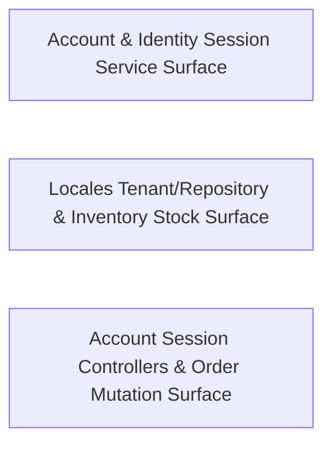

---
tags:
  - 2repo
  - 2repo/arch
  - project/boilerplate-node-backend
type: architecture
component: Domain_Module_Service_Surface_Composed_by_App_
---

## Details

The domain-module service and repository surface that the app assembly composes into the Express router tree. Covers the account/auth session services, the locales tenant/repository surface, the inventory reservation/stock-movement models, and the cart/orders/wishlist service methods that the app layer wires to routes. This is the what the app serves half of the subsystem — the bounded-context services the composition root mounts.

### Account & Identity Session Service Surface
The account bounded-context service layer that proves identity and manages the session/token lifecycle, plus the cross-module service methods the app wires to account routes. It owns login/signup, refresh-token issuance, logout-everywhere, password change and reset-confirm, and the address book, delegating credential hashing to the model and JWT signing to session/jwt. It also surfaces the adjacent service methods the composition root mounts alongside it — orders.service.cancelById, users.service.consumeToken, and wishlist.service.wishlistAdd — which are the service-level entry points controllers call rather than the controllers themselves.

**Related Classes/Methods**:

- `src.modules.account.services.authentication.login`:340-366
- `src.modules.account.services.addresses.addressRemove`:71-78
- `src.modules.orders.service.cancelById`:486-573
- `src.modules.wishlist.service.wishlistAdd`:48-63

**Source Files:**

- `src/app/error-handling.ts`
  - `src.app.error-handling.installErrorHandling` (L93-L124) - Class
  - `src.app.error-handling.installErrorHandling.process.on('unhandledRejection') callback` (L99-L107) - Function
  - `src.app.error-handling.installErrorHandling.process.on('uncaughtException') callback` (L113-L123) - Function
- `src/modules/account/controllers/post-logout-everywhere.ts`
  - `src.modules.account.controllers.post-logout-everywhere.postLogoutEverywhere` (L14-L24) - Class
  - `src.modules.account.controllers.post-logout-everywhere.postLogoutEverywhere.then() callback` (L17-L22) - Function
- `src/modules/account/controllers/post-reset-confirm.ts`
  - `src.modules.account.controllers.post-reset-confirm.postResetConfirm` (L15-L80) - Class
  - `src.modules.account.controllers.post-reset-confirm.postResetConfirm.then() callback` (L32-L76) - Function
  - `src.modules.account.controllers.post-reset-confirm.postResetConfirm.then() callback.then() callback` (L56-L75) - Function
  - `src.modules.account.controllers.post-reset-confirm.postResetConfirm.then() callback.then() callback.then() callback` (L68-L74) - Function
  - `src.modules.account.controllers.post-reset-confirm.postResetConfirm.catch() callback` (L77-L79) - Function
- `src/modules/account/services/addresses.ts`
  - `src.modules.account.services.addresses.addressRemove` (L71-L78) - Class
  - `src.modules.account.services.addresses.addressRemove.then() callback` (L75-L78) - Function
- `src/modules/account/services/authentication.ts`
  - `src.modules.account.services.authentication.signup.parseResult` (L266-L283) - Class
  - `src.modules.account.services.authentication.signup.parseResult.superRefine() callback` (L270-L276) - Function
  - `src.modules.account.services.authentication.login` (L340-L366) - Class
  - `src.modules.account.services.authentication.login.then() callback` (L356-L363) - Function
  - `src.modules.account.services.authentication.login.then() callback.then() callback` (L359-L362) - Function
  - `src.modules.account.services.authentication.login.catch() callback` (L364-L364) - Function
- `src/modules/account/services/profile.ts`
  - `src.modules.account.services.profile.passwordChange` (L78-L92) - Class
  - `src.modules.account.services.profile.passwordChange.then() callback` (L90-L90) - Function
  - `src.modules.account.services.profile.passwordChange.catch() callback` (L91-L91) - Function
  - `src.modules.account.services.profile.passwordResetChange` (L122-L155) - Class
  - `src.modules.account.services.profile.passwordResetChange.then() callback` (L128-L155) - Function
  - `src.modules.account.services.profile.passwordChangeWithCurrent.outcome` (L296-L313) - Class
  - `src.modules.account.services.profile.passwordChangeWithCurrent.outcome.then() callback.then() callback` (L305-L311) - Function
  - `src.modules.account.services.profile.passwordChangeWithCurrent.outcome.catch() callback` (L313-L313) - Function
  - `src.modules.account.services.profile.passwordChangeWithCurrent.outcome.then() callback` (L315-L323) - Function
- `src/modules/account/services/token-cleanup.ts`
  - `src.modules.account.services.token-cleanup.adminTokenCleanup` (L47-L74) - Class
  - `src.modules.account.services.token-cleanup.adminTokenCleanup.catch() callback` (L61-L74) - Function
- `src/modules/inventory/model.ts`
  - `src.modules.inventory.model.StockMovementDocument` (L28-L33) - Interface
  - `src.modules.inventory.model.ReservationItem` (L107-L110) - Interface
  - `src.modules.inventory.model.ReservationDocument` (L122-L129) - Interface
- `src/modules/orders/controllers/get-orders.ts`
  - `src.modules.orders.controllers.get-orders.getOrders` (L43-L68) - Class
  - `src.modules.orders.controllers.get-orders.getOrders.then() callback` (L64-L66) - Function
- `src/modules/orders/service.ts`
  - `src.modules.orders.service.updateItemsPromise.then() callback` (L280-L305) - Function
  - `src.modules.orders.service.updateItemsPromise.then() callback.then() callback` (L295-L304) - Function
  - `src.modules.orders.service.cancelById` (L486-L573) - Class
  - `src.modules.orders.service.cancelById.then() callback.then() callback` (L562-L570) - Function
- `src/modules/products/controllers/get-catalogue-facets.ts`
  - `src.modules.products.controllers.get-catalogue-facets.getCatalogueFacets` (L12-L18) - Class
  - `src.modules.products.controllers.get-catalogue-facets.getCatalogueFacets.then() callback` (L15-L17) - Function
- `src/modules/products/controllers/get-product-item.ts`
  - `src.modules.products.controllers.get-product-item.getProductItem` (L14-L33) - Class
  - `src.modules.products.controllers.get-product-item.getProductItem.then() callback` (L22-L28) - Function
  - `src.modules.products.controllers.get-product-item.getProductItem.catch() callback` (L29-L33) - Function
- `src/modules/users/service.ts`
  - `src.modules.users.service.consumeToken` (L256-L263) - Class
  - `src.modules.users.service.consumeToken.then() callback` (L257-L263) - Function
  - `src.modules.users.service.consumeToken.then() callback.user.tokens.filter() callback` (L258-L258) - Function
- `src/modules/wishlist/model.ts`
  - `src.modules.wishlist.model.WishlistItem` (L24-L26) - Interface
  - `src.modules.wishlist.model.WishlistDocument` (L34-L39) - Interface
- `src/modules/wishlist/service.ts`
  - `src.modules.wishlist.service.wishlistAdd` (L48-L63) - Class
  - `src.modules.wishlist.service.wishlistAdd.then() callback` (L53-L63) - Function

### Locales Tenant/Repository & Inventory Stock Surface
The tenant-scoped translation service surface and the inventory reservation/stock-movement model. The locales half exposes the tenant registry (isKnownTenant, listTenants, frontendTenantIds) and the entry repository (countEntriesByLocale, importEntries, listKeys) that the app mounts for GET /locales/... and entry management. The inventory half exposes the stock board and ledger read paths (getInventoryLevels, getStockMovements, post-reservations-sweep) and the ReservationDocument model that backs holds, all flowing through the single applyTransition chokepoint that pairs every counter move with a ledger row.

**Related Classes/Methods**:

- `src.modules.locales.tenants.isKnownTenant`
- `src.modules.locales.repository.countEntriesByLocale`:107-119
- `src.modules.inventory.controllers.post-reservations-sweep.postReservationsSweep`:20-26

**Source Files:**

- `eslint/rules/no-hardcoded-user-text.ts`
  - `eslint.rules.no-hardcoded-user-text.noHardcodedUserText` (L19-L67) - Class
  - `eslint.rules.no-hardcoded-user-text.noHardcodedUserText.create` (L30-L66) - Method
  - `eslint.rules.no-hardcoded-user-text.noHardcodedUserText.create.CallExpression` (L32-L64) - Method
- `src/modules/inventory/controllers/get-inventory-levels.ts`
  - `src.modules.inventory.controllers.get-inventory-levels.getInventoryLevels` (L24-L43) - Class
  - `src.modules.inventory.controllers.get-inventory-levels.getInventoryLevels.then() callback` (L39-L41) - Function
- `src/modules/inventory/controllers/post-reservations-sweep.ts`
  - `src.modules.inventory.controllers.post-reservations-sweep.postReservationsSweep` (L20-L26) - Class
  - `src.modules.inventory.controllers.post-reservations-sweep.postReservationsSweep.then() callback` (L23-L25) - Function
- `src/modules/locales/repository.ts`
  - `src.modules.locales.repository.countEntriesByLocale` (L107-L119) - Class
  - `src.modules.locales.repository.countEntriesByLocale.rows.map() callback` (L118-L118) - Function
  - `src.modules.locales.repository.listKeys` (L158-L166) - Class
  - `src.modules.locales.repository.listKeys.rows.map() callback` (L165-L165) - Function
  - `src.modules.locales.repository.importEntries` (L224-L259) - Class
  - `src.modules.locales.repository.importEntries.incoming` (L231-L231) - Class
  - `src.modules.locales.repository.importEntries.incoming.inputs.map() callback` (L231-L231) - Function
  - `src.modules.locales.repository.importEntries.map() callback` (L237-L243) - Function
- `src/modules/locales/services/capabilities.ts`
  - `src.modules.locales.services.capabilities.mergeCapabilities` (L112-L136) - Class
  - `src.modules.locales.services.capabilities.mergeCapabilities.toSorted() callback` (L135-L135) - Function
- `src/modules/locales/services/entries.ts`
  - `src.modules.locales.services.entries.importEntries.inputs` (L217-L217) - Class
  - `src.modules.locales.services.entries.importEntries.inputs.entries.map() callback` (L217-L217) - Function
  - `src.modules.locales.services.entries.importEntries.keys` (L218-L218) - Class
  - `src.modules.locales.services.entries.importEntries.keys.inputs.map() callback` (L218-L218) - Function
  - `src.modules.locales.services.entries.importEntries.unsafe` (L224-L224) - Class
  - `src.modules.locales.services.entries.importEntries.unsafe.keys.find() callback` (L224-L224) - Function
  - `src.modules.locales.services.entries.importEntries.survivors` (L245-L245) - Class
  - `src.modules.locales.services.entries.importEntries.survivors.stored.filter() callback` (L245-L245) - Function
- `src/modules/locales/services/keys.ts`
  - `src.modules.locales.services.keys.findUnsafeKeySegment` (L76-L77) - Class
  - `src.modules.locales.services.keys.findUnsafeKeySegment.find() callback` (L77-L77) - Function
- `src/modules/locales/tenants.ts`
  - `src.modules.locales.tenants.extraFrontendTenants` (L38-L46) - Class
  - `src.modules.locales.tenants.map() callback` (L41-L41) - Function
  - `src.modules.locales.tenants.extraFrontendTenants.filter() callback` (L42-L42) - Function
  - `src.modules.locales.tenants.extraFrontendTenants.map() callback` (L43-L46) - Function
  - `src.modules.locales.tenants.listTenants` (L49-L60) - Class
  - `src.modules.locales.tenants.listTenants.rows.filter() callback` (L59-L59) - Function
  - `src.modules.locales.tenants.frontendTenantIds` (L63-L66) - Class
  - `src.modules.locales.tenants.frontendTenantIds.filter() callback` (L65-L65) - Function
  - `src.modules.locales.tenants.frontendTenantIds.map() callback` (L66-L66) - Function
  - `src.modules.locales.tenants.isKnownTenant` (L69-L69) - Class
  - `src.modules.locales.tenants.isKnownTenant.some() callback` (L69-L69) - Function

### Account Session Controllers & Order Mutation Surface
The account session controllers that the app wires directly to routes, paired with the order write path. This group owns the HTTP-facing session operations — deleteSession, getRefreshToken, postLogoutEverywhere, postPasswordChange, and writeAddresses — which validate the request, resolve the caller, and delegate to the account service layer. It also carries the order mutation service methods orders.service.update and orders.service.updateById, the write-side of the order bounded context that the app mounts for order creation/update routes. This is the controller-to-service seam for the identity and order flows.

**Related Classes/Methods**:

- `src.modules.account.controllers.get-refresh-token.getRefreshToken`:19-54
- `src.modules.orders.service.update`:229-322
- `src.modules.orders.service.updateById`:331-350

**Source Files:**

- `src/modules/account/controllers/delete-session.ts`
  - `src.modules.account.controllers.delete-session.deleteSession` (L21-L37) - Class
  - `src.modules.account.controllers.delete-session.deleteSession.then() callback` (L28-L35) - Function
- `src/modules/account/controllers/get-refresh-token.ts`
  - `src.modules.account.controllers.get-refresh-token.getRefreshToken` (L19-L54) - Class
  - `src.modules.account.controllers.get-refresh-token.getRefreshToken.then() callback` (L35-L45) - Function
  - `src.modules.account.controllers.get-refresh-token.getRefreshToken.then() callback.then() callback` (L38-L41) - Function
  - `src.modules.account.controllers.get-refresh-token.getRefreshToken.then() callback.catch() callback` (L42-L45) - Function
  - `src.modules.account.controllers.get-refresh-token.getRefreshToken.catch() callback` (L47-L53) - Function
- `src/modules/account/controllers/post-password-change.ts`
  - `src.modules.account.controllers.post-password-change.postPasswordChange` (L21-L59) - Class
  - `src.modules.account.controllers.post-password-change.postPasswordChange.then() callback` (L45-L54) - Function
  - `src.modules.account.controllers.post-password-change.postPasswordChange.catch() callback` (L55-L58) - Function
- `src/modules/account/controllers/write-addresses.ts`
  - `src.modules.account.controllers.write-addresses.putAddress` (L55-L73) - Class
  - `src.modules.account.controllers.write-addresses.putAddress.then() callback` (L68-L71) - Function
- `src/modules/inventory/controllers/get-stock-movements.ts`
  - `src.modules.inventory.controllers.get-stock-movements.getStockMovements` (L24-L41) - Class
  - `src.modules.inventory.controllers.get-stock-movements.getStockMovements.then() callback` (L37-L39) - Function
- `src/modules/inventory/controllers/post-adjustment.ts`
  - `src.modules.inventory.controllers.post-adjustment.postAdjustment` (L15-L38) - Class
  - `src.modules.inventory.controllers.post-adjustment.postAdjustment.then() callback` (L33-L36) - Function
- `src/modules/observability/controllers/get-observability-audit.ts`
  - `src.modules.observability.controllers.get-observability-audit.getObservabilityAuditLogs` (L13-L51) - Class
  - `src.modules.observability.controllers.get-observability-audit.getObservabilityAuditLogs.then() callback` (L49-L49) - Function
- `src/modules/orders/service.ts`
  - `src.modules.orders.service.update` (L229-L322) - Class
  - `src.modules.orders.service.updateById` (L331-L350) - Class
  - `src.modules.orders.service.updateById.then() callback` (L336-L350) - Function
- `src/modules/payments/controllers/get-payment-by-order.ts`
  - `src.modules.payments.controllers.get-payment-by-order.getPaymentByOrder` (L11-L18) - Class
  - `src.modules.payments.controllers.get-payment-by-order.getPaymentByOrder.then() callback` (L14-L17) - Function
- `src/modules/payments/controllers/post-payment-confirm.ts`
  - `src.modules.payments.controllers.post-payment-confirm.postPaymentConfirm` (L17-L39) - Class
  - `src.modules.payments.controllers.post-payment-confirm.postPaymentConfirm.then() callback` (L29-L37) - Function
- `src/modules/users/controllers/get-user-item.ts`
  - `src.modules.users.controllers.get-user-item.getUserItem` (L12-L26) - Class
  - `src.modules.users.controllers.get-user-item.getUserItem.then() callback` (L15-L21) - Function
  - `src.modules.users.controllers.get-user-item.getUserItem.catch() callback` (L22-L26) - Function
- `src/modules/users/controllers/get-users.ts`
  - `src.modules.users.controllers.get-users.getUsers` (L52-L68) - Class
  - `src.modules.users.controllers.get-users.getUsers.then() callback` (L64-L66) - Function
- `src/modules/users/controllers/write-users.ts`
  - `src.modules.users.controllers.write-users.writeUsers` (L28-L139) - Class
  - `src.modules.users.controllers.write-users.catch() callback` (L74-L74) - Function
  - `src.modules.users.controllers.write-users.catch() callback.then() callback` (L114-L116) - Function
  - `src.modules.users.controllers.write-users.writeUsers.then() callback` (L125-L131) - Function
  - `src.modules.users.controllers.write-users.writeUsers.then() callback.then() callback` (L127-L129) - Function
  - `src.modules.users.controllers.write-users.writeUsers.catch() callback` (L132-L137) - Function
  - `src.modules.users.controllers.write-users.writeUsers.catch() callback.then() callback` (L135-L137) - Function
