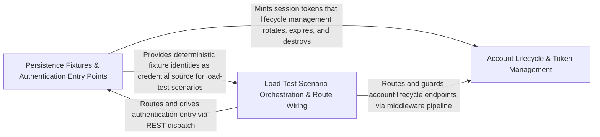

---
tags:
  - 2repo
  - 2repo/arch
  - project/boilerplate-node-backend
type: architecture
component: End_to_End_Load_Test_Scenarios_Driven_Fixtures
---

## Details

The k6 load-test scenarios that exercise the full request path end-to-end, plus the cross-cutting fixtures and middlewares they drive. k6/checkout.js is the write-path scenario (login → fill cart → checkout) that validates the stock-reservation logic under concurrency, treating a 409 refusal as a pass. k6/browse.js covers the read path. These scenarios depend on the i18n locale-override refresh, persistence fixtures (FactoryIdentity), the kernel requireFreshAuth middleware, and account fixtures (AddressBookOverrides).

### Persistence Fixtures & Authentication Entry Points
Provides the data-seeding and authentication entry points that the load-test scenarios depend on. FactoryIdentity is the canonical persistence fixture that creates deterministic user identities (credentials, sessions, tokens) so that k6 scripts can log in against a known state. Module-specific override fixtures (AddressBookOverrides, CartOverrides, WishlistOverrides) pre-populate per-module state that the checkout and browse scenarios consume. The authentication controllers (postLogin, postLoginTwoFactor, postPasswordChange, delete2fa, deleteSession, post2faConfirm, postAccountExport) form the entry path that every k6 scenario must traverse before reaching business logic. This layer sits at the persistence + controller boundary: it is the 'given' state and the 'act' entry that the load-test harness drives.

**Related Classes/Methods**:

- `src.infrastructure.persistence.fixtures.FactoryIdentity`:13-20
- `src.modules.account.fixtures.AddressBookOverrides`:19-24
- `src.modules.cart.fixtures.CartOverrides`:18-23
- `src.modules.account.controllers.post-login.postLogin`:29-97
- `src.modules.account.controllers.post-login-2fa.postLoginTwoFactor`:25-62

**Source Files:**

- `src/infrastructure/persistence/fixtures.ts`
  - `src.infrastructure.persistence.fixtures.FactoryIdentity` (L13-L20) - Interface
- `src/modules/account/controllers/delete-2fa.ts`
  - `src.modules.account.controllers.delete-2fa.delete2fa` (L22-L46) - Class
  - `src.modules.account.controllers.delete-2fa.delete2fa.then() callback` (L36-L44) - Function
  - `src.modules.account.controllers.delete-2fa.delete2fa.catch() callback` (L45-L45) - Function
- `src/modules/account/controllers/delete-session.ts`
  - `src.modules.account.controllers.delete-session.deleteSession` (L23-L39) - Class
  - `src.modules.account.controllers.delete-session.deleteSession.then() callback` (L30-L37) - Function
- `src/modules/account/controllers/post-2fa-confirm.ts`
  - `src.modules.account.controllers.post-2fa-confirm.post2faConfirm` (L21-L47) - Class
  - `src.modules.account.controllers.post-2fa-confirm.post2faConfirm.then() callback` (L35-L43) - Function
  - `src.modules.account.controllers.post-2fa-confirm.post2faConfirm.catch() callback` (L44-L45) - Function
- `src/modules/account/controllers/post-account-export.ts`
  - `src.modules.account.controllers.post-account-export.postAccountExport` (L15-L26) - Class
  - `src.modules.account.controllers.post-account-export.postAccountExport.then() callback` (L21-L24) - Function
- `src/modules/account/controllers/post-login-2fa.ts`
  - `src.modules.account.controllers.post-login-2fa.postLoginTwoFactor` (L25-L62) - Class
  - `src.modules.account.controllers.post-login-2fa.postLoginTwoFactor.then() callback` (L38-L57) - Function
  - `src.modules.account.controllers.post-login-2fa.postLoginTwoFactor.then() callback.then() callback` (L52-L56) - Function
  - `src.modules.account.controllers.post-login-2fa.postLoginTwoFactor.catch() callback` (L58-L61) - Function
- `src/modules/account/controllers/post-login.ts`
  - `src.modules.account.controllers.post-login.postLogin` (L29-L97) - Class
  - `src.modules.account.controllers.post-login.then() callback` (L55-L55) - Function
  - `src.modules.account.controllers.post-login.postLogin.then() callback` (L56-L90) - Function
  - `src.modules.account.controllers.post-login.postLogin.then() callback.then() callback` (L86-L89) - Function
  - `src.modules.account.controllers.post-login.postLogin.catch() callback` (L91-L96) - Function
- `src/modules/account/controllers/post-password-change.ts`
  - `src.modules.account.controllers.post-password-change.postPasswordChange` (L26-L78) - Class
  - `src.modules.account.controllers.post-password-change.postPasswordChange.then() callback` (L50-L73) - Function
  - `src.modules.account.controllers.post-password-change.postPasswordChange.then() callback.then() callback` (L65-L68) - Function
  - `src.modules.account.controllers.post-password-change.postPasswordChange.then() callback.catch() callback` (L69-L72) - Function
  - `src.modules.account.controllers.post-password-change.postPasswordChange.catch() callback` (L74-L77) - Function
- `src/modules/account/controllers/post-reauth.ts`
  - `src.modules.account.controllers.post-reauth.postReauth` (L26-L68) - Class
  - `src.modules.account.controllers.post-reauth.postReauth.then() callback` (L41-L63) - Function
  - `src.modules.account.controllers.post-reauth.postReauth.then() callback.then() callback` (L55-L58) - Function
  - `src.modules.account.controllers.post-reauth.postReauth.then() callback.catch() callback` (L59-L62) - Function
  - `src.modules.account.controllers.post-reauth.postReauth.catch() callback` (L64-L67) - Function
- `src/modules/account/controllers/post-reset-request.ts`
  - `src.modules.account.controllers.post-reset-request.postResetRequest` (L34-L64) - Class
  - `src.modules.account.controllers.post-reset-request.postResetRequest.catch() callback` (L48-L48) - Function
  - `src.modules.account.controllers.post-reset-request.postResetRequest.then() callback` (L49-L62) - Function
- `src/modules/account/controllers/write-addresses.ts`
  - `src.modules.account.controllers.write-addresses.postAddress` (L24-L41) - Class
  - `src.modules.account.controllers.write-addresses.postAddress.then() callback` (L36-L39) - Function
- `src/modules/account/fixtures.ts`
  - `src.modules.account.fixtures.AddressBookOverrides` (L19-L24) - Interface
- `src/modules/account/session/jwt.ts`
  - `src.modules.account.session.jwt.TokenData` (L28-L52) - Interface
  - `src.modules.account.session.jwt.then() callback.then() callback` (L264-L264) - Function
  - `src.modules.account.session.jwt.rotateRefreshToken.then() callback.then() callback.then() callback.entry` (L328-L328) - Class
  - `src.modules.account.session.jwt.rotateRefreshToken.then() callback.then() callback.then() callback.entry.user.tokens.find() callback` (L328-L328) - Function
- `src/modules/account/session/session.ts`
  - `src.modules.account.session.session.issueSession` (L23-L33) - Class
  - `src.modules.account.session.session.issueSession.then() callback` (L29-L33) - Function
- `src/modules/cart/fixtures.ts`
  - `src.modules.cart.fixtures.CartOverrides` (L18-L23) - Interface
- `src/modules/wishlist/fixtures.ts`
  - `src.modules.wishlist.fixtures.WishlistOverrides` (L14-L22) - Interface

### Load-Test Scenario Orchestration & Route Wiring
The execution spine of the subsystem. k6.checkout.default is the write-path scenario that sequences login → fill cart → checkout, with explicit k6 group() blocks and check() assertions. k6.checkout.login encapsulates the authentication step that feeds the session token into subsequent requests. On the server side, installRoutes is the single route-wiring function that mounts all module routers, the i18n middleware, and the auth middleware into the Express app. refreshLocaleOverrides is the i18n middleware that resolves locale-specific content per request, and requireFreshAuth is the kernel-level middleware that validates token freshness on every authenticated route. Together these form the request-path pipeline that the load test exercises end-to-end.

**Related Classes/Methods**:

- `k6.checkout.default`:67-99
- `src.app.routes.installRoutes`:24-47
- `src.infrastructure.i18n.overrides.refreshLocaleOverrides`:95-108
- `src.kernel.middlewares.authorizations.requireFreshAuth`:242-272
- `k6.checkout.login`:57-65

**Source Files:**

- `k6/checkout.js`
  - `k6.checkout.login` (L57-L65) - Class
  - `k6.checkout.login.'login answers 200'` (L63-L63) - Method
  - `k6.checkout.default` (L67-L99) - Function
  - `k6.checkout.default.group('fill the cart') callback` (L75-L86) - Function
  - `k6.checkout.default.group('fill the cart') callback.'add to cart accepted'` (L85-L85) - Method
  - `k6.checkout.default.group('check out') callback` (L88-L98) - Function
  - `k6.checkout.default.group('check out') callback.'checkout resolved'` (L96-L96) - Method
- `src/app/routes.ts`
  - `src.app.routes.installRoutes` (L24-L47) - Class
  - `src.app.routes.installRoutes.app.use() callback` (L44-L46) - Function
- `src/infrastructure/i18n/overrides.ts`
  - `src.infrastructure.i18n.overrides.refreshLocaleOverrides` (L95-L108) - Class
  - `src.infrastructure.i18n.overrides.refreshLocaleOverrides.then() callback` (L99-L99) - Function
  - `src.infrastructure.i18n.overrides.refreshLocaleOverrides.catch() callback` (L100-L107) - Function
- `src/kernel/middlewares/authorizations.ts`
  - `src.kernel.middlewares.authorizations.requireFreshAuth` (L242-L272) - Class
  - `src.kernel.middlewares.authorizations.requireFreshAuth.<function>` (L244-L272) - Function
  - `src.kernel.middlewares.authorizations.requireFreshAuth.<function>.hasRequiredMethods.every() callback` (L253-L254) - Function
  - `src.kernel.middlewares.authorizations.requireFreshAuth.<function>.hasRequiredMethods` (L253-L255) - Class
- `src/modules/delivery/controllers/get-shipment-by-order.ts`
  - `src.modules.delivery.controllers.get-shipment-by-order.getShipmentByOrder` (L14-L21) - Class
  - `src.modules.delivery.controllers.get-shipment-by-order.getShipmentByOrder.then() callback` (L17-L20) - Function
- `src/modules/feedback/controllers/post-feedback-contact.ts`
  - `src.modules.feedback.controllers.post-feedback-contact.postFeedbackContact` (L33-L50) - Class
  - `src.modules.feedback.controllers.post-feedback-contact.postFeedbackContact.then() callback` (L46-L48) - Function
- `src/modules/inventory/controllers/post-receipt.ts`
  - `src.modules.inventory.controllers.post-receipt.postReceipt` (L16-L28) - Class
  - `src.modules.inventory.controllers.post-receipt.postReceipt.then() callback` (L23-L26) - Function
- `src/modules/locales/controllers/delete-locale-entry.ts`
  - `src.modules.locales.controllers.delete-locale-entry.deleteLocaleEntry` (L19-L34) - Class
  - `src.modules.locales.controllers.delete-locale-entry.deleteLocaleEntry.then() callback` (L25-L33) - Function
- `src/modules/locales/controllers/delete-locale.ts`
  - `src.modules.locales.controllers.delete-locale.deleteLocale` (L19-L31) - Class
  - `src.modules.locales.controllers.delete-locale.deleteLocale.then() callback` (L22-L30) - Function
- `src/modules/locales/controllers/get-locale-entries.ts`
  - `src.modules.locales.controllers.get-locale-entries.getLocaleEntries` (L19-L45) - Class
  - `src.modules.locales.controllers.get-locale-entries.getLocaleEntries.then() callback` (L39-L42) - Function
- `src/modules/locales/controllers/write-locale-entries.ts`
  - `src.modules.locales.controllers.write-locale-entries.createLocaleEntry` (L43-L60) - Class
  - `src.modules.locales.controllers.write-locale-entries.createLocaleEntry.then() callback` (L52-L58) - Function
- `src/modules/locales/controllers/write-locales.ts`
  - `src.modules.locales.controllers.write-locales.updateLocale` (L56-L74) - Class
  - `src.modules.locales.controllers.write-locales.updateLocale.then() callback` (L68-L72) - Function
- `src/modules/orders/controllers/post-cancel-order.ts`
  - `src.modules.orders.controllers.post-cancel-order.postCancelOrder` (L21-L44) - Class
  - `src.modules.orders.controllers.post-cancel-order.postCancelOrder.then() callback` (L34-L43) - Function
- `src/modules/orders/service.ts`
  - `src.modules.orders.service.create.orderItems` (L177-L180) - Class
  - `src.modules.orders.service.create.orderItems.resolvedItems.map() callback` (L177-L180) - Function
- `src/modules/payments/controllers/get-payment-by-order.ts`
  - `src.modules.payments.controllers.get-payment-by-order.getPaymentByOrder` (L14-L21) - Class
  - `src.modules.payments.controllers.get-payment-by-order.getPaymentByOrder.then() callback` (L17-L20) - Function
- `src/modules/payments/controllers/post-payment-intent.ts`
  - `src.modules.payments.controllers.post-payment-intent.postPaymentIntent` (L16-L27) - Class
  - `src.modules.payments.controllers.post-payment-intent.postPaymentIntent.then() callback` (L22-L25) - Function
- `src/modules/wishlist/controllers/delete-wishlist-item.ts`
  - `src.modules.wishlist.controllers.delete-wishlist-item.deleteWishlistItem` (L18-L37) - Class
  - `src.modules.wishlist.controllers.delete-wishlist-item.deleteWishlistItem.then() callback` (L31-L35) - Function
- `src/modules/wishlist/controllers/post-move-to-cart.ts`
  - `src.modules.wishlist.controllers.post-move-to-cart.postMoveToCart` (L20-L39) - Class
  - `src.modules.wishlist.controllers.post-move-to-cart.postMoveToCart.then() callback` (L33-L37) - Function

### Account Lifecycle & Token Management
Covers the account state-management surface that the load-test scenarios validate after authentication. Includes the full token lifecycle (getRefreshToken, deleteExpiredTokens, postLogout), the 2FA setup and verification flow (post2faSetup, postVerifyConfirm, postResetConfirm), account deletion (deleteAccountRequest, deleteAccountConfirm), and address management (getAddresses, deleteAddress). These controllers represent the post-auth business operations that the k6 scenarios exercise in their teardown and validation phases. Architecturally, this layer sits downstream of the auth entry points (Group 1) and is invoked through the route pipeline (Group 2). It is the 'state mutation' sub-component: while Group 1 creates state and Group 2 drives requests, Group 3 manages the lifecycle of that state (create → use → refresh → expire → delete).

**Related Classes/Methods**:

- `src.modules.account.controllers.delete-account-confirm.deleteAccountConfirm`:24-65
- `src.modules.account.controllers.get-refresh-token.getRefreshToken`:23-57
- `src.modules.account.controllers.post-2fa-setup.post2faSetup`:17-30
- `src.modules.account.controllers.delete-expired-tokens.deleteExpiredTokens`:19-33
- `src.modules.account.controllers.get-addresses.getAddresses`:19-29

**Source Files:**

- `src/modules/account/controllers/delete-account-confirm.ts`
  - `src.modules.account.controllers.delete-account-confirm.deleteAccountConfirm` (L24-L65) - Class
  - `src.modules.account.controllers.delete-account-confirm.deleteAccountConfirm.then() callback` (L40-L63) - Function
  - `src.modules.account.controllers.delete-account-confirm.deleteAccountConfirm.then() callback.then() callback` (L46-L62) - Function
  - `src.modules.account.controllers.delete-account-confirm.deleteAccountConfirm.then() callback.then() callback.then() callback` (L57-L61) - Function
  - `src.modules.account.controllers.delete-account-confirm.deleteAccountConfirm.catch() callback` (L64-L64) - Function
- `src/modules/account/controllers/delete-account-request.ts`
  - `src.modules.account.controllers.delete-account-request.deleteAccountRequest` (L21-L45) - Class
  - `src.modules.account.controllers.delete-account-request.deleteAccountRequest.then() callback` (L27-L43) - Function
  - `src.modules.account.controllers.delete-account-request.deleteAccountRequest.then() callback.then() callback` (L34-L42) - Function
  - `src.modules.account.controllers.delete-account-request.deleteAccountRequest.catch() callback` (L44-L44) - Function
- `src/modules/account/controllers/delete-address.ts`
  - `src.modules.account.controllers.delete-address.deleteAddress` (L18-L30) - Class
  - `src.modules.account.controllers.delete-address.deleteAddress.then() callback` (L25-L28) - Function
- `src/modules/account/controllers/delete-expired-tokens.ts`
  - `src.modules.account.controllers.delete-expired-tokens.deleteExpiredTokens` (L19-L33) - Class
  - `src.modules.account.controllers.delete-expired-tokens.deleteExpiredTokens.then() callback` (L22-L31) - Function
- `src/modules/account/controllers/get-account.ts`
  - `src.modules.account.controllers.get-account.getAccount` (L16-L30) - Class
  - `src.modules.account.controllers.get-account.getAccount.then() callback` (L24-L28) - Function
  - `src.modules.account.controllers.get-account.getAccount.catch() callback` (L29-L29) - Function
- `src/modules/account/controllers/get-addresses.ts`
  - `src.modules.account.controllers.get-addresses.getAddresses` (L19-L29) - Class
  - `src.modules.account.controllers.get-addresses.getAddresses.then() callback` (L25-L27) - Function
- `src/modules/account/controllers/get-refresh-token.ts`
  - `src.modules.account.controllers.get-refresh-token.getRefreshToken` (L23-L57) - Class
  - `src.modules.account.controllers.get-refresh-token.getRefreshToken.then() callback` (L33-L48) - Function
  - `src.modules.account.controllers.get-refresh-token.getRefreshToken.then() callback.then() callback` (L36-L44) - Function
  - `src.modules.account.controllers.get-refresh-token.getRefreshToken.then() callback.catch() callback` (L45-L48) - Function
  - `src.modules.account.controllers.get-refresh-token.getRefreshToken.catch() callback` (L50-L56) - Function
- `src/modules/account/controllers/post-2fa-setup.ts`
  - `src.modules.account.controllers.post-2fa-setup.post2faSetup` (L17-L30) - Class
  - `src.modules.account.controllers.post-2fa-setup.post2faSetup.then() callback` (L22-L28) - Function
  - `src.modules.account.controllers.post-2fa-setup.post2faSetup.catch() callback` (L29-L29) - Function
- `src/modules/account/controllers/post-logout.ts`
  - `src.modules.account.controllers.post-logout.postLogout` (L20-L32) - Class
  - `src.modules.account.controllers.post-logout.postLogout.then() callback` (L25-L30) - Function
- `src/modules/account/controllers/post-reset-confirm.ts`
  - `src.modules.account.controllers.post-reset-confirm.postResetConfirm` (L21-L82) - Class
  - `src.modules.account.controllers.post-reset-confirm.postResetConfirm.then() callback` (L38-L78) - Function
  - `src.modules.account.controllers.post-reset-confirm.postResetConfirm.then() callback.then() callback` (L58-L77) - Function
  - `src.modules.account.controllers.post-reset-confirm.postResetConfirm.then() callback.then() callback.then() callback` (L70-L76) - Function
  - `src.modules.account.controllers.post-reset-confirm.postResetConfirm.catch() callback` (L79-L81) - Function
- `src/modules/account/controllers/post-verify-confirm.ts`
  - `src.modules.account.controllers.post-verify-confirm.postVerifyConfirm` (L24-L68) - Class
  - `src.modules.account.controllers.post-verify-confirm.postVerifyConfirm.then() callback` (L44-L63) - Function
  - `src.modules.account.controllers.post-verify-confirm.postVerifyConfirm.then() callback.then() callback` (L50-L62) - Function
  - `src.modules.account.controllers.post-verify-confirm.postVerifyConfirm.then() callback.then() callback.then() callback` (L58-L61) - Function
  - `src.modules.account.controllers.post-verify-confirm.postVerifyConfirm.catch() callback` (L64-L67) - Function
