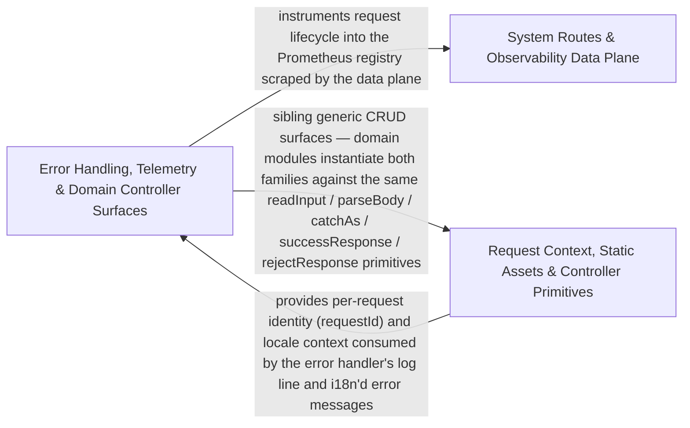

---
tags:
  - 2repo
  - 2repo/arch
  - project/boilerplate-node-backend
type: architecture
component: Express_Bootstrap_Route_Mounting
---

## Details

The application assembly surface: a set of install* functions that configure the Express app in a load-bearing order. installRoutes walks enabledModules and mounts each module's router at its manifest-declared basePath, then mounts system-routes and the 404 catch-all. installErrorHandling mounts the global error handler last and registers process-level auditors. installTelemetry installs Prometheus latency/in-flight middleware before routes. installRequestContext attaches correlation id, access log, OTel context and locale negotiation. installStatic serves public/uploaded assets with hardened headers.

### System Routes & Observability Data Plane
The process self-description surface: system-level HTTP routes (root ping, health, contract/docs endpoints) and the observability data they expose — Prometheus HTTP metrics (request counters, latency percentiles, in-flight gauges), process memory/CPU snapshots, dependency health aggregation, audit action mapping, and the error-interpretation layer that translates database/domain errors into structured HTTP responses. This is the 'what the process reports about itself' layer, consumed by the system routes and the paired observability stack (Grafana/Prometheus/Loki).

**Related Classes/Methods**:

- `src.infrastructure.observability.metrics-http.getHttpRequestCounters`:277-283
- `src.infrastructure.observability.dependency-health.overallStatus`:59-62

**Source Files:**

- `src/app/system-routes.ts`
  - `src.app.system-routes.router.get('/') callback` (L15-L17) - Function
- `src/infrastructure/http/controller.ts`
  - `src.infrastructure.http.controller.ServiceResult` (L22-L28) - Interface
- `src/infrastructure/http/errors.ts`
  - `src.infrastructure.http.errors.databaseErrorInterpreter` (L89-L108) - Function
- `src/infrastructure/observability/audit.ts`
  - `src.infrastructure.observability.audit.AuditActionMap` (L39-L39) - Interface
- `src/infrastructure/observability/dependency-health.ts`
  - `src.infrastructure.observability.dependency-health.overallStatus` (L59-L62) - Class
  - `src.infrastructure.observability.dependency-health.overallStatus.every() callback` (L60-L60) - Function
- `src/infrastructure/observability/metrics-http.ts`
  - `src.infrastructure.observability.metrics-http._processUptimeGauge` (L35-L42) - Class
  - `src.infrastructure.observability.metrics-http._processUptimeGauge.collect` (L39-L41) - Method
  - `src.infrastructure.observability.metrics-http.sumMetricValues` (L190-L191) - Class
  - `src.infrastructure.observability.metrics-http.sumMetricValues.values.reduce() callback` (L191-L191) - Function
  - `src.infrastructure.observability.metrics-http.getHttpRequestCounters` (L277-L283) - Class
  - `src.infrastructure.observability.metrics-http.getHttpRequestCounters.then() callback` (L279-L282) - Function
  - `src.infrastructure.observability.metrics-http.getLatencyPercentiles` (L300-L309) - Class
  - `src.infrastructure.observability.metrics-http.getLatencyPercentiles.then() callback` (L301-L309) - Function
- `src/infrastructure/observability/process-snapshot.ts`
  - `src.infrastructure.observability.process-snapshot.ProcessMemorySnapshot` (L11-L23) - Interface
  - `src.infrastructure.observability.process-snapshot.ProcessSnapshot` (L26-L33) - Interface
- `src/infrastructure/observability/stream.ts`
  - `src.infrastructure.observability.stream.buildObservabilityPayload` (L63-L84) - Class
  - `src.infrastructure.observability.stream.buildObservabilityPayload.then() callback` (L67-L83) - Function
  - `src.infrastructure.observability.stream.writeMetricsEvent` (L92-L99) - Class
  - `src.infrastructure.observability.stream.writeMetricsEvent.then() callback` (L95-L97) - Function
  - `src.infrastructure.observability.stream.writeMetricsEvent.catch() callback` (L98-L98) - Function
  - `src.infrastructure.observability.stream.streamObservabilityMetrics.updatesInterval` (L126-L128) - Class
  - `src.infrastructure.observability.stream.streamObservabilityMetrics.updatesInterval.setInterval() callback` (L126-L128) - Function
  - `src.infrastructure.observability.stream.streamObservabilityMetrics.heartbeatInterval` (L132-L134) - Class
  - `src.infrastructure.observability.stream.streamObservabilityMetrics.heartbeatInterval.setInterval() callback` (L132-L134) - Function
- `src/infrastructure/observability/tracer.ts`
  - `src.infrastructure.observability.tracer.tracer.startActiveSpan() callback.then() callback` (L50-L56) - Function
- `src/modules/cart/controllers/get-cart-summary.ts`
  - `src.modules.cart.controllers.get-cart-summary.getCartSummary` (L16-L23) - Class
  - `src.modules.cart.controllers.get-cart-summary.getCartSummary.then() callback` (L19-L21) - Function
- `src/modules/cart/controllers/post-cart.ts`
  - `src.modules.cart.controllers.post-cart.postCart` (L21-L46) - Class
  - `src.modules.cart.controllers.post-cart.postCart.then() callback` (L40-L44) - Function
- `src/modules/cart/controllers/put-cart-item.ts`
  - `src.modules.cart.controllers.put-cart-item.putCartItem` (L26-L52) - Class
  - `src.modules.cart.controllers.put-cart-item.putCartItem.then() callback` (L46-L50) - Function
- `src/modules/feedback/controllers/put-feedback-status.ts`
  - `src.modules.feedback.controllers.put-feedback-status.putFeedbackStatus` (L30-L46) - Class
  - `src.modules.feedback.controllers.put-feedback-status.putFeedbackStatus.then() callback` (L41-L44) - Function
- `src/modules/locales/controllers/get-locale-messages.ts`
  - `src.modules.locales.controllers.get-locale-messages.getLocaleMessages` (L17-L29) - Class
  - `src.modules.locales.controllers.get-locale-messages.getLocaleMessages.then() callback` (L24-L27) - Function
- `src/modules/observability/controllers/get-observability-audit.ts`
  - `src.modules.observability.controllers.get-observability-audit.getObservabilityAuditLogs` (L22-L60) - Class
  - `src.modules.observability.controllers.get-observability-audit.getObservabilityAuditLogs.then() callback` (L58-L58) - Function
- `src/modules/observability/controllers/get-observability-metrics-overview.ts`
  - `src.modules.observability.controllers.get-observability-metrics-overview.MetricSample` (L23-L26) - Interface
  - `src.modules.observability.controllers.get-observability-metrics-overview.sumByLabel` (L51-L52) - Class
  - `src.modules.observability.controllers.get-observability-metrics-overview.sumByLabel.reduce() callback` (L52-L52) - Function
  - `src.modules.observability.controllers.get-observability-metrics-overview.sumByLabel.values.filter() callback` (L52-L52) - Function
  - `src.modules.observability.controllers.get-observability-metrics-overview.getObservabilityMetricsOverview` (L58-L124) - Class
  - `src.modules.observability.controllers.get-observability-metrics-overview.getObservabilityMetricsOverview.then() callback` (L75-L122) - Function
  - `src.modules.observability.controllers.get-observability-metrics-overview.getObservabilityMetricsOverview.then() callback.inFlight` (L89-L89) - Class
  - `src.modules.observability.controllers.get-observability-metrics-overview.getObservabilityMetricsOverview.then() callback.inFlight.inflightMetric.values.reduce() callback` (L89-L89) - Function
  - `src.modules.observability.controllers.get-observability-metrics-overview.getObservabilityMetricsOverview.then() callback.data.business.ordersCreated.orderValues.reduce() callback` (L106-L106) - Function
  - `src.modules.observability.controllers.get-observability-metrics-overview.getObservabilityMetricsOverview.then() callback.data.business.lowStockProducts.lowStockValues.reduce() callback` (L107-L107) - Function
  - `src.modules.observability.controllers.get-observability-metrics-overview.getObservabilityMetricsOverview.then() callback.data.business.reservedUnits.reservedValues.reduce() callback` (L108-L108) - Function
  - `src.modules.observability.controllers.get-observability-metrics-overview.getObservabilityMetricsOverview.then() callback.data.database.queriesTotal.databaseQueryValues.reduce() callback` (L111-L111) - Function
  - `src.modules.observability.controllers.get-observability-metrics-overview.getObservabilityMetricsOverview.then() callback.data.database.errorsTotal.databaseErrorValues.reduce() callback` (L112-L112) - Function
- `src/modules/observability/routes.ts`
  - `src.modules.observability.routes.router.get('/events') callback` (L31-L33) - Function
- `src/modules/orders/demo.ts`
  - `src.modules.orders.demo.MediumOrderSeed` (L174-L177) - Interface
- `src/modules/orders/repository.ts`
  - `src.modules.orders.repository.scrubDueForAnonymization` (L200-L229) - Class
  - `src.modules.orders.repository.scrubDueForAnonymization.then() callback` (L219-L227) - Function
  - `src.modules.orders.repository.scrubDueForAnonymization.then() callback.then() callback` (L227-L227) - Function
- `src/modules/payments/controllers/post-payment-refund.ts`
  - `src.modules.payments.controllers.post-payment-refund.postPaymentRefund` (L16-L27) - Class
  - `src.modules.payments.controllers.post-payment-refund.postPaymentRefund.then() callback` (L23-L26) - Function
- `src/modules/wishlist/controllers/post-wishlist.ts`
  - `src.modules.wishlist.controllers.post-wishlist.postWishlist` (L20-L46) - Class
  - `src.modules.wishlist.controllers.post-wishlist.postWishlist.then() callback` (L40-L44) - Function

### Error Handling, Telemetry & Domain Controller Surfaces
The request-lifecycle protection layer and the concrete controller surface. installErrorHandling mounts the global error handler last in the pipeline and registers process-level auditors for uncaughtException/unhandledRejection. installTelemetry installs Prometheus latency and in-flight request middleware before routes. The group also contains the controller surface factories (create-list-controller, create-search-controller) that define the ListControllerSpec and search handler patterns, plus the concrete domain controllers (cart CRUD, checkout) that consume these factories to produce their HTTP handlers. This is the 'protect the pipeline + build the domain HTTP surface' layer.

**Related Classes/Methods**:

- `src.app.error-handling.installErrorHandling`:94-125
- `src.app.telemetry.installTelemetry`:22-42
- `src.infrastructure.surfaces.create-list-controller.ListControllerSpec`:17-41
- `src.infrastructure.surfaces.create-search-controller.createSearchController.handler`:53-74
- `src.modules.cart.controllers.post-checkout.postCheckout`:21-45

**Source Files:**

- `src/app/error-handling.ts`
  - `src.app.error-handling.installErrorHandling` (L94-L125) - Class
  - `src.app.error-handling.installErrorHandling.process.on('unhandledRejection') callback` (L100-L108) - Function
  - `src.app.error-handling.installErrorHandling.process.on('uncaughtException') callback` (L114-L124) - Function
- `src/app/telemetry.ts`
  - `src.app.telemetry.installTelemetry` (L22-L42) - Class
  - `src.app.telemetry.installTelemetry.app.use() callback` (L26-L41) - Function
  - `src.app.telemetry.installTelemetry.app.use() callback.response.once('finish') callback` (L29-L39) - Function
- `src/infrastructure/surfaces/create-list-controller.ts`
  - `src.infrastructure.surfaces.create-list-controller.ListControllerSpec` (L17-L41) - Interface
- `src/infrastructure/surfaces/create-search-controller.ts`
  - `src.infrastructure.surfaces.create-search-controller.createSearchController.handler` (L53-L74) - Class
  - `src.infrastructure.surfaces.create-search-controller.createSearchController.handler.[operation]` (L54-L73) - Method
  - `src.infrastructure.surfaces.create-search-controller.createSearchController.handler.[operation].then() callback` (L69-L71) - Function
- `src/modules/cart/controllers/delete-cart-all.ts`
  - `src.modules.cart.controllers.delete-cart-all.clearCart` (L19-L28) - Class
  - `src.modules.cart.controllers.delete-cart-all.clearCart.then() callback` (L24-L26) - Function
- `src/modules/cart/controllers/delete-cart-item.ts`
  - `src.modules.cart.controllers.delete-cart-item.deleteCartItem` (L28-L50) - Class
  - `src.modules.cart.controllers.delete-cart-item.deleteCartItem.then() callback` (L45-L48) - Function
- `src/modules/cart/controllers/get-cart.ts`
  - `src.modules.cart.controllers.get-cart.getCart` (L17-L24) - Class
  - `src.modules.cart.controllers.get-cart.getCart.then() callback` (L20-L22) - Function
- `src/modules/cart/controllers/post-checkout.ts`
  - `src.modules.cart.controllers.post-checkout.postCheckout` (L21-L45) - Class
  - `src.modules.cart.controllers.post-checkout.postCheckout.then() callback` (L30-L39) - Function
  - `src.modules.cart.controllers.post-checkout.postCheckout.catch() callback` (L40-L44) - Function
- `src/modules/cart/controllers/post-reorder.ts`
  - `src.modules.cart.controllers.post-reorder.postReorder` (L18-L30) - Class
  - `src.modules.cart.controllers.post-reorder.postReorder.then() callback` (L24-L28) - Function
- `src/modules/cart/repository.ts`
  - `src.modules.cart.repository.upsertLine` (L33-L67) - Class
  - `src.modules.cart.repository.upsertLine.then() callback` (L53-L61) - Function
  - `src.modules.cart.repository.upsertLine.catch() callback` (L63-L66) - Function
- `src/modules/delivery/controllers/post-courier-advance.ts`
  - `src.modules.delivery.controllers.post-courier-advance.postCourierAdvance` (L16-L22) - Class
  - `src.modules.delivery.controllers.post-courier-advance.postCourierAdvance.then() callback` (L19-L21) - Function
- `src/modules/feedback/controllers/delete-feedback.ts`
  - `src.modules.feedback.controllers.delete-feedback.deleteFeedback` (L25-L36) - Class
  - `src.modules.feedback.controllers.delete-feedback.deleteFeedback.then() callback` (L28-L31) - Function
  - `src.modules.feedback.controllers.delete-feedback.deleteFeedback.catch() callback` (L32-L36) - Function
- `src/modules/inventory/controllers/get-inventory-levels.ts`
  - `src.modules.inventory.controllers.get-inventory-levels.getInventoryLevels` (L13-L22) - Class
  - `src.modules.inventory.controllers.get-inventory-levels.getInventoryLevels.runList` (L21-L21) - Method
- `src/modules/inventory/controllers/get-stock-movements.ts`
  - `src.modules.inventory.controllers.get-stock-movements.getStockMovements` (L13-L21) - Class
  - `src.modules.inventory.controllers.get-stock-movements.getStockMovements.runList` (L20-L20) - Method
- `src/modules/inventory/controllers/post-reservations-sweep.ts`
  - `src.modules.inventory.controllers.post-reservations-sweep.postReservationsSweep` (L17-L23) - Class
  - `src.modules.inventory.controllers.post-reservations-sweep.postReservationsSweep.then() callback` (L20-L22) - Function
- `src/modules/locales/controllers/write-locale-entries.ts`
  - `src.modules.locales.controllers.write-locale-entries.updateLocaleEntry` (L67-L89) - Class
  - `src.modules.locales.controllers.write-locale-entries.updateLocaleEntry.then() callback` (L81-L87) - Function
  - `src.modules.locales.controllers.write-locale-entries.importEntries` (L92-L108) - Class
  - `src.modules.locales.controllers.write-locale-entries.importEntries.then() callback` (L101-L107) - Function
  - `src.modules.locales.controllers.write-locale-entries.importEntries.catch() callback` (L108-L108) - Function
- `src/modules/orders/controllers/write-orders.ts`
  - `src.modules.orders.controllers.write-orders.writeOrders` (L25-L91) - Class
  - `src.modules.orders.controllers.write-orders.then() callback` (L57-L68) - Function
  - `src.modules.orders.controllers.write-orders.writeOrders.then() callback` (L85-L89) - Function
- `src/modules/orders/service.ts`
  - `src.modules.orders.service.create.resolvedItems` (L163-L167) - Class
  - `src.modules.orders.service.create.resolvedItems.items.map() callback` (L164-L165) - Function
  - `src.modules.orders.service.create.resolvedItems.items.map() callback.then() callback` (L165-L165) - Function
- `src/modules/payments/controllers/post-payment-confirm.ts`
  - `src.modules.payments.controllers.post-payment-confirm.postPaymentConfirm` (L18-L41) - Class
  - `src.modules.payments.controllers.post-payment-confirm.postPaymentConfirm.then() callback` (L30-L39) - Function
- `src/modules/wishlist/controllers/get-wishlist.ts`
  - `src.modules.wishlist.controllers.get-wishlist.getWishlist` (L17-L24) - Class
  - `src.modules.wishlist.controllers.get-wishlist.getWishlist.then() callback` (L20-L22) - Function

### Request Context, Static Assets & Controller Primitives
The per-request preparation and generic controller building blocks. installRequestContext attaches the correlation ID (reusing or generating a UUID), the Winston access log with OTel trace injection, and locale negotiation (must precede routes since all downstream copy resolves against it). installStatic serves public/uploaded assets with hardened headers (dotfiles ignored, no directory listing, immutable caching, cross-origin resource policy). The group also contains the generic CRUD controller factories (create-delete-controller, create-item-controller, create-list-controller) that provide the RemoveResult/ItemResult/ListResult handler patterns domain modules instantiate, plus the cluster respawn scheduler that keeps the process alive under worker crashes. This is the 'prepare the request + serve assets + provide reusable controller scaffolding' layer.

**Related Classes/Methods**:

- `src.app.request-context.installRequestContext`:28-53
- `src.app.static-assets.installStatic`:14-41
- `src.infrastructure.surfaces.create-delete-controller.createDeleteController.handler`:75-121
- `src.infrastructure.surfaces.create-item-controller.createItemController.handler`:46-65

**Source Files:**

- `eslint/rules/no-persistence-imports.ts`
  - `eslint.rules.no-persistence-imports.noPersistenceImports` (L58-L118) - Class
  - `eslint.rules.no-persistence-imports.noPersistenceImports.create` (L89-L117) - Method
  - `eslint.rules.no-persistence-imports.noPersistenceImports.create.ImportDeclaration` (L95-L115) - Method
- `src/app/request-context.ts`
  - `src.app.request-context.installRequestContext` (L28-L53) - Class
  - `src.app.request-context.installRequestContext.app.use() callback` (L32-L41) - Function
- `src/app/static-assets.ts`
  - `src.app.static-assets.installStatic` (L14-L41) - Class
  - `src.app.static-assets.installStatic.setHeaders` (L36-L38) - Method
- `src/cluster.ts`
  - `src.cluster.scheduleRespawn.timer` (L74-L77) - Class
  - `src.cluster.scheduleRespawn.timer.setTimeout() callback` (L74-L77) - Function
- `src/infrastructure/i18n/negotiate.ts`
  - `src.infrastructure.i18n.negotiate.negotiateLocale.candidates.map() callback.declared` (L37-L39) - Class
  - `src.infrastructure.i18n.negotiate.negotiateLocale.candidates.map() callback.declared.parameters.map() callback` (L38-L38) - Function
- `src/infrastructure/surfaces/create-delete-controller.ts`
  - `src.infrastructure.surfaces.create-delete-controller.RemoveResult` (L30-L35) - Interface
  - `src.infrastructure.surfaces.create-delete-controller.createDeleteController.handler` (L75-L121) - Class
  - `src.infrastructure.surfaces.create-delete-controller.createDeleteController.handler.[operation]` (L76-L120) - Method
  - `src.infrastructure.surfaces.create-delete-controller.createDeleteController.handler.[operation].then() callback` (L95-L112) - Function
  - `src.infrastructure.surfaces.create-delete-controller.createDeleteController.handler.[operation].catch() callback` (L113-L119) - Function
- `src/infrastructure/surfaces/create-item-controller.ts`
  - `src.infrastructure.surfaces.create-item-controller.createItemController.handler` (L46-L65) - Class
  - `src.infrastructure.surfaces.create-item-controller.createItemController.handler.[operation]` (L47-L64) - Method
  - `src.infrastructure.surfaces.create-item-controller.createItemController.handler.[operation].then() callback` (L50-L56) - Function
  - `src.infrastructure.surfaces.create-item-controller.createItemController.handler.[operation].catch() callback` (L57-L63) - Function
- `src/infrastructure/surfaces/create-list-controller.ts`
  - `src.infrastructure.surfaces.create-list-controller.createListController.handler` (L60-L79) - Class
  - `src.infrastructure.surfaces.create-list-controller.createListController.handler.[operation]` (L61-L78) - Method
  - `src.infrastructure.surfaces.create-list-controller.createListController.handler.[operation].then() callback` (L74-L76) - Function
