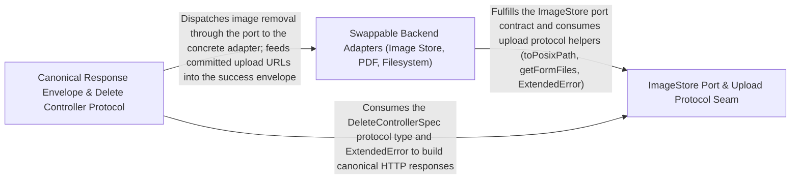

---
tags:
  - 2repo
  - 2repo/arch
  - project/boilerplate-node-backend
type: architecture
component: Infrastructure_Adapters_HTTP_Protocol_Layer
---

## Details

The swappable adapter seam and the HTTP protocol dialect the app layer speaks. Owns the ImageStore port and its filesystem implementation, the multer-based upload pipeline (staging path, filename policy, MIME validation), PDF rendering, and the canonical response envelope (successResponse / rejectResponse / validationErrors) plus the ExtendedError type and databaseErrorInterpreter that the global error handler consumes. This is the protocol + ports half of the subsystem — the boundary between the app assembly and the concrete backends (disk, PDF engine, image store).

### Swappable Backend Adapters (Image Store, PDF, Filesystem)
The concrete, swappable backend implementations behind the ports. This is the 'adapters' half of the seam: the filesystem-backed ImageStore implementation, the HTML→PDF rendering engine (headless Chromium via puppeteer-core), the multer disk-storage pipeline (staging path, field whitelist, unguessable filename policy, MIME gate), and the low-level filesystem primitives (moveFile with EXDEV fallback, non-throwing deleteFile) that the image store and cleanup paths rely on. It is the boundary where the app's abstract operations become concrete disk/PDF-engine actions, and where a second backend would be added as a second object with the same methods.

**Related Classes/Methods**:

- `src.infrastructure.adapters.pdf.renderHtmlToPdf`:45-71
- `src.infrastructure.adapters.storage.storeUploadedImages`:338-371

**Source Files:**

- `src/infrastructure/adapters/pdf.ts`
  - `src.infrastructure.adapters.pdf.renderHtmlToPdf` (L45-L71) - Class
  - `src.infrastructure.adapters.pdf.renderHtmlToPdf.then() callback` (L50-L70) - Function
  - `src.infrastructure.adapters.pdf.renderHtmlToPdf.then() callback.then() callback` (L54-L66) - Function
  - `src.infrastructure.adapters.pdf.renderHtmlToPdf.then() callback.then() callback.then() callback` (L66-L66) - Function
  - `src.infrastructure.adapters.pdf.renderHtmlToPdf.then() callback.finally() callback` (L70-L70) - Function
- `src/infrastructure/adapters/storage.ts`
  - `src.infrastructure.adapters.storage.validateUploadedImages` (L268-L315) - Class
  - `src.infrastructure.adapters.storage.validateUploadedImages.paths.map() callback` (L282-L282) - Function
  - `src.infrastructure.adapters.storage.validateUploadedImages.then() callback` (L283-L313) - Function
  - `src.infrastructure.adapters.storage.validateUploadedImages.then() callback.then() callback` (L304-L311) - Function
  - `src.infrastructure.adapters.storage.validateUploadedImages.catch() callback` (L314-L314) - Function
  - `src.infrastructure.adapters.storage.storeUploadedImages` (L338-L371) - Class
  - `src.infrastructure.adapters.storage.storeUploadedImages.staged.map() callback` (L348-L348) - Function
  - `src.infrastructure.adapters.storage.storeUploadedImages.then() callback` (L349-L369) - Function
  - `src.infrastructure.adapters.storage.storeUploadedImages.then() callback.results.map() callback` (L353-L353) - Function
  - `src.infrastructure.adapters.storage.storeUploadedImages.then() callback.staged.map() callback` (L362-L362) - Function
  - `src.infrastructure.adapters.storage.storeUploadedImages.then() callback.results.filter() callback` (L366-L366) - Function
  - `src.infrastructure.adapters.storage.storeUploadedImages.then() callback.map() callback` (L367-L367) - Function
  - `src.infrastructure.adapters.storage.storeUploadedImages.then() callback.then() callback` (L368-L368) - Function
- `src/infrastructure/http/delete-controller.ts`
  - `src.infrastructure.http.delete-controller.createDeleteController.handler` (L72-L121) - Class
  - `src.infrastructure.http.delete-controller.createDeleteController.handler.[operation]` (L73-L120) - Method
  - `src.infrastructure.http.delete-controller.createDeleteController.handler.[operation].catch() callback` (L113-L119) - Function
- `src/infrastructure/http/errors.ts`
  - `src.infrastructure.http.errors.ExtendedError` (L23-L72) - Class
  - `src.infrastructure.http.errors.ExtendedError.constructor` (L42-L71) - Constructor
- `src/infrastructure/http/uploads.ts`
  - `src.infrastructure.http.uploads.getFormFiles` (L36-L56) - Function
- `src/infrastructure/observability/analytics/index.ts`
  - `src.infrastructure.observability.analytics.index.AnalyticsEventMap` (L36-L36) - Interface
  - `src.infrastructure.observability.analytics.index.AnalyticsEvent` (L58-L79) - Interface
- `src/infrastructure/observability/metrics-http.ts`
  - `src.infrastructure.observability.metrics-http.RequestMetricInput` (L162-L168) - Interface
  - `src.infrastructure.observability.metrics-http.LatencyBucket` (L216-L220) - Interface
  - `src.infrastructure.observability.metrics-http.aggregateLatencyBuckets.buckets.toSorted() callback` (L259-L259) - Function
  - `src.infrastructure.observability.metrics-http.aggregateLatencyBuckets.buckets.map() callback` (L260-L260) - Function
- `src/kernel/middlewares/authorizations.ts`
  - `src.kernel.middlewares.authorizations.isAdminViaCookie` (L136-L177) - Class
  - `src.kernel.middlewares.authorizations.isAdminViaCookie.catch() callback` (L172-L175) - Function
- `src/modules/orders/controllers/get-order-invoice.ts`
  - `src.modules.orders.controllers.get-order-invoice.then() callback.then() callback` (L60-L60) - Function

### ImageStore Port & Upload Protocol Seam
The interface/protocol half of the storage seam — the contract that everything outside the adapters talks to, plus the read-side upload normalization. It defines the ImageStore port (put/remove) as the single place that may turn an opaque imageUrl into a filesystem path, and exposes the request-facing helpers that let controllers stay backend-agnostic: getFormFiles, resolveImageUrl, and toPosixPath. It also carries the shared delete-controller protocol (DeleteControllerSpec) and the ExtendedError type that the global error handler consumes, and is the seam where tracing (withSpan) wraps the adapter calls. This is the 'port + protocol' boundary that makes 'move uploads to a bucket' a one-file change.

**Related Classes/Methods**:

- `src.infrastructure.adapters.image-store.ImageStore`:21-50
- `src.infrastructure.http.delete-controller.DeleteControllerSpec`:44-56
- `src.infrastructure.observability.tracer.withSpan`:45-89

**Source Files:**

- `src/infrastructure/adapters/filesystem.ts`
  - `src.infrastructure.adapters.filesystem.deleteFile` (L51-L61) - Class
  - `src.infrastructure.adapters.filesystem.deleteFile.toolkitDeleteFile() callback` (L53-L60) - Function
- `src/infrastructure/adapters/image-store.ts`
  - `src.infrastructure.adapters.image-store.ImageStore` (L21-L50) - Interface
  - `src.infrastructure.adapters.image-store.ImageStore.put` (L37-L37) - Method
  - `src.infrastructure.adapters.image-store.ImageStore.remove` (L49-L49) - Method
  - `src.infrastructure.adapters.image-store.filesystemImageStore` (L80-L126) - Class
  - `src.infrastructure.adapters.image-store.filesystemImageStore.put` (L81-L88) - Method
  - `src.infrastructure.adapters.image-store.filesystemImageStore.remove` (L90-L125) - Method
- `src/infrastructure/http/delete-controller.ts`
  - `src.infrastructure.http.delete-controller.DeleteControllerSpec` (L44-L56) - Interface
- `src/infrastructure/http/errors.ts`
  - `src.infrastructure.http.errors.databaseErrorInterpreter` (L99-L129) - Function
- `src/infrastructure/http/uploads.ts`
  - `src.infrastructure.http.uploads.resolveImageUrl` (L73-L76) - Function
- `src/infrastructure/observability/tracer.ts`
  - `src.infrastructure.observability.tracer.withSpan` (L45-L89) - Class
  - `src.infrastructure.observability.tracer.withSpan.tracer.startActiveSpan() callback` (L55-L88) - Function
  - `src.infrastructure.observability.tracer.tracer.startActiveSpan() callback.then() callback` (L64-L70) - Function
  - `src.infrastructure.observability.tracer.withSpan.tracer.startActiveSpan() callback.then() callback` (L71-L86) - Function
- `src/modules/orders/controllers/delete-orders.ts`
  - `src.modules.orders.controllers.delete-orders.deleteOrders` (L14-L19) - Class
  - `src.modules.orders.controllers.delete-orders.deleteOrders.remove` (L16-L16) - Method
- `src/modules/products/controllers/delete-products.ts`
  - `src.modules.products.controllers.delete-products.deleteProducts` (L13-L18) - Class
  - `src.modules.products.controllers.delete-products.deleteProducts.remove` (L15-L15) - Method
- `src/modules/products/controllers/write-products.ts`
  - `src.modules.products.controllers.write-products.writeProducts` (L28-L162) - Class
  - `src.modules.products.controllers.write-products.writeProducts.then() callback` (L150-L156) - Function
  - `src.modules.products.controllers.write-products.writeProducts.then() callback.then() callback` (L152-L154) - Function
  - `src.modules.products.controllers.write-products.writeProducts.catch() callback` (L157-L160) - Function
  - `src.modules.products.controllers.write-products.writeProducts.catch() callback.then() callback` (L158-L160) - Function
- `src/modules/users/controllers/delete-users.ts`
  - `src.modules.users.controllers.delete-users.deleteUsers` (L13-L18) - Class
  - `src.modules.users.controllers.delete-users.deleteUsers.remove` (L15-L15) - Method

### Canonical Response Envelope & Delete Controller Protocol
The HTTP response dialect the app layer speaks — the canonical success/reject envelope and the validation-error mapping, plus the concrete delete-controller factory that all modules share. It owns successResponse / rejectResponse / generateReject, the status→code/message derivation, and validationErrors (turning a ZodError into the contract's { code, message, details.field } list), which is the single exit point for both failures and validation results. It also hosts createDeleteController (the one-controller-per-entity factory built on DeleteControllerSpec) and the storeUploadedImages/resolveUploadDestination commit path that feeds the envelope. This is the 'protocol' half: the shape every endpoint answers with, independent of which backend produced the data.

**Related Classes/Methods**:

- `src.infrastructure.http.response.validationErrors`:227-235
- `src.infrastructure.adapters.storage.resolveUploadDestination`:70-90

**Source Files:**

- `src/infrastructure/adapters/storage.ts`
  - `src.infrastructure.adapters.storage.resolveUploadDestination` (L70-L90) - Class
  - `src.infrastructure.adapters.storage.resolveUploadDestination.then() callback` (L88-L88) - Function
  - `src.infrastructure.adapters.storage.resolveUploadDestination.catch() callback` (L89-L89) - Function
- `src/infrastructure/http/response.ts`
  - `src.infrastructure.http.response.validationErrors` (L227-L235) - Class
  - `src.infrastructure.http.response.validationErrors.error.issues.map() callback` (L228-L235) - Function
