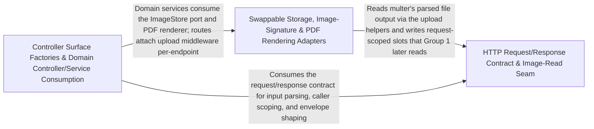

---
tags:
  - 2repo
  - 2repo/arch
  - project/boilerplate-node-backend
type: architecture
component: Infrastructure_Adapters_HTTP_Protocol_Primitives
---

## Details

The domain-agnostic infrastructure layer the entry layer depends on: swappable adapters (image store, image-signature verification, PDF rendering, upload storage resolution) plus the HTTP protocol primitives (request input declarations / CallerContext, response normalization, upload URL resolution). These are the ports/adapters that the bootstrap surface and the domain modules call into — the image-store seam, the storage destination resolver, and the request/response contract helpers.

### HTTP Request/Response Contract & Image-Read Seam
The request/response contract helpers plus the read side of the image-store seam. It owns how a controller declares and reads its input (readInput, RequestInputDeclaration, CallerContext), how every success/reject envelope and error item is normalized (normalizeErrors, generateReject, rejectResponse), and how an uploaded image is read back from the request into a RequestImage value (readUploadedImage, resolveImageUrl, resolveThumbnailUrl, resolvePendingImageKey). This is the stable surface the bootstrap controllers and domain modules depend on to speak the API contract and to consume an upload without knowing whether it was digested inline or deferred to a broker.

**Related Classes/Methods**:

- `src.infrastructure.http.response.normalizeErrors`:155-182
- `src.infrastructure.http.uploads.resolveImageUrl`:62-65
- `src.infrastructure.adapters.image-store.readUploadedImage`:273-305

**Source Files:**

- `src/infrastructure/adapters/image-store.ts`
  - `src.infrastructure.adapters.image-store.RequestImage` (L235-L262) - Interface
  - `src.infrastructure.adapters.image-store.readUploadedImage` (L273-L305) - Class
  - `src.infrastructure.adapters.image-store.deleteUpload` (L287-L287) - Method
  - `src.infrastructure.adapters.image-store.readUploadedImage.deleteUpload` (L303-L303) - Method
- `src/infrastructure/http/middlewares/request-logger.ts`
  - `src.infrastructure.http.middlewares.request-logger.requestLogger` (L17-L42) - Class
  - `src.infrastructure.http.middlewares.request-logger.requestLogger.response.once('finish') callback` (L21-L39) - Function
- `src/infrastructure/http/request.ts`
  - `src.infrastructure.http.request.RequestInputDeclaration` (L126-L147) - Interface
  - `src.infrastructure.http.request.readInput.undecoded` (L243-L243) - Class
  - `src.infrastructure.http.request.readInput.undecoded.stated.find() callback` (L243-L243) - Function
  - `src.infrastructure.http.request.CallerContext` (L276-L304) - Interface
- `src/infrastructure/http/response.ts`
  - `src.infrastructure.http.response.normalizeErrors` (L155-L182) - Class
  - `src.infrastructure.http.response.normalizeErrors.inputErrors.map() callback` (L164-L181) - Function
- `src/infrastructure/http/uploads.ts`
  - `src.infrastructure.http.uploads.resolveImageUrl` (L62-L65) - Function
  - `src.infrastructure.http.uploads.resolveThumbnailUrl` (L72-L76) - Function
  - `src.infrastructure.http.uploads.resolvePendingImageKey` (L85-L89) - Function
- `src/modules/account/controllers/get-sessions.ts`
  - `src.modules.account.controllers.get-sessions.getSessions` (L18-L30) - Class
  - `src.modules.account.controllers.get-sessions.getSessions.then() callback` (L25-L28) - Function
- `src/modules/account/controllers/post-logout-everywhere.ts`
  - `src.modules.account.controllers.post-logout-everywhere.postLogoutEverywhere` (L19-L29) - Class
  - `src.modules.account.controllers.post-logout-everywhere.postLogoutEverywhere.then() callback` (L22-L27) - Function
- `src/modules/account/controllers/post-signup.ts`
  - `src.modules.account.controllers.post-signup.postSignup` (L22-L76) - Class
  - `src.modules.account.controllers.post-signup.postSignup.then() callback` (L52-L70) - Function
  - `src.modules.account.controllers.post-signup.postSignup.then() callback.then() callback` (L54-L57) - Function
  - `src.modules.account.controllers.post-signup.postSignup.catch() callback` (L71-L75) - Function
- `src/modules/account/controllers/post-verify-request.ts`
  - `src.modules.account.controllers.post-verify-request.postVerifyRequest` (L18-L29) - Class
  - `src.modules.account.controllers.post-verify-request.postVerifyRequest.then() callback` (L24-L27) - Function
- `src/modules/account/controllers/put-account.ts`
  - `src.modules.account.controllers.put-account.putAccount` (L24-L69) - Class
  - `src.modules.account.controllers.put-account.putAccount.then() callback` (L48-L64) - Function
  - `src.modules.account.controllers.put-account.putAccount.then() callback.then() callback` (L50-L52) - Function
  - `src.modules.account.controllers.put-account.putAccount.catch() callback` (L65-L68) - Function
- `src/modules/account/controllers/write-addresses.ts`
  - `src.modules.account.controllers.write-addresses.putAddress` (L49-L67) - Class
  - `src.modules.account.controllers.write-addresses.putAddress.then() callback` (L62-L65) - Function
- `src/modules/products/controllers/write-products.ts`
  - `src.modules.products.controllers.write-products.writeProducts` (L30-L167) - Class
  - `src.modules.products.controllers.write-products.catch() callback` (L82-L82) - Function
  - `src.modules.products.controllers.write-products.catch() callback.then() callback` (L137-L139) - Function
  - `src.modules.products.controllers.write-products.writeProducts.then() callback` (L155-L161) - Function
  - `src.modules.products.controllers.write-products.writeProducts.then() callback.then() callback` (L157-L159) - Function
  - `src.modules.products.controllers.write-products.writeProducts.catch() callback` (L162-L165) - Function
  - `src.modules.products.controllers.write-products.writeProducts.catch() callback.then() callback` (L163-L165) - Function
- `src/modules/users/controllers/delete-user-two-factor.ts`
  - `src.modules.users.controllers.delete-user-two-factor.deleteUserTwoFactor` (L21-L36) - Class
  - `src.modules.users.controllers.delete-user-two-factor.deleteUserTwoFactor.then() callback` (L26-L32) - Function
  - `src.modules.users.controllers.delete-user-two-factor.deleteUserTwoFactor.catch() callback` (L33-L34) - Function
- `src/modules/users/controllers/write-users.ts`
  - `src.modules.users.controllers.write-users.writeUsers` (L31-L159) - Class
  - `src.modules.users.controllers.write-users.catch() callback` (L80-L80) - Function
  - `src.modules.users.controllers.write-users.catch() callback.then() callback` (L134-L136) - Function
  - `src.modules.users.controllers.write-users.writeUsers.then() callback` (L145-L151) - Function
  - `src.modules.users.controllers.write-users.writeUsers.then() callback.then() callback` (L147-L149) - Function
  - `src.modules.users.controllers.write-users.writeUsers.catch() callback` (L152-L157) - Function
  - `src.modules.users.controllers.write-users.writeUsers.catch() callback.then() callback` (L155-L157) - Function

### Swappable Storage, Image-Signature & PDF Rendering Adapters
The ports/adapters behind the swappable seams. It decides where uploads land and how they are named (resolveUploadDestination, resolveUploadFilename, fileStorage), verifies that uploaded bytes are genuinely an accepted raster image by their leading bytes rather than the client's Content-Type (identifyImage, identifyImageFile, ACCEPTED_UPLOAD_MIMETYPES), and renders HTML to PDF via headless Chromium both synchronously (renderHtmlToPdf) and as a queued job (handlePdfJob). These are the adapter boundaries a different backend (S3/CDN store, different renderer) would replace without touching the domain modules.

**Related Classes/Methods**:

- `src.infrastructure.adapters.storage.resolveUploadDestination`:59-77
- `src.infrastructure.adapters.pdf.renderHtmlToPdf`:48-74
- `src.infrastructure.adapters.pdf.worker.handlePdfJob`:27-53

**Source Files:**

- `src/infrastructure/adapters/image-signatures.ts`
  - `src.infrastructure.adapters.image-signatures.ACCEPTED_UPLOAD_MIMETYPES` (L67-L69) - Class
  - `src.infrastructure.adapters.image-signatures.ACCEPTED_UPLOAD_MIMETYPES.SUPPORTED_IMAGE_FORMATS.flatMap() callback` (L68-L68) - Function
  - `src.infrastructure.adapters.image-signatures.CANONICAL_MIME_BY_ALIAS` (L72-L76) - Class
  - `src.infrastructure.adapters.image-signatures.CANONICAL_MIME_BY_ALIAS.SUPPORTED_IMAGE_FORMATS.flatMap() callback` (L73-L74) - Function
  - `src.infrastructure.adapters.image-signatures.CANONICAL_MIME_BY_ALIAS.SUPPORTED_IMAGE_FORMATS.flatMap() callback.map() callback` (L74-L74) - Function
  - `src.infrastructure.adapters.image-signatures.HEADER_LENGTH` (L79-L81) - Class
  - `src.infrastructure.adapters.image-signatures.HEADER_LENGTH.SUPPORTED_IMAGE_FORMATS.map() callback` (L80-L80) - Function
- `src/infrastructure/adapters/pdf.ts`
  - `src.infrastructure.adapters.pdf.renderHtmlToPdf` (L48-L74) - Class
  - `src.infrastructure.adapters.pdf.renderHtmlToPdf.then() callback` (L53-L73) - Function
  - `src.infrastructure.adapters.pdf.renderHtmlToPdf.then() callback.then() callback` (L57-L69) - Function
  - `src.infrastructure.adapters.pdf.renderHtmlToPdf.then() callback.then() callback.then() callback` (L69-L69) - Function
  - `src.infrastructure.adapters.pdf.renderHtmlToPdf.then() callback.finally() callback` (L73-L73) - Function
- `src/infrastructure/adapters/pdf.worker.ts`
  - `src.infrastructure.adapters.pdf.worker.handlePdfJob` (L27-L53) - Class
  - `src.infrastructure.adapters.pdf.worker.then() callback` (L44-L44) - Function
  - `src.infrastructure.adapters.pdf.worker.handlePdfJob.then() callback` (L45-L48) - Function
  - `src.infrastructure.adapters.pdf.worker.handlePdfJob.catch() callback` (L49-L52) - Function
- `src/infrastructure/adapters/storage.ts`
  - `src.infrastructure.adapters.storage.resolveUploadDestination` (L59-L77) - Class
  - `src.infrastructure.adapters.storage.resolveUploadDestination.then() callback` (L75-L75) - Function
  - `src.infrastructure.adapters.storage.resolveUploadDestination.catch() callback` (L76-L76) - Function
  - `src.infrastructure.adapters.storage.validateUploadedImages.then() callback.rejected` (L236-L240) - Class
  - `src.infrastructure.adapters.storage.validateUploadedImages.then() callback.rejected.paths.filter() callback` (L237-L239) - Function
  - `src.infrastructure.adapters.storage.validateUploadedImages.then() callback.rejected.map() callback` (L256-L256) - Function
  - `src.infrastructure.adapters.storage.quarantineUploadedImages.then() callback.keys` (L307-L307) - Class
  - `src.infrastructure.adapters.storage.quarantineUploadedImages.then() callback.keys.results.map() callback` (L307-L307) - Function
  - `src.infrastructure.adapters.storage.quarantineUploadedImages.then() callback.keys.map() callback` (L318-L318) - Function
- `src/modules/feedback/controllers/get-feedback.ts`
  - `src.modules.feedback.controllers.get-feedback.getFeedback` (L34-L63) - Class
  - `src.modules.feedback.controllers.get-feedback.getFeedback.then() callback` (L61-L61) - Function
- `src/modules/locales/controllers/write-locales.ts`
  - `src.modules.locales.controllers.write-locales.createLocale` (L31-L49) - Class
  - `src.modules.locales.controllers.write-locales.createLocale.then() callback` (L43-L47) - Function
- `src/modules/locales/repository.ts`
  - `src.modules.locales.repository.EntryInput` (L22-L25) - Interface
  - `src.modules.locales.repository.ImportCounts` (L28-L32) - Interface
  - `src.modules.locales.repository.importEntries.removedKeys` (L205-L205) - Class
  - `src.modules.locales.repository.importEntries.removedKeys.filter() callback` (L205-L205) - Function
- `src/modules/orders/controllers/get-order-invoice.ts`
  - `src.modules.orders.controllers.get-order-invoice.getOrderInvoice` (L22-L73) - Class
  - `src.modules.orders.controllers.get-order-invoice.getOrderInvoice.then() callback` (L32-L71) - Function
  - `src.modules.orders.controllers.get-order-invoice.then() callback.then() callback` (L60-L60) - Function
  - `src.modules.orders.controllers.get-order-invoice.getOrderInvoice.then() callback.then() callback` (L61-L70) - Function
- `src/modules/orders/controllers/get-order-item.ts`
  - `src.modules.orders.controllers.get-order-item.getOrderItem` (L23-L41) - Class
  - `src.modules.orders.controllers.get-order-item.getOrderItem.then() callback` (L31-L39) - Function
- `src/modules/payments/controllers/post-payment-confirm.ts`
  - `src.modules.payments.controllers.post-payment-confirm.postPaymentConfirm.then() callback.declined` (L31-L32) - Class
  - `src.modules.payments.controllers.post-payment-confirm.postPaymentConfirm.then() callback.declined.result.errors.some() callback` (L32-L32) - Function

### Controller Surface Factories & Domain Controller/Service Consumption
The bootstrap surface layer that turns a per-entity spec into a standard Express handler, and the domain controllers/services that consume those factories. The factories (createItemController, createDeleteController, createSearchController, and the list controller) centralize the API's contract decisions so each of the 13 modules can declare a *ControllerSpec and get a uniform handler. The domain controllers (e.g. getOrders, deleteOrders, getLocales, postAdjustment) and services (e.g. shipOrder) are the concrete consumers that wire their fetch/service logic into these surfaces, closing the loop from the request/response contract and the adapters into actual module behavior.

**Related Classes/Methods**:

- `src.infrastructure.surfaces.create-delete-controller.DeleteControllerSpec`:38-56
- `src.infrastructure.surfaces.create-search-controller.SearchControllerSpec`:17-34
- `src.modules.orders.controllers.get-orders.getOrders`:34-47
- `src.modules.inventory.controllers.post-adjustment.postAdjustment`:18-37

**Source Files:**

- `src/infrastructure/surfaces/create-delete-controller.ts`
  - `src.infrastructure.surfaces.create-delete-controller.DeleteControllerSpec` (L38-L56) - Interface
- `src/infrastructure/surfaces/create-item-controller.ts`
  - `src.infrastructure.surfaces.create-item-controller.ItemControllerSpec` (L16-L32) - Interface
- `src/infrastructure/surfaces/create-search-controller.ts`
  - `src.infrastructure.surfaces.create-search-controller.SearchControllerSpec` (L17-L34) - Interface
- `src/modules/delivery/service.ts`
  - `src.modules.delivery.service.shipOrder.user` (L76-L78) - Class
  - `src.modules.delivery.service.shipOrder.user.catch() callback` (L77-L77) - Function
- `src/modules/inventory/controllers/post-adjustment.ts`
  - `src.modules.inventory.controllers.post-adjustment.postAdjustment` (L18-L37) - Class
  - `src.modules.inventory.controllers.post-adjustment.postAdjustment.then() callback` (L32-L35) - Function
- `src/modules/locales/controllers/get-locales.ts`
  - `src.modules.locales.controllers.get-locales.getLocales` (L20-L25) - Class
  - `src.modules.locales.controllers.get-locales.getLocales.then() callback` (L24-L24) - Function
- `src/modules/orders/controllers/delete-orders.ts`
  - `src.modules.orders.controllers.delete-orders.deleteOrders` (L16-L21) - Class
  - `src.modules.orders.controllers.delete-orders.deleteOrders.remove` (L18-L18) - Method
- `src/modules/orders/controllers/get-orders.ts`
  - `src.modules.orders.controllers.get-orders.getOrders` (L34-L47) - Class
  - `src.modules.orders.controllers.get-orders.getOrders.extendInput` (L38-L40) - Method
  - `src.modules.orders.controllers.get-orders.getOrders.runSearch` (L41-L46) - Method
- `src/modules/orders/emails.ts`
  - `src.modules.orders.emails.OrderLines` (L20-L24) - Interface
  - `src.modules.orders.emails.InvoiceOrder` (L67-L69) - Interface
- `src/modules/payments/service.ts`
  - `src.modules.payments.service.confirmPayment.then() callback.declined` (L232-L233) - Class
  - `src.modules.payments.service.confirmPayment.then() callback.declined.result.errors.some() callback` (L233-L233) - Function
- `src/modules/products/controllers/delete-products.ts`
  - `src.modules.products.controllers.delete-products.deleteProducts` (L16-L21) - Class
  - `src.modules.products.controllers.delete-products.deleteProducts.remove` (L18-L18) - Method
- `src/modules/products/controllers/get-catalogue-facets.ts`
  - `src.modules.products.controllers.get-catalogue-facets.getCatalogueFacets` (L18-L24) - Class
  - `src.modules.products.controllers.get-catalogue-facets.getCatalogueFacets.then() callback` (L21-L23) - Function
- `src/modules/products/controllers/get-product-item.ts`
  - `src.modules.products.controllers.get-product-item.getProductItem` (L16-L26) - Class
  - `src.modules.products.controllers.get-product-item.getProductItem.fetch` (L20-L25) - Method
- `src/modules/products/controllers/get-products.ts`
  - `src.modules.products.controllers.get-products.searchProductsQuerySchema.minPrice.z.preprocess() callback` (L30-L30) - Function
  - `src.modules.products.controllers.get-products.searchProductsQuerySchema.maxPrice.z.preprocess() callback` (L34-L34) - Function
  - `src.modules.products.controllers.get-products.searchProductsQuerySchema.active.z.preprocess() callback` (L39-L39) - Function
  - `src.modules.products.controllers.get-products.getProducts` (L57-L71) - Class
  - `src.modules.products.controllers.get-products.getProducts.extendInput` (L61-L64) - Method
  - `src.modules.products.controllers.get-products.getProducts.runSearch` (L65-L70) - Method
- `src/modules/products/demo-catalog.ts`
  - `src.modules.products.demo-catalog.FILLER_PRODUCTS.ANIMALS.flatMap() callback` (L142-L153) - Function
  - `src.modules.products.demo-catalog.FILLER_PRODUCTS` (L142-L154) - Class
  - `src.modules.products.demo-catalog.FILLER_PRODUCTS.ANIMALS.flatMap() callback.PRODUCT_TYPES.flatMap() callback` (L143-L152) - Function
  - `src.modules.products.demo-catalog.FILLER_PRODUCTS.ANIMALS.flatMap() callback.PRODUCT_TYPES.flatMap() callback.TIERS.map() callback` (L144-L152) - Function
- `src/modules/users/controllers/delete-users.ts`
  - `src.modules.users.controllers.delete-users.deleteUsers` (L20-L28) - Class
  - `src.modules.users.controllers.delete-users.deleteUsers.remove` (L22-L22) - Method
  - `src.modules.users.controllers.delete-users.deleteUsers.auditAction` (L23-L26) - Method
- `src/modules/users/controllers/get-user-item.ts`
  - `src.modules.users.controllers.get-user-item.getUserItem` (L15-L19) - Class
  - `src.modules.users.controllers.get-user-item.getUserItem.fetch` (L18-L18) - Method
- `src/modules/users/controllers/get-users.ts`
  - `src.modules.users.controllers.get-users.queryBoolean` (L16-L19) - Class
  - `src.modules.users.controllers.get-users.queryBoolean.z.preprocess() callback` (L17-L17) - Function
  - `src.modules.users.controllers.get-users.getUsers` (L46-L50) - Class
  - `src.modules.users.controllers.get-users.getUsers.runSearch` (L49-L49) - Method
