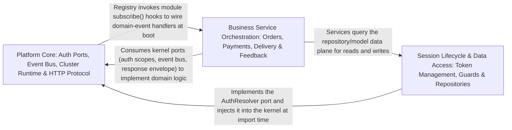

---
tags:
  - 2repo
  - 2repo/arch
  - project/boilerplate-node-backend
type: architecture
component: Kernel_HTTP_Infrastructure
---

## Details

The domain-agnostic platform layer providing the module registry (manifest → running app), the authentication/authorization ports (AuthResolver, scope creation), the domain-event bus (emit/subscribe), the cluster runtime (worker fork/respawn/shutdown), and the HTTP infrastructure (request/response helpers, middleware for cache/locale/rate-limit, upload handling) that every module depends on.

### Platform Core: Auth Ports, Event Bus, Cluster Runtime & HTTP Protocol [[Expand]](./Platform_Core_Auth_Ports_Event_Bus_Cluster_Runtime_HTTP_Protocol.md)
The foundational platform layer that every other component depends on. It declares the authentication port (AuthResolver) and authorization scope factories, hosts the domain-event bus as the sanctioned cross-module communication channel, manages the cluster runtime (worker fork, crash detection, coordinated shutdown), and defines the HTTP protocol contract including the canonical response envelope, request input polymorphism rules, transport-level security, response caching, and upload normalization. It is domain-free by design, with all domain-specific behavior injected via ports.

**Related Classes/Methods**:

- `src.kernel.authorization.createOwnerScope`:46-47
- `src.infrastructure.http.response.ResponseSuccess`:27-37

**Source Files:**

- `src/app/security.ts`
  - `src.app.security.allowedOrigins` (L33-L38) - Class
  - `src.app.security.allowedOrigins.map() callback` (L36-L36) - Function
- `src/cluster.ts`
  - `src.cluster.cluster.on('exit') callback.recentCrashes` (L140-L140) - Class
  - `src.cluster.cluster.on('exit') callback.recentCrashes.crashHistory.filter() callback` (L140-L140) - Function
- `src/infrastructure/http/middlewares/cache.ts`
  - `src.infrastructure.http.middlewares.cache.getCacheKey.values` (L199-L205) - Class
  - `src.infrastructure.http.middlewares.cache.getCacheKey.values.sortedKeyParameters.filter() callback` (L200-L200) - Function
  - `src.infrastructure.http.middlewares.cache.getCacheKey.values.map() callback` (L201-L204) - Function
- `src/infrastructure/http/middlewares/rate-limit.ts`
  - `src.infrastructure.http.middlewares.rate-limit.refuse` (L84-L99) - Class
  - `src.infrastructure.http.middlewares.rate-limit.refuse.<function>` (L86-L99) - Function
- `src/infrastructure/http/request.ts`
  - `src.infrastructure.http.request.readInput.sources.map() callback` (L207-L208) - Function
  - `src.infrastructure.http.request.readInput.sources` (L207-L209) - Class
  - `src.infrastructure.http.request.readInput.stated` (L237-L239) - Class
  - `src.infrastructure.http.request.readInput.stated.sources.map() callback` (L238-L238) - Function
  - `src.infrastructure.http.request.readInput.stated.filter() callback` (L239-L239) - Function
- `src/infrastructure/http/response.ts`
  - `src.infrastructure.http.response.ResponseNeutral` (L14-L21) - Interface
  - `src.infrastructure.http.response.ResponseSuccess` (L27-L37) - Interface
  - `src.infrastructure.http.response.ResponseErrorItem` (L40-L47) - Interface
  - `src.infrastructure.http.response.ResponseReject` (L53-L60) - Interface
- `src/infrastructure/http/uploads.ts`
  - `src.infrastructure.http.uploads.getFormFiles.paths` (L39-L41) - Class
  - `src.infrastructure.http.uploads.getFormFiles.paths.request.files.map() callback` (L40-L40) - Function
  - `src.infrastructure.http.uploads.getFormFiles.paths.flatMap() callback` (L41-L41) - Function
  - `src.infrastructure.http.uploads.getFormFiles.paths.flatMap() callback.files.map() callback` (L41-L41) - Function
- `src/infrastructure/i18n/context.ts`
  - `src.infrastructure.i18n.context.LocaleContext` (L21-L26) - Interface
- `src/infrastructure/i18n/negotiate.ts`
  - `src.infrastructure.i18n.negotiate.negotiateLocale.candidates` (L33-L51) - Class
  - `src.infrastructure.i18n.negotiate.negotiateLocale.candidates.map() callback` (L35-L48) - Function
  - `src.infrastructure.i18n.negotiate.negotiateLocale.candidates.filter() callback` (L49-L49) - Function
  - `src.infrastructure.i18n.negotiate.negotiateLocale.candidates.toSorted() callback` (L51-L51) - Function
- `src/infrastructure/observability/analytics/index.ts`
  - `src.infrastructure.observability.analytics.index.AnalyticsEventMap` (L25-L25) - Interface
  - `src.infrastructure.observability.analytics.index.AnalyticsEvent` (L42-L63) - Interface
  - `src.infrastructure.observability.analytics.index.AnalyticsProvider` (L78-L103) - Interface
  - `src.infrastructure.observability.analytics.index.AnalyticsProvider.capture` (L86-L86) - Method
  - `src.infrastructure.observability.analytics.index.AnalyticsProvider.configured` (L94-L94) - Method
  - `src.infrastructure.observability.analytics.index.AnalyticsProvider.shutdown` (L102-L102) - Method
  - `src.infrastructure.observability.analytics.index.shutdownAnalytics` (L202-L209) - Class
  - `src.infrastructure.observability.analytics.index.shutdownAnalytics.then() callback` (L204-L208) - Function
- `src/infrastructure/observability/analytics/none.ts`
  - `src.infrastructure.observability.analytics.none.noneAnalyticsProvider` (L14-L29) - Class
  - `src.infrastructure.observability.analytics.none.noneAnalyticsProvider.capture` (L17-L19) - Method
  - `src.infrastructure.observability.analytics.none.noneAnalyticsProvider.configured` (L22-L24) - Method
  - `src.infrastructure.observability.analytics.none.noneAnalyticsProvider.shutdown` (L26-L28) - Method
- `src/infrastructure/observability/analytics/posthog.ts`
  - `src.infrastructure.observability.analytics.posthog.posthogAnalyticsProvider` (L50-L95) - Class
  - `src.infrastructure.observability.analytics.posthog.posthogAnalyticsProvider.configured` (L53-L55) - Method
  - `src.infrastructure.observability.analytics.posthog.posthogAnalyticsProvider.capture` (L57-L81) - Method
  - `src.infrastructure.observability.analytics.posthog.posthogAnalyticsProvider.shutdown` (L87-L94) - Method
- `src/infrastructure/observability/analytics/umami.ts`
  - `src.infrastructure.observability.analytics.umami.umamiAnalyticsProvider` (L76-L150) - Class
  - `src.infrastructure.observability.analytics.umami.umamiAnalyticsProvider.configured` (L81-L83) - Method
  - `src.infrastructure.observability.analytics.umami.umamiAnalyticsProvider.capture` (L85-L140) - Method
  - `src.infrastructure.observability.analytics.umami.umamiAnalyticsProvider.capture.then() callback` (L123-L133) - Function
  - `src.infrastructure.observability.analytics.umami.umamiAnalyticsProvider.capture.catch() callback` (L134-L139) - Function
  - `src.infrastructure.observability.analytics.umami.umamiAnalyticsProvider.shutdown` (L147-L149) - Method
- `src/infrastructure/observability/audit.ts`
  - `src.infrastructure.observability.audit.AuditEvent` (L52-L74) - Interface
  - `src.infrastructure.observability.audit.AuditEntry` (L80-L85) - Interface
- `src/infrastructure/observability/dependency-health.ts`
  - `src.infrastructure.observability.dependency-health.DependencyHealth` (L24-L28) - Interface
- `src/infrastructure/persistence/fixtures.ts`
  - `src.infrastructure.persistence.fixtures.stripUndefined` (L46-L47) - Class
  - `src.infrastructure.persistence.fixtures.stripUndefined.filter() callback` (L47-L47) - Function
- `src/infrastructure/persistence/search.ts`
  - `src.infrastructure.persistence.search.PaginationInput` (L11-L17) - Interface
- `src/kernel/authentication.ts`
  - `src.kernel.authentication.AuthenticatedUser` (L12-L32) - Interface
  - `src.kernel.authentication.AuthResolver` (L35-L38) - Interface
  - `src.kernel.authentication.resolveAccessToken` (L67-L68) - Class
  - `src.kernel.authentication.resolveAccessToken.then() callback` (L68-L68) - Function
- `src/kernel/authorization.ts`
  - `src.kernel.authorization.createOwnerScope` (L46-L47) - Class
  - `src.kernel.authorization.createOwnerScope.restrictNonAdmin() callback` (L47-L47) - Function
  - `src.kernel.authorization.createVisibilityScope` (L61-L62) - Class
  - `src.kernel.authorization.createVisibilityScope.restrictNonAdmin() callback` (L62-L62) - Function
- `src/kernel/events.ts`
  - `src.kernel.events.DomainEventMap` (L21-L21) - Interface
- `src/kernel/middlewares/authorizations.ts`
  - `src.kernel.middlewares.authorizations.getAuth` (L45-L72) - Class
  - `src.kernel.middlewares.authorizations.getAuth.then() callback` (L54-L67) - Function
  - `src.kernel.middlewares.authorizations.getAuth.catch() callback` (L68-L70) - Function
  - `src.kernel.middlewares.authorizations.FreshAuthOptions` (L217-L225) - Interface
- `src/modules/inventory/service.ts`
  - `src.modules.inventory.service.StockLine` (L38-L41) - Interface
  - `src.modules.inventory.service.StockShortfall` (L44-L49) - Interface
  - `src.modules.inventory.service.LevelFilters` (L58-L60) - Interface
  - `src.modules.inventory.service.MovementFilters` (L63-L66) - Interface
- `src/modules/payments/providers/card.ts`
  - `src.modules.payments.providers.card.CardDetails` (L9-L11) - Interface
- `src/modules/products/model.ts`
  - `src.modules.products.model.title.error` (L71-L71) - Method
  - `src.modules.products.model.zodProductSchema.title.error` (L72-L72) - Method
  - `src.modules.products.model.price.error` (L75-L75) - Method
  - `src.modules.products.model.zodProductSchema.price.error` (L76-L76) - Method
- `src/modules/users/model.ts`
  - `src.modules.users.model.TokenType` (L22-L25) - Enum
  - `src.modules.users.model.Token` (L44-L70) - Interface
  - `src.modules.users.model.UserMethods` (L136-L143) - Interface
  - `src.modules.users.model.email.error` (L160-L160) - Method
  - `src.modules.users.model.zodUserSchema.email.error` (L161-L161) - Method
  - `src.modules.users.model.username.error` (L165-L165) - Method
  - `src.modules.users.model.zodUserSchema.username.error` (L166-L166) - Method
  - `src.modules.users.model.password.error` (L174-L174) - Method
  - `src.modules.users.model.password.refine() callback` (L176-L176) - Function
  - `src.modules.users.model.zodUserSchema.password.refine() callback` (L185-L185) - Function
  - `src.modules.users.model.zodUserSchema.password.error` (L186-L186) - Method
  - `src.modules.users.model.userSchema.pre('save') callback` (L388-L396) - Function
  - `src.modules.users.model.userSchema.pre('save') callback.then() callback` (L393-L395) - Function
  - `src.modules.users.model.tokenAdd.then() callback` (L426-L432) - Function
  - `src.modules.users.model.tokenRemoveAll.then() callback` (L441-L447) - Function
  - `src.modules.users.model.tokenRemoveAll.then() callback.tokens.filter() callback` (L446-L446) - Function

### Business Service Orchestration: Orders, Payments, Delivery & Feedback [[Expand]](./Business_Service_Orchestration_Orders_Payments_Delivery_Feedback.md)
The service-layer orchestration where business modules consume the platform core to implement their domain logic. Contains service methods for orders (search, cancel, remove, anonymize, update), payments (createIntent, confirmPayment), delivery (getForOrder), and feedback (search), along with the account module's authentication, profile, tokens, and verification services. These services call the kernel's authorization scopes to narrow queries, emit domain events to notify other modules, and respond through the canonical envelope. The group also includes the validationErrors helper that translates Zod errors into the structured ResponseErrorItem[] format.

**Related Classes/Methods**:

- `src.modules.payments.service.createIntent`:106-137
- `src.infrastructure.http.response.validationErrors`:224-232

**Source Files:**

- `src/infrastructure/http/response.ts`
  - `src.infrastructure.http.response.validationErrors` (L224-L232) - Class
  - `src.infrastructure.http.response.validationErrors.error.issues.map() callback` (L225-L232) - Function
- `src/modules/account/services/addresses.ts`
  - `src.modules.account.services.addresses.AddressesView` (L22-L24) - Interface
  - `src.modules.account.services.addresses.addressAdd` (L49-L55) - Class
  - `src.modules.account.services.addresses.addressAdd.then() callback` (L55-L55) - Function
  - `src.modules.account.services.addresses.addressRemove` (L69-L76) - Class
  - `src.modules.account.services.addresses.addressRemove.then() callback` (L73-L76) - Function
  - `src.modules.account.services.addresses.then() callback.book.items.find() callback` (L90-L90) - Function
- `src/modules/account/services/authentication.ts`
  - `src.modules.account.services.authentication.logoutCurrentSession` (L202-L225) - Class
  - `src.modules.account.services.authentication.logoutCurrentSession.then() callback` (L207-L224) - Function
  - `src.modules.account.services.authentication.signup` (L299-L387) - Class
  - `src.modules.account.services.authentication.signup.parseResult` (L314-L331) - Class
  - `src.modules.account.services.authentication.signup.parseResult.superRefine() callback` (L318-L324) - Function
  - `src.modules.account.services.authentication.signup.outcome` (L333-L356) - Class
  - `src.modules.account.services.authentication.signup.outcome.then() callback.then() callback` (L351-L352) - Function
  - `src.modules.account.services.authentication.signup.outcome.catch() callback` (L355-L355) - Function
  - `src.modules.account.services.authentication.signup.outcome.then() callback` (L358-L386) - Function
  - `src.modules.account.services.authentication.login` (L392-L425) - Class
  - `src.modules.account.services.authentication.login.then() callback` (L410-L422) - Function
  - `src.modules.account.services.authentication.login.then() callback.then() callback` (L417-L421) - Function
  - `src.modules.account.services.authentication.login.catch() callback` (L423-L423) - Function
  - `src.modules.account.services.authentication.reauth` (L498-L527) - Class
  - `src.modules.account.services.authentication.outcome.then() callback` (L506-L515) - Function
- `src/modules/account/services/profile.ts`
  - `src.modules.account.services.profile.removeOwnAccount` (L171-L208) - Class
  - `src.modules.account.services.profile.removeOwnAccount.then() callback` (L182-L207) - Function
  - `src.modules.account.services.profile.updateProfile` (L244-L280) - Class
  - `src.modules.account.services.profile.updateProfile.outcome` (L251-L268) - Class
  - `src.modules.account.services.profile.updateProfile.outcome.catch() callback` (L267-L267) - Function
  - `src.modules.account.services.profile.updateProfile.outcome.then() callback` (L270-L279) - Function
- `src/modules/account/services/tokens.ts`
  - `src.modules.account.services.tokens.sessionsList` (L83-L99) - Class
  - `src.modules.account.services.tokens.sessionsList.then() callback` (L88-L99) - Function
  - `src.modules.account.services.tokens.then() callback.sessions` (L91-L96) - Class
  - `src.modules.account.services.tokens.sessionsList.then() callback.sessions.user.tokens.filter() callback` (L95-L95) - Function
  - `src.modules.account.services.tokens.sessionsList.then() callback.sessions.map() callback` (L96-L96) - Function
- `src/modules/account/services/verification.ts`
  - `src.modules.account.services.verification.completeEmailVerification` (L110-L126) - Class
  - `src.modules.account.services.verification.completeEmailVerification.then() callback` (L115-L125) - Function
- `src/modules/cart/services/checkout.ts`
  - `src.modules.cart.services.checkout.orderConfirm` (L241-L270) - Class
  - `src.modules.cart.services.checkout.orderConfirm.catch() callback` (L248-L248) - Function
  - `src.modules.cart.services.checkout.orderConfirm.then() callback` (L249-L270) - Function
- `src/modules/cart/services/items.ts`
  - `src.modules.cart.services.items.cartGetForView` (L46-L53) - Class
  - `src.modules.cart.services.items.cartGetForView.then() callback` (L47-L53) - Function
  - `src.modules.cart.services.items.cartItemUpdateQuantity` (L116-L130) - Class
  - `src.modules.cart.services.items.cartItemUpdateQuantity.then() callback` (L122-L130) - Function
  - `src.modules.cart.services.items.cartItemRemoveById` (L149-L171) - Class
  - `src.modules.cart.services.items.cartItemRemoveById.then() callback` (L154-L171) - Function
  - `src.modules.cart.services.items.cartItemRemoveById.then() callback.then() callback` (L170-L170) - Function
- `src/modules/delivery/service.ts`
  - `src.modules.delivery.service.getForOrder` (L48-L58) - Class
  - `src.modules.delivery.service.getForOrder.then() callback` (L52-L58) - Function
  - `src.modules.delivery.service.getForOrder.then() callback.then() callback` (L54-L57) - Function
- `src/modules/feedback/service.ts`
  - `src.modules.feedback.service.search` (L135-L165) - Class
  - `src.modules.feedback.service.search.then() callback` (L156-L165) - Function
- `src/modules/orders/domain/lifecycle.ts`
  - `src.modules.orders.domain.lifecycle.statusesReachableFrom` (L63-L67) - Class
  - `src.modules.orders.domain.lifecycle.statusesReachableFrom.filter() callback` (L67-L67) - Function
  - `src.modules.orders.domain.lifecycle.statusesLeadingTo` (L74-L75) - Class
  - `src.modules.orders.domain.lifecycle.statusesLeadingTo.filter() callback` (L75-L75) - Function
- `src/modules/orders/domain/rules.ts`
  - `src.modules.orders.domain.rules.OrderLineCandidate` (L8-L11) - Interface
  - `src.modules.orders.domain.rules.checkOrderLines` (L25-L30) - Class
  - `src.modules.orders.domain.rules.checkOrderLines.lines.some() callback` (L27-L27) - Function
- `src/modules/orders/service.ts`
  - `src.modules.orders.service.search` (L51-L66) - Class
  - `src.modules.orders.service.search.then() callback` (L59-L66) - Function
  - `src.modules.orders.service.create.verdict` (L169-L171) - Class
  - `src.modules.orders.service.create.verdict.resolvedItems.map() callback` (L170-L170) - Function
  - `src.modules.orders.service.update` (L238-L331) - Class
  - `src.modules.orders.service.update.updateItemsPromise` (L287-L315) - Class
  - `src.modules.orders.service.updateItemsPromise.then() callback` (L289-L314) - Function
  - `src.modules.orders.service.update.updateItemsPromise.then() callback.requestedItems.map() callback` (L299-L302) - Function
  - `src.modules.orders.service.update.updateItemsPromise.then() callback.requestedItems.map() callback.then() callback` (L302-L302) - Function
  - `src.modules.orders.service.updateItemsPromise.then() callback.then() callback` (L304-L313) - Function
  - `src.modules.orders.service.update.updateItemsPromise.then() callback.then() callback.missingProduct` (L305-L305) - Class
  - `src.modules.orders.service.update.updateItemsPromise.then() callback.then() callback.missingProduct.resolvedItems.some() callback` (L305-L305) - Function
  - `src.modules.orders.service.update.updateItemsPromise.then() callback.then() callback.resolvedItems.map() callback` (L308-L311) - Function
  - `src.modules.orders.service.update.updateItemsPromise.then() callback` (L317-L330) - Function
  - `src.modules.orders.service.update.updateItemsPromise.then() callback.then() callback` (L319-L329) - Function
  - `src.modules.orders.service.updateById` (L340-L362) - Class
  - `src.modules.orders.service.updateById.then() callback` (L345-L362) - Function
  - `src.modules.orders.service.updateById.then() callback.then() callback` (L350-L361) - Function
  - `src.modules.orders.service.remove` (L373-L397) - Class
  - `src.modules.orders.service.remove.then() callback` (L396-L396) - Function
  - `src.modules.orders.service.removeById` (L406-L414) - Class
  - `src.modules.orders.service.removeById.then() callback` (L412-L413) - Function
  - `src.modules.orders.service.anonymizeDueOrders` (L441-L445) - Class
  - `src.modules.orders.service.anonymizeDueOrders.then() callback` (L442-L445) - Function
  - `src.modules.orders.service.cancelById` (L496-L577) - Class
  - `src.modules.orders.service.cancelById.then() callback` (L521-L576) - Function
  - `src.modules.orders.service.cancelById.then() callback.then() callback` (L566-L574) - Function
- `src/modules/payments/providers/fake.ts`
  - `src.modules.payments.providers.fake.fakePaymentProvider` (L23-L39) - Class
  - `src.modules.payments.providers.fake.fakePaymentProvider.charge` (L26-L33) - Method
  - `src.modules.payments.providers.fake.fakePaymentProvider.refund` (L35-L38) - Method
- `src/modules/payments/providers/index.ts`
  - `src.modules.payments.providers.index.PaymentProvider` (L17-L35) - Interface
  - `src.modules.payments.providers.index.PaymentProvider.charge` (L28-L28) - Method
  - `src.modules.payments.providers.index.PaymentProvider.refund` (L34-L34) - Method
- `src/modules/payments/service.ts`
  - `src.modules.payments.service.resolvePayerId` (L72-L85) - Class
  - `src.modules.payments.service.resolvePayerId.then() callback` (L77-L83) - Function
  - `src.modules.payments.service.resolvePayerId.catch() callback` (L84-L84) - Function
  - `src.modules.payments.service.createIntent` (L106-L137) - Class
  - `src.modules.payments.service.createIntent.then() callback` (L110-L137) - Function
  - `src.modules.payments.service.then() callback.then() callback` (L120-L125) - Function
  - `src.modules.payments.service.createIntent.then() callback.then() callback` (L127-L135) - Function
  - `src.modules.payments.service.confirmPayment` (L151-L253) - Class
  - `src.modules.payments.service.then() callback` (L159-L226) - Function
  - `src.modules.payments.service.confirmPayment.then() callback` (L227-L253) - Function
  - `src.modules.payments.service.getForOrder` (L261-L273) - Class
  - `src.modules.payments.service.getForOrder.then() callback` (L265-L273) - Function
  - `src.modules.payments.service.getForOrder.then() callback.then() callback` (L272-L272) - Function
  - `src.modules.payments.service.performRefund` (L310-L332) - Class
  - `src.modules.payments.service.performRefund.then() callback` (L313-L332) - Function
  - `src.modules.payments.service.performRefund.then() callback.then() callback` (L317-L331) - Function
  - `src.modules.payments.service.refundByOrder` (L343-L363) - Class
  - `src.modules.payments.service.refundByOrder.then() callback` (L348-L363) - Function
  - `src.modules.payments.service.refundByOrder.then() callback.then() callback` (L353-L361) - Function
- `src/modules/products/demo.ts`
  - `src.modules.products.demo.seedProductById.product` (L167-L167) - Class
  - `src.modules.products.demo.seedProductById.product.productFixtures.find() callback` (L167-L167) - Function
- `src/modules/products/service.ts`
  - `src.modules.products.service.getByIdViewed` (L124-L137) - Class
  - `src.modules.products.service.getByIdViewed.then() callback` (L129-L137) - Function
  - `src.modules.products.service.updateById` (L247-L268) - Class
  - `src.modules.products.service.updateById.then() callback` (L252-L268) - Function
  - `src.modules.products.service.updateById.then() callback.then() callback` (L257-L267) - Function
- `src/modules/users/service.ts`
  - `src.modules.users.service.create` (L88-L133) - Class
  - `src.modules.users.service.create.then() callback` (L103-L132) - Function
  - `src.modules.users.service.create.then() callback.then() callback` (L131-L131) - Function
  - `src.modules.users.service.update` (L141-L193) - Class
  - `src.modules.users.service.update.then() callback` (L178-L192) - Function
  - `src.modules.users.service.updateById` (L196-L228) - Class
  - `src.modules.users.service.updateById.then() callback` (L202-L228) - Function
  - `src.modules.users.service.updateById.then() callback.then() callback` (L207-L227) - Function
- `src/modules/wishlist/service.ts`
  - `src.modules.wishlist.service.WishlistView` (L27-L29) - Interface
  - `src.modules.wishlist.service.toWishlistView.items.map() callback` (L33-L33) - Function
  - `src.modules.wishlist.service.wishlistRemove` (L72-L85) - Class
  - `src.modules.wishlist.service.wishlistRemove.then() callback` (L77-L85) - Function

### Session Lifecycle & Data Access: Token Management, Guards & Repositories [[Expand]](./Session_Lifecycle_Data_Access_Token_Management_Guards_Repositories.md)
The session and data plane of the platform. Contains the refresh-token resolution path, the SSE-specific authorization guard (isAdminViaCookie), and the account module's session lifecycle services (two-factor authentication, token cleanup, account export, profile management). Also includes the module data models (e.g., CartItem), repository access patterns (e.g., locales.repository.countEntriesByLocale), and the multi-tenant locale configuration. This is the data plane that underpins the service orchestration: it manages the token lifecycle, enforces authorization at the guard level, and provides the repository/model layer that services query.

**Related Classes/Methods**:

- `src.kernel.authentication.resolveRefreshToken`:71-72
- `src.kernel.middlewares.authorizations.isAdminViaCookie`:159-203
- `src.modules.cart.model.CartItem`:23-26
- `src.modules.locales.repository.countEntriesByLocale`:86-98
- `src.modules.locales.tenants.isKnownTenant`

**Source Files:**

- `src/kernel/authentication.ts`
  - `src.kernel.authentication.resolveRefreshToken` (L71-L72) - Class
  - `src.kernel.authentication.resolveRefreshToken.then() callback` (L72-L72) - Function
- `src/kernel/middlewares/authorizations.ts`
  - `src.kernel.middlewares.authorizations.isAdminViaCookie` (L159-L203) - Class
  - `src.kernel.middlewares.authorizations.isAdminViaCookie.then() callback` (L171-L197) - Function
  - `src.kernel.middlewares.authorizations.isAdminViaCookie.catch() callback` (L198-L201) - Function
- `src/modules/account/services/addresses.ts`
  - `src.modules.account.services.addresses.addressUpdate` (L58-L66) - Class
  - `src.modules.account.services.addresses.addressUpdate.then() callback` (L63-L66) - Function
- `src/modules/account/services/authentication.ts`
  - `src.modules.account.services.authentication.sessionRevoke` (L180-L194) - Class
  - `src.modules.account.services.authentication.sessionRevoke.then() callback` (L185-L194) - Function
  - `src.modules.account.services.authentication.tokenRemoveAll` (L433-L474) - Class
  - `src.modules.account.services.authentication.tokenRemoveAll.then() callback.then() callback` (L455-L455) - Function
  - `src.modules.account.services.authentication.tokenRemoveAll.catch() callback` (L458-L458) - Function
  - `src.modules.account.services.authentication.tokenRemoveAll.then() callback` (L459-L474) - Function
  - `src.modules.account.services.authentication.reauth.outcome` (L503-L516) - Class
  - `src.modules.account.services.authentication.reauth.outcome.then() callback.then() callback` (L511-L514) - Function
  - `src.modules.account.services.authentication.reauth.outcome.catch() callback` (L516-L516) - Function
  - `src.modules.account.services.authentication.reauth.outcome.then() callback` (L518-L526) - Function
- `src/modules/account/services/export.ts`
  - `src.modules.account.services.export.ExportSession` (L38-L44) - Interface
  - `src.modules.account.services.export.ExportFeedbackTicket` (L55-L64) - Interface
  - `src.modules.account.services.export.ExportPayment` (L86-L96) - Interface
  - `src.modules.account.services.export.AccountExportPayload` (L114-L127) - Interface
  - `src.modules.account.services.export.exportOwnData.then() callback.orderIds.orderPage.items.map() callback` (L174-L175) - Function
  - `src.modules.account.services.export.exportOwnData.then() callback.orderIds` (L174-L176) - Class
- `src/modules/account/services/profile.ts`
  - `src.modules.account.services.profile.validatePasswordChange.parseResult` (L50-L68) - Class
  - `src.modules.account.services.profile.validatePasswordChange.parseResult.superRefine() callback` (L57-L64) - Function
  - `src.modules.account.services.profile.passwordChange` (L85-L104) - Class
  - `src.modules.account.services.profile.passwordChange.then() callback` (L97-L101) - Function
  - `src.modules.account.services.profile.passwordChange.then() callback.catch() callback` (L100-L100) - Function
  - `src.modules.account.services.profile.passwordChange.then() callback.then() callback` (L101-L101) - Function
  - `src.modules.account.services.profile.passwordChange.catch() callback` (L103-L103) - Function
  - `src.modules.account.services.profile.passwordResetChange` (L127-L160) - Class
  - `src.modules.account.services.profile.passwordResetChange.then() callback` (L133-L160) - Function
  - `src.modules.account.services.profile.passwordChangeWithCurrent` (L289-L328) - Class
  - `src.modules.account.services.profile.passwordChangeWithCurrent.outcome` (L298-L317) - Class
  - `src.modules.account.services.profile.outcome.then() callback` (L304-L316) - Function
  - `src.modules.account.services.profile.passwordChangeWithCurrent.outcome.then() callback.then() callback` (L309-L315) - Function
  - `src.modules.account.services.profile.passwordChangeWithCurrent.outcome.catch() callback` (L317-L317) - Function
  - `src.modules.account.services.profile.passwordChangeWithCurrent.outcome.then() callback` (L319-L327) - Function
- `src/modules/account/services/token-cleanup.ts`
  - `src.modules.account.services.token-cleanup.adminTokenCleanup` (L55-L81) - Class
  - `src.modules.account.services.token-cleanup.adminTokenCleanup.then() callback` (L60-L68) - Function
  - `src.modules.account.services.token-cleanup.adminTokenCleanup.catch() callback` (L69-L81) - Function
- `src/modules/account/services/two-factor.ts`
  - `src.modules.account.services.two-factor.confirmTwoFactor` (L96-L131) - Class
  - `src.modules.account.services.two-factor.outcome.then() callback` (L103-L119) - Function
  - `src.modules.account.services.two-factor.disableTwoFactor` (L141-L175) - Class
  - `src.modules.account.services.two-factor.disableTwoFactor.outcome` (L146-L164) - Class
  - `src.modules.account.services.two-factor.disableTwoFactor.outcome.then() callback.then() callback` (L153-L162) - Function
  - `src.modules.account.services.two-factor.disableTwoFactor.outcome.then() callback.then() callback.then() callback` (L161-L161) - Function
  - `src.modules.account.services.two-factor.disableTwoFactor.outcome.catch() callback` (L164-L164) - Function
  - `src.modules.account.services.two-factor.disableTwoFactor.outcome.then() callback` (L166-L174) - Function
  - `src.modules.account.services.two-factor.verifyLoginChallenge` (L187-L226) - Class
- `src/modules/account/services/verification.ts`
  - `src.modules.account.services.verification.requestEmailVerification` (L69-L80) - Class
  - `src.modules.account.services.verification.requestEmailVerification.then() callback` (L73-L80) - Function
  - `src.modules.account.services.verification.requestEmailVerificationFor` (L90-L102) - Class
  - `src.modules.account.services.verification.requestEmailVerificationFor.then() callback` (L95-L102) - Function
  - `src.modules.account.services.verification.requestEmailVerificationFor.then() callback.then() callback` (L99-L100) - Function
- `src/modules/cart/model.ts`
  - `src.modules.cart.model.CartItem` (L23-L26) - Interface
- `src/modules/cart/services/checkout.ts`
  - `src.modules.cart.services.checkout.runCheckout.joined` (L152-L152) - Class
  - `src.modules.cart.services.checkout.runCheckout.joined.lines.filter() callback` (L152-L152) - Function
  - `src.modules.cart.services.checkout.runCheckout.joined.every() callback` (L159-L159) - Function
- `src/modules/cart/services/items.ts`
  - `src.modules.cart.services.items.upsertCartItem` (L64-L77) - Class
  - `src.modules.cart.services.items.upsertCartItem.then() callback` (L70-L77) - Function
  - `src.modules.cart.services.items.upsertCartItem.then() callback.then() callback` (L76-L76) - Function
  - `src.modules.cart.services.items.cartItemAdd` (L97-L111) - Class
  - `src.modules.cart.services.items.cartItemAdd.then() callback` (L103-L111) - Function
- `src/modules/cart/services/reorder.ts`
  - `src.modules.cart.services.reorder.ReorderLine` (L32-L37) - Interface
  - `src.modules.cart.services.reorder.reorderIntoCart` (L48-L120) - Class
  - `src.modules.cart.services.reorder.then() callback` (L55-L102) - Function
  - `src.modules.cart.services.reorder.reorderIntoCart.then() callback.then() callback` (L79-L101) - Function
  - `src.modules.cart.services.reorder.reorderIntoCart.then() callback.then() callback.addable` (L80-L80) - Class
  - `src.modules.cart.services.reorder.reorderIntoCart.then() callback.then() callback.addable.lines.filter() callback` (L80-L80) - Function
  - `src.modules.cart.services.reorder.then() callback.then() callback.then() callback` (L99-L99) - Function
  - `src.modules.cart.services.reorder.reorderIntoCart.then() callback.then() callback.then() callback` (L100-L100) - Function
  - `src.modules.cart.services.reorder.reorderIntoCart.catch() callback` (L103-L103) - Function
  - `src.modules.cart.services.reorder.reorderIntoCart.then() callback` (L104-L120) - Function
- `src/modules/cart/services/view.ts`
  - `src.modules.cart.services.view.CartLine` (L23-L26) - Interface
- `src/modules/feedback/service.ts`
  - `src.modules.feedback.service.updateStatus` (L173-L183) - Class
  - `src.modules.feedback.service.updateStatus.then() callback` (L182-L182) - Function
  - `src.modules.feedback.service.updateStatusById` (L191-L211) - Class
  - `src.modules.feedback.service.updateStatusById.then() callback` (L196-L211) - Function
  - `src.modules.feedback.service.updateStatusById.then() callback.then() callback` (L198-L210) - Function
  - `src.modules.feedback.service.remove` (L222-L240) - Class
  - `src.modules.feedback.service.remove.then() callback` (L226-L240) - Function
  - `src.modules.feedback.service.remove.then() callback.then() callback` (L228-L239) - Function
- `src/modules/inventory/service.ts`
  - `src.modules.inventory.service.listMovements` (L461-L468) - Class
  - `src.modules.inventory.service.listMovements.then() callback` (L468-L468) - Function
- `src/modules/locales/repository.ts`
  - `src.modules.locales.repository.countEntriesByLocale` (L86-L98) - Class
  - `src.modules.locales.repository.countEntriesByLocale.rows.map() callback` (L97-L97) - Function
  - `src.modules.locales.repository.importEntries.incoming` (L203-L203) - Class
  - `src.modules.locales.repository.importEntries.incoming.inputs.map() callback` (L203-L203) - Function
- `src/modules/locales/services/capabilities.ts`
  - `src.modules.locales.services.capabilities.mergeCapabilities` (L101-L125) - Class
  - `src.modules.locales.services.capabilities.mergeCapabilities.toSorted() callback` (L124-L124) - Function
  - `src.modules.locales.services.capabilities.readDynamicTier` (L132-L150) - Class
  - `src.modules.locales.services.capabilities.readDynamicTier.then() callback` (L144-L144) - Function
  - `src.modules.locales.services.capabilities.readDynamicTier.catch() callback` (L145-L150) - Function
- `src/modules/locales/services/entries.ts`
  - `src.modules.locales.services.entries.importEntries.keys` (L202-L202) - Class
  - `src.modules.locales.services.entries.importEntries.keys.inputs.map() callback` (L202-L202) - Function
- `src/modules/locales/services/keys.ts`
  - `src.modules.locales.services.keys.findUnsafeKeySegment` (L74-L75) - Class
  - `src.modules.locales.services.keys.findUnsafeKeySegment.find() callback` (L75-L75) - Function
- `src/modules/locales/tenants.ts`
  - `src.modules.locales.tenants.extraFrontendTenants` (L29-L37) - Class
  - `src.modules.locales.tenants.map() callback` (L32-L32) - Function
  - `src.modules.locales.tenants.extraFrontendTenants.filter() callback` (L33-L33) - Function
  - `src.modules.locales.tenants.extraFrontendTenants.map() callback` (L34-L37) - Function
  - `src.modules.locales.tenants.listTenants` (L40-L51) - Class
  - `src.modules.locales.tenants.listTenants.rows.filter() callback` (L50-L50) - Function
  - `src.modules.locales.tenants.frontendTenantIds` (L54-L57) - Class
  - `src.modules.locales.tenants.frontendTenantIds.filter() callback` (L56-L56) - Function
  - `src.modules.locales.tenants.frontendTenantIds.map() callback` (L57-L57) - Function
  - `src.modules.locales.tenants.isKnownTenant` (L60-L60) - Class
  - `src.modules.locales.tenants.isKnownTenant.some() callback` (L60-L60) - Function
- `src/modules/products/service.ts`
  - `src.modules.products.service.searchViewed` (L85-L102) - Class
  - `src.modules.products.service.searchViewed.then() callback` (L90-L102) - Function
  - `src.modules.products.service.remove` (L281-L301) - Class
  - `src.modules.products.service.remove.then() callback` (L300-L300) - Function
  - `src.modules.products.service.removeById` (L310-L318) - Class
  - `src.modules.products.service.removeById.then() callback` (L316-L317) - Function
- `src/modules/users/service.ts`
  - `src.modules.users.service.remove` (L237-L259) - Class
  - `src.modules.users.service.remove.then() callback` (L250-L258) - Function
  - `src.modules.users.service.adminDisableTwoFactor` (L307-L335) - Class
  - `src.modules.users.service.adminDisableTwoFactor.outcome` (L311-L322) - Class
  - `src.modules.users.service.outcome.then() callback` (L313-L322) - Function
  - `src.modules.users.service.adminDisableTwoFactor.outcome.then() callback.then() callback` (L321-L321) - Function
  - `src.modules.users.service.adminDisableTwoFactor.outcome.then() callback` (L324-L334) - Function
  - `src.modules.users.service.removeById` (L338-L346) - Class
  - `src.modules.users.service.removeById.then() callback` (L344-L345) - Function
- `src/modules/wishlist/service.ts`
  - `src.modules.wishlist.service.wishlistAdd` (L49-L64) - Class
  - `src.modules.wishlist.service.wishlistAdd.then() callback` (L54-L64) - Function
  - `src.modules.wishlist.service.wishlistAdd.then() callback.then() callback` (L56-L63) - Function
  - `src.modules.wishlist.service.wishlistMoveToCart` (L102-L125) - Class
  - `src.modules.wishlist.service.wishlistMoveToCart.then() callback` (L107-L125) - Function
  - `src.modules.wishlist.service.wishlistMoveToCart.then() callback.then() callback` (L111-L124) - Function
  - `src.modules.wishlist.service.wishlistMoveToCart.then() callback.then() callback.then() callback` (L116-L123) - Function
