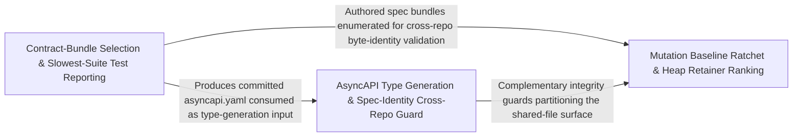

---
tags:
  - 2repo
  - 2repo/arch
  - project/boilerplate-node-backend
type: architecture
component: Mutation_Baseline_Heap_Retainer_Reporting
---

## Details

Computes mutation-testing baselines and ranks heap retainers, alongside authored/selected contract-bundle selection and slowest-suite test reporting, with secondary demo-dataset export and cache-clearing.

### Mutation Baseline Ratchet & Heap Retainer Ranking [[Expand]](./Mutation_Baseline_Ratchet_Heap_Retainer_Ranking.md)
Computes per-file mutation-testing scores from Stryker's JSON report, compares them against a committed baseline (the ratchet), and emits per-file verdicts (held/improved/regressed/new/removed). Separately, streams a V8 heap snapshot to build a reverse-edge index and rank retainers for a given object kind, answering 'who is holding these?' for memory-pressure diagnosis. These two tools form the mutation-testing feedback loop: the baseline gate catches regressions in CI, and the heap retainer tool finds the root cause when a suite OOMs. The group also carries the cross-repo sync mechanism and the kernel registry type surface that the scripts reference for module enumeration.

**Related Classes/Methods**:

- `scripts.report-heap-retainers.main.ranked`
- `scripts.spec-identity.formatSharedFileProblems.lines`:194-210
- `src.kernel.registry.AppModuleCommon`:58-94

**Source Files:**

- `scripts/build-contract-bundles.ts`
  - `scripts.build-contract-bundles.authored` (L108-L108) - Class
  - `scripts.build-contract-bundles.authored.CONTRACT_BUNDLES.filter() callback` (L108-L108) - Function
- `scripts/export-demo-dataset.ts`
  - `scripts.export-demo-dataset.then() callback` (L75-L78) - Function
- `scripts/report-heap-retainers.ts`
  - `scripts.report-heap-retainers.main.ranked` (L260-L260) - Class
  - `scripts.report-heap-retainers.main.ranked.toSorted() callback` (L260-L260) - Function
- `scripts/run-prism-smoke-test.ts`
  - `scripts.run-prism-smoke-test.prism.on('error') callback` (L47-L48) - Function
  - `scripts.run-prism-smoke-test.prism.on('exit') callback` (L50-L52) - Function
- `scripts/spec-identity.ts`
  - `scripts.spec-identity.formatSharedFileProblems.lines` (L194-L210) - Class
  - `scripts.spec-identity.formatSharedFileProblems.lines.problems.map() callback` (L194-L210) - Function
- `scripts/sync-shared-files-to-frontend.ts`
  - `scripts.sync-shared-files-to-frontend.list` (L101-L102) - Class
  - `scripts.sync-shared-files-to-frontend.list.items.map() callback` (L102-L102) - Function
- `src/app/security.ts`
  - `src.app.security.installSecurity` (L39-L98) - Class
  - `src.app.security.installSecurity.origin` (L62-L73) - Method
- `src/cluster.ts`
  - `src.cluster.cluster.on('exit') callback` (L120-L156) - Function
- `src/infrastructure/adapters/cache.ts`
  - `src.infrastructure.adapters.cache.close.then() callback` (L105-L105) - Function
  - `src.infrastructure.adapters.cache.then() callback.cacheTags.map() callback.then() callback` (L271-L271) - Function
  - `src.infrastructure.adapters.cache.ClearCacheResult` (L300-L312) - Interface
- `src/infrastructure/http/delete-controller.ts`
  - `src.infrastructure.http.delete-controller.RemoveResult` (L36-L41) - Interface
  - `src.infrastructure.http.delete-controller.createDeleteController.handler.[operation].then() callback` (L99-L112) - Function
- `src/infrastructure/http/middlewares/cache.ts`
  - `src.infrastructure.http.middlewares.cache.CachedResponse` (L19-L22) - Interface
  - `src.infrastructure.http.middlewares.cache.CacheOptions` (L123-L161) - Interface
- `src/infrastructure/http/middlewares/rate-limit-store.ts`
  - `src.infrastructure.http.middlewares.rate-limit-store.build` (L104-L124) - Class
  - `src.infrastructure.http.middlewares.rate-limit-store.build.redisClient.on('error') callback` (L121-L121) - Function
  - `src.infrastructure.http.middlewares.rate-limit-store.send` (L133-L181) - Class
  - `src.infrastructure.http.middlewares.rate-limit-store.then() callback` (L137-L137) - Function
  - `src.infrastructure.http.middlewares.rate-limit-store.send.then() callback` (L148-L157) - Function
  - `src.infrastructure.http.middlewares.rate-limit-store.send.catch() callback` (L158-L179) - Function
  - `src.infrastructure.http.middlewares.rate-limit-store.lazyRedisStore` (L194-L237) - Class
  - `src.infrastructure.http.middlewares.rate-limit-store.lazyRedisStore.store` (L198-L226) - Class
  - `src.infrastructure.http.middlewares.rate-limit-store.lazyRedisStore.store.sendCommand` (L204-L204) - Method
  - `src.infrastructure.http.middlewares.rate-limit-store.lazyRedisStore.store.catch() callback` (L216-L222) - Function
  - `src.infrastructure.http.middlewares.rate-limit-store.lazyRedisStore.init` (L229-L231) - Method
  - `src.infrastructure.http.middlewares.rate-limit-store.lazyRedisStore.increment` (L232-L232) - Method
  - `src.infrastructure.http.middlewares.rate-limit-store.lazyRedisStore.decrement` (L233-L233) - Method
  - `src.infrastructure.http.middlewares.rate-limit-store.lazyRedisStore.resetKey` (L234-L234) - Method
  - `src.infrastructure.http.middlewares.rate-limit-store.lazyRedisStore.get` (L235-L235) - Method
- `src/infrastructure/http/middlewares/security.ts`
  - `src.infrastructure.http.middlewares.security.refuse` (L48-L63) - Class
  - `src.infrastructure.http.middlewares.security.refuse.<function>` (L50-L63) - Function
- `src/infrastructure/http/response.ts`
  - `src.infrastructure.http.response.normalizeErrors` (L146-L173) - Class
  - `src.infrastructure.http.response.normalizeErrors.inputErrors.map() callback` (L155-L172) - Function
- `src/infrastructure/observability/analytics/index.ts`
  - `src.infrastructure.observability.analytics.index.AnalyticsProvider` (L84-L111) - Interface
  - `src.infrastructure.observability.analytics.index.AnalyticsProvider.capture` (L92-L92) - Method
  - `src.infrastructure.observability.analytics.index.AnalyticsProvider.configured` (L102-L102) - Method
  - `src.infrastructure.observability.analytics.index.AnalyticsProvider.shutdown` (L110-L110) - Method
  - `src.infrastructure.observability.analytics.index.shutdownAnalytics` (L196-L203) - Class
  - `src.infrastructure.observability.analytics.index.shutdownAnalytics.then() callback` (L198-L202) - Function
- `src/infrastructure/observability/analytics/none.ts`
  - `src.infrastructure.observability.analytics.none.noneAnalyticsProvider` (L12-L27) - Class
  - `src.infrastructure.observability.analytics.none.noneAnalyticsProvider.capture` (L15-L17) - Method
  - `src.infrastructure.observability.analytics.none.noneAnalyticsProvider.configured` (L20-L22) - Method
  - `src.infrastructure.observability.analytics.none.noneAnalyticsProvider.shutdown` (L24-L26) - Method
- `src/infrastructure/observability/analytics/posthog.ts`
  - `src.infrastructure.observability.analytics.posthog.posthogAnalyticsProvider` (L55-L110) - Class
  - `src.infrastructure.observability.analytics.posthog.posthogAnalyticsProvider.configured` (L58-L60) - Method
  - `src.infrastructure.observability.analytics.posthog.posthogAnalyticsProvider.capture` (L62-L93) - Method
  - `src.infrastructure.observability.analytics.posthog.posthogAnalyticsProvider.shutdown` (L102-L109) - Method
- `src/infrastructure/observability/analytics/umami.ts`
  - `src.infrastructure.observability.analytics.umami.umamiAnalyticsProvider` (L94-L174) - Class
  - `src.infrastructure.observability.analytics.umami.umamiAnalyticsProvider.configured` (L99-L101) - Method
  - `src.infrastructure.observability.analytics.umami.umamiAnalyticsProvider.capture` (L103-L163) - Method
  - `src.infrastructure.observability.analytics.umami.umamiAnalyticsProvider.capture.then() callback` (L146-L156) - Function
  - `src.infrastructure.observability.analytics.umami.umamiAnalyticsProvider.capture.catch() callback` (L157-L162) - Function
  - `src.infrastructure.observability.analytics.umami.umamiAnalyticsProvider.shutdown` (L171-L173) - Method
- `src/infrastructure/observability/audit.ts`
  - `src.infrastructure.observability.audit.AuditActionMap` (L44-L44) - Interface
- `src/infrastructure/observability/dependency-health.ts`
  - `src.infrastructure.observability.dependency-health.overallStatus` (L91-L94) - Class
  - `src.infrastructure.observability.dependency-health.overallStatus.every() callback` (L92-L92) - Function
- `src/infrastructure/observability/metrics-http.ts`
  - `src.infrastructure.observability.metrics-http.getLatencyPercentiles` (L327-L336) - Class
  - `src.infrastructure.observability.metrics-http.getLatencyPercentiles.then() callback` (L328-L336) - Function
- `src/infrastructure/observability/process-snapshot.ts`
  - `src.infrastructure.observability.process-snapshot.ProcessMemorySnapshot` (L28-L40) - Interface
  - `src.infrastructure.observability.process-snapshot.ProcessSnapshot` (L43-L53) - Interface
- `src/infrastructure/runtime/database.ts`
  - `src.infrastructure.runtime.database.attemptConnect.then() callback` (L75-L75) - Function
- `src/kernel/authentication.ts`
  - `src.kernel.authentication.AuthenticatedUser` (L15-L21) - Interface
  - `src.kernel.authentication.AuthResolver` (L24-L27) - Interface
- `src/kernel/registry.ts`
  - `src.kernel.registry.AppModuleCommon` (L58-L94) - Interface
  - `src.kernel.registry.RoutedModule` (L137-L143) - Interface
  - `src.kernel.registry.HeadlessModule` (L152-L155) - Interface
- `src/modules/account/controllers/delete-address.ts`
  - `src.modules.account.controllers.delete-address.deleteAddress` (L17-L29) - Class
  - `src.modules.account.controllers.delete-address.deleteAddress.then() callback` (L24-L27) - Function
- `src/modules/account/repository.ts`
  - `src.modules.account.repository.addressBookRepository.updateEntry.entry` (L75-L75) - Class
  - `src.modules.account.repository.addressBookRepository.updateEntry.entry.book.items.find() callback` (L75-L75) - Function
- `src/modules/account/services/authentication.ts`
  - `src.modules.account.services.authentication.MissingRefreshTokenError` (L199-L204) - Class
  - `src.modules.account.services.authentication.MissingRefreshTokenError.constructor` (L200-L203) - Constructor
  - `src.modules.account.services.authentication.refreshAccessToken` (L214-L250) - Class
  - `src.modules.account.services.authentication.refreshAccessToken.then() callback.then() callback` (L222-L222) - Function
  - `src.modules.account.services.authentication.refreshAccessToken.then() callback` (L225-L233) - Function
  - `src.modules.account.services.authentication.refreshAccessToken.catch() callback` (L234-L250) - Function
- `src/modules/cart/model.ts`
  - `src.modules.cart.model.CartDocument` (L43-L59) - Interface
- `src/modules/cart/services/items.ts`
  - `src.modules.cart.services.items.cartViewOf` (L38-L39) - Class
  - `src.modules.cart.services.items.cartViewOf.then() callback` (L39-L39) - Function
  - `src.modules.cart.services.items.cartGetForView` (L45-L52) - Class
  - `src.modules.cart.services.items.cartGetForView.then() callback` (L46-L52) - Function
  - `src.modules.cart.services.items.cartItemUpdateQuantity` (L144-L158) - Class
  - `src.modules.cart.services.items.cartItemUpdateQuantity.then() callback` (L150-L158) - Function
  - `src.modules.cart.services.items.cartItemRemoveById.then() callback` (L182-L199) - Function
  - `src.modules.cart.services.items.cartRemove.then() callback.then() callback` (L209-L216) - Function
- `src/modules/delivery/repository.ts`
  - `src.modules.delivery.repository.shipmentRepository` (L17-L78) - Class
  - `src.modules.delivery.repository.shipmentRepository.findByOrderId` (L33-L34) - Method
  - `src.modules.delivery.repository.shipmentRepository.upsertForOrder` (L41-L48) - Method
  - `src.modules.delivery.repository.shipmentRepository.findAllShipped` (L51-L51) - Method
  - `src.modules.delivery.repository.shipmentRepository.updateStatusIfIn` (L70-L77) - Method
- `src/modules/feedback/emails.ts`
  - `src.modules.feedback.emails.ContactRequest` (L18-L24) - Interface
- `src/modules/feedback/service.ts`
  - `src.modules.feedback.service.create` (L73-L115) - Class
  - `src.modules.feedback.service.create.then() callback` (L82-L115) - Function
  - `src.modules.feedback.service.create.then() callback.catch() callback` (L107-L111) - Function
- `src/modules/observability/routes.ts`
  - `src.modules.observability.routes.router.get('/events') callback` (L24-L26) - Function
  - `src.modules.observability.routes.router.get('/metrics') callback.then() callback` (L30-L33) - Function
  - `src.modules.observability.routes.router.get('/metrics') callback.catch() callback` (L34-L37) - Function
- `src/modules/orders/domain/lifecycle.ts`
  - `src.modules.orders.domain.lifecycle.statusesReachableFrom` (L75-L79) - Class
  - `src.modules.orders.domain.lifecycle.statusesReachableFrom.filter() callback` (L79-L79) - Function
- `src/modules/orders/domain/rules.ts`
  - `src.modules.orders.domain.rules.OrderLineCandidate` (L7-L10) - Interface
- `src/modules/orders/factory.ts`
  - `src.modules.orders.factory.makeOrder.items.map() callback` (L107-L110) - Function
- `src/modules/orders/service.ts`
  - `src.modules.orders.service.search` (L58-L73) - Class
  - `src.modules.orders.service.search.then() callback` (L66-L73) - Function
- `src/modules/products/controllers/write-products.ts`
  - `src.modules.products.controllers.write-products.catch() callback` (L82-L82) - Function
  - `src.modules.products.controllers.write-products.catch() callback.then() callback` (L132-L134) - Function
- `src/modules/wishlist/service.ts`
  - `src.modules.wishlist.service.wishlistAdd.then() callback.then() callback` (L55-L62) - Function
  - `src.modules.wishlist.service.wishlistMoveToCart.then() callback.then() callback.then() callback` (L115-L122) - Function

### Contract-Bundle Selection & Slowest-Suite Test Reporting [[Expand]](./Contract_Bundle_Selection_Slowest_Suite_Test_Reporting.md)
Orchestrates the contract-bundle build pipeline: selects authored (committed) vs. generated (client collections) bundles by name, assembles them from fragments via redocly bundle / section compilation, checks staleness against committed copies, and writes only drifted outputs. In parallel, parses Jest's JSON test report to produce per-module bucket summaries (suites/tests/failed/time), ranks the slowest suites and tests, and lists failures by module. The bundle selection is the contract-first generation pipeline entry point; the test reporting is the performance observability entry point. The group also carries the OpenAPI section/path extraction and the client-collection section builder that drive the four tool emitters.

**Related Classes/Methods**:

- `scripts.build-contract-bundles.selected`
- `scripts.report-test-results.slowestSuites`:181-187
- `scripts.contracts.openapi-bundle.sectionPaths`:95-100

**Source Files:**

- `scripts/build-contract-bundles.ts`
  - `scripts.build-contract-bundles.selected` (L64-L64) - Class
  - `scripts.build-contract-bundles.selected.named.map() callback` (L64-L64) - Function
- `scripts/contracts/analytics-events-bundle.ts`
  - `scripts.contracts.analytics-events-bundle.content.slices` (L245-L249) - Class
  - `scripts.contracts.analytics-events-bundle.content.slices.map() callback` (L245-L249) - Function
- `scripts/contracts/openapi-bundle.ts`
  - `scripts.contracts.openapi-bundle.rootPaths` (L85-L92) - Class
  - `scripts.contracts.openapi-bundle.rootPaths.filter() callback` (L90-L90) - Function
  - `scripts.contracts.openapi-bundle.rootPaths.map() callback` (L91-L91) - Function
  - `scripts.contracts.openapi-bundle.sectionPaths` (L95-L100) - Class
  - `scripts.contracts.openapi-bundle.sectionPaths.map() callback` (L99-L99) - Function
- `scripts/report-heap-summary.ts`
  - `scripts.report-heap-summary.main.wanted` (L168-L168) - Class
  - `scripts.report-heap-summary.main.wanted.ranked.map() callback` (L168-L168) - Function
- `scripts/report-test-results.ts`
  - `scripts.report-test-results.slowestSuites` (L181-L187) - Class
  - `scripts.report-test-results.slowestSuites.report.testResults.map() callback` (L182-L185) - Function
  - `scripts.report-test-results.slowestSuites.toSorted() callback` (L186-L186) - Function
- `src/infrastructure/http/validation-messages.ts`
  - `src.infrastructure.http.validation-messages.registerValidationMessages` (L102-L104) - Class
  - `src.infrastructure.http.validation-messages.registerValidationMessages.customError` (L103-L103) - Method
- `src/infrastructure/i18n/overrides.ts`
  - `src.infrastructure.i18n.overrides.startLocaleOverrideRefresh` (L132-L136) - Class
  - `src.infrastructure.i18n.overrides.startLocaleOverrideRefresh.setInterval() callback` (L134-L134) - Function
- `src/infrastructure/observability/metrics-http.ts`
  - `src.infrastructure.observability.metrics-http._heapSizeLimitGauge` (L68-L75) - Class
  - `src.infrastructure.observability.metrics-http._heapSizeLimitGauge.collect` (L72-L74) - Method
- `src/kernel/authorization.ts`
  - `src.kernel.authorization.createOwnerScope` (L52-L53) - Class
  - `src.kernel.authorization.createOwnerScope.restrictNonAdmin() callback` (L53-L53) - Function
- `src/modules/account/controllers/delete-expired-tokens.ts`
  - `src.modules.account.controllers.delete-expired-tokens.deleteExpiredTokens` (L13-L32) - Class
  - `src.modules.account.controllers.delete-expired-tokens.deleteExpiredTokens.then() callback` (L19-L30) - Function
- `src/modules/account/controllers/post-login.ts`
  - `src.modules.account.controllers.post-login.postLogin` (L74-L155) - Class
  - `src.modules.account.controllers.post-login.then() callback` (L109-L109) - Function
  - `src.modules.account.controllers.post-login.postLogin.then() callback` (L110-L148) - Function
  - `src.modules.account.controllers.post-login.then() callback.then() callback` (L130-L138) - Function
  - `src.modules.account.controllers.post-login.postLogin.then() callback.then() callback` (L139-L147) - Function
  - `src.modules.account.controllers.post-login.postLogin.catch() callback` (L149-L154) - Function
- `src/modules/account/services/authentication.ts`
  - `src.modules.account.services.authentication.requestAccountDeletion.then() callback` (L70-L89) - Function
  - `src.modules.account.services.authentication.logoutCurrentSession` (L180-L193) - Class
  - `src.modules.account.services.authentication.logoutCurrentSession.then() callback` (L185-L192) - Function
  - `src.modules.account.services.authentication.signup` (L255-L335) - Class
  - `src.modules.account.services.authentication.tokenRemoveAll` (L377-L411) - Class
  - `src.modules.account.services.authentication.tokenRemoveAll.then() callback.then() callback` (L399-L399) - Function
  - `src.modules.account.services.authentication.tokenRemoveAll.catch() callback` (L402-L402) - Function
  - `src.modules.account.services.authentication.tokenRemoveAll.then() callback` (L403-L411) - Function
- `src/modules/cart/demo.ts`
  - `src.modules.cart.demo.seedCartsCollection` (L50-L51) - Class
  - `src.modules.cart.demo.seedCartsCollection.cartFixtures.map() callback` (L51-L51) - Function
- `src/modules/cart/services/reorder.ts`
  - `src.modules.cart.services.reorder.reorderIntoCart.then() callback.then() callback.addable` (L99-L99) - Class
  - `src.modules.cart.services.reorder.reorderIntoCart.then() callback.then() callback.addable.lines.filter() callback` (L99-L99) - Function
  - `src.modules.cart.services.reorder.reorderIntoCart.then() callback` (L123-L139) - Function
- `src/modules/delivery/service.ts`
  - `src.modules.delivery.service.getForOrder` (L52-L62) - Class
  - `src.modules.delivery.service.getForOrder.then() callback` (L56-L62) - Function
  - `src.modules.delivery.service.getForOrder.then() callback.then() callback` (L58-L61) - Function
- `src/modules/orders/service.ts`
  - `src.modules.orders.service.update.updateItemsPromise.then() callback.then() callback.missingProduct` (L296-L296) - Class
  - `src.modules.orders.service.update.updateItemsPromise.then() callback.then() callback.missingProduct.resolvedItems.some() callback` (L296-L296) - Function
- `src/modules/wishlist/demo.ts`
  - `src.modules.wishlist.demo.seedWishlistsCollection` (L48-L49) - Class
  - `src.modules.wishlist.demo.seedWishlistsCollection.wishlistFixtures.map() callback` (L49-L49) - Function

### AsyncAPI Type Generation & Spec-Identity Cross-Repo Guard [[Expand]](./AsyncAPI_Type_Generation_Spec_Identity_Cross_Repo_Guard.md)
Generates typed TypeScript from the AsyncAPI contract (rendering literal arrays for channel/operation names that controllers import), and enforces cross-repo spec identity: a set of files must be byte-for-byte identical between this backend repo and the paired frontend. The spec-identity check is deliberately a hash comparison (identity, not equivalence) to catch silent forks that would still pass each repo's own CI. The AsyncAPI type generation is the contract-to-code step that produces the typed event names. Together these form the contract integrity axis: the types are generated from the contract, and the contract is guarded against drift across repos. The group also carries the kernel authentication/authorization primitives that the scripts reference for scope-aware reporting.

**Related Classes/Methods**:

- `scripts.generate-asyncapi-types.renderLiteralArray.lines`
- `src.kernel.authentication.resolveAccessToken`:55-56
- `src.kernel.authorization.createVisibilityScope`:67-68

**Source Files:**

- `scripts/contracts/client-collections-bundle.ts`
  - `scripts.contracts.client-collections-bundle.sections` (L56-L57) - Class
  - `scripts.contracts.client-collections-bundle.sections.SECTION_ORDER.map() callback` (L57-L57) - Function
- `scripts/generate-asyncapi-types.ts`
  - `scripts.generate-asyncapi-types.renderLiteralArray.lines` (L251-L251) - Class
  - `scripts.generate-asyncapi-types.renderLiteralArray.lines.values.map() callback` (L251-L251) - Function
- `scripts/mutation-baseline.ts`
  - `scripts.mutation-baseline.formatRegressions.lines` (L184-L187) - Class
  - `scripts.mutation-baseline.formatRegressions.lines.regressed.map() callback` (L185-L186) - Function
- `scripts/report-test-results.ts`
  - `scripts.report-test-results.width` (L170-L170) - Class
  - `scripts.report-test-results.width.rows.map() callback` (L170-L170) - Function
- `src/cluster.ts`
  - `src.cluster.startPrimaryShutdown.forceShutdownTimer` (L106-L113) - Class
  - `src.cluster.startPrimaryShutdown.forceShutdownTimer.setTimeout() callback` (L106-L113) - Function
- `src/infrastructure/http/middlewares/rate-limit-store.ts`
  - `src.infrastructure.http.middlewares.rate-limit-store.stopRateLimitStore` (L271-L283) - Class
  - `src.infrastructure.http.middlewares.rate-limit-store.stopRateLimitStore.then() callback` (L281-L281) - Function
- `src/infrastructure/http/request.ts`
  - `src.infrastructure.http.request.RequestInputDeclaration` (L152-L176) - Interface
  - `src.infrastructure.http.request.readInput.stated` (L279-L281) - Class
  - `src.infrastructure.http.request.readInput.stated.sources.map() callback` (L280-L280) - Function
  - `src.infrastructure.http.request.readInput.stated.filter() callback` (L281-L281) - Function
  - `src.infrastructure.http.request.CallerContext` (L326-L350) - Interface
- `src/infrastructure/http/uploads.ts`
  - `src.infrastructure.http.uploads.getFormFiles.paths` (L47-L49) - Class
  - `src.infrastructure.http.uploads.getFormFiles.paths.request.files.map() callback` (L48-L48) - Function
  - `src.infrastructure.http.uploads.getFormFiles.paths.flatMap() callback` (L49-L49) - Function
  - `src.infrastructure.http.uploads.getFormFiles.paths.flatMap() callback.files.map() callback` (L49-L49) - Function
- `src/infrastructure/observability/audit.ts`
  - `src.infrastructure.observability.audit.AuditEvent` (L57-L79) - Interface
  - `src.infrastructure.observability.audit.AuditEntry` (L85-L90) - Interface
- `src/infrastructure/observability/metrics-http.ts`
  - `src.infrastructure.observability.metrics-http._processUptimeGauge` (L41-L53) - Class
  - `src.infrastructure.observability.metrics-http._processUptimeGauge.collect` (L50-L52) - Method
  - `src.infrastructure.observability.metrics-http.sumMetricValues` (L212-L213) - Class
  - `src.infrastructure.observability.metrics-http.sumMetricValues.values.reduce() callback` (L213-L213) - Function
  - `src.infrastructure.observability.metrics-http.getHttpRequestCounters` (L302-L308) - Class
  - `src.infrastructure.observability.metrics-http.getHttpRequestCounters.then() callback` (L304-L307) - Function
- `src/infrastructure/observability/stream.ts`
  - `src.infrastructure.observability.stream.buildObservabilityPayload` (L69-L90) - Class
  - `src.infrastructure.observability.stream.buildObservabilityPayload.then() callback` (L73-L89) - Function
  - `src.infrastructure.observability.stream.writeMetricsEvent` (L99-L106) - Class
  - `src.infrastructure.observability.stream.writeMetricsEvent.then() callback` (L102-L104) - Function
  - `src.infrastructure.observability.stream.writeMetricsEvent.catch() callback` (L105-L105) - Function
  - `src.infrastructure.observability.stream.streamObservabilityMetrics.updatesInterval` (L133-L135) - Class
  - `src.infrastructure.observability.stream.streamObservabilityMetrics.updatesInterval.setInterval() callback` (L133-L135) - Function
  - `src.infrastructure.observability.stream.streamObservabilityMetrics.heartbeatInterval` (L139-L141) - Class
  - `src.infrastructure.observability.stream.streamObservabilityMetrics.heartbeatInterval.setInterval() callback` (L139-L141) - Function
- `src/kernel/authentication.ts`
  - `src.kernel.authentication.resolveAccessToken` (L55-L56) - Class
  - `src.kernel.authentication.resolveAccessToken.then() callback` (L56-L56) - Function
  - `src.kernel.authentication.resolveRefreshToken` (L59-L60) - Class
  - `src.kernel.authentication.resolveRefreshToken.then() callback` (L60-L60) - Function
- `src/kernel/authorization.ts`
  - `src.kernel.authorization.createVisibilityScope` (L67-L68) - Class
  - `src.kernel.authorization.createVisibilityScope.restrictNonAdmin() callback` (L68-L68) - Function
- `src/kernel/middlewares/authorizations.ts`
  - `src.kernel.middlewares.authorizations.getAuth` (L25-L49) - Class
  - `src.kernel.middlewares.authorizations.getAuth.then() callback` (L34-L44) - Function
  - `src.kernel.middlewares.authorizations.getAuth.catch() callback` (L45-L47) - Function
  - `src.kernel.middlewares.authorizations.isAdminViaCookie.then() callback` (L148-L171) - Function
- `src/modules/account/services/addresses.ts`
  - `src.modules.account.services.addresses.addressForCheckout` (L89-L97) - Class
  - `src.modules.account.services.addresses.addressForCheckout.then() callback` (L93-L97) - Function
  - `src.modules.account.services.addresses.addressForCheckout.then() callback.book.items.find() callback` (L96-L96) - Function
- `src/modules/account/services/authentication.ts`
  - `src.modules.account.services.authentication.sessionRevoke` (L156-L170) - Class
  - `src.modules.account.services.authentication.sessionRevoke.then() callback` (L161-L170) - Function
  - `src.modules.account.services.authentication.signup.outcome` (L285-L304) - Class
  - `src.modules.account.services.authentication.signup.outcome.then() callback.then() callback` (L301-L301) - Function
  - `src.modules.account.services.authentication.signup.outcome.catch() callback` (L303-L303) - Function
  - `src.modules.account.services.authentication.signup.outcome.then() callback` (L306-L334) - Function
- `src/modules/account/services/token-cleanup.ts`
  - `src.modules.account.services.token-cleanup.runTokenCleanup` (L16-L38) - Class
  - `src.modules.account.services.token-cleanup.runTokenCleanup.then() callback` (L20-L22) - Function
  - `src.modules.account.services.token-cleanup.runTokenCleanup.catch() callback` (L23-L37) - Function
  - `src.modules.account.services.token-cleanup.adminTokenCleanup.then() callback` (L52-L60) - Function
- `src/modules/cart/services/checkout.ts`
  - `src.modules.cart.services.checkout.orderConfirm.then() callback` (L270-L294) - Function
- `src/modules/cart/services/items.ts`
  - `src.modules.cart.services.items.cartItemAdd` (L125-L139) - Class
  - `src.modules.cart.services.items.cartItemAdd.then() callback` (L131-L139) - Function
- `src/modules/delivery/controllers/post-courier-advance.ts`
  - `src.modules.delivery.controllers.post-courier-advance.postCourierAdvance` (L13-L19) - Class
  - `src.modules.delivery.controllers.post-courier-advance.postCourierAdvance.then() callback` (L16-L18) - Function
- `src/modules/delivery/domain/rates.ts`
  - `src.modules.delivery.domain.rates.findShippingMethod` (L29-L30) - Class
  - `src.modules.delivery.domain.rates.findShippingMethod.SHIPPING_METHODS.find() callback` (L30-L30) - Function
- `src/modules/orders/service.ts`
  - `src.modules.orders.service.create.then() callback.orderItems` (L153-L156) - Class
  - `src.modules.orders.service.create.then() callback.orderItems.resolvedItems.map() callback` (L153-L156) - Function
  - `src.modules.orders.service.update.updateItemsPromise.then() callback.then() callback` (L310-L320) - Function
  - `src.modules.orders.service.updateById.then() callback.then() callback` (L338-L349) - Function
  - `src.modules.orders.service.withActions` (L450-L465) - Function
  - `src.modules.orders.service.cancelById.then() callback` (L511-L572) - Function
- `src/modules/wishlist/service.ts`
  - `src.modules.wishlist.service.wishlistRemove` (L71-L84) - Class
  - `src.modules.wishlist.service.wishlistRemove.then() callback` (L76-L84) - Function
