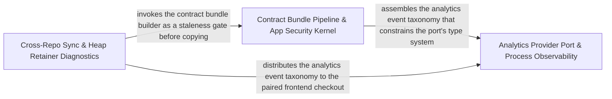

---
tags:
  - 2repo
  - 2repo/arch
  - project/boilerplate-node-backend
type: architecture
component: Mutation_Baseline_Ratchet_Heap_Retainer_Ranking
---

## Details

Computes per-file mutation-testing scores from Stryker's JSON report, compares them against a committed baseline (the ratchet), and emits per-file verdicts (held/improved/regressed/new/removed). Separately, streams a V8 heap snapshot to build a reverse-edge index and rank retainers for a given object kind, answering 'who is holding these?' for memory-pressure diagnosis. These two tools form the mutation-testing feedback loop: the baseline gate catches regressions in CI, and the heap retainer tool finds the root cause when a suite OOMs. The group also carries the cross-repo sync mechanism and the kernel registry type surface that the scripts reference for module enumeration.

### Analytics Provider Port & Process Observability
Implements the product-analytics port-and-adapters seam and operational observability primitives. The AnalyticsProvider interface defines a fire-and-forget capture contract with pluggable implementations (Umami, PostHog, None) selected by environment variable. The event taxonomy is a declaration-merging extension point that each domain module augments. Alongside the analytics port, this group carries the dependency-health aggregator, HTTP latency-percentile metrics reader, and process memory/CPU snapshot collector that feeds the /observability/health endpoint.

**Related Classes/Methods**:

- `src.infrastructure.observability.analytics.index.AnalyticsProvider`:84-111
- `src.infrastructure.observability.analytics.umami.umamiAnalyticsProvider`:94-174
- `src.infrastructure.observability.dependency-health.overallStatus`:91-94
- `src.infrastructure.observability.process-snapshot.ProcessSnapshot`:43-53
- `src.modules.account.controllers.delete-address.deleteAddress`:17-29

**Source Files:**

- `scripts/export-demo-dataset.ts`
  - `scripts.export-demo-dataset.then() callback` (L75-L78) - Function
- `src/cluster.ts`
  - `src.cluster.cluster.on('exit') callback` (L120-L156) - Function
- `src/infrastructure/adapters/cache.ts`
  - `src.infrastructure.adapters.cache.close.then() callback` (L105-L105) - Function
  - `src.infrastructure.adapters.cache.then() callback.cacheTags.map() callback.then() callback` (L271-L271) - Function
  - `src.infrastructure.adapters.cache.ClearCacheResult` (L300-L312) - Interface
- `src/infrastructure/http/delete-controller.ts`
  - `src.infrastructure.http.delete-controller.RemoveResult` (L36-L41) - Interface
  - `src.infrastructure.http.delete-controller.createDeleteController.handler.[operation].then() callback` (L99-L112) - Function
- `src/infrastructure/observability/analytics/index.ts`
  - `src.infrastructure.observability.analytics.index.AnalyticsProvider` (L84-L111) - Interface
  - `src.infrastructure.observability.analytics.index.AnalyticsProvider.capture` (L92-L92) - Method
  - `src.infrastructure.observability.analytics.index.AnalyticsProvider.configured` (L102-L102) - Method
  - `src.infrastructure.observability.analytics.index.AnalyticsProvider.shutdown` (L110-L110) - Method
  - `src.infrastructure.observability.analytics.index.shutdownAnalytics` (L196-L203) - Class
  - `src.infrastructure.observability.analytics.index.shutdownAnalytics.then() callback` (L198-L202) - Function
- `src/infrastructure/observability/analytics/none.ts`
  - `src.infrastructure.observability.analytics.none.noneAnalyticsProvider` (L12-L27) - Class
  - `src.infrastructure.observability.analytics.none.noneAnalyticsProvider.capture` (L15-L17) - Method
  - `src.infrastructure.observability.analytics.none.noneAnalyticsProvider.configured` (L20-L22) - Method
  - `src.infrastructure.observability.analytics.none.noneAnalyticsProvider.shutdown` (L24-L26) - Method
- `src/infrastructure/observability/analytics/posthog.ts`
  - `src.infrastructure.observability.analytics.posthog.posthogAnalyticsProvider` (L55-L110) - Class
  - `src.infrastructure.observability.analytics.posthog.posthogAnalyticsProvider.configured` (L58-L60) - Method
  - `src.infrastructure.observability.analytics.posthog.posthogAnalyticsProvider.capture` (L62-L93) - Method
  - `src.infrastructure.observability.analytics.posthog.posthogAnalyticsProvider.shutdown` (L102-L109) - Method
- `src/infrastructure/observability/analytics/umami.ts`
  - `src.infrastructure.observability.analytics.umami.umamiAnalyticsProvider` (L94-L174) - Class
  - `src.infrastructure.observability.analytics.umami.umamiAnalyticsProvider.configured` (L99-L101) - Method
  - `src.infrastructure.observability.analytics.umami.umamiAnalyticsProvider.capture` (L103-L163) - Method
  - `src.infrastructure.observability.analytics.umami.umamiAnalyticsProvider.capture.then() callback` (L146-L156) - Function
  - `src.infrastructure.observability.analytics.umami.umamiAnalyticsProvider.capture.catch() callback` (L157-L162) - Function
  - `src.infrastructure.observability.analytics.umami.umamiAnalyticsProvider.shutdown` (L171-L173) - Method
- `src/infrastructure/observability/audit.ts`
  - `src.infrastructure.observability.audit.AuditActionMap` (L44-L44) - Interface
- `src/infrastructure/observability/dependency-health.ts`
  - `src.infrastructure.observability.dependency-health.overallStatus` (L91-L94) - Class
  - `src.infrastructure.observability.dependency-health.overallStatus.every() callback` (L92-L92) - Function
- `src/infrastructure/observability/metrics-http.ts`
  - `src.infrastructure.observability.metrics-http.getLatencyPercentiles` (L327-L336) - Class
  - `src.infrastructure.observability.metrics-http.getLatencyPercentiles.then() callback` (L328-L336) - Function
- `src/infrastructure/observability/process-snapshot.ts`
  - `src.infrastructure.observability.process-snapshot.ProcessMemorySnapshot` (L28-L40) - Interface
  - `src.infrastructure.observability.process-snapshot.ProcessSnapshot` (L43-L53) - Interface
- `src/infrastructure/runtime/database.ts`
  - `src.infrastructure.runtime.database.attemptConnect.then() callback` (L75-L75) - Function
- `src/modules/account/controllers/delete-address.ts`
  - `src.modules.account.controllers.delete-address.deleteAddress` (L17-L29) - Class
  - `src.modules.account.controllers.delete-address.deleteAddress.then() callback` (L24-L27) - Function
- `src/modules/cart/model.ts`
  - `src.modules.cart.model.CartDocument` (L43-L59) - Interface
- `src/modules/feedback/emails.ts`
  - `src.modules.feedback.emails.ContactRequest` (L18-L24) - Interface
- `src/modules/orders/domain/rules.ts`
  - `src.modules.orders.domain.rules.OrderLineCandidate` (L7-L10) - Interface
- `src/modules/orders/factory.ts`
  - `src.modules.orders.factory.makeOrder.items.map() callback` (L107-L110) - Function
- `src/modules/products/controllers/write-products.ts`
  - `src.modules.products.controllers.write-products.catch() callback` (L82-L82) - Function
  - `src.modules.products.controllers.write-products.catch() callback.then() callback` (L132-L134) - Function
- `src/modules/wishlist/service.ts`
  - `src.modules.wishlist.service.wishlistAdd.then() callback.then() callback` (L55-L62) - Function
  - `src.modules.wishlist.service.wishlistMoveToCart.then() callback.then() callback.then() callback` (L115-L122) - Function

### Contract Bundle Pipeline & App Security Kernel
The contract-first generation pipeline and application-level security/authentication kernel. The contract pipeline assembles per-module OpenAPI/AsyncAPI fragments into a single authored bundle, spins up a Prism mock to verify contract self-consistency, and hashes shared files against the sibling frontend checkout to detect drift. The security kernel wires Helmet, CORS origin allow-listing, rate-limiting, and response-envelope normalization into the Express middleware chain. The kernel authentication layer provides JWT access/refresh resolution for every protected route. The registry type surface is the typed manifest that the app assembly reads to enumerate modules and wire routes.

**Related Classes/Methods**:

- `scripts.build-contract-bundles.authored`
- `src.kernel.authentication.AuthResolver`:24-27
- `src.kernel.registry.AppModuleCommon`:58-94

**Source Files:**

- `scripts/build-contract-bundles.ts`
  - `scripts.build-contract-bundles.authored` (L108-L108) - Class
  - `scripts.build-contract-bundles.authored.CONTRACT_BUNDLES.filter() callback` (L108-L108) - Function
- `scripts/run-prism-smoke-test.ts`
  - `scripts.run-prism-smoke-test.prism.on('error') callback` (L47-L48) - Function
  - `scripts.run-prism-smoke-test.prism.on('exit') callback` (L50-L52) - Function
- `src/infrastructure/http/middlewares/cache.ts`
  - `src.infrastructure.http.middlewares.cache.CachedResponse` (L19-L22) - Interface
  - `src.infrastructure.http.middlewares.cache.CacheOptions` (L123-L161) - Interface
- `src/infrastructure/http/response.ts`
  - `src.infrastructure.http.response.normalizeErrors` (L146-L173) - Class
  - `src.infrastructure.http.response.normalizeErrors.inputErrors.map() callback` (L155-L172) - Function
- `src/kernel/authentication.ts`
  - `src.kernel.authentication.AuthenticatedUser` (L15-L21) - Interface
  - `src.kernel.authentication.AuthResolver` (L24-L27) - Interface
- `src/kernel/registry.ts`
  - `src.kernel.registry.AppModuleCommon` (L58-L94) - Interface
  - `src.kernel.registry.RoutedModule` (L137-L143) - Interface
  - `src.kernel.registry.HeadlessModule` (L152-L155) - Interface
- `src/modules/account/services/authentication.ts`
  - `src.modules.account.services.authentication.MissingRefreshTokenError` (L199-L204) - Class
  - `src.modules.account.services.authentication.MissingRefreshTokenError.constructor` (L200-L203) - Constructor
  - `src.modules.account.services.authentication.refreshAccessToken` (L214-L250) - Class
  - `src.modules.account.services.authentication.refreshAccessToken.then() callback.then() callback` (L222-L222) - Function
  - `src.modules.account.services.authentication.refreshAccessToken.then() callback` (L225-L233) - Function
  - `src.modules.account.services.authentication.refreshAccessToken.catch() callback` (L234-L250) - Function
- `src/modules/cart/services/items.ts`
  - `src.modules.cart.services.items.cartItemRemoveById.then() callback` (L182-L199) - Function
  - `src.modules.cart.services.items.cartRemove.then() callback.then() callback` (L209-L216) - Function
- `src/modules/observability/routes.ts`
  - `src.modules.observability.routes.router.get('/events') callback` (L24-L26) - Function
  - `src.modules.observability.routes.router.get('/metrics') callback.then() callback` (L30-L33) - Function
  - `src.modules.observability.routes.router.get('/metrics') callback.catch() callback` (L34-L37) - Function
- `src/modules/orders/service.ts`
  - `src.modules.orders.service.search` (L58-L73) - Class
  - `src.modules.orders.service.search.then() callback` (L66-L73) - Function

### Cross-Repo Sync & Heap Retainer Diagnostics
The cross-repo synchronization mechanism and memory-pressure diagnostic tool that close the mutation-testing feedback loop. The sync mechanism enforces a strict one-way flow: it runs staleness gates, then copies every backend-owned shared file into the paired frontend checkout, reporting per-file outcomes. The spec-identity module provides the shared-file list, hashing, and comparison logic consumed by both the sync script and CI drift-check. The heap retainer tool streams a V8 heap snapshot, builds a reverse-edge index, and walks up the retainer chain to rank top retainers for a given object kind.

**Related Classes/Methods**:

- `scripts.sync-shared-files-to-frontend.list`:101-102
- `scripts.report-heap-retainers.main.ranked`
- `scripts.spec-identity.formatSharedFileProblems.lines`:194-210

**Source Files:**

- `scripts/report-heap-retainers.ts`
  - `scripts.report-heap-retainers.main.ranked` (L260-L260) - Class
  - `scripts.report-heap-retainers.main.ranked.toSorted() callback` (L260-L260) - Function
- `scripts/spec-identity.ts`
  - `scripts.spec-identity.formatSharedFileProblems.lines` (L194-L210) - Class
  - `scripts.spec-identity.formatSharedFileProblems.lines.problems.map() callback` (L194-L210) - Function
- `scripts/sync-shared-files-to-frontend.ts`
  - `scripts.sync-shared-files-to-frontend.list` (L101-L102) - Class
  - `scripts.sync-shared-files-to-frontend.list.items.map() callback` (L102-L102) - Function
- `src/app/security.ts`
  - `src.app.security.installSecurity` (L39-L98) - Class
  - `src.app.security.installSecurity.origin` (L62-L73) - Method
- `src/infrastructure/http/middlewares/rate-limit-store.ts`
  - `src.infrastructure.http.middlewares.rate-limit-store.build` (L104-L124) - Class
  - `src.infrastructure.http.middlewares.rate-limit-store.build.redisClient.on('error') callback` (L121-L121) - Function
  - `src.infrastructure.http.middlewares.rate-limit-store.send` (L133-L181) - Class
  - `src.infrastructure.http.middlewares.rate-limit-store.then() callback` (L137-L137) - Function
  - `src.infrastructure.http.middlewares.rate-limit-store.send.then() callback` (L148-L157) - Function
  - `src.infrastructure.http.middlewares.rate-limit-store.send.catch() callback` (L158-L179) - Function
  - `src.infrastructure.http.middlewares.rate-limit-store.lazyRedisStore` (L194-L237) - Class
  - `src.infrastructure.http.middlewares.rate-limit-store.lazyRedisStore.store` (L198-L226) - Class
  - `src.infrastructure.http.middlewares.rate-limit-store.lazyRedisStore.store.sendCommand` (L204-L204) - Method
  - `src.infrastructure.http.middlewares.rate-limit-store.lazyRedisStore.store.catch() callback` (L216-L222) - Function
  - `src.infrastructure.http.middlewares.rate-limit-store.lazyRedisStore.init` (L229-L231) - Method
  - `src.infrastructure.http.middlewares.rate-limit-store.lazyRedisStore.increment` (L232-L232) - Method
  - `src.infrastructure.http.middlewares.rate-limit-store.lazyRedisStore.decrement` (L233-L233) - Method
  - `src.infrastructure.http.middlewares.rate-limit-store.lazyRedisStore.resetKey` (L234-L234) - Method
  - `src.infrastructure.http.middlewares.rate-limit-store.lazyRedisStore.get` (L235-L235) - Method
- `src/infrastructure/http/middlewares/security.ts`
  - `src.infrastructure.http.middlewares.security.refuse` (L48-L63) - Class
  - `src.infrastructure.http.middlewares.security.refuse.<function>` (L50-L63) - Function
- `src/modules/account/repository.ts`
  - `src.modules.account.repository.addressBookRepository.updateEntry.entry` (L75-L75) - Class
  - `src.modules.account.repository.addressBookRepository.updateEntry.entry.book.items.find() callback` (L75-L75) - Function
- `src/modules/cart/services/items.ts`
  - `src.modules.cart.services.items.cartViewOf` (L38-L39) - Class
  - `src.modules.cart.services.items.cartViewOf.then() callback` (L39-L39) - Function
  - `src.modules.cart.services.items.cartGetForView` (L45-L52) - Class
  - `src.modules.cart.services.items.cartGetForView.then() callback` (L46-L52) - Function
  - `src.modules.cart.services.items.cartItemUpdateQuantity` (L144-L158) - Class
  - `src.modules.cart.services.items.cartItemUpdateQuantity.then() callback` (L150-L158) - Function
- `src/modules/delivery/repository.ts`
  - `src.modules.delivery.repository.shipmentRepository` (L17-L78) - Class
  - `src.modules.delivery.repository.shipmentRepository.findByOrderId` (L33-L34) - Method
  - `src.modules.delivery.repository.shipmentRepository.upsertForOrder` (L41-L48) - Method
  - `src.modules.delivery.repository.shipmentRepository.findAllShipped` (L51-L51) - Method
  - `src.modules.delivery.repository.shipmentRepository.updateStatusIfIn` (L70-L77) - Method
- `src/modules/feedback/service.ts`
  - `src.modules.feedback.service.create` (L73-L115) - Class
  - `src.modules.feedback.service.create.then() callback` (L82-L115) - Function
  - `src.modules.feedback.service.create.then() callback.catch() callback` (L107-L111) - Function
- `src/modules/orders/domain/lifecycle.ts`
  - `src.modules.orders.domain.lifecycle.statusesReachableFrom` (L75-L79) - Class
  - `src.modules.orders.domain.lifecycle.statusesReachableFrom.filter() callback` (L79-L79) - Function
