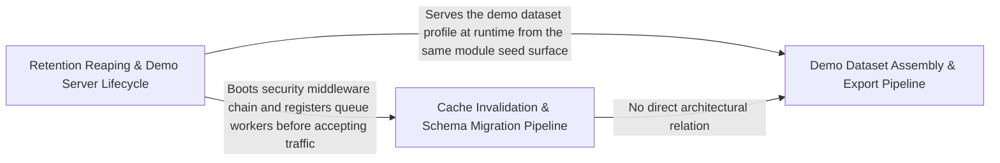

---
tags:
  - 2repo
  - 2repo/arch
  - project/boilerplate-node-backend
type: architecture
component: Operational_Maintenance_Export_Scripts
---

## Details

The one-shot operational scripts that keep the database healthy and the demo profile reproducible. This includes the demo-dataset publisher (export-demo-dataset.ts, which seeds a throwaway in-memory DB and writes/--checks demo-data.json), the periodic PII/retention reapers (reap-orders, reap-inactive-accounts, reap-quarantine), and the manual cache invalidation (cache-clear.ts). All are wrapped by the shared runScript harness for non-zero exit codes, guaranteed cleanup, and readable errors. This group is the keep-it-healthy-and-reproducible surface of the subsystem.

### Retention Reaping & Demo Server Lifecycle
The periodic PII/retention cleanup scripts (reap-orders, reap-inactive-accounts) that purge expired order records and dormant user accounts on a schedule, plus the demo-server orchestration (run-demo-server, src.app.startServer) that boots a throwaway in-memory instance for local preview. Also includes the module-graph generator and OpenAPI bundler used by CI to validate the contract surface. All scripts share the runScript harness for guaranteed cleanup and non-zero exit on failure.

**Related Classes/Methods**:

- `scripts.reap-orders.main`:24-27
- `scripts.reap-inactive-accounts.initI18n`:66-78
- `scripts.run-demo-server.waitForDatabase`:42-57
- `src.app.startServer`:64-121
- `scripts.generate-module-graph.renderNeighbourhood.reaches`

**Source Files:**

- `db/migrations/20260813090000-user-verified-column.js`
  - `db.migrations.20260813090000-user-verified-column.<unknown>` (L15-L29) - Class
  - `db.migrations.20260813090000-user-verified-column.<unknown>.up` (L16-L20) - Method
  - `db.migrations.20260813090000-user-verified-column.<unknown>.down` (L22-L28) - Method
- `scripts/contracts/openapi-bundle.ts`
  - `scripts.contracts.openapi-bundle.assertModuleSectionsAreCurrent.missing` (L82-L82) - Class
  - `scripts.contracts.openapi-bundle.assertModuleSectionsAreCurrent.missing.filter() callback` (L82-L82) - Function
- `scripts/generate-module-graph.ts`
  - `scripts.generate-module-graph.renderNeighbourhood.reaches` (L164-L164) - Class
  - `scripts.generate-module-graph.renderNeighbourhood.reaches.edges.filter() callback` (L164-L164) - Function
  - `scripts.generate-module-graph.renderNeighbourhood.reaches.map() callback` (L198-L198) - Function
- `scripts/reap-inactive-accounts.ts`
  - `scripts.reap-inactive-accounts.initI18n` (L66-L78) - Class
  - `scripts.reap-inactive-accounts.initI18n.enabledModules.map() callback` (L69-L69) - Function
  - `scripts.reap-inactive-accounts.initI18n.filter() callback` (L70-L70) - Function
- `scripts/reap-orders.ts`
  - `scripts.reap-orders.main` (L24-L27) - Class
  - `scripts.reap-orders.then() callback` (L26-L26) - Function
  - `scripts.reap-orders.main.then() callback` (L27-L27) - Function
- `scripts/report-test-results.ts`
  - `scripts.report-test-results.width` (L169-L169) - Class
  - `scripts.report-test-results.width.rows.map() callback` (L169-L169) - Function
- `scripts/run-demo-server.ts`
  - `scripts.run-demo-server.waitForDatabase` (L42-L57) - Class
  - `scripts.run-demo-server.waitForDatabase.<function>` (L43-L57) - Function
  - `scripts.run-demo-server.then() callback` (L60-L90) - Function
  - `scripts.run-demo-server.then() callback.process.once() callback` (L66-L71) - Function
  - `scripts.run-demo-server.then() callback.process.once() callback.catch() callback` (L69-L69) - Function
  - `scripts.run-demo-server.then() callback.process.once() callback.then() callback` (L70-L70) - Function
  - `scripts.run-demo-server.then() callback.then() callback.waitForDatabase() callback` (L82-L82) - Function
  - `scripts.run-demo-server.then() callback.then() callback` (L85-L89) - Function
  - `scripts.run-demo-server.catch() callback` (L91-L94) - Function
- `src/app.ts`
  - `src.app.startServer` (L64-L121) - Class
  - `src.app.then() callback` (L69-L69) - Function
  - `src.app.startServer.then() callback.enabledModules.map() callback` (L79-L79) - Function
  - `src.app.startServer.then() callback.filter() callback` (L80-L80) - Function
  - `src.app.startServer.then() callback` (L109-L118) - Function
  - `src.app.startServer.then() callback.<function>` (L110-L118) - Function
  - `src.app.catch() callback` (L175-L176) - Function
- `src/infrastructure/adapters/cache.ts`
  - `src.infrastructure.adapters.cache.startCache` (L126-L126) - Class
  - `src.infrastructure.adapters.cache.startCache.then() callback` (L126-L126) - Function
- `src/infrastructure/adapters/queue.ts`
  - `src.infrastructure.adapters.queue.startQueue` (L168-L168) - Class
  - `src.infrastructure.adapters.queue.startQueue.then() callback` (L168-L168) - Function
- `src/infrastructure/adapters/storage.ts`
  - `src.infrastructure.adapters.storage.upload` (L352-L354) - Class
  - `src.infrastructure.adapters.storage.upload.single` (L353-L353) - Method
- `src/infrastructure/http/validation-messages.ts`
  - `src.infrastructure.http.validation-messages.registerValidationMessages` (L88-L91) - Class
  - `src.infrastructure.http.validation-messages.registerValidationMessages.customError` (L90-L90) - Method
- `src/infrastructure/i18n/catalog.ts`
  - `src.infrastructure.i18n.catalog.listSupportedLocales` (L38-L54) - Class
  - `src.infrastructure.i18n.catalog.listSupportedLocales.declared` (L41-L43) - Class
  - `src.infrastructure.i18n.catalog.listSupportedLocales.declared.map() callback` (L42-L42) - Function
  - `src.infrastructure.i18n.catalog.listSupportedLocales.filter() callback` (L49-L49) - Function
  - `src.infrastructure.i18n.catalog.listSupportedLocales.map() callback` (L50-L50) - Function
  - `src.infrastructure.i18n.catalog.loadLocaleResources` (L147-L153) - Class
  - `src.infrastructure.i18n.catalog.loadLocaleResources.map() callback` (L149-L152) - Function
- `src/infrastructure/i18n/overrides.ts`
  - `src.infrastructure.i18n.overrides.startLocaleOverrideRefresh` (L123-L127) - Class
  - `src.infrastructure.i18n.overrides.startLocaleOverrideRefresh.setInterval() callback` (L125-L125) - Function

### Cache Invalidation & Schema Migration Pipeline
The one-shot data-integrity scripts: manual Redis cache invalidation (cache-clear.ts) and the forward/backward database schema migrations that prune unused indexes and hash legacy user tokens. These scripts depend on the app's security bootstrap (installSecurity) and worker registration (registerWorkers) to establish the correct runtime context before mutating shared state. They represent the irreversible ops surface — once a migration runs, the schema has changed; once the cache is cleared, all cached reads are invalidated.

**Related Classes/Methods**:

- `src.app.security.installSecurity`:45-118
- `src.app.workers.registerWorkers`:29-54

**Source Files:**

- `db/cache-clear.ts`
  - `db.cache-clear.runScript() callback` (L41-L41) - Function
- `db/demo/index.ts`
  - `db.demo.index.seed` (L38-L92) - Function
- `db/migrations/20260808180000-prune-unused-indexes.js`
  - `db.migrations.20260808180000-prune-unused-indexes.<unknown>` (L34-L55) - Class
  - `db.migrations.20260808180000-prune-unused-indexes.<unknown>.up` (L35-L43) - Method
  - `db.migrations.20260808180000-prune-unused-indexes.<unknown>.down` (L45-L54) - Method
- `db/migrations/20260901120000-hash-user-tokens.js`
  - `db.migrations.20260901120000-hash-user-tokens.<unknown>` (L30-L57) - Class
  - `db.migrations.20260901120000-hash-user-tokens.<unknown>.up` (L31-L43) - Method
  - `db.migrations.20260901120000-hash-user-tokens.<unknown>.down` (L45-L56) - Method
- `src/app/security.ts`
  - `src.app.security.installSecurity` (L45-L118) - Class
  - `src.app.security.installSecurity.origin` (L81-L92) - Method
- `src/app/workers.ts`
  - `src.app.workers.registerWorkers` (L29-L54) - Class
  - `src.app.workers.registerWorkers.registerImageWritebackResolver() callback` (L37-L37) - Function
  - `src.app.workers.registerWorkers.then() callback` (L51-L53) - Function
- `src/infrastructure/adapters/cache.ts`
  - `src.infrastructure.adapters.cache.clearCache` (L327-L354) - Class
  - `src.infrastructure.adapters.cache.clearCache.then() callback` (L330-L344) - Function
  - `src.infrastructure.adapters.cache.clearCache.then() callback.then() callback` (L340-L343) - Function
  - `src.infrastructure.adapters.cache.clearCache.catch() callback` (L345-L354) - Function
- `src/infrastructure/adapters/image.worker.ts`
  - `src.infrastructure.adapters.image.worker.enqueueImageDigest` (L185-L208) - Class
  - `src.infrastructure.adapters.image.worker.enqueueImageDigest.then() callback` (L201-L207) - Function
- `src/infrastructure/adapters/queue.ts`
  - `src.infrastructure.adapters.queue.assertJobQueue` (L235-L255) - Class
  - `src.infrastructure.adapters.queue.assertJobQueue.then() callback` (L255-L255) - Function
  - `src.infrastructure.adapters.queue.publishToQueue` (L283-L315) - Class
  - `src.infrastructure.adapters.queue.publishToQueue.then() callback` (L286-L315) - Function
  - `src.infrastructure.adapters.queue.publishToQueue.then() callback.then() callback` (L295-L304) - Function
  - `src.infrastructure.adapters.queue.publishToQueue.then() callback.catch() callback` (L310-L313) - Function
  - `src.infrastructure.adapters.queue.handleDelivery` (L364-L399) - Class
  - `src.infrastructure.adapters.queue.handleDelivery.then() callback` (L390-L395) - Function
  - `src.infrastructure.adapters.queue.handleDelivery.catch() callback` (L398-L398) - Function
  - `src.infrastructure.adapters.queue.consumeFromQueue` (L413-L442) - Class
  - `src.infrastructure.adapters.queue.consumeFromQueue.then() callback` (L416-L442) - Function
  - `src.infrastructure.adapters.queue.consumeFromQueue.then() callback.then() callback.ch.consume() callback` (L431-L437) - Function
  - `src.infrastructure.adapters.queue.consumeFromQueue.then() callback.then() callback` (L440-L440) - Function
- `src/kernel/registry.ts`
  - `src.kernel.registry.resolveImageTargets` (L171-L178) - Class
  - `src.kernel.registry.resolveImageTargets.appModules.flatMap() callback` (L177-L177) - Function

### Demo Dataset Assembly & Export Pipeline
The deterministic demo-data pipeline: assembleDemoDataset builds a canonical in-memory dataset (sorted keys for byte-stable output), db.demo.index.seed writes it into a throwaway MongoDB, and scripts.export-demo-dataset.run serializes the result to demo-data.json (or --check mode to verify drift). Quality gates (run-mutation-tests, report-test-results) ensure the exported dataset passes mutation-testing and produces a structured test report. This is the reproducibility surface — the single source of truth for the demo profile that CI and local dev both consume.

**Related Classes/Methods**:

- `scripts.export-demo-dataset.run`:34-71
- `db.demo.assemble.assembleDemoDataset`:167-206
- `db.demo.assemble.sortKeys`:74-82
- `scripts.run-mutation-tests.wasPassed`

**Source Files:**

- `db/demo/assemble.ts`
  - `db.demo.assemble.sortKeys` (L74-L82) - Class
  - `db.demo.assemble.sortKeys.value.map() callback` (L75-L75) - Function
  - `db.demo.assemble.sortKeys.toSorted() callback` (L79-L79) - Function
  - `db.demo.assemble.sortKeys.map() callback` (L80-L80) - Function
  - `db.demo.assemble.assembleDemoDataset` (L167-L206) - Class
  - `db.demo.assemble.assembleDemoDataset.shapes` (L186-L189) - Class
  - `db.demo.assemble.assembleDemoDataset.shapes.enabledModules.map() callback` (L188-L188) - Function
  - `db.demo.assemble.assembleDemoDataset.dangling.map() callback` (L202-L202) - Function
- `db/demo/index.ts`
  - `db.demo.index.seed.created` (L67-L67) - Class
  - `db.demo.index.seed.created.results.filter() callback` (L67-L67) - Function
  - `db.demo.index.runScript() callback` (L100-L100) - Function
- `db/migrations/20260808160000-cart-collection.js`
  - `db.migrations.20260808160000-cart-collection.<unknown>` (L24-L99) - Class
  - `db.migrations.20260808160000-cart-collection.<unknown>.up` (L25-L58) - Method
  - `db.migrations.20260808160000-cart-collection.<unknown>.up.updateOne.update.$set.items.user.cart.items.map() callback` (L38-L41) - Function
  - `db.migrations.20260808160000-cart-collection.<unknown>.down` (L60-L98) - Method
  - `db.migrations.20260808160000-cart-collection.<unknown>.down.updateOne.update.$set.cart.items.cart.items.map() callback` (L74-L77) - Function
  - `db.migrations.20260808160000-cart-collection.<unknown>.down.catch() callback` (L95-L97) - Function
- `db/migrations/20260818120000-locale-entry-scope.js`
  - `db.migrations.20260818120000-locale-entry-scope.<unknown>` (L21-L68) - Class
  - `db.migrations.20260818120000-locale-entry-scope.<unknown>.up` (L22-L42) - Method
  - `db.migrations.20260818120000-locale-entry-scope.<unknown>.down` (L44-L67) - Method
- `scripts/export-demo-dataset.ts`
  - `scripts.export-demo-dataset.run` (L34-L71) - Class
  - `scripts.export-demo-dataset.run.enabledModules.map() callback` (L42-L42) - Function
  - `scripts.export-demo-dataset.then() callback` (L75-L78) - Function
- `scripts/reap-inactive-accounts.ts`
  - `scripts.reap-inactive-accounts.runScript() callback` (L127-L127) - Function
- `scripts/report-test-results.ts`
  - `scripts.report-test-results.SuiteResult` (L51-L62) - Interface
  - `scripts.report-test-results.Report` (L64-L70) - Interface
  - `scripts.report-test-results.Bucket` (L123-L128) - Interface
  - `scripts.report-test-results.suite.assertionResults.filter() callback` (L138-L138) - Function
  - `scripts.report-test-results.labelWidth` (L273-L273) - Class
  - `scripts.report-test-results.labelWidth.covered.map() callback` (L273-L273) - Function
- `scripts/run-mutation-tests.ts`
  - `scripts.run-mutation-tests.wasPassed` (L44-L44) - Class
  - `scripts.run-mutation-tests.wasPassed.passthrough.some() callback` (L44-L44) - Function
- `src/app.ts`
  - `src.app.stopServer` (L126-L135) - Class
  - `src.app.stopServer.finally() callback` (L129-L132) - Function
- `src/infrastructure/runtime/database.ts`
  - `src.infrastructure.runtime.database.start.attemptConnect` (L61-L79) - Class
  - `src.infrastructure.runtime.database.attemptConnect.then() callback` (L66-L66) - Function
  - `src.infrastructure.runtime.database.start.attemptConnect.then() callback` (L67-L78) - Function
  - `src.infrastructure.runtime.database.start.attemptConnect.then() callback.then() callback` (L77-L77) - Function
  - `src.infrastructure.runtime.database.stopDatabase` (L91-L101) - Class
  - `src.infrastructure.runtime.database.stopDatabase.then() callback` (L94-L100) - Function
- `src/infrastructure/runtime/server-lifecycle.ts`
  - `src.infrastructure.runtime.server-lifecycle.closeServer` (L45-L54) - Class
  - `src.infrastructure.runtime.server-lifecycle.closeServer.<function>` (L46-L54) - Function
  - `src.infrastructure.runtime.server-lifecycle.closeServer.<function>.server.close() callback` (L47-L53) - Function
  - `src.infrastructure.runtime.server-lifecycle.shutdownInfra` (L63-L79) - Class
  - `src.infrastructure.runtime.server-lifecycle.shutdownInfra.then() callback` (L79-L79) - Function
