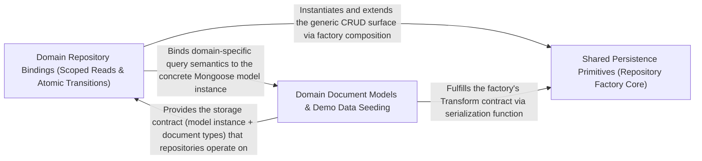

---
tags:
  - 2repo
  - 2repo/arch
  - project/boilerplate-node-backend
type: architecture
component: Persistence_Infrastructure_Repository_Factory
---

## Details

The shared persistence primitives that all domain repositories are built from: the createRepository factory (which encapsulates CRUD, pagination, and search), the text-search helper (addTextFilter), and the database-query metrics tracker (trackDatabaseQuery). This sub-component also includes the concrete domain models (e.g., AddressBookDocument, AddressItem) and their repository bindings that consume the factory. It is the primary target of the no-persistence-imports ESLint rule and the mutation-testing baseline — the architectural invariant being enforced is that this layer is the single door to storage, and the quality gates verify that no other layer reaches past it.

### Shared Persistence Primitives (Repository Factory Core)
The domain-agnostic persistence kernel that all 13 modules build their repositories from. createRepository encapsulates the full CRUD surface (findById, findOne, findByIdRaw, findAll, count, create, save, deleteOne) plus a composite search (filter → count → page → normalize) and a buildWhere helper bound to a per-collection SearchSpec. Every query it returns is wrapped by trackDatabaseQuery so all storage traffic is metered. addTextFilter is the shared regex-based text-search helper that buildWhere uses for text search specs. This is the primary target of the no-persistence-imports ESLint rule: it is the only place in the codebase that imports Mongoose Model and Document types, and the mutation-testing baseline verifies that removing or altering it breaks every repository — confirming it is the single door to storage.

**Related Classes/Methods**:

- `src.infrastructure.persistence.create-repository.createRepository`:229-350
- `src.infrastructure.persistence.create-repository.SearchSpec`:51-72
- `src.infrastructure.persistence.search.addTextFilter`:125-135
- `src.infrastructure.persistence.metrics.trackDatabaseQuery`:28-38
- `src.infrastructure.persistence.create-repository.PaginatedResult`:155-158

**Source Files:**

- `src/infrastructure/adapters/demo-outbox.ts`
  - `src.infrastructure.adapters.demo-outbox.DemoOutboxEmail` (L17-L28) - Interface
  - `src.infrastructure.adapters.demo-outbox.recordDemoEmail.lines.filter() callback` (L70-L70) - Function
  - `src.infrastructure.adapters.demo-outbox.recordDemoEmail.lines.map() callback` (L71-L71) - Function
- `src/infrastructure/persistence/create-repository.ts`
  - `src.infrastructure.persistence.create-repository.FindAllOptions` (L34-L41) - Interface
  - `src.infrastructure.persistence.create-repository.SearchSpec` (L51-L72) - Interface
  - `src.infrastructure.persistence.create-repository.PaginatedResult` (L155-L158) - Interface
  - `src.infrastructure.persistence.create-repository.RepositoryOptions` (L161-L166) - Interface
  - `src.infrastructure.persistence.create-repository.createRepository` (L229-L350) - Function
  - `src.infrastructure.persistence.create-repository.createRepository.normalize.transformed.items.map() callback` (L242-L243) - Function
  - `src.infrastructure.persistence.create-repository.createRepository.normalize.transformed` (L242-L244) - Class
  - `src.infrastructure.persistence.create-repository.deleteOne` (L299-L301) - Class
  - `src.infrastructure.persistence.create-repository.createRepository.deleteOne.then() callback` (L301-L301) - Function
  - `src.infrastructure.persistence.create-repository.search` (L312-L332) - Class
  - `src.infrastructure.persistence.create-repository.createRepository.search.then() callback` (L324-L330) - Function
  - `src.infrastructure.persistence.create-repository.createRepository.search.then() callback.then() callback` (L326-L329) - Function
- `src/infrastructure/persistence/metrics.ts`
  - `src.infrastructure.persistence.metrics.trackDatabaseQuery` (L28-L38) - Class
  - `src.infrastructure.persistence.metrics.trackDatabaseQuery.<function>` (L32-L38) - Function
  - `src.infrastructure.persistence.metrics.trackDatabaseQuery.<function>.catch() callback` (L34-L37) - Function
- `src/infrastructure/persistence/search.ts`
  - `src.infrastructure.persistence.search.addTextFilter` (L125-L135) - Class
  - `src.infrastructure.persistence.search.addTextFilter.fields.map() callback` (L132-L134) - Function
- `src/modules/audit-logs/repository.ts`
  - `src.modules.audit-logs.repository.AuditLogSearchFilters` (L17-L25) - Interface
- `src/modules/delivery/model.ts`
  - `src.modules.delivery.model.ShipmentDocument` (L15-L23) - Interface
- `src/modules/delivery/repository.ts`
  - `src.modules.delivery.repository.shipmentRepository` (L19-L82) - Class
  - `src.modules.delivery.repository.shipmentRepository.findByOrderId` (L36-L37) - Method
  - `src.modules.delivery.repository.shipmentRepository.findByOrderIds` (L44-L45) - Method
  - `src.modules.delivery.repository.shipmentRepository.findByOrderIds.orderId.$in.orderIds.map() callback` (L45-L45) - Function
  - `src.modules.delivery.repository.shipmentRepository.upsertForOrder` (L52-L59) - Method
  - `src.modules.delivery.repository.shipmentRepository.findAllShipped` (L62-L62) - Method
  - `src.modules.delivery.repository.shipmentRepository.updateStatusIfIn` (L74-L81) - Method
- `src/modules/inventory/domain/transitions.ts`
  - `src.modules.inventory.domain.transitions.CounterDelta` (L22-L25) - Interface
- `src/modules/inventory/repository.ts`
  - `src.modules.inventory.repository.toReservationItems` (L33-L39) - Class
  - `src.modules.inventory.repository.toReservationItems.lines.map() callback` (L36-L39) - Function
  - `src.modules.inventory.repository.reservationRepository` (L60-L143) - Class
  - `src.modules.inventory.repository.reservationRepository.insertHold` (L87-L99) - Method
  - `src.modules.inventory.repository.reservationRepository.insertHold.then() callback` (L95-L95) - Function
  - `src.modules.inventory.repository.reservationRepository.insertHold.catch() callback` (L96-L99) - Function
  - `src.modules.inventory.repository.reservationRepository.findByOrderId` (L107-L108) - Method
  - `src.modules.inventory.repository.reservationRepository.claimStatus` (L119-L127) - Method
  - `src.modules.inventory.repository.reservationRepository.findExpired` (L137-L142) - Method
- `src/modules/inventory/service.ts`
  - `src.modules.inventory.service.isStockBoundToOrder` (L282-L285) - Class
  - `src.modules.inventory.service.isStockBoundToOrder.then() callback` (L285-L285) - Function
- `src/modules/orders/emails.ts`
  - `src.modules.orders.emails.orderConfirmEmail.data.lines.order.items.map() callback` (L47-L52) - Function
  - `src.modules.orders.emails.invoiceDocument.lines.order.items.map() callback` (L85-L90) - Function
- `src/modules/orders/fixtures.ts`
  - `src.modules.orders.fixtures.makeOrder.items.map() callback` (L94-L97) - Function
- `src/modules/payments/model.ts`
  - `src.modules.payments.model.PaymentDocument` (L18-L37) - Interface
- `src/modules/payments/repository.ts`
  - `src.modules.payments.repository.paymentRepository` (L19-L136) - Class
  - `src.modules.payments.repository.paymentRepository.ownerScope` (L52-L52) - Method
  - `src.modules.payments.repository.paymentRepository.findByIdScoped` (L64-L65) - Method
  - `src.modules.payments.repository.paymentRepository.findByOrderId` (L74-L75) - Method
  - `src.modules.payments.repository.paymentRepository.upsertIntent` (L86-L105) - Method
  - `src.modules.payments.repository.paymentRepository.upsertIntent.catch() callback` (L102-L105) - Function
  - `src.modules.payments.repository.paymentRepository.updateStatusIfIn` (L111-L118) - Method
  - `src.modules.payments.repository.paymentRepository.detachUserId` (L127-L135) - Method
  - `src.modules.payments.repository.paymentRepository.detachUserId.then() callback` (L135-L135) - Function
- `src/modules/payments/service.ts`
  - `src.modules.payments.service.refundForOrder` (L374-L375) - Class
  - `src.modules.payments.service.refundForOrder.then() callback` (L375-L375) - Function
  - `src.modules.payments.service.detachUserId` (L384-L392) - Class
  - `src.modules.payments.service.detachUserId.then() callback` (L385-L392) - Function
- `src/modules/wishlist/model.ts`
  - `src.modules.wishlist.model.WishlistItem` (L22-L24) - Interface
  - `src.modules.wishlist.model.WishlistDocument` (L32-L37) - Interface
- `src/modules/wishlist/repository.ts`
  - `src.modules.wishlist.repository.wishlistRepository` (L31-L112) - Class
  - `src.modules.wishlist.repository.wishlistRepository.findByUserId` (L46-L47) - Method
  - `src.modules.wishlist.repository.wishlistRepository.addLine` (L67-L74) - Method
  - `src.modules.wishlist.repository.wishlistRepository.removeLine` (L81-L88) - Method
  - `src.modules.wishlist.repository.wishlistRepository.deleteByUserId` (L94-L100) - Method
  - `src.modules.wishlist.repository.wishlistRepository.deleteByUserId.then() callback` (L98-L100) - Function
  - `src.modules.wishlist.repository.wishlistRepository.removeProductFromAll` (L105-L111) - Method
- `src/modules/wishlist/service.ts`
  - `src.modules.wishlist.service.wishlistGet` (L39-L40) - Class
  - `src.modules.wishlist.service.wishlistGet.then() callback` (L40-L40) - Function
  - `src.modules.wishlist.service.wishlistMoveToCart.then() callback.saved` (L108-L108) - Class
  - `src.modules.wishlist.service.wishlistMoveToCart.then() callback.saved.wishlist.items.some() callback` (L108-L108) - Function

### Domain Repository Bindings (Scoped Reads & Atomic Transitions)
The concrete repository instances that consume createRepository and layer domain-specific query semantics on top of the generic CRUD surface. productRepository is the canonical example: it spreads the factory's base methods, then adds scoped reads (findByIdScoped, findPublicById), a $facet aggregation for catalogue facets, and a family of atomic stock transitions (reserveUnits, commitUnits, releaseUnits, receiveUnits, adjustUnits) that use conditional updateOne with $expr guards so mongod evaluates the guard atomically — two checkouts racing the last unit cannot both take it. It also exposes availabilityPage (a $facet aggregation projecting derived available), countLowAvailability, sumReserved, and writebackImage (the image-digest pipeline's conditional writeback). The inventory module's ReservationDocument and StockMovementDocument models are the storage shapes these repositories operate on, and the inventory metrics collectors (_inventoryReservedUnitsTotal, _productsLowStockTotal) read the same counters the transitions write. This sub-component is where the single door to storage invariant is exercised: every domain-specific query lives here, and the ESLint rule verifies that no service or route file imports Mongoose directly.

**Related Classes/Methods**:

- `src.modules.products.repository.productRepository`:41-369
- `src.modules.products.repository.productRepository.reserveUnits`:166-177
- `src.modules.products.repository.productRepository.availabilityPage`:303-347
- `src.modules.inventory.model.ReservationDocument`:121-128
- `src.modules.inventory.model.StockMovementDocument`:29-34

**Source Files:**

- `src/modules/inventory/metrics.ts`
  - `src.modules.inventory.metrics._productsLowStockTotal` (L23-L30) - Class
  - `src.modules.inventory.metrics._productsLowStockTotal.collect` (L27-L29) - Method
  - `src.modules.inventory.metrics._inventoryReservedUnitsTotal` (L37-L44) - Class
  - `src.modules.inventory.metrics._inventoryReservedUnitsTotal.collect` (L41-L43) - Method
- `src/modules/inventory/model.ts`
  - `src.modules.inventory.model.StockMovementDocument` (L29-L34) - Interface
  - `src.modules.inventory.model.ReservationItem` (L108-L111) - Interface
  - `src.modules.inventory.model.ReservationDocument` (L121-L128) - Interface
- `src/modules/products/repository.ts`
  - `src.modules.products.repository.AvailabilityRow` (L20-L26) - Interface
  - `src.modules.products.repository.productRepository` (L41-L369) - Class
  - `src.modules.products.repository.productRepository.publicScope` (L81-L81) - Method
  - `src.modules.products.repository.productRepository.findByIdScoped` (L95-L96) - Method
  - `src.modules.products.repository.productRepository.findPublicById` (L105-L106) - Method
  - `src.modules.products.repository.productRepository.facets` (L115-L143) - Method
  - `src.modules.products.repository.productRepository.facets.then() callback` (L137-L143) - Function
  - `src.modules.products.repository.productRepository.facets.then() callback.categories.map() callback` (L138-L141) - Function
  - `src.modules.products.repository.productRepository.facets.then() callback.tags.map() callback` (L142-L142) - Function
  - `src.modules.products.repository.productRepository.reserveUnits` (L166-L177) - Method
  - `src.modules.products.repository.productRepository.reserveUnits.then() callback` (L177-L177) - Function
  - `src.modules.products.repository.productRepository.commitUnits` (L189-L201) - Method
  - `src.modules.products.repository.productRepository.commitUnits.then() callback` (L201-L201) - Function
  - `src.modules.products.repository.productRepository.releaseUnits` (L213-L221) - Method
  - `src.modules.products.repository.productRepository.releaseUnits.then() callback` (L221-L221) - Function
  - `src.modules.products.repository.productRepository.receiveUnits` (L230-L238) - Method
  - `src.modules.products.repository.productRepository.receiveUnits.then() callback` (L238-L238) - Function
  - `src.modules.products.repository.productRepository.adjustUnits` (L251-L262) - Method
  - `src.modules.products.repository.productRepository.adjustUnits.then() callback` (L262-L262) - Function
  - `src.modules.products.repository.productRepository.countLowAvailability` (L271-L277) - Method
  - `src.modules.products.repository.productRepository.sumReserved` (L286-L289) - Method
  - `src.modules.products.repository.productRepository.sumReserved.then() callback` (L289-L289) - Function
  - `src.modules.products.repository.productRepository.availabilityPage` (L303-L347) - Method
  - `src.modules.products.repository.productRepository.availabilityPage.then() callback` (L344-L347) - Function
  - `src.modules.products.repository.productRepository.writebackImage` (L357-L368) - Method
  - `src.modules.products.repository.productRepository.writebackImage.then() callback` (L368-L368) - Function

### Domain Document Models & Demo Data Seeding
The concrete Mongoose Document interfaces that define the storage shape each repository operates on, plus the demo-data seeding layer that populates them. ProductDocument extends ProductSnapshot with document-only bookkeeping (pendingImageKey) that deliberately does not ride along on the embedded copy orders keep. AddressBookDocument and AddressItem define the account module's address storage. LocaleDocument and LocaleMessageDocument define the i18n storage, with derivesBaseLanguage as a model-level helper. The demo-catalog layer (AnimalLine, FillerProduct, ProductType, Tier, fillerProductRows) generates deterministic seed data that exercises the full persistence path — every demo row flows through the same createRepository factory, so the mutation-testing baseline can verify that the factory's CRUD and search paths are exercised by realistic data. This sub-component is the storage contract: it defines what the database holds, and the repository bindings (Sub-component 2) define how it is accessed. The architectural invariant is that these model files are the only files in the codebase that import mongoose.Schema and mongoose.model, making them the leaf of the persistence dependency chain.

**Related Classes/Methods**:

- `src.modules.products.model.ProductDocument`:38-45
- `src.modules.account.model.AddressBookDocument`:32-37
- `src.modules.locales.model.LocaleDocument`:27-30
- `src.modules.products.demo-catalog.FillerProduct`:125-134
- `src.modules.products.demo.fillerProductRows`:147-155

**Source Files:**

- `src/modules/account/model.ts`
  - `src.modules.account.model.AddressItem` (L14-L29) - Interface
  - `src.modules.account.model.AddressBookDocument` (L32-L37) - Interface
- `src/modules/locales/model.ts`
  - `src.modules.locales.model.LocaleDocument` (L27-L30) - Interface
  - `src.modules.locales.model.LocaleMessageDocument` (L33-L37) - Interface
  - `src.modules.locales.model.derivesBaseLanguage` (L117-L119) - Function
- `src/modules/observability/routes.ts`
  - `src.modules.observability.routes.router.get('/metrics') callback` (L35-L45) - Function
  - `src.modules.observability.routes.router.get('/metrics') callback.then() callback` (L37-L40) - Function
  - `src.modules.observability.routes.router.get('/metrics') callback.catch() callback` (L41-L44) - Function
- `src/modules/orders/domain/totals.ts`
  - `src.modules.orders.domain.totals.LineItem` (L21-L25) - Interface
  - `src.modules.orders.domain.totals.LineItemTotals` (L28-L35) - Interface
  - `src.modules.orders.domain.totals.OrderTotalInput` (L59-L66) - Interface
- `src/modules/products/demo-catalog.ts`
  - `src.modules.products.demo-catalog.FILLER_IMAGE_ROLE_KEYS` (L19-L22) - Class
  - `src.modules.products.demo-catalog.FILLER_IMAGE_ROLE_KEYS.Array.from() callback` (L21-L21) - Function
  - `src.modules.products.demo-catalog.AnimalLine` (L25-L28) - Interface
  - `src.modules.products.demo-catalog.ProductType` (L40-L47) - Interface
  - `src.modules.products.demo-catalog.Tier` (L95-L101) - Interface
  - `src.modules.products.demo-catalog.FillerProduct` (L125-L134) - Interface
- `src/modules/products/demo.ts`
  - `src.modules.products.demo.fillerProductRows` (L147-L155) - Class
  - `src.modules.products.demo.fillerProductRows.FILLER_PRODUCTS.map() callback` (L147-L155) - Function
- `src/modules/products/model.ts`
  - `src.modules.products.model.ProductSnapshot` (L24-L33) - Interface
  - `src.modules.products.model.ProductDocument` (L38-L45) - Interface
