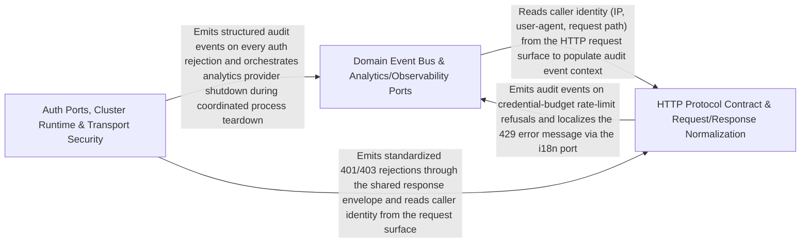

---
tags:
  - 2repo
  - 2repo/arch
  - project/boilerplate-node-backend
type: architecture
component: Platform_Core_Auth_Ports_Event_Bus_Cluster_Runtime_HTTP_Protocol
---

## Details

The foundational platform layer that every other component depends on. It declares the authentication port (AuthResolver) and authorization scope factories, hosts the domain-event bus as the sanctioned cross-module communication channel, manages the cluster runtime (worker fork, crash detection, coordinated shutdown), and defines the HTTP protocol contract including the canonical response envelope, request input polymorphism rules, transport-level security, response caching, and upload normalization. It is domain-free by design, with all domain-specific behavior injected via ports.

### Domain Event Bus & Analytics/Observability Ports
Hosts the kernel's domain-event bus (the sanctioned mechanism for cross-module communication when the import graph must stay acyclic), the DomainEventMap extension point, onDomainEvent/emitDomainEvent with sequential-await semantics and per-handler fault isolation, the analytics provider port (none/posthog/umami implementations), audit event types, dependency-health probe contract, i18n locale context, and persistence fixture helper. Together these form the cross-cutting ports that domain modules consume without importing each other.

**Related Classes/Methods**:

- `src.infrastructure.observability.analytics.index.AnalyticsProvider`:78-103
- `src.infrastructure.observability.audit.AuditEntry`:80-85

**Source Files:**

- `src/infrastructure/i18n/context.ts`
  - `src.infrastructure.i18n.context.LocaleContext` (L21-L26) - Interface
- `src/infrastructure/observability/analytics/index.ts`
  - `src.infrastructure.observability.analytics.index.AnalyticsEventMap` (L25-L25) - Interface
  - `src.infrastructure.observability.analytics.index.AnalyticsEvent` (L42-L63) - Interface
  - `src.infrastructure.observability.analytics.index.AnalyticsProvider` (L78-L103) - Interface
  - `src.infrastructure.observability.analytics.index.AnalyticsProvider.capture` (L86-L86) - Method
  - `src.infrastructure.observability.analytics.index.AnalyticsProvider.configured` (L94-L94) - Method
  - `src.infrastructure.observability.analytics.index.AnalyticsProvider.shutdown` (L102-L102) - Method
  - `src.infrastructure.observability.analytics.index.shutdownAnalytics` (L202-L209) - Class
  - `src.infrastructure.observability.analytics.index.shutdownAnalytics.then() callback` (L204-L208) - Function
- `src/infrastructure/observability/analytics/none.ts`
  - `src.infrastructure.observability.analytics.none.noneAnalyticsProvider` (L14-L29) - Class
  - `src.infrastructure.observability.analytics.none.noneAnalyticsProvider.capture` (L17-L19) - Method
  - `src.infrastructure.observability.analytics.none.noneAnalyticsProvider.configured` (L22-L24) - Method
  - `src.infrastructure.observability.analytics.none.noneAnalyticsProvider.shutdown` (L26-L28) - Method
- `src/infrastructure/observability/analytics/posthog.ts`
  - `src.infrastructure.observability.analytics.posthog.posthogAnalyticsProvider` (L50-L95) - Class
  - `src.infrastructure.observability.analytics.posthog.posthogAnalyticsProvider.configured` (L53-L55) - Method
  - `src.infrastructure.observability.analytics.posthog.posthogAnalyticsProvider.capture` (L57-L81) - Method
  - `src.infrastructure.observability.analytics.posthog.posthogAnalyticsProvider.shutdown` (L87-L94) - Method
- `src/infrastructure/observability/analytics/umami.ts`
  - `src.infrastructure.observability.analytics.umami.umamiAnalyticsProvider` (L76-L150) - Class
  - `src.infrastructure.observability.analytics.umami.umamiAnalyticsProvider.configured` (L81-L83) - Method
  - `src.infrastructure.observability.analytics.umami.umamiAnalyticsProvider.capture` (L85-L140) - Method
  - `src.infrastructure.observability.analytics.umami.umamiAnalyticsProvider.capture.then() callback` (L123-L133) - Function
  - `src.infrastructure.observability.analytics.umami.umamiAnalyticsProvider.capture.catch() callback` (L134-L139) - Function
  - `src.infrastructure.observability.analytics.umami.umamiAnalyticsProvider.shutdown` (L147-L149) - Method
- `src/infrastructure/observability/audit.ts`
  - `src.infrastructure.observability.audit.AuditEvent` (L52-L74) - Interface
  - `src.infrastructure.observability.audit.AuditEntry` (L80-L85) - Interface
- `src/infrastructure/observability/dependency-health.ts`
  - `src.infrastructure.observability.dependency-health.DependencyHealth` (L24-L28) - Interface
- `src/infrastructure/persistence/fixtures.ts`
  - `src.infrastructure.persistence.fixtures.stripUndefined` (L46-L47) - Class
  - `src.infrastructure.persistence.fixtures.stripUndefined.filter() callback` (L47-L47) - Function
- `src/kernel/events.ts`
  - `src.kernel.events.DomainEventMap` (L21-L21) - Interface
- `src/modules/payments/providers/card.ts`
  - `src.modules.payments.providers.card.CardDetails` (L9-L11) - Interface
- `src/modules/products/model.ts`
  - `src.modules.products.model.title.error` (L71-L71) - Method
  - `src.modules.products.model.zodProductSchema.title.error` (L72-L72) - Method
  - `src.modules.products.model.price.error` (L75-L75) - Method
  - `src.modules.products.model.zodProductSchema.price.error` (L76-L76) - Method

### Auth Ports, Cluster Runtime & Transport Security
The security and process-management backbone. Declares the authentication port (AuthResolver with fromAccessToken/fromRefreshToken), authorization scope factories (createOwnerScope, createVisibilityScope), the cluster runtime managing worker forking with crash detection and coordinated shutdown, the transport security layer (helmet, CORS, body-size limits, trust-proxy, rate limiter), and the authorization middleware (getAuth, isAuth, isAdmin, requireFreshAuth) that bridges the kernel port to Express.

**Related Classes/Methods**:

- `src.kernel.authentication.AuthResolver`:35-38
- `src.kernel.authorization.createOwnerScope`:46-47
- `src.kernel.middlewares.authorizations.getAuth`:45-72

**Source Files:**

- `src/app/security.ts`
  - `src.app.security.allowedOrigins` (L33-L38) - Class
  - `src.app.security.allowedOrigins.map() callback` (L36-L36) - Function
- `src/cluster.ts`
  - `src.cluster.cluster.on('exit') callback.recentCrashes` (L140-L140) - Class
  - `src.cluster.cluster.on('exit') callback.recentCrashes.crashHistory.filter() callback` (L140-L140) - Function
- `src/kernel/authentication.ts`
  - `src.kernel.authentication.AuthenticatedUser` (L12-L32) - Interface
  - `src.kernel.authentication.AuthResolver` (L35-L38) - Interface
  - `src.kernel.authentication.resolveAccessToken` (L67-L68) - Class
  - `src.kernel.authentication.resolveAccessToken.then() callback` (L68-L68) - Function
- `src/kernel/authorization.ts`
  - `src.kernel.authorization.createOwnerScope` (L46-L47) - Class
  - `src.kernel.authorization.createOwnerScope.restrictNonAdmin() callback` (L47-L47) - Function
  - `src.kernel.authorization.createVisibilityScope` (L61-L62) - Class
  - `src.kernel.authorization.createVisibilityScope.restrictNonAdmin() callback` (L62-L62) - Function
- `src/kernel/middlewares/authorizations.ts`
  - `src.kernel.middlewares.authorizations.getAuth` (L45-L72) - Class
  - `src.kernel.middlewares.authorizations.getAuth.then() callback` (L54-L67) - Function
  - `src.kernel.middlewares.authorizations.getAuth.catch() callback` (L68-L70) - Function
  - `src.kernel.middlewares.authorizations.FreshAuthOptions` (L217-L225) - Interface
- `src/modules/users/model.ts`
  - `src.modules.users.model.TokenType` (L22-L25) - Enum
  - `src.modules.users.model.Token` (L44-L70) - Interface
  - `src.modules.users.model.UserMethods` (L136-L143) - Interface
  - `src.modules.users.model.email.error` (L160-L160) - Method
  - `src.modules.users.model.zodUserSchema.email.error` (L161-L161) - Method
  - `src.modules.users.model.username.error` (L165-L165) - Method
  - `src.modules.users.model.zodUserSchema.username.error` (L166-L166) - Method
  - `src.modules.users.model.password.error` (L174-L174) - Method
  - `src.modules.users.model.password.refine() callback` (L176-L176) - Function
  - `src.modules.users.model.zodUserSchema.password.refine() callback` (L185-L185) - Function
  - `src.modules.users.model.zodUserSchema.password.error` (L186-L186) - Method
  - `src.modules.users.model.userSchema.pre('save') callback` (L388-L396) - Function
  - `src.modules.users.model.userSchema.pre('save') callback.then() callback` (L393-L395) - Function
  - `src.modules.users.model.tokenAdd.then() callback` (L426-L432) - Function
  - `src.modules.users.model.tokenRemoveAll.then() callback` (L441-L447) - Function
  - `src.modules.users.model.tokenRemoveAll.then() callback.tokens.filter() callback` (L446-L446) - Function

### HTTP Protocol Contract & Request/Response Normalization
Defines the wire protocol that every endpoint speaks. Includes the response envelope (ResponseSuccess/ResponseReject discriminated union), request-input polymorphism (readInput, RequestSurface, SURFACE_SOURCES), upload normalization helpers (getFormFiles, resolveImageUrl, resolveThumbnailUrl, resolvePendingImageKey), response caching middleware (resolveCacheTtl, serializeCachedResponse, parseCachedResponse), and the rate limiter (refuse, limiterOptions) providing global and per-route budgets.

**Related Classes/Methods**:

- `src.infrastructure.http.response.ResponseSuccess`:27-37
- `src.infrastructure.http.middlewares.rate-limit.refuse`:84-99

**Source Files:**

- `src/infrastructure/http/middlewares/cache.ts`
  - `src.infrastructure.http.middlewares.cache.getCacheKey.values` (L199-L205) - Class
  - `src.infrastructure.http.middlewares.cache.getCacheKey.values.sortedKeyParameters.filter() callback` (L200-L200) - Function
  - `src.infrastructure.http.middlewares.cache.getCacheKey.values.map() callback` (L201-L204) - Function
- `src/infrastructure/http/middlewares/rate-limit.ts`
  - `src.infrastructure.http.middlewares.rate-limit.refuse` (L84-L99) - Class
  - `src.infrastructure.http.middlewares.rate-limit.refuse.<function>` (L86-L99) - Function
- `src/infrastructure/http/request.ts`
  - `src.infrastructure.http.request.readInput.sources.map() callback` (L207-L208) - Function
  - `src.infrastructure.http.request.readInput.sources` (L207-L209) - Class
  - `src.infrastructure.http.request.readInput.stated` (L237-L239) - Class
  - `src.infrastructure.http.request.readInput.stated.sources.map() callback` (L238-L238) - Function
  - `src.infrastructure.http.request.readInput.stated.filter() callback` (L239-L239) - Function
- `src/infrastructure/http/response.ts`
  - `src.infrastructure.http.response.ResponseNeutral` (L14-L21) - Interface
  - `src.infrastructure.http.response.ResponseSuccess` (L27-L37) - Interface
  - `src.infrastructure.http.response.ResponseErrorItem` (L40-L47) - Interface
  - `src.infrastructure.http.response.ResponseReject` (L53-L60) - Interface
- `src/infrastructure/http/uploads.ts`
  - `src.infrastructure.http.uploads.getFormFiles.paths` (L39-L41) - Class
  - `src.infrastructure.http.uploads.getFormFiles.paths.request.files.map() callback` (L40-L40) - Function
  - `src.infrastructure.http.uploads.getFormFiles.paths.flatMap() callback` (L41-L41) - Function
  - `src.infrastructure.http.uploads.getFormFiles.paths.flatMap() callback.files.map() callback` (L41-L41) - Function
- `src/infrastructure/i18n/negotiate.ts`
  - `src.infrastructure.i18n.negotiate.negotiateLocale.candidates` (L33-L51) - Class
  - `src.infrastructure.i18n.negotiate.negotiateLocale.candidates.map() callback` (L35-L48) - Function
  - `src.infrastructure.i18n.negotiate.negotiateLocale.candidates.filter() callback` (L49-L49) - Function
  - `src.infrastructure.i18n.negotiate.negotiateLocale.candidates.toSorted() callback` (L51-L51) - Function
- `src/infrastructure/persistence/search.ts`
  - `src.infrastructure.persistence.search.PaginationInput` (L11-L17) - Interface
- `src/modules/inventory/service.ts`
  - `src.modules.inventory.service.StockLine` (L38-L41) - Interface
  - `src.modules.inventory.service.StockShortfall` (L44-L49) - Interface
  - `src.modules.inventory.service.LevelFilters` (L58-L60) - Interface
  - `src.modules.inventory.service.MovementFilters` (L63-L66) - Interface
