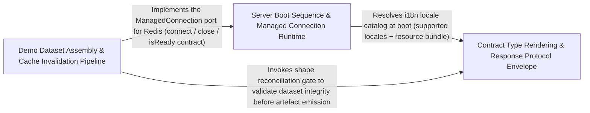

---
tags:
  - 2repo
  - 2repo/arch
  - project/boilerplate-node-backend
type: architecture
component: Server_Lifecycle_Contract_Type_Rendering
---

## Details

This sub-component owns the runtime boundary and the contract-first type generation seam. startServer boots the Express listener, installs the request-context middleware, and resolves a handle; stopServer performs graceful shutdown, flushing the cache, draining the queue, and closing storage handles. The then()/finally() callbacks make the lifecycle an explicit async state machine. renderChannelNamespace.entries walks the AsyncAPI document's channel map and emits the TypeScript type declarations that the generated client consumes, serving as the contract-to-code bridge. reconcileShapes.orphaned detects demo-data shapes that have no corresponding module seed and either prunes or flags them. seed.perModule tracks which modules contributed rows, enabling the export report to list coverage per bounded context. In the flow diagram this group sits between the composition root and the export orchestrator.

### Server Boot Sequence & Managed Connection Runtime
Owns the process-level lifecycle state machine and the shared connection-management pattern for optional infrastructure dependencies. startServer orchestrates the boot pipeline as an explicit async chain: validate environment, connect MongoDB, warm Redis, warm RabbitMQ, register workers, mount i18n, and open the HTTP listener. shutdownInfra reverses the order for graceful teardown, and registerSignalHandlers installs SIGTERM/SIGINT listeners with a configurable deadline timer. The ManagedConnection abstraction is the single source of truth for the six lifecycle rules that both the Redis and RabbitMQ adapters delegate to. validateRequiredEnvironment is the fail-fast gate that crashes the process before the listener opens if JWT secrets or database config are missing.

**Related Classes/Methods**:

- `src.infrastructure.runtime.managed-connection.ManagedConnection`:73-112

**Source Files:**

- `db/demo/index.ts`
  - `db.demo.index.seed.created` (L67-L67) - Class
  - `db.demo.index.seed.created.results.filter() callback` (L67-L67) - Function
- `src/infrastructure/adapters/cache.ts`
  - `src.infrastructure.adapters.cache.cacheConnection` (L60-L112) - Class
  - `src.infrastructure.adapters.cache.cacheConnection.isReady` (L66-L66) - Method
  - `src.infrastructure.adapters.cache.cacheConnection.connect` (L67-L94) - Method
  - `src.infrastructure.adapters.cache.cacheConnection.connect.then() callback` (L93-L93) - Function
  - `src.infrastructure.adapters.cache.cacheConnection.close` (L95-L111) - Method
  - `src.infrastructure.adapters.cache.cacheConnection.close.then() callback` (L108-L108) - Function
- `src/infrastructure/adapters/queue.ts`
  - `src.infrastructure.adapters.queue.queueConnection` (L90-L151) - Class
  - `src.infrastructure.adapters.queue.queueConnection.isReady` (L99-L99) - Method
  - `src.infrastructure.adapters.queue.queueConnection.connect` (L100-L133) - Method
  - `src.infrastructure.adapters.queue.queueConnection.connect.then() callback` (L122-L131) - Function
  - `src.infrastructure.adapters.queue.queueConnection.connect.then() callback.superviseHandle() callback` (L127-L129) - Function
  - `src.infrastructure.adapters.queue.queueConnection.close` (L134-L150) - Method
  - `src.infrastructure.adapters.queue.queueConnection.close.finally() callback` (L146-L148) - Function
- `src/infrastructure/runtime/environment.ts`
  - `src.infrastructure.runtime.environment.validateRequiredEnvironment.missing` (L85-L88) - Class
  - `src.infrastructure.runtime.environment.validateRequiredEnvironment.missing.REQUIRED_ENV_KEYS.filter() callback` (L85-L88) - Function
- `src/infrastructure/runtime/managed-connection.ts`
  - `src.infrastructure.runtime.managed-connection.ManagedConnectionOptions` (L26-L70) - Interface
  - `src.infrastructure.runtime.managed-connection.ManagedConnection` (L73-L112) - Interface
  - `src.infrastructure.runtime.managed-connection.manageConnection` (L120-L221) - Class
  - `src.infrastructure.runtime.managed-connection.manageConnection.state` (L184-L192) - Method
  - `src.infrastructure.runtime.managed-connection.manageConnection.forget` (L194-L196) - Method
  - `src.infrastructure.runtime.managed-connection.manageConnection.stop` (L200-L219) - Method
  - `src.infrastructure.runtime.managed-connection.manageConnection.stop.catch() callback` (L212-L212) - Function
  - `src.infrastructure.runtime.managed-connection.manageConnection.stop.finally() callback` (L213-L217) - Function
- `src/infrastructure/runtime/server-lifecycle.ts`
  - `src.infrastructure.runtime.server-lifecycle.onProcessSignal.then() callback` (L114-L114) - Function

### Demo Dataset Assembly & Cache Invalidation Pipeline
Owns the demo-data lifecycle: assembling the bounded-context dataset, seeding it into MongoDB, and managing the cache invalidation that keeps the Redis layer consistent with the seeded state. assembleDemoDataset.sections walks the enabled modules and collects their per-module seed contributions into a unified dataset with per-context coverage tracking. db.demo.index.seed is the entry point that persists the assembled dataset and records seed.created timestamps. clearCache is the cache-invalidation seam that flushes tag-based key families so a re-seed or data mutation does not leave stale responses in Redis. The runScript callback in db/cache-clear.ts is the operational hook that triggers a full cache sweep. The request-context middleware ties per-request identity into the pipeline so cache keys and audit entries carry the caller's context.

**Related Classes/Methods**:

- `db.demo.assemble.assembleDemoDataset.sections`:168-170
- `db.demo.index.seed`:38-92
- `src.infrastructure.adapters.cache.clearCache`:326-367

**Source Files:**

- `db/cache-clear.ts`
  - `db.cache-clear.runScript() callback` (L41-L41) - Function
- `db/demo/assemble.ts`
  - `db.demo.assemble.assembleDemoDataset.sections` (L168-L170) - Class
  - `db.demo.assemble.assembleDemoDataset.sections.enabledModules.map() callback` (L169-L169) - Function
- `db/demo/index.ts`
  - `db.demo.index.seed` (L38-L92) - Function
- `src/app.ts`
  - `src.app.startServer.then() callback.<function>.server` (L109-L113) - Class
  - `src.app.startServer.then() callback.<function>.server.app.listen() callback` (L109-L113) - Function
- `src/infrastructure/adapters/cache.ts`
  - `src.infrastructure.adapters.cache.clearCache` (L326-L367) - Class
  - `src.infrastructure.adapters.cache.clearCache.then() callback` (L329-L357) - Function
  - `src.infrastructure.adapters.cache.clearCache.catch() callback` (L358-L367) - Function
- `src/infrastructure/http/request.ts`
  - `src.infrastructure.http.request.readInput.sources.map() callback` (L247-L248) - Function
  - `src.infrastructure.http.request.readInput.sources` (L247-L249) - Class
- `src/infrastructure/runtime/managed-connection.ts`
  - `src.infrastructure.runtime.managed-connection.manageConnection.get.attempt` (L157-L174) - Class
  - `src.infrastructure.runtime.managed-connection.manageConnection.get.attempt.then() callback` (L158-L163) - Function
  - `src.infrastructure.runtime.managed-connection.manageConnection.get.attempt.catch() callback` (L164-L170) - Function
  - `src.infrastructure.runtime.managed-connection.manageConnection.get.attempt.finally() callback` (L171-L174) - Function
- `src/infrastructure/runtime/server-lifecycle.ts`
  - `src.infrastructure.runtime.server-lifecycle.registerSignalHandlers` (L92-L135) - Class
  - `src.infrastructure.runtime.server-lifecycle.registerSignalHandlers.process.on('SIGTERM') callback` (L132-L132) - Function
  - `src.infrastructure.runtime.server-lifecycle.registerSignalHandlers.process.on('SIGINT') callback` (L134-L134) - Function

### Contract Type Rendering & Response Protocol Envelope
The contract-to-code bridge and the canonical response protocol layer. renderChannelNamespace.entries walks the AsyncAPI document's channel map and emits TypeScript type declarations (payload interfaces, message aliases, per-namespace channel constants, SSE event name/payload maps) that the generated client consumes. The response envelope types (ResponseNeutral, ResponseSuccess, ResponseReject) define the single discriminated union that every endpoint answers with, giving the orval-generated client one stable shape to model. listSupportedLocales and loadLocaleResources resolve the i18n resource set at boot, deep-merging per-module dictionaries into the i18next resource bundle. reconcileShapes.orphaned detects demo-data shapes that have no corresponding module seed and either prunes or flags them, closing the loop between the contract surface and the actual data model.

**Related Classes/Methods**:

- `scripts.generate-asyncapi-types.renderChannelNamespace.entries`:301-303
- `src.infrastructure.http.response.ResponseSuccess`:22-32
- `src.infrastructure.i18n.catalog.listSupportedLocales`:42-59
- `src.infrastructure.i18n.catalog.loadLocaleResources`:153-159
- `db.demo.assemble.reconcileShapes.orphaned`

**Source Files:**

- `db/demo/assemble.ts`
  - `db.demo.assemble.reconcileShapes.orphaned` (L148-L148) - Class
  - `db.demo.assemble.reconcileShapes.orphaned.filter() callback` (L148-L148) - Function
- `scripts/generate-asyncapi-types.ts`
  - `scripts.generate-asyncapi-types.renderChannelNamespace.entries` (L301-L303) - Class
  - `scripts.generate-asyncapi-types.renderChannelNamespace.entries.channelNames.map() callback` (L302-L302) - Function
- `src/app.ts`
  - `src.app.startServer` (L59-L117) - Class
  - `src.app.startServer.then() callback.enabledModules.map() callback` (L75-L75) - Function
  - `src.app.startServer.then() callback.filter() callback` (L76-L76) - Function
  - `src.app.startServer.then() callback` (L105-L114) - Function
  - `src.app.startServer.then() callback.<function>` (L106-L114) - Function
- `src/infrastructure/http/middlewares/cache.ts`
  - `src.infrastructure.http.middlewares.cache.getCacheKey.values` (L228-L234) - Class
  - `src.infrastructure.http.middlewares.cache.getCacheKey.values.sortedKeyParameters.filter() callback` (L229-L229) - Function
  - `src.infrastructure.http.middlewares.cache.getCacheKey.values.map() callback` (L230-L233) - Function
- `src/infrastructure/http/response.ts`
  - `src.infrastructure.http.response.ResponseNeutral` (L13-L20) - Interface
  - `src.infrastructure.http.response.ResponseSuccess` (L22-L32) - Interface
  - `src.infrastructure.http.response.ResponseErrorItem` (L35-L42) - Interface
  - `src.infrastructure.http.response.ResponseReject` (L44-L51) - Interface
- `src/infrastructure/i18n/catalog.ts`
  - `src.infrastructure.i18n.catalog.listSupportedLocales` (L42-L59) - Class
  - `src.infrastructure.i18n.catalog.listSupportedLocales.filter() callback` (L54-L54) - Function
  - `src.infrastructure.i18n.catalog.listSupportedLocales.map() callback` (L55-L55) - Function
  - `src.infrastructure.i18n.catalog.loadLocaleResources` (L153-L159) - Class
  - `src.infrastructure.i18n.catalog.loadLocaleResources.map() callback` (L155-L158) - Function
- `src/infrastructure/i18n/negotiate.ts`
  - `src.infrastructure.i18n.negotiate.negotiateLocale.candidates.map() callback.declared` (L37-L39) - Class
  - `src.infrastructure.i18n.negotiate.negotiateLocale.candidates.map() callback.declared.parameters.map() callback` (L38-L38) - Function
