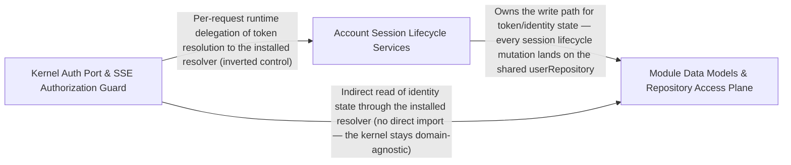

---
tags:
  - 2repo
  - 2repo/arch
  - project/boilerplate-node-backend
type: architecture
component: Session_Lifecycle_Data_Access_Token_Management_Guards_Repositories
---

## Details

The session and data plane of the platform. Contains the refresh-token resolution path, the SSE-specific authorization guard (isAdminViaCookie), and the account module's session lifecycle services (two-factor authentication, token cleanup, account export, profile management). Also includes the module data models (e.g., CartItem), repository access patterns (e.g., locales.repository.countEntriesByLocale), and the multi-tenant locale configuration. This is the data plane that underpins the service orchestration: it manages the token lifecycle, enforces authorization at the guard level, and provides the repository/model layer that services query.

### Module Data Models & Repository Access Plane
The persistence/data-access plane shared across the domain modules — Mongoose models, repository query patterns, and multi-tenant locale configuration. It defines the durable stored shapes (e.g., CartItem with productId/quantity, one document per user, __v version key for conditional checkout clearing) and the repository access patterns services query (e.g., locales.repository.countEntriesByLocale aggregating per-locale entry counts over frontend tenants only). The multi-tenant locale configuration (locales.tenants.isKnownTenant, frontendTenantIds, listTenants) is treated as configuration, not data — the keyspaces an entry can belong to, with exactly one backend tenant and one or more frontend tenants. This plane is what the service orchestration reads and writes: models define the wire/stored contract, repositories encapsulate the queries, and tenant config scopes which rows are served.

**Related Classes/Methods**:

- `src.modules.cart.model.CartItem`:23-26
- `src.modules.locales.repository.countEntriesByLocale`:86-98
- `src.modules.locales.tenants.isKnownTenant`
- `src.modules.locales.tenants.frontendTenantIds`:54-57

**Source Files:**

- `src/modules/cart/model.ts`
  - `src.modules.cart.model.CartItem` (L23-L26) - Interface
- `src/modules/cart/services/checkout.ts`
  - `src.modules.cart.services.checkout.runCheckout.joined` (L152-L152) - Class
  - `src.modules.cart.services.checkout.runCheckout.joined.lines.filter() callback` (L152-L152) - Function
  - `src.modules.cart.services.checkout.runCheckout.joined.every() callback` (L159-L159) - Function
- `src/modules/cart/services/items.ts`
  - `src.modules.cart.services.items.upsertCartItem` (L64-L77) - Class
  - `src.modules.cart.services.items.upsertCartItem.then() callback` (L70-L77) - Function
  - `src.modules.cart.services.items.upsertCartItem.then() callback.then() callback` (L76-L76) - Function
  - `src.modules.cart.services.items.cartItemAdd` (L97-L111) - Class
  - `src.modules.cart.services.items.cartItemAdd.then() callback` (L103-L111) - Function
- `src/modules/cart/services/reorder.ts`
  - `src.modules.cart.services.reorder.ReorderLine` (L32-L37) - Interface
  - `src.modules.cart.services.reorder.reorderIntoCart` (L48-L120) - Class
  - `src.modules.cart.services.reorder.then() callback` (L55-L102) - Function
  - `src.modules.cart.services.reorder.reorderIntoCart.then() callback.then() callback` (L79-L101) - Function
  - `src.modules.cart.services.reorder.reorderIntoCart.then() callback.then() callback.addable` (L80-L80) - Class
  - `src.modules.cart.services.reorder.reorderIntoCart.then() callback.then() callback.addable.lines.filter() callback` (L80-L80) - Function
  - `src.modules.cart.services.reorder.then() callback.then() callback.then() callback` (L99-L99) - Function
  - `src.modules.cart.services.reorder.reorderIntoCart.then() callback.then() callback.then() callback` (L100-L100) - Function
  - `src.modules.cart.services.reorder.reorderIntoCart.catch() callback` (L103-L103) - Function
  - `src.modules.cart.services.reorder.reorderIntoCart.then() callback` (L104-L120) - Function
- `src/modules/cart/services/view.ts`
  - `src.modules.cart.services.view.CartLine` (L23-L26) - Interface
- `src/modules/feedback/service.ts`
  - `src.modules.feedback.service.updateStatus` (L173-L183) - Class
  - `src.modules.feedback.service.updateStatus.then() callback` (L182-L182) - Function
  - `src.modules.feedback.service.updateStatusById` (L191-L211) - Class
  - `src.modules.feedback.service.updateStatusById.then() callback` (L196-L211) - Function
  - `src.modules.feedback.service.updateStatusById.then() callback.then() callback` (L198-L210) - Function
  - `src.modules.feedback.service.remove` (L222-L240) - Class
  - `src.modules.feedback.service.remove.then() callback` (L226-L240) - Function
  - `src.modules.feedback.service.remove.then() callback.then() callback` (L228-L239) - Function
- `src/modules/inventory/service.ts`
  - `src.modules.inventory.service.listMovements` (L461-L468) - Class
  - `src.modules.inventory.service.listMovements.then() callback` (L468-L468) - Function
- `src/modules/locales/repository.ts`
  - `src.modules.locales.repository.countEntriesByLocale` (L86-L98) - Class
  - `src.modules.locales.repository.countEntriesByLocale.rows.map() callback` (L97-L97) - Function
  - `src.modules.locales.repository.importEntries.incoming` (L203-L203) - Class
  - `src.modules.locales.repository.importEntries.incoming.inputs.map() callback` (L203-L203) - Function
- `src/modules/locales/services/capabilities.ts`
  - `src.modules.locales.services.capabilities.mergeCapabilities` (L101-L125) - Class
  - `src.modules.locales.services.capabilities.mergeCapabilities.toSorted() callback` (L124-L124) - Function
  - `src.modules.locales.services.capabilities.readDynamicTier` (L132-L150) - Class
  - `src.modules.locales.services.capabilities.readDynamicTier.then() callback` (L144-L144) - Function
  - `src.modules.locales.services.capabilities.readDynamicTier.catch() callback` (L145-L150) - Function
- `src/modules/locales/services/entries.ts`
  - `src.modules.locales.services.entries.importEntries.keys` (L202-L202) - Class
  - `src.modules.locales.services.entries.importEntries.keys.inputs.map() callback` (L202-L202) - Function
- `src/modules/locales/services/keys.ts`
  - `src.modules.locales.services.keys.findUnsafeKeySegment` (L74-L75) - Class
  - `src.modules.locales.services.keys.findUnsafeKeySegment.find() callback` (L75-L75) - Function
- `src/modules/locales/tenants.ts`
  - `src.modules.locales.tenants.extraFrontendTenants` (L29-L37) - Class
  - `src.modules.locales.tenants.map() callback` (L32-L32) - Function
  - `src.modules.locales.tenants.extraFrontendTenants.filter() callback` (L33-L33) - Function
  - `src.modules.locales.tenants.extraFrontendTenants.map() callback` (L34-L37) - Function
  - `src.modules.locales.tenants.listTenants` (L40-L51) - Class
  - `src.modules.locales.tenants.listTenants.rows.filter() callback` (L50-L50) - Function
  - `src.modules.locales.tenants.frontendTenantIds` (L54-L57) - Class
  - `src.modules.locales.tenants.frontendTenantIds.filter() callback` (L56-L56) - Function
  - `src.modules.locales.tenants.frontendTenantIds.map() callback` (L57-L57) - Function
  - `src.modules.locales.tenants.isKnownTenant` (L60-L60) - Class
  - `src.modules.locales.tenants.isKnownTenant.some() callback` (L60-L60) - Function
- `src/modules/products/service.ts`
  - `src.modules.products.service.remove` (L281-L301) - Class
  - `src.modules.products.service.remove.then() callback` (L300-L300) - Function
  - `src.modules.products.service.removeById` (L310-L318) - Class
  - `src.modules.products.service.removeById.then() callback` (L316-L317) - Function
- `src/modules/users/service.ts`
  - `src.modules.users.service.remove` (L237-L259) - Class
  - `src.modules.users.service.remove.then() callback` (L250-L258) - Function
  - `src.modules.users.service.removeById` (L338-L346) - Class
  - `src.modules.users.service.removeById.then() callback` (L344-L345) - Function

### Account Session Lifecycle Services
The account module's session-lifecycle service layer — the concrete implementation that owns the token lifecycle and identity state. It supplies the auth resolver the kernel port delegates to, and manages two-factor authentication (adminDisableTwoFactor, verification), token cleanup (sessionRevoke, tokenRemoveAll), account export (AccountExportPayload, ExportSession, ExportPayment, ExportFeedbackTicket), and profile management (passwordChange, addresses.addressUpdate). This is the 'who is making this request' data owner: it reads the user document fresh per request (e.g., analyticsConsent) and enforces that a revoked token is rejected, not merely an expired one. It is the business core that the kernel's guard depends on, and the source of the session/token state that the data plane persists.

**Related Classes/Methods**:

- `src.modules.account.services.authentication.sessionRevoke`:180-194
- `src.modules.account.services.authentication.tokenRemoveAll`:433-474
- `src.modules.account.services.profile.passwordChange`:85-104

**Source Files:**

- `src/modules/account/services/addresses.ts`
  - `src.modules.account.services.addresses.addressUpdate` (L58-L66) - Class
  - `src.modules.account.services.addresses.addressUpdate.then() callback` (L63-L66) - Function
- `src/modules/account/services/authentication.ts`
  - `src.modules.account.services.authentication.sessionRevoke` (L180-L194) - Class
  - `src.modules.account.services.authentication.sessionRevoke.then() callback` (L185-L194) - Function
  - `src.modules.account.services.authentication.tokenRemoveAll` (L433-L474) - Class
  - `src.modules.account.services.authentication.tokenRemoveAll.then() callback.then() callback` (L455-L455) - Function
  - `src.modules.account.services.authentication.tokenRemoveAll.catch() callback` (L458-L458) - Function
  - `src.modules.account.services.authentication.tokenRemoveAll.then() callback` (L459-L474) - Function
  - `src.modules.account.services.authentication.reauth.outcome` (L503-L516) - Class
  - `src.modules.account.services.authentication.reauth.outcome.then() callback.then() callback` (L511-L514) - Function
  - `src.modules.account.services.authentication.reauth.outcome.catch() callback` (L516-L516) - Function
  - `src.modules.account.services.authentication.reauth.outcome.then() callback` (L518-L526) - Function
- `src/modules/account/services/export.ts`
  - `src.modules.account.services.export.ExportSession` (L38-L44) - Interface
  - `src.modules.account.services.export.ExportFeedbackTicket` (L55-L64) - Interface
  - `src.modules.account.services.export.ExportPayment` (L86-L96) - Interface
  - `src.modules.account.services.export.AccountExportPayload` (L114-L127) - Interface
  - `src.modules.account.services.export.exportOwnData.then() callback.orderIds.orderPage.items.map() callback` (L174-L175) - Function
  - `src.modules.account.services.export.exportOwnData.then() callback.orderIds` (L174-L176) - Class
- `src/modules/account/services/profile.ts`
  - `src.modules.account.services.profile.validatePasswordChange.parseResult` (L50-L68) - Class
  - `src.modules.account.services.profile.validatePasswordChange.parseResult.superRefine() callback` (L57-L64) - Function
  - `src.modules.account.services.profile.passwordChange` (L85-L104) - Class
  - `src.modules.account.services.profile.passwordChange.then() callback` (L97-L101) - Function
  - `src.modules.account.services.profile.passwordChange.then() callback.catch() callback` (L100-L100) - Function
  - `src.modules.account.services.profile.passwordChange.then() callback.then() callback` (L101-L101) - Function
  - `src.modules.account.services.profile.passwordChange.catch() callback` (L103-L103) - Function
  - `src.modules.account.services.profile.passwordResetChange` (L127-L160) - Class
  - `src.modules.account.services.profile.passwordResetChange.then() callback` (L133-L160) - Function
  - `src.modules.account.services.profile.passwordChangeWithCurrent` (L289-L328) - Class
  - `src.modules.account.services.profile.passwordChangeWithCurrent.outcome` (L298-L317) - Class
  - `src.modules.account.services.profile.outcome.then() callback` (L304-L316) - Function
  - `src.modules.account.services.profile.passwordChangeWithCurrent.outcome.then() callback.then() callback` (L309-L315) - Function
  - `src.modules.account.services.profile.passwordChangeWithCurrent.outcome.catch() callback` (L317-L317) - Function
  - `src.modules.account.services.profile.passwordChangeWithCurrent.outcome.then() callback` (L319-L327) - Function
- `src/modules/account/services/token-cleanup.ts`
  - `src.modules.account.services.token-cleanup.adminTokenCleanup` (L55-L81) - Class
  - `src.modules.account.services.token-cleanup.adminTokenCleanup.then() callback` (L60-L68) - Function
  - `src.modules.account.services.token-cleanup.adminTokenCleanup.catch() callback` (L69-L81) - Function
- `src/modules/account/services/two-factor.ts`
  - `src.modules.account.services.two-factor.confirmTwoFactor` (L96-L131) - Class
  - `src.modules.account.services.two-factor.outcome.then() callback` (L103-L119) - Function
  - `src.modules.account.services.two-factor.disableTwoFactor` (L141-L175) - Class
  - `src.modules.account.services.two-factor.disableTwoFactor.outcome` (L146-L164) - Class
  - `src.modules.account.services.two-factor.disableTwoFactor.outcome.then() callback.then() callback` (L153-L162) - Function
  - `src.modules.account.services.two-factor.disableTwoFactor.outcome.then() callback.then() callback.then() callback` (L161-L161) - Function
  - `src.modules.account.services.two-factor.disableTwoFactor.outcome.catch() callback` (L164-L164) - Function
  - `src.modules.account.services.two-factor.disableTwoFactor.outcome.then() callback` (L166-L174) - Function
  - `src.modules.account.services.two-factor.verifyLoginChallenge` (L187-L226) - Class
- `src/modules/account/services/verification.ts`
  - `src.modules.account.services.verification.requestEmailVerification` (L69-L80) - Class
  - `src.modules.account.services.verification.requestEmailVerification.then() callback` (L73-L80) - Function
  - `src.modules.account.services.verification.requestEmailVerificationFor` (L90-L102) - Class
  - `src.modules.account.services.verification.requestEmailVerificationFor.then() callback` (L95-L102) - Function
  - `src.modules.account.services.verification.requestEmailVerificationFor.then() callback.then() callback` (L99-L100) - Function
- `src/modules/products/service.ts`
  - `src.modules.products.service.searchViewed` (L85-L102) - Class
  - `src.modules.products.service.searchViewed.then() callback` (L90-L102) - Function
- `src/modules/users/service.ts`
  - `src.modules.users.service.adminDisableTwoFactor` (L307-L335) - Class
  - `src.modules.users.service.adminDisableTwoFactor.outcome` (L311-L322) - Class
  - `src.modules.users.service.outcome.then() callback` (L313-L322) - Function
  - `src.modules.users.service.adminDisableTwoFactor.outcome.then() callback.then() callback` (L321-L321) - Function
  - `src.modules.users.service.adminDisableTwoFactor.outcome.then() callback` (L324-L334) - Function
- `src/modules/wishlist/service.ts`
  - `src.modules.wishlist.service.wishlistAdd` (L49-L64) - Class
  - `src.modules.wishlist.service.wishlistAdd.then() callback` (L54-L64) - Function
  - `src.modules.wishlist.service.wishlistAdd.then() callback.then() callback` (L56-L63) - Function
  - `src.modules.wishlist.service.wishlistMoveToCart` (L102-L125) - Class
  - `src.modules.wishlist.service.wishlistMoveToCart.then() callback` (L107-L125) - Function
  - `src.modules.wishlist.service.wishlistMoveToCart.then() callback.then() callback` (L111-L124) - Function
  - `src.modules.wishlist.service.wishlistMoveToCart.then() callback.then() callback.then() callback` (L116-L123) - Function

### Kernel Auth Port & SSE Authorization Guard
The domain-agnostic kernel seam for authentication and the SSE-specific authorization guard. src/kernel/authentication.ts declares the AuthResolver port (fromAccessToken / fromRefreshToken) and the AuthenticatedUser contract, with resolveRefreshToken as the cookie-path entry point that delegates to the resolver installed by account at boot. src/kernel/middlewares/authorizations.ts provides isAdminViaCookie, the guard for browser-opened SSE endpoints (EventSource cannot send an Authorization header): it reads the jwt refresh cookie, resolves it via resolveRefreshToken, and distinguishes 401 (no/invalid token) from 403 (verified non-admin), populating request.authContext on success. This is the swappable adapter boundary — the kernel never reaches into a module; it only declares the port and enforces the guard.

**Related Classes/Methods**:

- `src.kernel.authentication.resolveRefreshToken`:71-72
- `src.kernel.middlewares.authorizations.isAdminViaCookie`:159-203

**Source Files:**

- `src/kernel/authentication.ts`
  - `src.kernel.authentication.resolveRefreshToken` (L71-L72) - Class
  - `src.kernel.authentication.resolveRefreshToken.then() callback` (L72-L72) - Function
- `src/kernel/middlewares/authorizations.ts`
  - `src.kernel.middlewares.authorizations.isAdminViaCookie` (L159-L203) - Class
  - `src.kernel.middlewares.authorizations.isAdminViaCookie.then() callback` (L171-L197) - Function
  - `src.kernel.middlewares.authorizations.isAdminViaCookie.catch() callback` (L198-L201) - Function
