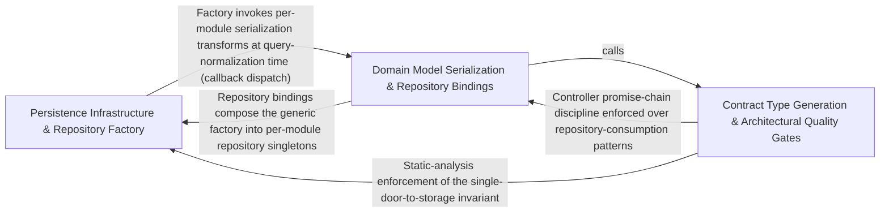

---
tags:
  - 2repo
  - 2repo/arch
  - project/boilerplate-node-backend
type: architecture
component: Type_Generation_Mutation_Testing
---

## Details

The code-generation and quality-gate pipeline that transforms committed contracts into typed artifacts (AsyncAPI → TypeScript types via generate-asyncapi-types, module dependency graph via generate-module-graph), enforces architectural invariants through custom ESLint rules (controller-chain-must-catch, no-persistence-imports), and runs mutation testing (mutation-baseline, run-mutation-diff) to verify test-suite effectiveness.

### Persistence Infrastructure & Repository Factory [[Expand]](./Persistence_Infrastructure_Repository_Factory.md)
The shared persistence primitives that all domain repositories are built from: the createRepository factory (which encapsulates CRUD, pagination, and search), the text-search helper (addTextFilter), and the database-query metrics tracker (trackDatabaseQuery). This sub-component also includes the concrete domain models (e.g., AddressBookDocument, AddressItem) and their repository bindings that consume the factory. It is the primary target of the no-persistence-imports ESLint rule and the mutation-testing baseline — the architectural invariant being enforced is that this layer is the single door to storage, and the quality gates verify that no other layer reaches past it.

**Related Classes/Methods**:

- `src.infrastructure.persistence.create-repository.createRepository`:229-350
- `src.infrastructure.persistence.search.addTextFilter`:125-135
- `src.infrastructure.persistence.metrics.trackDatabaseQuery`:28-38

**Source Files:**

- `src/infrastructure/adapters/demo-outbox.ts`
  - `src.infrastructure.adapters.demo-outbox.DemoOutboxEmail` (L17-L28) - Interface
  - `src.infrastructure.adapters.demo-outbox.recordDemoEmail.lines.filter() callback` (L70-L70) - Function
  - `src.infrastructure.adapters.demo-outbox.recordDemoEmail.lines.map() callback` (L71-L71) - Function
- `src/infrastructure/persistence/create-repository.ts`
  - `src.infrastructure.persistence.create-repository.FindAllOptions` (L34-L41) - Interface
  - `src.infrastructure.persistence.create-repository.SearchSpec` (L51-L72) - Interface
  - `src.infrastructure.persistence.create-repository.PaginatedResult` (L155-L158) - Interface
  - `src.infrastructure.persistence.create-repository.RepositoryOptions` (L161-L166) - Interface
  - `src.infrastructure.persistence.create-repository.createRepository` (L229-L350) - Function
  - `src.infrastructure.persistence.create-repository.createRepository.normalize.transformed.items.map() callback` (L242-L243) - Function
  - `src.infrastructure.persistence.create-repository.createRepository.normalize.transformed` (L242-L244) - Class
  - `src.infrastructure.persistence.create-repository.deleteOne` (L299-L301) - Class
  - `src.infrastructure.persistence.create-repository.createRepository.deleteOne.then() callback` (L301-L301) - Function
  - `src.infrastructure.persistence.create-repository.search` (L312-L332) - Class
  - `src.infrastructure.persistence.create-repository.createRepository.search.then() callback` (L324-L330) - Function
  - `src.infrastructure.persistence.create-repository.createRepository.search.then() callback.then() callback` (L326-L329) - Function
- `src/infrastructure/persistence/metrics.ts`
  - `src.infrastructure.persistence.metrics.trackDatabaseQuery` (L28-L38) - Class
  - `src.infrastructure.persistence.metrics.trackDatabaseQuery.<function>` (L32-L38) - Function
  - `src.infrastructure.persistence.metrics.trackDatabaseQuery.<function>.catch() callback` (L34-L37) - Function
- `src/infrastructure/persistence/search.ts`
  - `src.infrastructure.persistence.search.addTextFilter` (L125-L135) - Class
  - `src.infrastructure.persistence.search.addTextFilter.fields.map() callback` (L132-L134) - Function
- `src/modules/account/model.ts`
  - `src.modules.account.model.AddressItem` (L14-L29) - Interface
  - `src.modules.account.model.AddressBookDocument` (L32-L37) - Interface
- `src/modules/audit-logs/repository.ts`
  - `src.modules.audit-logs.repository.AuditLogSearchFilters` (L17-L25) - Interface
- `src/modules/delivery/model.ts`
  - `src.modules.delivery.model.ShipmentDocument` (L15-L23) - Interface
- `src/modules/delivery/repository.ts`
  - `src.modules.delivery.repository.shipmentRepository` (L19-L82) - Class
  - `src.modules.delivery.repository.shipmentRepository.findByOrderId` (L36-L37) - Method
  - `src.modules.delivery.repository.shipmentRepository.findByOrderIds` (L44-L45) - Method
  - `src.modules.delivery.repository.shipmentRepository.findByOrderIds.orderId.$in.orderIds.map() callback` (L45-L45) - Function
  - `src.modules.delivery.repository.shipmentRepository.upsertForOrder` (L52-L59) - Method
  - `src.modules.delivery.repository.shipmentRepository.findAllShipped` (L62-L62) - Method
  - `src.modules.delivery.repository.shipmentRepository.updateStatusIfIn` (L74-L81) - Method
- `src/modules/inventory/domain/transitions.ts`
  - `src.modules.inventory.domain.transitions.CounterDelta` (L22-L25) - Interface
- `src/modules/inventory/metrics.ts`
  - `src.modules.inventory.metrics._productsLowStockTotal` (L23-L30) - Class
  - `src.modules.inventory.metrics._productsLowStockTotal.collect` (L27-L29) - Method
  - `src.modules.inventory.metrics._inventoryReservedUnitsTotal` (L37-L44) - Class
  - `src.modules.inventory.metrics._inventoryReservedUnitsTotal.collect` (L41-L43) - Method
- `src/modules/inventory/model.ts`
  - `src.modules.inventory.model.StockMovementDocument` (L29-L34) - Interface
  - `src.modules.inventory.model.ReservationItem` (L108-L111) - Interface
  - `src.modules.inventory.model.ReservationDocument` (L121-L128) - Interface
- `src/modules/inventory/repository.ts`
  - `src.modules.inventory.repository.toReservationItems` (L33-L39) - Class
  - `src.modules.inventory.repository.toReservationItems.lines.map() callback` (L36-L39) - Function
  - `src.modules.inventory.repository.reservationRepository` (L60-L143) - Class
  - `src.modules.inventory.repository.reservationRepository.insertHold` (L87-L99) - Method
  - `src.modules.inventory.repository.reservationRepository.insertHold.then() callback` (L95-L95) - Function
  - `src.modules.inventory.repository.reservationRepository.insertHold.catch() callback` (L96-L99) - Function
  - `src.modules.inventory.repository.reservationRepository.findByOrderId` (L107-L108) - Method
  - `src.modules.inventory.repository.reservationRepository.claimStatus` (L119-L127) - Method
  - `src.modules.inventory.repository.reservationRepository.findExpired` (L137-L142) - Method
- `src/modules/inventory/service.ts`
  - `src.modules.inventory.service.isStockBoundToOrder` (L282-L285) - Class
  - `src.modules.inventory.service.isStockBoundToOrder.then() callback` (L285-L285) - Function
- `src/modules/locales/model.ts`
  - `src.modules.locales.model.LocaleDocument` (L27-L30) - Interface
  - `src.modules.locales.model.LocaleMessageDocument` (L33-L37) - Interface
  - `src.modules.locales.model.derivesBaseLanguage` (L117-L119) - Function
- `src/modules/observability/routes.ts`
  - `src.modules.observability.routes.router.get('/metrics') callback` (L35-L45) - Function
  - `src.modules.observability.routes.router.get('/metrics') callback.then() callback` (L37-L40) - Function
  - `src.modules.observability.routes.router.get('/metrics') callback.catch() callback` (L41-L44) - Function
- `src/modules/orders/domain/totals.ts`
  - `src.modules.orders.domain.totals.LineItem` (L21-L25) - Interface
  - `src.modules.orders.domain.totals.LineItemTotals` (L28-L35) - Interface
  - `src.modules.orders.domain.totals.OrderTotalInput` (L59-L66) - Interface
- `src/modules/orders/emails.ts`
  - `src.modules.orders.emails.orderConfirmEmail.data.lines.order.items.map() callback` (L47-L52) - Function
  - `src.modules.orders.emails.invoiceDocument.lines.order.items.map() callback` (L85-L90) - Function
- `src/modules/orders/fixtures.ts`
  - `src.modules.orders.fixtures.makeOrder.items.map() callback` (L94-L97) - Function
- `src/modules/payments/model.ts`
  - `src.modules.payments.model.PaymentDocument` (L18-L37) - Interface
- `src/modules/payments/repository.ts`
  - `src.modules.payments.repository.paymentRepository` (L19-L136) - Class
  - `src.modules.payments.repository.paymentRepository.ownerScope` (L52-L52) - Method
  - `src.modules.payments.repository.paymentRepository.findByIdScoped` (L64-L65) - Method
  - `src.modules.payments.repository.paymentRepository.findByOrderId` (L74-L75) - Method
  - `src.modules.payments.repository.paymentRepository.upsertIntent` (L86-L105) - Method
  - `src.modules.payments.repository.paymentRepository.upsertIntent.catch() callback` (L102-L105) - Function
  - `src.modules.payments.repository.paymentRepository.updateStatusIfIn` (L111-L118) - Method
  - `src.modules.payments.repository.paymentRepository.detachUserId` (L127-L135) - Method
  - `src.modules.payments.repository.paymentRepository.detachUserId.then() callback` (L135-L135) - Function
- `src/modules/payments/service.ts`
  - `src.modules.payments.service.refundForOrder` (L374-L375) - Class
  - `src.modules.payments.service.refundForOrder.then() callback` (L375-L375) - Function
  - `src.modules.payments.service.detachUserId` (L384-L392) - Class
  - `src.modules.payments.service.detachUserId.then() callback` (L385-L392) - Function
- `src/modules/products/demo-catalog.ts`
  - `src.modules.products.demo-catalog.FILLER_IMAGE_ROLE_KEYS` (L19-L22) - Class
  - `src.modules.products.demo-catalog.FILLER_IMAGE_ROLE_KEYS.Array.from() callback` (L21-L21) - Function
  - `src.modules.products.demo-catalog.AnimalLine` (L25-L28) - Interface
  - `src.modules.products.demo-catalog.ProductType` (L40-L47) - Interface
  - `src.modules.products.demo-catalog.Tier` (L95-L101) - Interface
  - `src.modules.products.demo-catalog.FillerProduct` (L125-L134) - Interface
- `src/modules/products/demo.ts`
  - `src.modules.products.demo.fillerProductRows` (L147-L155) - Class
  - `src.modules.products.demo.fillerProductRows.FILLER_PRODUCTS.map() callback` (L147-L155) - Function
- `src/modules/products/model.ts`
  - `src.modules.products.model.ProductSnapshot` (L24-L33) - Interface
  - `src.modules.products.model.ProductDocument` (L38-L45) - Interface
- `src/modules/products/repository.ts`
  - `src.modules.products.repository.AvailabilityRow` (L20-L26) - Interface
  - `src.modules.products.repository.productRepository` (L41-L369) - Class
  - `src.modules.products.repository.productRepository.publicScope` (L81-L81) - Method
  - `src.modules.products.repository.productRepository.findByIdScoped` (L95-L96) - Method
  - `src.modules.products.repository.productRepository.findPublicById` (L105-L106) - Method
  - `src.modules.products.repository.productRepository.facets` (L115-L143) - Method
  - `src.modules.products.repository.productRepository.facets.then() callback` (L137-L143) - Function
  - `src.modules.products.repository.productRepository.facets.then() callback.categories.map() callback` (L138-L141) - Function
  - `src.modules.products.repository.productRepository.facets.then() callback.tags.map() callback` (L142-L142) - Function
  - `src.modules.products.repository.productRepository.reserveUnits` (L166-L177) - Method
  - `src.modules.products.repository.productRepository.reserveUnits.then() callback` (L177-L177) - Function
  - `src.modules.products.repository.productRepository.commitUnits` (L189-L201) - Method
  - `src.modules.products.repository.productRepository.commitUnits.then() callback` (L201-L201) - Function
  - `src.modules.products.repository.productRepository.releaseUnits` (L213-L221) - Method
  - `src.modules.products.repository.productRepository.releaseUnits.then() callback` (L221-L221) - Function
  - `src.modules.products.repository.productRepository.receiveUnits` (L230-L238) - Method
  - `src.modules.products.repository.productRepository.receiveUnits.then() callback` (L238-L238) - Function
  - `src.modules.products.repository.productRepository.adjustUnits` (L251-L262) - Method
  - `src.modules.products.repository.productRepository.adjustUnits.then() callback` (L262-L262) - Function
  - `src.modules.products.repository.productRepository.countLowAvailability` (L271-L277) - Method
  - `src.modules.products.repository.productRepository.sumReserved` (L286-L289) - Method
  - `src.modules.products.repository.productRepository.sumReserved.then() callback` (L289-L289) - Function
  - `src.modules.products.repository.productRepository.availabilityPage` (L303-L347) - Method
  - `src.modules.products.repository.productRepository.availabilityPage.then() callback` (L344-L347) - Function
  - `src.modules.products.repository.productRepository.writebackImage` (L357-L368) - Method
  - `src.modules.products.repository.productRepository.writebackImage.then() callback` (L368-L368) - Function
- `src/modules/wishlist/model.ts`
  - `src.modules.wishlist.model.WishlistItem` (L22-L24) - Interface
  - `src.modules.wishlist.model.WishlistDocument` (L32-L37) - Interface
- `src/modules/wishlist/repository.ts`
  - `src.modules.wishlist.repository.wishlistRepository` (L31-L112) - Class
  - `src.modules.wishlist.repository.wishlistRepository.findByUserId` (L46-L47) - Method
  - `src.modules.wishlist.repository.wishlistRepository.addLine` (L67-L74) - Method
  - `src.modules.wishlist.repository.wishlistRepository.removeLine` (L81-L88) - Method
  - `src.modules.wishlist.repository.wishlistRepository.deleteByUserId` (L94-L100) - Method
  - `src.modules.wishlist.repository.wishlistRepository.deleteByUserId.then() callback` (L98-L100) - Function
  - `src.modules.wishlist.repository.wishlistRepository.removeProductFromAll` (L105-L111) - Method
- `src/modules/wishlist/service.ts`
  - `src.modules.wishlist.service.wishlistGet` (L39-L40) - Class
  - `src.modules.wishlist.service.wishlistGet.then() callback` (L40-L40) - Function
  - `src.modules.wishlist.service.wishlistMoveToCart.then() callback.saved` (L108-L108) - Class
  - `src.modules.wishlist.service.wishlistMoveToCart.then() callback.saved.wishlist.items.some() callback` (L108-L108) - Function

### Domain Model Serialization & Repository Bindings [[Expand]](./Domain_Model_Serialization_Repository_Bindings.md)
The per-module serialization pipeline and concrete repository/model bindings that sit between the persistence factory and the business services. This includes the applySerialization / transform pipeline (which maps Mongoose documents to plain-data DTOs with lean/hydrated control), the SerializableSchema contract, and the domain-specific model documents (OrderDocument, OrderDocumentItem) and repository instances (cartRepository, addressBookRepository, applyAuditLogTransform). This sub-component is the second target of the no-persistence-imports rule: the rule ensures that services and controllers consume the serialized plain data returned by these repositories rather than reaching into the raw Mongoose documents. Mutation testing validates that the serialization transforms are covered by the test suite.

**Related Classes/Methods**:

- `src.infrastructure.persistence.serialize.applySerialization`:50-82
- `src.modules.cart.repository.cartRepository`:75-180
- `src.modules.audit-logs.model.applyAuditLogTransform`:166-173

**Source Files:**

- `src/infrastructure/persistence/create-repository.ts`
  - `src.infrastructure.persistence.create-repository.Repository` (L175-L220) - Interface
  - `src.infrastructure.persistence.create-repository.createRepository.buildWhere` (L348-L348) - Method
- `src/infrastructure/persistence/serialize.ts`
  - `src.infrastructure.persistence.serialize.SerializeOptions` (L16-L30) - Interface
  - `src.infrastructure.persistence.serialize.SerializableSchema` (L39-L41) - Interface
  - `src.infrastructure.persistence.serialize.applySerialization` (L50-L82) - Class
  - `src.infrastructure.persistence.serialize.transform` (L55-L69) - Class
  - `src.infrastructure.persistence.serialize.applySerialization.transform.toString` (L58-L58) - Method
  - `src.infrastructure.persistence.serialize.applySerialization.transform` (L78-L78) - Method
- `src/modules/account/repository.ts`
  - `src.modules.account.repository.addressBookRepository` (L27-L119) - Class
  - `src.modules.account.repository.addressBookRepository.findByUserId` (L46-L47) - Method
  - `src.modules.account.repository.addressBookRepository.addEntry` (L56-L66) - Method
  - `src.modules.account.repository.addressBookRepository.updateEntry` (L74-L92) - Method
  - `src.modules.account.repository.addressBookRepository.removeEntry` (L98-L107) - Method
  - `src.modules.account.repository.addressBookRepository.removeEntry.book.items.filter() callback` (L103-L103) - Function
  - `src.modules.account.repository.addressBookRepository.deleteByUserId` (L112-L118) - Method
  - `src.modules.account.repository.addressBookRepository.deleteByUserId.then() callback` (L116-L118) - Function
- `src/modules/account/services/addresses.ts`
  - `src.modules.account.services.addresses.addressForCheckout` (L84-L92) - Class
  - `src.modules.account.services.addresses.addressForCheckout.then() callback` (L88-L92) - Function
  - `src.modules.account.services.addresses.addressForCheckout.then() callback.book.items.find() callback` (L91-L91) - Function
- `src/modules/audit-logs/model.ts`
  - `src.modules.audit-logs.model.applyAuditLogTransform` (L166-L173) - Class
  - `src.modules.audit-logs.model.applyAuditLogTransform.after` (L169-L172) - Method
- `src/modules/cart/domain/rules.ts`
  - `src.modules.cart.domain.rules.CartLineCandidate` (L8-L19) - Interface
  - `src.modules.cart.domain.rules.CheckoutShortfall` (L22-L27) - Interface
  - `src.modules.cart.domain.rules.evaluateCheckout` (L65-L84) - Class
  - `src.modules.cart.domain.rules.evaluateCheckout.lines.some() callback` (L67-L67) - Function
  - `src.modules.cart.domain.rules.shortfalls` (L73-L80) - Class
  - `src.modules.cart.domain.rules.evaluateCheckout.shortfalls.lines.filter() callback` (L74-L74) - Function
  - `src.modules.cart.domain.rules.evaluateCheckout.shortfalls.map() callback` (L75-L80) - Function
- `src/modules/cart/repository.ts`
  - `src.modules.cart.repository.cartRepository` (L75-L180) - Class
  - `src.modules.cart.repository.cartRepository.findByUserId` (L97-L97) - Method
  - `src.modules.cart.repository.cartRepository.removeLine` (L108-L115) - Method
  - `src.modules.cart.repository.cartRepository.clearLines` (L121-L128) - Method
  - `src.modules.cart.repository.cartRepository.clearLinesIfUnchanged` (L146-L154) - Method
  - `src.modules.cart.repository.cartRepository.deleteByUserId` (L162-L168) - Method
  - `src.modules.cart.repository.cartRepository.deleteByUserId.then() callback` (L166-L168) - Function
  - `src.modules.cart.repository.cartRepository.removeProductFromAll` (L173-L179) - Method
- `src/modules/cart/services/checkout.ts`
  - `src.modules.cart.services.checkout.toStockLines` (L46-L47) - Class
  - `src.modules.cart.services.checkout.toStockLines.lines.map() callback` (L47-L47) - Function
  - `src.modules.cart.services.checkout.runCheckout` (L78-L234) - Class
  - `src.modules.cart.services.checkout.runCheckout.orderItems` (L167-L170) - Class
  - `src.modules.cart.services.checkout.runCheckout.orderItems.joined.map() callback` (L167-L170) - Function
- `src/modules/cart/services/cleanup.ts`
  - `src.modules.cart.services.cleanup.productRemoveFromCartsById` (L32-L44) - Class
  - `src.modules.cart.services.cleanup.productRemoveFromCartsById.then() callback` (L37-L42) - Function
  - `src.modules.cart.services.cleanup.productRemoveFromCartsById.catch() callback` (L44-L44) - Function
- `src/modules/cart/services/items.ts`
  - `src.modules.cart.services.items.cartGet` (L30-L31) - Class
  - `src.modules.cart.services.items.cartGet.then() callback` (L31-L31) - Function
  - `src.modules.cart.services.items.cartViewOf` (L39-L40) - Class
  - `src.modules.cart.services.items.cartViewOf.then() callback` (L40-L40) - Function
  - `src.modules.cart.services.items.cartRemove` (L179-L189) - Class
  - `src.modules.cart.services.items.cartRemove.then() callback` (L180-L188) - Function
  - `src.modules.cart.services.items.cartRemove.then() callback.then() callback` (L181-L188) - Function
- `src/modules/cart/services/reorder.ts`
  - `src.modules.cart.services.reorder.reorderIntoCart.then() callback.requested` (L64-L70) - Class
  - `src.modules.cart.services.reorder.reorderIntoCart.then() callback.requested.order.items.map() callback` (L64-L70) - Function
  - `src.modules.cart.services.reorder.reorderIntoCart.then() callback.requested.map() callback` (L74-L77) - Function
  - `src.modules.cart.services.reorder.reorderIntoCart.then() callback.requested.map() callback.then() callback` (L77-L77) - Function
- `src/modules/cart/services/view.ts`
  - `src.modules.cart.services.view.CartView` (L37-L40) - Interface
  - `src.modules.cart.services.view.PopulatedCart` (L49-L51) - Interface
  - `src.modules.cart.services.view.readCartLines` (L62-L75) - Class
  - `src.modules.cart.services.view.readCartLines.productIds` (L65-L65) - Class
  - `src.modules.cart.services.view.readCartLines.productIds.cart.items.map() callback` (L65-L65) - Function
  - `src.modules.cart.services.view.readCartLines.then() callback` (L68-L73) - Function
  - `src.modules.cart.services.view.readCartLines.then() callback.items.map() callback` (L69-L73) - Function
  - `src.modules.cart.services.view.toCartView` (L83-L97) - Class
  - `src.modules.cart.services.view.toCartView.then() callback` (L84-L97) - Function
  - `src.modules.cart.services.view.toCartView.then() callback.items.lines.map() callback` (L87-L90) - Function
- `src/modules/delivery/domain/rates.ts`
  - `src.modules.delivery.domain.rates.findShippingMethod` (L22-L23) - Class
  - `src.modules.delivery.domain.rates.findShippingMethod.SHIPPING_METHODS.find() callback` (L23-L23) - Function
- `src/modules/locales/services/entries.ts`
  - `src.modules.locales.services.entries.importEntries.survivors` (L225-L225) - Class
  - `src.modules.locales.services.entries.importEntries.survivors.stored.filter() callback` (L225-L225) - Function
- `src/modules/orders/demo.ts`
  - `src.modules.orders.demo.smallCustomerOrders` (L154-L171) - Class
  - `src.modules.orders.demo.smallCustomerOrders.map() callback` (L164-L170) - Function
  - `src.modules.orders.demo.mediumCustomerOrders.MEDIUM_ORDERS.map() callback` (L231-L239) - Function
  - `src.modules.orders.demo.mediumCustomerOrders` (L231-L240) - Class
  - `src.modules.orders.demo.mediumCustomerOrders.MEDIUM_ORDERS.map() callback.items.lines.map() callback` (L236-L237) - Function
- `src/modules/orders/model.ts`
  - `src.modules.orders.model.OrderDocumentItem` (L25-L35) - Interface
  - `src.modules.orders.model.OrderDocument` (L43-L77) - Interface
  - `src.modules.orders.model.applyOrderTransform` (L236-L244) - Class
  - `src.modules.orders.model.applyOrderTransform.after` (L240-L243) - Method
- `src/modules/orders/repository.ts`
  - `src.modules.orders.repository.search` (L55-L83) - Class
  - `src.modules.orders.repository.search.then() callback` (L70-L81) - Function
  - `src.modules.orders.repository.search.then() callback.then() callback` (L77-L80) - Function
  - `src.modules.orders.repository.findByIdScoped` (L95-L107) - Class
  - `src.modules.orders.repository.findByIdScoped.then() callback` (L102-L105) - Function
  - `src.modules.orders.repository.detachUserId` (L165-L173) - Class
  - `src.modules.orders.repository.detachUserId.then() callback` (L173-L173) - Function
- `src/modules/orders/service.ts`
  - `src.modules.orders.service.retractOrder` (L122-L142) - Class
  - `src.modules.orders.service.retractOrder.report` (L127-L133) - Class
  - `src.modules.orders.service.retractOrder.report.<function>` (L127-L133) - Function
  - `src.modules.orders.service.retractOrder.then() callback` (L140-L140) - Function
  - `src.modules.orders.service.create.outcome` (L195-L201) - Class
  - `src.modules.orders.service.create.outcome.resolvedItems.map() callback` (L197-L200) - Function

### Contract Type Generation & Architectural Quality Gates [[Expand]](./Contract_Type_Generation_Architectural_Quality_Gates.md)
The code-generation and quality-gate pipeline itself. It comprises three functional pillars: (a) Type generation — generate-asyncapi-types parses asyncapi.yaml and emits src/types/asyncapi.generated.ts (payload interfaces, channel constants, SSE event maps) with a --check mode that fails CI on drift; generate-module-graph runs dependency-cruiser over src/modules and writes Mermaid diagrams into docs/modules/index.md and per-module pages, also with --check for divergence detection. (b) Architectural invariant enforcement — custom ESLint rules controllerChainMustCatch (promise chains in controllers must end in .catch()) and noPersistenceImports (persistence handles and schema files stay behind the repository) encode the layering contract as machine-checkable rules. (c) Mutation testing — mutation-baseline records the current mutation score, and run-mutation-diff compares against the baseline to gate PRs on test-suite effectiveness. This sub-component is the active enforcement layer that validates Groups 1 and 2.

**Related Classes/Methods**:

- `eslint.rules.controller-chain-must-catch.controllerChainMustCatch`:83-111
- `scripts.run-mutation-diff.baseArgument`

**Source Files:**

- `eslint/rules/controller-chain-must-catch.ts`
  - `eslint.rules.controller-chain-must-catch.controllerChainMustCatch` (L83-L111) - Class
  - `eslint.rules.controller-chain-must-catch.controllerChainMustCatch.create` (L94-L110) - Method
  - `eslint.rules.controller-chain-must-catch.controllerChainMustCatch.create.CallExpression` (L96-L108) - Method
- `eslint/rules/no-persistence-imports.ts`
  - `eslint.rules.no-persistence-imports.noPersistenceImports.create.ImportDeclaration.name.find() callback` (L109-L110) - Function
  - `eslint.rules.no-persistence-imports.noPersistenceImports.create.ImportDeclaration.name` (L109-L111) - Class
  - `eslint.rules.no-persistence-imports.noPersistenceImports.create.ImportDeclaration.name.find() callback.bindings.some() callback` (L110-L110) - Function
- `scripts/contracts/client-collections-bundle.ts`
  - `scripts.contracts.client-collections-bundle.allProbes` (L260-L261) - Class
  - `scripts.contracts.client-collections-bundle.allProbes.requests.filter() callback` (L261-L261) - Function
  - `scripts.contracts.client-collections-bundle.contentFor` (L264-L269) - Class
  - `scripts.contracts.client-collections-bundle.contentFor.<function>` (L264-L269) - Function
- `scripts/contracts/openapi-bundle.ts`
  - `scripts.contracts.openapi-bundle.assertModuleSectionsAreCurrent.stale` (L83-L83) - Class
  - `scripts.contracts.openapi-bundle.assertModuleSectionsAreCurrent.stale.filter() callback` (L83-L83) - Function
- `scripts/generate-asyncapi-types.ts`
  - `scripts.generate-asyncapi-types.AsyncApiOperation` (L27-L31) - Interface
  - `scripts.generate-asyncapi-types.AsyncApiChannel` (L33-L35) - Interface
  - `scripts.generate-asyncapi-types.AsyncApiMessage` (L37-L39) - Interface
  - `scripts.generate-asyncapi-types.JsonSchema` (L41-L52) - Interface
  - `scripts.generate-asyncapi-types.AsyncApiDocument` (L54-L59) - Interface
  - `scripts.generate-asyncapi-types.renderLiteralArray.lines` (L173-L173) - Class
  - `scripts.generate-asyncapi-types.renderLiteralArray.lines.values.map() callback` (L173-L173) - Function
  - `scripts.generate-asyncapi-types.renderChannelNamespace.entries` (L223-L225) - Class
  - `scripts.generate-asyncapi-types.renderChannelNamespace.entries.channelNames.map() callback` (L224-L224) - Function
  - `scripts.generate-asyncapi-types.buildOutput.sections` (L313-L336) - Class
  - `scripts.generate-asyncapi-types.buildOutput.sections.sseEntries.map() callback` (L330-L330) - Function
  - `scripts.generate-asyncapi-types.then() callback` (L346-L371) - Function
  - `scripts.generate-asyncapi-types.then() callback.modelBlocks` (L347-L350) - Class
  - `scripts.generate-asyncapi-types.then() callback.modelBlocks.models.map() callback` (L348-L349) - Function
  - `scripts.generate-asyncapi-types.catch() callback` (L372-L375) - Function
- `scripts/generate-module-graph.ts`
  - `scripts.generate-module-graph.renderNeighbourhood.listens` (L167-L167) - Class
  - `scripts.generate-module-graph.renderNeighbourhood.listens.events.filter() callback` (L167-L167) - Function
  - `scripts.generate-module-graph.renderNeighbourhood.neighbours` (L169-L176) - Class
  - `scripts.generate-module-graph.renderNeighbourhood.neighbours.announces.map() callback` (L173-L173) - Function
  - `scripts.generate-module-graph.renderNeighbourhood.neighbours.listens.map() callback` (L174-L174) - Function
  - `scripts.generate-module-graph.renderNeighbourhood.neighbours.map() callback` (L195-L195) - Function
  - `scripts.generate-module-graph.renderNeighbourhood.listens.map() callback` (L199-L199) - Function
- `scripts/mutation-baseline.ts`
  - `scripts.mutation-baseline.scoresFromReport.scored` (L103-L103) - Class
  - `scripts.mutation-baseline.scoresFromReport.scored.mutants.filter() callback` (L103-L103) - Function
  - `scripts.mutation-baseline.formatRegressions.lines` (L220-L223) - Class
  - `scripts.mutation-baseline.formatRegressions.lines.regressed.map() callback` (L221-L222) - Function
- `scripts/reap-inactive-accounts.ts`
  - `scripts.reap-inactive-accounts.warn` (L81-L93) - Class
  - `scripts.reap-inactive-accounts.warn.then() callback` (L88-L91) - Function
  - `scripts.reap-inactive-accounts.warn.then() callback.then() callback` (L90-L90) - Function
- `scripts/run-mutation-diff.ts`
  - `scripts.run-mutation-diff.baseArgument` (L51-L51) - Class
  - `scripts.run-mutation-diff.baseArgument.process.argv.find() callback` (L51-L51) - Function
- `scripts/spec-identity.ts`
  - `scripts.spec-identity.formatSharedFileProblems.lines` (L184-L200) - Class
  - `scripts.spec-identity.formatSharedFileProblems.lines.problems.map() callback` (L184-L200) - Function
- `scripts/sync-shared-files-to-frontend.ts`
  - `scripts.sync-shared-files-to-frontend.Outcome` (L74-L78) - Interface
  - `scripts.sync-shared-files-to-frontend.of` (L99-L99) - Class
  - `scripts.sync-shared-files-to-frontend.of.outcomes.filter() callback` (L99-L99) - Function
- `src/app/demo.ts`
  - `src.app.demo.runDemoSeed` (L25-L34) - Class
  - `src.app.demo.runDemoSeed.then() callback.enabledModules.map() callback` (L29-L29) - Function
  - `src.app.demo.runDemoSeed.then() callback` (L32-L34) - Function
  - `src.app.demo.installDemo` (L37-L50) - Class
  - `src.app.demo.installDemo.app.post('/__demo/reset') callback` (L38-L45) - Function
  - `src.app.demo.installDemo.app.post('/__demo/reset') callback.then() callback` (L40-L40) - Function
  - `src.app.demo.installDemo.app.post('/__demo/reset') callback.catch() callback` (L41-L44) - Function
  - `src.app.demo.installDemo.app.get('/__demo/emails') callback` (L47-L49) - Function
- `src/infrastructure/adapters/email.worker.ts`
  - `src.infrastructure.adapters.email.worker.handleEmailJob` (L26-L48) - Class
  - `src.infrastructure.adapters.email.worker.handleEmailJob.then() callback` (L41-L41) - Function
  - `src.infrastructure.adapters.email.worker.handleEmailJob.catch() callback` (L42-L47) - Function
- `src/infrastructure/adapters/logger.ts`
  - `src.infrastructure.adapters.logger.redactSensitiveFields` (L108-L134) - Class
  - `src.infrastructure.adapters.logger.redactSensitiveFields.input.map() callback` (L111-L111) - Function
  - `src.infrastructure.adapters.logger.redactFormat` (L166-L181) - Class
  - `src.infrastructure.adapters.logger.redactFormat.winston.format() callback` (L166-L181) - Function
  - `src.infrastructure.adapters.logger.prettyFormat` (L216-L229) - Class
  - `src.infrastructure.adapters.logger.prettyFormat.winston.format.printf() callback` (L222-L228) - Function
- `src/infrastructure/adapters/mailer.ts`
  - `src.infrastructure.adapters.mailer.nodemailer` (L141-L201) - Class
  - `src.infrastructure.adapters.mailer.nodemailer.withSpan('email.send') callback` (L153-L200) - Function
  - `src.infrastructure.adapters.mailer.nodemailer.withSpan('email.send') callback.then() callback` (L191-L196) - Function
  - `src.infrastructure.adapters.mailer.enqueueEmail` (L257-L287) - Class
  - `src.infrastructure.adapters.mailer.enqueueEmail.then() callback` (L275-L286) - Function
  - `src.infrastructure.adapters.mailer.enqueueEmail.then() callback.then() callback` (L278-L278) - Function
- `src/infrastructure/adapters/storage.ts`
  - `src.infrastructure.adapters.storage.quarantineUploadedImages.then() callback.failed` (L293-L293) - Class
  - `src.infrastructure.adapters.storage.quarantineUploadedImages.then() callback.failed.results.find() callback` (L293-L293) - Function
- `src/infrastructure/i18n/negotiate.ts`
  - `src.infrastructure.i18n.negotiate.negotiateLocale.lowercaseSupported` (L31-L31) - Class
  - `src.infrastructure.i18n.negotiate.negotiateLocale.lowercaseSupported.supported.map() callback` (L31-L31) - Function
- `src/infrastructure/observability/metrics-http.ts`
  - `src.infrastructure.observability.metrics-http._heapSizeLimitGauge` (L52-L59) - Class
  - `src.infrastructure.observability.metrics-http._heapSizeLimitGauge.collect` (L56-L58) - Method
  - `src.infrastructure.observability.metrics-http.RequestMetricInput` (L141-L147) - Interface
  - `src.infrastructure.observability.metrics-http.LatencyBucket` (L194-L198) - Interface
  - `src.infrastructure.observability.metrics-http.aggregateLatencyBuckets.buckets.toSorted() callback` (L237-L237) - Function
  - `src.infrastructure.observability.metrics-http.aggregateLatencyBuckets.buckets.map() callback` (L238-L238) - Function
- `src/infrastructure/observability/tracer.ts`
  - `src.infrastructure.observability.tracer.withSpan` (L32-L74) - Class
  - `src.infrastructure.observability.tracer.withSpan.tracer.startActiveSpan() callback` (L41-L73) - Function
  - `src.infrastructure.observability.tracer.withSpan.tracer.startActiveSpan() callback.then() callback` (L57-L71) - Function
- `src/kernel/registry.ts`
  - `src.kernel.registry.RequiredConfig` (L62-L69) - Interface
  - `src.kernel.registry.ImageTarget` (L80-L98) - Interface
  - `src.kernel.registry.assertRequiredConfig.offending` (L198-L204) - Class
  - `src.kernel.registry.assertRequiredConfig.offending.appModules.flatMap() callback` (L199-L199) - Function
  - `src.kernel.registry.assertRequiredConfig.offending.filter() callback` (L200-L203) - Function
  - `src.kernel.registry.assertRequiredConfig.offending.map() callback` (L204-L204) - Function
- `src/modules/account/services/authentication.ts`
  - `src.modules.account.services.authentication.requestAccountDeletion` (L64-L90) - Class
  - `src.modules.account.services.authentication.requestAccountDeletion.then() callback` (L65-L90) - Function
  - `src.modules.account.services.authentication.requestPasswordReset` (L120-L153) - Class
  - `src.modules.account.services.authentication.requestPasswordReset.then() callback` (L127-L152) - Function
  - `src.modules.account.services.authentication.requestPasswordReset.then() callback.then() callback` (L131-L150) - Function
  - `src.modules.account.services.authentication.requestAccountSetup` (L161-L171) - Class
  - `src.modules.account.services.authentication.requestAccountSetup.then() callback` (L162-L171) - Function
- `src/modules/account/services/verification.ts`
  - `src.modules.account.services.verification.sendVerificationEmail` (L39-L61) - Class
  - `src.modules.account.services.verification.sendVerificationEmail.then() callback` (L43-L61) - Function
- `src/modules/audit-logs/service.ts`
  - `src.modules.audit-logs.service.record` (L32-L42) - Class
  - `src.modules.audit-logs.service.record.catch() callback` (L33-L41) - Function
- `src/modules/feedback/service.ts`
  - `src.modules.feedback.service.create` (L79-L126) - Class
  - `src.modules.feedback.service.create.then() callback` (L90-L125) - Function
  - `src.modules.feedback.service.create.then() callback.catch() callback` (L117-L121) - Function
- `src/modules/locales/repository.ts`
  - `src.modules.locales.repository.listKeys` (L134-L142) - Class
  - `src.modules.locales.repository.listKeys.rows.map() callback` (L141-L141) - Function
  - `src.modules.locales.repository.importEntries` (L196-L231) - Class
  - `src.modules.locales.repository.importEntries.map() callback` (L209-L215) - Function
  - `src.modules.locales.repository.importEntries.created` (L221-L221) - Class
  - `src.modules.locales.repository.importEntries.created.filter() callback` (L221-L221) - Function
- `src/modules/locales/services/entries.ts`
  - `src.modules.locales.services.entries.importEntries.inputs` (L201-L201) - Class
  - `src.modules.locales.services.entries.importEntries.inputs.entries.map() callback` (L201-L201) - Function
