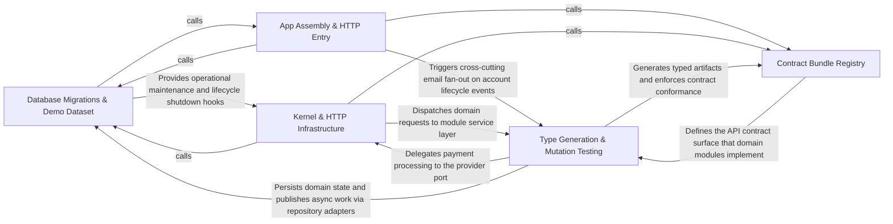

---
tags:
  - 2repo
  - 2repo/arch
  - project/boilerplate-node-backend
type: architecture
component: overview
---

## Details

This is a contract-first, modular REST API boilerplate for an e-commerce backend. The dominant flow is: Contract fragments (per-module openapi.yaml / asyncapi.yaml) are assembled by the Contract Bundle Registry (Group 5) into committed bundles; those bundles feed the Type Generation & Mutation Testing pipeline (Group 4) which emits api/ (typed client + Zod schemas) and src/types/asyncapi.generated.ts; the App Assembly & HTTP Entry layer (Group 2) wires routes, security, telemetry, and error handling around the 13 domain modules; the Kernel & HTTP Infrastructure (Group 3) provides the domain-agnostic primitives (auth resolver port, domain-event bus, module registry, cluster runtime, HTTP request/response/middleware); and the Database Migrations & Demo Dataset layer (Group 1) owns schema evolution, seed data, and maintenance scripts (reap-orders, reap-quarantine, export-demo-dataset). The architecture enforces a strict dependency direction: Contract → Entry → Business modules → Persistence → Storage, with the kernel and infrastructure as domain-agnostic platform layers.

### Database Migrations & Demo Dataset [[Expand]](./Database_Migrations_Demo_Dataset.md)
Owns the MongoDB schema evolution (timestamped migration files), the demo dataset assembly pipeline (seed → serialize → export), and operational maintenance scripts (reap-orders, reap-quarantine, reap-inactive-accounts, generate-seed-images, cache-clear) that keep the database healthy and the demo profile reproducible.

**Related Classes/Methods**:

- `scripts.export-demo-dataset.run`:34-71
- `scripts.reap-orders.main`:24-27

**Source Files:**

- `db/cache-clear.ts`
  - `db.cache-clear.runScript() callback` (L41-L41) - Function
- `db/demo/assemble.ts`
  - `db.demo.assemble.sortKeys` (L74-L82) - Class
  - `db.demo.assemble.sortKeys.value.map() callback` (L75-L75) - Function
  - `db.demo.assemble.sortKeys.toSorted() callback` (L79-L79) - Function
  - `db.demo.assemble.sortKeys.map() callback` (L80-L80) - Function
  - `db.demo.assemble.reconcileShapes.unlabelled` (L147-L147) - Class
  - `db.demo.assemble.reconcileShapes.unlabelled.filter() callback` (L147-L147) - Function
  - `db.demo.assemble.reconcileShapes.orphaned` (L148-L148) - Class
  - `db.demo.assemble.reconcileShapes.orphaned.filter() callback` (L148-L148) - Function
  - `db.demo.assemble.reconcileShapes.problems` (L150-L158) - Class
  - `db.demo.assemble.reconcileShapes.problems.unlabelled.map() callback` (L152-L153) - Function
  - `db.demo.assemble.reconcileShapes.problems.orphaned.map() callback` (L156-L156) - Function
  - `db.demo.assemble.assembleDemoDataset` (L167-L206) - Class
  - `db.demo.assemble.assembleDemoDataset.sections` (L168-L170) - Class
  - `db.demo.assemble.assembleDemoDataset.sections.enabledModules.map() callback` (L169-L169) - Function
  - `db.demo.assemble.assembleDemoDataset.shapes` (L186-L189) - Class
  - `db.demo.assemble.assembleDemoDataset.shapes.enabledModules.map() callback` (L188-L188) - Function
  - `db.demo.assemble.assembleDemoDataset.dangling.map() callback` (L202-L202) - Function
- `db/demo/index.ts`
  - `db.demo.index.seed` (L38-L92) - Function
  - `db.demo.index.seed.perModule` (L62-L64) - Class
  - `db.demo.index.seed.perModule.enabledModules.map() callback` (L63-L63) - Function
  - `db.demo.index.seed.created` (L67-L67) - Class
  - `db.demo.index.seed.created.results.filter() callback` (L67-L67) - Function
  - `db.demo.index.runScript() callback` (L100-L100) - Function
- `db/migrations/20240101000000-initial-indexes.js`
  - `db.migrations.20240101000000-initial-indexes.<unknown>` (L27-L81) - Class
  - `db.migrations.20240101000000-initial-indexes.<unknown>.up` (L28-L59) - Method
  - `db.migrations.20240101000000-initial-indexes.<unknown>.down` (L61-L80) - Method
- `db/migrations/20260806120000-user-locale.js`
  - `db.migrations.20260806120000-user-locale.<unknown>` (L19-L34) - Class
  - `db.migrations.20260806120000-user-locale.<unknown>.up` (L20-L24) - Method
  - `db.migrations.20260806120000-user-locale.<unknown>.down` (L26-L33) - Method
- `db/migrations/20260806140000-image-url-separators.js`
  - `db.migrations.20260806140000-image-url-separators.<unknown>` (L84-L129) - Class
  - `db.migrations.20260806140000-image-url-separators.<unknown>.up` (L85-L116) - Method
  - `db.migrations.20260806140000-image-url-separators.<unknown>.down` (L118-L128) - Method
- `db/migrations/20260808120000-user-active-column.js`
  - `db.migrations.20260808120000-user-active-column.<unknown>` (L16-L30) - Class
  - `db.migrations.20260808120000-user-active-column.<unknown>.up` (L17-L21) - Method
  - `db.migrations.20260808120000-user-active-column.<unknown>.down` (L23-L29) - Method
- `db/migrations/20260808160000-cart-collection.js`
  - `db.migrations.20260808160000-cart-collection.<unknown>` (L24-L99) - Class
  - `db.migrations.20260808160000-cart-collection.<unknown>.up` (L25-L58) - Method
  - `db.migrations.20260808160000-cart-collection.<unknown>.up.updateOne.update.$set.items.user.cart.items.map() callback` (L38-L41) - Function
  - `db.migrations.20260808160000-cart-collection.<unknown>.down` (L60-L98) - Method
  - `db.migrations.20260808160000-cart-collection.<unknown>.down.updateOne.update.$set.cart.items.cart.items.map() callback` (L74-L77) - Function
  - `db.migrations.20260808160000-cart-collection.<unknown>.down.catch() callback` (L95-L97) - Function
- `db/migrations/20260808180000-prune-unused-indexes.js`
  - `db.migrations.20260808180000-prune-unused-indexes.<unknown>` (L34-L55) - Class
  - `db.migrations.20260808180000-prune-unused-indexes.<unknown>.up` (L35-L43) - Method
  - `db.migrations.20260808180000-prune-unused-indexes.<unknown>.down` (L45-L54) - Method
- `db/migrations/20260808200000-users-email-unique.js`
  - `db.migrations.20260808200000-users-email-unique.<unknown>` (L47-L98) - Class
  - `db.migrations.20260808200000-users-email-unique.<unknown>.up` (L48-L79) - Method
  - `db.migrations.20260808200000-users-email-unique.<unknown>.up.report` (L52-L54) - Class
  - `db.migrations.20260808200000-users-email-unique.<unknown>.up.report.duplicates.map() callback` (L53-L53) - Function
  - `db.migrations.20260808200000-users-email-unique.<unknown>.down` (L81-L97) - Method
- `db/migrations/20260810120000-orders-soft-delete.js`
  - `db.migrations.20260810120000-orders-soft-delete.<unknown>` (L16-L42) - Class
  - `db.migrations.20260810120000-orders-soft-delete.<unknown>.up` (L17-L21) - Method
  - `db.migrations.20260810120000-orders-soft-delete.<unknown>.down` (L23-L41) - Method
- `db/migrations/20260813090000-user-verified-column.js`
  - `db.migrations.20260813090000-user-verified-column.<unknown>` (L15-L29) - Class
  - `db.migrations.20260813090000-user-verified-column.<unknown>.up` (L16-L20) - Method
  - `db.migrations.20260813090000-user-verified-column.<unknown>.down` (L22-L28) - Method
- `db/migrations/20260813091000-product-stock-column.js`
  - `db.migrations.20260813091000-product-stock-column.<unknown>` (L14-L28) - Class
  - `db.migrations.20260813091000-product-stock-column.<unknown>.up` (L15-L19) - Method
  - `db.migrations.20260813091000-product-stock-column.<unknown>.down` (L21-L27) - Method
- `db/migrations/20260817120000-inventory-counters.js`
  - `db.migrations.20260817120000-inventory-counters.<unknown>` (L30-L89) - Class
  - `db.migrations.20260817120000-inventory-counters.<unknown>.up` (L31-L73) - Method
  - `db.migrations.20260817120000-inventory-counters.<unknown>.up.catch() callback` (L70-L72) - Function
  - `db.migrations.20260817120000-inventory-counters.<unknown>.down` (L75-L88) - Method
- `db/migrations/20260817140000-locale-collections.js`
  - `db.migrations.20260817140000-locale-collections.<unknown>` (L31-L67) - Class
  - `db.migrations.20260817140000-locale-collections.<unknown>.up` (L32-L43) - Method
  - `db.migrations.20260817140000-locale-collections.<unknown>.down` (L45-L66) - Method
- `db/migrations/20260818120000-locale-entry-scope.js`
  - `db.migrations.20260818120000-locale-entry-scope.<unknown>` (L21-L68) - Class
  - `db.migrations.20260818120000-locale-entry-scope.<unknown>.up` (L22-L42) - Method
  - `db.migrations.20260818120000-locale-entry-scope.<unknown>.down` (L44-L67) - Method
- `db/migrations/20260818160000-locale-base-language.js`
  - `db.migrations.20260818160000-locale-base-language.<unknown>` (L21-L45) - Class
  - `db.migrations.20260818160000-locale-base-language.<unknown>.up` (L22-L35) - Method
  - `db.migrations.20260818160000-locale-base-language.<unknown>.down` (L37-L44) - Method
- `db/migrations/20260822120000-locale-entry-tenant.js`
  - `db.migrations.20260822120000-locale-entry-tenant.<unknown>` (L23-L82) - Class
  - `db.migrations.20260822120000-locale-entry-tenant.<unknown>.up` (L24-L56) - Method
  - `db.migrations.20260822120000-locale-entry-tenant.<unknown>.down` (L58-L81) - Method
- `db/migrations/20260901120000-hash-user-tokens.js`
  - `db.migrations.20260901120000-hash-user-tokens.<unknown>` (L30-L57) - Class
  - `db.migrations.20260901120000-hash-user-tokens.<unknown>.up` (L31-L43) - Method
  - `db.migrations.20260901120000-hash-user-tokens.<unknown>.up.tokens.user.tokens.map() callback` (L38-L39) - Function
  - `db.migrations.20260901120000-hash-user-tokens.<unknown>.up.tokens` (L38-L40) - Class
  - `db.migrations.20260901120000-hash-user-tokens.<unknown>.down` (L45-L56) - Method
- `db/migrations/20260901230000-orders-detach-orphaned-userid.js`
  - `db.migrations.20260901230000-orders-detach-orphaned-userid.<unknown>` (L20-L47) - Class
  - `db.migrations.20260901230000-orders-detach-orphaned-userid.<unknown>.up` (L21-L32) - Method
  - `db.migrations.20260901230000-orders-detach-orphaned-userid.<unknown>.down` (L34-L46) - Method
- `k6/browse.js`
  - `k6.browse.default` (L51-L72) - Function
  - `k6.browse.default.group('catalogue') callback` (L52-L66) - Function
  - `k6.browse.default.group('catalogue') callback.'list answers 200'` (L55-L55) - Method
  - `k6.browse.default.group('catalogue') callback.'list carries items'` (L56-L56) - Method
  - `k6.browse.default.group('catalogue') callback.'detail answers 200'` (L64-L64) - Method
  - `k6.browse.default.group('facets') callback` (L68-L71) - Function
  - `k6.browse.default.group('facets') callback.'facets answer 200'` (L70-L70) - Method
- `scripts/contracts/openapi-bundle.ts`
  - `scripts.contracts.openapi-bundle.assertModuleSectionsAreCurrent.missing` (L82-L82) - Class
  - `scripts.contracts.openapi-bundle.assertModuleSectionsAreCurrent.missing.filter() callback` (L82-L82) - Function
- `scripts/export-demo-dataset.ts`
  - `scripts.export-demo-dataset.run` (L34-L71) - Class
  - `scripts.export-demo-dataset.run.enabledModules.map() callback` (L42-L42) - Function
  - `scripts.export-demo-dataset.then() callback` (L75-L78) - Function
- `scripts/generate-module-graph.ts`
  - `scripts.generate-module-graph.renderNeighbourhood.reaches` (L164-L164) - Class
  - `scripts.generate-module-graph.renderNeighbourhood.reaches.edges.filter() callback` (L164-L164) - Function
  - `scripts.generate-module-graph.renderNeighbourhood.reaches.map() callback` (L198-L198) - Function
- `scripts/generate-seed-images.ts`
  - `scripts.generate-seed-images.ImageEntry` (L32-L35) - Interface
  - `scripts.generate-seed-images.catch() callback` (L145-L148) - Function
- `scripts/reap-inactive-accounts.ts`
  - `scripts.reap-inactive-accounts.initI18n` (L66-L78) - Class
  - `scripts.reap-inactive-accounts.initI18n.enabledModules.map() callback` (L69-L69) - Function
  - `scripts.reap-inactive-accounts.initI18n.filter() callback` (L70-L70) - Function
  - `scripts.reap-inactive-accounts.runScript() callback` (L127-L127) - Function
- `scripts/reap-orders.ts`
  - `scripts.reap-orders.main` (L24-L27) - Class
  - `scripts.reap-orders.then() callback` (L26-L26) - Function
  - `scripts.reap-orders.main.then() callback` (L27-L27) - Function
- `scripts/reap-quarantine.ts`
  - `scripts.reap-quarantine.runScript() callback` (L61-L61) - Function
- `scripts/regenerate-artifacts.ts`
  - `scripts.regenerate-artifacts.Step` (L31-L36) - Interface
- `scripts/report-test-results.ts`
  - `scripts.report-test-results.SuiteResult` (L51-L62) - Interface
  - `scripts.report-test-results.Report` (L64-L70) - Interface
  - `scripts.report-test-results.Bucket` (L123-L128) - Interface
  - `scripts.report-test-results.suite.assertionResults.filter() callback` (L138-L138) - Function
  - `scripts.report-test-results.width` (L169-L169) - Class
  - `scripts.report-test-results.width.rows.map() callback` (L169-L169) - Function
  - `scripts.report-test-results.labelWidth` (L273-L273) - Class
  - `scripts.report-test-results.labelWidth.covered.map() callback` (L273-L273) - Function
- `scripts/run-demo-server.ts`
  - `scripts.run-demo-server.waitForDatabase` (L42-L57) - Class
  - `scripts.run-demo-server.waitForDatabase.<function>` (L43-L57) - Function
  - `scripts.run-demo-server.then() callback` (L60-L90) - Function
  - `scripts.run-demo-server.then() callback.process.once() callback` (L66-L71) - Function
  - `scripts.run-demo-server.then() callback.process.once() callback.catch() callback` (L69-L69) - Function
  - `scripts.run-demo-server.then() callback.process.once() callback.then() callback` (L70-L70) - Function
  - `scripts.run-demo-server.then() callback.then() callback.waitForDatabase() callback` (L82-L82) - Function
  - `scripts.run-demo-server.then() callback.then() callback` (L85-L89) - Function
  - `scripts.run-demo-server.catch() callback` (L91-L94) - Function
- `scripts/run-mutation-tests.ts`
  - `scripts.run-mutation-tests.wasPassed` (L44-L44) - Class
  - `scripts.run-mutation-tests.wasPassed.passthrough.some() callback` (L44-L44) - Function
- `src/app.ts`
  - `src.app.startServer` (L64-L121) - Class
  - `src.app.then() callback` (L69-L69) - Function
  - `src.app.startServer.then() callback.enabledModules.map() callback` (L79-L79) - Function
  - `src.app.startServer.then() callback.filter() callback` (L80-L80) - Function
  - `src.app.startServer.then() callback` (L109-L118) - Function
  - `src.app.startServer.then() callback.<function>` (L110-L118) - Function
  - `src.app.startServer.then() callback.<function>.server` (L113-L117) - Class
  - `src.app.startServer.then() callback.<function>.server.app.listen() callback` (L113-L117) - Function
  - `src.app.stopServer` (L126-L135) - Class
  - `src.app.stopServer.finally() callback` (L129-L132) - Function
  - `src.app.catch() callback` (L175-L176) - Function
- `src/app/security.ts`
  - `src.app.security.installSecurity` (L45-L118) - Class
  - `src.app.security.installSecurity.origin` (L81-L92) - Method
- `src/app/workers.ts`
  - `src.app.workers.registerWorkers` (L29-L54) - Class
  - `src.app.workers.registerWorkers.registerImageWritebackResolver() callback` (L37-L37) - Function
  - `src.app.workers.registerWorkers.then() callback` (L51-L53) - Function
- `src/globals.d.ts`
  - `src.globals.d.'express-serve-static-core'.Request` (L12-L39) - Interface
- `src/infrastructure/adapters/cache.ts`
  - `src.infrastructure.adapters.cache.cacheConnection` (L51-L103) - Class
  - `src.infrastructure.adapters.cache.cacheConnection.isReady` (L57-L57) - Method
  - `src.infrastructure.adapters.cache.cacheConnection.connect` (L58-L85) - Method
  - `src.infrastructure.adapters.cache.cacheConnection.connect.then() callback` (L84-L84) - Function
  - `src.infrastructure.adapters.cache.cacheConnection.close` (L86-L102) - Method
  - `src.infrastructure.adapters.cache.close.then() callback` (L96-L96) - Function
  - `src.infrastructure.adapters.cache.cacheConnection.close.then() callback` (L99-L99) - Function
  - `src.infrastructure.adapters.cache.startCache` (L126-L126) - Class
  - `src.infrastructure.adapters.cache.startCache.then() callback` (L126-L126) - Function
  - `src.infrastructure.adapters.cache.getCacheValue` (L139-L156) - Class
  - `src.infrastructure.adapters.cache.getCacheValue.then() callback` (L142-L148) - Function
  - `src.infrastructure.adapters.cache.getCacheValue.then() callback.then() callback` (L147-L147) - Function
  - `src.infrastructure.adapters.cache.getCacheValue.catch() callback` (L149-L156) - Function
  - `src.infrastructure.adapters.cache.setCacheValue` (L167-L213) - Class
  - `src.infrastructure.adapters.cache.setCacheValue.then() callback` (L183-L205) - Function
  - `src.infrastructure.adapters.cache.setCacheValue.then() callback.then() callback.cacheTags.map() callback` (L199-L199) - Function
  - `src.infrastructure.adapters.cache.setCacheValue.then() callback.then() callback` (L203-L203) - Function
  - `src.infrastructure.adapters.cache.setCacheValue.catch() callback` (L206-L212) - Function
  - `src.infrastructure.adapters.cache.invalidateCacheTags` (L225-L267) - Class
  - `src.infrastructure.adapters.cache.invalidateCacheTags.then() callback` (L231-L258) - Function
  - `src.infrastructure.adapters.cache.invalidateCacheTags.then() callback.cacheTags.map() callback` (L238-L253) - Function
  - `src.infrastructure.adapters.cache.then() callback.cacheTags.map() callback.then() callback` (L247-L247) - Function
  - `src.infrastructure.adapters.cache.invalidateCacheTags.then() callback.cacheTags.map() callback.then() callback.then() callback` (L251-L251) - Function
  - `src.infrastructure.adapters.cache.invalidateCacheTags.then() callback.then() callback` (L254-L257) - Function
  - `src.infrastructure.adapters.cache.invalidateCacheTags.then() callback.then() callback.deleted.perTag.reduce() callback` (L255-L255) - Function
  - `src.infrastructure.adapters.cache.invalidateCacheTags.catch() callback` (L259-L266) - Function
  - `src.infrastructure.adapters.cache.ClearCacheResult` (L276-L287) - Interface
  - `src.infrastructure.adapters.cache.clearCache` (L327-L354) - Class
  - `src.infrastructure.adapters.cache.clearCache.then() callback` (L330-L344) - Function
  - `src.infrastructure.adapters.cache.clearCache.then() callback.then() callback` (L340-L343) - Function
  - `src.infrastructure.adapters.cache.clearCache.catch() callback` (L345-L354) - Function
- `src/infrastructure/adapters/filesystem.ts`
  - `src.infrastructure.adapters.filesystem.deleteFile` (L47-L56) - Class
  - `src.infrastructure.adapters.filesystem.deleteFile.toolkitDeleteFile() callback` (L49-L55) - Function
- `src/infrastructure/adapters/image-signatures.ts`
  - `src.infrastructure.adapters.image-signatures.ImageFormat` (L19-L30) - Interface
  - `src.infrastructure.adapters.image-signatures.identifyImage` (L89-L94) - Class
  - `src.infrastructure.adapters.image-signatures.identifyImage.SUPPORTED_IMAGE_FORMATS.find() callback` (L91-L93) - Function
  - `src.infrastructure.adapters.image-signatures.identifyImage.SUPPORTED_IMAGE_FORMATS.find() callback.format.bytes.every() callback` (L93-L93) - Function
  - `src.infrastructure.adapters.image-signatures.extensionForImage` (L135-L136) - Class
  - `src.infrastructure.adapters.image-signatures.extensionForImage.SUPPORTED_IMAGE_FORMATS.find() callback` (L136-L136) - Function
- `src/infrastructure/adapters/image-store.ts`
  - `src.infrastructure.adapters.image-store.ImageStore` (L24-L92) - Interface
  - `src.infrastructure.adapters.image-store.ImageStore.quarantine` (L34-L34) - Method
  - `src.infrastructure.adapters.image-store.ImageStore.readQuarantined` (L43-L43) - Method
  - `src.infrastructure.adapters.image-store.ImageStore.removeQuarantined` (L54-L54) - Method
  - `src.infrastructure.adapters.image-store.ImageStore.promote` (L67-L67) - Method
  - `src.infrastructure.adapters.image-store.ImageStore.putDerivative` (L79-L79) - Method
  - `src.infrastructure.adapters.image-store.ImageStore.remove` (L91-L91) - Method
  - `src.infrastructure.adapters.image-store.filesystemImageStore` (L160-L218) - Class
  - `src.infrastructure.adapters.image-store.filesystemImageStore.quarantine` (L161-L169) - Method
  - `src.infrastructure.adapters.image-store.filesystemImageStore.readQuarantined` (L171-L171) - Method
  - `src.infrastructure.adapters.image-store.filesystemImageStore.removeQuarantined` (L173-L173) - Method
  - `src.infrastructure.adapters.image-store.filesystemImageStore.promote` (L175-L184) - Method
  - `src.infrastructure.adapters.image-store.filesystemImageStore.putDerivative` (L186-L193) - Method
  - `src.infrastructure.adapters.image-store.filesystemImageStore.remove` (L195-L217) - Method
  - `src.infrastructure.adapters.image-store.filesystemImageStore.remove.then() callback` (L215-L215) - Function
- `src/infrastructure/adapters/image.worker.ts`
  - `src.infrastructure.adapters.image.worker.DigestedImageUrls` (L35-L40) - Interface
  - `src.infrastructure.adapters.image.worker.digestQuarantinedImage` (L83-L101) - Class
  - `src.infrastructure.adapters.image.worker.digestQuarantinedImage.then() callback` (L84-L101) - Function
  - `src.infrastructure.adapters.image.worker.then() callback.then() callback` (L90-L94) - Function
  - `src.infrastructure.adapters.image.worker.digestQuarantinedImage.then() callback.then() callback` (L96-L99) - Function
  - `src.infrastructure.adapters.image.worker.digestQuarantinedImage.then() callback.then() callback.then() callback` (L99-L99) - Function
  - `src.infrastructure.adapters.image.worker.settleWriteback` (L115-L134) - Class
  - `src.infrastructure.adapters.image.worker.settleWriteback.then() callback` (L122-L134) - Function
  - `src.infrastructure.adapters.image.worker.settleWriteback.then() callback.then() callback` (L133-L133) - Function
  - `src.infrastructure.adapters.image.worker.handleImageDigestJob` (L143-L173) - Class
  - `src.infrastructure.adapters.image.worker.handleImageDigestJob.then() callback` (L161-L162) - Function
  - `src.infrastructure.adapters.image.worker.handleImageDigestJob.then() callback.then() callback` (L162-L162) - Function
  - `src.infrastructure.adapters.image.worker.handleImageDigestJob.catch() callback` (L164-L172) - Function
  - `src.infrastructure.adapters.image.worker.handleImageDigestJob.catch() callback.then() callback` (L171-L171) - Function
  - `src.infrastructure.adapters.image.worker.enqueueImageDigest` (L185-L208) - Class
  - `src.infrastructure.adapters.image.worker.enqueueImageDigest.runInline` (L189-L194) - Class
  - `src.infrastructure.adapters.image.worker.enqueueImageDigest.runInline.then() callback` (L190-L193) - Function
  - `src.infrastructure.adapters.image.worker.enqueueImageDigest.then() callback` (L201-L207) - Function
- `src/infrastructure/adapters/mailer.ts`
  - `src.infrastructure.adapters.mailer.withSpan('email.send') callback.then() callback` (L180-L189) - Function
  - `src.infrastructure.adapters.mailer.EmailContent` (L229-L241) - Interface
  - `src.infrastructure.adapters.mailer.then() callback` (L265-L265) - Function
- `src/infrastructure/adapters/managed-connection.ts`
  - `src.infrastructure.adapters.managed-connection.ManagedConnectionOptions` (L17-L65) - Interface
  - `src.infrastructure.adapters.managed-connection.ManagedConnection` (L68-L111) - Interface
  - `src.infrastructure.adapters.managed-connection.manageConnection` (L119-L249) - Class
  - `src.infrastructure.adapters.managed-connection.manageConnection.NotConfigured` (L159-L159) - Class
  - `src.infrastructure.adapters.managed-connection.manageConnection.attempt.running` (L167-L184) - Class
  - `src.infrastructure.adapters.managed-connection.manageConnection.attempt.running.then() callback` (L168-L175) - Function
  - `src.infrastructure.adapters.managed-connection.manageConnection.attempt.running.catch() callback` (L176-L180) - Function
  - `src.infrastructure.adapters.managed-connection.manageConnection.attempt.running.finally() callback` (L181-L184) - Function
  - `src.infrastructure.adapters.managed-connection.get` (L199-L207) - Class
  - `src.infrastructure.adapters.managed-connection.manageConnection.get.catch() callback` (L206-L206) - Function
  - `src.infrastructure.adapters.managed-connection.manageConnection.state` (L213-L220) - Method
  - `src.infrastructure.adapters.managed-connection.manageConnection.forget` (L222-L224) - Method
  - `src.infrastructure.adapters.managed-connection.manageConnection.stop` (L228-L247) - Method
  - `src.infrastructure.adapters.managed-connection.manageConnection.stop.catch() callback` (L240-L240) - Function
  - `src.infrastructure.adapters.managed-connection.manageConnection.stop.finally() callback` (L241-L245) - Function
- `src/infrastructure/adapters/queue.ts`
  - `src.infrastructure.adapters.queue.queueConnection` (L85-L146) - Class
  - `src.infrastructure.adapters.queue.queueConnection.isReady` (L94-L94) - Method
  - `src.infrastructure.adapters.queue.queueConnection.connect` (L95-L128) - Method
  - `src.infrastructure.adapters.queue.connect.then() callback` (L106-L116) - Function
  - `src.infrastructure.adapters.queue.connect.then() callback.superviseHandle() callback` (L109-L112) - Function
  - `src.infrastructure.adapters.queue.queueConnection.connect.then() callback` (L117-L126) - Function
  - `src.infrastructure.adapters.queue.queueConnection.connect.then() callback.superviseHandle() callback` (L122-L124) - Function
  - `src.infrastructure.adapters.queue.queueConnection.close` (L129-L145) - Method
  - `src.infrastructure.adapters.queue.queueConnection.close.finally() callback` (L141-L143) - Function
  - `src.infrastructure.adapters.queue.startQueue` (L168-L168) - Class
  - `src.infrastructure.adapters.queue.startQueue.then() callback` (L168-L168) - Function
  - `src.infrastructure.adapters.queue.assertJobQueue` (L235-L255) - Class
  - `src.infrastructure.adapters.queue.then() callback` (L238-L238) - Function
  - `src.infrastructure.adapters.queue.assertJobQueue.then() callback` (L255-L255) - Function
  - `src.infrastructure.adapters.queue.PublishOptions` (L259-L270) - Interface
  - `src.infrastructure.adapters.queue.publishToQueue` (L283-L315) - Class
  - `src.infrastructure.adapters.queue.publishToQueue.then() callback` (L286-L315) - Function
  - `src.infrastructure.adapters.queue.publishToQueue.then() callback.then() callback` (L295-L304) - Function
  - `src.infrastructure.adapters.queue.publishToQueue.then() callback.catch() callback` (L310-L313) - Function
  - `src.infrastructure.adapters.queue.ConsumeOptions` (L319-L328) - Interface
  - `src.infrastructure.adapters.queue.handleDelivery` (L364-L399) - Class
  - `src.infrastructure.adapters.queue.handleDelivery.then() callback` (L390-L395) - Function
  - `src.infrastructure.adapters.queue.handleDelivery.catch() callback` (L398-L398) - Function
  - `src.infrastructure.adapters.queue.consumeFromQueue` (L413-L442) - Class
  - `src.infrastructure.adapters.queue.consumeFromQueue.then() callback` (L416-L442) - Function
  - `src.infrastructure.adapters.queue.then() callback.then() callback` (L427-L427) - Function
  - `src.infrastructure.adapters.queue.consumeFromQueue.then() callback.then() callback.ch.consume() callback` (L431-L437) - Function
  - `src.infrastructure.adapters.queue.consumeFromQueue.then() callback.then() callback` (L440-L440) - Function
- `src/infrastructure/adapters/storage.ts`
  - `src.infrastructure.adapters.storage.withLocaleRestored` (L196-L205) - Class
  - `src.infrastructure.adapters.storage.withLocaleRestored.<function>` (L198-L205) - Function
  - `src.infrastructure.adapters.storage.withLocaleRestored.<function>.middleware() callback` (L199-L205) - Function
  - `src.infrastructure.adapters.storage.withLocaleRestored.<function>.middleware() callback.runWithLocaleContext() callback` (L204-L204) - Function
  - `src.infrastructure.adapters.storage.validateUploadedImages` (L220-L267) - Class
  - `src.infrastructure.adapters.storage.validateUploadedImages.paths.map() callback` (L234-L234) - Function
  - `src.infrastructure.adapters.storage.validateUploadedImages.then() callback` (L235-L265) - Function
  - `src.infrastructure.adapters.storage.validateUploadedImages.then() callback.then() callback` (L256-L263) - Function
  - `src.infrastructure.adapters.storage.validateUploadedImages.catch() callback` (L266-L266) - Function
  - `src.infrastructure.adapters.storage.quarantineUploadedImages` (L281-L331) - Class
  - `src.infrastructure.adapters.storage.quarantineUploadedImages.staged.map() callback` (L291-L291) - Function
  - `src.infrastructure.adapters.storage.quarantineUploadedImages.then() callback` (L292-L329) - Function
  - `src.infrastructure.adapters.storage.quarantineUploadedImages.then() callback.staged.map() callback` (L298-L298) - Function
  - `src.infrastructure.adapters.storage.quarantineUploadedImages.then() callback.results.filter() callback` (L302-L302) - Function
  - `src.infrastructure.adapters.storage.quarantineUploadedImages.then() callback.map() callback` (L303-L303) - Function
  - `src.infrastructure.adapters.storage.then() callback.then() callback` (L304-L304) - Function
  - `src.infrastructure.adapters.storage.quarantineUploadedImages.then() callback.then() callback` (L319-L323) - Function
  - `src.infrastructure.adapters.storage.then() callback.then() callback.digested.map() callback` (L320-L320) - Function
  - `src.infrastructure.adapters.storage.quarantineUploadedImages.then() callback.then() callback.digested.map() callback` (L321-L321) - Function
  - `src.infrastructure.adapters.storage.quarantineUploadedImages.then() callback.catch() callback` (L324-L327) - Function
  - `src.infrastructure.adapters.storage.quarantineUploadedImages.then() callback.catch() callback.keys.map() callback` (L325-L325) - Function
  - `src.infrastructure.adapters.storage.quarantineUploadedImages.then() callback.catch() callback.then() callback` (L325-L326) - Function
  - `src.infrastructure.adapters.storage.upload` (L352-L354) - Class
  - `src.infrastructure.adapters.storage.upload.single` (L353-L353) - Method
- `src/infrastructure/http/errors.ts`
  - `src.infrastructure.http.errors.ExtendedError` (L25-L67) - Class
  - `src.infrastructure.http.errors.ExtendedError.constructor` (L44-L66) - Constructor
- `src/infrastructure/http/middlewares/cache.ts`
  - `src.infrastructure.http.middlewares.cache.CachedResponse` (L20-L23) - Interface
  - `src.infrastructure.http.middlewares.cache.CacheOptions` (L124-L154) - Interface
  - `src.infrastructure.http.middlewares.cache.armCacheWrite` (L221-L240) - Class
  - `src.infrastructure.http.middlewares.cache.armCacheWrite.<function>` (L228-L239) - Function
  - `src.infrastructure.http.middlewares.cache.setCache` (L250-L342) - Class
  - `src.infrastructure.http.middlewares.cache.setCache.<function>` (L255-L341) - Function
  - `src.infrastructure.http.middlewares.cache.setCache.<function>.then() callback` (L325-L340) - Function
  - `src.infrastructure.http.middlewares.cache.invalidateCache` (L367-L389) - Class
  - `src.infrastructure.http.middlewares.cache.invalidateCache.<function>` (L368-L389) - Function
  - `src.infrastructure.http.middlewares.cache.invalidateCache.<function>.response.on('finish') callback` (L369-L386) - Function
  - `src.infrastructure.http.middlewares.cache.invalidateCache.<function>.response.on('finish') callback.then() callback` (L373-L385) - Function
- `src/infrastructure/http/middlewares/rate-limit-store.ts`
  - `src.infrastructure.http.middlewares.rate-limit-store.build` (L52-L70) - Class
  - `src.infrastructure.http.middlewares.rate-limit-store.build.redisClient.on('error') callback` (L67-L67) - Function
  - `src.infrastructure.http.middlewares.rate-limit-store.connectionFor` (L80-L132) - Class
  - `src.infrastructure.http.middlewares.rate-limit-store.connectionFor.connection` (L89-L121) - Class
  - `src.infrastructure.http.middlewares.rate-limit-store.connectionFor.connection.isEnabled` (L95-L95) - Method
  - `src.infrastructure.http.middlewares.rate-limit-store.connectionFor.connection.connect` (L96-L108) - Method
  - `src.infrastructure.http.middlewares.rate-limit-store.connection.connect.then() callback` (L101-L101) - Function
  - `src.infrastructure.http.middlewares.rate-limit-store.connectionFor.connection.connect.then() callback` (L102-L106) - Function
  - `src.infrastructure.http.middlewares.rate-limit-store.connectionFor.connection.isReady` (L109-L109) - Method
  - `src.infrastructure.http.middlewares.rate-limit-store.connectionFor.connection.close` (L110-L118) - Method
  - `src.infrastructure.http.middlewares.rate-limit-store.connection.close.then() callback` (L114-L114) - Function
  - `src.infrastructure.http.middlewares.rate-limit-store.connectionFor.connection.close.then() callback` (L115-L115) - Function
  - `src.infrastructure.http.middlewares.rate-limit-store.connectionFor.connection.onRecovered` (L119-L120) - Method
  - `src.infrastructure.http.middlewares.rate-limit-store.connectionFor.forget` (L125-L128) - Method
  - `src.infrastructure.http.middlewares.rate-limit-store.send` (L141-L157) - Class
  - `src.infrastructure.http.middlewares.rate-limit-store.send.then() callback` (L144-L155) - Function
  - `src.infrastructure.http.middlewares.rate-limit-store.send.then() callback.catch() callback` (L150-L155) - Function
  - `src.infrastructure.http.middlewares.rate-limit-store.lazyRedisStore` (L167-L208) - Class
  - `src.infrastructure.http.middlewares.rate-limit-store.lazyRedisStore.store` (L171-L197) - Class
  - `src.infrastructure.http.middlewares.rate-limit-store.lazyRedisStore.store.sendCommand` (L177-L177) - Method
  - `src.infrastructure.http.middlewares.rate-limit-store.lazyRedisStore.store.catch() callback` (L187-L193) - Function
  - `src.infrastructure.http.middlewares.rate-limit-store.lazyRedisStore.init` (L200-L202) - Method
  - `src.infrastructure.http.middlewares.rate-limit-store.lazyRedisStore.increment` (L203-L203) - Method
  - `src.infrastructure.http.middlewares.rate-limit-store.lazyRedisStore.decrement` (L204-L204) - Method
  - `src.infrastructure.http.middlewares.rate-limit-store.lazyRedisStore.resetKey` (L205-L205) - Method
  - `src.infrastructure.http.middlewares.rate-limit-store.lazyRedisStore.get` (L206-L206) - Method
- `src/infrastructure/http/middlewares/rate-limit.ts`
  - `src.infrastructure.http.middlewares.rate-limit.mfaChallengeLimiter` (L222-L243) - Class
  - `src.infrastructure.http.middlewares.rate-limit.mfaChallengeLimiter.keyGenerator` (L233-L242) - Method
- `src/infrastructure/http/uploads.ts`
  - `src.infrastructure.http.uploads.getFormFiles` (L29-L48) - Function
- `src/infrastructure/http/validation-messages.ts`
  - `src.infrastructure.http.validation-messages.registerValidationMessages` (L88-L91) - Class
  - `src.infrastructure.http.validation-messages.registerValidationMessages.customError` (L90-L90) - Method
- `src/infrastructure/i18n/catalog.ts`
  - `src.infrastructure.i18n.catalog.listSupportedLocales` (L38-L54) - Class
  - `src.infrastructure.i18n.catalog.listSupportedLocales.declared` (L41-L43) - Class
  - `src.infrastructure.i18n.catalog.listSupportedLocales.declared.map() callback` (L42-L42) - Function
  - `src.infrastructure.i18n.catalog.listSupportedLocales.filter() callback` (L49-L49) - Function
  - `src.infrastructure.i18n.catalog.listSupportedLocales.map() callback` (L50-L50) - Function
  - `src.infrastructure.i18n.catalog.loadLocaleResources` (L147-L153) - Class
  - `src.infrastructure.i18n.catalog.loadLocaleResources.map() callback` (L149-L152) - Function
- `src/infrastructure/i18n/overrides.ts`
  - `src.infrastructure.i18n.overrides.startLocaleOverrideRefresh` (L123-L127) - Class
  - `src.infrastructure.i18n.overrides.startLocaleOverrideRefresh.setInterval() callback` (L125-L125) - Function
- `src/infrastructure/persistence/search.ts`
  - `src.infrastructure.persistence.search.PaginationResult` (L20-L24) - Interface
  - `src.infrastructure.persistence.search.PaginatedMeta` (L27-L32) - Interface
- `src/infrastructure/runtime/database.ts`
  - `src.infrastructure.runtime.database.start.attemptConnect` (L61-L79) - Class
  - `src.infrastructure.runtime.database.attemptConnect.then() callback` (L66-L66) - Function
  - `src.infrastructure.runtime.database.start.attemptConnect.then() callback` (L67-L78) - Function
  - `src.infrastructure.runtime.database.start.attemptConnect.then() callback.then() callback` (L77-L77) - Function
  - `src.infrastructure.runtime.database.stopDatabase` (L91-L101) - Class
  - `src.infrastructure.runtime.database.stopDatabase.then() callback` (L94-L100) - Function
- `src/infrastructure/runtime/otel-sdk.ts`
  - `src.infrastructure.runtime.otel-sdk.buildProcessors.headers.map() callback` (L68-L73) - Function
- `src/infrastructure/runtime/server-lifecycle.ts`
  - `src.infrastructure.runtime.server-lifecycle.closeServer` (L45-L54) - Class
  - `src.infrastructure.runtime.server-lifecycle.closeServer.<function>` (L46-L54) - Function
  - `src.infrastructure.runtime.server-lifecycle.closeServer.<function>.server.close() callback` (L47-L53) - Function
  - `src.infrastructure.runtime.server-lifecycle.shutdownInfra` (L63-L79) - Class
  - `src.infrastructure.runtime.server-lifecycle.shutdownInfra.then() callback` (L79-L79) - Function
  - `src.infrastructure.runtime.server-lifecycle.registerSignalHandlers` (L86-L129) - Class
  - `src.infrastructure.runtime.server-lifecycle.registerSignalHandlers.onProcessSignal` (L91-L123) - Class
  - `src.infrastructure.runtime.server-lifecycle.registerSignalHandlers.onProcessSignal.forcedExitTimer` (L97-L100) - Class
  - `src.infrastructure.runtime.server-lifecycle.registerSignalHandlers.onProcessSignal.forcedExitTimer.setTimeout() callback` (L97-L100) - Function
  - `src.infrastructure.runtime.server-lifecycle.onProcessSignal.then() callback` (L108-L108) - Function
  - `src.infrastructure.runtime.server-lifecycle.registerSignalHandlers.onProcessSignal.then() callback` (L109-L114) - Function
  - `src.infrastructure.runtime.server-lifecycle.registerSignalHandlers.onProcessSignal.catch() callback` (L115-L122) - Function
  - `src.infrastructure.runtime.server-lifecycle.registerSignalHandlers.process.on('SIGTERM') callback` (L126-L126) - Function
  - `src.infrastructure.runtime.server-lifecycle.registerSignalHandlers.process.on('SIGINT') callback` (L128-L128) - Function
- `src/kernel/registry.ts`
  - `src.kernel.registry.resolveImageTargets` (L171-L178) - Class
  - `src.kernel.registry.resolveImageTargets.appModules.flatMap() callback` (L177-L177) - Function
- `src/modules/account/analytics.ts`
  - `src.modules.account.analytics.'@infrastructure/observability/analytics'.AnalyticsEventMap` (L24-L26) - Interface
- `src/modules/account/audit.ts`
  - `src.modules.account.audit.'@infrastructure/observability/audit'.AuditActionMap` (L51-L53) - Interface
- `src/modules/audit-logs/model.ts`
  - `src.modules.audit-logs.model.AuditLogDocument` (L34-L36) - Interface
- `src/modules/cart/analytics.ts`
  - `src.modules.cart.analytics.'@infrastructure/observability/analytics'.AnalyticsEventMap` (L34-L36) - Interface
- `src/modules/cart/audit.ts`
  - `src.modules.cart.audit.'@infrastructure/observability/audit'.AuditActionMap` (L21-L23) - Interface
- `src/modules/cart/model.ts`
  - `src.modules.cart.model.CartDocument` (L34-L50) - Interface
- `src/modules/delivery/audit.ts`
  - `src.modules.delivery.audit.'@infrastructure/observability/audit'.AuditActionMap` (L17-L19) - Interface
- `src/modules/feedback/audit.ts`
  - `src.modules.feedback.audit.'@infrastructure/observability/audit'.AuditActionMap` (L18-L20) - Interface
- `src/modules/feedback/model.ts`
  - `src.modules.feedback.model.FeedbackRequestDocument` (L29-L34) - Interface
- `src/modules/inventory/audit.ts`
  - `src.modules.inventory.audit.'@infrastructure/observability/audit'.AuditActionMap` (L20-L22) - Interface
- `src/modules/inventory/events.ts`
  - `src.modules.inventory.events.'@kernel/events'.DomainEventMap` (L14-L21) - Interface
- `src/modules/locales/audit.ts`
  - `src.modules.locales.audit.'@infrastructure/observability/audit'.AuditActionMap` (L27-L29) - Interface
- `src/modules/locales/module.ts`
  - `src.modules.locales.module.registerLocaleOverrideProvider() callback` (L31-L31) - Function
- `src/modules/orders/analytics.ts`
  - `src.modules.orders.analytics.'@infrastructure/observability/analytics'.AnalyticsEventMap` (L26-L28) - Interface
- `src/modules/orders/audit.ts`
  - `src.modules.orders.audit.'@infrastructure/observability/audit'.AuditActionMap` (L25-L27) - Interface
- `src/modules/orders/events.ts`
  - `src.modules.orders.events.'@kernel/events'.DomainEventMap` (L13-L28) - Interface
- `src/modules/orders/service.ts`
  - `src.modules.orders.service.detachUserId` (L425-L433) - Class
  - `src.modules.orders.service.detachUserId.then() callback` (L429-L432) - Function
- `src/modules/payments/analytics.ts`
  - `src.modules.payments.analytics.'@infrastructure/observability/analytics'.AnalyticsEventMap` (L18-L20) - Interface
- `src/modules/payments/audit.ts`
  - `src.modules.payments.audit.'@infrastructure/observability/audit'.AuditActionMap` (L16-L18) - Interface
- `src/modules/products/analytics.ts`
  - `src.modules.products.analytics.'@infrastructure/observability/analytics'.AnalyticsEventMap` (L18-L20) - Interface
- `src/modules/products/audit.ts`
  - `src.modules.products.audit.'@infrastructure/observability/audit'.AuditActionMap` (L17-L19) - Interface
- `src/modules/products/events.ts`
  - `src.modules.products.events.'@kernel/events'.DomainEventMap` (L10-L19) - Interface
- `src/modules/products/service.ts`
  - `src.modules.products.service.sanitizeStringArray` (L47-L50) - Class
  - `src.modules.products.service.sanitizeStringArray.values.map() callback` (L49-L49) - Function
  - `src.modules.products.service.create` (L163-L186) - Class
  - `src.modules.products.service.create.then() callback` (L176-L186) - Function
  - `src.modules.products.service.update` (L195-L238) - Class
  - `src.modules.products.service.update.then() callback` (L232-L237) - Function
  - `src.modules.products.service.update.then() callback.then() callback` (L234-L235) - Function
- `src/modules/users/analytics.ts`
  - `src.modules.users.analytics.'@infrastructure/observability/analytics'.AnalyticsEventMap` (L21-L23) - Interface
- `src/modules/users/audit.ts`
  - `src.modules.users.audit.'@infrastructure/observability/audit'.AuditActionMap` (L27-L29) - Interface
- `src/modules/users/events.ts`
  - `src.modules.users.events.'@kernel/events'.DomainEventMap` (L10-L23) - Interface
- `src/modules/wishlist/analytics.ts`
  - `src.modules.wishlist.analytics.'@infrastructure/observability/analytics'.AnalyticsEventMap` (L19-L21) - Interface
- `src/types/auth-context.ts`
  - `src.types.auth-context.AuthContext` (L10-L29) - Interface

### App Assembly & HTTP Entry [[Expand]](./App_Assembly_HTTP_Entry.md)
The application bootstrap and HTTP entry layer that installs routes (walking enabledModules), error handling, request context, security (CORS, rate-limit), telemetry (OpenTelemetry), and static assets onto the Express app; also hosts the k6 load-test scenarios (browse, checkout) that exercise the full request path end-to-end.

**Related Classes/Methods**:

- `src.app.routes.installRoutes`:24-47
- `src.app.error-handling.installErrorHandling`:94-125
- `src.app.telemetry.installTelemetry`:22-42
- `k6.checkout.default`:67-99

**Source Files:**

- `eslint/rules/no-persistence-imports.ts`
  - `eslint.rules.no-persistence-imports.noPersistenceImports` (L58-L118) - Class
  - `eslint.rules.no-persistence-imports.noPersistenceImports.create` (L89-L117) - Method
  - `eslint.rules.no-persistence-imports.noPersistenceImports.create.ImportDeclaration` (L95-L115) - Method
- `k6/checkout.js`
  - `k6.checkout.login` (L57-L65) - Class
  - `k6.checkout.login.'login answers 200'` (L63-L63) - Method
  - `k6.checkout.default` (L67-L99) - Function
  - `k6.checkout.default.group('fill the cart') callback` (L75-L86) - Function
  - `k6.checkout.default.group('fill the cart') callback.'add to cart accepted'` (L85-L85) - Method
  - `k6.checkout.default.group('check out') callback` (L88-L98) - Function
  - `k6.checkout.default.group('check out') callback.'checkout resolved'` (L96-L96) - Method
- `src/app/error-handling.ts`
  - `src.app.error-handling.installErrorHandling` (L94-L125) - Class
  - `src.app.error-handling.installErrorHandling.process.on('unhandledRejection') callback` (L100-L108) - Function
  - `src.app.error-handling.installErrorHandling.process.on('uncaughtException') callback` (L114-L124) - Function
- `src/app/request-context.ts`
  - `src.app.request-context.installRequestContext` (L28-L53) - Class
  - `src.app.request-context.installRequestContext.app.use() callback` (L32-L41) - Function
- `src/app/routes.ts`
  - `src.app.routes.installRoutes` (L24-L47) - Class
  - `src.app.routes.installRoutes.app.use() callback` (L44-L46) - Function
- `src/app/static-assets.ts`
  - `src.app.static-assets.installStatic` (L14-L41) - Class
  - `src.app.static-assets.installStatic.setHeaders` (L36-L38) - Method
- `src/app/system-routes.ts`
  - `src.app.system-routes.router.get('/') callback` (L15-L17) - Function
- `src/app/telemetry.ts`
  - `src.app.telemetry.installTelemetry` (L22-L42) - Class
  - `src.app.telemetry.installTelemetry.app.use() callback` (L26-L41) - Function
  - `src.app.telemetry.installTelemetry.app.use() callback.response.once('finish') callback` (L29-L39) - Function
- `src/cluster.ts`
  - `src.cluster.scheduleRespawn.timer` (L74-L77) - Class
  - `src.cluster.scheduleRespawn.timer.setTimeout() callback` (L74-L77) - Function
- `src/infrastructure/adapters/image-signatures.ts`
  - `src.infrastructure.adapters.image-signatures.ACCEPTED_UPLOAD_MIMETYPES` (L67-L69) - Class
  - `src.infrastructure.adapters.image-signatures.ACCEPTED_UPLOAD_MIMETYPES.SUPPORTED_IMAGE_FORMATS.flatMap() callback` (L68-L68) - Function
  - `src.infrastructure.adapters.image-signatures.CANONICAL_MIME_BY_ALIAS` (L72-L76) - Class
  - `src.infrastructure.adapters.image-signatures.CANONICAL_MIME_BY_ALIAS.SUPPORTED_IMAGE_FORMATS.flatMap() callback` (L73-L74) - Function
  - `src.infrastructure.adapters.image-signatures.CANONICAL_MIME_BY_ALIAS.SUPPORTED_IMAGE_FORMATS.flatMap() callback.map() callback` (L74-L74) - Function
  - `src.infrastructure.adapters.image-signatures.HEADER_LENGTH` (L79-L81) - Class
  - `src.infrastructure.adapters.image-signatures.HEADER_LENGTH.SUPPORTED_IMAGE_FORMATS.map() callback` (L80-L80) - Function
- `src/infrastructure/adapters/image-store.ts`
  - `src.infrastructure.adapters.image-store.RequestImage` (L235-L262) - Interface
  - `src.infrastructure.adapters.image-store.readUploadedImage` (L273-L305) - Class
  - `src.infrastructure.adapters.image-store.deleteUpload` (L287-L287) - Method
  - `src.infrastructure.adapters.image-store.readUploadedImage.deleteUpload` (L303-L303) - Method
- `src/infrastructure/adapters/pdf.ts`
  - `src.infrastructure.adapters.pdf.renderHtmlToPdf` (L48-L74) - Class
  - `src.infrastructure.adapters.pdf.renderHtmlToPdf.then() callback` (L53-L73) - Function
  - `src.infrastructure.adapters.pdf.renderHtmlToPdf.then() callback.then() callback` (L57-L69) - Function
  - `src.infrastructure.adapters.pdf.renderHtmlToPdf.then() callback.then() callback.then() callback` (L69-L69) - Function
  - `src.infrastructure.adapters.pdf.renderHtmlToPdf.then() callback.finally() callback` (L73-L73) - Function
- `src/infrastructure/adapters/pdf.worker.ts`
  - `src.infrastructure.adapters.pdf.worker.handlePdfJob` (L27-L53) - Class
  - `src.infrastructure.adapters.pdf.worker.then() callback` (L44-L44) - Function
  - `src.infrastructure.adapters.pdf.worker.handlePdfJob.then() callback` (L45-L48) - Function
  - `src.infrastructure.adapters.pdf.worker.handlePdfJob.catch() callback` (L49-L52) - Function
- `src/infrastructure/adapters/storage.ts`
  - `src.infrastructure.adapters.storage.resolveUploadDestination` (L59-L77) - Class
  - `src.infrastructure.adapters.storage.resolveUploadDestination.then() callback` (L75-L75) - Function
  - `src.infrastructure.adapters.storage.resolveUploadDestination.catch() callback` (L76-L76) - Function
  - `src.infrastructure.adapters.storage.validateUploadedImages.then() callback.rejected` (L236-L240) - Class
  - `src.infrastructure.adapters.storage.validateUploadedImages.then() callback.rejected.paths.filter() callback` (L237-L239) - Function
  - `src.infrastructure.adapters.storage.validateUploadedImages.then() callback.rejected.map() callback` (L256-L256) - Function
  - `src.infrastructure.adapters.storage.quarantineUploadedImages.then() callback.keys` (L307-L307) - Class
  - `src.infrastructure.adapters.storage.quarantineUploadedImages.then() callback.keys.results.map() callback` (L307-L307) - Function
  - `src.infrastructure.adapters.storage.quarantineUploadedImages.then() callback.keys.map() callback` (L318-L318) - Function
- `src/infrastructure/http/controller.ts`
  - `src.infrastructure.http.controller.ServiceResult` (L22-L28) - Interface
- `src/infrastructure/http/errors.ts`
  - `src.infrastructure.http.errors.databaseErrorInterpreter` (L89-L108) - Function
- `src/infrastructure/http/middlewares/request-logger.ts`
  - `src.infrastructure.http.middlewares.request-logger.requestLogger` (L17-L42) - Class
  - `src.infrastructure.http.middlewares.request-logger.requestLogger.response.once('finish') callback` (L21-L39) - Function
- `src/infrastructure/http/request.ts`
  - `src.infrastructure.http.request.RequestInputDeclaration` (L126-L147) - Interface
  - `src.infrastructure.http.request.readInput.undecoded` (L243-L243) - Class
  - `src.infrastructure.http.request.readInput.undecoded.stated.find() callback` (L243-L243) - Function
  - `src.infrastructure.http.request.CallerContext` (L276-L304) - Interface
- `src/infrastructure/http/response.ts`
  - `src.infrastructure.http.response.normalizeErrors` (L155-L182) - Class
  - `src.infrastructure.http.response.normalizeErrors.inputErrors.map() callback` (L164-L181) - Function
- `src/infrastructure/http/uploads.ts`
  - `src.infrastructure.http.uploads.resolveImageUrl` (L62-L65) - Function
  - `src.infrastructure.http.uploads.resolveThumbnailUrl` (L72-L76) - Function
  - `src.infrastructure.http.uploads.resolvePendingImageKey` (L85-L89) - Function
- `src/infrastructure/i18n/negotiate.ts`
  - `src.infrastructure.i18n.negotiate.negotiateLocale.candidates.map() callback.declared` (L37-L39) - Class
  - `src.infrastructure.i18n.negotiate.negotiateLocale.candidates.map() callback.declared.parameters.map() callback` (L38-L38) - Function
- `src/infrastructure/i18n/overrides.ts`
  - `src.infrastructure.i18n.overrides.refreshLocaleOverrides` (L95-L108) - Class
  - `src.infrastructure.i18n.overrides.refreshLocaleOverrides.then() callback` (L99-L99) - Function
  - `src.infrastructure.i18n.overrides.refreshLocaleOverrides.catch() callback` (L100-L107) - Function
- `src/infrastructure/observability/audit.ts`
  - `src.infrastructure.observability.audit.AuditActionMap` (L39-L39) - Interface
- `src/infrastructure/observability/dependency-health.ts`
  - `src.infrastructure.observability.dependency-health.overallStatus` (L59-L62) - Class
  - `src.infrastructure.observability.dependency-health.overallStatus.every() callback` (L60-L60) - Function
- `src/infrastructure/observability/metrics-http.ts`
  - `src.infrastructure.observability.metrics-http._processUptimeGauge` (L35-L42) - Class
  - `src.infrastructure.observability.metrics-http._processUptimeGauge.collect` (L39-L41) - Method
  - `src.infrastructure.observability.metrics-http.sumMetricValues` (L190-L191) - Class
  - `src.infrastructure.observability.metrics-http.sumMetricValues.values.reduce() callback` (L191-L191) - Function
  - `src.infrastructure.observability.metrics-http.getHttpRequestCounters` (L277-L283) - Class
  - `src.infrastructure.observability.metrics-http.getHttpRequestCounters.then() callback` (L279-L282) - Function
  - `src.infrastructure.observability.metrics-http.getLatencyPercentiles` (L300-L309) - Class
  - `src.infrastructure.observability.metrics-http.getLatencyPercentiles.then() callback` (L301-L309) - Function
- `src/infrastructure/observability/process-snapshot.ts`
  - `src.infrastructure.observability.process-snapshot.ProcessMemorySnapshot` (L11-L23) - Interface
  - `src.infrastructure.observability.process-snapshot.ProcessSnapshot` (L26-L33) - Interface
- `src/infrastructure/observability/stream.ts`
  - `src.infrastructure.observability.stream.buildObservabilityPayload` (L63-L84) - Class
  - `src.infrastructure.observability.stream.buildObservabilityPayload.then() callback` (L67-L83) - Function
  - `src.infrastructure.observability.stream.writeMetricsEvent` (L92-L99) - Class
  - `src.infrastructure.observability.stream.writeMetricsEvent.then() callback` (L95-L97) - Function
  - `src.infrastructure.observability.stream.writeMetricsEvent.catch() callback` (L98-L98) - Function
  - `src.infrastructure.observability.stream.streamObservabilityMetrics.updatesInterval` (L126-L128) - Class
  - `src.infrastructure.observability.stream.streamObservabilityMetrics.updatesInterval.setInterval() callback` (L126-L128) - Function
  - `src.infrastructure.observability.stream.streamObservabilityMetrics.heartbeatInterval` (L132-L134) - Class
  - `src.infrastructure.observability.stream.streamObservabilityMetrics.heartbeatInterval.setInterval() callback` (L132-L134) - Function
- `src/infrastructure/observability/tracer.ts`
  - `src.infrastructure.observability.tracer.tracer.startActiveSpan() callback.then() callback` (L50-L56) - Function
- `src/infrastructure/persistence/fixtures.ts`
  - `src.infrastructure.persistence.fixtures.FactoryIdentity` (L13-L20) - Interface
- `src/infrastructure/surfaces/create-delete-controller.ts`
  - `src.infrastructure.surfaces.create-delete-controller.RemoveResult` (L30-L35) - Interface
  - `src.infrastructure.surfaces.create-delete-controller.DeleteControllerSpec` (L38-L56) - Interface
  - `src.infrastructure.surfaces.create-delete-controller.createDeleteController.handler` (L75-L121) - Class
  - `src.infrastructure.surfaces.create-delete-controller.createDeleteController.handler.[operation]` (L76-L120) - Method
  - `src.infrastructure.surfaces.create-delete-controller.createDeleteController.handler.[operation].then() callback` (L95-L112) - Function
  - `src.infrastructure.surfaces.create-delete-controller.createDeleteController.handler.[operation].catch() callback` (L113-L119) - Function
- `src/infrastructure/surfaces/create-item-controller.ts`
  - `src.infrastructure.surfaces.create-item-controller.ItemControllerSpec` (L16-L32) - Interface
  - `src.infrastructure.surfaces.create-item-controller.createItemController.handler` (L46-L65) - Class
  - `src.infrastructure.surfaces.create-item-controller.createItemController.handler.[operation]` (L47-L64) - Method
  - `src.infrastructure.surfaces.create-item-controller.createItemController.handler.[operation].then() callback` (L50-L56) - Function
  - `src.infrastructure.surfaces.create-item-controller.createItemController.handler.[operation].catch() callback` (L57-L63) - Function
- `src/infrastructure/surfaces/create-list-controller.ts`
  - `src.infrastructure.surfaces.create-list-controller.ListControllerSpec` (L17-L41) - Interface
  - `src.infrastructure.surfaces.create-list-controller.createListController.handler` (L60-L79) - Class
  - `src.infrastructure.surfaces.create-list-controller.createListController.handler.[operation]` (L61-L78) - Method
  - `src.infrastructure.surfaces.create-list-controller.createListController.handler.[operation].then() callback` (L74-L76) - Function
- `src/infrastructure/surfaces/create-search-controller.ts`
  - `src.infrastructure.surfaces.create-search-controller.SearchControllerSpec` (L17-L34) - Interface
  - `src.infrastructure.surfaces.create-search-controller.createSearchController.handler` (L53-L74) - Class
  - `src.infrastructure.surfaces.create-search-controller.createSearchController.handler.[operation]` (L54-L73) - Method
  - `src.infrastructure.surfaces.create-search-controller.createSearchController.handler.[operation].then() callback` (L69-L71) - Function
- `src/kernel/middlewares/authorizations.ts`
  - `src.kernel.middlewares.authorizations.requireFreshAuth` (L242-L272) - Class
  - `src.kernel.middlewares.authorizations.requireFreshAuth.<function>` (L244-L272) - Function
  - `src.kernel.middlewares.authorizations.requireFreshAuth.<function>.hasRequiredMethods.every() callback` (L253-L254) - Function
  - `src.kernel.middlewares.authorizations.requireFreshAuth.<function>.hasRequiredMethods` (L253-L255) - Class
- `src/modules/account/controllers/delete-2fa.ts`
  - `src.modules.account.controllers.delete-2fa.delete2fa` (L22-L46) - Class
  - `src.modules.account.controllers.delete-2fa.delete2fa.then() callback` (L36-L44) - Function
  - `src.modules.account.controllers.delete-2fa.delete2fa.catch() callback` (L45-L45) - Function
- `src/modules/account/controllers/delete-account-confirm.ts`
  - `src.modules.account.controllers.delete-account-confirm.deleteAccountConfirm` (L24-L65) - Class
  - `src.modules.account.controllers.delete-account-confirm.deleteAccountConfirm.then() callback` (L40-L63) - Function
  - `src.modules.account.controllers.delete-account-confirm.deleteAccountConfirm.then() callback.then() callback` (L46-L62) - Function
  - `src.modules.account.controllers.delete-account-confirm.deleteAccountConfirm.then() callback.then() callback.then() callback` (L57-L61) - Function
  - `src.modules.account.controllers.delete-account-confirm.deleteAccountConfirm.catch() callback` (L64-L64) - Function
- `src/modules/account/controllers/delete-account-request.ts`
  - `src.modules.account.controllers.delete-account-request.deleteAccountRequest` (L21-L45) - Class
  - `src.modules.account.controllers.delete-account-request.deleteAccountRequest.then() callback` (L27-L43) - Function
  - `src.modules.account.controllers.delete-account-request.deleteAccountRequest.then() callback.then() callback` (L34-L42) - Function
  - `src.modules.account.controllers.delete-account-request.deleteAccountRequest.catch() callback` (L44-L44) - Function
- `src/modules/account/controllers/delete-address.ts`
  - `src.modules.account.controllers.delete-address.deleteAddress` (L18-L30) - Class
  - `src.modules.account.controllers.delete-address.deleteAddress.then() callback` (L25-L28) - Function
- `src/modules/account/controllers/delete-expired-tokens.ts`
  - `src.modules.account.controllers.delete-expired-tokens.deleteExpiredTokens` (L19-L33) - Class
  - `src.modules.account.controllers.delete-expired-tokens.deleteExpiredTokens.then() callback` (L22-L31) - Function
- `src/modules/account/controllers/delete-session.ts`
  - `src.modules.account.controllers.delete-session.deleteSession` (L23-L39) - Class
  - `src.modules.account.controllers.delete-session.deleteSession.then() callback` (L30-L37) - Function
- `src/modules/account/controllers/get-account.ts`
  - `src.modules.account.controllers.get-account.getAccount` (L16-L30) - Class
  - `src.modules.account.controllers.get-account.getAccount.then() callback` (L24-L28) - Function
  - `src.modules.account.controllers.get-account.getAccount.catch() callback` (L29-L29) - Function
- `src/modules/account/controllers/get-addresses.ts`
  - `src.modules.account.controllers.get-addresses.getAddresses` (L19-L29) - Class
  - `src.modules.account.controllers.get-addresses.getAddresses.then() callback` (L25-L27) - Function
- `src/modules/account/controllers/get-refresh-token.ts`
  - `src.modules.account.controllers.get-refresh-token.getRefreshToken` (L23-L57) - Class
  - `src.modules.account.controllers.get-refresh-token.getRefreshToken.then() callback` (L33-L48) - Function
  - `src.modules.account.controllers.get-refresh-token.getRefreshToken.then() callback.then() callback` (L36-L44) - Function
  - `src.modules.account.controllers.get-refresh-token.getRefreshToken.then() callback.catch() callback` (L45-L48) - Function
  - `src.modules.account.controllers.get-refresh-token.getRefreshToken.catch() callback` (L50-L56) - Function
- `src/modules/account/controllers/get-sessions.ts`
  - `src.modules.account.controllers.get-sessions.getSessions` (L18-L30) - Class
  - `src.modules.account.controllers.get-sessions.getSessions.then() callback` (L25-L28) - Function
- `src/modules/account/controllers/post-2fa-confirm.ts`
  - `src.modules.account.controllers.post-2fa-confirm.post2faConfirm` (L21-L47) - Class
  - `src.modules.account.controllers.post-2fa-confirm.post2faConfirm.then() callback` (L35-L43) - Function
  - `src.modules.account.controllers.post-2fa-confirm.post2faConfirm.catch() callback` (L44-L45) - Function
- `src/modules/account/controllers/post-2fa-setup.ts`
  - `src.modules.account.controllers.post-2fa-setup.post2faSetup` (L17-L30) - Class
  - `src.modules.account.controllers.post-2fa-setup.post2faSetup.then() callback` (L22-L28) - Function
  - `src.modules.account.controllers.post-2fa-setup.post2faSetup.catch() callback` (L29-L29) - Function
- `src/modules/account/controllers/post-account-export.ts`
  - `src.modules.account.controllers.post-account-export.postAccountExport` (L15-L26) - Class
  - `src.modules.account.controllers.post-account-export.postAccountExport.then() callback` (L21-L24) - Function
- `src/modules/account/controllers/post-login-2fa.ts`
  - `src.modules.account.controllers.post-login-2fa.postLoginTwoFactor` (L25-L62) - Class
  - `src.modules.account.controllers.post-login-2fa.postLoginTwoFactor.then() callback` (L38-L57) - Function
  - `src.modules.account.controllers.post-login-2fa.postLoginTwoFactor.then() callback.then() callback` (L52-L56) - Function
  - `src.modules.account.controllers.post-login-2fa.postLoginTwoFactor.catch() callback` (L58-L61) - Function
- `src/modules/account/controllers/post-login.ts`
  - `src.modules.account.controllers.post-login.postLogin` (L29-L97) - Class
  - `src.modules.account.controllers.post-login.then() callback` (L55-L55) - Function
  - `src.modules.account.controllers.post-login.postLogin.then() callback` (L56-L90) - Function
  - `src.modules.account.controllers.post-login.postLogin.then() callback.then() callback` (L86-L89) - Function
  - `src.modules.account.controllers.post-login.postLogin.catch() callback` (L91-L96) - Function
- `src/modules/account/controllers/post-logout-everywhere.ts`
  - `src.modules.account.controllers.post-logout-everywhere.postLogoutEverywhere` (L19-L29) - Class
  - `src.modules.account.controllers.post-logout-everywhere.postLogoutEverywhere.then() callback` (L22-L27) - Function
- `src/modules/account/controllers/post-logout.ts`
  - `src.modules.account.controllers.post-logout.postLogout` (L20-L32) - Class
  - `src.modules.account.controllers.post-logout.postLogout.then() callback` (L25-L30) - Function
- `src/modules/account/controllers/post-password-change.ts`
  - `src.modules.account.controllers.post-password-change.postPasswordChange` (L26-L78) - Class
  - `src.modules.account.controllers.post-password-change.postPasswordChange.then() callback` (L50-L73) - Function
  - `src.modules.account.controllers.post-password-change.postPasswordChange.then() callback.then() callback` (L65-L68) - Function
  - `src.modules.account.controllers.post-password-change.postPasswordChange.then() callback.catch() callback` (L69-L72) - Function
  - `src.modules.account.controllers.post-password-change.postPasswordChange.catch() callback` (L74-L77) - Function
- `src/modules/account/controllers/post-reauth.ts`
  - `src.modules.account.controllers.post-reauth.postReauth` (L26-L68) - Class
  - `src.modules.account.controllers.post-reauth.postReauth.then() callback` (L41-L63) - Function
  - `src.modules.account.controllers.post-reauth.postReauth.then() callback.then() callback` (L55-L58) - Function
  - `src.modules.account.controllers.post-reauth.postReauth.then() callback.catch() callback` (L59-L62) - Function
  - `src.modules.account.controllers.post-reauth.postReauth.catch() callback` (L64-L67) - Function
- `src/modules/account/controllers/post-reset-confirm.ts`
  - `src.modules.account.controllers.post-reset-confirm.postResetConfirm` (L21-L82) - Class
  - `src.modules.account.controllers.post-reset-confirm.postResetConfirm.then() callback` (L38-L78) - Function
  - `src.modules.account.controllers.post-reset-confirm.postResetConfirm.then() callback.then() callback` (L58-L77) - Function
  - `src.modules.account.controllers.post-reset-confirm.postResetConfirm.then() callback.then() callback.then() callback` (L70-L76) - Function
  - `src.modules.account.controllers.post-reset-confirm.postResetConfirm.catch() callback` (L79-L81) - Function
- `src/modules/account/controllers/post-reset-request.ts`
  - `src.modules.account.controllers.post-reset-request.postResetRequest` (L34-L64) - Class
  - `src.modules.account.controllers.post-reset-request.postResetRequest.catch() callback` (L48-L48) - Function
  - `src.modules.account.controllers.post-reset-request.postResetRequest.then() callback` (L49-L62) - Function
- `src/modules/account/controllers/post-signup.ts`
  - `src.modules.account.controllers.post-signup.postSignup` (L22-L76) - Class
  - `src.modules.account.controllers.post-signup.postSignup.then() callback` (L52-L70) - Function
  - `src.modules.account.controllers.post-signup.postSignup.then() callback.then() callback` (L54-L57) - Function
  - `src.modules.account.controllers.post-signup.postSignup.catch() callback` (L71-L75) - Function
- `src/modules/account/controllers/post-verify-confirm.ts`
  - `src.modules.account.controllers.post-verify-confirm.postVerifyConfirm` (L24-L68) - Class
  - `src.modules.account.controllers.post-verify-confirm.postVerifyConfirm.then() callback` (L44-L63) - Function
  - `src.modules.account.controllers.post-verify-confirm.postVerifyConfirm.then() callback.then() callback` (L50-L62) - Function
  - `src.modules.account.controllers.post-verify-confirm.postVerifyConfirm.then() callback.then() callback.then() callback` (L58-L61) - Function
  - `src.modules.account.controllers.post-verify-confirm.postVerifyConfirm.catch() callback` (L64-L67) - Function
- `src/modules/account/controllers/post-verify-request.ts`
  - `src.modules.account.controllers.post-verify-request.postVerifyRequest` (L18-L29) - Class
  - `src.modules.account.controllers.post-verify-request.postVerifyRequest.then() callback` (L24-L27) - Function
- `src/modules/account/controllers/put-account.ts`
  - `src.modules.account.controllers.put-account.putAccount` (L24-L69) - Class
  - `src.modules.account.controllers.put-account.putAccount.then() callback` (L48-L64) - Function
  - `src.modules.account.controllers.put-account.putAccount.then() callback.then() callback` (L50-L52) - Function
  - `src.modules.account.controllers.put-account.putAccount.catch() callback` (L65-L68) - Function
- `src/modules/account/controllers/write-addresses.ts`
  - `src.modules.account.controllers.write-addresses.postAddress` (L24-L41) - Class
  - `src.modules.account.controllers.write-addresses.postAddress.then() callback` (L36-L39) - Function
  - `src.modules.account.controllers.write-addresses.putAddress` (L49-L67) - Class
  - `src.modules.account.controllers.write-addresses.putAddress.then() callback` (L62-L65) - Function
- `src/modules/account/fixtures.ts`
  - `src.modules.account.fixtures.AddressBookOverrides` (L19-L24) - Interface
- `src/modules/account/session/jwt.ts`
  - `src.modules.account.session.jwt.TokenData` (L28-L52) - Interface
  - `src.modules.account.session.jwt.then() callback.then() callback` (L264-L264) - Function
  - `src.modules.account.session.jwt.rotateRefreshToken.then() callback.then() callback.then() callback.entry` (L328-L328) - Class
  - `src.modules.account.session.jwt.rotateRefreshToken.then() callback.then() callback.then() callback.entry.user.tokens.find() callback` (L328-L328) - Function
- `src/modules/account/session/session.ts`
  - `src.modules.account.session.session.issueSession` (L23-L33) - Class
  - `src.modules.account.session.session.issueSession.then() callback` (L29-L33) - Function
- `src/modules/cart/controllers/delete-cart-all.ts`
  - `src.modules.cart.controllers.delete-cart-all.clearCart` (L19-L28) - Class
  - `src.modules.cart.controllers.delete-cart-all.clearCart.then() callback` (L24-L26) - Function
- `src/modules/cart/controllers/delete-cart-item.ts`
  - `src.modules.cart.controllers.delete-cart-item.deleteCartItem` (L28-L50) - Class
  - `src.modules.cart.controllers.delete-cart-item.deleteCartItem.then() callback` (L45-L48) - Function
- `src/modules/cart/controllers/get-cart-summary.ts`
  - `src.modules.cart.controllers.get-cart-summary.getCartSummary` (L16-L23) - Class
  - `src.modules.cart.controllers.get-cart-summary.getCartSummary.then() callback` (L19-L21) - Function
- `src/modules/cart/controllers/get-cart.ts`
  - `src.modules.cart.controllers.get-cart.getCart` (L17-L24) - Class
  - `src.modules.cart.controllers.get-cart.getCart.then() callback` (L20-L22) - Function
- `src/modules/cart/controllers/post-cart.ts`
  - `src.modules.cart.controllers.post-cart.postCart` (L21-L46) - Class
  - `src.modules.cart.controllers.post-cart.postCart.then() callback` (L40-L44) - Function
- `src/modules/cart/controllers/post-checkout.ts`
  - `src.modules.cart.controllers.post-checkout.postCheckout` (L21-L45) - Class
  - `src.modules.cart.controllers.post-checkout.postCheckout.then() callback` (L30-L39) - Function
  - `src.modules.cart.controllers.post-checkout.postCheckout.catch() callback` (L40-L44) - Function
- `src/modules/cart/controllers/post-reorder.ts`
  - `src.modules.cart.controllers.post-reorder.postReorder` (L18-L30) - Class
  - `src.modules.cart.controllers.post-reorder.postReorder.then() callback` (L24-L28) - Function
- `src/modules/cart/controllers/put-cart-item.ts`
  - `src.modules.cart.controllers.put-cart-item.putCartItem` (L26-L52) - Class
  - `src.modules.cart.controllers.put-cart-item.putCartItem.then() callback` (L46-L50) - Function
- `src/modules/cart/fixtures.ts`
  - `src.modules.cart.fixtures.CartOverrides` (L18-L23) - Interface
- `src/modules/cart/repository.ts`
  - `src.modules.cart.repository.upsertLine` (L33-L67) - Class
  - `src.modules.cart.repository.upsertLine.then() callback` (L53-L61) - Function
  - `src.modules.cart.repository.upsertLine.catch() callback` (L63-L66) - Function
- `src/modules/delivery/controllers/get-shipment-by-order.ts`
  - `src.modules.delivery.controllers.get-shipment-by-order.getShipmentByOrder` (L14-L21) - Class
  - `src.modules.delivery.controllers.get-shipment-by-order.getShipmentByOrder.then() callback` (L17-L20) - Function
- `src/modules/delivery/controllers/post-courier-advance.ts`
  - `src.modules.delivery.controllers.post-courier-advance.postCourierAdvance` (L16-L22) - Class
  - `src.modules.delivery.controllers.post-courier-advance.postCourierAdvance.then() callback` (L19-L21) - Function
- `src/modules/delivery/service.ts`
  - `src.modules.delivery.service.shipOrder.user` (L76-L78) - Class
  - `src.modules.delivery.service.shipOrder.user.catch() callback` (L77-L77) - Function
- `src/modules/feedback/controllers/delete-feedback.ts`
  - `src.modules.feedback.controllers.delete-feedback.deleteFeedback` (L25-L36) - Class
  - `src.modules.feedback.controllers.delete-feedback.deleteFeedback.then() callback` (L28-L31) - Function
  - `src.modules.feedback.controllers.delete-feedback.deleteFeedback.catch() callback` (L32-L36) - Function
- `src/modules/feedback/controllers/get-feedback.ts`
  - `src.modules.feedback.controllers.get-feedback.getFeedback` (L34-L63) - Class
  - `src.modules.feedback.controllers.get-feedback.getFeedback.then() callback` (L61-L61) - Function
- `src/modules/feedback/controllers/post-feedback-contact.ts`
  - `src.modules.feedback.controllers.post-feedback-contact.postFeedbackContact` (L33-L50) - Class
  - `src.modules.feedback.controllers.post-feedback-contact.postFeedbackContact.then() callback` (L46-L48) - Function
- `src/modules/feedback/controllers/put-feedback-status.ts`
  - `src.modules.feedback.controllers.put-feedback-status.putFeedbackStatus` (L30-L46) - Class
  - `src.modules.feedback.controllers.put-feedback-status.putFeedbackStatus.then() callback` (L41-L44) - Function
- `src/modules/inventory/controllers/get-inventory-levels.ts`
  - `src.modules.inventory.controllers.get-inventory-levels.getInventoryLevels` (L13-L22) - Class
  - `src.modules.inventory.controllers.get-inventory-levels.getInventoryLevels.runList` (L21-L21) - Method
- `src/modules/inventory/controllers/get-stock-movements.ts`
  - `src.modules.inventory.controllers.get-stock-movements.getStockMovements` (L13-L21) - Class
  - `src.modules.inventory.controllers.get-stock-movements.getStockMovements.runList` (L20-L20) - Method
- `src/modules/inventory/controllers/post-adjustment.ts`
  - `src.modules.inventory.controllers.post-adjustment.postAdjustment` (L18-L37) - Class
  - `src.modules.inventory.controllers.post-adjustment.postAdjustment.then() callback` (L32-L35) - Function
- `src/modules/inventory/controllers/post-receipt.ts`
  - `src.modules.inventory.controllers.post-receipt.postReceipt` (L16-L28) - Class
  - `src.modules.inventory.controllers.post-receipt.postReceipt.then() callback` (L23-L26) - Function
- `src/modules/inventory/controllers/post-reservations-sweep.ts`
  - `src.modules.inventory.controllers.post-reservations-sweep.postReservationsSweep` (L17-L23) - Class
  - `src.modules.inventory.controllers.post-reservations-sweep.postReservationsSweep.then() callback` (L20-L22) - Function
- `src/modules/locales/controllers/delete-locale-entry.ts`
  - `src.modules.locales.controllers.delete-locale-entry.deleteLocaleEntry` (L19-L34) - Class
  - `src.modules.locales.controllers.delete-locale-entry.deleteLocaleEntry.then() callback` (L25-L33) - Function
- `src/modules/locales/controllers/delete-locale.ts`
  - `src.modules.locales.controllers.delete-locale.deleteLocale` (L19-L31) - Class
  - `src.modules.locales.controllers.delete-locale.deleteLocale.then() callback` (L22-L30) - Function
- `src/modules/locales/controllers/get-locale-entries.ts`
  - `src.modules.locales.controllers.get-locale-entries.getLocaleEntries` (L19-L45) - Class
  - `src.modules.locales.controllers.get-locale-entries.getLocaleEntries.then() callback` (L39-L42) - Function
- `src/modules/locales/controllers/get-locale-messages.ts`
  - `src.modules.locales.controllers.get-locale-messages.getLocaleMessages` (L17-L29) - Class
  - `src.modules.locales.controllers.get-locale-messages.getLocaleMessages.then() callback` (L24-L27) - Function
- `src/modules/locales/controllers/get-locales.ts`
  - `src.modules.locales.controllers.get-locales.getLocales` (L20-L25) - Class
  - `src.modules.locales.controllers.get-locales.getLocales.then() callback` (L24-L24) - Function
- `src/modules/locales/controllers/write-locale-entries.ts`
  - `src.modules.locales.controllers.write-locale-entries.createLocaleEntry` (L43-L60) - Class
  - `src.modules.locales.controllers.write-locale-entries.createLocaleEntry.then() callback` (L52-L58) - Function
  - `src.modules.locales.controllers.write-locale-entries.updateLocaleEntry` (L67-L89) - Class
  - `src.modules.locales.controllers.write-locale-entries.updateLocaleEntry.then() callback` (L81-L87) - Function
  - `src.modules.locales.controllers.write-locale-entries.importEntries` (L92-L108) - Class
  - `src.modules.locales.controllers.write-locale-entries.importEntries.then() callback` (L101-L107) - Function
  - `src.modules.locales.controllers.write-locale-entries.importEntries.catch() callback` (L108-L108) - Function
- `src/modules/locales/controllers/write-locales.ts`
  - `src.modules.locales.controllers.write-locales.createLocale` (L31-L49) - Class
  - `src.modules.locales.controllers.write-locales.createLocale.then() callback` (L43-L47) - Function
  - `src.modules.locales.controllers.write-locales.updateLocale` (L56-L74) - Class
  - `src.modules.locales.controllers.write-locales.updateLocale.then() callback` (L68-L72) - Function
- `src/modules/locales/repository.ts`
  - `src.modules.locales.repository.EntryInput` (L22-L25) - Interface
  - `src.modules.locales.repository.ImportCounts` (L28-L32) - Interface
  - `src.modules.locales.repository.importEntries.removedKeys` (L205-L205) - Class
  - `src.modules.locales.repository.importEntries.removedKeys.filter() callback` (L205-L205) - Function
- `src/modules/observability/controllers/get-observability-audit.ts`
  - `src.modules.observability.controllers.get-observability-audit.getObservabilityAuditLogs` (L22-L60) - Class
  - `src.modules.observability.controllers.get-observability-audit.getObservabilityAuditLogs.then() callback` (L58-L58) - Function
- `src/modules/observability/controllers/get-observability-metrics-overview.ts`
  - `src.modules.observability.controllers.get-observability-metrics-overview.MetricSample` (L23-L26) - Interface
  - `src.modules.observability.controllers.get-observability-metrics-overview.sumByLabel` (L51-L52) - Class
  - `src.modules.observability.controllers.get-observability-metrics-overview.sumByLabel.reduce() callback` (L52-L52) - Function
  - `src.modules.observability.controllers.get-observability-metrics-overview.sumByLabel.values.filter() callback` (L52-L52) - Function
  - `src.modules.observability.controllers.get-observability-metrics-overview.getObservabilityMetricsOverview` (L58-L124) - Class
  - `src.modules.observability.controllers.get-observability-metrics-overview.getObservabilityMetricsOverview.then() callback` (L75-L122) - Function
  - `src.modules.observability.controllers.get-observability-metrics-overview.getObservabilityMetricsOverview.then() callback.inFlight` (L89-L89) - Class
  - `src.modules.observability.controllers.get-observability-metrics-overview.getObservabilityMetricsOverview.then() callback.inFlight.inflightMetric.values.reduce() callback` (L89-L89) - Function
  - `src.modules.observability.controllers.get-observability-metrics-overview.getObservabilityMetricsOverview.then() callback.data.business.ordersCreated.orderValues.reduce() callback` (L106-L106) - Function
  - `src.modules.observability.controllers.get-observability-metrics-overview.getObservabilityMetricsOverview.then() callback.data.business.lowStockProducts.lowStockValues.reduce() callback` (L107-L107) - Function
  - `src.modules.observability.controllers.get-observability-metrics-overview.getObservabilityMetricsOverview.then() callback.data.business.reservedUnits.reservedValues.reduce() callback` (L108-L108) - Function
  - `src.modules.observability.controllers.get-observability-metrics-overview.getObservabilityMetricsOverview.then() callback.data.database.queriesTotal.databaseQueryValues.reduce() callback` (L111-L111) - Function
  - `src.modules.observability.controllers.get-observability-metrics-overview.getObservabilityMetricsOverview.then() callback.data.database.errorsTotal.databaseErrorValues.reduce() callback` (L112-L112) - Function
- `src/modules/observability/routes.ts`
  - `src.modules.observability.routes.router.get('/events') callback` (L31-L33) - Function
- `src/modules/orders/controllers/delete-orders.ts`
  - `src.modules.orders.controllers.delete-orders.deleteOrders` (L16-L21) - Class
  - `src.modules.orders.controllers.delete-orders.deleteOrders.remove` (L18-L18) - Method
- `src/modules/orders/controllers/get-order-invoice.ts`
  - `src.modules.orders.controllers.get-order-invoice.getOrderInvoice` (L22-L73) - Class
  - `src.modules.orders.controllers.get-order-invoice.getOrderInvoice.then() callback` (L32-L71) - Function
  - `src.modules.orders.controllers.get-order-invoice.then() callback.then() callback` (L60-L60) - Function
  - `src.modules.orders.controllers.get-order-invoice.getOrderInvoice.then() callback.then() callback` (L61-L70) - Function
- `src/modules/orders/controllers/get-order-item.ts`
  - `src.modules.orders.controllers.get-order-item.getOrderItem` (L23-L41) - Class
  - `src.modules.orders.controllers.get-order-item.getOrderItem.then() callback` (L31-L39) - Function
- `src/modules/orders/controllers/get-orders.ts`
  - `src.modules.orders.controllers.get-orders.getOrders` (L34-L47) - Class
  - `src.modules.orders.controllers.get-orders.getOrders.extendInput` (L38-L40) - Method
  - `src.modules.orders.controllers.get-orders.getOrders.runSearch` (L41-L46) - Method
- `src/modules/orders/controllers/post-cancel-order.ts`
  - `src.modules.orders.controllers.post-cancel-order.postCancelOrder` (L21-L44) - Class
  - `src.modules.orders.controllers.post-cancel-order.postCancelOrder.then() callback` (L34-L43) - Function
- `src/modules/orders/controllers/write-orders.ts`
  - `src.modules.orders.controllers.write-orders.writeOrders` (L25-L91) - Class
  - `src.modules.orders.controllers.write-orders.then() callback` (L57-L68) - Function
  - `src.modules.orders.controllers.write-orders.writeOrders.then() callback` (L85-L89) - Function
- `src/modules/orders/demo.ts`
  - `src.modules.orders.demo.MediumOrderSeed` (L174-L177) - Interface
- `src/modules/orders/emails.ts`
  - `src.modules.orders.emails.OrderLines` (L20-L24) - Interface
  - `src.modules.orders.emails.InvoiceOrder` (L67-L69) - Interface
- `src/modules/orders/repository.ts`
  - `src.modules.orders.repository.scrubDueForAnonymization` (L200-L229) - Class
  - `src.modules.orders.repository.scrubDueForAnonymization.then() callback` (L219-L227) - Function
  - `src.modules.orders.repository.scrubDueForAnonymization.then() callback.then() callback` (L227-L227) - Function
- `src/modules/orders/service.ts`
  - `src.modules.orders.service.create.resolvedItems` (L163-L167) - Class
  - `src.modules.orders.service.create.resolvedItems.items.map() callback` (L164-L165) - Function
  - `src.modules.orders.service.create.resolvedItems.items.map() callback.then() callback` (L165-L165) - Function
  - `src.modules.orders.service.create.orderItems` (L177-L180) - Class
  - `src.modules.orders.service.create.orderItems.resolvedItems.map() callback` (L177-L180) - Function
- `src/modules/payments/controllers/get-payment-by-order.ts`
  - `src.modules.payments.controllers.get-payment-by-order.getPaymentByOrder` (L14-L21) - Class
  - `src.modules.payments.controllers.get-payment-by-order.getPaymentByOrder.then() callback` (L17-L20) - Function
- `src/modules/payments/controllers/post-payment-confirm.ts`
  - `src.modules.payments.controllers.post-payment-confirm.postPaymentConfirm` (L18-L41) - Class
  - `src.modules.payments.controllers.post-payment-confirm.postPaymentConfirm.then() callback` (L30-L39) - Function
  - `src.modules.payments.controllers.post-payment-confirm.postPaymentConfirm.then() callback.declined` (L31-L32) - Class
  - `src.modules.payments.controllers.post-payment-confirm.postPaymentConfirm.then() callback.declined.result.errors.some() callback` (L32-L32) - Function
- `src/modules/payments/controllers/post-payment-intent.ts`
  - `src.modules.payments.controllers.post-payment-intent.postPaymentIntent` (L16-L27) - Class
  - `src.modules.payments.controllers.post-payment-intent.postPaymentIntent.then() callback` (L22-L25) - Function
- `src/modules/payments/controllers/post-payment-refund.ts`
  - `src.modules.payments.controllers.post-payment-refund.postPaymentRefund` (L16-L27) - Class
  - `src.modules.payments.controllers.post-payment-refund.postPaymentRefund.then() callback` (L23-L26) - Function
- `src/modules/payments/service.ts`
  - `src.modules.payments.service.confirmPayment.then() callback.declined` (L232-L233) - Class
  - `src.modules.payments.service.confirmPayment.then() callback.declined.result.errors.some() callback` (L233-L233) - Function
- `src/modules/products/controllers/delete-products.ts`
  - `src.modules.products.controllers.delete-products.deleteProducts` (L16-L21) - Class
  - `src.modules.products.controllers.delete-products.deleteProducts.remove` (L18-L18) - Method
- `src/modules/products/controllers/get-catalogue-facets.ts`
  - `src.modules.products.controllers.get-catalogue-facets.getCatalogueFacets` (L18-L24) - Class
  - `src.modules.products.controllers.get-catalogue-facets.getCatalogueFacets.then() callback` (L21-L23) - Function
- `src/modules/products/controllers/get-product-item.ts`
  - `src.modules.products.controllers.get-product-item.getProductItem` (L16-L26) - Class
  - `src.modules.products.controllers.get-product-item.getProductItem.fetch` (L20-L25) - Method
- `src/modules/products/controllers/get-products.ts`
  - `src.modules.products.controllers.get-products.searchProductsQuerySchema.minPrice.z.preprocess() callback` (L30-L30) - Function
  - `src.modules.products.controllers.get-products.searchProductsQuerySchema.maxPrice.z.preprocess() callback` (L34-L34) - Function
  - `src.modules.products.controllers.get-products.searchProductsQuerySchema.active.z.preprocess() callback` (L39-L39) - Function
  - `src.modules.products.controllers.get-products.getProducts` (L57-L71) - Class
  - `src.modules.products.controllers.get-products.getProducts.extendInput` (L61-L64) - Method
  - `src.modules.products.controllers.get-products.getProducts.runSearch` (L65-L70) - Method
- `src/modules/products/controllers/write-products.ts`
  - `src.modules.products.controllers.write-products.writeProducts` (L30-L167) - Class
  - `src.modules.products.controllers.write-products.catch() callback` (L82-L82) - Function
  - `src.modules.products.controllers.write-products.catch() callback.then() callback` (L137-L139) - Function
  - `src.modules.products.controllers.write-products.writeProducts.then() callback` (L155-L161) - Function
  - `src.modules.products.controllers.write-products.writeProducts.then() callback.then() callback` (L157-L159) - Function
  - `src.modules.products.controllers.write-products.writeProducts.catch() callback` (L162-L165) - Function
  - `src.modules.products.controllers.write-products.writeProducts.catch() callback.then() callback` (L163-L165) - Function
- `src/modules/products/demo-catalog.ts`
  - `src.modules.products.demo-catalog.FILLER_PRODUCTS.ANIMALS.flatMap() callback` (L142-L153) - Function
  - `src.modules.products.demo-catalog.FILLER_PRODUCTS` (L142-L154) - Class
  - `src.modules.products.demo-catalog.FILLER_PRODUCTS.ANIMALS.flatMap() callback.PRODUCT_TYPES.flatMap() callback` (L143-L152) - Function
  - `src.modules.products.demo-catalog.FILLER_PRODUCTS.ANIMALS.flatMap() callback.PRODUCT_TYPES.flatMap() callback.TIERS.map() callback` (L144-L152) - Function
- `src/modules/users/controllers/delete-user-two-factor.ts`
  - `src.modules.users.controllers.delete-user-two-factor.deleteUserTwoFactor` (L21-L36) - Class
  - `src.modules.users.controllers.delete-user-two-factor.deleteUserTwoFactor.then() callback` (L26-L32) - Function
  - `src.modules.users.controllers.delete-user-two-factor.deleteUserTwoFactor.catch() callback` (L33-L34) - Function
- `src/modules/users/controllers/delete-users.ts`
  - `src.modules.users.controllers.delete-users.deleteUsers` (L20-L28) - Class
  - `src.modules.users.controllers.delete-users.deleteUsers.remove` (L22-L22) - Method
  - `src.modules.users.controllers.delete-users.deleteUsers.auditAction` (L23-L26) - Method
- `src/modules/users/controllers/get-user-item.ts`
  - `src.modules.users.controllers.get-user-item.getUserItem` (L15-L19) - Class
  - `src.modules.users.controllers.get-user-item.getUserItem.fetch` (L18-L18) - Method
- `src/modules/users/controllers/get-users.ts`
  - `src.modules.users.controllers.get-users.queryBoolean` (L16-L19) - Class
  - `src.modules.users.controllers.get-users.queryBoolean.z.preprocess() callback` (L17-L17) - Function
  - `src.modules.users.controllers.get-users.getUsers` (L46-L50) - Class
  - `src.modules.users.controllers.get-users.getUsers.runSearch` (L49-L49) - Method
- `src/modules/users/controllers/write-users.ts`
  - `src.modules.users.controllers.write-users.writeUsers` (L31-L159) - Class
  - `src.modules.users.controllers.write-users.catch() callback` (L80-L80) - Function
  - `src.modules.users.controllers.write-users.catch() callback.then() callback` (L134-L136) - Function
  - `src.modules.users.controllers.write-users.writeUsers.then() callback` (L145-L151) - Function
  - `src.modules.users.controllers.write-users.writeUsers.then() callback.then() callback` (L147-L149) - Function
  - `src.modules.users.controllers.write-users.writeUsers.catch() callback` (L152-L157) - Function
  - `src.modules.users.controllers.write-users.writeUsers.catch() callback.then() callback` (L155-L157) - Function
- `src/modules/wishlist/controllers/delete-wishlist-item.ts`
  - `src.modules.wishlist.controllers.delete-wishlist-item.deleteWishlistItem` (L18-L37) - Class
  - `src.modules.wishlist.controllers.delete-wishlist-item.deleteWishlistItem.then() callback` (L31-L35) - Function
- `src/modules/wishlist/controllers/get-wishlist.ts`
  - `src.modules.wishlist.controllers.get-wishlist.getWishlist` (L17-L24) - Class
  - `src.modules.wishlist.controllers.get-wishlist.getWishlist.then() callback` (L20-L22) - Function
- `src/modules/wishlist/controllers/post-move-to-cart.ts`
  - `src.modules.wishlist.controllers.post-move-to-cart.postMoveToCart` (L20-L39) - Class
  - `src.modules.wishlist.controllers.post-move-to-cart.postMoveToCart.then() callback` (L33-L37) - Function
- `src/modules/wishlist/controllers/post-wishlist.ts`
  - `src.modules.wishlist.controllers.post-wishlist.postWishlist` (L20-L46) - Class
  - `src.modules.wishlist.controllers.post-wishlist.postWishlist.then() callback` (L40-L44) - Function
- `src/modules/wishlist/fixtures.ts`
  - `src.modules.wishlist.fixtures.WishlistOverrides` (L14-L22) - Interface

### Kernel & HTTP Infrastructure [[Expand]](./Kernel_HTTP_Infrastructure.md)
The domain-agnostic platform layer providing the module registry (manifest → running app), the authentication/authorization ports (AuthResolver, scope creation), the domain-event bus (emit/subscribe), the cluster runtime (worker fork/respawn/shutdown), and the HTTP infrastructure (request/response helpers, middleware for cache/locale/rate-limit, upload handling) that every module depends on.

**Related Classes/Methods**: _None_

**Source Files:**

- `src/app/security.ts`
  - `src.app.security.allowedOrigins` (L33-L38) - Class
  - `src.app.security.allowedOrigins.map() callback` (L36-L36) - Function
- `src/cluster.ts`
  - `src.cluster.cluster.on('exit') callback.recentCrashes` (L140-L140) - Class
  - `src.cluster.cluster.on('exit') callback.recentCrashes.crashHistory.filter() callback` (L140-L140) - Function
- `src/infrastructure/http/middlewares/cache.ts`
  - `src.infrastructure.http.middlewares.cache.getCacheKey.values` (L199-L205) - Class
  - `src.infrastructure.http.middlewares.cache.getCacheKey.values.sortedKeyParameters.filter() callback` (L200-L200) - Function
  - `src.infrastructure.http.middlewares.cache.getCacheKey.values.map() callback` (L201-L204) - Function
- `src/infrastructure/http/middlewares/rate-limit.ts`
  - `src.infrastructure.http.middlewares.rate-limit.refuse` (L84-L99) - Class
  - `src.infrastructure.http.middlewares.rate-limit.refuse.<function>` (L86-L99) - Function
- `src/infrastructure/http/request.ts`
  - `src.infrastructure.http.request.readInput.sources.map() callback` (L207-L208) - Function
  - `src.infrastructure.http.request.readInput.sources` (L207-L209) - Class
  - `src.infrastructure.http.request.readInput.stated` (L237-L239) - Class
  - `src.infrastructure.http.request.readInput.stated.sources.map() callback` (L238-L238) - Function
  - `src.infrastructure.http.request.readInput.stated.filter() callback` (L239-L239) - Function
- `src/infrastructure/http/response.ts`
  - `src.infrastructure.http.response.ResponseNeutral` (L14-L21) - Interface
  - `src.infrastructure.http.response.ResponseSuccess` (L27-L37) - Interface
  - `src.infrastructure.http.response.ResponseErrorItem` (L40-L47) - Interface
  - `src.infrastructure.http.response.ResponseReject` (L53-L60) - Interface
  - `src.infrastructure.http.response.validationErrors` (L224-L232) - Class
  - `src.infrastructure.http.response.validationErrors.error.issues.map() callback` (L225-L232) - Function
- `src/infrastructure/http/uploads.ts`
  - `src.infrastructure.http.uploads.getFormFiles.paths` (L39-L41) - Class
  - `src.infrastructure.http.uploads.getFormFiles.paths.request.files.map() callback` (L40-L40) - Function
  - `src.infrastructure.http.uploads.getFormFiles.paths.flatMap() callback` (L41-L41) - Function
  - `src.infrastructure.http.uploads.getFormFiles.paths.flatMap() callback.files.map() callback` (L41-L41) - Function
- `src/infrastructure/i18n/context.ts`
  - `src.infrastructure.i18n.context.LocaleContext` (L21-L26) - Interface
- `src/infrastructure/i18n/negotiate.ts`
  - `src.infrastructure.i18n.negotiate.negotiateLocale.candidates` (L33-L51) - Class
  - `src.infrastructure.i18n.negotiate.negotiateLocale.candidates.map() callback` (L35-L48) - Function
  - `src.infrastructure.i18n.negotiate.negotiateLocale.candidates.filter() callback` (L49-L49) - Function
  - `src.infrastructure.i18n.negotiate.negotiateLocale.candidates.toSorted() callback` (L51-L51) - Function
- `src/infrastructure/observability/analytics/index.ts`
  - `src.infrastructure.observability.analytics.index.AnalyticsEventMap` (L25-L25) - Interface
  - `src.infrastructure.observability.analytics.index.AnalyticsEvent` (L42-L63) - Interface
  - `src.infrastructure.observability.analytics.index.AnalyticsProvider` (L78-L103) - Interface
  - `src.infrastructure.observability.analytics.index.AnalyticsProvider.capture` (L86-L86) - Method
  - `src.infrastructure.observability.analytics.index.AnalyticsProvider.configured` (L94-L94) - Method
  - `src.infrastructure.observability.analytics.index.AnalyticsProvider.shutdown` (L102-L102) - Method
  - `src.infrastructure.observability.analytics.index.shutdownAnalytics` (L202-L209) - Class
  - `src.infrastructure.observability.analytics.index.shutdownAnalytics.then() callback` (L204-L208) - Function
- `src/infrastructure/observability/analytics/none.ts`
  - `src.infrastructure.observability.analytics.none.noneAnalyticsProvider` (L14-L29) - Class
  - `src.infrastructure.observability.analytics.none.noneAnalyticsProvider.capture` (L17-L19) - Method
  - `src.infrastructure.observability.analytics.none.noneAnalyticsProvider.configured` (L22-L24) - Method
  - `src.infrastructure.observability.analytics.none.noneAnalyticsProvider.shutdown` (L26-L28) - Method
- `src/infrastructure/observability/analytics/posthog.ts`
  - `src.infrastructure.observability.analytics.posthog.posthogAnalyticsProvider` (L50-L95) - Class
  - `src.infrastructure.observability.analytics.posthog.posthogAnalyticsProvider.configured` (L53-L55) - Method
  - `src.infrastructure.observability.analytics.posthog.posthogAnalyticsProvider.capture` (L57-L81) - Method
  - `src.infrastructure.observability.analytics.posthog.posthogAnalyticsProvider.shutdown` (L87-L94) - Method
- `src/infrastructure/observability/analytics/umami.ts`
  - `src.infrastructure.observability.analytics.umami.umamiAnalyticsProvider` (L76-L150) - Class
  - `src.infrastructure.observability.analytics.umami.umamiAnalyticsProvider.configured` (L81-L83) - Method
  - `src.infrastructure.observability.analytics.umami.umamiAnalyticsProvider.capture` (L85-L140) - Method
  - `src.infrastructure.observability.analytics.umami.umamiAnalyticsProvider.capture.then() callback` (L123-L133) - Function
  - `src.infrastructure.observability.analytics.umami.umamiAnalyticsProvider.capture.catch() callback` (L134-L139) - Function
  - `src.infrastructure.observability.analytics.umami.umamiAnalyticsProvider.shutdown` (L147-L149) - Method
- `src/infrastructure/observability/audit.ts`
  - `src.infrastructure.observability.audit.AuditEvent` (L52-L74) - Interface
  - `src.infrastructure.observability.audit.AuditEntry` (L80-L85) - Interface
- `src/infrastructure/observability/dependency-health.ts`
  - `src.infrastructure.observability.dependency-health.DependencyHealth` (L24-L28) - Interface
- `src/infrastructure/persistence/fixtures.ts`
  - `src.infrastructure.persistence.fixtures.stripUndefined` (L46-L47) - Class
  - `src.infrastructure.persistence.fixtures.stripUndefined.filter() callback` (L47-L47) - Function
- `src/infrastructure/persistence/search.ts`
  - `src.infrastructure.persistence.search.PaginationInput` (L11-L17) - Interface
- `src/kernel/authentication.ts`
  - `src.kernel.authentication.AuthenticatedUser` (L12-L32) - Interface
  - `src.kernel.authentication.AuthResolver` (L35-L38) - Interface
  - `src.kernel.authentication.resolveAccessToken` (L67-L68) - Class
  - `src.kernel.authentication.resolveAccessToken.then() callback` (L68-L68) - Function
  - `src.kernel.authentication.resolveRefreshToken` (L71-L72) - Class
  - `src.kernel.authentication.resolveRefreshToken.then() callback` (L72-L72) - Function
- `src/kernel/authorization.ts`
  - `src.kernel.authorization.createOwnerScope` (L46-L47) - Class
  - `src.kernel.authorization.createOwnerScope.restrictNonAdmin() callback` (L47-L47) - Function
  - `src.kernel.authorization.createVisibilityScope` (L61-L62) - Class
  - `src.kernel.authorization.createVisibilityScope.restrictNonAdmin() callback` (L62-L62) - Function
- `src/kernel/events.ts`
  - `src.kernel.events.DomainEventMap` (L21-L21) - Interface
- `src/kernel/middlewares/authorizations.ts`
  - `src.kernel.middlewares.authorizations.getAuth` (L45-L72) - Class
  - `src.kernel.middlewares.authorizations.getAuth.then() callback` (L54-L67) - Function
  - `src.kernel.middlewares.authorizations.getAuth.catch() callback` (L68-L70) - Function
  - `src.kernel.middlewares.authorizations.isAdminViaCookie` (L159-L203) - Class
  - `src.kernel.middlewares.authorizations.isAdminViaCookie.then() callback` (L171-L197) - Function
  - `src.kernel.middlewares.authorizations.isAdminViaCookie.catch() callback` (L198-L201) - Function
  - `src.kernel.middlewares.authorizations.FreshAuthOptions` (L217-L225) - Interface
- `src/modules/account/services/addresses.ts`
  - `src.modules.account.services.addresses.AddressesView` (L22-L24) - Interface
  - `src.modules.account.services.addresses.addressAdd` (L49-L55) - Class
  - `src.modules.account.services.addresses.addressAdd.then() callback` (L55-L55) - Function
  - `src.modules.account.services.addresses.addressUpdate` (L58-L66) - Class
  - `src.modules.account.services.addresses.addressUpdate.then() callback` (L63-L66) - Function
  - `src.modules.account.services.addresses.addressRemove` (L69-L76) - Class
  - `src.modules.account.services.addresses.addressRemove.then() callback` (L73-L76) - Function
  - `src.modules.account.services.addresses.then() callback.book.items.find() callback` (L90-L90) - Function
- `src/modules/account/services/authentication.ts`
  - `src.modules.account.services.authentication.sessionRevoke` (L180-L194) - Class
  - `src.modules.account.services.authentication.sessionRevoke.then() callback` (L185-L194) - Function
  - `src.modules.account.services.authentication.logoutCurrentSession` (L202-L225) - Class
  - `src.modules.account.services.authentication.logoutCurrentSession.then() callback` (L207-L224) - Function
  - `src.modules.account.services.authentication.signup` (L299-L387) - Class
  - `src.modules.account.services.authentication.signup.parseResult` (L314-L331) - Class
  - `src.modules.account.services.authentication.signup.parseResult.superRefine() callback` (L318-L324) - Function
  - `src.modules.account.services.authentication.signup.outcome` (L333-L356) - Class
  - `src.modules.account.services.authentication.signup.outcome.then() callback.then() callback` (L351-L352) - Function
  - `src.modules.account.services.authentication.signup.outcome.catch() callback` (L355-L355) - Function
  - `src.modules.account.services.authentication.signup.outcome.then() callback` (L358-L386) - Function
  - `src.modules.account.services.authentication.login` (L392-L425) - Class
  - `src.modules.account.services.authentication.login.then() callback` (L410-L422) - Function
  - `src.modules.account.services.authentication.login.then() callback.then() callback` (L417-L421) - Function
  - `src.modules.account.services.authentication.login.catch() callback` (L423-L423) - Function
  - `src.modules.account.services.authentication.tokenRemoveAll` (L433-L474) - Class
  - `src.modules.account.services.authentication.tokenRemoveAll.then() callback.then() callback` (L455-L455) - Function
  - `src.modules.account.services.authentication.tokenRemoveAll.catch() callback` (L458-L458) - Function
  - `src.modules.account.services.authentication.tokenRemoveAll.then() callback` (L459-L474) - Function
  - `src.modules.account.services.authentication.reauth` (L498-L527) - Class
  - `src.modules.account.services.authentication.reauth.outcome` (L503-L516) - Class
  - `src.modules.account.services.authentication.outcome.then() callback` (L506-L515) - Function
  - `src.modules.account.services.authentication.reauth.outcome.then() callback.then() callback` (L511-L514) - Function
  - `src.modules.account.services.authentication.reauth.outcome.catch() callback` (L516-L516) - Function
  - `src.modules.account.services.authentication.reauth.outcome.then() callback` (L518-L526) - Function
- `src/modules/account/services/export.ts`
  - `src.modules.account.services.export.ExportSession` (L38-L44) - Interface
  - `src.modules.account.services.export.ExportFeedbackTicket` (L55-L64) - Interface
  - `src.modules.account.services.export.ExportPayment` (L86-L96) - Interface
  - `src.modules.account.services.export.AccountExportPayload` (L114-L127) - Interface
  - `src.modules.account.services.export.exportOwnData.then() callback.orderIds.orderPage.items.map() callback` (L174-L175) - Function
  - `src.modules.account.services.export.exportOwnData.then() callback.orderIds` (L174-L176) - Class
- `src/modules/account/services/profile.ts`
  - `src.modules.account.services.profile.validatePasswordChange.parseResult` (L50-L68) - Class
  - `src.modules.account.services.profile.validatePasswordChange.parseResult.superRefine() callback` (L57-L64) - Function
  - `src.modules.account.services.profile.passwordChange` (L85-L104) - Class
  - `src.modules.account.services.profile.passwordChange.then() callback` (L97-L101) - Function
  - `src.modules.account.services.profile.passwordChange.then() callback.catch() callback` (L100-L100) - Function
  - `src.modules.account.services.profile.passwordChange.then() callback.then() callback` (L101-L101) - Function
  - `src.modules.account.services.profile.passwordChange.catch() callback` (L103-L103) - Function
  - `src.modules.account.services.profile.passwordResetChange` (L127-L160) - Class
  - `src.modules.account.services.profile.passwordResetChange.then() callback` (L133-L160) - Function
  - `src.modules.account.services.profile.removeOwnAccount` (L171-L208) - Class
  - `src.modules.account.services.profile.removeOwnAccount.then() callback` (L182-L207) - Function
  - `src.modules.account.services.profile.updateProfile` (L244-L280) - Class
  - `src.modules.account.services.profile.updateProfile.outcome` (L251-L268) - Class
  - `src.modules.account.services.profile.updateProfile.outcome.catch() callback` (L267-L267) - Function
  - `src.modules.account.services.profile.updateProfile.outcome.then() callback` (L270-L279) - Function
  - `src.modules.account.services.profile.passwordChangeWithCurrent` (L289-L328) - Class
  - `src.modules.account.services.profile.passwordChangeWithCurrent.outcome` (L298-L317) - Class
  - `src.modules.account.services.profile.outcome.then() callback` (L304-L316) - Function
  - `src.modules.account.services.profile.passwordChangeWithCurrent.outcome.then() callback.then() callback` (L309-L315) - Function
  - `src.modules.account.services.profile.passwordChangeWithCurrent.outcome.catch() callback` (L317-L317) - Function
  - `src.modules.account.services.profile.passwordChangeWithCurrent.outcome.then() callback` (L319-L327) - Function
- `src/modules/account/services/token-cleanup.ts`
  - `src.modules.account.services.token-cleanup.adminTokenCleanup` (L55-L81) - Class
  - `src.modules.account.services.token-cleanup.adminTokenCleanup.then() callback` (L60-L68) - Function
  - `src.modules.account.services.token-cleanup.adminTokenCleanup.catch() callback` (L69-L81) - Function
- `src/modules/account/services/tokens.ts`
  - `src.modules.account.services.tokens.sessionsList` (L83-L99) - Class
  - `src.modules.account.services.tokens.sessionsList.then() callback` (L88-L99) - Function
  - `src.modules.account.services.tokens.then() callback.sessions` (L91-L96) - Class
  - `src.modules.account.services.tokens.sessionsList.then() callback.sessions.user.tokens.filter() callback` (L95-L95) - Function
  - `src.modules.account.services.tokens.sessionsList.then() callback.sessions.map() callback` (L96-L96) - Function
- `src/modules/account/services/two-factor.ts`
  - `src.modules.account.services.two-factor.confirmTwoFactor` (L96-L131) - Class
  - `src.modules.account.services.two-factor.outcome.then() callback` (L103-L119) - Function
  - `src.modules.account.services.two-factor.disableTwoFactor` (L141-L175) - Class
  - `src.modules.account.services.two-factor.disableTwoFactor.outcome` (L146-L164) - Class
  - `src.modules.account.services.two-factor.disableTwoFactor.outcome.then() callback.then() callback` (L153-L162) - Function
  - `src.modules.account.services.two-factor.disableTwoFactor.outcome.then() callback.then() callback.then() callback` (L161-L161) - Function
  - `src.modules.account.services.two-factor.disableTwoFactor.outcome.catch() callback` (L164-L164) - Function
  - `src.modules.account.services.two-factor.disableTwoFactor.outcome.then() callback` (L166-L174) - Function
  - `src.modules.account.services.two-factor.verifyLoginChallenge` (L187-L226) - Class
- `src/modules/account/services/verification.ts`
  - `src.modules.account.services.verification.requestEmailVerification` (L69-L80) - Class
  - `src.modules.account.services.verification.requestEmailVerification.then() callback` (L73-L80) - Function
  - `src.modules.account.services.verification.requestEmailVerificationFor` (L90-L102) - Class
  - `src.modules.account.services.verification.requestEmailVerificationFor.then() callback` (L95-L102) - Function
  - `src.modules.account.services.verification.requestEmailVerificationFor.then() callback.then() callback` (L99-L100) - Function
  - `src.modules.account.services.verification.completeEmailVerification` (L110-L126) - Class
  - `src.modules.account.services.verification.completeEmailVerification.then() callback` (L115-L125) - Function
- `src/modules/cart/model.ts`
  - `src.modules.cart.model.CartItem` (L23-L26) - Interface
- `src/modules/cart/services/checkout.ts`
  - `src.modules.cart.services.checkout.runCheckout.joined` (L152-L152) - Class
  - `src.modules.cart.services.checkout.runCheckout.joined.lines.filter() callback` (L152-L152) - Function
  - `src.modules.cart.services.checkout.runCheckout.joined.every() callback` (L159-L159) - Function
  - `src.modules.cart.services.checkout.orderConfirm` (L241-L270) - Class
  - `src.modules.cart.services.checkout.orderConfirm.catch() callback` (L248-L248) - Function
  - `src.modules.cart.services.checkout.orderConfirm.then() callback` (L249-L270) - Function
- `src/modules/cart/services/items.ts`
  - `src.modules.cart.services.items.cartGetForView` (L46-L53) - Class
  - `src.modules.cart.services.items.cartGetForView.then() callback` (L47-L53) - Function
  - `src.modules.cart.services.items.upsertCartItem` (L64-L77) - Class
  - `src.modules.cart.services.items.upsertCartItem.then() callback` (L70-L77) - Function
  - `src.modules.cart.services.items.upsertCartItem.then() callback.then() callback` (L76-L76) - Function
  - `src.modules.cart.services.items.cartItemAdd` (L97-L111) - Class
  - `src.modules.cart.services.items.cartItemAdd.then() callback` (L103-L111) - Function
  - `src.modules.cart.services.items.cartItemUpdateQuantity` (L116-L130) - Class
  - `src.modules.cart.services.items.cartItemUpdateQuantity.then() callback` (L122-L130) - Function
  - `src.modules.cart.services.items.cartItemRemoveById` (L149-L171) - Class
  - `src.modules.cart.services.items.cartItemRemoveById.then() callback` (L154-L171) - Function
  - `src.modules.cart.services.items.cartItemRemoveById.then() callback.then() callback` (L170-L170) - Function
- `src/modules/cart/services/reorder.ts`
  - `src.modules.cart.services.reorder.ReorderLine` (L32-L37) - Interface
  - `src.modules.cart.services.reorder.reorderIntoCart` (L48-L120) - Class
  - `src.modules.cart.services.reorder.then() callback` (L55-L102) - Function
  - `src.modules.cart.services.reorder.reorderIntoCart.then() callback.then() callback` (L79-L101) - Function
  - `src.modules.cart.services.reorder.reorderIntoCart.then() callback.then() callback.addable` (L80-L80) - Class
  - `src.modules.cart.services.reorder.reorderIntoCart.then() callback.then() callback.addable.lines.filter() callback` (L80-L80) - Function
  - `src.modules.cart.services.reorder.then() callback.then() callback.then() callback` (L99-L99) - Function
  - `src.modules.cart.services.reorder.reorderIntoCart.then() callback.then() callback.then() callback` (L100-L100) - Function
  - `src.modules.cart.services.reorder.reorderIntoCart.catch() callback` (L103-L103) - Function
  - `src.modules.cart.services.reorder.reorderIntoCart.then() callback` (L104-L120) - Function
- `src/modules/cart/services/view.ts`
  - `src.modules.cart.services.view.CartLine` (L23-L26) - Interface
- `src/modules/delivery/service.ts`
  - `src.modules.delivery.service.getForOrder` (L48-L58) - Class
  - `src.modules.delivery.service.getForOrder.then() callback` (L52-L58) - Function
  - `src.modules.delivery.service.getForOrder.then() callback.then() callback` (L54-L57) - Function
- `src/modules/feedback/service.ts`
  - `src.modules.feedback.service.search` (L135-L165) - Class
  - `src.modules.feedback.service.search.then() callback` (L156-L165) - Function
  - `src.modules.feedback.service.updateStatus` (L173-L183) - Class
  - `src.modules.feedback.service.updateStatus.then() callback` (L182-L182) - Function
  - `src.modules.feedback.service.updateStatusById` (L191-L211) - Class
  - `src.modules.feedback.service.updateStatusById.then() callback` (L196-L211) - Function
  - `src.modules.feedback.service.updateStatusById.then() callback.then() callback` (L198-L210) - Function
  - `src.modules.feedback.service.remove` (L222-L240) - Class
  - `src.modules.feedback.service.remove.then() callback` (L226-L240) - Function
  - `src.modules.feedback.service.remove.then() callback.then() callback` (L228-L239) - Function
- `src/modules/inventory/service.ts`
  - `src.modules.inventory.service.StockLine` (L38-L41) - Interface
  - `src.modules.inventory.service.StockShortfall` (L44-L49) - Interface
  - `src.modules.inventory.service.LevelFilters` (L58-L60) - Interface
  - `src.modules.inventory.service.MovementFilters` (L63-L66) - Interface
  - `src.modules.inventory.service.listMovements` (L461-L468) - Class
  - `src.modules.inventory.service.listMovements.then() callback` (L468-L468) - Function
- `src/modules/locales/repository.ts`
  - `src.modules.locales.repository.countEntriesByLocale` (L86-L98) - Class
  - `src.modules.locales.repository.countEntriesByLocale.rows.map() callback` (L97-L97) - Function
  - `src.modules.locales.repository.importEntries.incoming` (L203-L203) - Class
  - `src.modules.locales.repository.importEntries.incoming.inputs.map() callback` (L203-L203) - Function
- `src/modules/locales/services/capabilities.ts`
  - `src.modules.locales.services.capabilities.mergeCapabilities` (L101-L125) - Class
  - `src.modules.locales.services.capabilities.mergeCapabilities.toSorted() callback` (L124-L124) - Function
  - `src.modules.locales.services.capabilities.readDynamicTier` (L132-L150) - Class
  - `src.modules.locales.services.capabilities.readDynamicTier.then() callback` (L144-L144) - Function
  - `src.modules.locales.services.capabilities.readDynamicTier.catch() callback` (L145-L150) - Function
- `src/modules/locales/services/entries.ts`
  - `src.modules.locales.services.entries.importEntries.keys` (L202-L202) - Class
  - `src.modules.locales.services.entries.importEntries.keys.inputs.map() callback` (L202-L202) - Function
- `src/modules/locales/services/keys.ts`
  - `src.modules.locales.services.keys.findUnsafeKeySegment` (L74-L75) - Class
  - `src.modules.locales.services.keys.findUnsafeKeySegment.find() callback` (L75-L75) - Function
- `src/modules/locales/tenants.ts`
  - `src.modules.locales.tenants.extraFrontendTenants` (L29-L37) - Class
  - `src.modules.locales.tenants.map() callback` (L32-L32) - Function
  - `src.modules.locales.tenants.extraFrontendTenants.filter() callback` (L33-L33) - Function
  - `src.modules.locales.tenants.extraFrontendTenants.map() callback` (L34-L37) - Function
  - `src.modules.locales.tenants.listTenants` (L40-L51) - Class
  - `src.modules.locales.tenants.listTenants.rows.filter() callback` (L50-L50) - Function
  - `src.modules.locales.tenants.frontendTenantIds` (L54-L57) - Class
  - `src.modules.locales.tenants.frontendTenantIds.filter() callback` (L56-L56) - Function
  - `src.modules.locales.tenants.frontendTenantIds.map() callback` (L57-L57) - Function
  - `src.modules.locales.tenants.isKnownTenant` (L60-L60) - Class
  - `src.modules.locales.tenants.isKnownTenant.some() callback` (L60-L60) - Function
- `src/modules/orders/domain/lifecycle.ts`
  - `src.modules.orders.domain.lifecycle.statusesReachableFrom` (L63-L67) - Class
  - `src.modules.orders.domain.lifecycle.statusesReachableFrom.filter() callback` (L67-L67) - Function
  - `src.modules.orders.domain.lifecycle.statusesLeadingTo` (L74-L75) - Class
  - `src.modules.orders.domain.lifecycle.statusesLeadingTo.filter() callback` (L75-L75) - Function
- `src/modules/orders/domain/rules.ts`
  - `src.modules.orders.domain.rules.OrderLineCandidate` (L8-L11) - Interface
  - `src.modules.orders.domain.rules.checkOrderLines` (L25-L30) - Class
  - `src.modules.orders.domain.rules.checkOrderLines.lines.some() callback` (L27-L27) - Function
- `src/modules/orders/service.ts`
  - `src.modules.orders.service.search` (L51-L66) - Class
  - `src.modules.orders.service.search.then() callback` (L59-L66) - Function
  - `src.modules.orders.service.create.verdict` (L169-L171) - Class
  - `src.modules.orders.service.create.verdict.resolvedItems.map() callback` (L170-L170) - Function
  - `src.modules.orders.service.update` (L238-L331) - Class
  - `src.modules.orders.service.update.updateItemsPromise` (L287-L315) - Class
  - `src.modules.orders.service.updateItemsPromise.then() callback` (L289-L314) - Function
  - `src.modules.orders.service.update.updateItemsPromise.then() callback.requestedItems.map() callback` (L299-L302) - Function
  - `src.modules.orders.service.update.updateItemsPromise.then() callback.requestedItems.map() callback.then() callback` (L302-L302) - Function
  - `src.modules.orders.service.updateItemsPromise.then() callback.then() callback` (L304-L313) - Function
  - `src.modules.orders.service.update.updateItemsPromise.then() callback.then() callback.missingProduct` (L305-L305) - Class
  - `src.modules.orders.service.update.updateItemsPromise.then() callback.then() callback.missingProduct.resolvedItems.some() callback` (L305-L305) - Function
  - `src.modules.orders.service.update.updateItemsPromise.then() callback.then() callback.resolvedItems.map() callback` (L308-L311) - Function
  - `src.modules.orders.service.update.updateItemsPromise.then() callback` (L317-L330) - Function
  - `src.modules.orders.service.update.updateItemsPromise.then() callback.then() callback` (L319-L329) - Function
  - `src.modules.orders.service.updateById` (L340-L362) - Class
  - `src.modules.orders.service.updateById.then() callback` (L345-L362) - Function
  - `src.modules.orders.service.updateById.then() callback.then() callback` (L350-L361) - Function
  - `src.modules.orders.service.remove` (L373-L397) - Class
  - `src.modules.orders.service.remove.then() callback` (L396-L396) - Function
  - `src.modules.orders.service.removeById` (L406-L414) - Class
  - `src.modules.orders.service.removeById.then() callback` (L412-L413) - Function
  - `src.modules.orders.service.anonymizeDueOrders` (L441-L445) - Class
  - `src.modules.orders.service.anonymizeDueOrders.then() callback` (L442-L445) - Function
  - `src.modules.orders.service.cancelById` (L496-L577) - Class
  - `src.modules.orders.service.cancelById.then() callback` (L521-L576) - Function
  - `src.modules.orders.service.cancelById.then() callback.then() callback` (L566-L574) - Function
- `src/modules/payments/providers/card.ts`
  - `src.modules.payments.providers.card.CardDetails` (L9-L11) - Interface
- `src/modules/payments/providers/fake.ts`
  - `src.modules.payments.providers.fake.fakePaymentProvider` (L23-L39) - Class
  - `src.modules.payments.providers.fake.fakePaymentProvider.charge` (L26-L33) - Method
  - `src.modules.payments.providers.fake.fakePaymentProvider.refund` (L35-L38) - Method
- `src/modules/payments/providers/index.ts`
  - `src.modules.payments.providers.index.PaymentProvider` (L17-L35) - Interface
  - `src.modules.payments.providers.index.PaymentProvider.charge` (L28-L28) - Method
  - `src.modules.payments.providers.index.PaymentProvider.refund` (L34-L34) - Method
- `src/modules/payments/service.ts`
  - `src.modules.payments.service.resolvePayerId` (L72-L85) - Class
  - `src.modules.payments.service.resolvePayerId.then() callback` (L77-L83) - Function
  - `src.modules.payments.service.resolvePayerId.catch() callback` (L84-L84) - Function
  - `src.modules.payments.service.createIntent` (L106-L137) - Class
  - `src.modules.payments.service.createIntent.then() callback` (L110-L137) - Function
  - `src.modules.payments.service.then() callback.then() callback` (L120-L125) - Function
  - `src.modules.payments.service.createIntent.then() callback.then() callback` (L127-L135) - Function
  - `src.modules.payments.service.confirmPayment` (L151-L253) - Class
  - `src.modules.payments.service.then() callback` (L159-L226) - Function
  - `src.modules.payments.service.confirmPayment.then() callback` (L227-L253) - Function
  - `src.modules.payments.service.getForOrder` (L261-L273) - Class
  - `src.modules.payments.service.getForOrder.then() callback` (L265-L273) - Function
  - `src.modules.payments.service.getForOrder.then() callback.then() callback` (L272-L272) - Function
  - `src.modules.payments.service.performRefund` (L310-L332) - Class
  - `src.modules.payments.service.performRefund.then() callback` (L313-L332) - Function
  - `src.modules.payments.service.performRefund.then() callback.then() callback` (L317-L331) - Function
  - `src.modules.payments.service.refundByOrder` (L343-L363) - Class
  - `src.modules.payments.service.refundByOrder.then() callback` (L348-L363) - Function
  - `src.modules.payments.service.refundByOrder.then() callback.then() callback` (L353-L361) - Function
- `src/modules/products/demo.ts`
  - `src.modules.products.demo.seedProductById.product` (L167-L167) - Class
  - `src.modules.products.demo.seedProductById.product.productFixtures.find() callback` (L167-L167) - Function
- `src/modules/products/model.ts`
  - `src.modules.products.model.title.error` (L71-L71) - Method
  - `src.modules.products.model.zodProductSchema.title.error` (L72-L72) - Method
  - `src.modules.products.model.price.error` (L75-L75) - Method
  - `src.modules.products.model.zodProductSchema.price.error` (L76-L76) - Method
- `src/modules/products/service.ts`
  - `src.modules.products.service.searchViewed` (L85-L102) - Class
  - `src.modules.products.service.searchViewed.then() callback` (L90-L102) - Function
  - `src.modules.products.service.getByIdViewed` (L124-L137) - Class
  - `src.modules.products.service.getByIdViewed.then() callback` (L129-L137) - Function
  - `src.modules.products.service.updateById` (L247-L268) - Class
  - `src.modules.products.service.updateById.then() callback` (L252-L268) - Function
  - `src.modules.products.service.updateById.then() callback.then() callback` (L257-L267) - Function
  - `src.modules.products.service.remove` (L281-L301) - Class
  - `src.modules.products.service.remove.then() callback` (L300-L300) - Function
  - `src.modules.products.service.removeById` (L310-L318) - Class
  - `src.modules.products.service.removeById.then() callback` (L316-L317) - Function
- `src/modules/users/model.ts`
  - `src.modules.users.model.TokenType` (L22-L25) - Enum
  - `src.modules.users.model.Token` (L44-L70) - Interface
  - `src.modules.users.model.UserMethods` (L136-L143) - Interface
  - `src.modules.users.model.email.error` (L160-L160) - Method
  - `src.modules.users.model.zodUserSchema.email.error` (L161-L161) - Method
  - `src.modules.users.model.username.error` (L165-L165) - Method
  - `src.modules.users.model.zodUserSchema.username.error` (L166-L166) - Method
  - `src.modules.users.model.password.error` (L174-L174) - Method
  - `src.modules.users.model.password.refine() callback` (L176-L176) - Function
  - `src.modules.users.model.zodUserSchema.password.refine() callback` (L185-L185) - Function
  - `src.modules.users.model.zodUserSchema.password.error` (L186-L186) - Method
  - `src.modules.users.model.userSchema.pre('save') callback` (L388-L396) - Function
  - `src.modules.users.model.userSchema.pre('save') callback.then() callback` (L393-L395) - Function
  - `src.modules.users.model.tokenAdd.then() callback` (L426-L432) - Function
  - `src.modules.users.model.tokenRemoveAll.then() callback` (L441-L447) - Function
  - `src.modules.users.model.tokenRemoveAll.then() callback.tokens.filter() callback` (L446-L446) - Function
- `src/modules/users/service.ts`
  - `src.modules.users.service.create` (L88-L133) - Class
  - `src.modules.users.service.create.then() callback` (L103-L132) - Function
  - `src.modules.users.service.create.then() callback.then() callback` (L131-L131) - Function
  - `src.modules.users.service.update` (L141-L193) - Class
  - `src.modules.users.service.update.then() callback` (L178-L192) - Function
  - `src.modules.users.service.updateById` (L196-L228) - Class
  - `src.modules.users.service.updateById.then() callback` (L202-L228) - Function
  - `src.modules.users.service.updateById.then() callback.then() callback` (L207-L227) - Function
  - `src.modules.users.service.remove` (L237-L259) - Class
  - `src.modules.users.service.remove.then() callback` (L250-L258) - Function
  - `src.modules.users.service.adminDisableTwoFactor` (L307-L335) - Class
  - `src.modules.users.service.adminDisableTwoFactor.outcome` (L311-L322) - Class
  - `src.modules.users.service.outcome.then() callback` (L313-L322) - Function
  - `src.modules.users.service.adminDisableTwoFactor.outcome.then() callback.then() callback` (L321-L321) - Function
  - `src.modules.users.service.adminDisableTwoFactor.outcome.then() callback` (L324-L334) - Function
  - `src.modules.users.service.removeById` (L338-L346) - Class
  - `src.modules.users.service.removeById.then() callback` (L344-L345) - Function
- `src/modules/wishlist/service.ts`
  - `src.modules.wishlist.service.WishlistView` (L27-L29) - Interface
  - `src.modules.wishlist.service.toWishlistView.items.map() callback` (L33-L33) - Function
  - `src.modules.wishlist.service.wishlistAdd` (L49-L64) - Class
  - `src.modules.wishlist.service.wishlistAdd.then() callback` (L54-L64) - Function
  - `src.modules.wishlist.service.wishlistAdd.then() callback.then() callback` (L56-L63) - Function
  - `src.modules.wishlist.service.wishlistRemove` (L72-L85) - Class
  - `src.modules.wishlist.service.wishlistRemove.then() callback` (L77-L85) - Function
  - `src.modules.wishlist.service.wishlistMoveToCart` (L102-L125) - Class
  - `src.modules.wishlist.service.wishlistMoveToCart.then() callback` (L107-L125) - Function
  - `src.modules.wishlist.service.wishlistMoveToCart.then() callback.then() callback` (L111-L124) - Function
  - `src.modules.wishlist.service.wishlistMoveToCart.then() callback.then() callback.then() callback` (L116-L123) - Function

### Type Generation & Mutation Testing [[Expand]](./Type_Generation_Mutation_Testing.md)
The code-generation and quality-gate pipeline that transforms committed contracts into typed artifacts (AsyncAPI → TypeScript types via generate-asyncapi-types, module dependency graph via generate-module-graph), enforces architectural invariants through custom ESLint rules (controller-chain-must-catch, no-persistence-imports), and runs mutation testing (mutation-baseline, run-mutation-diff) to verify test-suite effectiveness.

**Related Classes/Methods**:

- `eslint.rules.controller-chain-must-catch.controllerChainMustCatch`:83-111

**Source Files:**

- `eslint/rules/controller-chain-must-catch.ts`
  - `eslint.rules.controller-chain-must-catch.controllerChainMustCatch` (L83-L111) - Class
  - `eslint.rules.controller-chain-must-catch.controllerChainMustCatch.create` (L94-L110) - Method
  - `eslint.rules.controller-chain-must-catch.controllerChainMustCatch.create.CallExpression` (L96-L108) - Method
- `eslint/rules/no-persistence-imports.ts`
  - `eslint.rules.no-persistence-imports.noPersistenceImports.create.ImportDeclaration.name.find() callback` (L109-L110) - Function
  - `eslint.rules.no-persistence-imports.noPersistenceImports.create.ImportDeclaration.name` (L109-L111) - Class
  - `eslint.rules.no-persistence-imports.noPersistenceImports.create.ImportDeclaration.name.find() callback.bindings.some() callback` (L110-L110) - Function
- `scripts/contracts/client-collections-bundle.ts`
  - `scripts.contracts.client-collections-bundle.allProbes` (L260-L261) - Class
  - `scripts.contracts.client-collections-bundle.allProbes.requests.filter() callback` (L261-L261) - Function
  - `scripts.contracts.client-collections-bundle.contentFor` (L264-L269) - Class
  - `scripts.contracts.client-collections-bundle.contentFor.<function>` (L264-L269) - Function
- `scripts/contracts/openapi-bundle.ts`
  - `scripts.contracts.openapi-bundle.assertModuleSectionsAreCurrent.stale` (L83-L83) - Class
  - `scripts.contracts.openapi-bundle.assertModuleSectionsAreCurrent.stale.filter() callback` (L83-L83) - Function
- `scripts/generate-asyncapi-types.ts`
  - `scripts.generate-asyncapi-types.AsyncApiOperation` (L27-L31) - Interface
  - `scripts.generate-asyncapi-types.AsyncApiChannel` (L33-L35) - Interface
  - `scripts.generate-asyncapi-types.AsyncApiMessage` (L37-L39) - Interface
  - `scripts.generate-asyncapi-types.JsonSchema` (L41-L52) - Interface
  - `scripts.generate-asyncapi-types.AsyncApiDocument` (L54-L59) - Interface
  - `scripts.generate-asyncapi-types.renderLiteralArray.lines` (L173-L173) - Class
  - `scripts.generate-asyncapi-types.renderLiteralArray.lines.values.map() callback` (L173-L173) - Function
  - `scripts.generate-asyncapi-types.renderChannelNamespace.entries` (L223-L225) - Class
  - `scripts.generate-asyncapi-types.renderChannelNamespace.entries.channelNames.map() callback` (L224-L224) - Function
  - `scripts.generate-asyncapi-types.buildOutput.sections` (L313-L336) - Class
  - `scripts.generate-asyncapi-types.buildOutput.sections.sseEntries.map() callback` (L330-L330) - Function
  - `scripts.generate-asyncapi-types.then() callback` (L346-L371) - Function
  - `scripts.generate-asyncapi-types.then() callback.modelBlocks` (L347-L350) - Class
  - `scripts.generate-asyncapi-types.then() callback.modelBlocks.models.map() callback` (L348-L349) - Function
  - `scripts.generate-asyncapi-types.catch() callback` (L372-L375) - Function
- `scripts/generate-module-graph.ts`
  - `scripts.generate-module-graph.renderNeighbourhood.listens` (L167-L167) - Class
  - `scripts.generate-module-graph.renderNeighbourhood.listens.events.filter() callback` (L167-L167) - Function
  - `scripts.generate-module-graph.renderNeighbourhood.neighbours` (L169-L176) - Class
  - `scripts.generate-module-graph.renderNeighbourhood.neighbours.announces.map() callback` (L173-L173) - Function
  - `scripts.generate-module-graph.renderNeighbourhood.neighbours.listens.map() callback` (L174-L174) - Function
  - `scripts.generate-module-graph.renderNeighbourhood.neighbours.map() callback` (L195-L195) - Function
  - `scripts.generate-module-graph.renderNeighbourhood.listens.map() callback` (L199-L199) - Function
- `scripts/mutation-baseline.ts`
  - `scripts.mutation-baseline.scoresFromReport.scored` (L103-L103) - Class
  - `scripts.mutation-baseline.scoresFromReport.scored.mutants.filter() callback` (L103-L103) - Function
  - `scripts.mutation-baseline.formatRegressions.lines` (L220-L223) - Class
  - `scripts.mutation-baseline.formatRegressions.lines.regressed.map() callback` (L221-L222) - Function
- `scripts/reap-inactive-accounts.ts`
  - `scripts.reap-inactive-accounts.warn` (L81-L93) - Class
  - `scripts.reap-inactive-accounts.warn.then() callback` (L88-L91) - Function
  - `scripts.reap-inactive-accounts.warn.then() callback.then() callback` (L90-L90) - Function
- `scripts/run-mutation-diff.ts`
  - `scripts.run-mutation-diff.baseArgument` (L51-L51) - Class
  - `scripts.run-mutation-diff.baseArgument.process.argv.find() callback` (L51-L51) - Function
- `scripts/spec-identity.ts`
  - `scripts.spec-identity.formatSharedFileProblems.lines` (L184-L200) - Class
  - `scripts.spec-identity.formatSharedFileProblems.lines.problems.map() callback` (L184-L200) - Function
- `scripts/sync-shared-files-to-frontend.ts`
  - `scripts.sync-shared-files-to-frontend.Outcome` (L74-L78) - Interface
  - `scripts.sync-shared-files-to-frontend.of` (L99-L99) - Class
  - `scripts.sync-shared-files-to-frontend.of.outcomes.filter() callback` (L99-L99) - Function
- `src/app/demo.ts`
  - `src.app.demo.runDemoSeed` (L25-L34) - Class
  - `src.app.demo.runDemoSeed.then() callback.enabledModules.map() callback` (L29-L29) - Function
  - `src.app.demo.runDemoSeed.then() callback` (L32-L34) - Function
  - `src.app.demo.installDemo` (L37-L50) - Class
  - `src.app.demo.installDemo.app.post('/__demo/reset') callback` (L38-L45) - Function
  - `src.app.demo.installDemo.app.post('/__demo/reset') callback.then() callback` (L40-L40) - Function
  - `src.app.demo.installDemo.app.post('/__demo/reset') callback.catch() callback` (L41-L44) - Function
  - `src.app.demo.installDemo.app.get('/__demo/emails') callback` (L47-L49) - Function
- `src/infrastructure/adapters/demo-outbox.ts`
  - `src.infrastructure.adapters.demo-outbox.DemoOutboxEmail` (L17-L28) - Interface
  - `src.infrastructure.adapters.demo-outbox.recordDemoEmail.lines.filter() callback` (L70-L70) - Function
  - `src.infrastructure.adapters.demo-outbox.recordDemoEmail.lines.map() callback` (L71-L71) - Function
- `src/infrastructure/adapters/email.worker.ts`
  - `src.infrastructure.adapters.email.worker.handleEmailJob` (L26-L48) - Class
  - `src.infrastructure.adapters.email.worker.handleEmailJob.then() callback` (L41-L41) - Function
  - `src.infrastructure.adapters.email.worker.handleEmailJob.catch() callback` (L42-L47) - Function
- `src/infrastructure/adapters/logger.ts`
  - `src.infrastructure.adapters.logger.redactSensitiveFields` (L108-L134) - Class
  - `src.infrastructure.adapters.logger.redactSensitiveFields.input.map() callback` (L111-L111) - Function
  - `src.infrastructure.adapters.logger.redactFormat` (L166-L181) - Class
  - `src.infrastructure.adapters.logger.redactFormat.winston.format() callback` (L166-L181) - Function
  - `src.infrastructure.adapters.logger.prettyFormat` (L216-L229) - Class
  - `src.infrastructure.adapters.logger.prettyFormat.winston.format.printf() callback` (L222-L228) - Function
- `src/infrastructure/adapters/mailer.ts`
  - `src.infrastructure.adapters.mailer.nodemailer` (L141-L201) - Class
  - `src.infrastructure.adapters.mailer.nodemailer.withSpan('email.send') callback` (L153-L200) - Function
  - `src.infrastructure.adapters.mailer.nodemailer.withSpan('email.send') callback.then() callback` (L191-L196) - Function
  - `src.infrastructure.adapters.mailer.enqueueEmail` (L257-L287) - Class
  - `src.infrastructure.adapters.mailer.enqueueEmail.then() callback` (L275-L286) - Function
  - `src.infrastructure.adapters.mailer.enqueueEmail.then() callback.then() callback` (L278-L278) - Function
- `src/infrastructure/adapters/storage.ts`
  - `src.infrastructure.adapters.storage.quarantineUploadedImages.then() callback.failed` (L293-L293) - Class
  - `src.infrastructure.adapters.storage.quarantineUploadedImages.then() callback.failed.results.find() callback` (L293-L293) - Function
- `src/infrastructure/i18n/negotiate.ts`
  - `src.infrastructure.i18n.negotiate.negotiateLocale.lowercaseSupported` (L31-L31) - Class
  - `src.infrastructure.i18n.negotiate.negotiateLocale.lowercaseSupported.supported.map() callback` (L31-L31) - Function
- `src/infrastructure/observability/metrics-http.ts`
  - `src.infrastructure.observability.metrics-http._heapSizeLimitGauge` (L52-L59) - Class
  - `src.infrastructure.observability.metrics-http._heapSizeLimitGauge.collect` (L56-L58) - Method
  - `src.infrastructure.observability.metrics-http.RequestMetricInput` (L141-L147) - Interface
  - `src.infrastructure.observability.metrics-http.LatencyBucket` (L194-L198) - Interface
  - `src.infrastructure.observability.metrics-http.aggregateLatencyBuckets.buckets.toSorted() callback` (L237-L237) - Function
  - `src.infrastructure.observability.metrics-http.aggregateLatencyBuckets.buckets.map() callback` (L238-L238) - Function
- `src/infrastructure/observability/tracer.ts`
  - `src.infrastructure.observability.tracer.withSpan` (L32-L74) - Class
  - `src.infrastructure.observability.tracer.withSpan.tracer.startActiveSpan() callback` (L41-L73) - Function
  - `src.infrastructure.observability.tracer.withSpan.tracer.startActiveSpan() callback.then() callback` (L57-L71) - Function
- `src/infrastructure/persistence/create-repository.ts`
  - `src.infrastructure.persistence.create-repository.FindAllOptions` (L34-L41) - Interface
  - `src.infrastructure.persistence.create-repository.SearchSpec` (L51-L72) - Interface
  - `src.infrastructure.persistence.create-repository.PaginatedResult` (L155-L158) - Interface
  - `src.infrastructure.persistence.create-repository.RepositoryOptions` (L161-L166) - Interface
  - `src.infrastructure.persistence.create-repository.Repository` (L175-L220) - Interface
  - `src.infrastructure.persistence.create-repository.createRepository` (L229-L350) - Function
  - `src.infrastructure.persistence.create-repository.createRepository.normalize.transformed.items.map() callback` (L242-L243) - Function
  - `src.infrastructure.persistence.create-repository.createRepository.normalize.transformed` (L242-L244) - Class
  - `src.infrastructure.persistence.create-repository.deleteOne` (L299-L301) - Class
  - `src.infrastructure.persistence.create-repository.createRepository.deleteOne.then() callback` (L301-L301) - Function
  - `src.infrastructure.persistence.create-repository.search` (L312-L332) - Class
  - `src.infrastructure.persistence.create-repository.createRepository.search.then() callback` (L324-L330) - Function
  - `src.infrastructure.persistence.create-repository.createRepository.search.then() callback.then() callback` (L326-L329) - Function
  - `src.infrastructure.persistence.create-repository.createRepository.buildWhere` (L348-L348) - Method
- `src/infrastructure/persistence/metrics.ts`
  - `src.infrastructure.persistence.metrics.trackDatabaseQuery` (L28-L38) - Class
  - `src.infrastructure.persistence.metrics.trackDatabaseQuery.<function>` (L32-L38) - Function
  - `src.infrastructure.persistence.metrics.trackDatabaseQuery.<function>.catch() callback` (L34-L37) - Function
- `src/infrastructure/persistence/search.ts`
  - `src.infrastructure.persistence.search.addTextFilter` (L125-L135) - Class
  - `src.infrastructure.persistence.search.addTextFilter.fields.map() callback` (L132-L134) - Function
- `src/infrastructure/persistence/serialize.ts`
  - `src.infrastructure.persistence.serialize.SerializeOptions` (L16-L30) - Interface
  - `src.infrastructure.persistence.serialize.SerializableSchema` (L39-L41) - Interface
  - `src.infrastructure.persistence.serialize.applySerialization` (L50-L82) - Class
  - `src.infrastructure.persistence.serialize.transform` (L55-L69) - Class
  - `src.infrastructure.persistence.serialize.applySerialization.transform.toString` (L58-L58) - Method
  - `src.infrastructure.persistence.serialize.applySerialization.transform` (L78-L78) - Method
- `src/kernel/registry.ts`
  - `src.kernel.registry.RequiredConfig` (L62-L69) - Interface
  - `src.kernel.registry.ImageTarget` (L80-L98) - Interface
  - `src.kernel.registry.assertRequiredConfig.offending` (L198-L204) - Class
  - `src.kernel.registry.assertRequiredConfig.offending.appModules.flatMap() callback` (L199-L199) - Function
  - `src.kernel.registry.assertRequiredConfig.offending.filter() callback` (L200-L203) - Function
  - `src.kernel.registry.assertRequiredConfig.offending.map() callback` (L204-L204) - Function
- `src/modules/account/model.ts`
  - `src.modules.account.model.AddressItem` (L14-L29) - Interface
  - `src.modules.account.model.AddressBookDocument` (L32-L37) - Interface
- `src/modules/account/repository.ts`
  - `src.modules.account.repository.addressBookRepository` (L27-L119) - Class
  - `src.modules.account.repository.addressBookRepository.findByUserId` (L46-L47) - Method
  - `src.modules.account.repository.addressBookRepository.addEntry` (L56-L66) - Method
  - `src.modules.account.repository.addressBookRepository.updateEntry` (L74-L92) - Method
  - `src.modules.account.repository.addressBookRepository.removeEntry` (L98-L107) - Method
  - `src.modules.account.repository.addressBookRepository.removeEntry.book.items.filter() callback` (L103-L103) - Function
  - `src.modules.account.repository.addressBookRepository.deleteByUserId` (L112-L118) - Method
  - `src.modules.account.repository.addressBookRepository.deleteByUserId.then() callback` (L116-L118) - Function
- `src/modules/account/services/addresses.ts`
  - `src.modules.account.services.addresses.addressForCheckout` (L84-L92) - Class
  - `src.modules.account.services.addresses.addressForCheckout.then() callback` (L88-L92) - Function
  - `src.modules.account.services.addresses.addressForCheckout.then() callback.book.items.find() callback` (L91-L91) - Function
- `src/modules/account/services/authentication.ts`
  - `src.modules.account.services.authentication.requestAccountDeletion` (L64-L90) - Class
  - `src.modules.account.services.authentication.requestAccountDeletion.then() callback` (L65-L90) - Function
  - `src.modules.account.services.authentication.requestPasswordReset` (L120-L153) - Class
  - `src.modules.account.services.authentication.requestPasswordReset.then() callback` (L127-L152) - Function
  - `src.modules.account.services.authentication.requestPasswordReset.then() callback.then() callback` (L131-L150) - Function
  - `src.modules.account.services.authentication.requestAccountSetup` (L161-L171) - Class
  - `src.modules.account.services.authentication.requestAccountSetup.then() callback` (L162-L171) - Function
- `src/modules/account/services/verification.ts`
  - `src.modules.account.services.verification.sendVerificationEmail` (L39-L61) - Class
  - `src.modules.account.services.verification.sendVerificationEmail.then() callback` (L43-L61) - Function
- `src/modules/audit-logs/model.ts`
  - `src.modules.audit-logs.model.applyAuditLogTransform` (L166-L173) - Class
  - `src.modules.audit-logs.model.applyAuditLogTransform.after` (L169-L172) - Method
- `src/modules/audit-logs/repository.ts`
  - `src.modules.audit-logs.repository.AuditLogSearchFilters` (L17-L25) - Interface
- `src/modules/audit-logs/service.ts`
  - `src.modules.audit-logs.service.record` (L32-L42) - Class
  - `src.modules.audit-logs.service.record.catch() callback` (L33-L41) - Function
- `src/modules/cart/domain/rules.ts`
  - `src.modules.cart.domain.rules.CartLineCandidate` (L8-L19) - Interface
  - `src.modules.cart.domain.rules.CheckoutShortfall` (L22-L27) - Interface
  - `src.modules.cart.domain.rules.evaluateCheckout` (L65-L84) - Class
  - `src.modules.cart.domain.rules.evaluateCheckout.lines.some() callback` (L67-L67) - Function
  - `src.modules.cart.domain.rules.shortfalls` (L73-L80) - Class
  - `src.modules.cart.domain.rules.evaluateCheckout.shortfalls.lines.filter() callback` (L74-L74) - Function
  - `src.modules.cart.domain.rules.evaluateCheckout.shortfalls.map() callback` (L75-L80) - Function
- `src/modules/cart/repository.ts`
  - `src.modules.cart.repository.cartRepository` (L75-L180) - Class
  - `src.modules.cart.repository.cartRepository.findByUserId` (L97-L97) - Method
  - `src.modules.cart.repository.cartRepository.removeLine` (L108-L115) - Method
  - `src.modules.cart.repository.cartRepository.clearLines` (L121-L128) - Method
  - `src.modules.cart.repository.cartRepository.clearLinesIfUnchanged` (L146-L154) - Method
  - `src.modules.cart.repository.cartRepository.deleteByUserId` (L162-L168) - Method
  - `src.modules.cart.repository.cartRepository.deleteByUserId.then() callback` (L166-L168) - Function
  - `src.modules.cart.repository.cartRepository.removeProductFromAll` (L173-L179) - Method
- `src/modules/cart/services/checkout.ts`
  - `src.modules.cart.services.checkout.toStockLines` (L46-L47) - Class
  - `src.modules.cart.services.checkout.toStockLines.lines.map() callback` (L47-L47) - Function
  - `src.modules.cart.services.checkout.runCheckout` (L78-L234) - Class
  - `src.modules.cart.services.checkout.runCheckout.orderItems` (L167-L170) - Class
  - `src.modules.cart.services.checkout.runCheckout.orderItems.joined.map() callback` (L167-L170) - Function
- `src/modules/cart/services/cleanup.ts`
  - `src.modules.cart.services.cleanup.productRemoveFromCartsById` (L32-L44) - Class
  - `src.modules.cart.services.cleanup.productRemoveFromCartsById.then() callback` (L37-L42) - Function
  - `src.modules.cart.services.cleanup.productRemoveFromCartsById.catch() callback` (L44-L44) - Function
- `src/modules/cart/services/items.ts`
  - `src.modules.cart.services.items.cartGet` (L30-L31) - Class
  - `src.modules.cart.services.items.cartGet.then() callback` (L31-L31) - Function
  - `src.modules.cart.services.items.cartViewOf` (L39-L40) - Class
  - `src.modules.cart.services.items.cartViewOf.then() callback` (L40-L40) - Function
  - `src.modules.cart.services.items.cartRemove` (L179-L189) - Class
  - `src.modules.cart.services.items.cartRemove.then() callback` (L180-L188) - Function
  - `src.modules.cart.services.items.cartRemove.then() callback.then() callback` (L181-L188) - Function
- `src/modules/cart/services/reorder.ts`
  - `src.modules.cart.services.reorder.reorderIntoCart.then() callback.requested` (L64-L70) - Class
  - `src.modules.cart.services.reorder.reorderIntoCart.then() callback.requested.order.items.map() callback` (L64-L70) - Function
  - `src.modules.cart.services.reorder.reorderIntoCart.then() callback.requested.map() callback` (L74-L77) - Function
  - `src.modules.cart.services.reorder.reorderIntoCart.then() callback.requested.map() callback.then() callback` (L77-L77) - Function
- `src/modules/cart/services/view.ts`
  - `src.modules.cart.services.view.CartView` (L37-L40) - Interface
  - `src.modules.cart.services.view.PopulatedCart` (L49-L51) - Interface
  - `src.modules.cart.services.view.readCartLines` (L62-L75) - Class
  - `src.modules.cart.services.view.readCartLines.productIds` (L65-L65) - Class
  - `src.modules.cart.services.view.readCartLines.productIds.cart.items.map() callback` (L65-L65) - Function
  - `src.modules.cart.services.view.readCartLines.then() callback` (L68-L73) - Function
  - `src.modules.cart.services.view.readCartLines.then() callback.items.map() callback` (L69-L73) - Function
  - `src.modules.cart.services.view.toCartView` (L83-L97) - Class
  - `src.modules.cart.services.view.toCartView.then() callback` (L84-L97) - Function
  - `src.modules.cart.services.view.toCartView.then() callback.items.lines.map() callback` (L87-L90) - Function
- `src/modules/delivery/domain/rates.ts`
  - `src.modules.delivery.domain.rates.findShippingMethod` (L22-L23) - Class
  - `src.modules.delivery.domain.rates.findShippingMethod.SHIPPING_METHODS.find() callback` (L23-L23) - Function
- `src/modules/delivery/model.ts`
  - `src.modules.delivery.model.ShipmentDocument` (L15-L23) - Interface
- `src/modules/delivery/repository.ts`
  - `src.modules.delivery.repository.shipmentRepository` (L19-L82) - Class
  - `src.modules.delivery.repository.shipmentRepository.findByOrderId` (L36-L37) - Method
  - `src.modules.delivery.repository.shipmentRepository.findByOrderIds` (L44-L45) - Method
  - `src.modules.delivery.repository.shipmentRepository.findByOrderIds.orderId.$in.orderIds.map() callback` (L45-L45) - Function
  - `src.modules.delivery.repository.shipmentRepository.upsertForOrder` (L52-L59) - Method
  - `src.modules.delivery.repository.shipmentRepository.findAllShipped` (L62-L62) - Method
  - `src.modules.delivery.repository.shipmentRepository.updateStatusIfIn` (L74-L81) - Method
- `src/modules/feedback/service.ts`
  - `src.modules.feedback.service.create` (L79-L126) - Class
  - `src.modules.feedback.service.create.then() callback` (L90-L125) - Function
  - `src.modules.feedback.service.create.then() callback.catch() callback` (L117-L121) - Function
- `src/modules/inventory/domain/transitions.ts`
  - `src.modules.inventory.domain.transitions.CounterDelta` (L22-L25) - Interface
- `src/modules/inventory/metrics.ts`
  - `src.modules.inventory.metrics._productsLowStockTotal` (L23-L30) - Class
  - `src.modules.inventory.metrics._productsLowStockTotal.collect` (L27-L29) - Method
  - `src.modules.inventory.metrics._inventoryReservedUnitsTotal` (L37-L44) - Class
  - `src.modules.inventory.metrics._inventoryReservedUnitsTotal.collect` (L41-L43) - Method
- `src/modules/inventory/model.ts`
  - `src.modules.inventory.model.StockMovementDocument` (L29-L34) - Interface
  - `src.modules.inventory.model.ReservationItem` (L108-L111) - Interface
  - `src.modules.inventory.model.ReservationDocument` (L121-L128) - Interface
- `src/modules/inventory/repository.ts`
  - `src.modules.inventory.repository.toReservationItems` (L33-L39) - Class
  - `src.modules.inventory.repository.toReservationItems.lines.map() callback` (L36-L39) - Function
  - `src.modules.inventory.repository.reservationRepository` (L60-L143) - Class
  - `src.modules.inventory.repository.reservationRepository.insertHold` (L87-L99) - Method
  - `src.modules.inventory.repository.reservationRepository.insertHold.then() callback` (L95-L95) - Function
  - `src.modules.inventory.repository.reservationRepository.insertHold.catch() callback` (L96-L99) - Function
  - `src.modules.inventory.repository.reservationRepository.findByOrderId` (L107-L108) - Method
  - `src.modules.inventory.repository.reservationRepository.claimStatus` (L119-L127) - Method
  - `src.modules.inventory.repository.reservationRepository.findExpired` (L137-L142) - Method
- `src/modules/inventory/service.ts`
  - `src.modules.inventory.service.isStockBoundToOrder` (L282-L285) - Class
  - `src.modules.inventory.service.isStockBoundToOrder.then() callback` (L285-L285) - Function
- `src/modules/locales/model.ts`
  - `src.modules.locales.model.LocaleDocument` (L27-L30) - Interface
  - `src.modules.locales.model.LocaleMessageDocument` (L33-L37) - Interface
  - `src.modules.locales.model.derivesBaseLanguage` (L117-L119) - Function
- `src/modules/locales/repository.ts`
  - `src.modules.locales.repository.listKeys` (L134-L142) - Class
  - `src.modules.locales.repository.listKeys.rows.map() callback` (L141-L141) - Function
  - `src.modules.locales.repository.importEntries` (L196-L231) - Class
  - `src.modules.locales.repository.importEntries.map() callback` (L209-L215) - Function
  - `src.modules.locales.repository.importEntries.created` (L221-L221) - Class
  - `src.modules.locales.repository.importEntries.created.filter() callback` (L221-L221) - Function
- `src/modules/locales/services/entries.ts`
  - `src.modules.locales.services.entries.importEntries.inputs` (L201-L201) - Class
  - `src.modules.locales.services.entries.importEntries.inputs.entries.map() callback` (L201-L201) - Function
  - `src.modules.locales.services.entries.importEntries.survivors` (L225-L225) - Class
  - `src.modules.locales.services.entries.importEntries.survivors.stored.filter() callback` (L225-L225) - Function
- `src/modules/observability/routes.ts`
  - `src.modules.observability.routes.router.get('/metrics') callback` (L35-L45) - Function
  - `src.modules.observability.routes.router.get('/metrics') callback.then() callback` (L37-L40) - Function
  - `src.modules.observability.routes.router.get('/metrics') callback.catch() callback` (L41-L44) - Function
- `src/modules/orders/demo.ts`
  - `src.modules.orders.demo.smallCustomerOrders` (L154-L171) - Class
  - `src.modules.orders.demo.smallCustomerOrders.map() callback` (L164-L170) - Function
  - `src.modules.orders.demo.mediumCustomerOrders.MEDIUM_ORDERS.map() callback` (L231-L239) - Function
  - `src.modules.orders.demo.mediumCustomerOrders` (L231-L240) - Class
  - `src.modules.orders.demo.mediumCustomerOrders.MEDIUM_ORDERS.map() callback.items.lines.map() callback` (L236-L237) - Function
- `src/modules/orders/domain/totals.ts`
  - `src.modules.orders.domain.totals.LineItem` (L21-L25) - Interface
  - `src.modules.orders.domain.totals.LineItemTotals` (L28-L35) - Interface
  - `src.modules.orders.domain.totals.OrderTotalInput` (L59-L66) - Interface
- `src/modules/orders/emails.ts`
  - `src.modules.orders.emails.orderConfirmEmail.data.lines.order.items.map() callback` (L47-L52) - Function
  - `src.modules.orders.emails.invoiceDocument.lines.order.items.map() callback` (L85-L90) - Function
- `src/modules/orders/fixtures.ts`
  - `src.modules.orders.fixtures.makeOrder.items.map() callback` (L94-L97) - Function
- `src/modules/orders/model.ts`
  - `src.modules.orders.model.OrderDocumentItem` (L25-L35) - Interface
  - `src.modules.orders.model.OrderDocument` (L43-L77) - Interface
  - `src.modules.orders.model.applyOrderTransform` (L236-L244) - Class
  - `src.modules.orders.model.applyOrderTransform.after` (L240-L243) - Method
- `src/modules/orders/repository.ts`
  - `src.modules.orders.repository.search` (L55-L83) - Class
  - `src.modules.orders.repository.search.then() callback` (L70-L81) - Function
  - `src.modules.orders.repository.search.then() callback.then() callback` (L77-L80) - Function
  - `src.modules.orders.repository.findByIdScoped` (L95-L107) - Class
  - `src.modules.orders.repository.findByIdScoped.then() callback` (L102-L105) - Function
  - `src.modules.orders.repository.detachUserId` (L165-L173) - Class
  - `src.modules.orders.repository.detachUserId.then() callback` (L173-L173) - Function
- `src/modules/orders/service.ts`
  - `src.modules.orders.service.retractOrder` (L122-L142) - Class
  - `src.modules.orders.service.retractOrder.report` (L127-L133) - Class
  - `src.modules.orders.service.retractOrder.report.<function>` (L127-L133) - Function
  - `src.modules.orders.service.retractOrder.then() callback` (L140-L140) - Function
  - `src.modules.orders.service.create.outcome` (L195-L201) - Class
  - `src.modules.orders.service.create.outcome.resolvedItems.map() callback` (L197-L200) - Function
- `src/modules/payments/model.ts`
  - `src.modules.payments.model.PaymentDocument` (L18-L37) - Interface
- `src/modules/payments/repository.ts`
  - `src.modules.payments.repository.paymentRepository` (L19-L136) - Class
  - `src.modules.payments.repository.paymentRepository.ownerScope` (L52-L52) - Method
  - `src.modules.payments.repository.paymentRepository.findByIdScoped` (L64-L65) - Method
  - `src.modules.payments.repository.paymentRepository.findByOrderId` (L74-L75) - Method
  - `src.modules.payments.repository.paymentRepository.upsertIntent` (L86-L105) - Method
  - `src.modules.payments.repository.paymentRepository.upsertIntent.catch() callback` (L102-L105) - Function
  - `src.modules.payments.repository.paymentRepository.updateStatusIfIn` (L111-L118) - Method
  - `src.modules.payments.repository.paymentRepository.detachUserId` (L127-L135) - Method
  - `src.modules.payments.repository.paymentRepository.detachUserId.then() callback` (L135-L135) - Function
- `src/modules/payments/service.ts`
  - `src.modules.payments.service.refundForOrder` (L374-L375) - Class
  - `src.modules.payments.service.refundForOrder.then() callback` (L375-L375) - Function
  - `src.modules.payments.service.detachUserId` (L384-L392) - Class
  - `src.modules.payments.service.detachUserId.then() callback` (L385-L392) - Function
- `src/modules/products/demo-catalog.ts`
  - `src.modules.products.demo-catalog.FILLER_IMAGE_ROLE_KEYS` (L19-L22) - Class
  - `src.modules.products.demo-catalog.FILLER_IMAGE_ROLE_KEYS.Array.from() callback` (L21-L21) - Function
  - `src.modules.products.demo-catalog.AnimalLine` (L25-L28) - Interface
  - `src.modules.products.demo-catalog.ProductType` (L40-L47) - Interface
  - `src.modules.products.demo-catalog.Tier` (L95-L101) - Interface
  - `src.modules.products.demo-catalog.FillerProduct` (L125-L134) - Interface
- `src/modules/products/demo.ts`
  - `src.modules.products.demo.fillerProductRows` (L147-L155) - Class
  - `src.modules.products.demo.fillerProductRows.FILLER_PRODUCTS.map() callback` (L147-L155) - Function
- `src/modules/products/model.ts`
  - `src.modules.products.model.ProductSnapshot` (L24-L33) - Interface
  - `src.modules.products.model.ProductDocument` (L38-L45) - Interface
- `src/modules/products/repository.ts`
  - `src.modules.products.repository.AvailabilityRow` (L20-L26) - Interface
  - `src.modules.products.repository.productRepository` (L41-L369) - Class
  - `src.modules.products.repository.productRepository.publicScope` (L81-L81) - Method
  - `src.modules.products.repository.productRepository.findByIdScoped` (L95-L96) - Method
  - `src.modules.products.repository.productRepository.findPublicById` (L105-L106) - Method
  - `src.modules.products.repository.productRepository.facets` (L115-L143) - Method
  - `src.modules.products.repository.productRepository.facets.then() callback` (L137-L143) - Function
  - `src.modules.products.repository.productRepository.facets.then() callback.categories.map() callback` (L138-L141) - Function
  - `src.modules.products.repository.productRepository.facets.then() callback.tags.map() callback` (L142-L142) - Function
  - `src.modules.products.repository.productRepository.reserveUnits` (L166-L177) - Method
  - `src.modules.products.repository.productRepository.reserveUnits.then() callback` (L177-L177) - Function
  - `src.modules.products.repository.productRepository.commitUnits` (L189-L201) - Method
  - `src.modules.products.repository.productRepository.commitUnits.then() callback` (L201-L201) - Function
  - `src.modules.products.repository.productRepository.releaseUnits` (L213-L221) - Method
  - `src.modules.products.repository.productRepository.releaseUnits.then() callback` (L221-L221) - Function
  - `src.modules.products.repository.productRepository.receiveUnits` (L230-L238) - Method
  - `src.modules.products.repository.productRepository.receiveUnits.then() callback` (L238-L238) - Function
  - `src.modules.products.repository.productRepository.adjustUnits` (L251-L262) - Method
  - `src.modules.products.repository.productRepository.adjustUnits.then() callback` (L262-L262) - Function
  - `src.modules.products.repository.productRepository.countLowAvailability` (L271-L277) - Method
  - `src.modules.products.repository.productRepository.sumReserved` (L286-L289) - Method
  - `src.modules.products.repository.productRepository.sumReserved.then() callback` (L289-L289) - Function
  - `src.modules.products.repository.productRepository.availabilityPage` (L303-L347) - Method
  - `src.modules.products.repository.productRepository.availabilityPage.then() callback` (L344-L347) - Function
  - `src.modules.products.repository.productRepository.writebackImage` (L357-L368) - Method
  - `src.modules.products.repository.productRepository.writebackImage.then() callback` (L368-L368) - Function
- `src/modules/wishlist/model.ts`
  - `src.modules.wishlist.model.WishlistItem` (L22-L24) - Interface
  - `src.modules.wishlist.model.WishlistDocument` (L32-L37) - Interface
- `src/modules/wishlist/repository.ts`
  - `src.modules.wishlist.repository.wishlistRepository` (L31-L112) - Class
  - `src.modules.wishlist.repository.wishlistRepository.findByUserId` (L46-L47) - Method
  - `src.modules.wishlist.repository.wishlistRepository.addLine` (L67-L74) - Method
  - `src.modules.wishlist.repository.wishlistRepository.removeLine` (L81-L88) - Method
  - `src.modules.wishlist.repository.wishlistRepository.deleteByUserId` (L94-L100) - Method
  - `src.modules.wishlist.repository.wishlistRepository.deleteByUserId.then() callback` (L98-L100) - Function
  - `src.modules.wishlist.repository.wishlistRepository.removeProductFromAll` (L105-L111) - Method
- `src/modules/wishlist/service.ts`
  - `src.modules.wishlist.service.wishlistGet` (L39-L40) - Class
  - `src.modules.wishlist.service.wishlistGet.then() callback` (L40-L40) - Function
  - `src.modules.wishlist.service.wishlistMoveToCart.then() callback.saved` (L108-L108) - Class
  - `src.modules.wishlist.service.wishlistMoveToCart.then() callback.saved.wishlist.items.some() callback` (L108-L108) - Function

### Contract Bundle Registry [[Expand]](./Contract_Bundle_Registry.md)
The single source of truth for every contract document the repo publishes — the bundle registry (CONTRACT_BUNDLES), the bundle kind taxonomy (authored vs. generated), the per-bundle definitions (OpenAPI, AsyncAPI, AsyncAPI-public, Bruno, Insomnia, Mockoon, Postman), and the build/check CLI (build-contract-bundles) that assembles fragments into committed bundles and verifies staleness.

**Related Classes/Methods**:

- `scripts.contracts.openapi-bundle.openapiBundle`:196-203
- `scripts.contracts.asyncapi-bundles.asyncapiBundle`:159-170
- `scripts.build-contract-bundles.bundle`:48-53

**Source Files:**

- `eslint/rules/no-hardcoded-user-text.ts`
  - `eslint.rules.no-hardcoded-user-text.noHardcodedUserText` (L19-L67) - Class
  - `eslint.rules.no-hardcoded-user-text.noHardcodedUserText.create` (L30-L66) - Method
  - `eslint.rules.no-hardcoded-user-text.noHardcodedUserText.create.CallExpression` (L32-L64) - Method
  - `eslint.rules.no-hardcoded-user-text.noHardcodedUserText.create.CallExpression.errors` (L36-L38) - Class
  - `eslint.rules.no-hardcoded-user-text.noHardcodedUserText.create.CallExpression.errors.node.arguments.find() callback` (L37-L37) - Function
- `scripts/build-contract-bundles.ts`
  - `scripts.build-contract-bundles.named` (L34-L34) - Class
  - `scripts.build-contract-bundles.named.arguments_.filter() callback` (L34-L34) - Function
  - `scripts.build-contract-bundles.unknown` (L36-L36) - Class
  - `scripts.build-contract-bundles.unknown.named.filter() callback` (L36-L36) - Function
  - `scripts.build-contract-bundles.CONTRACT_BUNDLES.map() callback` (L40-L40) - Function
  - `scripts.build-contract-bundles.bundle` (L48-L53) - Class
  - `scripts.build-contract-bundles.bundle.assembled` (L49-L49) - Class
  - `scripts.build-contract-bundles.bundle.assembled.bundles.map() callback` (L49-L49) - Function
  - `scripts.build-contract-bundles.bundle.stale` (L50-L50) - Class
  - `scripts.build-contract-bundles.bundle.stale.assembled.filter() callback` (L50-L50) - Function
  - `scripts.build-contract-bundles.bundle.stale.map() callback` (L52-L52) - Function
  - `scripts.build-contract-bundles.selected` (L63-L63) - Class
  - `scripts.build-contract-bundles.selected.named.map() callback` (L63-L63) - Function
  - `scripts.build-contract-bundles.generated` (L71-L71) - Class
  - `scripts.build-contract-bundles.generated.selected.filter() callback` (L71-L71) - Function
  - `scripts.build-contract-bundles.generated.map() callback` (L79-L79) - Function
  - `scripts.build-contract-bundles.authored` (L107-L107) - Class
  - `scripts.build-contract-bundles.authored.CONTRACT_BUNDLES.filter() callback` (L107-L107) - Function
  - `scripts.build-contract-bundles.stale.map() callback` (L128-L128) - Function
- `scripts/check-mutation-baseline.ts`
  - `scripts.check-mutation-baseline.map() callback` (L71-L71) - Function
  - `scripts.check-mutation-baseline.counts.held.comparisons.filter() callback` (L82-L82) - Function
  - `scripts.check-mutation-baseline.counts.improved.comparisons.filter() callback` (L83-L83) - Function
  - `scripts.check-mutation-baseline.counts.added.comparisons.filter() callback` (L84-L84) - Function
  - `scripts.check-mutation-baseline.counts.removed.comparisons.filter() callback` (L85-L85) - Function
  - `scripts.check-mutation-baseline.comparisons.filter() callback` (L102-L102) - Function
- `scripts/contracts/asyncapi-bundles.ts`
  - `scripts.contracts.asyncapi-bundles.sectionsInScope` (L43-L46) - Class
  - `scripts.contracts.asyncapi-bundles.sectionsInScope.ASYNC_SECTION_ORDER.filter() callback` (L46-L46) - Function
  - `scripts.contracts.asyncapi-bundles.marker` (L72-L77) - Class
  - `scripts.contracts.asyncapi-bundles.marker.sections.map() callback` (L76-L76) - Function
  - `scripts.contracts.asyncapi-bundles.asyncapiBundle` (L159-L170) - Class
  - `scripts.contracts.asyncapi-bundles.asyncapiBundle.content` (L164-L164) - Method
  - `scripts.contracts.asyncapi-bundles.asyncapiBundle.sources` (L165-L168) - Method
  - `scripts.contracts.asyncapi-bundles.asyncapiBundle.sources.map() callback` (L167-L167) - Function
  - `scripts.contracts.asyncapi-bundles.asyncapiPublicBundle` (L179-L189) - Class
  - `scripts.contracts.asyncapi-bundles.asyncapiPublicBundle.content` (L183-L183) - Method
  - `scripts.contracts.asyncapi-bundles.asyncapiPublicBundle.sources` (L184-L187) - Method
  - `scripts.contracts.asyncapi-bundles.asyncapiPublicBundle.sources.map() callback` (L186-L186) - Function
- `scripts/contracts/bundle-kinds.ts`
  - `scripts.contracts.bundle-kinds.BundleIdentity` (L28-L49) - Interface
  - `scripts.contracts.bundle-kinds.CompiledBundle` (L59-L64) - Interface
  - `scripts.contracts.bundle-kinds.GeneratedBundle` (L74-L77) - Interface
- `scripts/contracts/bundle-registry.ts`
  - `scripts.contracts.bundle-registry.findBundle` (L40-L41) - Class
  - `scripts.contracts.bundle-registry.findBundle.CONTRACT_BUNDLES.find() callback` (L41-L41) - Function
- `scripts/contracts/client-collections-bundle.ts`
  - `scripts.contracts.client-collections-bundle.sections` (L56-L57) - Class
  - `scripts.contracts.client-collections-bundle.sections.SECTION_ORDER.map() callback` (L57-L57) - Function
  - `scripts.contracts.client-collections-bundle.values` (L76-L206) - Class
  - `scripts.contracts.client-collections-bundle.values.pathParam` (L169-L179) - Method
  - `scripts.contracts.client-collections-bundle.values.tokens.seedSoftDeletedProductId.seedProducts.find() callback` (L201-L201) - Function
  - `scripts.contracts.client-collections-bundle.values.tokens.seedInactiveProductId.seedProducts.find() callback` (L203-L203) - Function
  - `scripts.contracts.client-collections-bundle.values.tokens.seedDeletedOrderId.seedOrders.find() callback` (L204-L204) - Function
- `scripts/contracts/openapi-bundle.ts`
  - `scripts.contracts.openapi-bundle.assertModuleSectionsAreCurrent.shouldBeListed` (L77-L79) - Class
  - `scripts.contracts.openapi-bundle.assertModuleSectionsAreCurrent.shouldBeListed.enabledModules.map() callback` (L78-L78) - Function
  - `scripts.contracts.openapi-bundle.assertModuleSectionsAreCurrent.shouldBeListed.filter() callback` (L78-L78) - Function
  - `scripts.contracts.openapi-bundle.rootPaths` (L122-L129) - Class
  - `scripts.contracts.openapi-bundle.rootPaths.filter() callback` (L127-L127) - Function
  - `scripts.contracts.openapi-bundle.rootPaths.map() callback` (L128-L128) - Function
  - `scripts.contracts.openapi-bundle.sectionPaths` (L132-L137) - Class
  - `scripts.contracts.openapi-bundle.sectionPaths.map() callback` (L136-L136) - Function
  - `scripts.contracts.openapi-bundle.openapiBundle` (L196-L203) - Class
  - `scripts.contracts.openapi-bundle.openapiBundle.sources` (L202-L202) - Method
  - `scripts.contracts.openapi-bundle.openapiBundle.sources.MODULE_SECTIONS.map() callback` (L202-L202) - Function
- `scripts/generate-asyncapi-types.ts`
  - `scripts.generate-asyncapi-types.toPascalCase` (L90-L97) - Class
  - `scripts.generate-asyncapi-types.toPascalCase.map() callback` (L96-L96) - Function
  - `scripts.generate-asyncapi-types.collectChannelMessageEntries` (L146-L163) - Class
  - `scripts.generate-asyncapi-types.collectChannelMessageEntries.filter() callback` (L152-L152) - Function
  - `scripts.generate-asyncapi-types.collectChannelMessageEntries.map() callback` (L153-L162) - Function
  - `scripts.generate-asyncapi-types.collectChannelMessageEntries.toSorted() callback` (L163-L163) - Function
  - `scripts.generate-asyncapi-types.renderPayloadMap.rows` (L188-L192) - Class
  - `scripts.generate-asyncapi-types.renderPayloadMap.rows.entries.map() callback` (L190-L190) - Function
  - `scripts.generate-asyncapi-types.modelNameConstraints` (L255-L257) - Class
  - `scripts.generate-asyncapi-types.modelNameConstraints.NAMING_FORMATTER` (L256-L256) - Method
  - `scripts.generate-asyncapi-types.channelNamespaceBlocks` (L276-L278) - Class
  - `scripts.generate-asyncapi-types.channelNamespaceBlocks.map() callback` (L277-L277) - Function
  - `scripts.generate-asyncapi-types.messageTypeBlocks` (L294-L304) - Class
  - `scripts.generate-asyncapi-types.messageTypeBlocks.map() callback` (L295-L303) - Function
- `scripts/generate-module-graph.ts`
  - `scripts.generate-module-graph.EventEdge` (L42-L46) - Interface
  - `scripts.generate-module-graph.Target` (L49-L54) - Interface
  - `scripts.generate-module-graph.readEdges` (L74-L107) - Class
  - `scripts.generate-module-graph.readEdges.labels` (L94-L96) - Class
  - `scripts.generate-module-graph.readEdges.labels.map() callback` (L95-L95) - Function
  - `scripts.generate-module-graph.readEdges.edges.toSorted() callback` (L106-L106) - Function
  - `scripts.generate-module-graph.readEventEdges` (L129-L156) - Class
  - `scripts.generate-module-graph.readEventEdges.edges.toSorted() callback` (L151-L154) - Function
  - `scripts.generate-module-graph.renderNeighbourhood` (L159-L212) - Class
  - `scripts.generate-module-graph.renderNeighbourhood.reached` (L165-L165) - Class
  - `scripts.generate-module-graph.renderNeighbourhood.reached.edges.filter() callback` (L165-L165) - Function
  - `scripts.generate-module-graph.renderNeighbourhood.announces` (L166-L166) - Class
  - `scripts.generate-module-graph.renderNeighbourhood.announces.events.filter() callback` (L166-L166) - Function
  - `scripts.generate-module-graph.renderNeighbourhood.byKind` (L182-L183) - Class
  - `scripts.generate-module-graph.renderNeighbourhood.byKind.map() callback` (L183-L183) - Function
  - `scripts.generate-module-graph.renderNeighbourhood.byKind.neighbours.filter() callback` (L183-L183) - Function
  - `scripts.generate-module-graph.renderNeighbourhood.reached.map() callback` (L197-L197) - Function
  - `scripts.generate-module-graph.renderNeighbourhood.announces.map() callback` (L200-L200) - Function
  - `scripts.generate-module-graph.render` (L214-L258) - Class
  - `scripts.generate-module-graph.render.declare` (L217-L217) - Class
  - `scripts.generate-module-graph.render.declare.names.map() callback` (L217-L217) - Function
  - `scripts.generate-module-graph.render.byKind` (L218-L219) - Class
  - `scripts.generate-module-graph.render.byKind.map() callback` (L219-L219) - Function
  - `scripts.generate-module-graph.render.byKind.names.filter() callback` (L219-L219) - Function
  - `scripts.generate-module-graph.render.isolated` (L220-L220) - Class
  - `scripts.generate-module-graph.render.isolated.map() callback` (L220-L220) - Function
  - `scripts.generate-module-graph.render.isolated.names.filter() callback` (L220-L220) - Function
  - `scripts.generate-module-graph.render.edges.map() callback` (L228-L228) - Function
  - `scripts.generate-module-graph.render.names.map() callback` (L247-L251) - Function
  - `scripts.generate-module-graph.names.map() callback.reaches` (L248-L248) - Class
  - `scripts.generate-module-graph.render.names.map() callback.reaches.edges.filter() callback` (L248-L248) - Function
  - `scripts.generate-module-graph.render.names.map() callback.reaches.map() callback` (L248-L248) - Function
  - `scripts.generate-module-graph.names.map() callback.reached` (L249-L249) - Class
  - `scripts.generate-module-graph.render.names.map() callback.reached.edges.filter() callback` (L249-L249) - Function
  - `scripts.generate-module-graph.render.names.map() callback.reached.map() callback` (L249-L249) - Function
  - `scripts.generate-module-graph.render.toSorted() callback` (L252-L252) - Function
  - `scripts.generate-module-graph.render.map() callback` (L254-L255) - Function
  - `scripts.generate-module-graph.targets` (L297-L312) - Class
  - `scripts.generate-module-graph.targets.map() callback` (L305-L310) - Function
  - `scripts.generate-module-graph.then() callback` (L323-L325) - Function
- `scripts/generate-seed-images.ts`
  - `scripts.generate-seed-images.main.keptBasenames` (L131-L133) - Class
  - `scripts.generate-seed-images.main.keptBasenames.map() callback` (L132-L132) - Function
- `scripts/mutation-baseline.ts`
  - `scripts.mutation-baseline.MutationProfile` (L35-L40) - Interface
  - `scripts.mutation-baseline.MutationReport` (L67-L69) - Interface
  - `scripts.mutation-baseline.MutationBaseline` (L71-L76) - Interface
  - `scripts.mutation-baseline.FileComparison` (L80-L85) - Interface
  - `scripts.mutation-baseline.scoresFromReport.killed` (L111-L111) - Class
  - `scripts.mutation-baseline.scoresFromReport.killed.scored.filter() callback` (L111-L111) - Function
  - `scripts.mutation-baseline.compareToBaseline` (L156-L175) - Class
  - `scripts.mutation-baseline.compareToBaseline.files.map() callback` (L163-L174) - Function
  - `scripts.mutation-baseline.missingFromReport` (L185-L191) - Class
  - `scripts.mutation-baseline.missingFromReport.filter() callback` (L190-L190) - Function
  - `scripts.mutation-baseline.formatRegressions.regressed` (L217-L217) - Class
  - `scripts.mutation-baseline.formatRegressions.regressed.comparisons.filter() callback` (L217-L217) - Function
- `scripts/report-test-results.ts`
  - `scripts.report-test-results.rows.toSorted() callback` (L151-L152) - Function
  - `scripts.report-test-results.rows` (L151-L153) - Class
  - `scripts.report-test-results.wall` (L157-L160) - Class
  - `scripts.report-test-results.wall.report.testResults.reduce() callback` (L158-L158) - Function
  - `scripts.report-test-results.slowestSuites` (L180-L186) - Class
  - `scripts.report-test-results.slowestSuites.report.testResults.map() callback` (L181-L184) - Function
  - `scripts.report-test-results.slowestSuites.toSorted() callback` (L185-L185) - Function
  - `scripts.report-test-results.slowestTests` (L192-L201) - Class
  - `scripts.report-test-results.slowestTests.report.testResults.flatMap() callback` (L193-L198) - Function
  - `scripts.report-test-results.slowestTests.report.testResults.flatMap() callback.suite.assertionResults.map() callback` (L194-L198) - Function
  - `scripts.report-test-results.slowestTests.toSorted() callback` (L200-L200) - Function
  - `scripts.report-test-results.failures.report.testResults.flatMap() callback` (L209-L218) - Function
  - `scripts.report-test-results.failures` (L209-L219) - Class
  - `scripts.report-test-results.failures.report.testResults.flatMap() callback.suite.assertionResults.filter() callback` (L211-L211) - Function
  - `scripts.report-test-results.failures.report.testResults.flatMap() callback.map() callback` (L212-L218) - Function
  - `scripts.report-test-results.covered.toSorted() callback` (L270-L271) - Function
  - `scripts.report-test-results.covered` (L270-L272) - Class
- `scripts/run-mutation-diff.ts`
  - `scripts.run-mutation-diff.changedFiles` (L70-L79) - Class
  - `scripts.run-mutation-diff.changedFiles.map() callback` (L76-L76) - Function
  - `scripts.run-mutation-diff.filter() callback` (L77-L77) - Function
  - `scripts.run-mutation-diff.changedFiles.filter() callback` (L79-L79) - Function
- `scripts/run-mutation-tests.ts`
  - `scripts.run-mutation-tests.main` (L78-L124) - Class
  - `scripts.run-mutation-tests.main.stryker.stdout.on('data') callback` (L99-L119) - Function
  - `scripts.run-mutation-tests.main.stryker.on('exit') callback` (L121-L123) - Function
- `scripts/run-prism-smoke-test.ts`
  - `scripts.run-prism-smoke-test.prism.stdout.on('data') callback` (L29-L29) - Function
  - `scripts.run-prism-smoke-test.prism.stderr.on('data') callback` (L30-L30) - Function
  - `scripts.run-prism-smoke-test.process.on('SIGINT') callback` (L37-L37) - Function
  - `scripts.run-prism-smoke-test.prism.on('error') callback` (L47-L48) - Function
  - `scripts.run-prism-smoke-test.prism.on('exit') callback` (L50-L52) - Function
- `scripts/spec-identity.ts`
  - `scripts.spec-identity.SharedFile` (L31-L34) - Interface
  - `scripts.spec-identity.SpecComparison` (L102-L112) - Interface
  - `scripts.spec-identity.compareSharedFiles` (L134-L163) - Class
  - `scripts.spec-identity.compareSharedFiles.SHARED_FILES.map() callback` (L139-L163) - Function
  - `scripts.spec-identity.sharedFileProblems` (L166-L167) - Class
  - `scripts.spec-identity.sharedFileProblems.comparisons.filter() callback` (L167-L167) - Function
- `scripts/sync-shared-files-to-frontend.ts`
  - `scripts.sync-shared-files-to-frontend.outcomes` (L80-L95) - Class
  - `scripts.sync-shared-files-to-frontend.outcomes.SHARED_FILES.map() callback` (L80-L95) - Function
  - `scripts.sync-shared-files-to-frontend.list` (L101-L102) - Class
  - `scripts.sync-shared-files-to-frontend.list.items.map() callback` (L102-L102) - Function
- `src/cluster.ts`
  - `src.cluster.startPrimaryShutdown.forceShutdownTimer` (L106-L113) - Class
  - `src.cluster.startPrimaryShutdown.forceShutdownTimer.setTimeout() callback` (L106-L113) - Function
  - `src.cluster.cluster.on('exit') callback` (L120-L156) - Function
  - `src.cluster.process.on('SIGTERM') callback` (L158-L158) - Function
  - `src.cluster.process.on('SIGINT') callback` (L159-L159) - Function
- `src/infrastructure/persistence/seed.ts`
  - `src.infrastructure.persistence.seed.SeedRepository` (L21-L24) - Interface
  - `src.infrastructure.persistence.seed.OwnedSeedRepository` (L29-L32) - Interface
  - `src.infrastructure.persistence.seed.upsertById` (L54-L62) - Class
  - `src.infrastructure.persistence.seed.upsertById.then() callback` (L58-L61) - Function
  - `src.infrastructure.persistence.seed.upsertById.then() callback.then() callback` (L61-L61) - Function
  - `src.infrastructure.persistence.seed.upsertByOwner` (L74-L82) - Class
  - `src.infrastructure.persistence.seed.upsertByOwner.then() callback` (L78-L81) - Function
  - `src.infrastructure.persistence.seed.upsertByOwner.then() callback.then() callback` (L81-L81) - Function
  - `src.infrastructure.persistence.seed.exportCollection` (L95-L104) - Class
  - `src.infrastructure.persistence.seed.exportCollection.then() callback` (L104-L104) - Function
  - `src.infrastructure.persistence.seed.exportCollection.then() callback.documents.map() callback` (L104-L104) - Function
- `src/modules/account/demo.ts`
  - `src.modules.account.demo.seedAddressBooksCollection` (L83-L84) - Class
  - `src.modules.account.demo.seedAddressBooksCollection.addressBookFixtures.map() callback` (L84-L84) - Function
- `src/modules/account/module.ts`
  - `src.modules.account.module.resolve` (L49-L85) - Class
  - `src.modules.account.module.resolve.<function>` (L49-L85) - Function
  - `src.modules.account.module.<function>.then() callback` (L51-L58) - Function
  - `src.modules.account.module.resolve.<function>.then() callback.then() callback` (L62-L62) - Function
  - `src.modules.account.module.resolve.<function>.then() callback` (L65-L84) - Function
- `src/modules/account/repository.ts`
  - `src.modules.account.repository.addressBookRepository.updateEntry.entry` (L76-L76) - Class
  - `src.modules.account.repository.addressBookRepository.updateEntry.entry.book.items.find() callback` (L76-L76) - Function
  - `src.modules.account.repository.addressBookRepository.removeEntry.entry` (L100-L100) - Class
  - `src.modules.account.repository.addressBookRepository.removeEntry.entry.book.items.find() callback` (L100-L100) - Function
- `src/modules/account/services/addresses.ts`
  - `src.modules.account.services.addresses.toView.addresses.map() callback` (L41-L41) - Function
  - `src.modules.account.services.addresses.addressesGet` (L45-L46) - Class
  - `src.modules.account.services.addresses.addressesGet.then() callback` (L46-L46) - Function
- `src/modules/account/services/authentication.ts`
  - `src.modules.account.services.authentication.MissingRefreshTokenError` (L231-L236) - Class
  - `src.modules.account.services.authentication.MissingRefreshTokenError.constructor` (L232-L235) - Constructor
  - `src.modules.account.services.authentication.refreshAccessToken` (L249-L294) - Class
  - `src.modules.account.services.authentication.refreshAccessToken.then() callback` (L257-L265) - Function
  - `src.modules.account.services.authentication.refreshAccessToken.catch() callback` (L266-L294) - Function
- `src/modules/account/services/export.ts`
  - `src.modules.account.services.export.ownSessions` (L137-L145) - Class
  - `src.modules.account.services.export.ownSessions.tokens.filter() callback` (L139-L139) - Function
  - `src.modules.account.services.export.ownSessions.map() callback` (L140-L145) - Function
  - `src.modules.account.services.export.exportOwnData` (L153-L212) - Class
  - `src.modules.account.services.export.exportOwnData.then() callback` (L167-L212) - Function
  - `src.modules.account.services.export.exportOwnData.then() callback.then() callback` (L178-L210) - Function
  - `src.modules.account.services.export.exportOwnData.then() callback.then() callback.then() callback` (L182-L210) - Function
  - `src.modules.account.services.export.exportOwnData.then() callback.then() callback.then() callback.payload.payments.payments.map() callback` (L188-L188) - Function
  - `src.modules.account.services.export.exportOwnData.then() callback.then() callback.then() callback.payload.cart.cart.map() callback` (L193-L193) - Function
- `src/modules/account/services/token-cleanup.ts`
  - `src.modules.account.services.token-cleanup.runTokenCleanup` (L27-L46) - Class
  - `src.modules.account.services.token-cleanup.runTokenCleanup.then() callback` (L31-L33) - Function
  - `src.modules.account.services.token-cleanup.runTokenCleanup.catch() callback` (L34-L45) - Function
- `src/modules/account/services/tokens.ts`
  - `src.modules.account.services.tokens.findLiveToken` (L30-L45) - Class
  - `src.modules.account.services.tokens.findLiveToken.then() callback` (L34-L45) - Function
  - `src.modules.account.services.tokens.findLiveToken.then() callback.entry` (L40-L40) - Class
  - `src.modules.account.services.tokens.findLiveToken.then() callback.entry.user.tokens.find() callback` (L40-L40) - Function
- `src/modules/account/services/two-factor.ts`
  - `src.modules.account.services.two-factor.verifyCodeOrBackup` (L40-L55) - Class
  - `src.modules.account.services.two-factor.verifyCodeOrBackup.then() callback` (L42-L54) - Function
  - `src.modules.account.services.two-factor.setupTwoFactor` (L66-L86) - Class
  - `src.modules.account.services.two-factor.setupTwoFactor.then() callback` (L71-L85) - Function
  - `src.modules.account.services.two-factor.setupTwoFactor.then() callback.then() callback` (L82-L83) - Function
  - `src.modules.account.services.two-factor.setupTwoFactor.catch() callback` (L86-L86) - Function
  - `src.modules.account.services.two-factor.confirmTwoFactor.outcome` (L101-L120) - Class
  - `src.modules.account.services.two-factor.confirmTwoFactor.outcome.then() callback.then() callback` (L109-L118) - Function
  - `src.modules.account.services.two-factor.confirmTwoFactor.outcome.then() callback.then() callback.backupCodes.map() callback` (L115-L115) - Function
  - `src.modules.account.services.two-factor.confirmTwoFactor.outcome.then() callback.then() callback.then() callback` (L117-L117) - Function
  - `src.modules.account.services.two-factor.confirmTwoFactor.outcome.catch() callback` (L120-L120) - Function
  - `src.modules.account.services.two-factor.confirmTwoFactor.outcome.then() callback` (L122-L130) - Function
  - `src.modules.account.services.two-factor.verifyLoginChallenge.outcome` (L196-L211) - Class
  - `src.modules.account.services.two-factor.verifyLoginChallenge.outcome.then() callback.then() callback` (L200-L208) - Function
  - `src.modules.account.services.two-factor.verifyLoginChallenge.outcome.then() callback.then() callback.then() callback` (L203-L207) - Function
  - `src.modules.account.services.two-factor.verifyLoginChallenge.outcome.then() callback.then() callback.then() callback.then() callback` (L206-L206) - Function
  - `src.modules.account.services.two-factor.verifyLoginChallenge.outcome.then() callback.catch() callback` (L209-L209) - Function
  - `src.modules.account.services.two-factor.verifyLoginChallenge.outcome.then() callback` (L216-L225) - Function
- `src/modules/account/session/config.ts`
  - `src.modules.account.session.config.RefreshTokenExpiryTime` (L12-L16) - Enum
- `src/modules/account/session/jwt.ts`
  - `src.modules.account.session.jwt.verifyAccessToken` (L60-L73) - Class
  - `src.modules.account.session.jwt.verifyAccessToken.<function>` (L61-L73) - Function
  - `src.modules.account.session.jwt.verifyAccessToken.<function>.verify() callback` (L66-L72) - Function
  - `src.modules.account.session.jwt.verifyRefreshToken` (L82-L101) - Class
  - `src.modules.account.session.jwt.verifyRefreshToken.<function>` (L83-L101) - Function
  - `src.modules.account.session.jwt.verifyRefreshToken.<function>.verify() callback` (L85-L100) - Function
  - `src.modules.account.session.jwt.verifyRefreshToken.<function>.verify() callback.then() callback` (L92-L98) - Function
  - `src.modules.account.session.jwt.verifyRefreshToken.<function>.verify() callback.catch() callback` (L99-L99) - Function
  - `src.modules.account.session.jwt.createRefreshToken` (L111-L146) - Class
  - `src.modules.account.session.jwt.createRefreshToken.then() callback` (L119-L146) - Function
  - `src.modules.account.session.jwt.verifyMfaChallenge` (L174-L178) - Class
  - `src.modules.account.session.jwt.verifyMfaChallenge.then() callback` (L175-L178) - Function
  - `src.modules.account.session.jwt.recordRefreshTokenUse` (L189-L193) - Class
  - `src.modules.account.session.jwt.recordRefreshTokenUse.then() callback` (L192-L192) - Function
  - `src.modules.account.session.jwt.recordRefreshTokenUse.catch() callback` (L193-L193) - Function
  - `src.modules.account.session.jwt.createAccessToken` (L207-L214) - Class
  - `src.modules.account.session.jwt.createAccessToken.then() callback` (L208-L213) - Function
  - `src.modules.account.session.jwt.TokenReuseError` (L222-L227) - Class
  - `src.modules.account.session.jwt.TokenReuseError.constructor` (L223-L226) - Constructor
  - `src.modules.account.session.jwt.revokeAllRefreshTokens` (L230-L233) - Class
  - `src.modules.account.session.jwt.revokeAllRefreshTokens.then() callback` (L233-L233) - Function
  - `src.modules.account.session.jwt.reissueRotated` (L246-L273) - Class
  - `src.modules.account.session.jwt.reissueRotated.then() callback` (L252-L273) - Function
  - `src.modules.account.session.jwt.reissueRotated.then() callback.then() callback.then() callback` (L264-L264) - Function
  - `src.modules.account.session.jwt.reissueRotated.then() callback.then() callback` (L265-L272) - Function
  - `src.modules.account.session.jwt.rotateRefreshToken` (L300-L358) - Class
  - `src.modules.account.session.jwt.rotateRefreshToken.<function>` (L303-L312) - Function
  - `src.modules.account.session.jwt.rotateRefreshToken.<function>.verify() callback` (L305-L311) - Function
  - `src.modules.account.session.jwt.rotateRefreshToken.then() callback` (L312-L358) - Function
  - `src.modules.account.session.jwt.rotateRefreshToken.then() callback.then() callback` (L323-L357) - Function
  - `src.modules.account.session.jwt.rotateRefreshToken.then() callback.then() callback.then() callback` (L326-L356) - Function
  - `src.modules.account.session.jwt.rotateRefreshToken.then() callback.then() callback.then() callback.then() callback` (L353-L355) - Function
- `src/modules/account/two-factor.ts`
  - `src.modules.account.two-factor.TotpVerification` (L100-L104) - Interface
  - `src.modules.account.two-factor.verifyTotpCode` (L114-L139) - Class
  - `src.modules.account.two-factor.verifyTotpCode.then() callback` (L125-L131) - Function
  - `src.modules.account.two-factor.verifyTotpCode.catch() callback` (L138-L138) - Function
  - `src.modules.account.two-factor.generateBackupCodes` (L145-L146) - Class
  - `src.modules.account.two-factor.generateBackupCodes.Array.from() callback` (L146-L146) - Function
- `src/modules/cart/demo.ts`
  - `src.modules.cart.demo.seedCartsCollection` (L70-L71) - Class
  - `src.modules.cart.demo.seedCartsCollection.cartFixtures.map() callback` (L71-L71) - Function
- `src/modules/feedback/emails.ts`
  - `src.modules.feedback.emails.ContactRequest` (L15-L21) - Interface
- `src/modules/locales/demo.ts`
  - `src.modules.locales.demo.seedLocalesCollection.languages` (L214-L216) - Class
  - `src.modules.locales.demo.seedLocalesCollection.languages.localeFixtures.map() callback` (L215-L215) - Function
  - `src.modules.locales.demo.seedLocalesCollection.entries` (L217-L219) - Class
  - `src.modules.locales.demo.seedLocalesCollection.entries.localeEntryFixtures.map() callback` (L218-L218) - Function
- `src/modules/orders/demo.ts`
  - `src.modules.orders.demo.seedOrdersCollection` (L258-L259) - Class
  - `src.modules.orders.demo.seedOrdersCollection.orderFixtures.map() callback` (L259-L259) - Function
- `src/modules/products/demo.ts`
  - `src.modules.products.demo.seedProductsCollection` (L174-L175) - Class
  - `src.modules.products.demo.seedProductsCollection.productFixtures.map() callback` (L175-L175) - Function
- `src/modules/users/demo.ts`
  - `src.modules.users.demo.SEED_CUSTOMER_EMAILS` (L105-L107) - Class
  - `src.modules.users.demo.SEED_CUSTOMER_EMAILS.CUSTOMER_NAMES.map() callback` (L106-L106) - Function
  - `src.modules.users.demo.customerUsers.CUSTOMER_NAMES.map() callback` (L109-L116) - Function
  - `src.modules.users.demo.customerUsers` (L109-L117) - Class
  - `src.modules.users.demo.seedUsersCollection` (L122-L123) - Class
  - `src.modules.users.demo.seedUsersCollection.userFixtures.map() callback` (L123-L123) - Function
- `src/modules/users/model.ts`
  - `src.modules.users.model.UserRecord` (L77-L116) - Interface
  - `src.modules.users.model.UserDocument` (L121-L131) - Interface
  - `src.modules.users.model.tokenAdd` (L413-L433) - Function
  - `src.modules.users.model.tokenRemoveAll` (L438-L448) - Function
- `src/modules/users/repository.ts`
  - `src.modules.users.repository.userRepository` (L53-L334) - Class
  - `src.modules.users.repository.userRepository.updateMany` (L95-L96) - Method
  - `src.modules.users.repository.userRepository.findByIdWithCredentials` (L101-L102) - Method
  - `src.modules.users.repository.userRepository.findOneWithCredentials` (L107-L108) - Method
  - `src.modules.users.repository.userRepository.findByToken` (L122-L126) - Method
  - `src.modules.users.repository.userRepository.findAuthenticatableById` (L136-L137) - Method
  - `src.modules.users.repository.userRepository.tokenRemove` (L148-L157) - Method
  - `src.modules.users.repository.userRepository.tokenRemoveByValue` (L167-L176) - Method
  - `src.modules.users.repository.userRepository.tokenRemoveExpired` (L192-L206) - Method
  - `src.modules.users.repository.userRepository.tokenRemoveExpired.then() callback` (L205-L205) - Function
  - `src.modules.users.repository.userRepository.findByTokenValue` (L218-L222) - Method
  - `src.modules.users.repository.userRepository.tokenTouch` (L230-L237) - Method
  - `src.modules.users.repository.userRepository.tokenSupersede` (L255-L267) - Method
  - `src.modules.users.repository.userRepository.tokenSupersede.then() callback` (L267-L267) - Function
  - `src.modules.users.repository.userRepository.sessionRemove` (L276-L283) - Method
  - `src.modules.users.repository.userRepository.writebackImage` (L292-L303) - Method
  - `src.modules.users.repository.userRepository.writebackImage.then() callback` (L303-L303) - Function
  - `src.modules.users.repository.userRepository.findInactiveUnwarned` (L305-L313) - Method
  - `src.modules.users.repository.userRepository.findWarnedStillInactive` (L315-L322) - Method
  - `src.modules.users.repository.userRepository.findReaperSoftDeletedPastGrace` (L324-L333) - Method
- `src/modules/users/service.ts`
  - `src.modules.users.service.getById` (L60-L63) - Class
  - `src.modules.users.service.getById.then() callback` (L62-L62) - Function
  - `src.modules.users.service.update.then() callback.revoke` (L187-L190) - Class
  - `src.modules.users.service.update.then() callback.revoke.catch() callback` (L189-L189) - Function
  - `src.modules.users.service.update.then() callback.revoke.then() callback` (L191-L191) - Function
  - `src.modules.users.service.remove.then() callback.revoke` (L254-L256) - Class
  - `src.modules.users.service.remove.then() callback.revoke.catch() callback` (L255-L255) - Function
  - `src.modules.users.service.remove.then() callback.revoke.then() callback` (L257-L257) - Function
  - `src.modules.users.service.consumeToken` (L283-L293) - Class
  - `src.modules.users.service.consumeToken.then() callback` (L284-L293) - Function
  - `src.modules.users.service.consumeToken.then() callback.user.tokens.filter() callback` (L288-L288) - Function
- `src/modules/wishlist/demo.ts`
  - `src.modules.wishlist.demo.seedWishlistsCollection` (L39-L40) - Class
  - `src.modules.wishlist.demo.seedWishlistsCollection.wishlistFixtures.map() callback` (L40-L40) - Function
