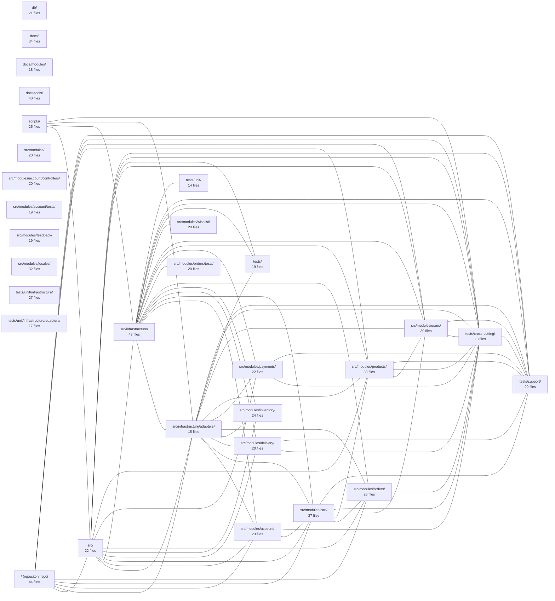

---
tags:
  - 2repo
  - 2repo/index
  - project/boilerplate-node-backend
type: index
modules: 30
updated: 2026-08-31T20:59:44.308452+00:00
---

# boilerplate-node-backend

boilerplate-node-backend is a Node.js backend starter project structured around a set of e-commerce domain modules—account, cart, delivery, feedback, inventory, locales, orders, payments, products, users, and wishlist—each living under `src/modules/` with its own controllers and, where present, dedicated tests. A shared `src/infrastructure/` layer holds adapters and cross-cutting infrastructure, complemented by a top-level `db/` directory for data access and `scripts/` for operational tooling. The repository ships with a substantial `docs/` tree (covering both per-module and tool-level documentation) and a `tests/` hierarchy organized into unit, cross-cutting, and shared support categories.

## Module map

_124 lower-traffic connection(s) hidden to keep the diagram readable._

## Modules
- [[boilerplate-node-backend_db|db/]] — 21 files, 8 connected modules
- [[boilerplate-node-backend_docs|docs/]] — 34 files, 3 connected modules
- [[boilerplate-node-backend_docs_modules|docs/modules/]] — 18 files, 2 connected modules
- [[boilerplate-node-backend_docs_tools|docs/tools/]] — 40 files, 3 connected modules
- [[boilerplate-node-backend_scripts|scripts/]] — 25 files, 13 connected modules
- [[boilerplate-node-backend_src|src/]] — 22 files, 23 connected modules
- [[boilerplate-node-backend_src_infrastructure|src/infrastructure/]] — 43 files, 25 connected modules
- [[boilerplate-node-backend_src_infrastructure_adapters|src/infrastructure/adapters/]] — 15 files, 24 connected modules
- [[boilerplate-node-backend_src_modules|src/modules/]] — 20 files, 9 connected modules
- [[boilerplate-node-backend_src_modules_account|src/modules/account/]] — 23 files, 16 connected modules
- [[boilerplate-node-backend_src_modules_account_controllers|src/modules/account/controllers/]] — 20 files, 6 connected modules
- [[boilerplate-node-backend_src_modules_account_tests|src/modules/account/tests/]] — 19 files, 8 connected modules
- [[boilerplate-node-backend_src_modules_cart|src/modules/cart/]] — 37 files, 20 connected modules
- [[boilerplate-node-backend_src_modules_delivery|src/modules/delivery/]] — 20 files, 14 connected modules
- [[boilerplate-node-backend_src_modules_feedback|src/modules/feedback/]] — 19 files, 8 connected modules
- [[boilerplate-node-backend_src_modules_inventory|src/modules/inventory/]] — 24 files, 13 connected modules
- [[boilerplate-node-backend_src_modules_locales|src/modules/locales/]] — 32 files, 6 connected modules
- [[boilerplate-node-backend_src_modules_orders|src/modules/orders/]] — 26 files, 16 connected modules
- [[boilerplate-node-backend_src_modules_orders_tests|src/modules/orders/tests/]] — 20 files, 10 connected modules
- [[boilerplate-node-backend_src_modules_payments|src/modules/payments/]] — 22 files, 14 connected modules
- [[boilerplate-node-backend_src_modules_products|src/modules/products/]] — 30 files, 19 connected modules
- [[boilerplate-node-backend_src_modules_users|src/modules/users/]] — 30 files, 17 connected modules
- [[boilerplate-node-backend_src_modules_wishlist|src/modules/wishlist/]] — 20 files, 10 connected modules
- [[boilerplate-node-backend_tests|tests/]] — 19 files, 12 connected modules
- [[boilerplate-node-backend_tests_cross-cutting|tests/cross-cutting/]] — 28 files, 22 connected modules
- [[boilerplate-node-backend_tests_support|tests/support/]] — 20 files, 22 connected modules
- [[boilerplate-node-backend_tests_unit|tests/unit/]] — 14 files, 10 connected modules
- [[boilerplate-node-backend_tests_unit_infrastructure|tests/unit/infrastructure/]] — 27 files, 8 connected modules
- [[boilerplate-node-backend_tests_unit_infrastructure_adapters|tests/unit/infrastructure/adapters/]] — 17 files, 8 connected modules
- [[boilerplate-node-backend_ROOT|/ (repository root)]] — 44 files, 19 connected modules
