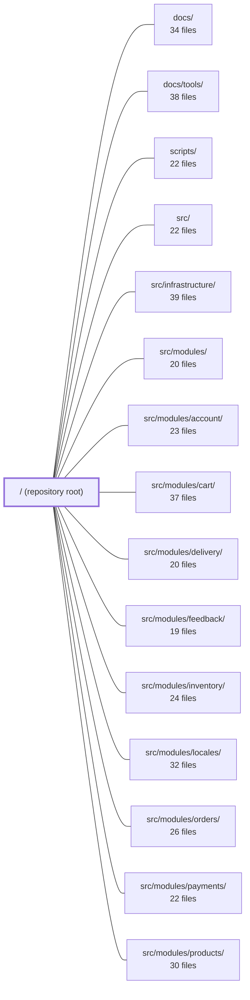

---
tags:
  - 2repo
  - 2repo/module
  - project/boilerplate-node-backend
type: module
module: / (repository root)
files: 39
updated: 2026-08-28T11:56:19.724587+00:00
---

# / (repository root)

## Purpose

The repository root of `boilerplate-node-api-mongodb-mongoose` v2.0.0 — an Express 5 + Mongoose 9 REST/async API. It holds every cross-cutting artifact that spans multiple modules: the bundled API contracts (OpenAPI, AsyncAPI), the toolchain configuration (lint, test, mutation, type-check), the deployment stacks, the client-facing request collections, and the design-planning documents that govern how the API surface evolves.

## Key parts

- **API contracts & codegen** — `openapi.yaml` and `asyncapi.yaml` (both generated, not hand-edited) are the single source of truth for HTTP and real-time surfaces. `shared/contracts/` holds the root preamble and worker-queue definitions that the bundler merges into those files. `orval.config.ts` + `api/schemas.zod.ts` turn the OpenAPI spec into TypeScript types and Zod validators. The `spectral*.yaml` rulesets lint contract sections at root and per-module granularity.
- **Client & mock tooling** — `contract.postman.json`, `contract.insomnia.json`, `contract.bruno.yml`, and `contract.mockoon.json` package the same Ecommerce Demo API as ready-to-run request collections and a mock server, so no one must hand-type endpoints to explore the contract.
- **Infrastructure & deployment** — `docker-compose.yml` (dev stack with OTel) and `docker-compose.production.yml` (app + Mongo + Redis + RabbitMQ only) are the two `docker compose up` entry points. `migrate-mongo-config.js` wires the schema-migration CLI to the same connection-URI fragments the app uses.
- **Quality gates** — `eslint.config.ts` + `eslint/rules/` enforce controller-chain safety, i18n usage, and the single-door persistence boundary. `jest.config.js`, `jest.config.cluster.js`, and `jest.config.mutation.js` configure the three test tiers. `stryker.config.json` / `stryker.deep.json` scope mutation testing. `tsconfig.json` / `tsconfig.jest.json` set the type-checking ground truth.
- **Load testing** — `k6/browse.js` (read path) and `k6/checkout.js` (write path / stock-reservation stress) provide VU-based benchmarks with pass/fail thresholds.
- **Design & changelog docs** — `CHANGELOG.md` tracks breaking API changes since v3.0.0; `CONTRACT_PLAN_POLYMORPHISM.md` records verdicts on where the API offers multiple spellings of an operation and where it deliberately does not.
- **Project manifest & onboarding** — `package.json` declares all scripts and dependencies; `README.md` is the first thing a newcomer reads.

## How it connects

- **`src/modules/*`** — Each domain module (account, cart, inventory, locales, orders, payments, products, users, wishlist, feedback, delivery) contributes a per-module `openapi.yaml` / `asyncapi.yaml` section that the bundler (invoked via `npm run contracts:bundle` in `scripts/`) merges with `shared/contracts/` into the root `openapi.yaml` and `asyncapi.yaml`. The Orval pipeline at the root then regenerates `api/schemas.zod.ts` and `api/models/` from the merged spec.
- **`src/` & `src/infrastructure/`** — The root ESLint rules (especially `no-persistence-imports`) constrain how `src/` is structured; the Docker compose files define the external services that `src/infrastructure/` connects to at runtime; `migrate-mongo-config.js` points at the same MongoDB instance the infrastructure layer manages.
- **`docs/` & `docs/tools/`** — `README.md` defers deep reference to `docs/`; `stryker.config.json` links to `docs/tools/mutation-testing.md` for the full mutation-testing glossary; `CONTRACT_PLAN_POLYMORPHISM.md` explicitly points to `docs/theory/request-input.md` for the input-parsing machinery.
- **`scripts/`** — Root npm scripts (`contracts:bundle`, `test:cluster`, `test:mutation`, `lint:openapi:modules`, etc.) invoke scripts in this directory, which in turn read the root config files.
- **`tests/unit/`, `tests/cross-cutting/`, `tests/support/`** — The three Jest configs and both Stryker configs at the root define how these test suites are discovered, transformed, and thresholded.

## Where to start

1. **`README.md`** — Gives the minimum context to clone, boot (`docker compose up`), and orient before diving deeper. It points to the rest of the documentation set.
2. **`openapi.yaml`** — The bundled API contract. Nearly everything else at the root (client collections, Zod schemas, Spectral rules, mock server config) derives from or validates against this file, so reading it first makes the surrounding tooling click into place.

## Connected modules

[[boilerplate-node-backend_docs|docs/]] · [[boilerplate-node-backend_docs_tools|docs/tools/]] · [[boilerplate-node-backend_scripts|scripts/]] · [[boilerplate-node-backend_src|src/]] · [[boilerplate-node-backend_src_infrastructure|src/infrastructure/]] · [[boilerplate-node-backend_src_modules|src/modules/]] · [[boilerplate-node-backend_src_modules_account|src/modules/account/]] · [[boilerplate-node-backend_src_modules_cart|src/modules/cart/]] · [[boilerplate-node-backend_src_modules_delivery|src/modules/delivery/]] · [[boilerplate-node-backend_src_modules_feedback|src/modules/feedback/]] · [[boilerplate-node-backend_src_modules_inventory|src/modules/inventory/]] · [[boilerplate-node-backend_src_modules_locales|src/modules/locales/]] · [[boilerplate-node-backend_src_modules_orders|src/modules/orders/]] · [[boilerplate-node-backend_src_modules_payments|src/modules/payments/]] · [[boilerplate-node-backend_src_modules_products|src/modules/products/]] · … and 5 more

## Files
- `CHANGELOG.md` — Records every notable change to the API contract (`openapi.yaml`) since version 3.0.0. It exists so that both humans and tooling can determine what broke, what was added, and *why*—using the working definition that a breaking change is one a generated client cannot absorb without being regenerated.
- `CONTRACT_PLAN_POLYMORPHISM.md` — A design-planning document that records *where* the API offers multiple spellings of one operation, *where* it deliberately does not, and the rules governing both choices. It resolves two open design questions (source-ranking for `hardDelete`, out-of-set values on reads vs writes), states the trigger threshold for adding a `POST /x/search` sibling, and tracks per-module current state. It is a backlog with verdicts, not a reference for the input-parsing machinery (see `docs/theory/request-input.md` for that).
- `README.md` — Entry-point document for the `boilerplate-node-api-mongodb-mongoose` repository. It gives a new developer (or AI assistant) the minimum context needed to clone, boot, and orient within the project before diving into `docs/` or `src/`. It deliberately defers detailed reference material to the linked documentation set.
- `api/schemas.zod.ts` — Zod schema definitions generated by orval v8.22.0 from the `openapi.yaml` contract. It provides runtime validation types for every API endpoint's request body and response envelope (health check, locale manifest, locale CRUD, tenant registry, and per-language message retrieval). The file exists so server-side handlers and test helpers can validate or parse JSON payloads without a separate DTO layer.
- `asyncapi.public.yaml` — A **generated** (do-not-edit) AsyncAPI 2.6.0 contract that bundles the project's real-time/event-driven API surface into a single distributable spec. It is produced by `npm run contracts:bundle` from `shared/contracts/asyncapi.root.yaml` and `src/modules/observability/asyncapi.yaml`, and serves as the canonical public reference for what the SSE endpoint at `/observability/events` emits and when.
- `asyncapi.yaml` — Bundled, read-only AsyncAPI 2.6.0 specification that describes every real-time (SSE) and async-job (RabbitMQ) channel in the boilerplate backend. It is generated by `npm run contracts:bundle` from three source files and serves as the single contract that documents what each channel carries, when, and on which server.
- `contract.bruno.yml` — Bruno API collection (OpenCollection 1.0.0) defining the "Ecommerce Demo API" as a set of hand-runnable HTTP requests with inline response examples. It serves as the executable, human-readable counterpart to the machine-readable OpenAPI spec, letting developers and AI agents send requests directly from the Bruno CLI or desktop app.
- `contract.insomnia.json` — An Insomnia REST-client collection (format 5.0, schema 5.1) that packages ready-to-send HTTP requests for the Ecommerce Demo API. It exists so developers can explore, test, and demo the API interactively without re-typing endpoints, headers, or auth tokens, and so the request/response expectations are captured in a form that mirrors the OpenAPI spec.
- `contract.mockoon.json` — Mockoon mock-server configuration for the **Ecommerce Demo API** (port `3001`). It defines a set of pre-canned HTTP routes and inline JSON responses so that clients and tests can exercise the API contract without a live backend.
- `contract.postman.json` — A Postman Collection (v2.1.0) that provides ready-to-run request examples and captured responses for the Ecommerce Demo API. It serves as a live testing and onboarding artifact: developers import it into Postman to exercise endpoints without hand-typing URLs, headers, or auth.
- `docker-compose.production.yml` — The production deployment stack for the API. It runs the four services the application cannot function without (app, MongoDB, Redis, RabbitMQ) as a self-contained unit, deliberately excluding the observability estate that the development stack (`docker-compose.yml`) includes. It is the file an operator hands to a deployment target.
- `docker-compose.yml` — Orchestrates the full local development stack (Node.js API, MongoDB, Redis, RabbitMQ, OpenTelemetry Collector) as a single `docker compose up` command. It wires service discovery, shared networking, log-drivers compatible with the Promtail → Loki pipeline, and environment-specific defaults so the stack boots into a populated, health-checked, browsable state.
- `eslint.config.ts` — Flat (ES2024+) ESLint configuration for the project. It assembles type-checked TypeScript linting, plugin presets, project-specific rule customizations, and a global ignore list into a single exported config object consumed by `eslint` and (via `eslint-config-prettier`) kept compatible with Prettier.
- `eslint/rules/controller-chain-must-catch.ts` — A custom ESLint rule that enforces every promise chain started in a controller (exported handler) ends in `.catch()`. It exists because Express does nothing with a returned promise, so the global error handler in `app.ts` catches unhandled rejections but cannot perform cleanup (e.g., orphaned uploads) or record domain metrics, and it reports a generic 500 even for client-input errors.
- `eslint/rules/index.ts` — Aggregation (barrel) module that collects the project's three local ESLint rules into a single default export, mapping each rule's string name to its implementation object. It exists so that `eslint.config.ts` can register all project-specific rules with one import rather than reaching into three separate files.
- `eslint/rules/no-hardcoded-user-text.ts` — Custom ESLint rule that enforces user-facing error copy must come from an i18n dictionary (`t(…)`) rather than a string literal. It scans calls to `rejectResponse` and `generateReject`, inspects the `errors` array argument, and reports any bare string literal or literal value under a `message:` key.
- `eslint/rules/no-persistence-imports.ts` — A custom ESLint rule that enforces a single-door persistence boundary: only `repository.ts` files may import collection models, schema types, or repository handles. Any other file that reaches past the repository (by binding name or by import path) is flagged, preventing scattered query shapes, lean/hydrated confusion, and unguarded direct DB calls.
- `jest.config.cluster.js` — Dedicated Jest configuration for the cluster integration test suite (`npm run test:cluster`). It exists as a standalone file rather than a sub-directory of the main config because nearly every default in `jest.config.js` is unsuitable for tests that spawn a real multi-process cluster: the in-process setup, shared mongod, timeout, and coverage assumptions all break down when the code under test runs in a child process.
- `jest.config.js` — Main Jest configuration for the unit/contract test suite. Defined in JavaScript (not JSON) so the per-file coverage thresholds can carry explanatory comments. It excludes the cluster tests (delegated to `jest.config.cluster.js`) and Stryker temporary directories, and enforces per-file coverage floors using glob keys so that a single untested file inside a green directory is caught.
- `jest.config.mutation.js` — Jest configuration consumed exclusively by Stryker (`npm run test:mutation`). It extends the base `jest.config.js` but swaps the ts-jest transform for `@swc/jest` so that repeated in-process Jest invocations (one per mutant) do not accumulate TypeScript LanguageService caches in memory. The goal is to make the mutation run finish without OOM-killing workers.
- `k6/browse.js` — A k6 load test that simulates an anonymous visitor browsing the product storefront. Unlike the flat-concurrency autocannon bench (`npm run bench`), this script ramps VUs, walks multiple endpoints in a realistic sequence, and asserts pass/fail via `thresholds` so the shell can act on the result.
- `k6/checkout.js` — k6 load-test for the write path (login → add to cart → checkout). Its specific target is the `reserveForOrder` stock-hold logic: verifying that concurrent checkouts of the same product remain correct and acceptable under load, complementing the two-caller race test in `tests/integration/concurrency/cart-races.test.ts` with a fifty-VU stress run.
- `migrate-mongo-config.js` — Configuration entry point for the [migrate-mongo](https://github.com/seppevk/migrate-mongo) CLI tool. It tells `migrate-mongo` where the migration files live, which collection tracks applied migrations, and how to build the MongoDB connection URI—resolving fragments (`NODE_MONGODB_HOST`, `PORT`, `NAME`) the same way the application does.
- `openapi.yaml` — This is the **bundled** OpenAPI 3.0.3 contract for the Ecommerce Demo API (v2.0.0). It is generated by `npm run contracts:bundle` from `shared/contracts/openapi.root.yaml` and per-module `src/modules/*/openapi.yaml` files, then serves as the single source of truth for all downstream code generation, API-client collections, mock servers, and linting. It is **not edited by hand**.
- `orval.config.ts` — Orval build configuration that generates TypeScript model interfaces and Zod schema validators from the project's OpenAPI specification. It exists so that `api/models/` and `api/schemas.zod.ts` stay in sync with `openapi.yaml` without hand-writing types.
- `package.json` — Project manifest for **boilerplate-node-api-mongodb-mongoose** v2.0.0 — an Express 5 + Mongoose 9 REST/async API. It declares runtime dependencies, dev tooling, npm scripts (dev, test, lint, codegen, DB, benchmarking), and lifecycle hooks. Entry point is `src/cluster.ts`; license is AGPL-3.0.
- `public/favicon/safari-pinned-tab.svg` — Vector icon displayed in Safari's tab bar when the site is pinned. It provides a crisp, resolution-independent brand mark for that specific context. The file is referenced from the HTML `<head>` via a `<link rel="mask-icon">` tag (typically alongside a `color` hint).
- `public/images/seed/README.md` — Documents the directory that holds committed seed-fixture images referenced by the demo seeder, and explains why this subdirectory is carved out from `public/images/` so that a single `.gitignore` rule can exclude runtime uploads without enumerating fixtures.
- `shared/contracts/analytics.frontend.ts` — Declares the analytics event names that only a browser client can emit — the half of a shared Umami event namespace that this (server) service can never observe. By giving those names a single, owned declaration point, the file lets `contract-bundles.test.ts` enforce collision-freedom between client and server event names, and lets `npm run contracts:bundle` publish a frontend-importable catalogue.
- `shared/contracts/asyncapi.root.yaml` — Service-level AsyncAPI preamble: it declares the `asyncapi` version, application `id`, `info` block, `defaultContentType`, and `tags` exactly once so that no module has to restate them. It is the AsyncAPI twin of `openapi.root.yaml`. It does **not** define channels or servers — those live with the modules that own the events. The bundler merges this preamble with the module/worker sections to produce a complete AsyncAPI document (e.g. `asyncapi.public.yaml`).
- `shared/contracts/asyncapi.workers.yaml` — A standalone AsyncAPI 2.6.0 document that contracts the two cross-cutting job queues (`worker.email.send`, `worker.pdf.generate`) owned by the application rather than any single domain. It exists beside `asyncapi.root.yaml` so that queue definitions can be linted independently and so the `rabbitmqLocal` server stays out of the public AsyncAPI bundle shared with API clients.
- `shared/contracts/openapi.root.yaml` — Root OpenAPI 3.0.3 specification for the Ecommerce Demo API (v2.0.0). It defines the shared building blocks — security schemes, reusable parameters, standard responses, and cross-module schemas — that every per-module spec inherits via `$ref`. Designed explicitly for code-generation (Orval/Zod, client/server stubs, DTOs) across multiple projects and languages.
- `spectral.asyncapi.modules.yaml` — A Spectral ruleset that allows individual AsyncAPI section files (e.g. `src/modules/<name>/asyncapi.yaml`) to be linted in isolation. It starts from the recommended `spectral:asyncapi` ruleset and disables only the rules that expect service-wide facts (tags, contact, license) which are declared once in the root document rather than restated by every section.
- `spectral.modules.yaml` — Spectral linter config for linting a single module's OpenAPI contract in isolation (`npm run lint:openapi:modules`). It disables the subset of rules that assume a file is the *entire* API (tag registry, security schemes, servers, `info` prose), because those concerns live in the root contract, while every other rule inherited from the main config still applies.
- `spectral.yaml` — Project-level Spectral ruleset that extends the built-in `spectral:oas` rules with team-specific linting conventions. It enforces naming patterns (camelCase operationIds, PascalCase schema names), bans `nullable` in favor of optional properties for codegen, and catches common typos in OpenAPI documents.
- `stryker.config.json` — Stryker mutation-testing configuration for the backend. It defines which source files are mutated, which test files may (and may not) run against the mutants, how results are thresholded, and how incremental caching is handled. The file's primary value is the extensive `_comment` array, which records *why* every scope, exclusion, and threshold decision was made and links out to `docs/tools/mutation-testing.md` for the full glossary and diagrams.
- `stryker.deep.json` — Stryker mutation-testing configuration for a "deep" run (`npm run test:mutation:deep`) that extends the standard scope with integration suites. It exists because the default run (unit + cross-cutting only) reports files whose tests live in `tests/integration/` as 0% NoCoverage, even when they are well-tested. This file is a slower, second measurement for a broader scope — a nightly diagnostic, not a per-commit gate.
- `tsconfig.jest.json` — A Jest-specific TypeScript config that extends the project's base `tsconfig.json` to override module resolution and syntax flags so that ts-jest can correctly transpile and import the application source under Jest's CommonJS runtime.
- `tsconfig.json` — Root TypeScript compiler configuration for the project. Defines compilation targets, strictness, path aliases, and the set of files TypeScript will check. It exists so the toolchain (editor, lint, test runners, dependency analyzers) has a single authoritative source for module resolution and type-checking rules.

---
[[boilerplate-node-backend_INDEX|← boilerplate-node-backend index]]
