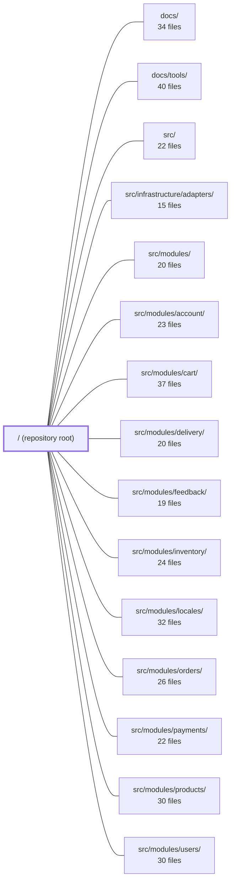

---
tags:
  - 2repo
  - 2repo/module
  - project/boilerplate-node-backend
type: module
module: / (repository root)
files: 44
updated: 2026-08-31T20:48:40.381464+00:00
---

# / (repository root)

## Purpose

The repository root is the project's control plane: it holds the API contracts from which all types and stubs are generated, the lint/test/build configuration that governs the codebase, the load-test and deployment scripts, and the design-decision records that explain *why* the architecture is shaped the way it is. It is not a runtime package—every executable unit lives under `src/`—but it defines the rules, the schema, and the operational surface that everything else obeys.

## Key parts

- **API contracts & codegen** — `openapi.yaml` (bundled, generated) and `asyncapi.yaml` / `asyncapi.public.yaml` (bundled, generated) are the single source of truth for the REST and event-driven surfaces. `shared/contracts/` holds the root preambles and cross-module channel definitions that the bundler merges into those files. `orval.config.ts` drives TypeScript + Zod generation into `api/schemas.zod.ts`, keeping runtime validation in lockstep with the spec.
- **Contract collections & mocks** — `contract.postman.json`, `contract.insomnia.json`, `contract.bruno.yml`, and `contract.mockoon.json` package ready-to-send HTTP requests and a mock server so the API can be exercised without a live backend.
- **Lint & static analysis** — `eslint.config.ts` plus the three custom rules in `eslint/rules/` enforce the controller-catch, i18n, and persistence-boundary invariants. `spectral.yaml` and its module-scoped variants lint the OpenAPI/AsyncAPI documents themselves.
- **Test configuration** — `jest.config.js` (unit + cross-cutting), `jest.config.cluster.js` (multi-process integration), and `jest.config.mutation.js` (Stryker) each carry project-specific overrides for timeout, transform, and coverage.
- **Deployment & load testing** — `docker-compose.yml` (dev stack with observability) and `docker-compose.production.yml` (lean four-service prod stack). `k6/browse.js` and `k6/checkout.js` provide ramping, threshold-asserted load tests for the read and write paths.
- **Design-decision records** — `CONTRACT_PLAN_POLYMORPHISM.md`, `IMAGE_PIPELINE_PLAN.md`, `INFRASTRUCTURE_LAYOUT_PLAN.md`, `FEEDBACK.md`, `LODASH.md`, and `REINVENTING_THE_WHEEL.md` are verdict-bearing documents that record trade-offs, rejected alternatives, and the rationale for the lint/dependency rule set. They are not executable; they exist so future contributors understand *why* before they ask *what*.
- **Project manifest & orientation** — `package.json` declares dependencies, the full script surface, and lifecycle hooks (contract regeneration, git hooks). `README.md` is the entry point for a new developer; `CHANGELOG.md` tracks API-contract changes since v3.0.0.

## How it connects

- **`src/modules/*`** — Each domain module owns a per-module `openapi.yaml` section and, where applicable, an `asyncapi.yaml` section that the root bundler merges into the top-level contract files. The custom ESLint rules in `eslint/rules/` enforce boundaries *inside* those modules (persistence-door, i18n, controller-catch). The Spectral ruleset validates each module's contract fragment in isolation.
- **`src/` / `src/infrastructure/adapters/`** — `INFRASTRUCTURE_LAYOUT_PLAN.md` documents drift in the infrastructure layer; `eslint.config.ts` enforces the layering rules it references. `migrate-mongo-config.js` configures the same connection-resolution logic that `src/infrastructure/` uses at runtime.
- **`docs/` / `docs/tools/`** — The design-decision records at the root deliberately defer deep technical explanation to `docs/`; `README.md` links into the documentation set for orientation.
- **`tests/unit/`, `tests/cross-cutting/`, `tests/support/`** — The three Jest configs at the root are consumed directly by those test suites; `jest.config.mutation.js` is the primary quality signal the mutation runner uses against the same test files.

## Where to start

1. **`README.md`** — Five minutes to get the clone → boot → orient loop; it points to `docs/` for depth and `package.json` for the script surface.
2. **`openapi.yaml`** — The bundled contract is the fastest way to understand what the API actually exposes (endpoints, envelopes, security) before reading any implementation. Pair it with `api/schemas.zod.ts` to see how the same spec becomes runtime types.

## Connected modules

[[boilerplate-node-backend_docs|docs/]] · [[boilerplate-node-backend_docs_tools|docs/tools/]] · [[boilerplate-node-backend_src|src/]] · [[boilerplate-node-backend_src_infrastructure_adapters|src/infrastructure/adapters/]] · [[boilerplate-node-backend_src_modules|src/modules/]] · [[boilerplate-node-backend_src_modules_account|src/modules/account/]] · [[boilerplate-node-backend_src_modules_cart|src/modules/cart/]] · [[boilerplate-node-backend_src_modules_delivery|src/modules/delivery/]] · [[boilerplate-node-backend_src_modules_feedback|src/modules/feedback/]] · [[boilerplate-node-backend_src_modules_inventory|src/modules/inventory/]] · [[boilerplate-node-backend_src_modules_locales|src/modules/locales/]] · [[boilerplate-node-backend_src_modules_orders|src/modules/orders/]] · [[boilerplate-node-backend_src_modules_payments|src/modules/payments/]] · [[boilerplate-node-backend_src_modules_products|src/modules/products/]] · [[boilerplate-node-backend_src_modules_users|src/modules/users/]] · … and 4 more

## Files
- `CHANGELOG.md` — Records every notable change to the API contract (`openapi.yaml`) since version 3.0.0. It exists so that both humans and tooling can determine what broke, what was added, and *why*—using the working definition that a breaking change is one a generated client cannot absorb without being regenerated.
- `CLAUDE.md`
- `CONTRACT_PLAN_POLYMORPHISM.md` — A design-decision record that documents where the API offers multiple spellings of one operation (e.g. `GET /x` vs `POST /x/search`), the rules that govern each spelling, and the cost/benefit thresholds for adding new ones. It is a backlog with verdicts—not a description of the request-input machinery (see `docs/theory/request-input.md` for that). Absorbed and replaced `CONTRACT_PLAN_POST_AS_GET.md` on 2026-08-24.
- `FEEDBACK.md` — A decision document (not executable code) that frames what the feedback module is, identifies two unaddressed gaps (no deletion path, no per-identity rate limit on the public endpoint), and recommends a minimal fix path (Option A: finish the contact form). It exists to stop the boilerplate from carrying PII indefinitely with no erasure mechanism and an unthrottled outbound-mail amplifier.
- `IMAGE_PIPELINE_PLAN.md` — Design and implementation-plan document for the image upload pipeline: every uploaded image must be digested (metadata stripped, dimensions capped, recompressed) and thumbnailed **before** it is ever placed under `public/` and served with `immutable, 1y` cache headers. It exists because the previous "validate-and-publish" flow leaked EXIF data, accepted malformed payloads, and forced full-size downloads in list views.
- `INFRASTRUCTURE_LAYOUT_PLAN.md` — A backlog-with-verdicts document explaining why `src/infrastructure/http` has accreted beyond its documented role, which neighbouring infrastructure folders contradict their own rules in `docs/theory/layers.md`, and the concrete (partially executed) steps to fix each issue. It does not restate the layering theory; it records the drift and the cost of correcting it.
- `LODASH.md` — Audit of hand-rolled code in this codebase that overlaps with common `lodash`/`lodash-es` functions, to determine whether pulling in `lodash-es` is worthwhile. Concludes the codebase is small and domain-specific, most candidates are not worth replacing, and one (`buildMessageTree`) must never be replaced for security reasons.
- `README.md` — Entry-point document for the `boilerplate-node-api-mongodb-mongoose` repository. It gives a new developer (or AI assistant) the minimum context needed to clone, boot, and orient within the project before diving into `docs/` or `src/`. It deliberately defers detailed reference material to the linked documentation set.
- `REINVENTING_THE_WHEEL.md` — A decision-audit document (companion to `OVERENGINEERED.md`) that records, with evidence, which hand-rolled guards and cross-cutting tests in the repo were replaced by a standard tool that answers a *stronger* question, which tool alternatives were trialled and rejected, and which hand-rolled checks were verified as necessary because no standard tool covers them. It is not code; it is the rationale archive for the lint/dependency rule set.
- `api/schemas.zod.ts` — Zod schema definitions generated by orval v8.22.0 from the `openapi.yaml` contract. It provides runtime validation types for every API endpoint's request body and response envelope (health check, locale manifest, locale CRUD, tenant registry, and per-language message retrieval). The file exists so server-side handlers and test helpers can validate or parse JSON payloads without a separate DTO layer.
- `asyncapi.public.yaml` — A **generated** (do-not-edit) AsyncAPI 2.6.0 contract that bundles the project's real-time/event-driven API surface into a single distributable spec. It is produced by `npm run contracts:bundle` from `shared/contracts/asyncapi.root.yaml` and `src/modules/observability/asyncapi.yaml`, and serves as the canonical public reference for what the SSE endpoint at `/observability/events` emits and when.
- `asyncapi.yaml` — Generated AsyncAPI 2.6.0 contract that defines every real-time and event-driven channel in the boilerplate: SSE observability streams and RabbitMQ worker queues (email, PDF, image digest). It is the single source of truth for what flows over the wire and when; it exists so both humans and tooling share one canonical description without re-reading implementation code.
- `contract.bruno.yml` — Bruno API collection (OpenCollection 1.0.0) defining the "Ecommerce Demo API" as a set of hand-runnable HTTP requests with inline response examples. It serves as the executable, human-readable counterpart to the machine-readable OpenAPI spec, letting developers and AI agents send requests directly from the Bruno CLI or desktop app.
- `contract.insomnia.json` — An Insomnia REST-client collection (format 5.0, schema 5.1) that packages ready-to-send HTTP requests for the Ecommerce Demo API. It exists so developers can explore, test, and demo the API interactively without re-typing endpoints, headers, or auth tokens, and so the request/response expectations are captured in a form that mirrors the OpenAPI spec.
- `contract.mockoon.json` — Mockoon mock-server configuration for the **Ecommerce Demo API** (port `3001`). It defines a set of pre-canned HTTP routes and inline JSON responses so that clients and tests can exercise the API contract without a live backend.
- `contract.postman.json` — A Postman Collection (v2.1.0) that provides ready-to-run request examples and captured responses for the Ecommerce Demo API. It serves as a live testing and onboarding artifact: developers import it into Postman to exercise endpoints without hand-typing URLs, headers, or auth.
- `docker-compose.production.yml` — The production deployment stack for the API. It runs the four services the application cannot function without (app, MongoDB, Redis, RabbitMQ) as a self-contained unit, deliberately excluding the observability estate that the development stack (`docker-compose.yml`) includes. It is the file an operator hands to a deployment target.
- `docker-compose.yml` — Orchestrates the full local development stack (Node.js API, MongoDB, Redis, RabbitMQ, OpenTelemetry Collector) as a single `docker compose up` command. It wires service discovery, shared networking, log-drivers compatible with the Promtail → Loki pipeline, and environment-specific defaults so the stack boots into a populated, health-checked, browsable state.
- `eslint.config.ts` — Flat ESLint configuration for the entire project. It wires together the TypeScript type-checked rule tiers, the Unicorn and Boundaries plugins, a local rule set, and an extensive per-rule override layer whose comments record *why* each deviation from a plugin default was made. It also defines the global ignore list for generated, foreign, and tooling directories that must never be linted.
- `eslint/rules/controller-chain-must-catch.ts` — A custom ESLint rule that enforces every promise chain started in a controller (exported handler) ends in `.catch()`. It exists because Express does nothing with a returned promise, so the global error handler in `app.ts` catches unhandled rejections but cannot perform cleanup (e.g., orphaned uploads) or record domain metrics, and it reports a generic 500 even for client-input errors.
- `eslint/rules/index.ts` — Aggregation (barrel) module that collects the project's three local ESLint rules into a single default export, mapping each rule's string name to its implementation object. It exists so that `eslint.config.ts` can register all project-specific rules with one import rather than reaching into three separate files.
- `eslint/rules/no-hardcoded-user-text.ts` — Custom ESLint rule that enforces user-facing error copy must come from an i18n dictionary (`t(…)`) rather than a string literal. It scans calls to `rejectResponse` and `generateReject`, inspects the `errors` array argument, and reports any bare string literal or literal value under a `message:` key.
- `eslint/rules/no-persistence-imports.ts` — A custom ESLint rule that enforces a single-door persistence boundary: only `repository.ts` files may import collection models, schema types, or repository handles. Any other file that reaches past the repository (by binding name or by import path) is flagged, preventing scattered query shapes, lean/hydrated confusion, and unguarded direct DB calls.
- `jest.config.cluster.js` — Dedicated Jest configuration for the cluster integration test suite (`npm run test:cluster`). It exists as a standalone file rather than a sub-directory of the main config because nearly every default in `jest.config.js` is unsuitable for tests that spawn a real multi-process cluster: the in-process setup, shared mongod, timeout, and coverage assumptions all break down when the code under test runs in a child process.
- `jest.config.js` — Jest configuration for the unit + cross-cutting test suite. Exists as `.js` (not `.json`) so that coverage thresholds can carry inline explanations, and so that runtime logic (worker-count resolution, env-file reading) can live next to the config it guards.
- `jest.config.mutation.js` — Jest configuration consumed exclusively by Stryker mutation testing (`npm run test:mutation`). It exists to swap the ts-jest transform for `@swc/jest` so that Stryker's repeated in-process runs don't accumulate ts-jest's TypeScript LanguageService cache in memory, which would OOM the worker. The mutation run is the primary quality signal for the test suite; the coverage floors in `jest.config.js` are only a fast proxy.
- `k6/browse.js` — A k6 load test that simulates an anonymous visitor browsing the product storefront. Unlike the flat-concurrency autocannon bench (`npm run bench`), this script ramps VUs, walks multiple endpoints in a realistic sequence, and asserts pass/fail via `thresholds` so the shell can act on the result.
- `k6/checkout.js` — k6 load-test for the write path (login → add to cart → checkout). Its specific target is the `reserveForOrder` stock-hold logic: verifying that concurrent checkouts of the same product remain correct and acceptable under load, complementing the two-caller race test in `tests/integration/concurrency/cart-races.test.ts` with a fifty-VU stress run.
- `migrate-mongo-config.js` — Configuration entry point for the [migrate-mongo](https://github.com/seppevk/migrate-mongo) CLI tool. It tells `migrate-mongo` where the migration files live, which collection tracks applied migrations, and how to build the MongoDB connection URI—resolving fragments (`NODE_MONGODB_HOST`, `PORT`, `NAME`) the same way the application does.
- `openapi.yaml` — This is the **bundled** OpenAPI 3.0.3 contract for the Ecommerce Demo API (v2.0.0). It is generated by `npm run contracts:bundle` from `shared/contracts/openapi.root.yaml` and per-module `src/modules/*/openapi.yaml` files, then serves as the single source of truth for all downstream code generation, API-client collections, mock servers, and linting. It is **not edited by hand**.
- `orval.config.ts` — Orval build configuration that generates TypeScript model interfaces and Zod schema validators from the project's OpenAPI specification. It exists so that `api/models/` and `api/schemas.zod.ts` stay in sync with `openapi.yaml` without hand-writing types.
- `package.json` — Root manifest for the `boilerplate-node-api-mongodb-mongoose` project (v2.0.0, AGPL-3.0). It declares the dependency set (runtime + dev), defines the full script surface (dev, test, lint, docs, DB, benchmarking, code-gen), and wires lifecycle hooks (`postinstall`, `prepare`) that regenerate API contracts and install git hooks on every install.
- `public/favicon/safari-pinned-tab.svg` — Vector icon displayed in Safari's tab bar when the site is pinned. It provides a crisp, resolution-independent brand mark for that specific context. The file is referenced from the HTML `<head>` via a `<link rel="mask-icon">` tag (typically alongside a `color` hint).
- `public/images/seed/README.md` — Documents the directory that holds committed seed-fixture images referenced by the demo seeder, and explains why this subdirectory is carved out from `public/images/` so that a single `.gitignore` rule can exclude runtime uploads without enumerating fixtures.
- `shared/contracts/asyncapi.root.yaml` — Service-level AsyncAPI preamble: it declares the `asyncapi` version, application `id`, `info` block, `defaultContentType`, and `tags` exactly once so that no module has to restate them. It is the AsyncAPI twin of `openapi.root.yaml`. It does **not** define channels or servers — those live with the modules that own the events. The bundler merges this preamble with the module/worker sections to produce a complete AsyncAPI document (e.g. `asyncapi.public.yaml`).
- `shared/contracts/asyncapi.workers.yaml` — Standalone AsyncAPI 2.6.0 document that declares the three application-level job queues (`worker.email.send`, `worker.pdf.generate`, `worker.image.digest`) which do not belong to any domain. It sits beside `asyncapi.root.yaml` so that `npm run lint:asyncapi:modules` can validate it independently, and it is the single place that binds those channels to the `rabbitmqLocal` broker.
- `shared/contracts/openapi.root.yaml` — The root OpenAPI 3.0.3 contract for the Ecommerce Demo API. It is a codegen-oriented, multi-language spec that defines the shared vocabulary — security schemes, reusable parameters, standard responses, and cross-module schemas (pagination, IDs, envelope shapes) — that every per-module `openapi.yaml` composes against. It exists so that generated client/server stubs, DTOs, and SDKs have a single, stable source of truth for anything more than one module references.
- `spectral.asyncapi.modules.yaml` — A Spectral ruleset that allows individual AsyncAPI section files (e.g. `src/modules/<name>/asyncapi.yaml`) to be linted in isolation. It starts from the recommended `spectral:asyncapi` ruleset and disables only the rules that expect service-wide facts (tags, contact, license) which are declared once in the root document rather than restated by every section.
- `spectral.modules.yaml` — Spectral linter config for linting a single module's OpenAPI contract in isolation (`npm run lint:openapi:modules`). It disables the subset of rules that assume a file is the *entire* API (tag registry, security schemes, servers, `info` prose), because those concerns live in the root contract, while every other rule inherited from the main config still applies.
- `spectral.yaml` — Project-level Spectral ruleset that extends the built-in `spectral:oas` rules with team-specific linting conventions. It enforces naming patterns (camelCase operationIds, PascalCase schema names), bans `nullable` in favor of optional properties for codegen, and catches common typos in OpenAPI documents.
- `stryker.config.json` — Configuration file for [Stryker Mutating](https://stryker-mutator.io/) mutation testing. It defines which source files are mutated, how tests are executed (via a dedicated Jest config), where reports are written, and the performance/quality thresholds that gate CI.
- `stryker.deep.json` — Stryker Mutator configuration for the project's "deep" mutation-testing run. It defines which source files are mutated, how Jest is invoked as the test runner, where reports land, and the quality thresholds that gate CI. The "deep" suffix distinguishes this configuration from any lighter/faster mutation profile the repo may maintain.
- `tsconfig.jest.json` — A Jest-specific TypeScript config that extends the project's base `tsconfig.json` to override module resolution and syntax flags so that ts-jest can correctly transpile and import the application source under Jest's CommonJS runtime.
- `tsconfig.json` — Root TypeScript compiler configuration for the project. Defines compilation targets, strictness, path aliases, and the set of files TypeScript will check. It exists so the toolchain (editor, lint, test runners, dependency analyzers) has a single authoritative source for module resolution and type-checking rules.

---
[[boilerplate-node-backend_INDEX|← boilerplate-node-backend index]]
