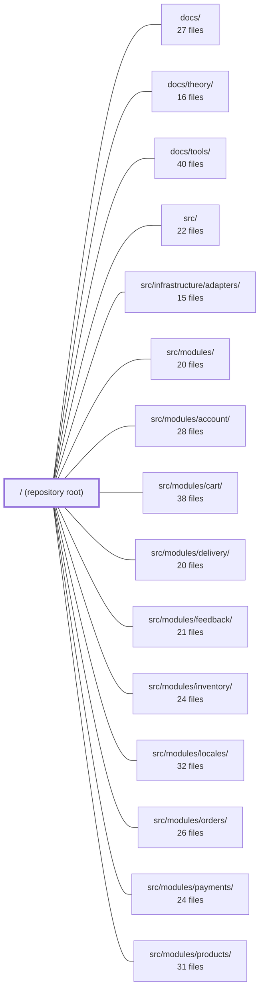

---
tags:
  - 2repo
  - 2repo/module
  - project/boilerplate-node-backend
type: module
module: / (repository root)
files: 46
updated: 2026-09-02T18:29:42.272514+00:00
---

# / (repository root)

## Purpose

The repository root is the project-level orchestration layer for the **boilerplate-node-api-mongodb-mongoose** API (v2.0.0, AGPLv3). It holds the API contracts, code-generation pipeline, lint/test/mutation configurations, deployment stacks, API-client collections, load-test scripts, and the planning/decision documents that record *why* architectural choices were made. In short: it is where "how to build, validate, test, deploy, and consume the API" is defined, while the runtime behaviour lives under `src/`.

## Key parts

- **API contracts & codegen** — `openapi.yaml` (bundled OpenAPI 3.0.3) and `asyncapi.yaml` / `asyncapi.public.yaml` (AsyncAPI 2.6.0) are generated from `shared/contracts/*.yaml` and per-module spec files via `npm run contracts:bundle`. `orval.config.ts` drives orval to emit `api/schemas.zod.ts` (Zod validators) and TypeScript models. `package.json`'s `postinstall` hook re-runs both bundles and codegen after every `npm install`.
- **Lint & style** — `eslint.config.ts` (flat config) wires type-checked rules, Unicorn/Boundaries plugins, and three project-local rules under `eslint/rules/` (controller `.catch()` enforcement, i18n-only error copy, single-door persistence boundary). `spectral.asyncapi.modules.yaml` lets module-level AsyncAPI fragments be linted in isolation.
- **Test configuration** — `jest.config.js` (unit/cross-cutting), `jest.config.cluster.js` (multi-process cluster suite), and `jest.config.mutation.js` (Stryker mutation testing with `@swc/jest`) each override specific defaults for their execution model. Coverage floors live in the main config; the mutation run is the primary quality signal.
- **Deployment** — `docker-compose.yml` (full dev stack: app, MongoDB, Redis, RabbitMQ, OTel Collector, Loki, Grafana, etc.) and `docker-compose.production.yml` (lean four-service production stack) are the two compose files an operator or developer hands to a target.
- **API-client & mock collections** — `contract.bruno.yml`, `contract.insomnia.json`, `contract.postman.json` provide ready-to-send request sets for Bruno, Insomnia, and Postman respectively; `contract.mockoon.json` configures a Mockoon mock server on port 3001 for offline contract testing.
- **Load testing** — `k6/browse.js` (read-path, ramping VUs across storefront endpoints) and `k6/checkout.js` (write-path stress on `reserveForOrder` stock-hold logic) complement the Jest concurrency tests with realistic multi-VU runs.
- **Planning & decision documents** — `README.md` (orientation), `CHANGELOG.md` (API-breaking-change history), and several `*_PLAN.md` / `*_ADD.md` files (Stripe, Cloudflare, Vercel, social login, image pipeline, feedback, boolean gates, test-audit rollup) record architectural decisions and execution steps before code is written.
- **Project manifest** — `package.json` declares the full script surface (dev, lint, contract validation, multi-tier testing, bench, migration, docs, regeneration) and sets `src/cluster.ts` as the entry point.

## How it connects

- **`src/` and `src/modules/*`** — Every module under `src/modules/` contributes a fragment (`openapi.yaml`, `asyncapi.yaml`) that the root bundler merges into the top-level `openapi.yaml` / `asyncapi.yaml`. The ESLint rules in `eslint/rules/` (persistence boundary, controller catch, i18n copy) enforce invariants *within* module code. The Jest configs govern how module code is exercised in test.
- **`tests/`** — `tests/cross-cutting/` and `tests/support/` are executed under the root Jest configurations. The `jest.config.cluster.js` and `jest.config.mutation.js` files exist specifically because the test suites in `tests/` need different transforms, timeouts, and worker isolation than a default run.
- **`docs/`** — `README.md` explicitly defers to `docs/` as the reference; `docs/theory/` and `docs/tools/` are linked from the README's link map. Several planning documents at the root cite `docs/` for normative language and conventions.
- **`src/infrastructure/adapters/`** — The planning documents (Stripe, Cloudflare, social login) name specific adapter files and ports that live under this path, documenting *why* the current shapes are insufficient and what the replacement looks like.

## Where to start

1. **`README.md`** — Gives a 30-second quick-start, an architecture sketch, and a file-layout table that points you to the right doc for every area. Read it first to know *where to look next*.
2. **`package.json`** — The `scripts` block is the map of every build, lint, test, bench, and deploy command. Understanding the script surface (especially `contracts:bundle`, `orval`, `test`, `test:cluster`, `test:mutation`, `bench`) tells you how all the root-level configs and generated files are wired together.

## Connected modules

[[boilerplate-node-backend_docs|docs/]] · [[boilerplate-node-backend_docs_theory|docs/theory/]] · [[boilerplate-node-backend_docs_tools|docs/tools/]] · [[boilerplate-node-backend_src|src/]] · [[boilerplate-node-backend_src_infrastructure_adapters|src/infrastructure/adapters/]] · [[boilerplate-node-backend_src_modules|src/modules/]] · [[boilerplate-node-backend_src_modules_account|src/modules/account/]] · [[boilerplate-node-backend_src_modules_cart|src/modules/cart/]] · [[boilerplate-node-backend_src_modules_delivery|src/modules/delivery/]] · [[boilerplate-node-backend_src_modules_feedback|src/modules/feedback/]] · [[boilerplate-node-backend_src_modules_inventory|src/modules/inventory/]] · [[boilerplate-node-backend_src_modules_locales|src/modules/locales/]] · [[boilerplate-node-backend_src_modules_orders|src/modules/orders/]] · [[boilerplate-node-backend_src_modules_payments|src/modules/payments/]] · [[boilerplate-node-backend_src_modules_products|src/modules/products/]] · … and 5 more

## Files
- `BOOLEAN_GATES.md` — A planning document (status: **planned, not started**) that defines a single rule—collapse tri-state permission flags (`granted`/`denied`/absent) into required `boolean`s at the system boundary rather than re-collapsing at every consumer—and applies that rule to three concrete fields (`analyticsConsent`, `admin`, address `default`). It is not code; nothing here is implemented.
- `CHANGELOG.md` — Records all notable changes to the API contract (`openapi.yaml`), defining a **breaking change** as one a generated client cannot absorb without being regenerated. Serves as the canonical history for consumers of the contract and the repository's own tooling gates.
- `CLAUDE.md`
- `EXTERNAL_SERVICE_CLOUDFLARE_PLAN.md` — Planning document for integrating Cloudflare (TLS/DNS/WAF, CDN, R2 object storage, Turnstile) as the missing front-of-stack for a loopback-bound Node application. It identifies four separable work items, sequences them, and calls out the one integration detail (`NODE_TRUST_PROXY_HOPS`) that is most likely to be missed.
- `EXTERNAL_SERVICE_STRIPE_PLAN.md` — Planning document for replacing the `fake` payment provider with a live Stripe integration. It documents the four architectural blockers that prevent a drop-in Stripe file, the redesigned `PaymentProvider` port, and the concrete backend/frontend work items. It exists so a developer can execute the integration without re-deriving *why* the current port shape is insufficient.
- `EXTERNAL_SERVICE_VERCEL_PLAN.md` — A planning document that evaluates using Vercel to host the Vue frontend (replacing the current nginx container). It exists to record one hard constraint (same-site cookie requirement), the minimal build setup, and a recommendation to pick Vercel *or* Cloudflare Pages but not both. It is marked as the third-priority item and cheapest to defer.
- `FEEDBACK.md` — A decision document (not executable code) that frames what the feedback module is, identifies two unaddressed gaps (no deletion path, no per-identity rate limit on the public endpoint), and recommends a minimal fix path (Option A: finish the contact form). It exists to stop the boilerplate from carrying PII indefinitely with no erasure mechanism and an unthrottled outbound-mail amplifier.
- `IMAGE_PIPELINE_PLAN.md` — Design and status document for the image upload pipeline: quarantine → digest (metadata strip, dimension cap, re-encode) → thumbnail generation → promote to `public/`. It exists to justify why images are never served from `public/` until fully processed, and to record the architectural decisions (three-directory model, conditional writeback, no-broker fallback) so they aren't re-litigated. Status: implemented on both backend and frontend.
- `README.md` — Landing page and orientation guide for the `boilerplate-node-api-mongodb-mongoose` repo. It provides a 30-second quick-start, a one-diagram architecture sketch, a file-layout table, and a link map into `docs/`. It is explicitly **not** the reference; the docs tree is. Its job is to get a reader from "I cloned this" to "I know which doc to open" without re-reading the codebase.
- `SOCIAL_LOGIN_ADD.md` — Implementation plan for adding Google and GitHub OAuth as new login methods within the existing `account`/`users` modules, reusing the same JWT/cookie session model as email/password. It exists to record the architectural decisions, file-by-file change list, security reasoning, and test strategy before any code is written.
- `TEST_AUDIT_CORRELATED_BLIND_SPOTS.md` — Versioned, at-a-glance rollup of the "correlated blind spots" test audit (Prompt 1 in `0_PROMPTS.md`). It records whether the test suite proves code correctness or merely mirrors the code, lists every finding with status/severity, and gives an ordered action plan. The full per-file evidence lives in gitignored local reports (`reports/audit/correlated-blind-spots/`); this file is the durable summary.
- `api/schemas.zod.ts` — Zod schema definitions generated by orval v8.22.0 from the `openapi.yaml` contract. It provides runtime validation types for every API endpoint's request body and response envelope (health check, locale manifest, locale CRUD, tenant registry, and per-language message retrieval). The file exists so server-side handlers and test helpers can validate or parse JSON payloads without a separate DTO layer.
- `asyncapi.public.yaml` — A **generated** (do-not-edit) AsyncAPI 2.6.0 contract that bundles the project's real-time/event-driven API surface into a single distributable spec. It is produced by `npm run contracts:bundle` from `shared/contracts/asyncapi.root.yaml` and `src/modules/observability/asyncapi.yaml`, and serves as the canonical public reference for what the SSE endpoint at `/observability/events` emits and when.
- `asyncapi.yaml` — Generated AsyncAPI 2.6.0 contract that defines every real-time and event-driven channel in the boilerplate: SSE observability streams and RabbitMQ worker queues (email, PDF, image digest). It is the single source of truth for what flows over the wire and when; it exists so both humans and tooling share one canonical description without re-reading implementation code.
- `contract.bruno.yml` — Bruno API collection (OpenCollection 1.0.0) defining the "Ecommerce Demo API" as a set of hand-runnable HTTP requests with inline response examples. It serves as the executable, human-readable counterpart to the machine-readable OpenAPI spec, letting developers and AI agents send requests directly from the Bruno CLI or desktop app.
- `contract.insomnia.json` — An Insomnia REST-client collection (format 5.0, schema 5.1) that packages ready-to-send HTTP requests for the Ecommerce Demo API. It exists so developers can explore, test, and demo the API interactively without re-typing endpoints, headers, or auth tokens, and so the request/response expectations are captured in a form that mirrors the OpenAPI spec.
- `contract.mockoon.json` — Mockoon mock-server configuration for the **Ecommerce Demo API** (port `3001`). It defines a set of pre-canned HTTP routes and inline JSON responses so that clients and tests can exercise the API contract without a live backend.
- `contract.postman.json` — A Postman Collection (v2.1.0) that provides ready-to-run request examples and captured responses for the Ecommerce Demo API. It serves as a live testing and onboarding artifact: developers import it into Postman to exercise endpoints without hand-typing URLs, headers, or auth.
- `docker-compose.production.yml` — The production deployment stack for the API. It runs the four services the application cannot function without (app, MongoDB, Redis, RabbitMQ) as a self-contained unit, deliberately excluding the observability estate that the development stack (`docker-compose.yml`) includes. It is the file an operator hands to a deployment target.
- `docker-compose.yml` — Development Docker/Podman Compose stack that orchestrates the Node.js API, MongoDB, Redis, RabbitMQ, an OTel Collector, and the local observability tooling (Promtail, Loki, Grafana, Umami, Alloy/Faro) into a single `compose up`-able environment. It is the dev-only counterpart to `docker-compose.production.yml`.
- `eslint.config.ts` — Flat ESLint configuration for the entire project. It wires together the TypeScript type-checked rule tiers, the Unicorn and Boundaries plugins, a local rule set, and an extensive per-rule override layer whose comments record *why* each deviation from a plugin default was made. It also defines the global ignore list for generated, foreign, and tooling directories that must never be linted.
- `eslint/rules/controller-chain-must-catch.ts` — A custom ESLint rule that enforces every promise chain started in a controller (exported handler) ends in `.catch()`. It exists because Express does nothing with a returned promise, so the global error handler in `app.ts` catches unhandled rejections but cannot perform cleanup (e.g., orphaned uploads) or record domain metrics, and it reports a generic 500 even for client-input errors.
- `eslint/rules/index.ts` — Aggregation (barrel) module that collects the project's three local ESLint rules into a single default export, mapping each rule's string name to its implementation object. It exists so that `eslint.config.ts` can register all project-specific rules with one import rather than reaching into three separate files.
- `eslint/rules/no-hardcoded-user-text.ts` — Custom ESLint rule that enforces user-facing error copy must come from an i18n dictionary (`t(…)`) rather than a string literal. It scans calls to `rejectResponse` and `generateReject`, inspects the `errors` array argument, and reports any bare string literal or literal value under a `message:` key.
- `eslint/rules/no-persistence-imports.ts` — A custom ESLint rule that enforces a single-door persistence boundary: only `repository.ts` files may import collection models, schema types, or repository handles. Any other file that reaches past the repository (by binding name or by import path) is flagged, preventing scattered query shapes, lean/hydrated confusion, and unguarded direct DB calls.
- `jest.config.cluster.js` — Dedicated Jest configuration for the cluster integration test suite (`npm run test:cluster`). It exists as a standalone file rather than a sub-directory of the main config because nearly every default in `jest.config.js` is unsuitable for tests that spawn a real multi-process cluster: the in-process setup, shared mongod, timeout, and coverage assumptions all break down when the code under test runs in a child process.
- `jest.config.js` — Jest configuration for the unit / cross-cutting test suite. Written as `.js` rather than `.json` so the coverage thresholds can carry inline explanations that JSON cannot hold. It defines the test glob, worker count, coverage collection, and per-file coverage floors that run in CI, while explicitly excluding the cluster and mutation suites (handled by their own configs).
- `jest.config.mutation.js` — Jest configuration consumed exclusively by Stryker mutation testing (`npm run test:mutation`). It exists to swap the ts-jest transform for `@swc/jest` so that Stryker's repeated in-process runs don't accumulate ts-jest's TypeScript LanguageService cache in memory, which would OOM the worker. The mutation run is the primary quality signal for the test suite; the coverage floors in `jest.config.js` are only a fast proxy.
- `k6/browse.js` — A k6 load test that simulates an anonymous visitor browsing the product storefront. Unlike the flat-concurrency autocannon bench (`npm run bench`), this script ramps VUs, walks multiple endpoints in a realistic sequence, and asserts pass/fail via `thresholds` so the shell can act on the result.
- `k6/checkout.js` — k6 load-test for the write path (login → add to cart → checkout). Its specific target is the `reserveForOrder` stock-hold logic: verifying that concurrent checkouts of the same product remain correct and acceptable under load, complementing the two-caller race test in `tests/integration/concurrency/cart-races.test.ts` with a fifty-VU stress run.
- `migrate-mongo-config.js` — Configuration entry point for the [migrate-mongo](https://github.com/seppevk/migrate-mongo) CLI tool. It tells `migrate-mongo` where the migration files live, which collection tracks applied migrations, and how to build the MongoDB connection URI—resolving fragments (`NODE_MONGODB_HOST`, `PORT`, `NAME`) the same way the application does.
- `openapi.yaml` — This is the **bundled** OpenAPI 3.0.3 contract for the Ecommerce Demo API (v2.0.0). It is generated by `npm run contracts:bundle` from `shared/contracts/openapi.root.yaml` and per-module `src/modules/*/openapi.yaml` files, then serves as the single source of truth for all downstream code generation, API-client collections, mock servers, and linting. It is **not edited by hand**.
- `orval.config.ts` — Orval build configuration that generates TypeScript model interfaces and Zod schema validators from the project's OpenAPI specification. It exists so that `api/models/` and `api/schemas.zod.ts` stay in sync with `openapi.yaml` without hand-writing types.
- `package.json` — Project manifest for **boilerplate-node-api-mongodb-mongoose** (v2.0.0, AGPLv3.0). Declares the runtime and development dependency sets, defines the full script surface (dev server, linting, contract validation, multi-tier testing, benchmarking, DB migration/seeding, container orchestration, docs, and generated-artifact regeneration), and sets the entry point to `src/cluster.ts`. The `postinstall` hook auto-generates API and AsyncAPI client types and bundles OpenAPI/AsyncAPI contract files after every `npm install`.
- `public/favicon/safari-pinned-tab.svg` — Vector icon displayed in Safari's tab bar when the site is pinned. It provides a crisp, resolution-independent brand mark for that specific context. The file is referenced from the HTML `<head>` via a `<link rel="mask-icon">` tag (typically alongside a `color` hint).
- `public/images/seed/README.md` — Documents the committed seed-fixture images that the demo seeders (`db/demo/index.ts`) reference by name. It exists to explain *why* this subdirectory is the one exception to the `.gitignore` rule for `public/images/`, and how to regenerate the fixtures when catalogue roles change.
- `shared/contracts/asyncapi.root.yaml` — Service-level AsyncAPI preamble: it declares the `asyncapi` version, application `id`, `info` block, `defaultContentType`, and `tags` exactly once so that no module has to restate them. It is the AsyncAPI twin of `openapi.root.yaml`. It does **not** define channels or servers — those live with the modules that own the events. The bundler merges this preamble with the module/worker sections to produce a complete AsyncAPI document (e.g. `asyncapi.public.yaml`).
- `shared/contracts/asyncapi.workers.yaml` — Standalone AsyncAPI 2.6.0 document that declares the three application-level job queues (`worker.email.send`, `worker.pdf.generate`, `worker.image.digest`) which do not belong to any domain. It sits beside `asyncapi.root.yaml` so that `npm run lint:asyncapi:modules` can validate it independently, and it is the single place that binds those channels to the `rabbitmqLocal` broker.
- `shared/contracts/openapi.root.yaml` — Root OpenAPI 3.0.3 specification for the Ecommerce Demo API. It exists as the shared, codegen-oriented contract from which client/server stubs, DTOs, and SDKs are generated across projects and languages. It centralises the components (parameters, responses, schemas, security) that every module spec reuses, and documents cross-cutting conventions (localisation, soft/hard delete, image upload limits) in one authoritative place.
- `spectral.asyncapi.modules.yaml` — A Spectral ruleset that allows individual AsyncAPI section files (e.g. `src/modules/<name>/asyncapi.yaml`) to be linted in isolation. It starts from the recommended `spectral:asyncapi` ruleset and disables only the rules that expect service-wide facts (tags, contact, license) which are declared once in the root document rather than restated by every section.
- `spectral.modules.yaml` — Spectral linter config for linting a single module's OpenAPI contract in isolation (`npm run lint:openapi:modules`). It disables the subset of rules that assume a file is the *entire* API (tag registry, security schemes, servers, `info` prose), because those concerns live in the root contract, while every other rule inherited from the main config still applies.
- `spectral.yaml` — Project-level Spectral ruleset that extends the built-in `spectral:oas` rules with team-specific linting conventions. It enforces naming patterns (camelCase operationIds, PascalCase schema names), bans `nullable` in favor of optional properties for codegen, and catches common typos in OpenAPI documents.
- `stryker.config.json` — Configuration file for [Stryker Mutating](https://stryker-mutator.io/) mutation testing. It defines which source files are mutated, how tests are executed (via a dedicated Jest config), where reports are written, and the performance/quality thresholds that gate CI.
- `stryker.deep.json` — Stryker Mutator configuration for the project's "deep" mutation-testing run. It defines which source files are mutated, how Jest is invoked as the test runner, where reports land, and the quality thresholds that gate CI. The "deep" suffix distinguishes this configuration from any lighter/faster mutation profile the repo may maintain.
- `tsconfig.jest.json` — A Jest-specific TypeScript config that extends the project's base `tsconfig.json` to override module resolution and syntax flags so that ts-jest can correctly transpile and import the application source under Jest's CommonJS runtime.
- `tsconfig.json` — Root TypeScript compiler configuration for the project. Defines compilation targets, strictness, path aliases, and the set of files TypeScript will check. It exists so the toolchain (editor, lint, test runners, dependency analyzers) has a single authoritative source for module resolution and type-checking rules.

---
[[boilerplate-node-backend_INDEX|← boilerplate-node-backend index]]
