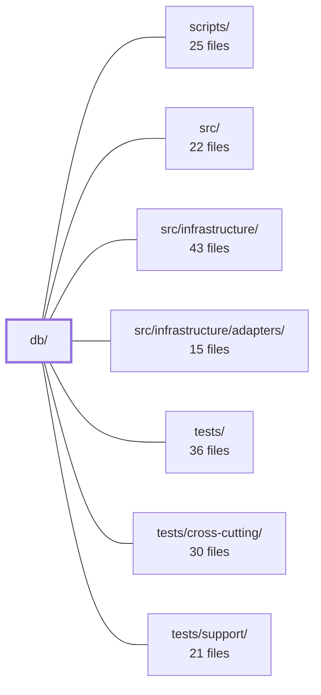

---
tags:
  - 2repo
  - 2repo/module
  - project/boilerplate-node-backend
type: module
module: db/
files: 22
updated: 2026-09-02T18:29:57.426500+00:00
---

# db/

## Purpose

`db/` owns every database-lifecycle operation that runs *outside* the HTTP request path: schema migrations, demo-data seeding, cache invalidation for out-of-band writes, and the shared logic that assembles and validates the seed dataset. It exists so that database state changes (new fields, new collections, index repairs, one-time backfills) are captured as auditable, replayable scripts rather than ad-hoc console commands.

## Key parts

- **`migrations/`** — Timestamped `migrate-mongo` scripts, one per schema or data change. The set covers index creation and pruning, field backfills (`locale`, `verified`, `stock` → `onHand`/`reserved`, `deletedAt`), collection restructuring (cart extraction, orphaned-order detachment), security hardening (token hashing, unique-email index), and locale-dictionary evolution (scope → tenant rename, base-language extraction). New index *additions* are declared on their schemas; this directory handles the one-off cases a schema definition cannot express (drops, backfills, renames).
- **`demo/`** — The seed-data pipeline. `demo-data.json` is the static dataset; `assemble.ts` reads it back through every enabled module's serializer to validate referential integrity and produce a canonical JSON string; `index.ts` is the orchestrator that opens Mongo, gates against production, calls each module's optional `seeds()` concurrently, flushes the cache, and closes connections.
- **`cache-clear.ts`** — Standalone script that wipes this app's cached responses from Redis. Needed because writes that bypass the API (seed, migration, raw `mongosh`) skip the per-request `invalidateCache` middleware.
- **`run-script.ts`** — Thin entry-point wrapper that gives every one-shot script in this directory a guaranteed non-zero exit on failure, resource cleanup on both paths, and a structured error log.

## How it connects

- **`src/`** — Migrations backfill fields that `src/` schemas and services define at runtime (e.g. `users.active`, `orders.deletedAt`, `products.onHand`). The demo seeder (`demo/index.ts`) calls each enabled module's `seeds()` method, making `src/` the source of what gets seeded. The cache-clear script targets the same Redis keys the API's middleware writes to.
- **`src/infrastructure/` / `src/infrastructure/adapters/`** — The indexes created and pruned in migrations are the ones the adapters query; the cache-clear script invalidates entries stored by the infrastructure caching layer.
- **`scripts/`** — The `db:seed` npm script invokes `demo/index.ts` and, after seeding, calls `cache-clear.ts`. Migration execution (`migrate-mongo`) is likewise triggered from `scripts/`.
- **`tests/` / `tests/cross-cutting/` / `tests/support/`** — `demo/assemble.ts` is deliberately a shared module so that the migration integration test (in `tests/cross-cutting/`) and the seed-data export both derive the dataset from one implementation. Test support fixtures reference the same `demo-data.json` baseline.

## Where to start

1. **`db/demo/index.ts`** — Short, self-contained, and shows the full "open DB → seed → flush cache → close" lifecycle plus the production guard. Reading it tells you how the module's scripts are expected to behave.
2. **`db/migrations/20260808160000-cart-collection.js`** — A representative migration that touches data *and* structure (extract-then-normalise), so it illustrates the conventions the other migrations follow: idempotency, single-deploy safety, and the "schema declares what exists / migration declares what changes" split.

## Connected modules

[[boilerplate-node-backend_scripts|scripts/]] · [[boilerplate-node-backend_src|src/]] · [[boilerplate-node-backend_src_infrastructure|src/infrastructure/]] · [[boilerplate-node-backend_src_infrastructure_adapters|src/infrastructure/adapters/]] · [[boilerplate-node-backend_tests|tests/]] · [[boilerplate-node-backend_tests_cross-cutting|tests/cross-cutting/]] · [[boilerplate-node-backend_tests_support|tests/support/]]

## Files
- `db/cache-clear.ts` — Standalone script that deletes every cached response owned by this app from Redis. It exists because writes that bypass the HTTP API (`db:seed`, `migrate-mongo`, a raw `mongosh` session) skip the API's per-request `invalidateCache` middleware, leaving stale responses in place until their TTL expires. It is invoked automatically by `db:seed` and can be run by hand after any manual database surgery.
- `db/demo/assemble.ts` — Assembles the demo dataset (`db/demo/demo-data.json`) by reading rows back through every enabled module's serializer, validating internal consistency (no dangling references, shape labels in bijection with collections), and returning a deterministically ordered JSON string. It is a shared module so that the export script and the migration integration test both derive the dataset from a single implementation, eliminating the risk of two callers disagreeing about what the dataset is.
- `db/demo/demo-data.json` — Static seed dataset used to populate a local or CI database with realistic demo records. It provides the baseline data for development, integration tests, and client-side preview environments so that the application has users, products, carts, orders, addresses, and localized strings without requiring a running backend or manual data entry.
- `db/demo/index.ts` — The runner for the demo-data seeder. It opens a Mongo connection, gates against production, walks every entry in `enabledModules` calling each module's optional `seeds()` method concurrently, flushes the in-memory cache, and closes both connections. It owns no domain logic and names no collection; its sole job is orchestration.
- `db/migrations/20240101000000-initial-indexes.js` — Bootstrap migration that creates the initial set of MongoDB indexes across the `users`, `products`, and `orders` collections. It has already run against every existing database and is kept as-written for historical fidelity; new index needs are declared on their respective schemas instead.
- `db/migrations/20260806120000-user-locale.js` — Backfills the `locale` field on existing `users` documents so that out-of-band consumers (queued emails, nightly jobs) have a value to read when no `Accept-Language` header is available. New users receive their locale at signup via `services/auth.ts`; this migration covers the population that registered before the field existed.
- `db/migrations/20260806140000-image-url-separators.js` — Repairs `imageUrl` strings stored with Windows backslash separators (`\images\x.jpg`) so they resolve as valid URL paths, and re-points six seed-fixture images to their new `/images/seed/` directory. It exists because multer's `file.path` (via `path.join()`) recorded upload URLs with the host's native separator, producing 404 URLs on any client.
- `db/migrations/20260808120000-user-active-column.js` — Adds a stored `active` boolean to the `users` MongoDB collection and backfills it with `true` for every existing row. The column exists to represent "is this account enabled" as a fact independent of soft-deletion (`deletedAt`), so that deactivation and deletion remain orthogonal concerns.
- `db/migrations/20260808160000-cart-collection.js` — One-shot migration that extracts the cart from the embedded `user.cart` field into a dedicated `carts` collection, normalising the line-item shape (`product` → `productId`, dropping per-item `_id`s) so the stored document matches the wire contract exactly. Both halves ship in a single deploy because the public API contract is unchanged and no client can distinguish pre- from post-migration state.
- `db/migrations/20260808180000-prune-unused-indexes.js` — Drops three MongoDB indexes that no application query actually uses, eliminating their write-amplification cost and memory footprint. It exists as a migration because dropping an index is the one index operation a schema definition cannot express — a schema declares what should exist, not what should stop existing.
- `db/migrations/20260808200000-users-email-unique.js` — Adds a **unique** index on `users.email` in MongoDB, closing a check-then-insert race in `authService.signup` that allows two concurrent signups to create duplicate accounts on the same address. The migration runs only against an *existing* deployed database where the old non-unique `users_email` index already exists; it refuses to proceed if duplicate emails are present.
- `db/migrations/20260810120000-orders-soft-delete.js` — Adds the soft-delete surface to the `orders` collection (a `deletedAt` field and its supporting compound index) so that orders participate in the same `visibleScope` / `ownerScope` filtering already used by products and users. It intentionally writes no data — the absence of the field *is* the "not deleted" state — and only creates the index the application actually queries.
- `db/migrations/20260813090000-user-verified-column.js` — Backfills the `users.verified` field by setting it to `true` on every pre-existing row, grandfathering accounts that predate the email-confirmation flow. Without this, the schema's default (`false`, correct for a new self-signup) would retroactively mark all long-standing users as unverified and surface a "confirm your email" prompt to them.
- `db/migrations/20260813091000-product-stock-column.js` — Backfills the `products.stock` field (used by checkout decrement and cancel-restore logic) with the demo default of `100` for all existing rows. It exists so that the column, introduced in the schema and `openapi.yaml` for new products, also has a value on rows created before the column was added.
- `db/migrations/20260817120000-inventory-counters.js` — Splits the legacy single-counter `stock` field on `products` into the two counters the reservation model requires (`onHand` and `reserved`), backfills sensible defaults, and drops the obsolete `stockmovements` ledger whose single-`delta` schema cannot be mapped into the new `onHandDelta`/`reservedDelta` pair.
- `db/migrations/20260817140000-locale-collections.js` — Creates two unique indexes on the `locales` and `localemessages` collections. There is no data migration; the collections start empty and are populated by `npm run db:seed`. The migration's sole purpose is enforcing two uniqueness constraints that prevent concurrent check-then-insert races (duplicate locale tags, duplicate locale+key pairs).
- `db/migrations/20260818120000-locale-entry-scope.js` — Adds a `scope` field (`'api'` | `'app'`) to the `localemessages` collection and promotes it into the row's unique identity. Before this migration, rows were identified by `(locale, key)` because there was only one dictionary to override; with two dictionaries (API vs. app) that share keys like `generic.error-internal`, the key alone is ambiguous. The migration backfills existing rows and swaps the unique index accordingly.
- `db/migrations/20260818160000-locale-base-language.js` — Backfills a `baseLanguage` field on documents in the `locales` collection by extracting the primary subtag (portion before the first hyphen) from the existing `tag` field. This makes "all variants of a language" queryable in a single field instead of requiring a string split in application code.
- `db/migrations/20260822120000-locale-entry-tenant.js` — Migration that renames the `scope` field (a two-value enum: `app` / `api`) to `tenant` (a free-form identifier) on the `localemessages` collection, remaps the two legacy values to their demo tenant IDs (`demo-fe`, `demo-be`), swaps the unique index from `(locale, scope, key)` to `(locale, tenant, key)`, and drops the old index. It exists so the locale-entry schema can represent more than one frontend/backend pair per deployment.
- `db/migrations/20260901120000-hash-user-tokens.js` — One-time data migration that converts every plaintext token stored in `users.tokens[].token` (refresh JWTs, password-reset tokens, delete-confirmation tokens) into a SHA-256 hex digest, in place. Closes a security gap: the schema's `select: false` kept tokens off ordinary reads but did not protect against a single read-only collection exposure.
- `db/migrations/20260901230000-orders-detach-orphaned-userid.js` — One-time backfill that detaches `userId` from orders orphaned by account hard-deletes that occurred **before** the `orders` collection gained its own `USER_DELETED` detach handler. For every order whose `userId` no longer resolves to a live user, it unsets `userId` and stamps `anonymizeAfter` 10 years out — replicating what the runtime handler now does automatically. The order row (the invoice) is preserved.
- `db/run-script.ts` — Entry-point wrapper for the one-shot scripts under `db/`. It guarantees three things a bare `async` main lacks: a non-zero exit code on failure, guaranteed resource cleanup on both success and failure paths, and a structured error log. It centralises the run/exit/lifecycle logic so individual scripts stay focused on their work.

---
[[boilerplate-node-backend_INDEX|← boilerplate-node-backend index]]
