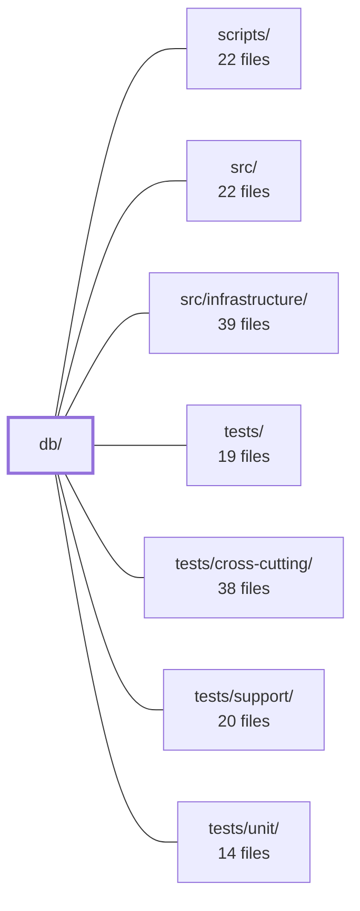

---
tags:
  - 2repo
  - 2repo/module
  - project/boilerplate-node-backend
type: module
module: db/
files: 21
updated: 2026-08-27T17:59:49.363455+00:00
---

# db/

## Purpose

The `db/` module contains all database-facing tooling that lives outside the application server: MongoDB migrations, the demo seed pipeline, and operational one-shot scripts (cache clearing, script runner). It exists so that database schema evolution, local/CI data provisioning, and manual data hygiene can each be performed without starting the API.

## Key parts

- **`db/migrations/`** — Timestamped `migrate-mongo` scripts that evolve the schema (add columns, create/drop indexes, reshape collections, backfill data). Each migration targets a single concern: `users` fields (`locale`, `active`, `verified`, email uniqueness), `products` stock splitting, the `carts` extraction, `orders` soft-delete and shipping-cost backfill, and the `locales`/`localemessages` uniqueness and tenancy evolution.

- **`db/demo/`** — The demo-data pipeline. `index.ts` is the thin orchestrator that connects, calls every enabled module's `seeds()`, and flushes cache. `assemble.ts` serialises the full dataset back through each module's serializer to produce a validated, deterministic JSON string. `demo-data.json` is the resulting static seed file consumed by local dev, CI, and the client-collections bundle.

- **`db/run-script.ts`** — Shared entry-point wrapper that adds non-zero exit codes, guaranteed resource cleanup, and structured error logging to any one-shot script under `db/`.

- **`db/cache-clear.ts`** — Standalone Redis purger for the app's response-cache prefix, intended for use after out-of-band database writes (manual seeding, ad-hoc `mongosh`) that bypass the API's write-path invalidation.

## How it connects

- **`src/`** — Each demo module's `seeds()` and serializer is implemented in `src/`; migrations reference the collections and field shapes defined by `src/` schemas. `assemble.ts` imports those serializers directly.
- **`src/infrastructure/`** — Provides the MongoDB connection factory and Redis client that `db/demo/index.ts` and `db/cache-clear.ts` consume at runtime.
- **`scripts/`** and **`/` (root)** — The root `package.json` exposes `db:seed`, `migrate-mongo`, and cache-clear npm scripts that invoke the entry points in this module.
- **`tests/integration/`** — The migration integration test reuses `db/demo/assemble.ts` to derive the expected dataset, ensuring the test and the export script agree on what the data should look like.
- **`tests/unit/`** / **`tests/cross-cutting/`** — Unit and cross-cutting tests rely on the deterministic `demo-data.json` fixture so they never depend on a live database.
- **`docs/`** — Documents the migration strategy and the demo/seed workflow for operators.

## Where to start

Read **`db/demo/index.ts`** first — it is short, names no collections, and shows the full orchestration shape (connect → seed → flush → close). Then read **`db/migrations/20260808120000-cart-collection.js`**; it is the most self-contained migration and demonstrates the typical pattern (backfill + schema change + index update) used by the rest of the directory.

## Connected modules

[[boilerplate-node-backend_scripts|scripts/]] · [[boilerplate-node-backend_src|src/]] · [[boilerplate-node-backend_src_infrastructure|src/infrastructure/]] · [[boilerplate-node-backend_tests|tests/]] · [[boilerplate-node-backend_tests_cross-cutting|tests/cross-cutting/]] · [[boilerplate-node-backend_tests_support|tests/support/]] · [[boilerplate-node-backend_tests_unit|tests/unit/]]

## Files
- `db/cache-clear.ts` — Standalone script that removes all cached responses scoped to this app's Redis prefix. It exists because the API only invalidates its own cache on writes it handles; manual database operations (`db:seed`, `migrate-mongo`, ad-hoc `mongosh`) bypass that logic, leaving stale responses served until TTL expiry.
- `db/demo/assemble.ts` — Assembles the demo dataset (`db/demo/demo-data.json`) by reading rows back through every enabled module's serializer, validating internal consistency (no dangling references, shape labels in bijection with collections), and returning a deterministically ordered JSON string. It is a shared module so that the export script and the migration integration test both derive the dataset from a single implementation, eliminating the risk of two callers disagreeing about what the dataset is.
- `db/demo/demo-data.json` — Static seed data for the demo environment. It provides a fixed, deterministic set of records across all supported collections so that local development, CI tests, and the client-collections bundle have a known starting dataset without requiring a live database or random generation.
- `db/demo/index.ts` — The runner for the demo-data seeder. It opens a Mongo connection, gates against production, walks every entry in `enabledModules` calling each module's optional `seeds()` method concurrently, flushes the in-memory cache, and closes both connections. It owns no domain logic and names no collection; its sole job is orchestration.
- `db/migrations/20240101000000-initial-indexes.js` — Bootstrap migration that creates the initial set of MongoDB indexes across the `users`, `products`, and `orders` collections. It has already run against every existing database and is kept as-written for historical fidelity; new index needs are declared on their respective schemas instead.
- `db/migrations/20260806120000-user-locale.js` — Backfills the `locale` field on existing `users` documents so that out-of-band consumers (queued emails, nightly jobs) have a value to read when no `Accept-Language` header is available. New users receive their locale at signup via `services/auth.ts`; this migration covers the population that registered before the field existed.
- `db/migrations/20260806140000-image-url-separators.js` — Repairs `imageUrl` strings stored with Windows backslash separators (`\images\x.jpg`) so they resolve as valid URL paths, and re-points six seed-fixture images to their new `/images/seed/` directory. It exists because multer's `file.path` (via `path.join()`) recorded upload URLs with the host's native separator, producing 404 URLs on any client.
- `db/migrations/20260808120000-user-active-column.js` — Adds a stored `active` boolean to the `users` MongoDB collection and backfills it with `true` for every existing row. The column exists to represent "is this account enabled" as a fact independent of soft-deletion (`deletedAt`), so that deactivation and deletion remain orthogonal concerns.
- `db/migrations/20260808160000-cart-collection.js` — One-shot migration that extracts the cart from the embedded `user.cart` field into a dedicated `carts` collection, normalising the line-item shape (`product` → `productId`, dropping per-item `_id`s) so the stored document matches the wire contract exactly. Both halves ship in a single deploy because the public API contract is unchanged and no client can distinguish pre- from post-migration state.
- `db/migrations/20260808180000-prune-unused-indexes.js` — Drops three MongoDB indexes that no application query actually uses, eliminating their write-amplification cost and memory footprint. It exists as a migration because dropping an index is the one index operation a schema definition cannot express — a schema declares what should exist, not what should stop existing.
- `db/migrations/20260808200000-users-email-unique.js` — Adds a **unique** index on `users.email` in MongoDB, closing a check-then-insert race in `authService.signup` that allows two concurrent signups to create duplicate accounts on the same address. The migration runs only against an *existing* deployed database where the old non-unique `users_email` index already exists; it refuses to proceed if duplicate emails are present.
- `db/migrations/20260810120000-orders-soft-delete.js` — Adds the soft-delete surface to the `orders` collection (a `deletedAt` field and its supporting compound index) so that orders participate in the same `visibleScope` / `ownerScope` filtering already used by products and users. It intentionally writes no data — the absence of the field *is* the "not deleted" state — and only creates the index the application actually queries.
- `db/migrations/20260813090000-user-verified-column.js` — Backfills the `users.verified` field by setting it to `true` on every pre-existing row, grandfathering accounts that predate the email-confirmation flow. Without this, the schema's default (`false`, correct for a new self-signup) would retroactively mark all long-standing users as unverified and surface a "confirm your email" prompt to them.
- `db/migrations/20260813091000-product-stock-column.js` — Backfills the `products.stock` field (used by checkout decrement and cancel-restore logic) with the demo default of `100` for all existing rows. It exists so that the column, introduced in the schema and `openapi.yaml` for new products, also has a value on rows created before the column was added.
- `db/migrations/20260817120000-inventory-counters.js` — Splits the legacy single-counter `stock` field on `products` into the two counters the reservation model requires (`onHand` and `reserved`), backfills sensible defaults, and drops the obsolete `stockmovements` ledger whose single-`delta` schema cannot be mapped into the new `onHandDelta`/`reservedDelta` pair.
- `db/migrations/20260817140000-locale-collections.js` — Creates two unique indexes on the `locales` and `localemessages` collections. There is no data migration; the collections start empty and are populated by `npm run db:seed`. The migration's sole purpose is enforcing two uniqueness constraints that prevent concurrent check-then-insert races (duplicate locale tags, duplicate locale+key pairs).
- `db/migrations/20260818120000-locale-entry-scope.js` — Adds a `scope` field (`'api'` | `'app'`) to the `localemessages` collection and promotes it into the row's unique identity. Before this migration, rows were identified by `(locale, key)` because there was only one dictionary to override; with two dictionaries (API vs. app) that share keys like `generic.error-internal`, the key alone is ambiguous. The migration backfills existing rows and swaps the unique index accordingly.
- `db/migrations/20260818160000-locale-base-language.js` — Backfills a `baseLanguage` field on documents in the `locales` collection by extracting the primary subtag (portion before the first hyphen) from the existing `tag` field. This makes "all variants of a language" queryable in a single field instead of requiring a string split in application code.
- `db/migrations/20260820140000-order-shipping-cost.js` — One-time backfill that sets `shippingCost` to `0` on legacy `orders` documents written before the `delivery` module existed. After this runs, every order has the field, so `orderTotal`'s tolerance for a missing `shippingCost` is a guard against malformed data rather than a contract with the database.
- `db/migrations/20260822120000-locale-entry-tenant.js` — Migration that renames the `scope` field (a two-value enum: `app` / `api`) to `tenant` (a free-form identifier) on the `localemessages` collection, remaps the two legacy values to their demo tenant IDs (`demo-fe`, `demo-be`), swaps the unique index from `(locale, scope, key)` to `(locale, tenant, key)`, and drops the old index. It exists so the locale-entry schema can represent more than one frontend/backend pair per deployment.
- `db/run-script.ts` — Entry-point wrapper for the one-shot scripts under `db/`. It guarantees three things a bare `async` main lacks: a non-zero exit code on failure, guaranteed resource cleanup on both success and failure paths, and a structured error log. It centralises the run/exit/lifecycle logic so individual scripts stay focused on their work.

---
[[boilerplate-node-backend_INDEX|← boilerplate-node-backend index]]
