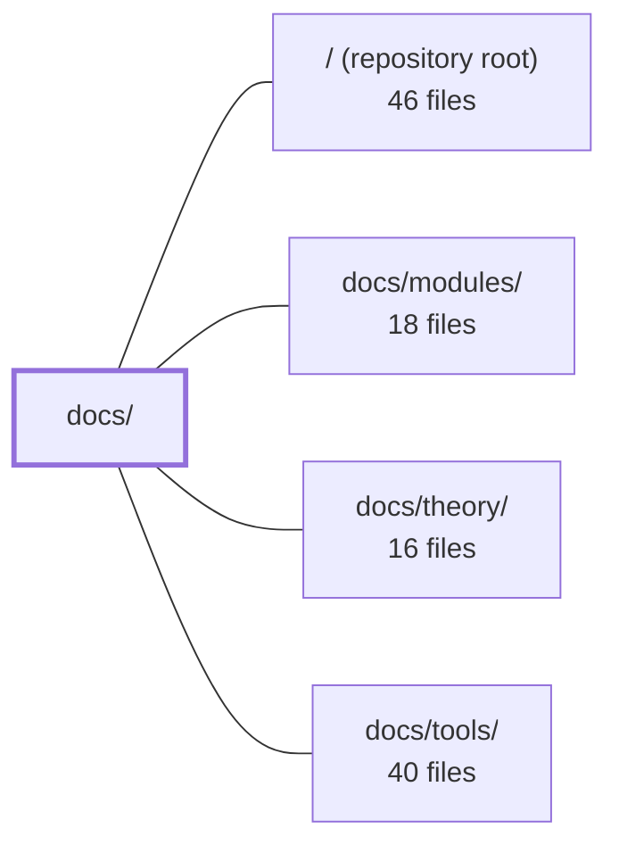

---
tags:
  - 2repo
  - 2repo/module
  - project/boilerplate-node-backend
type: module
module: docs/
files: 27
updated: 2026-09-02T18:30:10.652883+00:00
---

# docs/

## Purpose

The `docs/` module is the VitePress-powered documentation site for the Boilerplate Node Backend project. It covers the full contributor lifecycle—from first-clone setup through production deployment—spanning API contract workflows, a demo e-commerce walkthrough, reference catalogues for every major directory, and operational guidance. All content lives here; the site itself is built and served by VitePress.

## Key parts

- **Site infrastructure** — `.vitepress/config.mts` defines navigation, sidebar, local search, and Mermaid rendering; `.vitepress/theme/index.ts` adds click-to-zoom for diagrams.
- **Landing & onboarding** — `index.md` is the home page (table-of-contents); `getting-started.md` walks a fresh clone to a running API in ~5 minutes; `getting-started-production.md` covers the image build, secrets, and four-service compose stack.
- **API documentation** (`api/`) — Covers the OpenAPI and AsyncAPI contract ecosystems: ownership model (`contract-fragmentation.md`), per-spec change workflows (`openapi-workflow.md`, `asyncapi-workflow.md`), regeneration pipeline (`regenerating.md`), design rationale (`endpoints.md`), and the internal `/observability/*` surface (`observability.md`). `index.md` is the routing hub.
- **Demo e-commerce** (`demo-ecommerce/`) — Plain-language, role-based walkthroughs (shopper, manager, warehouse, support) that tie individual backend modules together into a coherent product narrative without requiring source-level knowledge.
- **Reference catalogues** (`reference/`) — File-level maps for contracts, database layer, ops/CI artifacts, repository root, `scripts/` + `eslint/rules/`, `src/app` + `src/kernel`, `src/infrastructure/`, `src/modules/<domain>/` file shapes, and the test-suite hierarchy. `index.md` acts as a one-hop lookup when you land on an unfamiliar filename.

## How it connects

- **`/` (repository root)** — The reference pages (`root.md`, `scripts.md`, `ops.md`, `contracts.md`) are direct maps of the root-level and top-level files this module documents; editing those files is what triggers the workflows described in `api/` and `reference/`.
- **`docs/modules/`** — The demo-ecommerce pages and `reference/src-modules.md` point readers into per-module docs for implementation detail; conversely, module docs link back here for contract workflow and design-rationale context.
- **`docs/theory/`** — Reference pages deliberately defer deeper "why" explanations to theory pages (e.g., retention policy, mutation-testing philosophy); `reference/index.md` and `reference/tests.md` both cross-reference the theory section.
- **`docs/tools/`** — `reference/scripts.md` complements `docs/tools/package-scripts.md`: the former is the file-level landscape, the latter the user-facing command names and timing. Both must stay in sync when scripts change.

## Where to start

Read `index.md` first—it orients you to the six documentation sections and the repo's shape in under a minute. Then open `getting-started.md` to get a running, seeded API locally; everything else in this module becomes navigable once you have the stack up and can see the endpoints it describes.

## Connected modules

[[boilerplate-node-backend_ROOT|/ (repository root)]] · [[boilerplate-node-backend_docs_modules|docs/modules/]] · [[boilerplate-node-backend_docs_theory|docs/theory/]] · [[boilerplate-node-backend_docs_tools|docs/tools/]]

## Files
- `docs/.vitepress/config.mts` — VitePress site configuration that defines the documentation layout for the "Boilerplate Node Backend" project. It sets the site metadata, enables local search, configures the top navigation bar, and declares the sidebar structure for every documentation section (Demo Shop, Theory, Modules, Tools, API/Reference). Mermaid diagram rendering is enabled via the `vitepress-plugin-mermaid` wrapper.
- `docs/.vitepress/theme/index.ts` — VitePress custom theme entry point that extends the default theme and adds a click-to-zoom interaction for Mermaid diagrams rendered in the docs. It injects a full-screen overlay (cloning the SVG) when a user clicks a diagram, with backdrop-click or Escape-key dismissal.
- `docs/api/asyncapi-workflow.md` — Documents the full lifecycle of the async (event-driven) contract: how `asyncapi.yaml` is authored from per-section source documents, split into a full and a public bundle, validated, and turned into generated TypeScript types. It exists so contributors understand *where to edit*, *why the split is by section*, and *what is enforced in CI* without reverse-engineering the scripts.
- `docs/api/contract-fragmentation.md` — Documents the **ownership model** for shared API contracts (OpenAPI and AsyncAPI): which repo owns what, how per-module fragments are compiled/merged into the seven committed bundles, and how the frontend receives byte-identical copies. It complements `openapi-workflow.md` (which covers *how to change* the contract) by covering *who owns it, where it lives, and how it reaches the frontend*.
- `docs/api/endpoints.md` — Design-rationale companion to the API route table. `openapi.yaml` says *what* each route accepts and returns; `src/modules/<name>/routes.ts` says *how* the middleware chain enforces it; this page says *why* the surface is shaped the way it is, domain by domain. It exists to prevent future changes from contradicting decisions that are otherwise invisible in code or contract.
- `docs/api/index.md` — Landing page for the API documentation section. It gives a one-glance overview of the API contract ecosystem (OpenAPI spec → tooling → implementation → tests), states the core conventions for REST style, and routes readers to the correct sub-page based on their task. It exists so neither humans nor AI need to guess which doc covers a given API question.
- `docs/api/observability.md` — API reference for the five `/observability/*` routes that expose operational data (health, KPIs, audit, SSE metrics, Prometheus text) for internal dashboards and monitoring scrapers. All routes are non-public and use one of three bespoke auth mechanisms rather than the standard admin JWT.
- `docs/api/openapi-workflow.md` — Documents the OpenAPI contract workflow for this boilerplate: the rule that per-module YAML fragments (not the bundled `openapi.yaml`) are the single source of truth, and the exact sequence of bundle → lint → mock → codegen → implement → test steps that keeps backend, generated types, and frontend consumers in sync.
- `docs/api/regenerating.md` — Quick-reference cheat sheet for "I edited a fragment — now what does the pipeline need?" It documents the regeneration pipeline (bundle → generate → seed → sync), the dependency ordering that makes it non-trivial, and the verification gates that catch skipped steps. It complements `contract-fragmentation.md` (the *why*) with the *how*.
- `docs/demo-ecommerce/index.md` — Landing page for the demo e-commerce documentation section. Written in plain, non-technical language to explain **what** the pet-supply shop does (browse, buy, ship) without describing **how** it is built. Serves as the single entry point that orients a reader to the four sub-pages before they dive into technical module docs.
- `docs/demo-ecommerce/manager.md` — Documentation page for the shop manager (staff) side of the demo e-commerce app. Describes the order state machine, product catalogue management (including soft-delete semantics), delivery pricing rules, customer account administration, and the audit-log guarantee — all behind the `root`/`rootroot` staff login.
- `docs/demo-ecommerce/shopper.md` — A narrative walkthrough of the complete customer journey in the demo pet-supplies shop, from browsing through to post-purchase actions. It exists as a single mental model that ties the individual backend modules (cart, inventory, payments, etc.) together from the shopper's point of view, so a reader does not need to stitch the pieces from module docs alone.
- `docs/demo-ecommerce/support.md` — Documents the support-desk surface of the demo e-commerce app: the public contact form, self-service account and order actions, locale editing, and the health/audit pages that answer "is the shop broken?" questions. It exists so a reader understands what a support agent (or a confused customer) can do without opening source code.
- `docs/demo-ecommerce/warehouse.md` — Conceptual documentation page for the warehouse domain in the demo ecommerce app. Explains the stock-movement rules, the two-figure inventory model, the manual actions an operator performs, the expired-hold sweep, and the shipping flow. Exists so a reader (human or AI) understands *why* stock numbers change and *what* is automatic vs. triggered before touching the implementing modules.
- `docs/getting-started-production.md` — Documents the production deployment path for the stack: how to build the image, configure secrets, start the four required services, and understand what production intentionally drops or changes relative to the dev compose file. It exists so a deployer can go from bare metal to a running, loopback-bound API without reverse-engineering the compose file alone.
- `docs/getting-started.md` — Step-by-step guide that takes a fresh clone to a running, seeded API stack in ~5 minutes. Exists so a new contributor (or an AI assistant setting up a sandbox) can get a working environment without reading the full docs tree first.
- `docs/index.md` — Landing/home page of the Docusaurus documentation site for the `api-mongodb-mongoose` boilerplate. It orients readers (human or AI) to the repo's shape, its six documentation sections, and the key starting points — acting as a table of contents before any specific topic page is read.
- `docs/reference/contracts.md` — Reference page for the contract system: it maps every contract-related file (sources, bundled specs, generated code, lint rulesets, client collections) to what it is and which command produces it, so a developer knows what to edit versus what is regenerated.
- `docs/reference/data.md` — Reference page documenting the `db/` directory: the split between **schema ownership** (migrations via `migrate-mongo`) and **data ownership** (seeding via per-module fixtures), plus the supporting tools for cache clearing and one-shot scripts. It exists so a reader can orient in the database layer without opening each file.
- `docs/reference/index.md` — Entry-point and navigation hub for the `docs/reference/` section. When you land on an unfamiliar filename, this page tells you what it is, what breaks without it, and which sibling page (or theory page) explains the concept behind it — in one hop. It is a map, not a theory page; it deliberately defers all deeper explanation to linked pages.
- `docs/reference/ops.md` — A single reference page that catalogues every non-application-code artifact in the repo: the Docker/Podman compose stacks, the image build files, the full observability configuration chain, the data-retention policy (TTL indexes and PII scrubbing), and the CI/CD workflow files. It exists so a reader can locate the right ops file without scanning the directory tree, and to state the cross-cutting retention rules in one place.
- `docs/reference/root.md` — A reference catalogue of every file that lives directly in the repository root. It exists to answer "why is this file here and what does it do?" in one glance, with a pointer to deeper documentation for each entry. It groups root files by concern (entry points, package/TS, lint, test runners, codegen, Git) so a reader does not have to open `package.json`, `eslint.config.ts`, or `migrate-mongo-config.js` individually to understand their roles.
- `docs/reference/scripts.md` — Reference catalog of every file under `scripts/` and `eslint/rules/`, explaining what each file *is* (its role, its npm-run entry, and its neighbors in the contract/tooling graph). Complements `docs/tools/package-scripts.md`, which covers the user-facing names and when to run them; this page covers the file-level implementation landscape.
- `docs/reference/src-app.md` — Reference catalog for the top of `src/`: the three boot files, the `src/app/` assembly steps, the `src/kernel/` module system, and the `src/types/` contract surface. It exists so a reader can locate any file in these four areas and understand its role in the dependency chain (`infrastructure → kernel → modules → app`) without opening the source.
- `docs/reference/src-infrastructure.md` — Documents `src/infrastructure/`, the bottom tier of the application — everything the app runs *on* (runtime, adapters, HTTP plumbing, persistence, observability, i18n, surfaces) and nothing about any domain. It exists so a reader can locate the "outside the app" layer without reading source, and to make the hard boundary (enforced by `eslint.config.ts`) explicit.
- `docs/reference/src-modules.md` — Catalogues every file **shape** that can appear under `src/modules/<domain>/` and maps each shape to the modules that carry it. It exists so a reader can recognise any file in the 13-module tree by its pattern alone, without needing to know the specific domain. It is the single source of truth for "what belongs where" inside a module folder.
- `docs/reference/tests.md` — Documents the test suite architecture: where tests live (co-located vs. `tests/`), the hierarchy of suites (unit → cross-cutting → integration → contract → fuzz), and the project's stance on mutation testing as the primary quality instrument over coverage as a proxy. Exists so a reader can identify *which* test guarantees a specific rule without opening the file.

---
[[boilerplate-node-backend_INDEX|← boilerplate-node-backend index]]
