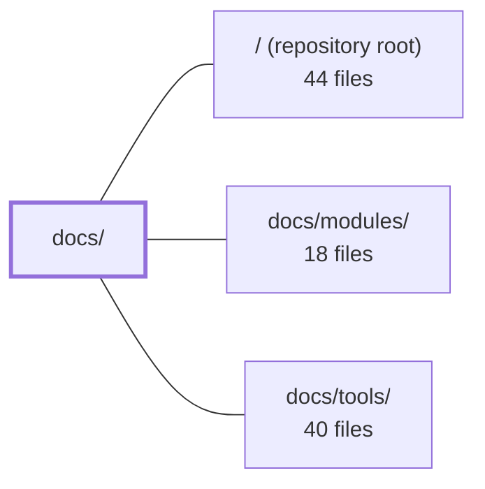

---
tags:
  - 2repo
  - 2repo/module
  - project/boilerplate-node-backend
type: module
module: docs/
files: 34
updated: 2026-08-31T20:49:19.351953+00:00
---

# docs/

## Purpose

The `docs/` module is the project's self-hosted documentation site (built with VitePress). It provides the full set of human-facing guides, API contract workflows, reference catalogues, and architectural theory pages that explain how the codebase is structured, how to change it, and why decisions were made.

## Key parts

- **Site scaffolding** — `.vitepress/config.mts` defines navigation, sidebar, and enables Mermaid rendering; `.vitepress/theme/index.ts` adds click-to-zoom on diagram SVGs.
- **Entry points** — `index.md` orients the reader to the five top-level sections; `getting-started.md` is a five-minute clone-to-running-app walkthrough.
- **`api/`** — Workflow and rationale for the OpenAPI and AsyncAPI contract ecosystems: how to edit fragments (`openapi-workflow.md`, `asyncapi-workflow.md`), ownership model (`contract-fragmentation.md`), regeneration steps (`regenerating.md`), design rationale per domain (`endpoints.md`), and the non-public observability routes (`observability.md`). `index.md` routes readers to the right sub-page.
- **`reference/`** — One-file-per-directory catalogues that answer "what is this file and what produces it?" for the repo root (`root.md`, `scripts.md`), `src/` tiers (`src-app.md`, `src-infrastructure.md`, `src-modules.md`), contracts (`contracts.md`), database layer (`data.md`), ops/CI assets (`ops.md`), and the test suite (`tests.md`). `reference/index.md` is the navigation hub.
- **`theory/`** — Architectural concepts: tier/layer folder map (`layers.md`, `modules.md`), five-block overview (`architecture.md`), request lifecycle (`request-flow.md`, `request-input.md`), DDD scope (strategic + tactical), domain-folder convention (`domain-layer.md`), clustering model (`clustering.md`), per-context vocabulary (`glossary.md`), and a sequenced onboarding reading path (`reading-path.md`).

## How it connects

- **`/` (repository root)** — The reference pages (`root.md`, `scripts.md`, `ops.md`) catalogue and explain the configuration, script, and ops files that live at the repo root; the API workflow pages reference the build/bundle commands defined in `package.json`.
- **`docs/modules/`** — Contains per-domain (per-module) documentation. The theory pages (`modules.md`, `module-lifecycle.md`) and reference pages (`src-modules.md`) define the conventions that those per-module docs follow; `glossary.md` defines the ubiquitous-language terms each module doc assumes.
- **`docs/tools/`** — Houses tooling documentation (e.g., `package-scripts.md`). The `reference/scripts.md` page explicitly complements it by describing *what* each script file is, while `docs/tools/` explains *when* to run each `npm run` entry.

## Where to start

1. **`docs/index.md`** — Gives the full section map and the fastest entry point for whatever question you have; read it once and you'll know which sub-directory to open.
2. **`docs/theory/layers.md`** — Defines the two axes (tiers × layers) that determine where any file belongs. Every other page in the module assumes you understand this, so internalising it first makes the rest of the docs (and the codebase itself) far easier to navigate.

## Connected modules

[[boilerplate-node-backend_ROOT|/ (repository root)]] · [[boilerplate-node-backend_docs_modules|docs/modules/]] · [[boilerplate-node-backend_docs_tools|docs/tools/]]

## Files
- `docs/.vitepress/config.mts` — VitePress configuration file that defines the site title, description, local search, top-level navigation, and the full sidebar structure for the project's documentation site. It also wraps the config with the Mermaid plugin so diagram blocks render natively in the docs.
- `docs/.vitepress/theme/index.ts` — VitePress custom theme entry point that extends the default theme and adds a click-to-zoom interaction for Mermaid diagrams rendered in the docs. It injects a full-screen overlay (cloning the SVG) when a user clicks a diagram, with backdrop-click or Escape-key dismissal.
- `docs/api/asyncapi-workflow.md` — Documents the full lifecycle of the async (event-driven) contract: how `asyncapi.yaml` is authored from per-section source documents, split into a full and a public bundle, validated, and turned into generated TypeScript types. It exists so contributors understand *where to edit*, *why the split is by section*, and *what is enforced in CI* without reverse-engineering the scripts.
- `docs/api/contract-fragmentation.md` — Documents the **ownership model** for shared API contracts (OpenAPI and AsyncAPI): which repo owns what, how per-module fragments are compiled/merged into the seven committed bundles, and how the frontend receives byte-identical copies. It complements `openapi-workflow.md` (which covers *how to change* the contract) by covering *who owns it, where it lives, and how it reaches the frontend*.
- `docs/api/endpoints.md` — Design-rationale companion to the API route table. `openapi.yaml` says *what* each route accepts and returns; `src/modules/<name>/routes.ts` says *how* the middleware chain enforces it; this page says *why* the surface is shaped the way it is, domain by domain. It exists to prevent future changes from contradicting decisions that are otherwise invisible in code or contract.
- `docs/api/index.md` — Landing page for the API documentation section. It gives a one-glance overview of the API contract ecosystem (OpenAPI spec → tooling → implementation → tests), states the core conventions for REST style, and routes readers to the correct sub-page based on their task. It exists so neither humans nor AI need to guess which doc covers a given API question.
- `docs/api/observability.md` — API reference for the five `/observability/*` routes that expose operational data (health, KPIs, audit, SSE metrics, Prometheus text) for internal dashboards and monitoring scrapers. All routes are non-public and use one of three bespoke auth mechanisms rather than the standard admin JWT.
- `docs/api/openapi-workflow.md` — Documents the OpenAPI contract workflow for this boilerplate: the rule that per-module YAML fragments (not the bundled `openapi.yaml`) are the single source of truth, and the exact sequence of bundle → lint → mock → codegen → implement → test steps that keeps backend, generated types, and frontend consumers in sync.
- `docs/api/regenerating.md` — Quick-reference cheat sheet for "I edited a fragment — now what does the pipeline need?" It documents the regeneration pipeline (bundle → generate → seed → sync), the dependency ordering that makes it non-trivial, and the verification gates that catch skipped steps. It complements `contract-fragmentation.md` (the *why*) with the *how*.
- `docs/getting-started.md` — Onboarding guide that takes a developer from a fresh clone to a browsable, seeded API in roughly five minutes. It documents the primary (container-first) setup path, a secondary host-mode path, verification steps, and a map to deeper documentation.
- `docs/index.md` — Landing page for the Docusaurus-based documentation site. It orients a reader (human or AI) to the boilerplate's stack, the five top-level doc sections, and the fastest paths to the info they need. All navigation, feature bullets, and diagrams live here; deeper content lives in the linked sub-pages.
- `docs/reference/contracts.md` — Reference page for the contract system: it maps every contract-related file (sources, bundled specs, generated code, lint rulesets, client collections) to what it is and which command produces it, so a developer knows what to edit versus what is regenerated.
- `docs/reference/data.md` — Reference page documenting the `db/` directory: the split between **schema ownership** (migrations via `migrate-mongo`) and **data ownership** (seeding via per-module fixtures), plus the supporting tools for cache clearing and one-shot scripts. It exists so a reader can orient in the database layer without opening each file.
- `docs/reference/index.md` — Entry-point and navigation hub for the `docs/reference/` section. When you land on an unfamiliar filename, this page tells you what it is, what breaks without it, and which sibling page (or theory page) explains the concept behind it — in one hop. It is a map, not a theory page; it deliberately defers all deeper explanation to linked pages.
- `docs/reference/ops.md` — A reference index for every non-application-code asset in the repository: the Docker compose stacks, Dockerfiles, the full observability config chain, CI/CD workflows, rendered EJS templates, and static public assets. It exists so a reader (human or AI) can locate and understand an operational file by name without searching the tree.
- `docs/reference/root.md` — A reference catalogue of every file that lives directly in the repository root. It exists to answer "why is this file here and what does it do?" in one glance, with a pointer to deeper documentation for each entry. It groups root files by concern (entry points, package/TS, lint, test runners, codegen, Git) so a reader does not have to open `package.json`, `eslint.config.ts`, or `migrate-mongo-config.js` individually to understand their roles.
- `docs/reference/scripts.md` — Reference catalogue of every file in `scripts/`, `eslint/rules/`, and `.husky/`. It explains *what each file is* (its role, its output, whether it is a CLI or a library), complementing `tools/package-scripts.md`, which explains *when* to run each `npm run` entry.
- `docs/reference/src-app.md` — Reference catalog for the top of `src/`: the three boot files, the `src/app/` assembly steps, the `src/kernel/` module system, and the `src/types/` contract surface. It exists so a reader can locate any file in these four areas and understand its role in the dependency chain (`infrastructure → kernel → modules → app`) without opening the source.
- `docs/reference/src-infrastructure.md` — Documents `src/infrastructure/`, the bottom tier of the application — everything the app runs *on* (runtime, adapters, HTTP plumbing, persistence, observability, i18n, surfaces) and nothing about any domain. It exists so a reader can locate the "outside the app" layer without reading source, and to make the hard boundary (enforced by `eslint.config.ts`) explicit.
- `docs/reference/src-modules.md` — Catalogues every file **shape** that can appear under `src/modules/<domain>/` and maps each shape to the modules that carry it. It exists so a reader can recognise any file in the 13-module tree by its pattern alone, without needing to know the specific domain. It is the single source of truth for "what belongs where" inside a module folder.
- `docs/reference/tests.md` — Documents the test suite architecture: where tests live (co-located vs. `tests/`), the hierarchy of suites (unit → cross-cutting → integration → contract → fuzz), and the project's stance on mutation testing as the primary quality instrument over coverage as a proxy. Exists so a reader can identify *which* test guarantees a specific rule without opening the file.
- `docs/theory/architecture.md` — Describes the five major architectural blocks (Contract, Entry, Business core, Persistence, Cross-cutting tools) and the boundaries between them. Exists to answer *"which blocks talk to each other?"* — a conceptual question distinct from the folder-mapping question handled by `layers.md`.
- `docs/theory/clustering.md` — Explains the primary/worker clustering model and the graceful-shutdown sequence so a reader (human or AI) understands *why* the app forks one process per CPU core, how crash backoff works, and the exact order in which a worker tears down its resources on `SIGTERM`.
- `docs/theory/domain-layer.md` — Explains the `domain/` folder convention in this codebase and its relationship to DDD. It defines what qualifies as a domain rule (testable without a database), how the boundary is enforced via ESLint, and which of the thirteen modules actually have a `domain/` folder. It also situates the pattern within four broader architectural traditions (DDD, Hexagonal, Onion, Clean Architecture) so readers arriving from a non-DDD background understand why the folder exists.
- `docs/theory/glossary.md` — Defines the ubiquitous-language terms **per bounded context** (module), capturing the meaning and constraint behind each identifier that the code itself cannot express. It exists to make cross-module divergence of terminology explicit and intentional, rather than hidden in a shared dictionary.
- `docs/theory/index.md` — Landing page for the **Theory** documentation section. It defines the two load-bearing terms used across every theory page (*domain* and *barrel*), lists the architectural strategies the boilerplate follows, and provides a topic-to-file navigation table so readers can jump directly to the page they need without reading every theory document sequentially.
- `docs/theory/layers.md` — Folder map for the codebase: defines the two orthogonal axes that determine where any file lives — **tiers** (what a file is allowed to know: `app` → `modules` → `kernel` → `infrastructure`) and **layers** (what a file does within a domain: `routes` → `controllers` → `service` → `repository` → `model`). Consult it before asking "where does this go?" or "why can't I import that?"
- `docs/theory/module-lifecycle.md` — The concrete, step-by-step procedure for adding or removing a domain module, including the exact registries to edit, the commands to run, and the paired-repo steps. It is the "what you actually type" companion to the conceptual reasoning in `modules.md`.
- `docs/theory/modules.md` — Explains the four-tier directory architecture (`app` → `modules` → `kernel` → `infrastructure`), the one-directional dependency rule, and the exact criterion for deciding which tier a file belongs to. Exists so that adding or removing a domain is a mechanical act (one folder, one registry line) and so the `kernel`/`infrastructure` boundary — the line people most often cross — has a single unambiguous test.
- `docs/theory/reading-path.md` — A sequenced onboarding guide that tells a new reader exactly which nine source files to open, in what order, and what to skip. It exists so a contributor can build a correct mental model of the architecture without reading all ~21,000 lines of production code.
- `docs/theory/request-flow.md` — Documents the end-to-end path a single HTTP request takes through the middleware chain, the four-layer module internals (controller → service → repository → model), and the shared substrates (Redis, RabbitMQ, MongoDB). Also covers the three parallel observability signal streams and the cross-cutting conventions (audit emission, validation placement, error interpretation) that every module follows.
- `docs/theory/request-input.md` — Single written statement of which input sources (route params, query string, body) each endpoint reads, in what precedence order, and how values are treated on the way in. It exists so that controllers name a **surface** rather than re-deriving the polymorphism rules per call site, and so the closed set of source combinations stays reviewable against the spec.
- `docs/theory/strategic-ddd.md` — Documents the four strategic-level DDD patterns this repo actually adopts — bounded contexts, context mapping, ubiquitous language, and subdomain distillation — and frames each in terms of where the claim lives (folder, docblock, identifier, barrel) versus where enforcement lives (ESLint, structural import rules). Explicitly scoped to the *strategic* half; tactical patterns (entities, aggregates, domain repositories) are deferred to `tactical-ddd.md` and `TACTICAL_DDD_PLAN.md`.
- `docs/theory/tactical-ddd.md` — Documents the two tactical DDD patterns this repo deliberately adopts (a lifecycle transition table and server-computed capability actions) and explicitly prices the patterns it does **not** adopt (aggregates, domain repositories, mappers, read models). Exists to justify the selective scope, prevent un-warranted expansion, and record the rationale for each structural choice so a reader can evaluate whether adding a third pattern clears the adoption bar.

---
[[boilerplate-node-backend_INDEX|← boilerplate-node-backend index]]
