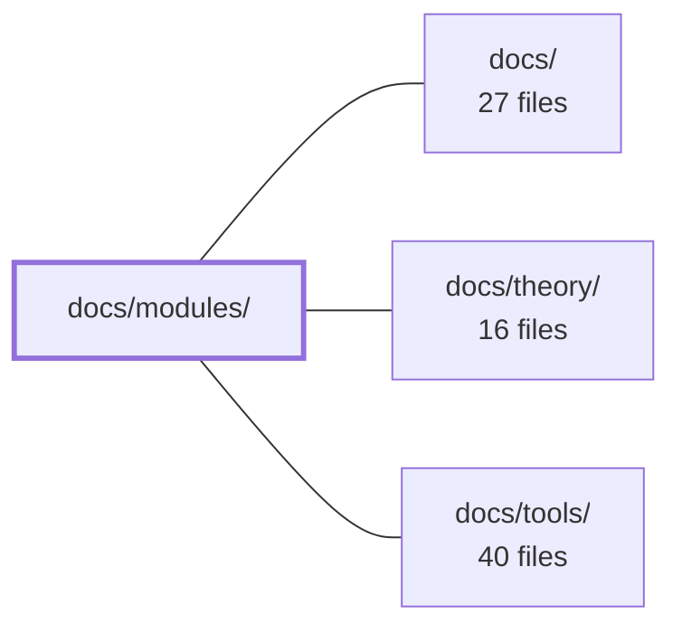

---
tags:
  - 2repo
  - 2repo/module
  - project/boilerplate-node-backend
type: module
module: docs/modules/
files: 18
updated: 2026-09-02T18:30:23.869089+00:00
---

# docs/modules/

## Purpose

This directory is the per-module documentation section of the codebase wiki. Each file here is a reference page for one domain module (or a tightly scoped subsystem within one), covering its responsibilities, invariants, state machines, and how it fits the cross-module dependency graph. It sits alongside `docs/theory/` (architectural rationale) and `docs/tools/` (development workflow) as the "what each part does" layer of the wiki.

## Key parts

- **Landing & orientation**
  - `index.md` — Defines what a module page is, shows the cross-module dependency graph, lists every module by DDD strategic tier, and maps backend-to-frontend pairings. Read this before diving into any single module page.

- **Core commerce domain pages**
  - `account.md`, `account-sessions.md` — Authentication authority and the token lifecycle (signing, rotation, clearing) that lives behind it.
  - `cart.md`, `cart-checkout.md` — Per-user cart pricing and the 9-step checkout pipeline that ends the cart.
  - `orders.md`, `payments.md`, `payments-provider-port.md` — Order aggregate, the monetary side of a purchase, and the provider abstraction that keeps PSP choice a deployment decision.
  - `products.md` — Catalogue schema, soft deletion, and the single `product.deleted` domain event.
  - `inventory.md`, `inventory-reservations.md` — Single writer for stock counters and the conditional-claim reservation lifecycle.
  - `delivery.md` — Shipping-rate functions and the shipment/parcel record the cart prices against.

- **Supporting & cross-cutting pages**
  - `users.md` — The user record and repository (dependency-free leaf; no auth logic).
  - `wishlist.md` — Minimal per-user product list; the simplest example of the repo's module pattern.
  - `locales.md` — File-based dictionaries plus runtime override rows for i18n.
  - `feedback.md` — The only unauthenticated write path and its admin triage workflow.
  - `audit-logs.md` — The `auditlogs` collection, write-sink installation, and 90-day TTL.
  - `observability.md` — Operator-facing HTTP surface (health, metrics, SSE, audit read) owned by this module, not the data collection layer.

## How it connects

- **`docs/`** — This directory is a first-level section of the top-level `docs/` wiki. The top level provides global navigation, conventions, and links that point into `docs/modules/`.
- **`docs/theory/`** — Module pages reference DDD concepts (strategic tiers, bounded contexts, shared-kernel edges, ports/adapters) whose definitions and rationale live in the theory section. `index.md` explicitly groups modules by those tiers, so a reader needs the theory pages to interpret the grouping.
- **`docs/tools/`** — Tooling pages (test runners, lint configs, deploy scripts) are the "how to work in the repo" layer; module pages occasionally point a reader there for build/test commands relevant to a specific module but do not duplicate that content.

## Where to start

1. **`index.md`** — It is explicitly the orientation page: it defines the module-page contract, draws the dependency graph, and groups every module by tier. Reading it first means every subsequent module page has context.
2. **`account.md`** — After the overview, this is the highest-leverage single module to read because it is "the only `shared-kernel` edge in the repo": every auth guard in the app resolves through it, so understanding its boundary clarifies why other modules never import session logic directly.

## Connected modules

[[boilerplate-node-backend_docs|docs/]] · [[boilerplate-node-backend_docs_theory|docs/theory/]] · [[boilerplate-node-backend_docs_tools|docs/tools/]]

## Files
- `docs/modules/account-sessions.md` — Documents the session/token subsystem inside the `account` module: how access and refresh tokens are signed, verified, stored, rotated, and cleared, and why none of it is importable from outside `session/`.
- `docs/modules/account.md` — Documents the `account` module, the application's sole authority for authentication (signup, login, token refresh, password reset, logout-everywhere, two-step deletion) and the per-account address book. It is the only `shared-kernel` edge in the repo: it fills the `kernel/authentication.ts` port at import time, so every guard in the app resolves through it.
- `docs/modules/audit-logs.md` — Owns the `auditlogs` MongoDB collection and installs the write-sink (`record`) that ~53 `emitAuditEvent` call sites reach through `@infrastructure/observability/audit`. It declares no router; its sole responsibility is to store audit entries and enforce the 90-day retention window via a TTL index.
- `docs/modules/cart-checkout.md` — Documents the `POST /cart/checkout` endpoint — the sole cart operation that writes into another module's collection. It orchestrates a fixed 9-step sequence across five modules to convert a cart into an order, with all validation resolved before any write occurs.
- `docs/modules/cart.md` — Owns one cart document per user (keyed by `userId`), prices its lines against the live catalogue, and executes the checkout pipeline that ends the cart. It is the convergence point where price, stock, address, shipping, and order creation must all agree in a single transactional sequence.
- `docs/modules/delivery.md` — Documents the delivery module, which owns shipping-rate calculations, shipment records, and a fake courier that advances parcels from `shipped` to `delivered`. It exists so the cart can price a checkout against pure rate functions without learning that a shipment record exists, and so the order lifecycle can create a parcel and notify the recipient when shipping begins.
- `docs/modules/feedback.md` — Documents the contact-request (feedback) module: an open form anyone can submit (the only unauthenticated write in the app) and the admin triage workflow around it. Exists as a reference page so readers understand the status lifecycle, honeypot mechanics, and retention policy without opening the source.
- `docs/modules/index.md` — Landing page for the modules section. It defines what a module page is (a "decision" owned by one domain, as opposed to a "mechanism" owned by a horizontal page), shows the cross-module dependency graph, lists every module grouped by DDD strategic tier, and records the backend-to-frontend module pairing. It exists so a reader can orient before choosing a specific module page.
- `docs/modules/inventory-reservations.md` — Documents the reservation subsystem inside the inventory module: the four state transitions that move `onHand`/`reserved` counters, the conditional-claim mechanism that guarantees exactly-once semantics without locks or transactions, and the admin sweep that expires stale holds. Exists so readers understand the sole writer path for inventory counters and the invariants that make it safe under concurrency.
- `docs/modules/inventory.md` — Single writer for all stock-counter changes (`onHand`, `reserved`) and the `stockmovements` audit ledger. It owns the reservation lifecycle (hold → commit/release) and guarantees exactly-once transitions via conditional claims on reservation status. No other module touches the counters.
- `docs/modules/locales.md` — Documents the dependency-free `locales` module, which owns two things: the set of languages the deployment speaks (Tier 1, file-based dictionaries loaded into i18next at boot) and the runtime override rows (Tier 2, one per `locale · scope · key`) that patch those dictionaries without touching source files. It exists so copy can be edited at runtime while remaining available during full backend outages.
- `docs/modules/observability.md` — Documents the observability module: the operator-facing HTTP surface (health, metrics overview, Prometheus scrape, live SSE stream, audit read) that exposes process-level measurements collected by `infrastructure/observability`. It owns routes and authentication, not data — it has no model, no repository, and no barrel.
- `docs/modules/orders.md` — Documents the **orders** module: the owner of placed orders, their frozen line items, the status state machine, and the invariants around what cancelling restores. It is the strongest aggregate candidate in the system and the module whose `status` enum acts as the public vocabulary three sibling modules react to.
- `docs/modules/payments-provider-port.md` — Defines the `PaymentProvider` interface — the single contract the payments service calls for charges and refunds — so that which real provider is wired in is a deployment decision (env variable), not a code path. Shipped with one in-process `fake` implementation; a real PSP plugs in as one additional file.
- `docs/modules/payments.md` — Owns the monetary side of an order: creating a payment intent that freezes the total, and confirming the payment that moves the order to `paid` and commits held inventory. All provider-specific logic sits behind a port, so the rest of the system is processor-agnostic.
- `docs/modules/products.md` — Documents the **products** module — the shop's catalogue and the leaf domain that `cart`, `inventory`, `orders`, and `wishlist` all conform to. It defines what a product looks like (`productSchema`), how soft deletion works, and the one domain event (`product.deleted`) that lets this module reach back into other modules without importing them.
- `docs/modules/users.md` — Documents the `users` module — the owner of the user record (email, password hash, admin flag, and the reset/refresh token subdocument) and its repository. It is a dependency-free leaf in the module graph; five sibling modules import it, and it imports none. Authentication is deliberately *not* here; that logic lives in `account`, a second service over the same collection.
- `docs/modules/wishlist.md` — Documents the wishlist module — the smallest domain in the repo. It owns one wishlist document per user that holds product references and nothing else. Serves as the simplest reference for understanding the repo's module pattern (same shape as `cart`, without checkout complexity).

---
[[boilerplate-node-backend_INDEX|← boilerplate-node-backend index]]
