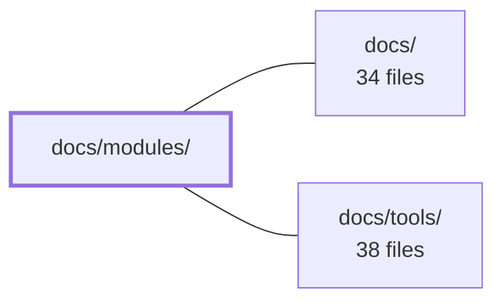

---
tags:
  - 2repo
  - 2repo/module
  - project/boilerplate-node-backend
type: module
module: docs/modules/
files: 18
updated: 2026-08-27T18:00:13.026860+00:00
---

# docs/modules/

## Purpose

`docs/modules/` is the wiki's **module** (vertical/domain) section. Each file here documents one domain module of the codebase—what it owns, the key decisions and invariants behind its design, and how it relates to sibling modules. The pages exist so a reader can understand a module's boundary and rationale without re-deriving the logic from source files.

## Key parts

- **`index.md`** — The section's entry point. Defines the division of labour between module pages (own a *decision*) and horizontal pages (own a *mechanism*), lists every domain module grouped by DDD subdomain, and documents the backend ↔ frontend module pairing including deliberate asymmetries.
- **Catalogue & stock** — `products.md` (catalogue + stock counters), `inventory.md` (sole writer of `onHand`/`reserved` + stock-movements ledger), `inventory-reservations.md` (the four state transitions and conditional-claim invariants).
- **Purchase flow** — `cart.md`, `cart-checkout.md` (the 9-step orchestration across five modules), `orders.md` (status state machine + cancellation semantics), `payments.md` / `payments-provider-port.md` (money behind a provider port), `delivery.md` (rates, shipment records, fake courier).
- **Identity & auth** — `users.md` (leaf user record), `account.md` (session lifecycle, the single auth resolver), `account-sessions.md` (token signing/verification/cookie transport internals).
- **Supporting & operational** — `feedback.md` (open contact form, leaf module), `wishlist.md` (smallest domain, product references only), `locales.md` (language support + runtime override rows), `observability.md` (operator-facing HTTP surface), `audit-logs.md` (headless audit-trail sink).

## How it connects

This directory is a sub-section of the broader `docs/` wiki. The `docs/` page defines the overall wiki structure (module pages vs. horizontal/mechanism pages, conventions, reading order), while `docs/modules/` supplies the concrete per-domain content under that framework. No other wiki section feeds into or is consumed by this directory beyond that parent–child relationship.

## Where to start

1. **`index.md`** — Read first; it maps every module, explains the page-level conventions, and shows how backend and frontend modules pair up.
2. **`products.md`** — A representative "leaf" domain module with zero inbound dependencies. Understanding its shape (model + repository, no aggregate, no service) makes the ownership boundaries of the more complex modules (inventory, cart, orders) click immediately.

## Connected modules

[[boilerplate-node-backend_docs|docs/]] · [[boilerplate-node-backend_docs_tools|docs/tools/]]

## Files
- `docs/modules/account-sessions.md` — Documents the internal session subsystem of the `account` module: how access and refresh tokens are signed, verified, and carried via cookies. It exists so readers understand the auth-resolution chain without re-deriving it from three source files (`config.ts`, `jwt.ts`, `cookies.ts`).
- `docs/modules/account.md` — Documents the `account` module, which owns session lifecycle (signup, login, refresh, password reset, logout-everywhere, two-step deletion) and the per-account address book. It registers the application's single auth resolver at import time, answering the kernel's "who is making this request?" question for every guard.
- `docs/modules/audit-logs.md` — Headless domain module that owns the queryable audit-trail collection and installs its sink at import time. It exists so that audit storage can be toggled as a unit without naming a domain from the assembly file (`app.ts`). No router is declared here; the single read endpoint lives in `observability`.
- `docs/modules/cart-checkout.md` — Documents the `POST /cart/checkout` endpoint — the sole cart operation that writes into another module's collection. It orchestrates a fixed 9-step sequence across five modules to convert a cart into an order, with all validation resolved before any write occurs.
- `docs/modules/cart.md` — Documents the cart module: a per-user collection (one document per `userId`) that holds priced line items against the live catalogue and terminates in a checkout. It is the single point where price, stock, address, shipping, and order creation must all agree atomically.
- `docs/modules/delivery.md` — Models the delivery domain: shipping rates (as pure functions), shipment records, and a fake courier that transitions parcels from `shipped` to `delivered`. Exists so the shop can price and track deliveries per order without an external integration.
- `docs/modules/feedback.md` — Documents the feedback (contact-request) module: an open form anyone can use to file a message by email address, with an admin triage workflow. It exists as a leaf module (no dependencies, no dependents) to give the module system a simple reference point.
- `docs/modules/index.md` — Index page for the **modules** (vertical/domain) section of the wiki. It defines the division of labour between module pages (own a *decision*) and horizontal pages (own a *mechanism*), lists every domain module grouped by DDD subdomain, and documents the backend ↔ frontend module pairing — including the deliberate asymmetries.
- `docs/modules/inventory-reservations.md` — Documents the reservation subsystem inside the inventory module: the four state transitions that move `onHand`/`reserved` counters, the conditional-claim mechanism that guarantees exactly-once semantics without locks or transactions, and the admin sweep that expires stale holds. Exists so readers understand the sole writer path for inventory counters and the invariants that make it safe under concurrency.
- `docs/modules/inventory.md` — Sole owner and writer of the two stock counters (`onHand`, `reserved`) that physically live on the product document, plus the `stockmovements` ledger. Every inventory mutation in the system routes through this module's four transitions; no other code writes those counters.
- `docs/modules/locales.md` — Documents the locales module, which defines which languages this deployment supports and how runtime override rows (one per `locale, scope, key`) patch the bundled translation files. It exists so operators can edit copy without touching source code, while the filesystem remains the source of truth for *which* keys exist.
- `docs/modules/observability.md` — Documents the observability module — the operator-facing HTTP surface (health, metrics overview, live SSE stream, Prometheus scrape endpoint, audit read). This page exists so a reader can understand the module's boundary, its per-route authentication choices, and its deliberate absence of a barrel export without reading the source.
- `docs/modules/orders.md` — Documents the orders module: the aggregate that owns line-item snapshots, the order status state machine, and the semantics of cancellation (unit release + refund). It exists to make the invariants explicit so no other module silently reinterprets them.
- `docs/modules/payments-provider-port.md` — Defines the `PaymentProvider` interface — the single contract the payments service calls for charges and refunds — so that which real provider is wired in is a deployment decision (env variable), not a code path. Shipped with one in-process `fake` implementation; a real PSP plugs in as one additional file.
- `docs/modules/payments.md` — Documents the payments module, which owns an order's money behind a provider port. The intent freezes an order's total; the confirm moves the order to `paid` and commits the inventory hold into a sale. It also handles the refund path triggered by `order.cancelled`.
- `docs/modules/products.md` — Documents the products module, which owns the shop catalogue (product CRUD) and the two stock counters (`onHand`, `reserved`) that live on every product row. It is a leaf module with zero inbound dependencies; four other domains conform to its shape rather than the reverse.
- `docs/modules/users.md` — Documentation for the **users** module: the leaf node in the dependency graph that owns the user record (email, password hash, admin flag, and the `tokens` subdocument for reset/refresh). It exposes no aggregate and no service—just the model and repository—because authentication and the token lifecycle are handled by the sibling `account` module.
- `docs/modules/wishlist.md` — Documentation page for the **wishlist** module — the smallest domain in the repo. It defines one wishlist document per user holding product references, with no checkout complexity. The page exists to let readers understand the module's shape, its three one-way dependencies, and its complete independence from the rest of the system.

---
[[boilerplate-node-backend_INDEX|← boilerplate-node-backend index]]
