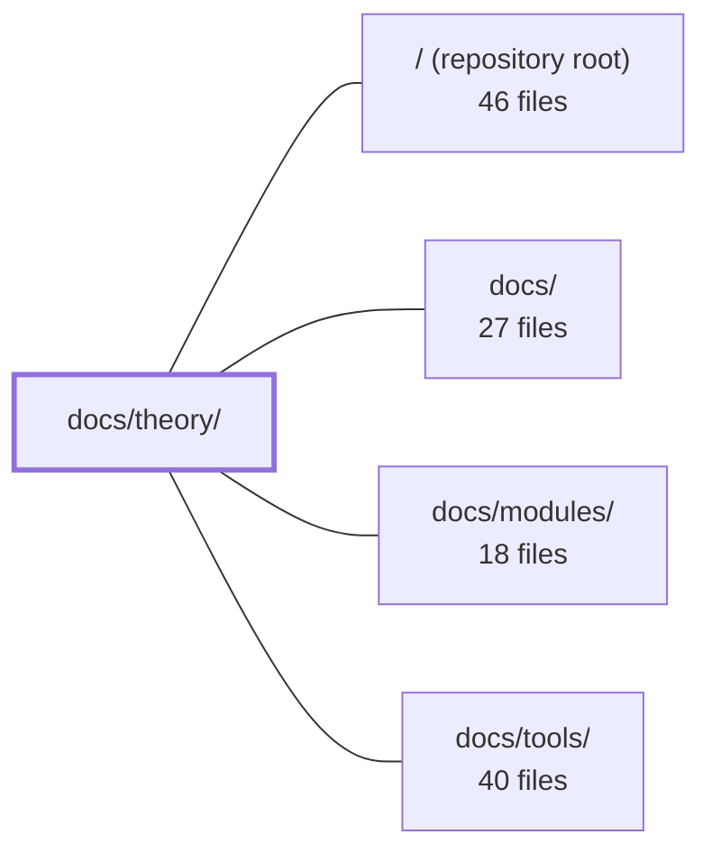

---
tags:
  - 2repo
  - 2repo/module
  - project/boilerplate-node-backend
type: module
module: docs/theory/
files: 16
updated: 2026-09-02T18:30:37.955025+00:00
---

# docs/theory/

## Purpose

`docs/theory/` is the conceptual documentation layer for the codebase. It answers the "why" and "where does it belong" questions — architectural boundaries, the tier/layer folder model, DDD adoption strategy, request flow, clustering semantics, security posture, and GDPR accountability — without prescribing line-by-line implementation. Every page is a reference a human or AI reader consults *before* writing or reviewing code, so decisions are anchored in documented rationale rather than tribal knowledge.

## Key parts

- **Architecture & folder model** — `architecture.md` (five top-level blocks), `modules.md` (four-tier dependency rule), `layers.md` (orthogonal tiers × layers grid), `module-lifecycle.md` (mechanical add/remove procedure). Together they answer "where does this file go?" and "why can't I import that?"
- **DDD documentation** — `domain-layer.md` (folder convention + ESLint enforcement), `strategic-ddd.md` (bounded contexts, context mapping, ubiquitous language), `tactical-ddd.md` (two adopted patterns + explicit non-adoption pricing). Together they scope what DDD means in this repo and where the line is drawn.
- **Request lifecycle** — `request-flow.md` (end-to-end path through middleware, four layers, and shared substrates), `request-input.md` (closed set of input-source combinations per endpoint). Together they define the runtime contract every module must honour.
- **Operations & security** — `clustering.md` (primary/worker fork model, SIGTERM teardown order), `data-protection.md` (GDPR Art. 30/15–21/33–34 records), `web-attack-catalog.md` (theory-only attack checklist), `web-attack-defences.md` (attack → control mapping for auth/session).
- **Navigation & shared vocabulary** — `index.md` (landing page, routing table), `reading-path.md` (nine-file onboarding sequence), `glossary.md` (per-bounded-context ubiquitous language).

## How it connects

- **`/` (repository root)** — Every page in this module describes, constrains, or justifies a decision made in the production source tree at the root. The tier/layer rules in `modules.md` and `layers.md` are the normative contract the root-level code must satisfy.
- **`docs/`** — Parent directory. `docs/theory/` sits alongside `docs/modules/` and `docs/tools/` as the "why" sibling to the "what" (per-module references) and "how-to" (developer tooling) sections. Cross-references flow theory → modules (e.g., `glossary.md` defines terms that `docs/modules/` pages then use) and theory → tools (e.g., `domain-layer.md` cites the ESLint rule that enforces the boundary).
- **`docs/modules/`** — Per-module documentation that operationalises the conventions defined here. `glossary.md` explicitly scopes its terms per bounded context, and `domain-layer.md` lists which of the thirteen modules actually carry a `domain/` folder; the module pages reference those entries rather than re-explaining the pattern.
- **`docs/tools/`** — Developer-tooling documentation (linting, build, test runners). Theory pages cite tools as the enforcement mechanism (ESLint for import-direction rules, structural import checks for context boundaries) without re-documenting the tool configuration itself.

## Where to start

1. **`docs/theory/index.md`** — One read orients you to the section's structure, the two most-repeated terms (domain, barrel), and the correct sub-page for your question.
2. **`docs/theory/modules.md`** — The single most load-bearing page: it defines the four-tier dependency rule and the `kernel`/`infrastructure` boundary test. Once you internalise those two rules, the rest of the theory docs (layers, DDD, request-flow) read as specialisations rather than new concepts.

## Connected modules

[[boilerplate-node-backend_ROOT|/ (repository root)]] · [[boilerplate-node-backend_docs|docs/]] · [[boilerplate-node-backend_docs_modules|docs/modules/]] · [[boilerplate-node-backend_docs_tools|docs/tools/]]

## Files
- `docs/theory/architecture.md` — Describes the five major architectural blocks (Contract, Entry, Business core, Persistence, Cross-cutting tools) and the boundaries between them. Exists to answer *"which blocks talk to each other?"* — a conceptual question distinct from the folder-mapping question handled by `layers.md`.
- `docs/theory/clustering.md` — Explains the primary/worker clustering model and the graceful-shutdown sequence so a reader (human or AI) understands *why* the app forks one process per CPU core, how crash backoff works, and the exact order in which a worker tears down its resources on `SIGTERM`.
- `docs/theory/data-protection.md` — GDPR accountability record for the controller (the party that deploys this codebase). Every entry is derived from specific code behaviour, not aspirational policy. It covers the Art. 30 processing register, the sub-processor list, the Art. 15–21 subject-request runbook, and the Art. 33/34 breach runbook.
- `docs/theory/domain-layer.md` — Explains the `domain/` folder convention in this codebase and its relationship to DDD. It defines what qualifies as a domain rule (testable without a database), how the boundary is enforced via ESLint, and which of the thirteen modules actually have a `domain/` folder. It also situates the pattern within four broader architectural traditions (DDD, Hexagonal, Onion, Clean Architecture) so readers arriving from a non-DDD background understand why the folder exists.
- `docs/theory/glossary.md` — Defines the ubiquitous-language terms **per bounded context** (module), capturing the meaning and constraint behind each identifier that the code itself cannot express. It exists to make cross-module divergence of terminology explicit and intentional, rather than hidden in a shared dictionary.
- `docs/theory/index.md` — Landing page and table of contents for the Theory section. It defines the two most-repeated terms in the docs (domain, barrel), lists the structural strategies the codebase follows, and routes readers to the correct sub-page for a given question. Exists so a reader (human or AI) can orient themselves before diving into any single theory page.
- `docs/theory/layers.md` — Folder map for the codebase: defines the two orthogonal axes that determine where any file lives — **tiers** (what a file is allowed to know: `app` → `modules` → `kernel` → `infrastructure`) and **layers** (what a file does within a domain: `routes` → `controllers` → `service` → `repository` → `model`). Consult it before asking "where does this go?" or "why can't I import that?"
- `docs/theory/module-lifecycle.md` — The concrete, step-by-step procedure for adding or removing a domain module, including the exact registries to edit, the commands to run, and the paired-repo steps. It is the "what you actually type" companion to the conceptual reasoning in `modules.md`.
- `docs/theory/modules.md` — Explains the four-tier directory architecture (`app` → `modules` → `kernel` → `infrastructure`), the one-directional dependency rule, and the exact criterion for deciding which tier a file belongs to. Exists so that adding or removing a domain is a mechanical act (one folder, one registry line) and so the `kernel`/`infrastructure` boundary — the line people most often cross — has a single unambiguous test.
- `docs/theory/reading-path.md` — A sequenced onboarding guide that tells a new reader exactly which nine source files to open, in what order, and what to skip. It exists so a contributor can build a correct mental model of the architecture without reading all ~21,000 lines of production code.
- `docs/theory/request-flow.md` — Documents the end-to-end path a single HTTP request takes through the middleware chain, the four-layer module internals (controller → service → repository → model), and the shared substrates (Redis, RabbitMQ, MongoDB). Also covers the three parallel observability signal streams and the cross-cutting conventions (audit emission, validation placement, error interpretation) that every module follows.
- `docs/theory/request-input.md` — Single written statement of which input sources (route params, query string, body) each endpoint reads, in what precedence order, and how values are treated on the way in. It exists so that controllers name a **surface** rather than re-deriving the polymorphism rules per call site, and so the closed set of source combinations stays reviewable against the spec.
- `docs/theory/strategic-ddd.md` — Documents the four strategic-level DDD patterns this repo actually adopts — bounded contexts, context mapping, ubiquitous language, and subdomain distillation — and frames each in terms of where the claim lives (folder, docblock, identifier, barrel) versus where enforcement lives (ESLint, structural import rules). Explicitly scoped to the *strategic* half; tactical patterns (entities, aggregates, domain repositories) are deferred to `tactical-ddd.md` and `TACTICAL_DDD_PLAN.md`.
- `docs/theory/tactical-ddd.md` — Documents the two tactical DDD patterns this repo deliberately adopts (a lifecycle transition table and server-computed capability actions) and explicitly prices the patterns it does **not** adopt (aggregates, domain repositories, mappers, read models). Exists to justify the selective scope, prevent un-warranted expansion, and record the rationale for each structural choice so a reader can evaluate whether adding a third pattern clears the adoption bar.
- `docs/theory/web-attack-catalog.md` — A theory-only reference catalog enumerating every class of web attack and underlying flaw, grouped by the attack surface layer (Human → Browser → Transport → Application → Data & infra). It exists as a checklist for threat-modelling new features: walk the groups top-to-bottom and ask "could this apply here?" It deliberately contains no codebase-specific logic; that mapping lives elsewhere.
- `docs/theory/web-attack-defences.md` — Maps each attack row from the Web Attack Catalog to the specific control and code location that stops it, so a "clean" verdict is always anchored to a named perimeter. It exists as the defence-side complement to the catalog's theory-only listing, scoped to authentication and session hardening.

---
[[boilerplate-node-backend_INDEX|← boilerplate-node-backend index]]
