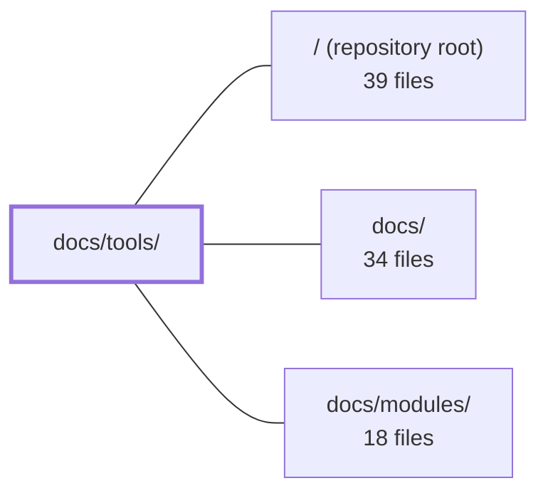

---
tags:
  - 2repo
  - 2repo/module
  - project/boilerplate-node-backend
type: module
module: docs/tools/
files: 38
updated: 2026-08-28T11:56:46.188604+00:00
---

# docs/tools/

## Purpose

`docs/tools/` is the reference library for every external tool, testing suite, and infrastructure concern in this boilerplate. It is not narrative documentation—it is a set of focused, single-topic pages that explain *what a tool does here, why it was chosen, and how to operate it*, so contributors (human or AI) never have to reverse-engineer intent from config files or `package.json`.

## Key parts

- **Orientation & entry points** — `index.md` (landing/TOC with a Mermaid tool-map), `tools-explained.md` (at-a-glance one-pager per tool), `runtime.md` (stack catalogue + request-pipeline flowchart), `package-scripts.md` and `package-dependencies.md` (intent-grouped command and dependency maps).
- **Testing suites** — `unit-testing.md`, `integration-testing.md`, `contract-testing.md` / `contract-request-data.md`, `concurrency-testing.md`, `cluster-testing.md`, `fuzz-testing.md`, `mutation-testing.md`, `property-testing.md`, `load-testing.md`. Together they cover all eight tiers; `testing-and-docs.md` and `testing-quickstart.md` tie the tiers into a single workflow.
- **Observability** — `observability-layer.md` (in-repo code wiring), `observability-reference.md` (config quick-reference), `events-and-logging.md` (disambiguation of the seven "something happened" mechanisms), plus per-signal pages: `winston.md` (logs/audit), `opentelemetry.md` + `tempo.md` (traces), `prometheus.md` (metrics), `loki.md` (log store), `grafana.md` (unified UI), `frontend-observability.md` (Faro/Alloy/Umami).
- **Infrastructure & data** — `docker-and-podman.md` (local container setup), `mongodb-mongoose.md` (persistence + migrations), `redis-cache.md` (optional HTTP cache), `rabbitmq.md` (optional message broker), `pairing-and-ports.md` (port/env contract with the frontend repo).
- **Security & domain-specific** — `security.md` (middleware + auth flow), `analytics.md` (product-event catalogue), `i18n.md` (per-request locale resolution), `email-and-rendering.md` (Nodemailer + PDF), `dependency-graph.md` (dependency-cruiser rules), `demo-profile.md` (in-memory API for e2e).

## How it connects

- **`/` (repository root):** Every page here documents a tool, script, or config that lives in the root (`package.json`, `docker-compose.yml`, `.dependency-cruiser.cjs`, `openapi.yaml`, etc.). This directory is the *why* and *how-to* layer; the root is the *what*.
- **`docs/`:** This is the `tools/` sub-section of the broader docs tree. Cross-references flow outward: tool pages link up to `docs/` for high-level architecture, and inward to specific code paths.
- **`docs/modules/`:** Sibling section. Several tool pages (observability-layer, integration-testing, security) reference per-module augmentation files, module-level integration tests, and module boundaries defined in `docs/modules/`. Conversely, module pages point back here for the shared tooling they rely on (test runners, observability wiring, auth middleware).

## Where to start

Read **`index.md`** first—it gives the full tool-map, a "why each tool exists" rationale, and routes you to the right page based on your intent. Then pick the page that matches your task (e.g., `testing-quickstart.md` if you're about to run tests, `runtime.md` if you're new to the stack). These two pages together take about two minutes and eliminate the need to search the directory blindly.

## Connected modules

[[boilerplate-node-backend_ROOT|/ (repository root)]] · [[boilerplate-node-backend_docs|docs/]] · [[boilerplate-node-backend_docs_modules|docs/modules/]]

## Files
- `docs/tools/analytics.md` — Documents the product-analytics event system: how business events are emitted from the service layer, how the provider (Umami / PostHog / none) is selected at deployment time, the naming and namespace conventions, and the cross-repo coordination rules that keep the Node, PHP, and frontend event catalogues coherent. It exists so business-question tracking has a single documented home, separate from operational (Prometheus) and per-request (Tempo) observability.
- `docs/tools/cluster-testing.md` — Documents the `npm run test:cluster` suite — the only test run that boots `src/cluster.ts` and forks real worker processes. It exists to catch a class of bug invisible to single-process tests: state that is correct within one worker but absent across the cluster (per-process counters, in-process caches). The primary target is the rate limiter, where a per-process budget silently multiplies by worker count.
- `docs/tools/concurrency-testing.md` — Documents the philosophy, rules, and file map for the race-condition test suite. It exists to answer "does the invariant still hold when N requests hit the same write path simultaneously?"—a question that mutation testing (serial by construction) and the other integration suites cannot cover. It prescribes *how* these tests must be written (invariants, `allSettled`, no ordering asserts) so that a future contributor does not silently weaken them.
- `docs/tools/contract-request-data.md` — Documents the request-side contract-testing tooling: a zod v4 schema-AST walker (`tests/support/contract-data.ts`) that generates valid and invalid payloads directly from the schema definitions in `api/schemas.zod.ts`. It exists to verify that every write endpoint accepts all contractually legal inputs and rejects all contractually illegal ones—something hand-written factories can't do because they encode a single known scenario rather than "any legal input."
- `docs/tools/contract-testing.md` — Documents the response-shape contract testing layer: validates that serialized JSON from real HTTP responses matches `openapi.yaml` exactly (including the absence of undeclared fields like `password` or `_id`). Complements the request-shape layer in `contract-request-data.md`.
- `docs/tools/demo-profile.md` — Documents the "demo" deployment profile: a self-contained, in-memory, disposable boot of the real API (no Docker, no Redis/RabbitMQ) used primarily by the paired Vue frontend's e2e suite and secondarily as a zero-setup way to exercise the API locally. It exists so the frontend can test against the actual code rather than a mock, with determinism coming from seeded fixtures.
- `docs/tools/dependency-graph.md` — Documentation for the dependency-cruiser check (`npm run check:dependencies`) that runs over `src/` using the config in `.dependency-cruiser.cjs`. It explains *why* this tool exists alongside ESLint boundaries (reachability and cycle detection—two questions a per-file linter cannot answer), and records the non-obvious config choices that make the rules actually functional.
- `docs/tools/docker-and-podman.md` — Documents the repo's single local container setup (`docker-compose.yml`), covering the app runtime, core data services, and the full observability stack. Also explains how Podman is supported as a drop-in alternative to Docker and the one non-trivial difference (log collection) between the two engines.
- `docs/tools/email-and-rendering.md` — Documents the boilerplate's two outbound-rendering subsystems—email (Nodemailer + EJS) and PDF invoice generation (puppeteer-core)—which operate outside the normal request/response cycle and are fully optional, activating only when their env vars or browser binary are configured.
- `docs/tools/events-and-logging.md` — Disambiguation and decision-guide page for the seven mechanisms in the codebase that record "something happened" (logger, audit, analytics, metrics, traces, SSE live feed, queue jobs). It exists to stop developers from reaching for the wrong one, to document which two cross a process boundary, and to clarify the in-process domain event bus so it is not mistaken for an observability signal or a broker substitute.
- `docs/tools/frontend-observability.md` — Documents how the paired frontend should be observed using a self-hosted, container-based stack (Grafana Faro + Alloy for errors/traces, Umami for product analytics) instead of SaaS tools. It explains the architecture, the `umami-init` seeding mechanism, and the upgrade path to heavier alternatives (Sentry, PostHog, GlitchTip) without requiring a rewrite.
- `docs/tools/fuzz-testing.md` — Documentation page for the spec-driven fuzzing test suite. It explains how the suite auto-discovers every operation in `openapi.yaml`, generates spec-valid but hostile requests via `fast-check`, drives them at the real app with `supertest`, and asserts no 5xx responses and full spec conformance. The page exists so readers (human or AI) can understand the fuzzer's design, limitations, and operational model without reading the source.
- `docs/tools/grafana.md` — Reference documentation for Grafana's role as the unified observability UI (traces, metrics, logs) in the local dev stack. Covers access details, provisioning locations, the trace-lookup workflow, and how each signal source (Tempo, Prometheus, Loki) connects to it.
- `docs/tools/i18n.md` — Documents how per-request locale resolution works in the API: why `t` is bound per-request via `getFixedT` + `AsyncLocalStorage` instead of using i18next's global instance, the four-file module layout behind `@infrastructure/i18n`, and the boundaries where the ambient `t` stops reaching code (queued work, boot-time callbacks, scripts).
- `docs/tools/index.md` — Serves as the landing page and table-of-contents for the entire `docs/tools/` section. It explains *why* each dependency exists, provides a visual tool-map (Mermaid flowchart), and routes readers to the correct tool-specific page based on intent (core, async, observability, project workflow).
- `docs/tools/integration-testing.md` — Documents the integration testing layer: the suite that drives the real `src/app.ts` Express app via `supertest` to verify wiring (middleware order, auth gates, routing) without asserting on business logic or requiring a live database. It also covers the second half of the tier — module-level tests under `src/modules/*/tests/integration/` that exercise real Mongoose behaviour.
- `docs/tools/load-testing.md` — Documents how to generate external load against the running API using autocannon, explains the two benchmark npm scripts (`bench` / `bench:search`), and guides the reader on which observability signals to correlate during a run. It exists so that load testing, result interpretation, and the rationale for external generation are recorded in one place.
- `docs/tools/loki.md` — Documents how **Grafana Loki** serves as the log store in this boilerplate: the container-log pipeline (Docker and Podman), the Promtail configuration, LogQL query examples, and how log lines correlate with Tempo traces.
- `docs/tools/mongodb-mongoose.md` — Documents the MongoDB + Mongoose persistence stack for this repo flavor: the role of each tool, the migration workflow (via `migrate-mongo`), and the seed/export architecture that produces a published snapshot of demo data. It exists so a reader can understand the persistence strategy and its invariants without tracing through source files.
- `docs/tools/mutation-testing.md` — Explains the project's mutation-testing workflow (powered by Stryker): what a mutant is, how to interpret kill/survive/no-coverage outcomes, how thresholds and the per-file ratchet gate CI, and the operational details that make runs fast (per-test coverage analysis, incremental mode, concurrency limits). Exists so developers can act on a "survived" finding without re-deriving the tool's vocabulary each time.
- `docs/tools/observability-layer.md` — Documents the **in-repo code** that makes up the observability layer: how five signals (logs, metrics, traces, audit, analytics) plus readiness and the SSE live stream are wired through shared infrastructure modules and per-module augmentation files. Pairs with the external-stack reference; this page is the code-side map.
- `docs/tools/observability-reference.md` — Quick-reference map of the boilerplate observability stack (traces, metrics, logs, alerts) with per-tool config tables. Exists so a developer or AI assistant can locate the relevant YAML config, understand each setting's intent, and know dev-vs-prod differences without reading every config file.
- `docs/tools/opentelemetry.md` — Documentation page for the OpenTelemetry (OTel) **trace** layer of the boilerplate. It explains the auto-instrumentation setup (no per-request code), the OTel Collector pipeline, environment-variable configuration, and how `trace_id` is automatically correlated between OTel spans and Winston log lines.
- `docs/tools/package-dependencies.md` — A quick-reference map of every dependency in `package.json`, grouped into purpose-based families (runtime core, security, persistence, messaging, observability, etc.) with a one-line "why" for each group and a link to the deeper doc page. It exists so a reader can orient themselves in the dependency surface without opening `package.json` or reading each individual tool doc.
- `docs/tools/package-scripts.md` — Groups the project's `package.json` scripts by job (runtime, validation, testing, benchmarking) instead of raw list order, so a developer or AI assistant can find the right command by intent rather than scrolling an alphabetized dump. It also documents two prefix wrappers (`host`, `compose`) that eliminate repeated script twins.
- `docs/tools/pairing-and-ports.md` — Documents the port-allocation contract between this API stack (owns `3000–3099` + well-known infra ports) and its paired frontend stack (owns `8080–8099`), the env-var pairings that must agree, the byte-identity gate for shared spec files, and how to expose the stack to other devices on a LAN.
- `docs/tools/prometheus.md` — Documents Prometheus as the boilerplate's metrics backend: what `/observability/metrics` exposes, the baseline alert rules, the Alertmanager wiring, the admin-facing observability endpoints, and the SSE metrics stream. Exists so developers know which metrics are available, how to read alerts, and where each config file lives without opening the Prometheus UI.
- `docs/tools/property-testing.md` — Documentation page that explains the repo's property-based testing approach: the rationale (generation + shrinking vs. sampled examples), the two determinism rules, the division of labor with example-based tests, and the map of where property test files live. Exists so a contributor can adopt the technique consistently without re-deriving conventions.
- `docs/tools/rabbitmq.md` — Documents how RabbitMQ is wired into the app as an optional message broker for offloading emails, PDF generation, and similar background work out of the request/response cycle. Serves as the single reference for the queue contract (queue names, dead-letter topology, publish/consume API) so contributors and AI assistants can add or modify workers without re-deriving the pattern.
- `docs/tools/redis-cache.md` — Documents how the project uses Redis as an **optional** server-side cache for repeated GET responses. The cache is split into a low-level byte-store adapter (get, set, invalidate-by-tag, clear) and an HTTP middleware layer that owns key construction, envelope format, TTL policy, and size limits. If Redis is unreachable the app fails open and continues serving from the database.
- `docs/tools/runtime.md` — Catalogs the project's runtime stack (Node.js, Express 5, Zod, Multer, i18next, dotenv, TypeScript, tsx) with a one-line justification for each, a request-pipeline flowchart, and the architectural layering conventions that govern how those pieces interact. It exists as a single reference point so readers don't have to infer the tech stack from `package.json` alone.
- `docs/tools/security.md` — Documentation page that catalogs the project's security tooling (Helmet, CORS, rate-limit, JWT, bcrypt, cookie-parser), explains the split-token auth architecture and its request flow, and records the rationale behind specific security decisions (rate-limit budgets, regex escaping, `trust proxy`, SSE cookie auth, metrics credential, 401-vs-403 policy). It exists so contributors and AI assistants can understand *why* the security middleware is configured the way it is without reverse-engineering the code.
- `docs/tools/tempo.md` — Documents the role of Grafana Tempo as the trace store in this boilerplate's observability stack: the data flow (App → OTel Collector → Tempo → Grafana), the runtime configuration, and how to query traces. Exists so readers know Tempo is never queried directly and is always accessed through Grafana.
- `docs/tools/testing-and-docs.md` — Hub page that maps the project's eight testing layers, links to each layer's detail page, explains how to interpret test-run reports, and documents where test data comes from. It exists so a reader can orient themselves before diving into any individual testing or tooling doc.
- `docs/tools/testing-quickstart.md` — A single-page quick reference for every test and benchmark command in the repo: what each answers, how long it takes, whether it's in the CI gate, and how to interpret failures. Intended as the first stop before drilling into individual layer documentation.
- `docs/tools/tools-explained.md` — A single-page, at-a-glance reference for every tool in the stack. For each tool it answers three questions — *what it is*, *what problem it solves*, and *what it does in this repo* — then links out to the dedicated deep-dive page. The goal is orientation, not depth.
- `docs/tools/unit-testing.md` — Documents the unit-testing layer: what it covers (services, repositories, models, middleware, adapters, kernel, jobs), the tooling (Jest + ts-jest), the patterns that keep tests isolated from HTTP and databases, the file layout, and the relevant `tsconfig.jest.json` decisions. It is also the explicit target layer for Mutation Testing (Stryker).
- `docs/tools/winston.md` — Documents the two Winston log streams (application `logger` and `auditLogger`), their JSON formats, configuration env vars, redaction rules, and how audit events are captured, persisted, and retained. Exists so developers know *where* to log, *what shape* each line takes, and *where* the data ends up without re-reading the adapter code.

---
[[boilerplate-node-backend_INDEX|← boilerplate-node-backend index]]
