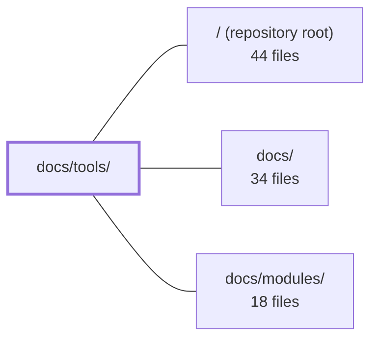

---
tags:
  - 2repo
  - 2repo/module
  - project/boilerplate-node-backend
type: module
module: docs/tools/
files: 40
updated: 2026-08-31T20:49:57.455130+00:00
---

# docs/tools/

## Purpose

`docs/tools/` is the repository's operational and tooling reference: a collection of focused documentation pages that explain every non-obvious subsystem, testing strategy, infrastructure component, and cross-cutting pattern in the project. It answers "how does this work and why is it configured this way?" for everything from the multi-layer test suites and the observability stack to the optional Redis/RabbitMQ integrations, the demo profile, and the security middleware chain.

## Key parts

- **Navigation & orientation** — `index.md` (landing page with tool-map flowchart), `testing-and-docs.md` (boundary map across all test layers), `testing-quickstart.md` (cheat-sheet of every test/bench command), `tools-explained.md` (one-line "what / why / how" for each tool).
- **Testing layers** — `unit-testing.md`, `integration-testing.md`, `contract-testing.md` + `contract-request-data.md`, `property-testing.md`, `concurrency-testing.md`, `fuzz-testing.md`, `cluster-testing.md`, `mutation-testing.md`, and `coverage-and-confidence.md` (ranking of pass rate vs. mutation score vs. coverage).
- **Observability stack** — Application-side: `observability-layer.md`, `winston.md`, `opentelemetry.md`, `analytics.md`. External infra: `grafana.md`, `prometheus.md`, `loki.md`, `tempo.md`, `observability-reference.md`. Disambiguation: `events-and-logging.md`.
- **Infrastructure & data** — `docker-and-podman.md`, `mongodb-mongoose.md`, `redis-cache.md`, `rabbitmq.md`, `email-and-rendering.md`, `image-processing.md`.
- **Runtime, security & patterns** — `runtime.md`, `security.md`, `i18n.md`, `dependency-graph.md`.
- **Project workflow** — `package-dependencies.md`, `package-scripts.md`, `pairing-and-ports.md`, `demo-profile.md`, `frontend-observability.md`.

## How it connects

- **`/` (repository root):** Nearly every page here documents artefacts that live at the repo root—`docker-compose.yml`, `.dependency-cruiser.cjs`, `package.json` scripts, `openapi.yaml`, `mutation-baseline.json`, `docker-compose.yml`, the `.env` contract. The docs describe *why* those files are shaped as they are; the root holds the actual configuration.
- **`docs/`:** Parent section. `docs/tools/` is the "how the toolbox works" half; the other `docs/` subsections (e.g. API reference, changelogs) cover product-facing material.
- **`docs/modules/`:** Sibling section that documents the *code* modules under `src/`. Pages here (e.g. `observability-layer.md`, `security.md`, `redis-cache.md`) are the tooling counterpart: they explain the cross-cutting concerns and external services that those code modules plug into, whereas `docs/modules/` explains the code's internal structure and public API.

## Where to start

1. **`docs/tools/index.md`** — the table-of-contents with a Mermaid tool-map; it routes you to the correct page based on your intent (core, async, observability, workflow) in under 30 seconds.
2. **`docs/tools/testing-and-docs.md`** — if your goal is to run or understand the test suite, this page defines the boundaries between all seven test layers and links to each one's detail page, preventing the common mistake of running the wrong layer or misreading a report.

## Connected modules

[[boilerplate-node-backend_ROOT|/ (repository root)]] · [[boilerplate-node-backend_docs|docs/]] · [[boilerplate-node-backend_docs_modules|docs/modules/]]

## Files
- `docs/tools/analytics.md` — Documents the server-side product-analytics pipeline: how business events (signup, cart, checkout, order, wishlist) are emitted through a single helper, routed to a configurable provider (Umami, PostHog, or no-op), and governed by a strict naming convention and cross-repo uniqueness guarantee. It exists so that "how many users abandon checkout?" is answerable without polluting operational metrics or per-request traces.
- `docs/tools/cluster-testing.md` — Documents the `npm run test:cluster` suite — the only test run that boots `src/cluster.ts` and forks real worker processes. It exists to catch a class of bug invisible to single-process tests: state that is correct within one worker but absent across the cluster (per-process counters, in-process caches). The primary target is the rate limiter, where a per-process budget silently multiplies by worker count.
- `docs/tools/concurrency-testing.md` — Documents the philosophy, rules, and file map for the race-condition test suite. It exists to answer "does the invariant still hold when N requests hit the same write path simultaneously?"—a question that mutation testing (serial by construction) and the other integration suites cannot cover. It prescribes *how* these tests must be written (invariants, `allSettled`, no ordering asserts) so that a future contributor does not silently weaken them.
- `docs/tools/contract-request-data.md` — Documents the request-side contract-testing tooling: a zod v4 schema-AST walker (`tests/support/contract-data.ts`) that generates valid and invalid payloads directly from the schema definitions in `api/schemas.zod.ts`. It exists to verify that every write endpoint accepts all contractually legal inputs and rejects all contractually illegal ones—something hand-written factories can't do because they encode a single known scenario rather than "any legal input."
- `docs/tools/contract-testing.md` — Documents the response-shape contract testing layer: validates that serialized JSON from real HTTP responses matches `openapi.yaml` exactly (including the absence of undeclared fields like `password` or `_id`). Complements the request-shape layer in `contract-request-data.md`.
- `docs/tools/coverage-and-confidence.md` — Establishes the ranking and relationships between the three quality numbers in this repo (pass rate, mutation score, coverage), declares mutation testing the primary instrument, defines what counts as true vs. false redundancy, and records the known blind spot where mutation testing currently cannot execute the suites that would kill service-layer mutants. It exists so the hierarchy is not re-litigated and so readers pick the correct number for a given question.
- `docs/tools/demo-profile.md` — Documents the "demo" deployment profile: a self-contained, in-memory, disposable boot of the real API (no Docker, no Redis/RabbitMQ) used primarily by the paired Vue frontend's e2e suite and secondarily as a zero-setup way to exercise the API locally. It exists so the frontend can test against the actual code rather than a mock, with determinism coming from seeded fixtures.
- `docs/tools/dependency-graph.md` — Documentation for the dependency-cruiser check (`npm run check:dependencies`) that runs over `src/` using the config in `.dependency-cruiser.cjs`. It explains *why* this tool exists alongside ESLint boundaries (reachability and cycle detection—two questions a per-file linter cannot answer), and records the non-obvious config choices that make the rules actually functional.
- `docs/tools/docker-and-podman.md` — Documents the repo's single local container setup (`docker-compose.yml`), covering the app runtime, core data services, and the full observability stack. Also explains how Podman is supported as a drop-in alternative to Docker and the one non-trivial difference (log collection) between the two engines.
- `docs/tools/email-and-rendering.md` — Documents the boilerplate's two outbound-rendering subsystems—email (Nodemailer + EJS) and PDF invoice generation (puppeteer-core)—which operate outside the normal request/response cycle and are fully optional, activating only when their env vars or browser binary are configured.
- `docs/tools/events-and-logging.md` — Disambiguation and decision-guide page for the seven mechanisms in the codebase that record "something happened" (logger, audit, analytics, metrics, traces, SSE live feed, queue jobs). It exists to stop developers from reaching for the wrong one, to document which two cross a process boundary, and to clarify the in-process domain event bus so it is not mistaken for an observability signal or a broker substitute.
- `docs/tools/frontend-observability.md` — Documents how the paired frontend should be observed using a self-hosted, container-based stack (Grafana Faro + Alloy for errors/traces, Umami for product analytics) instead of SaaS tools. It explains the architecture, the `umami-init` seeding mechanism, and the upgrade path to heavier alternatives (Sentry, PostHog, GlitchTip) without requiring a rewrite.
- `docs/tools/fuzz-testing.md` — Documentation page for the spec-driven fuzzing test suite. It explains how the suite auto-discovers every operation in `openapi.yaml`, generates spec-valid but hostile requests via `fast-check`, drives them at the real app with `supertest`, and asserts no 5xx responses and full spec conformance. The page exists so readers (human or AI) can understand the fuzzer's design, limitations, and operational model without reading the source.
- `docs/tools/grafana.md` — Reference documentation for Grafana's role as the unified observability UI (traces, metrics, logs) in the local dev stack. Covers access details, provisioning locations, the trace-lookup workflow, and how each signal source (Tempo, Prometheus, Loki) connects to it.
- `docs/tools/i18n.md` — Documents how per-request locale resolution works in the API: why `t` is bound per-request via `getFixedT` + `AsyncLocalStorage` instead of using i18next's global instance, the four-file module layout behind `@infrastructure/i18n`, and the boundaries where the ambient `t` stops reaching code (queued work, boot-time callbacks, scripts).
- `docs/tools/image-processing.md` — Operational reference for the image digest pipeline: the path an uploaded image takes from quarantine through EXIF stripping, dimension capping, sharp re-encoding, and WebP thumbnail generation before it is promoted to the immutable `public/` store. Points to the actual code and lists the configuration knobs; the full design rationale and failure-mode table live in `IMAGE_PIPELINE_PLAN.md` at the repo root.
- `docs/tools/index.md` — Serves as the landing page and table-of-contents for the entire `docs/tools/` section. It explains *why* each dependency exists, provides a visual tool-map (Mermaid flowchart), and routes readers to the correct tool-specific page based on intent (core, async, observability, project workflow).
- `docs/tools/integration-testing.md` — Documents the integration testing layer that verifies the Express app's wiring—middleware order, route mounting, auth gates—by driving the real `src/app.ts` via supertest without a database or Redis. It exists to catch the class of bug where every unit is individually correct but the router connects them incorrectly.
- `docs/tools/load-testing.md` — Documents how to run external load tests (via `autocannon`) against the running server and how to read the results alongside the observability stack (Grafana, Prometheus, Tempo, Loki). Exists to give a single, repeatable procedure and to explain *why* load must be generated from outside the process.
- `docs/tools/loki.md` — Documents how **Grafana Loki** serves as the log store in this boilerplate: the container-log pipeline (Docker and Podman), the Promtail configuration, LogQL query examples, and how log lines correlate with Tempo traces.
- `docs/tools/mongodb-mongoose.md` — Documents the MongoDB + Mongoose persistence stack for this repo: the role of each tool, the migration workflow (migrate-mongo), the index-declaration rule that prevents schema/migration conflicts, and the seed-and-export pipeline that publishes a deterministic `demo-data.json` artefact.
- `docs/tools/mutation-testing.md` — Explains how and why this project uses Stryker mutation testing to verify that the test suite actually asserts meaningful behaviour, not just that code executes. Serves as the conceptual and operational reference for interpreting mutation scores, the per-file ratchet (`mutation-baseline.json`), and the known limitations of the current run (service-layer exclusion, static-mutant cost).
- `docs/tools/observability-layer.md` — Documents the **in-repo code** of the observability layer: which files carry each of the five signals (logs, metrics, traces, audit, analytics), how modules augment shared infrastructure, and the invariants any change must preserve. Complements the external-stack reference (Prometheus, Loki, Tempo, Grafana) by focusing on the application-side seams.
- `docs/tools/observability-reference.md` — Quick-reference map of the boilerplate observability stack (traces, metrics, logs, alerts) with per-tool config tables. Exists so a developer or AI assistant can locate the relevant YAML config, understand each setting's intent, and know dev-vs-prod differences without reading every config file.
- `docs/tools/opentelemetry.md` — Documentation page for the OpenTelemetry (OTel) **trace** layer of the boilerplate. It explains the auto-instrumentation setup (no per-request code), the OTel Collector pipeline, environment-variable configuration, and how `trace_id` is automatically correlated between OTel spans and Winston log lines.
- `docs/tools/package-dependencies.md` — A quick-reference map of every dependency in `package.json`, grouped into purpose-based families (runtime core, security, persistence, messaging, observability, etc.) with a one-line "why" for each group and a link to the deeper doc page. It exists so a reader can orient themselves in the dependency surface without opening `package.json` or reading each individual tool doc.
- `docs/tools/package-scripts.md` — A job-oriented reference for the `package.json` scripts. Instead of listing scripts alphabetically, it groups them by what you're doing (run the server, validate, test, benchmark) so a developer or AI assistant can find the right command without reading the raw `package.json`.
- `docs/tools/pairing-and-ports.md` — Defines the operational contract between this API backend and its paired frontend: which host ports each stack owns, which env vars must agree across the two `.env` files, and the shared-file identity mechanism (`check:spec-identity` / `sync:frontend`) that prevents silent divergence of the API and async contracts.
- `docs/tools/prometheus.md` — Documents Prometheus as the boilerplate's metrics backend: what `/observability/metrics` exposes, the baseline alert rules, the Alertmanager wiring, the admin-facing observability endpoints, and the SSE metrics stream. Exists so developers know which metrics are available, how to read alerts, and where each config file lives without opening the Prometheus UI.
- `docs/tools/property-testing.md` — Documentation page that explains the repo's property-based testing approach: the rationale (generation + shrinking vs. sampled examples), the two determinism rules, the division of labor with example-based tests, and the map of where property test files live. Exists so a contributor can adopt the technique consistently without re-deriving conventions.
- `docs/tools/rabbitmq.md` — Documents how RabbitMQ is wired into the app as an optional message broker for offloading emails, PDF generation, and similar background work out of the request/response cycle. Serves as the single reference for the queue contract (queue names, dead-letter topology, publish/consume API) so contributors and AI assistants can add or modify workers without re-deriving the pattern.
- `docs/tools/redis-cache.md` — Documents how the codebase uses Redis as an **optional** server-side cache for repeated GET responses. It covers the two-layer design (a tag-aware byte-store adapter and an HTTP middleware), key construction from declared parameters, size and memory caps, the cache-aside invalidation model, and how the design behaves across clustered workers. The page exists so readers understand the invariants (key correctness, bounded storage, graceful degradation) without re-reading both source files.
- `docs/tools/runtime.md` — Catalogs the project's runtime stack (Node.js, Express 5, Zod, Multer, i18next, dotenv, TypeScript, tsx) with a one-line justification for each, a request-pipeline flowchart, and the architectural layering conventions that govern how those pieces interact. It exists as a single reference point so readers don't have to infer the tech stack from `package.json` alone.
- `docs/tools/security.md` — Documentation page that catalogs the project's security tooling (Helmet, CORS, rate-limit, JWT, bcrypt, cookie-parser), explains the split-token auth architecture and its request flow, and records the rationale behind specific security decisions (rate-limit budgets, regex escaping, `trust proxy`, SSE cookie auth, metrics credential, 401-vs-403 policy). It exists so contributors and AI assistants can understand *why* the security middleware is configured the way it is without reverse-engineering the code.
- `docs/tools/tempo.md` — Documents the role of Grafana Tempo as the trace store in this boilerplate's observability stack: the data flow (App → OTel Collector → Tempo → Grafana), the runtime configuration, and how to query traces. Exists so readers know Tempo is never queried directly and is always accessed through Grafana.
- `docs/tools/testing-and-docs.md` — Central map and navigation hub for all testing layers in the repo. It defines the boundaries between each layer (unit, integration, contract, property, concurrency, fuzzing, mutation), links to each layer's detail page, explains how to read test reports, and documents the single-source-of-truth strategy for demo/test data.
- `docs/tools/testing-quickstart.md` — A single-reference cheat sheet for every test and benchmark command in the repo: what each answers, how long it takes, whether it is a CI gate, and the correct flags to use. It exists so a developer (or AI assistant) can pick the right command in under a minute without reading the full package-scripts reference.
- `docs/tools/tools-explained.md` — A single-page, at-a-glance reference for every tool in the stack. For each tool it answers three questions — *what it is*, *what problem it solves*, and *what it does in this repo* — then links out to the dedicated deep-dive page. The goal is orientation, not depth.
- `docs/tools/unit-testing.md` — Documents the unit-testing layer: what it covers (services, repositories, models, middlewares, adapters), the tooling (Jest + ts-jest), its structural boundaries against integration and contract testing, and the conventions that keep it database-free and HTTP-free. It also records the `tsconfig.jest.json` deviations and the commands to run the suite.
- `docs/tools/winston.md` — Documents the two Winston log streams (application `logger` and `auditLogger`), their JSON formats, configuration env vars, redaction rules, and how audit events are captured, persisted, and retained. Exists so developers know *where* to log, *what shape* each line takes, and *where* the data ends up without re-reading the adapter code.

---
[[boilerplate-node-backend_INDEX|← boilerplate-node-backend index]]
