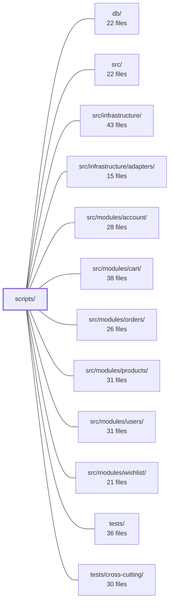

---
tags:
  - 2repo
  - 2repo/module
  - project/boilerplate-node-backend
type: module
module: scripts/
files: 25
updated: 2026-09-02T18:31:10.469966+00:00
---

# scripts/

## Purpose

`scripts/` is the operational backbone of the repository: a collection of CLI tools that build and verify contract bundles, enforce cross-repo spec identity, run mutation-testing gates, perform periodic data-hygiene sweeps, generate documentation artifacts, and provide the demo/dev-server entry point. Every script here is invoked via an `npm run` alias or a CI step rather than from application code at runtime.

## Key parts

- **Contract bundle pipeline** — `build-contract-bundles.ts` is the CLI entry; `contracts/bundle-registry.ts` enumerates every bundle; `contracts/bundle-kinds.ts` defines the shared type contract; `contracts/openapi-bundle.ts` compiles the REST spec via redocly; `contracts/asyncapi-bundles.ts` merges per-section AsyncAPI fragments; `contracts/client-collections-bundle.ts` feeds the runnable-collection generator (Bruno, Postman, etc.).
- **Cross-repo spec identity** — `spec-identity.ts` (sha-256 gate) and `check-spec-identity.ts` (its CLI wrapper) verify shared files are byte-identical to the paired frontend; `paired-frontend-path.ts` resolves the sibling checkout; `sync-shared-files-to-frontend.ts` pushes bundles and the demo dataset across the boundary; `generate-asyncapi-types.ts` is the shared TypeScript-type generator that must stay byte-identical in both repos.
- **Mutation-testing ratchet** — `mutation-baseline.ts` implements the per-file scoring logic; `check-mutation-baseline.ts` is the CI gate that compares against the committed baseline; `run-mutation-tests.ts` wraps Stryker with env tuning and OOM detection; `run-mutation-diff.ts` scopes a run to branch-changed files for reviewers.
- **Periodic data reapers** — `reap-inactive-accounts.ts` (warn → soft-delete → hard-delete), `reap-orders.ts` (PII anonymization, never row deletion), `reap-quarantine.ts` (backstop for stale quarantine files).
- **Demo & seed tooling** — `run-demo-server.ts` boots the full app against in-memory MongoDB; `export-demo-dataset.ts` produces the serialized demo JSON; `generate-seed-images.ts` downloads and processes deterministic photos.
- **Artifact & docs generation** — `regenerate-artifacts.ts` rebuilds all committed generated files in dependency order; `generate-module-graph.ts` produces mermaid dependency diagrams from `dependency-cruiser` output.
- **Test reporting & contract smoke** — `report-test-results.ts` buckets Jest/Vitest + lcov output by module; `run-prism-smoke-test.ts` confirms the OpenAPI doc is Prism-servable.

## How it connects

- **`src/` and `src/infrastructure/`** — `run-demo-server.ts` boots the real application and its adapters (in-memory Mongo, no broker); `export-demo-dataset.ts` exercises the actual mappers and serializers; the reapers query live collection data shaped by the domain modules.
- **`src/modules/orders/`** — `reap-orders.ts` acts on the `anonymizeAfter` stamp set by the orders module's `USER_DELETED` listener; `run-demo-server.ts` seeds order fixtures.
- **`src/modules/account/`, `src/modules/users/`** — `reap-inactive-accounts.ts` reads activity timestamps owned by these modules; the demo server seeds their fixtures.
- **`src/modules/products/`** — `generate-seed-images.ts` writes the two `demo-images.generated.json` manifests that `demo.ts` and `demo-catalog.ts` in the products module consume.
- **`src/modules/cart/`, `src/modules/wishlist/`** — `run-demo-server.ts` loads their module fixtures during seeding.
- **`db/`** — the demo server and reapers operate directly against the database layer defined here.
- **`tests/` / `tests/cross-cutting/`** — `report-test-results.ts` ingests their JSON reports; the contract-bundle staleness check and spec-identity gate are consumed by cross-cutting CI steps; `run-prism-smoke-test.ts` is itself a contract-level test.

## Where to start

1. **`contracts/bundle-registry.ts`** — a short, self-contained file that shows the complete list of bundles and the operations each supports; reading it first gives you the vocabulary every other script in this directory uses.
2. **`build-contract-bundles.ts`** — the main CLI entry that wires the registry to the individual bundle builders; tracing its `--check` path shows how the repo guarantees committed artifacts never go stale.

## Connected modules

[[boilerplate-node-backend_db|db/]] · [[boilerplate-node-backend_src|src/]] · [[boilerplate-node-backend_src_infrastructure|src/infrastructure/]] · [[boilerplate-node-backend_src_infrastructure_adapters|src/infrastructure/adapters/]] · [[boilerplate-node-backend_src_modules_account|src/modules/account/]] · [[boilerplate-node-backend_src_modules_cart|src/modules/cart/]] · [[boilerplate-node-backend_src_modules_orders|src/modules/orders/]] · [[boilerplate-node-backend_src_modules_products|src/modules/products/]] · [[boilerplate-node-backend_src_modules_users|src/modules/users/]] · [[boilerplate-node-backend_src_modules_wishlist|src/modules/wishlist/]] · [[boilerplate-node-backend_tests|tests/]] · [[boilerplate-node-backend_tests_cross-cutting|tests/cross-cutting/]]

## Files
- `scripts/build-contract-bundles.ts` — CLI entry point (invoked as `npm run contracts:bundle`) that rebuilds the repository's committed contract bundles (OpenAPI, AsyncAPI, etc.) from their source fragments, or verifies in `--check` mode that the committed files are not stale. The bundles are committed because downstream consumers—spectral, orval, Prism, the seed runner, and `check:spec-identity`—read the bundled files, while the fragments remain the source of truth.
- `scripts/check-mutation-baseline.ts` — CLI entry point for the per-file mutation ratchet. It reads the Stryker report (`reports/mutation/mutation.json`), compares per-file scores against a committed JSON baseline, and either fails the process (exit 1) if any file regressed or records a new baseline. It deliberately does **not** invoke Stryker, keeping the gate cheap enough to run in a separate CI step from the actual mutation run.
- `scripts/check-spec-identity.ts` — CLI entry point for `npm run check:spec-identity`: verifies that a set of shared contract files in this repo are byte-identical to their counterparts in the paired frontend checkout. It is invoked by `ci.yml` and `npm run complete`, and the frontend repo mirrors this script.
- `scripts/contracts/asyncapi-bundles.ts` — Builds the two committed AsyncAPI bundle files (`asyncapi.yaml` and `asyncapi.public.yaml`) by merging per-section YAML documents into a single root document. The merge copies only the four structural maps (servers, channels, components.messages, components.schemas) and refuses key collisions, deliberately avoiding `asyncapi bundle`'s full `$ref` dereferencing so that `scripts/generate-asyncapi-types.ts` can still walk the remaining refs. The public bundle exposes only `shared`-scoped sections to API clients; the full bundle includes all sections.
- `scripts/contracts/bundle-kinds.ts` — Defines the type system for contract bundles: the two shapes (`CompiledBundle` and `GeneratedBundle`) that every entry in `bundle-registry.ts` must conform to, plus the three operations the CLI and staleness check perform on them (produce text, read the committed copy, enumerate source fragments). It is a pure interface/helper module — it builds nothing itself.
- `scripts/contracts/bundle-registry.ts` — Central registry that enumerates every contract bundle this repo produces. All consumers (the CLI build, the staleness check, and cross-cutting tests) iterate this single list rather than hard-coding bundle names, so adding a new bundle requires one entry here plus its spec file.
- `scripts/contracts/client-collections-bundle.ts` — Configuration file that drives generation of four API-client collections (Bruno, Insomnia, Mockoon, Postman) from the repository's OpenAPI contract. It is **not** committed (all four outputs are gitignored) and is generated on demand via `npm run contracts:bundle`. The file supplies the three pieces of information only this repo can provide to the `@guebbit/openapi-runnable-collections` generator: which module owns which path, which demo-data values to embed, and which authored rejection probes to include.
- `scripts/contracts/openapi-bundle.ts` — Compiles the repo's REST contract (`openapi.yaml`) by running `redocly bundle` against a root document that `$ref`s one standalone OpenAPI file per module. Exports a `CompiledBundle` descriptor so the bundle registry can track staleness, write the output, and let downstream consumers (client collections, tests) read the current contract.
- `scripts/export-demo-dataset.ts` — Exports the demo dataset (`db/demo/demo-data.json`) as the API actually serializes it. It spins up a throwaway in-memory MongoDB, runs the real seeders, then delegates to `assembleDemoDataset()` to produce the final JSON. Publishing the serialized output (rather than raw seed input) is intentional: it exercises the backend mappers/serializers so drift between the two repos' views is caught at generation time.
- `scripts/generate-asyncapi-types.ts` — Generates the TypeScript realtime contract types (payload interfaces, message aliases, per-namespace channel constants and unions, SSE event/payload maps) from `asyncapi.yaml`. It is a **shared script** that must remain byte-identical across two paired repos (backend and frontend); the only difference between them is the input contract subset, so the backend output carries queue payloads while the frontend output does not.
- `scripts/generate-module-graph.ts` — Generates the module dependency diagram in `docs/modules/index.md` and a per-module neighbourhood diagram on each module's page, replacing hand-drawn mermaid blocks with graphs derived from actual `dependency-cruiser` output and `onDomainEvent` subscriptions. It exists so the published architecture diagram can never silently drift from the code: run with `--check` (as part of `complete`) it fails when the generated blocks no longer match reality.
- `scripts/generate-seed-images.ts` — One-off CLI (`npm run seed:images`) that downloads a deterministic photo per demo role from Lorem Picsum, runs each through the production digest/thumbnail pipeline, writes the results into `public/images/seed/`, prunes stale originals, and emits the two `demo-images.generated.json` manifests that `demo.ts` and `demo-catalog.ts` consume at seed time.
- `scripts/mutation-baseline.ts` — Implements a per-file mutation-score ratchet on top of Stryker's globally-thresholded output. It reads a Stryker JSON report, scores each file individually, compares against a committed per-file baseline, and produces the updated baseline (scores only ever move up). This exists so that one strong file cannot mask a regression in another, and so a drop in coverage of existing assertions is caught per-file rather than buried in an aggregate.
- `scripts/paired-frontend-path.ts` — Resolves the absolute path to the paired Vue frontend checkout so that cross-repo scripts (contract checks, artifact regeneration, shared-file sync) can locate the sibling repo without hard-coding paths. It centralises the env-var override (`FRONTEND_PATH`) and the fallback convention into a single, testable helper.
- `scripts/reap-inactive-accounts.ts` — Three-stage periodic reaper that warns, soft-deletes, and hard-deletes user accounts whose last activity (refresh-token exchange or `createdAt`) exceeds `NODE_INACTIVE_ACCOUNT_DAYS`. Disabled by default (`0`) so a boilerplate deployment never silently deletes a live account.
- `scripts/reap-orders.ts` — Periodic PII-scrubbing script (`npm run reap:orders`) that anonymizes order records whose retention window has expired. Unlike the sibling `reap-*` scripts, it **never deletes a row**—it replaces personal fields (email, shipping name/phone/street) with placeholders while preserving financial data (amounts, line items, dates, city, country). This is the "other half" of the erasure flow: the `USER_DELETED` listener in the orders module stamps `anonymizeAfter` when an account is deleted, and this script acts on that date later.
- `scripts/reap-quarantine.ts` — Periodic backstop script that deletes quarantine files older than a configurable retention window. In normal operation every pipeline success or handled failure removes its own quarantine file; this script catches the leftovers from crashes, unregistered collections, or lost deliveries. Intended to run as a scheduled job (cron, container task) via `npm run reap:quarantine`, not by hand.
- `scripts/regenerate-artifacts.ts` — Sequentially rebuilds every generated artifact the repo commits (typed API client, zod schemas, asyncapi types, module graph, seed data) in the one order that satisfies their internal dependencies. Exists as a single ordered script because the chain is non-obvious and needs a home; also invoked by the husky pre-commit hook with `--no-sync`.
- `scripts/report-test-results.ts` — Reads a runner's JSON test report (Jest `--json` or Vitest `json` reporter) and `coverage/lcov.info`, then prints a human-readable summary bucketed by module: per-module test counts, wall time, slowest suites/tests, failures with a one-line reason, and line coverage. It exists because the codebase is organised around deletable modules, yet the default toolchain is layer-shaped (`test:unit`, `test:contract`) and cannot answer "what does module X cost" or "which module owns a red build." Invoked via `npm run test:report`.
- `scripts/run-demo-server.ts` — Entry point for the `npm run demo` profile. Boots the real application against a self-contained in-memory MongoDB instance, seeds it from module fixtures, and serves the API without Docker, Redis, or a message broker. Intended as the backend for the paired frontend dev server and the e2e suite, replacing hand-written mocks.
- `scripts/run-mutation-diff.ts` — Runs Stryker mutation testing scoped to the files changed in the current branch (default base: `origin/main`), then applies the per-file mutation ratchet. It exists to give reviewers a fast, actionable score for *their* changes rather than a full-repo nightly number.
- `scripts/run-mutation-tests.ts` — A CLI wrapper around `npx stryker run` that adds three capabilities a JSON config cannot provide: injecting machine-specific settings (concurrency, worker heap) from `.env`, clearing the scratch directory before each run, and aborting the process when it detects an OOM/strand loop that will never converge.
- `scripts/run-prism-smoke-test.ts` — Boots the Prism mock server against `openapi.yaml` on a real port and issues a single HTTP probe to confirm the OpenAPI document is complete enough to serve. Run via `npm run test:prism`. It is a contract smoke test (not an app test) and is deliberately kept outside the pre-commit gate because it binds a port and owns a child process.
- `scripts/spec-identity.ts` — Implements the cross-repo contract identity gate: a byte-for-byte (sha256) check that a small set of spec files are identical between this backend repo and its paired frontend. It exists because a one-line edit in one checkout silently forks what both sides believe they share, and neither CI catches it because a forked spec is still a valid spec. Deliberately identity, not equivalence.
- `scripts/sync-shared-files-to-frontend.ts` — Copies every backend-owned shared file into the paired frontend checkout, guaranteeing the frontend's copies are byte-identical outputs of this repo's sources. Exists so that a single command (`npm run sync:frontend`) can move the contract bundles and demo dataset across the repo boundary and then leave the frontend in a fully regenerated, verified state.

---
[[boilerplate-node-backend_INDEX|← boilerplate-node-backend index]]
