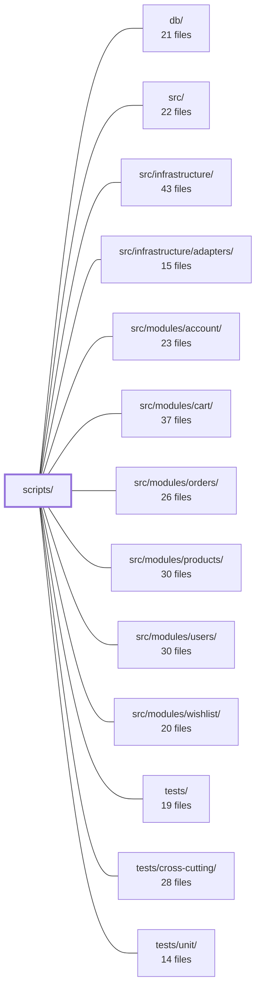

---
tags:
  - 2repo
  - 2repo/module
  - project/boilerplate-node-backend
type: module
module: scripts/
files: 25
updated: 2026-08-31T20:50:22.852267+00:00
---

# scripts/

## Purpose

Operational tooling for the repository: build and verify contract bundles, drive mutation testing, boot a self-contained demo server, export the demo dataset, analyse heap snapshots, report test results per module, and synchronise shared files with the paired frontend checkout. Everything here is invoked through `npm run` aliases, CI steps, or the husky pre-commit hook rather than imported at runtime.

## Key parts

- **Contract bundling** – `build-contract-bundles.ts` is the CLI entry; `contracts/bundle-registry.ts` is the single source of truth for *which* bundles exist; `contracts/bundle-kinds.ts` defines the interface every entry must implement; `contracts/openapi-bundle.ts` compiles the REST contract via Redocly; `contracts/asyncapi-bundles.ts` merges AsyncAPI sections into committed files; `contracts/client-collections-bundle.ts` drives Bruno/Insomnia/Mockoon/Postman export.
- **Mutation testing** – `run-mutation-tests.ts` wraps Stryker with env-tuned concurrency and OOM guard; `run-mutation-diff.ts` scopes the run to branch-changed files; `mutation-baseline.ts` implements the per-file score ratchet; `check-mutation-baseline.ts` is the cheap CI gate that compares against the committed baseline.
- **Cross-repo pairing** – `paired-frontend-path.ts` resolves the sibling checkout; `spec-identity.ts` / `check-spec-identity.ts` enforce byte-identical shared specs; `sync-shared-files-to-frontend.ts` pushes bundles and the demo dataset across; `generate-asyncapi-types.ts` produces the realtime TS types (must stay byte-identical across repos).
- **Demo & seed** – `run-demo-server.ts` boots the full app against in-memory MongoDB for dev/e2e; `export-demo-dataset.ts` serialises the demo data through the real mappers.
- **Artifact regeneration & docs** – `regenerate-artifacts.ts` rebuilds every committed generated file in dependency order (also the husky hook target); `generate-module-graph.ts` keeps the Mermaid diagram in `docs/modules/index.md` in sync with the live import graph.
- **Diagnostics & reporting** – `report-heap-summary.ts` and `report-heap-retainers.ts` analyse V8 heap snapshots without blowing past string-length limits; `report-test-results.ts` buckets Jest/Vitest JSON output by module.
- **Ops & maintenance** – `reap-quarantine.ts` is the cron backstop for orphaned pipeline files; `backfill-image-thumbnails.ts` is a one-off idempotent migration; `run-prism-smoke-test.ts` confirms the OpenAPI document is complete enough to serve.

## How it connects

- **`src/` and its feature modules** – `run-demo-server.ts` and `export-demo-dataset.ts` import the application entry point and module seeders to exercise the real mappers and serialisers. `regenerate-artifacts.ts` generates typed API clients and zod schemas that `src/` modules import at runtime.
- **`src/infrastructure/` & `src/infrastructure/adapters/`** – The demo server wires the in-memory MongoDB adapter and skips Redis/broker adapters, isolating the app from external services. `reap-quarantine.ts` cleans up files left behind by pipeline adapters after crashes.
- **`db/`** – `export-demo-dataset.ts` runs the repo's seeders against a throwaway instance; `backfill-image-thumbnails.ts` issues a query to backfill `thumbnailUrl` on pre-pipeline rows.
- **`tests/`, `tests/unit/`, `tests/cross-cutting/`** – `report-test-results.ts` consumes their JSON reports and lcov output. `run-mutation-tests.ts` / `run-mutation-diff.ts` target `src/` files but their results feed the ratchet baseline. `run-prism-smoke-test.ts` and `check-spec-identity.ts` gate the contract bundles that cross-cutting tests and the seed runner rely on.

## Where to start

1. **`scripts/regenerate-artifacts.ts`** – reading its sequential call chain reveals the full set of committed generated files and the ordering constraint between them (typed client → zod schemas → asyncapi types → module graph → seed data), which is the backbone a newcomer needs before touching any contract or build step.
2. **`scripts/contracts/bundle-registry.ts`** – a short, single-list file that shows exactly which bundles the repo produces and what interface each must satisfy, giving immediate orientation into the contract-bundling subsystem without wading into the individual bundle builders.

## Connected modules

[[boilerplate-node-backend_db|db/]] · [[boilerplate-node-backend_src|src/]] · [[boilerplate-node-backend_src_infrastructure|src/infrastructure/]] · [[boilerplate-node-backend_src_infrastructure_adapters|src/infrastructure/adapters/]] · [[boilerplate-node-backend_src_modules_account|src/modules/account/]] · [[boilerplate-node-backend_src_modules_cart|src/modules/cart/]] · [[boilerplate-node-backend_src_modules_orders|src/modules/orders/]] · [[boilerplate-node-backend_src_modules_products|src/modules/products/]] · [[boilerplate-node-backend_src_modules_users|src/modules/users/]] · [[boilerplate-node-backend_src_modules_wishlist|src/modules/wishlist/]] · [[boilerplate-node-backend_tests|tests/]] · [[boilerplate-node-backend_tests_cross-cutting|tests/cross-cutting/]] · [[boilerplate-node-backend_tests_unit|tests/unit/]]

## Files
- `scripts/backfill-image-thumbnails.ts` — One-off backfill script (`npm run backfill:image-thumbnails`) that generates `thumbnailUrl` for product and user images uploaded before the digest pipeline shipped (pre-pipeline rows and `public/images/seed/` fixtures). Idempotent: the query excludes documents that already have a `thumbnailUrl`, so re-runs only touch missed or failed rows.
- `scripts/build-contract-bundles.ts` — CLI entry point (invoked as `npm run contracts:bundle`) that rebuilds the repository's committed contract bundles (OpenAPI, AsyncAPI, etc.) from their source fragments, or verifies in `--check` mode that the committed files are not stale. The bundles are committed because downstream consumers—spectral, orval, Prism, the seed runner, and `check:spec-identity`—read the bundled files, while the fragments remain the source of truth.
- `scripts/check-mutation-baseline.ts` — CLI entry point for the per-file mutation ratchet. It reads the Stryker report (`reports/mutation/mutation.json`), compares per-file scores against a committed JSON baseline, and either fails the process (exit 1) if any file regressed or records a new baseline. It deliberately does **not** invoke Stryker, keeping the gate cheap enough to run in a separate CI step from the actual mutation run.
- `scripts/check-spec-identity.ts` — CLI entry point for `npm run check:spec-identity`: verifies that a set of shared contract files in this repo are byte-identical to their counterparts in the paired frontend checkout. It is invoked by `ci.yml` and `npm run complete`, and the frontend repo mirrors this script.
- `scripts/contracts/asyncapi-bundles.ts` — Builds the two committed AsyncAPI bundle files (`asyncapi.yaml` and `asyncapi.public.yaml`) by merging per-section YAML documents into a single root document. The merge copies only the four structural maps (servers, channels, components.messages, components.schemas) and refuses key collisions, deliberately avoiding `asyncapi bundle`'s full `$ref` dereferencing so that `scripts/generate-asyncapi-types.ts` can still walk the remaining refs. The public bundle exposes only `shared`-scoped sections to API clients; the full bundle includes all sections.
- `scripts/contracts/bundle-kinds.ts` — Defines the type system for contract bundles: the two shapes (`CompiledBundle` and `GeneratedBundle`) that every entry in `bundle-registry.ts` must conform to, plus the three operations the CLI and staleness check perform on them (produce text, read the committed copy, enumerate source fragments). It is a pure interface/helper module — it builds nothing itself.
- `scripts/contracts/bundle-registry.ts` — Central registry that enumerates every contract bundle this repo produces. All consumers (the CLI build, the staleness check, and cross-cutting tests) iterate this single list rather than hard-coding bundle names, so adding a new bundle requires one entry here plus its spec file.
- `scripts/contracts/client-collections-bundle.ts` — Configuration file that drives generation of four API-client collections (Bruno, Insomnia, Mockoon, Postman) from the repository's OpenAPI contract. It is **not** committed (all four outputs are gitignored) and is generated on demand via `npm run contracts:bundle`. The file supplies the three pieces of information only this repo can provide to the `@guebbit/openapi-runnable-collections` generator: which module owns which path, which demo-data values to embed, and which authored rejection probes to include.
- `scripts/contracts/openapi-bundle.ts` — Compiles the repo's REST contract (`openapi.yaml`) by running `redocly bundle` against a root document that `$ref`s one standalone OpenAPI file per module. Exports a `CompiledBundle` descriptor so the bundle registry can track staleness, write the output, and let downstream consumers (client collections, tests) read the current contract.
- `scripts/export-demo-dataset.ts` — Exports the demo dataset (`db/demo/demo-data.json`) as the API actually serializes it. It spins up a throwaway in-memory MongoDB, runs the real seeders, then delegates to `assembleDemoDataset()` to produce the final JSON. Publishing the serialized output (rather than raw seed input) is intentional: it exercises the backend mappers/serializers so drift between the two repos' views is caught at generation time.
- `scripts/generate-asyncapi-types.ts` — Generates the TypeScript realtime contract types (payload interfaces, message aliases, per-namespace channel constants and unions, SSE event/payload maps) from `asyncapi.yaml`. It is a **shared script** that must remain byte-identical across two paired repos (backend and frontend); the only difference between them is the input contract subset, so the backend output carries queue payloads while the frontend output does not.
- `scripts/generate-module-graph.ts` — Generates the Mermaid dependency diagram and the adjacent module table inside `docs/modules/index.md` from the live import graph (via `dependency-cruiser`), replacing a previously hand-drawn diagram that silently went stale. Supports a `--check` mode that exits non-zero when the page has diverged, for use in CI (`complete`).
- `scripts/mutation-baseline.ts` — Implements a per-file mutation-score ratchet on top of Stryker's globally-thresholded output. It reads a Stryker JSON report, scores each file individually, compares against a committed per-file baseline, and produces the updated baseline (scores only ever move up). This exists so that one strong file cannot mask a regression in another, and so a drop in coverage of existing assertions is caught per-file rather than buried in an aggregate.
- `scripts/paired-frontend-path.ts` — Resolves the absolute path to the paired Vue frontend checkout so that cross-repo scripts (contract checks, artifact regeneration, shared-file sync) can locate the sibling repo without hard-coding paths. It centralises the env-var override (`FRONTEND_PATH`) and the fallback convention into a single, testable helper.
- `scripts/reap-quarantine.ts` — Periodic backstop script that deletes quarantine files older than a configurable retention window. In normal operation every pipeline success or handled failure removes its own quarantine file; this script catches the leftovers from crashes, unregistered collections, or lost deliveries. Intended to run as a scheduled job (cron, container task) via `npm run reap:quarantine`, not by hand.
- `scripts/regenerate-artifacts.ts` — Sequentially rebuilds every generated artifact the repo commits (typed API client, zod schemas, asyncapi types, module graph, seed data) in the one order that satisfies their internal dependencies. Exists as a single ordered script because the chain is non-obvious and needs a home; also invoked by the husky pre-commit hook with `--no-sync`.
- `scripts/report-heap-retainers.ts` — Answers "who is holding these?" for a single kind of heap object by building a reverse (in-degree) index over a V8 `.heapsnapshot` file and walking retainer chains upward. It exists as a separate script from `report-heap-summary.ts` because it must hold the entire edge graph in memory, whereas the summary script only needs per-node aggregates.
- `scripts/report-heap-summary.ts` — CLI tool that produces a ranked summary of a V8 `.heapsnapshot` file (top-N object kinds by self-size). It exists because any heap snapshot of meaningful size exceeds V8's maximum string length, so the naive `JSON.parse(readFileSync(...))` approach fails with `ERR_STRING_TOO_LONG` before parsing even starts. This script instead walks the file in chunks, never holding more than one buffer in memory.
- `scripts/report-test-results.ts` — Reads a runner's JSON test report (Jest `--json` or Vitest `json` reporter) and `coverage/lcov.info`, then prints a human-readable summary bucketed by module: per-module test counts, wall time, slowest suites/tests, failures with a one-line reason, and line coverage. It exists because the codebase is organised around deletable modules, yet the default toolchain is layer-shaped (`test:unit`, `test:contract`) and cannot answer "what does module X cost" or "which module owns a red build." Invoked via `npm run test:report`.
- `scripts/run-demo-server.ts` — Entry point for the `npm run demo` profile. Boots the real application against a self-contained in-memory MongoDB instance, seeds it from module fixtures, and serves the API without Docker, Redis, or a message broker. Intended as the backend for the paired frontend dev server and the e2e suite, replacing hand-written mocks.
- `scripts/run-mutation-diff.ts` — Runs Stryker mutation testing scoped to the files changed in the current branch (default base: `origin/main`), then applies the per-file mutation ratchet. It exists to give reviewers a fast, actionable score for *their* changes rather than a full-repo nightly number.
- `scripts/run-mutation-tests.ts` — A CLI wrapper around `npx stryker run` that adds three capabilities a JSON config cannot provide: injecting machine-specific settings (concurrency, worker heap) from `.env`, clearing the scratch directory before each run, and aborting the process when it detects an OOM/strand loop that will never converge.
- `scripts/run-prism-smoke-test.ts` — Boots the Prism mock server against `openapi.yaml` on a real port and issues a single HTTP probe to confirm the OpenAPI document is complete enough to serve. Run via `npm run test:prism`. It is a contract smoke test (not an app test) and is deliberately kept outside the pre-commit gate because it binds a port and owns a child process.
- `scripts/spec-identity.ts` — Implements the cross-repo contract identity gate: a byte-for-byte (sha256) check that a small set of spec files are identical between this backend repo and its paired frontend. It exists because a one-line edit in one checkout silently forks what both sides believe they share, and neither CI catches it because a forked spec is still a valid spec. Deliberately identity, not equivalence.
- `scripts/sync-shared-files-to-frontend.ts` — Copies every backend-owned shared file into the paired frontend checkout, guaranteeing the frontend's copies are byte-identical outputs of this repo's sources. Exists so that a single command (`npm run sync:frontend`) can move the contract bundles and demo dataset across the repo boundary and then leave the frontend in a fully regenerated, verified state.

---
[[boilerplate-node-backend_INDEX|← boilerplate-node-backend index]]
