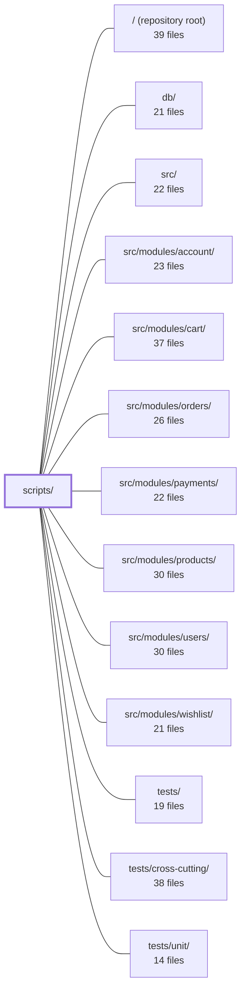

---
tags:
  - 2repo
  - 2repo/module
  - project/boilerplate-node-backend
type: module
module: scripts/
files: 22
updated: 2026-08-28T11:57:01.576668+00:00
---

# scripts/

## Purpose

`scripts/` contains all the build, validation, and operational tooling that keeps the repo's committed artifacts (OpenAPI spec, AsyncAPI bundles, client collections, demo dataset, generated types) in sync with their authored sources, enforces cross-repo contract identity with the paired frontend, and provides developer-facing utilities (demo server, mutation-test ratchet, heap diagnostics, test reporting). It is the glue layer between authored contract fragments and the consumed artifacts that external tooling and the sibling repo read directly.

## Key parts

- **Contract bundle pipeline** — `build-contract-bundles.ts` is the CLI entry point; `contracts/bundle-kinds.ts` defines the type system (compiled vs. generated) and shared helpers; `contracts/bundle-registry.ts` is the single enumeration every consumer iterates over. Individual builders live alongside: `openapi-bundle.ts` (redocly `$ref` resolution), `asyncapi-bundles.ts` (structural YAML merge), `analytics-events-bundle.ts` (frontend event-name extraction), `client-collections-bundle.ts` (Bruno/Insomnia/Mockoon/Postman generation config).
- **Cross-repo identity & sync** — `spec-identity.ts` defines which shared files must be byte-identical and how paths map; `check-spec-identity.ts` is the CI-facing CLI. `paired-frontend-path.ts` resolves the sibling checkout location. `sync-shared-files-to-frontend.ts` pushes bundles and the demo dataset into the frontend.
- **Testing infrastructure** — `mutation-baseline.ts` implements the per-file ratchet; `check-mutation-baseline.ts` is the cheap CI gate; `run-mutation-tests.ts` wraps Stryker with OOM guards and env injection. `run-prism-smoke-test.ts` boots a Prism mock to validate the OpenAPI doc. `report-test-results.ts` renders a module-bucketed summary from Jest/Vitest JSON.
- **Demo & regeneration** — `run-demo-server.ts` boots the full app on an in-memory MongoDB for frontend/e2e use. `export-demo-dataset.ts` produces the serialized demo JSON through real seeders. `regenerate-artifacts.ts` sequences the four committed-artifact generators in the correct dependency order.
- **Type generation** — `generate-asyncapi-types.ts` walks `asyncapi.yaml` and emits `src/types/asyncapi.generated.ts`; kept byte-identical in both repos.
- **Heap diagnostics** — `report-heap-summary.ts` streams a V8 snapshot in chunks (bypassing `ERR_STRING_TOO_LONG`) to rank object kinds; `report-heap-retainers.ts` builds a reverse edge index to trace retaining chains.

## How it connects

- **`src/`** — Generated artifacts land here: `src/types/asyncapi.generated.ts`, `src/infrastructure/observability/analytics-events.frontend.ts`. The OpenAPI and AsyncAPI bundles are *built from* per-module files under `src/modules/*/`.
- **`src/modules/account|cart|orders|payments|products|users|wishlist`** — Each module owns a standalone OpenAPI fragment and its own contract scope; `client-collections-bundle.ts` maps API paths back to the owning module, and the OpenAPI bundle resolves cross-module `$ref`s.
- **`db/`** — `export-demo-dataset.ts` and `run-demo-server.ts` both invoke the real seeders and read fixtures from `db/demo/`, so the committed demo JSON reflects actual mapper output.
- **`tests/` / `tests/unit/` / `tests/cross-cutting/`** — `run-mutation-tests.ts` and `check-mutation-baseline.ts` operate on the unit-test suite. `bundle-registry.ts` is iterated by cross-cutting tests to assert every bundle is fresh. `run-prism-smoke-test.ts` validates the OpenAPI contract that integration tests depend on.
- **`/` (repository root)** — All entry points are wired through root-level `npm run` scripts and referenced by `ci.yml`. The `FRONTEND_PATH` env-var convention and `sync-shared-files-to-frontend.ts` make the root the orchestration point for cross-repo workflows.

## Where to start

1. **`scripts/contracts/bundle-kinds.ts`** — Read this first to understand the two bundle kinds (compiled / generated) and the identity → build → compare contract every bundle must satisfy. It is short, self-contained, and explains the ordering rules that make the rest of the pipeline coherent.
2. **`scripts/build-contract-bundles.ts`** — The CLI that ties the registry and every builder together. Walking its `--check` path shows how CI consumes the same logic, and its argument handling reveals how to target a single bundle during development.

## Connected modules

[[boilerplate-node-backend_ROOT|/ (repository root)]] · [[boilerplate-node-backend_db|db/]] · [[boilerplate-node-backend_src|src/]] · [[boilerplate-node-backend_src_modules_account|src/modules/account/]] · [[boilerplate-node-backend_src_modules_cart|src/modules/cart/]] · [[boilerplate-node-backend_src_modules_orders|src/modules/orders/]] · [[boilerplate-node-backend_src_modules_payments|src/modules/payments/]] · [[boilerplate-node-backend_src_modules_products|src/modules/products/]] · [[boilerplate-node-backend_src_modules_users|src/modules/users/]] · [[boilerplate-node-backend_src_modules_wishlist|src/modules/wishlist/]] · [[boilerplate-node-backend_tests|tests/]] · [[boilerplate-node-backend_tests_cross-cutting|tests/cross-cutting/]] · [[boilerplate-node-backend_tests_unit|tests/unit/]]

## Files
- `scripts/build-contract-bundles.ts` — CLI entry point (`npm run contracts:bundle`) that rebuilds the repo's committed contract bundles from their fragment sources. Bundles stay committed because external tooling (Spectral, Orval, Prism, the seed runner, `check:spec-identity`) reads them directly. The script also supports a `--check` mode for CI that fails instead of rewriting, and accepts bundle names to narrow the run.
- `scripts/check-mutation-baseline.ts` — CLI entry point for the per-file mutation ratchet. Reads the latest Stryker mutation report (`reports/mutation/mutation.json`), compares it against `mutation-baseline.json`, reports regressions, and optionally records improvements. It is deliberately separate from running Stryker so a CI job can split the expensive test run and the cheap gate into independent steps.
- `scripts/check-spec-identity.ts` — CLI entry point for `npm run check:spec-identity`: verifies that a set of shared contract files in this repo are byte-identical to their counterparts in the paired frontend checkout. It is invoked by `ci.yml` and `npm run complete`, and the frontend repo mirrors this script.
- `scripts/contracts/analytics-events-bundle.ts` — Builds the generated file `src/infrastructure/observability/analytics-events.frontend.ts` — the list of Umami analytics event names the **paired frontend** emits. It slices the verbatim source text of the frontend-scoped constant out of `shared/contracts/analytics.frontend.ts`, validates it, and wraps it in a published header/footer. Only the frontend half is published; backend module names stay as ordinary TypeScript imported by their own controllers.
- `scripts/contracts/asyncapi-bundles.ts` — Builds the two committed AsyncAPI bundle files (`asyncapi.yaml` and `asyncapi.public.yaml`) by merging per-section YAML documents into a single root document. The merge copies only the four structural maps (servers, channels, components.messages, components.schemas) and refuses key collisions, deliberately avoiding `asyncapi bundle`'s full `$ref` dereferencing so that `scripts/generate-asyncapi-types.ts` can still walk the remaining refs. The public bundle exposes only `shared`-scoped sections to API clients; the full bundle includes all sections.
- `scripts/contracts/bundle-kinds.ts` — Defines the type system and three shared helpers that every contract bundle entry must satisfy: an identity (name, label, output path), a way to produce the document text, and a way to read the committed copy for comparison. It also encodes the two discriminated kinds — **compiled** (built from authored source files) and **generated** (derived from an already-committed document) — whose distinction is what orders a full build so downstream bundles read a current contract.
- `scripts/contracts/bundle-registry.ts` — Central registry that enumerates every contract document this repo produces. It is the single list the CLI (`build-contract-bundles.ts`), the staleness check, and the cross-cutting test iterate over, so adding or removing a bundle is a one-line change here plus its spec file.
- `scripts/contracts/client-collections-bundle.ts` — Configuration file that drives generation of four API-client collections (Bruno, Insomnia, Mockoon, Postman) from the repository's OpenAPI contract. It is **not** committed (all four outputs are gitignored) and is generated on demand via `npm run contracts:bundle`. The file supplies the three pieces of information only this repo can provide to the `@guebbit/openapi-runnable-collections` generator: which module owns which path, which demo-data values to embed, and which authored rejection probes to include.
- `scripts/contracts/openapi-bundle.ts` — Compiles the project's REST API contract (`openapi.yaml`) by running `redocly bundle` over a shared root document and per-module standalone OpenAPI files, resolving cross-file `$ref`s. It exists so the contract is assembled by reference resolution rather than textual concatenation, preserving the authored comments that live in module files.
- `scripts/export-demo-dataset.ts` — Exports the demo dataset (`db/demo/demo-data.json`) as the API actually serializes it. It spins up a throwaway in-memory MongoDB, runs the real seeders, then delegates to `assembleDemoDataset()` to produce the final JSON. Publishing the serialized output (rather than raw seed input) is intentional: it exercises the backend mappers/serializers so drift between the two repos' views is caught at generation time.
- `scripts/generate-asyncapi-types.ts` — CLI script (run via `tsx`) that generates the TypeScript realtime contract types from `asyncapi.yaml`. It is a **shared script** kept byte-identical in both repos of the pair; the only difference between the two is the input document (backend: full contract; frontend: public subset). It emits payload interfaces, message aliases, per-namespace channel constants/unions, and SSE event name/payload maps into `src/types/asyncapi.generated.ts`. A `--check` mode compares without writing, gating CI against stale types.
- `scripts/mutation-baseline.ts` — Implements a per-file mutation-testing ratchet. Because Stryker's built-in thresholds are global (one strong file can mask a weak one), this module records each file's mutation score on a real run and enforces that no file silently drops below its recorded value. Scores can only move **up** (via `--update`); lowering a baseline is always a deliberate human decision in a commit.
- `scripts/paired-frontend-path.ts` — Resolves the absolute path to the paired Vue frontend checkout so that cross-repo scripts (contract checks, artifact regeneration, shared-file sync) can locate the sibling repo without hard-coding paths. It centralises the env-var override (`FRONTEND_PATH`) and the fallback convention into a single, testable helper.
- `scripts/regenerate-artifacts.ts` — Orchestrates `npm run regenerate` by running the four committed-artifact generators in the one order that works, then optionally handing the rebuilt files to a paired frontend repo. It exists so the dependency order (openapi → `api/` → seed export) has a single, documented home instead of being implicit in a chain of `&&`.
- `scripts/report-heap-retainers.ts` — Answers "who is holding these?" for one kind of heap object by building a **reverse edge index** (CSR layout) over a V8 heap snapshot. It exists because the companion `report-heap-summary.ts` only aggregates node sizes and never reads the `edges` array, so it cannot identify retaining chains. This script is the second step in the workflow: run the summary to find the dominant object kind, then run this to find its owner.
- `scripts/report-heap-summary.ts` — CLI tool that produces a ranked summary of a V8 `.heapsnapshot` file (top-N object kinds by self-size). It exists because any heap snapshot of meaningful size exceeds V8's maximum string length, so the naive `JSON.parse(readFileSync(...))` approach fails with `ERR_STRING_TOO_LONG` before parsing even starts. This script instead walks the file in chunks, never holding more than one buffer in memory.
- `scripts/report-test-results.ts` — A read-only CLI reporter (invoked as `npm run test:report`) that ingests a Jest/Vitest JSON test report and prints a module-bucketed summary: per-module test counts and timings, slowest suites and tests, named failures, and optional line-coverage from `lcov.info`. It exists because the runner's raw log is flat and file-shaped, while the codebase is organised by module — this script bridges that gap without adding any dependency.
- `scripts/run-demo-server.ts` — Boots the real application against a throwaway in-memory MongoDB (via `mongodb-memory-server`), seeds it from each enabled module's fixtures, and serves the API on `NODE_PORT` — no Docker, Redis, or message broker required. It exists so the paired frontend dev server and e2e suite have a real, disposable backend instead of a hand-written mock. Invoked via `npm run demo`.
- `scripts/run-mutation-tests.ts` — A CLI wrapper around `npx stryker run` that adds three capabilities a JSON config cannot provide: injecting machine-specific settings (concurrency, worker heap) from `.env`, clearing the scratch directory before each run, and aborting the process when it detects an OOM/strand loop that will never converge.
- `scripts/run-prism-smoke-test.ts` — Boots a Prism mock server against `openapi.yaml` and issues a single GET to a probe endpoint to confirm the spec is complete enough to mock. It is a contract smoke test (verifying the OpenAPI document, not application logic), run via `npm run test:prism`. It owns the lifecycle of the child `prism` process so a failed probe never leaves a dangling server.
- `scripts/spec-identity.ts` — Cross-repo contract identity check. A small set of spec files must exist byte-for-byte identical in both the backend and the paired frontend checkout. This module defines *which* files are shared, *how* they map across the two repos (paths can differ), and provides the comparison and reporting primitives. It exists because a silent fork of a shared spec is still a valid spec on each side, so no per-repo CI will catch it.
- `scripts/sync-shared-files-to-frontend.ts` — Copies every backend-owned shared file into the paired frontend checkout, guaranteeing the frontend's copies are byte-identical outputs of this repo's sources. Exists so that a single command (`npm run sync:frontend`) can move the contract bundles and demo dataset across the repo boundary and then leave the frontend in a fully regenerated, verified state.

---
[[boilerplate-node-backend_INDEX|← boilerplate-node-backend index]]
