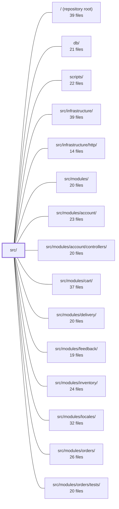

---
tags:
  - 2repo
  - 2repo/module
  - project/boilerplate-node-backend
type: module
module: src/
files: 22
updated: 2026-08-27T18:01:16.763890+00:00
---

# src/

## Purpose

`src/` is the application's composition root: it bootstraps the Express server, installs middleware in a security-relevant order, wires up infrastructure (database, cache, queue, workers), mounts domain-module routers from a registry, and manages the process lifecycle (cluster mode, graceful shutdown, centralised error handling). It also houses the **kernel**—a thin set of shared abstractions (authentication port, authorisation rules, in-process event bus, module-registry contract) that let domain modules compose without importing one another. No business logic lives here.

## Key parts

- **Bootstrap & lifecycle** — `cluster.ts` (process entry, OTel init, crash recovery), `app.ts` (Express server assembly, infrastructure connection, graceful shutdown), `app/workers.ts` (RabbitMQ consumer registration), `app/error-handling.ts` (request-level and process-level error capture).
- **Middleware & request pipeline** — `app/security.ts` (CORS, rate-limiting, body-parser ordering), `app/request-context.ts` (request ID, locale, access logging), `app/telemetry.ts` (Prometheus HTTP metrics), `app/static-assets.ts` (served uploads).
- **Routing & module wiring** — `app/routes.ts` (mounts every active module's router from the registry), `app/system-routes.ts` (liveness ping), `modules.ts` (the flat array of enabled modules).
- **Kernel (shared contracts)** — `kernel/registry.ts` (`AppModule` type + boot validation), `kernel/authentication.ts` (the `AuthResolver` port), `kernel/authorization.ts` (shared read-scope rule), `kernel/events.ts` (in-process domain event bus), `kernel/middlewares/authorizations.ts` (composable auth/authz guards), `kernel/seed-accounts.ts` (shared demo identities).
- **Types & shared DTOs** — `types/index.ts` (barrel re-export), `types/auth-context.ts` (transport-safe `AuthContext`), `types/asyncapi.generated.ts` (generated message-channel types), `globals.d.ts` (Express `Request` augmentation).
- **Demo surface** — `app/demo.ts` (two unauthenticated endpoints for the e2e suite, active only under `NODE_DEMO`).

## How it connects

- **`src/infrastructure/`** provides the concrete implementations (DB client, cache, queue, HTTP transport) that `app.ts` connects and that `app/workers.ts` drains. `src/infrastructure/http/` supplies the individual middleware handlers that `app/security.ts` composes in order.
- **`src/modules/`** (and its sub-folders `account`, `cart`, `delivery`, `feedback`, `inventory`, `locales`, `orders`, `payments`, `products`, `users`, `wishlist`) are the consumers of this module's contracts: each exports an `AppModule` validated by `kernel/registry.ts`, its router is mounted by `app/routes.ts`, its controllers read `request.authContext` defined in `kernel/middlewares/authorizations.ts`, and its services subscribe to the kernel event bus. `src/modules/account/` specifically supplies the concrete `AuthResolver` that the kernel port declares. `src/modules/users/` owns the records that `kernel/seed-accounts.ts` references.
- **`scripts/`** invokes the demo entry point and test harnesses that exercise the middleware stack and routes defined here.
- **`tests/`** (unit, integration, cross-cutting) verify the middleware ordering, error-handling behaviour, and module-registry wiring that this module establishes.

## Where to start

Read **`src/app.ts`** first—it walks the full bootstrap sequence (env validation → infra connection → middleware order → route mounting → listen → shutdown) and shows how every other file in this directory slots in. Then read **`src/kernel/registry.ts`** to understand the `AppModule` contract that every domain module must satisfy, which explains why `app/routes.ts` never hard-codes a module name.

## Connected modules

[[boilerplate-node-backend_ROOT|/ (repository root)]] · [[boilerplate-node-backend_db|db/]] · [[boilerplate-node-backend_scripts|scripts/]] · [[boilerplate-node-backend_src_infrastructure|src/infrastructure/]] · [[boilerplate-node-backend_src_infrastructure_http|src/infrastructure/http/]] · [[boilerplate-node-backend_src_modules|src/modules/]] · [[boilerplate-node-backend_src_modules_account|src/modules/account/]] · [[boilerplate-node-backend_src_modules_account_controllers|src/modules/account/controllers/]] · [[boilerplate-node-backend_src_modules_cart|src/modules/cart/]] · [[boilerplate-node-backend_src_modules_delivery|src/modules/delivery/]] · [[boilerplate-node-backend_src_modules_feedback|src/modules/feedback/]] · [[boilerplate-node-backend_src_modules_inventory|src/modules/inventory/]] · [[boilerplate-node-backend_src_modules_locales|src/modules/locales/]] · [[boilerplate-node-backend_src_modules_orders|src/modules/orders/]] · [[boilerplate-node-backend_src_modules_orders_tests|src/modules/orders/tests/]] · … and 8 more

## Files
- `src/app.ts` — Application entry point and Express server bootstrap. Validates the environment, connects all infrastructure (database, cache, queue, workers), initialises i18n, mounts the middleware stack in a load-bearing order, and listens. It also owns the graceful-shutdown path and the module-registry wiring that must complete before any route is reachable.
- `src/app/demo.ts` — HTTP control surface for the demo profile, mounted only when `NODE_DEMO=true` (i.e. under `npm run demo`). Exposes two unauthenticated routes that the frontend e2e suite calls to obtain a deterministic starting state (`POST /__demo/reset`) and to read simulated outbound email (`GET /__demo/emails`).
- `src/app/error-handling.ts` — Centralised error handling for the application at both levels a failure can surface: inside an HTTP request (as the final Express error middleware) and outside one (process-level `unhandledRejection` / `uncaughtException`). It ensures every unhandled error is logged, recorded on the active OpenTelemetry span, and responded to with a safe, generic payload.
- `src/app/request-context.ts` — Installs the set of per-request context middlewares (request ID, access logging, observability, locale) on the Express app. All of these attach data that downstream route handlers read, so this function must be called before any routes are mounted. The internal ordering of the three middlewares is load-bearing: the request ID must exist before the logger and any audit entry records it.
- `src/app/routes.ts` — Single-entry route installer for the Express app. It walks the list of enabled modules, mounts each one's router at its self-declared `basePath`, then mounts the non-domain `system-routes` router and a 404 catch-all. Because it drives mounting entirely from the module registry, no domain name is hard-coded here.
- `src/app/security.ts` — Installs the application's transport-level security middleware chain—secure headers, strict CORS, body parsing, and rate limiting—onto the Express instance. This file exists to encode the *order* in which those middlewares are registered, because the order is security-relevant (e.g. `trust proxy` must precede the rate limiter, body parsers must precede any handler that reads `request.body`). The actual handlers come from infrastructure; this file is the composition point.
- `src/app/static-assets.ts` — Configures Express to serve static files (user uploads and other public assets) directly from the Node process rather than offloading to a reverse proxy. This keeps the serving guarantees (security headers, MIME handling, cache policy) inside the application's testable surface.
- `src/app/system-routes.ts` — Defines a minimal Express router that exposes a single liveness/ping endpoint (`GET /`). It exists so that external monitors, load-balancers, or operators can confirm the process is alive without hitting any business-logic routes.
- `src/app/telemetry.ts` — Express middleware that records per-request latency and in-flight request counts as Prometheus HTTP metrics. It exists to give the service observable request-level performance data without coupling instrumentation logic to individual route handlers.
- `src/app/workers.ts` — Assembly point that registers all RabbitMQ queue consumers at app startup. It is the single place where the application decides *which* queues this build drains, wiring them to infrastructure-level handlers. No-ops cleanly when the queue is disabled.
- `src/cluster.ts` — Entry-point wrapper (set as `"main"` in `package.json`) that either runs the app under Node's `cluster` module with crash-recovery and coordinated shutdown logic, or falls back to directly loading `app.ts` when clustering is disabled. It also ensures OpenTelemetry tracing is initialized before any other module is evaluated.
- `src/globals.d.ts` — TypeScript declaration file that augments the Express `Request` interface (via `express-serve-static-core` module augmentation) so controllers and middleware can access request-scoped metadata—auth context, locale, translation function, request ID, and stored image URLs—without manual casting. It exists purely for type-safety at compile time and emits no runtime code.
- `src/kernel/authentication.ts` — Declares the authentication **port** that the kernel exposes: a typed contract (`AuthResolver`) for turning signed tokens into a lightweight user identity. The concrete implementation is supplied later by the `account` module at boot, so the kernel never imports from a module. This separation lets builds that omit `account` still type-check and run, with authentication simply unavailable.
- `src/kernel/authorization.ts` — Single source of truth for the shared read-scope rule used across four domains (orders, payments, products, locales): admins are unrestricted, everyone else is narrowed to a module-specific slice. Centralising this rule eliminates four hand-written copies that could silently drift in the wrong direction (widening rather than tightening).
- `src/kernel/events.ts` — A minimal in-process domain event bus that lets modules communicate without importing each other, breaking would-be circular dependencies (e.g. products ↔ cart) into a one-directional emit/listen relationship. It is explicitly *not* a durable broker: no persistence, no retry, no replay.
- `src/kernel/middlewares/authorizations.ts` — Express middleware pipeline for authentication and authorization. Provides composable guards (`getAuth` → `isAuth` → `isAdmin`) that populate `request.authContext` from a Bearer access token, reject unauthenticated or insufficiently-privileged requests, and emit audit events for every rejection. Also exports a cookie-based variant (`isAdminViaCookie`) for SSE endpoints where `EventSource` cannot send an `Authorization` header.
- `src/kernel/registry.ts` — Defines the type-level contract that every domain module must satisfy (`AppModule`) and provides the boot-time functions that validate the module list and wire up domain-event subscriptions. It turns the explicit array in `src/modules.ts` into a validated, mounted application without any filesystem discovery.
- `src/kernel/seed-accounts.ts` — Centralises the fixed identity and credentials of the two demo (seed) accounts so that four unrelated modules can reference the same IDs and log-in values without each defining its own string literals. Lives in the kernel specifically because the `users` module owns the records but `account`, `cart`, `orders`, and `wishlist` all need a handle on "who is admin" and "who is the regular user."
- `src/modules.ts` — The single source of truth for which domain modules are active in a given build. It imports one default export per module folder and re-exports them as a flat array, so that the rest of the app (routing, demo data, scripts) can iterate over "the modules this build serves" without knowing which ones exist.
- `src/types/asyncapi.generated.ts` — Auto-generated TypeScript type definitions and channel-name constants derived from `asyncapi.yaml`. It gives the rest of the codebase compile-time access to message payload shapes (observability metrics, email/PDF jobs) and canonical channel identifiers without hand-maintaining them.
- `src/types/auth-context.ts` — Defines the transport-safe authentication context DTO (`AuthContext`) and the narrower authorization-decision type (`Caller`). It exists so that controllers, middleware, and services depend on a plain interface rather than a Mongoose `UserDocument`, keeping the HTTP/auth layer decoupled from persistence internals.
- `src/types/index.ts` — Barrel (re-export) module that gives the rest of the codebase a single import path for all shared type definitions. It aggregates API models, generated AsyncAPI types, and the transport-safe auth-context DTOs so consumers never need to know the individual source files.

---
[[boilerplate-node-backend_INDEX|← boilerplate-node-backend index]]
