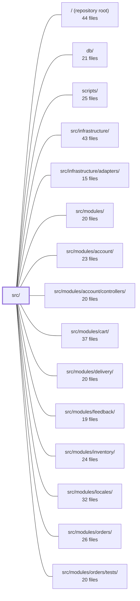

---
tags:
  - 2repo
  - 2repo/module
  - project/boilerplate-node-backend
type: module
module: src/
files: 22
updated: 2026-08-31T20:50:44.003698+00:00
---

# src/

## Purpose

`src/` is the application shell: it owns process entry, Express construction, middleware ordering, module registration, and the shared kernel abstractions (auth ports, authorization rules, event bus, module-manifest typing) that every domain module plugs into. It contains no business logic of its own; its job is to wire, guard, and expose.

## Key parts

- **Entry & lifecycle** — `cluster.ts` (the `package.json` "main") and `app.ts` together boot the process, initialize OpenTelemetry before any instrumented import, construct the Express app, and manage start/stop.
- **Express middleware & route mounting** — `app/security.ts`, `app/request-context.ts`, `app/static-assets.ts`, `app/telemetry.ts`, `app/error-handling.ts`, and `app/routes.ts` collectively define the ordered middleware stack and the single function that mounts all domain routers plus system routes. `app/system-routes.ts` holds the root ping; `app/demo.ts` exposes two unauthenticated endpoints gated behind `NODE_DEMO=true`.
- **Worker wiring** — `app/workers.ts` is the one startup hook that decides which queue consumers (email, PDF, image) this build drains and connects them to the `infrastructure` adapters.
- **Kernel (shared contracts)** — `kernel/registry.ts` defines the `AppModule` manifest type and the `registerModules` / `resolveImageTargets` entry points. `kernel/authentication.ts` declares the token→user port. `kernel/authorization.ts` provides the single admin-bypass row filter shared across four domains. `kernel/middlewares/authorizations.ts` turns those ports into Express guards. `kernel/events.ts` is a minimal in-process pub/sub. `kernel/seed-accounts.ts` pins the two demo identities.
- **Module list** — `modules.ts` is the one-line-per-domain registry that `kernel/registry.ts` consumes; adding or removing a domain is an edit here.
- **Types & globals** — `types/index.ts` (barrel), `types/asyncapi.generated.ts` (generated channel/payload types), `types/auth-context.ts` (plain-shape auth DTOs), and `globals.d.ts` (Express `Request` augmentation) give every file in the repo a stable, import-free typing surface.

## How it connects

- **→ `src/infrastructure/` & `src/infrastructure/adapters/`** — `app.ts` and `app/workers.ts` import concrete adapters (database client, cache, queue, email/PDF/image workers) and hand them to the kernel ports; the kernel never imports infrastructure directly.
- **→ `src/modules/` (account, cart, delivery, feedback, inventory, locales, orders, payments, products, users, wishlist)** — `modules.ts` enumerates them; `kernel/registry.ts` reads each module's manifest and calls its `router` / `basepath` / `consumers` at boot. `app/routes.ts` mounts the resulting routers. Domain controllers under `src/modules/account/controllers/` (and siblings) are the handlers that the middleware in `kernel/middlewares/authorizations.ts` guards.
- **→ `db/`** — Schema and model definitions live outside `src/`; infrastructure adapters in `src/infrastructure/` bridge them into the Express request/response cycle that `app.ts` wires up.
- **← `scripts/`, `tests/`, `tests/cross-cutting/`, `tests/support/`, `tests/unit/`, `src/modules/*/tests/`** — Test harnesses and operational scripts import from `src/` (entry points, kernel types, seed accounts) to spin up the app or assert against its public surface.
- **← `/` (repository root)** — `package.json`, `tsconfig`, `.dependency-cruiser.cjs`, and `asyncapi.yaml` (source of `types/asyncapi.generated.ts`) configure and constrain this module.

## Where to start

1. **`src/app.ts`** — Reading top-to-bottom gives you the full boot sequence: OTel init → infrastructure wiring → middleware order → route mount → worker registration → `listen`. Every other file in `src/` is a piece this file pulls in.
2. **`src/kernel/registry.ts`** — Understanding the `AppModule` shape and the `registerModules` flow tells you what a "domain" must provide and how the shell discovers it, which is the contract you'll touch first when adding or modifying a module.

## Connected modules

[[boilerplate-node-backend_ROOT|/ (repository root)]] · [[boilerplate-node-backend_db|db/]] · [[boilerplate-node-backend_scripts|scripts/]] · [[boilerplate-node-backend_src_infrastructure|src/infrastructure/]] · [[boilerplate-node-backend_src_infrastructure_adapters|src/infrastructure/adapters/]] · [[boilerplate-node-backend_src_modules|src/modules/]] · [[boilerplate-node-backend_src_modules_account|src/modules/account/]] · [[boilerplate-node-backend_src_modules_account_controllers|src/modules/account/controllers/]] · [[boilerplate-node-backend_src_modules_cart|src/modules/cart/]] · [[boilerplate-node-backend_src_modules_delivery|src/modules/delivery/]] · [[boilerplate-node-backend_src_modules_feedback|src/modules/feedback/]] · [[boilerplate-node-backend_src_modules_inventory|src/modules/inventory/]] · [[boilerplate-node-backend_src_modules_locales|src/modules/locales/]] · [[boilerplate-node-backend_src_modules_orders|src/modules/orders/]] · [[boilerplate-node-backend_src_modules_orders_tests|src/modules/orders/tests/]] · … and 8 more

## Files
- `src/app.ts` — The process entry point. It constructs the Express application, wires all infrastructure (tracing, database, cache, queue, i18n), registers the module registry, mounts the full middleware/route stack in its load-bearing order, and owns the start/stop lifecycle. The file's primary structural constraint is that OTel must initialize before any module it instruments is imported.
- `src/app/demo.ts` — Control surface for the demo profile, mounted exclusively when `NODE_DEMO=true` (via `npm run demo`). Exposes two unauthenticated Express routes used by the paired frontend's e2e suite: one to reseed the in-memory database from module fixtures and clear the email outbox, and one to read back captured "sent" emails.
- `src/app/error-handling.ts` — Global error handling for the Express application. It defines the last-resort error handler that catches any failure no route or middleware handled, and it registers `process.on` handlers for unhandled rejections and uncaught exceptions. Both answer the same question — "what happens to a failure nobody else handled?" — at the request level and the process level respectively.
- `src/app/request-context.ts` — Installs the per-request context middleware (correlation ID, access logging, observability, locale) in a single, ordered block that must run before any route is registered. It exists to keep all "attach-then-read" setup in one place so the ordering contract is explicit and maintained alongside the routes it guards.
- `src/app/routes.ts` — Single-entry-point function that mounts all domain routers (driven by module manifests) plus the non-domain system routes and a 404 catch-all onto an Express app. It exists so that adding a new domain never requires touching this file—modules self-declare their `basePath` and router.
- `src/app/security.ts` — Installs transport-level security middleware (secure headers, strict CORS, body parsers, rate limiting) onto an Express app in a single call. Exists as a dedicated module because the **ordering** of these middlewares is non-obvious and security-critical: `trust proxy` must precede the rate limiter, and body parsers must precede any handler that reads `request.body`.
- `src/app/static-assets.ts` — Installs an `express.static` middleware that serves uploaded images and other public assets from a configurable directory. It centralises the caching and security headers for those files in one place rather than delegating to a reverse proxy, so the guarantees are testable within the app itself.
- `src/app/system-routes.ts` — Defines system-level HTTP routes that concern the process itself rather than any domain module. Currently it exposes only the root ping endpoint, serving as a liveness check that the API is up. It lives outside `src/modules` because it has no business-logic owner.
- `src/app/telemetry.ts` — Installs a single Express middleware that records per-request latency and in-flight request counts as Prometheus metrics. It exists to provide observability into request duration and concurrency without requiring instrumentation at every route handler.
- `src/app/workers.ts` — Assembly-time registration of all queue consumers for this build. It decides *which* queues the application drains and wires each to its handler, acting as the single startup hook that connects `infrastructure` workers (email, PDF, image) to the `queue` adapter. It exists because the choice of queues is a per-build decision that belongs at the application layer, not inside any individual worker.
- `src/cluster.ts` — Entry-point wrapper (set as `"main"` in `package.json`) that either runs the app under Node's `cluster` module with crash-recovery and coordinated shutdown logic, or falls back to directly loading `app.ts` when clustering is disabled. It also ensures OpenTelemetry tracing is initialized before any other module is evaluated.
- `src/globals.d.ts` — Ambient module declaration that augments Express's `Request` interface so every handler automatically sees the fields middleware attaches (auth, locale, request id, image storage metadata) without needing an explicit import at each call site.
- `src/kernel/authentication.ts` — Declares the authentication **port** the kernel exposes: an interface for turning a signed token into an `AuthenticatedUser`, plus a single-slot registry that the `account` module fills at boot. It exists so that guards and other kernel code can resolve identity without depending on any concrete storage or module, and so that the semantic distinction between "token invalid" (→ 401) and "token valid but user gone" (→ 403) is preserved for callers.
- `src/kernel/authorization.ts` — Provides a single, shared row-level authorization rule used by four domains (orders, payments, products, locales): an admin sees all rows, everyone else sees a narrowed slice. It centralizes the "admin is unrestricted" check so the per-domain narrowing logic is expressed only once, eliminating the silent drift that occurs when the same admin-bypass logic is copy-pasted into each service.
- `src/kernel/events.ts` — A minimal in-process domain event bus that lets modules communicate without importing each other, preserving the acyclic dependency graph enforced by `.dependency-cruiser.cjs`. It is explicitly *not* a durable broker: no persistence, no retry, no replay.
- `src/kernel/middlewares/authorizations.ts` — Express middleware guards that sit in front of route handlers to enforce authentication and role-based access. They build on the token resolvers in `kernel/authentication.ts`, attach a caller identity to `request.authContext`, and emit an audit event before every rejection so that no denied request goes unrecorded.
- `src/kernel/registry.ts` — Defines the **module manifest type** (`AppModule`) and the two runtime entry points (`registerModules`, `resolveImageTargets`) that turn the explicit list in `src/modules.ts` into a wired-up application. It is the single place where the shape of a module is enforced at the type level, so enabling a domain is a one-line edit to the list rather than a filesystem discovery step.
- `src/kernel/seed-accounts.ts` — Declares the identity and login credentials of the two demo accounts (admin and regular user) as module-level constants. It lives in the kernel rather than `src/modules/users` because multiple modules need to reference these accounts by ID, while only the `users` module owns the actual record. The file exists so the frontend's e2e login flow and every demo-data module can share a single, fixed source of truth for who the demo people are.
- `src/modules.ts` — Central registry that enumerates which domain modules this build serves. It is the single point where a module is added (a new folder under `src/modules/` plus one import/entry) or removed (delete the entry and `rm -rf` the folder). All consumers that need the full module list import `enabledModules` from here rather than hard-coding paths.
- `src/types/asyncapi.generated.ts` — Auto-generated TypeScript type definitions and channel-name constants derived from `asyncapi.yaml`. It gives the rest of the codebase compile-time access to message payload shapes (observability metrics, email/PDF jobs) and canonical channel identifiers without hand-maintaining them.
- `src/types/auth-context.ts` — Defines two small type aliases that decouple the HTTP/auth flow from Mongoose document internals. Services, controllers, and middleware consume these plain-shape types instead of `UserDocument`, so the auth contract on the wire is stable and auditable without leaking ORM concerns.
- `src/types/index.ts` — Type barrel that consolidates three sources of public types—generated API models, generated AsyncAPI types, and a hand-written auth-context DTO—behind a single import path (`@types`). Consumers never need to know which file a type actually originates from.

---
[[boilerplate-node-backend_INDEX|← boilerplate-node-backend index]]
