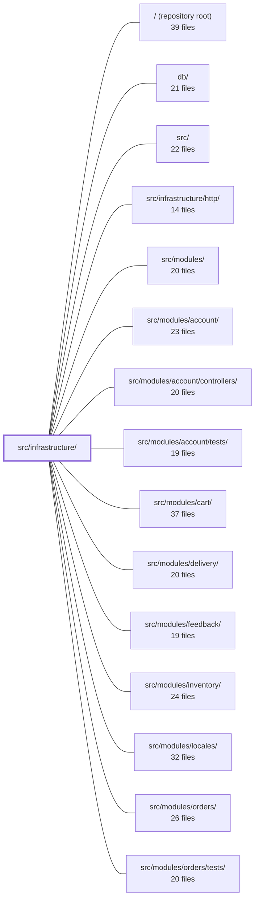

---
tags:
  - 2repo
  - 2repo/module
  - project/boilerplate-node-backend
type: module
module: src/infrastructure/
files: 39
updated: 2026-08-28T11:57:17.593606+00:00
---

# src/infrastructure/

## Purpose

`src/infrastructure/` is the application's plumbing layer: it owns every interaction with an external system (Redis, RabbitMQ, MongoDB, filesystem, SMTP, Puppeteer, OTel) and every cross-cutting runtime concern (i18n, observability, graceful shutdown). Application modules in `src/modules/` import from here; they never speak to a third-party SDK directly. The module enforces a fail-open / degrade-gracefully policy—optional dependencies, when unconfigured or unreachable, resolve to safe no-ops rather than throwing.

## Key parts

- **`adapters/`** — Thin wrappers around each external dependency: `cache.ts` (Redis), `queue.ts` (RabbitMQ), `mailer.ts` / `email.worker.ts` (email produce/consume), `filesystem.ts` + `image-store.ts` + `image-signatures.ts` + `storage.ts` (upload pipeline and image handling), `pdf.ts` / `pdf.worker.ts` (PDF rendering via Puppeteer), `logger.ts` (Winston), `demo-outbox.ts` (test-only email capture), `pdf.ts`.
- **`i18n/`** — Request-scoped internationalisation: `negotiate.ts` resolves `Accept-Language`, `context.ts` propagates a per-locale `t` through `AsyncLocalStorage`, `catalog.ts` assembles the translation resource at boot, `overrides.ts` layers admin-edited strings, and `index.ts` re-exports the public API.
- **`observability/`** — Monitoring and compliance: `metrics-http.ts` + `metrics-cache.ts` (Prometheus), `stream.ts` (SSE dashboard feed), `tracer.ts` (OpenTelemetry spans), `audit.ts` (compliance log), `analytics/` (pluggable product-analytics providers: Umami, PostHog, none), `dependency-health.ts`, `process-snapshot.ts`.
- **`persistence/`** — Shared MongoDB helpers consumed by every module's repository: `base-repository.ts` (CRUD factory), `serialize.ts` (wire-format transform), `search.ts` (pagination + text search), `seed.ts` (fixture upsert), `factory.ts` (identity-field conventions).
- **`runtime/`** — Boot and lifecycle: `environment.ts` (env validation), `database.ts` (Mongoose connection), `managed-connection.ts` (optional-dep lifecycle), `server-lifecycle.ts` (graceful start/stop), `otel-sdk.ts` (tracing bootstrap).

## How it connects

- **`src/infrastructure/http/`** — The Express app, middleware, and route mounting live in the sibling `http/` directory; it imports this module's adapters (cache, logger, metrics) and i18n context to wire the request pipeline.
- **`src/modules/`** (account, orders, payments, products, etc.) — Every domain module consumes `persistence/base-repository.ts`, `persistence/serialize.ts`, `adapters/mailer.ts`, `adapters/logger.ts`, `adapters/image-store.ts`, and the i18n barrel to fulfil its use-cases without touching a driver directly.
- **`tests/unit/infrastructure/adapters/`** — Unit tests target the adapter contracts (cache, mailer, queue, image signatures, storage) in isolation.
- **`tests/cross-cutting/`** and **`tests/support/`** — Integration and e2e suites depend on the demo outbox, seed helpers, and observability endpoints exposed by this module.
- **`db/`** — The MongoDB schema definitions that `persistence/base-repository.ts` and `persistence/serialize.ts` operate against at runtime.

## Where to start

1. **`runtime/environment.ts`** — Read this first to learn which variables are mandatory, which are optional, and how the fail-fast vs. degrade-gracefully split is drawn. It explains why most adapters can "just work" with no configuration.
2. **`persistence/base-repository.ts`** — Next, read the repository factory to see the single pattern every module's data access flows through (ObjectId coercion, lean mapping, filter compilation). Once you understand this, the per-module services in `src/modules/` become straightforward consumers rather than bespoke queries.

## Connected modules

[[boilerplate-node-backend_ROOT|/ (repository root)]] · [[boilerplate-node-backend_db|db/]] · [[boilerplate-node-backend_src|src/]] · [[boilerplate-node-backend_src_infrastructure_http|src/infrastructure/http/]] · [[boilerplate-node-backend_src_modules|src/modules/]] · [[boilerplate-node-backend_src_modules_account|src/modules/account/]] · [[boilerplate-node-backend_src_modules_account_controllers|src/modules/account/controllers/]] · [[boilerplate-node-backend_src_modules_account_tests|src/modules/account/tests/]] · [[boilerplate-node-backend_src_modules_cart|src/modules/cart/]] · [[boilerplate-node-backend_src_modules_delivery|src/modules/delivery/]] · [[boilerplate-node-backend_src_modules_feedback|src/modules/feedback/]] · [[boilerplate-node-backend_src_modules_inventory|src/modules/inventory/]] · [[boilerplate-node-backend_src_modules_locales|src/modules/locales/]] · [[boilerplate-node-backend_src_modules_orders|src/modules/orders/]] · [[boilerplate-node-backend_src_modules_orders_tests|src/modules/orders/tests/]] · … and 10 more

## Files
- `src/infrastructure/adapters/cache.ts` — A Redis byte-store adapter that provides four low-level operations (read, write, tag-invalidate, lifecycle) over an opaque `string` payload. It exists so that the HTTP caching middleware, tag-based invalidation, and any future caller can share one connection and one key-namespace scheme without re-implementing Redis plumbing. Every function **fails open**: a Redis outage or disabled flag resolves to `undefined` / a no-op rather than throwing, because the cache is an optimisation, never a hard dependency.
- `src/infrastructure/adapters/demo-outbox.ts` — An in-memory email outbox that captures sends during `npm run demo` (when no SMTP server or broker is available). The mailer adapter records emails here instead of calling nodemailer, and the demo router serves the accumulated list to the e2e suite so specs can assert on password-reset tokens and rendered content. It is infrastructure-tier by design so the mailer adapter never reaches up into `app`. Inert unless `NODE_DEMO=true`.
- `src/infrastructure/adapters/email.worker.ts` — Consumer handler for the email queue. It validates a job payload, renders a template, and dispatches the resulting email via the `nodemailer` adapter. It exists as the "worker side" of the producer/consumer split defined in `mailer.ts`, so the application can enqueue emails from any request context and deliver them asynchronously through the message broker.
- `src/infrastructure/adapters/filesystem.ts` — Low-level filesystem helpers (`moveFile`, `deleteFile`) used to relocate and clean up upload files. They exist as a thin adapter layer so callers don't repeat `rename`/`EXDEV` fallback logic or ad-hoc error-swallowing patterns.
- `src/infrastructure/adapters/image-signatures.ts` — Identifies the actual image format of an uploaded file by inspecting its leading magic bytes, rather than trusting the client-supplied `Content-Type` or filename. Exists to close a class of stored-XSS and MIME-spoofing attacks where a file whose bytes are a valid PNG/JPEG/WebP is given a dangerous extension or served with a wrong `Content-Type`. Deliberately dependency-free: three formats are matched inline rather than via a library like `file-type`.
- `src/infrastructure/adapters/image-store.ts` — Port that owns the single mapping between a persisted `imageUrl` value and a concrete filesystem location. Nothing outside this file is permitted to turn an `imageUrl` into a path, so that swapping the storage backend (e.g. to an S3/CDN bucket) is a one-file change rather than a five-file change. The one implemented backend stores files under `NODE_PUBLIC_PATH/images/` and serves them via `express.static`.
- `src/infrastructure/adapters/logger.ts` — Provides the application's structured logging layer built on Winston. It exposes a redaction-aware JSON logger (`logger`) for general use and a fixed-format audit logger (`auditLogger`) for compliance events, ensuring sensitive fields are stripped from every record before output.
- `src/infrastructure/adapters/mailer.ts` — Email delivery adapter: renders EJS templates to HTML and sends them over SMTP via Nodemailer, or enqueues the job on RabbitMQ for async delivery. It is the single producer-side entry point that application modules (e.g. account verification, password reset) call to "send an email" without knowing about SMTP, templates, or queues.
- `src/infrastructure/adapters/pdf.ts` — Provides a single `renderHtmlToPdf` function that turns an HTML string into a PDF `Uint8Array` via headless Chromium (`puppeteer-core`). It exists so that invoice and report generation has one shared, container-friendly rendering path instead of each caller duplicating the launch/render/close boilerplate.
- `src/infrastructure/adapters/pdf.worker.ts` — Queue worker handler that fulfils a single PDF-generation job: it renders an EJS template to HTML and converts that HTML to a PDF file on disk via Puppeteer. It exists as the concrete "consumer" half of the PDF pipeline, paired with the producer that enqueues the job.
- `src/infrastructure/adapters/queue.ts` — RabbitMQ (AMQP 0-9-1) adapter providing publish and consume primitives over a single shared channel. Every public function degrades to a safe no-op when the broker is unconfigured, so callers (e.g. `enqueueEmail` in `mailer.ts`) can fall back to doing work inline without try/catch gymnastics.
- `src/infrastructure/adapters/storage.ts` — Configures the Multer-based file-upload pipeline for the Express API: where uploads are staged on disk, how files are renamed, which MIME types are admitted, what size limits apply, and how the actual bytes are validated after the write. It produces a ready-to-mount `RequestHandler` (`.single('imageUpload')`, etc.) that every upload route uses, ensuring that untrusted uploads never land in the public directory, never reuse a client-supplied filename, and never bypass locale-aware error messaging.
- `src/infrastructure/i18n/catalog.ts` — Boot-time translation catalog: discovers which locales exist, deep-merges the shared dictionary with each module's contribution, and hands the assembled `i18next` `Resource` object to `i18next.init()`. It is the single place that answers "where do translation files live?" so no consumer of the request-scoped `t` function ever touches the filesystem.
- `src/infrastructure/i18n/context.ts` — Solves the concurrency bug inherent in `i18next`'s single global instance: two overlapping requests in different languages would otherwise clobber each other's translations. It provides a request-scoped `t` (bound to one locale via `i18next.getFixedT`) propagated through an `AsyncLocalStorage`, so each request's async chain sees only its own language without touching any global.
- `src/infrastructure/i18n/index.ts` — Barrel (entry-point) export for the i18n infrastructure. It re-exports the public API of four submodules—`catalog`, `overrides`, `context`, `negotiate`—under a single import path (`@infrastructure/i18n`) so that ~70 import sites never need to know which file answers a given symbol. It also enforces the project convention that request-scoped translation is always obtained via this module, never from a global `i18next` instance.
- `src/infrastructure/i18n/negotiate.ts` — Implements `Accept-Language` header negotiation: given a client-supplied header string and a list of supported locales, it returns the single best-matching locale. It is a pure function (no request object, no ambient state) so both the HTTP middleware and tests can call it with arbitrary inputs.
- `src/infrastructure/i18n/overrides.ts` — Database-overlay tier for i18n: admin-edited translations stored outside the deployed dictionary files, layered on top of them at runtime. Designed to be a single, removable file — deleting it and its two boot-sequence lines strips the feature entirely.
- `src/infrastructure/observability/analytics-events.frontend.ts` — Read-only, generated list of the four analytics event names this **client** app is allowed to emit into the shared Umami namespace. It exists so both repos reference identical event names (the "contract") while keeping the client's list minimal—only events that no API call can carry (app lifecycle, local token discard, a request that never left the browser).
- `src/infrastructure/observability/analytics/index.ts` — Defines the product-analytics port and its registry. It answers product questions ("how many users abandon checkout?") as distinct from metrics/tracing, and lets callers emit events without knowing which backend receives them. The concrete provider is a deployment decision made via `NODE_ANALYTICS_PROVIDER` (default `umami`), mirroring the `NODE_PAYMENT_PROVIDER` pattern.
- `src/infrastructure/observability/analytics/none.ts` — A no-op analytics provider selected via `NODE_ANALYTICS_PROVIDER=none`. It makes "this deployment collects no product analytics" an explicit, stated choice rather than a silent side effect of leaving credentials blank. Unlike the other providers (which warn when selected but unconfigured), this one is intentionally silent because collecting nothing is its entire purpose.
- `src/infrastructure/observability/analytics/posthog.ts` — Implements the `posthog` variant of the `AnalyticsProvider` interface. It exists as an alternative to the default Umami provider for projects that need identity-shaped funnels (stitching a user's timeline by `distinct_id`). Selected via `NODE_ANALYTICS_PROVIDER=posthog`; requires both `NODE_POSTHOG_API_KEY` and `NODE_POSTHOG_HOST` to be set.
- `src/infrastructure/observability/analytics/umami.ts` — Default analytics provider that POSTs server-side funnel events to a self-hosted Umami instance over plain HTTP (`/api/send`). Exists so the backend half of shared funnels lands in the same `website_event` table as the browser tracking script, without a dedicated server SDK.
- `src/infrastructure/observability/audit.ts` — Provides the audit-trail layer: a closed vocabulary of action identifiers, a structured event shape, and the emit/persist pipeline that records *who did what to which resource, and whether it succeeded*. It is deliberately separate from application logging — audit entries are a compliance artefact written to a dedicated always-on logger with a stable, machine-readable field set.
- `src/infrastructure/observability/dependency-health.ts` — Readiness health report for all backing services (database, cache, queue). It reports the *current* connection state each adapter already maintains — no I/O is performed — and is published by `GET /observability/health`. It is deliberately separate from the liveness probe (`GET /`) so that a degraded dependency signals degradation without triggering a container restart.
- `src/infrastructure/observability/metrics-cache.ts` — Defines the sole Prometheus counter for cache-invalidation failures. It exists to make alertable a failure mode where a write succeeds but the cached predecessor is not removed, leaving a stale response in service for the full TTL — a condition a log line cannot surface to monitoring.
- `src/infrastructure/observability/metrics-http.ts` — Defines and registers all HTTP-level and process-level Prometheus metrics (via `prom-client`) for the service. It provides the shared registry, the core RED counters/histograms for request traffic, in-flight gauges, and helper functions for recording a completed request and aggregating histogram data into percentiles. It exists so that every module and the HTTP middleware write into a single, scrape-ready metric set rather than ad-hoc per-module registries.
- `src/infrastructure/observability/process-snapshot.ts` — Provides a single atomic reading of process memory and uptime so that every observability payload is built from the same instant. Without it, three independent calls to `process.memoryUsage()` / `process.uptime()` could disagree on rounding or timing across the SSE stream and the two REST endpoints.
- `src/infrastructure/observability/stream.ts` — Implements a Server-Sent Events (SSE) endpoint that pushes live process and HTTP metrics to connected dashboard clients every 5 s, with a 15 s heartbeat to survive proxy idle timeouts. SSE was chosen over WebSockets because the data is strictly one-way, requires no protocol upgrade, and browsers reconnect automatically via `EventSource`.
- `src/infrastructure/observability/tracer.ts` — Thin wrapper around the OpenTelemetry API that centralises span creation, span-context reading, and error annotation for the `boilerplate-node-backend` service. It lets any part of the codebase instrument an operation or correlate a log/audit/analytics event to a trace without importing OTel directly or worrying about the no-op fallback when no SDK is registered.
- `src/infrastructure/persistence/base-repository.ts` — Factory (`createBaseRepository`) that produces a uniform CRUD + search object for any Mongoose model. It centralises three pieces of Mongo knowledge that services must not carry: `ObjectId` coercion, lean→normalised key mapping, and filter-bag→query compilation. It is a closure factory consumed by **spread**, not a base class — modules that cannot honour the full contract (e.g. `orders` omits `search`, `audit-logs` exposes only three members) narrow their own type instead of inheriting a method they'd have to break.
- `src/infrastructure/persistence/factory.ts` — Shared primitives that every module's `factory.ts` would otherwise duplicate: identity handling (`_id`, `createdAt`, `updatedAt`), the overrides-bag type, and small helpers for date/undefined normalisation. Lives in `infrastructure` because it knows a document has an `_id` but nothing about what the document means.
- `src/infrastructure/persistence/search.ts` — Shared pagination and text-search helpers used by every repository `search` method. Exists so that pagination defaulting, regex escaping, and sort conventions live in one place (OCP), rather than being re-implemented in each module's repository or service.
- `src/infrastructure/persistence/seed.ts` — Provides the generic seeding primitive that every module's `demo.ts` uses to upsert fixed-ID fixtures into a database. It lives in `infrastructure` because it is domain-agnostic: it only knows a repository shape and a fixture with a pinned `_id`, never a specific collection name. It also exposes a `toJSON`-based collection reader so the demo dataset can be exported in a deterministic, byte-stable form.
- `src/infrastructure/persistence/serialize.ts` — Single serialization layer that converts a stored Mongoose document into its API wire payload. Exists because the OpenAPI contract (95 schemas with `additionalProperties: false`) demands a uniform shape — `_id` → `id`, `__v` removed, no undeclared keys — and two code paths (`toJSON` and raw `.lean()`/`.aggregate()`) each need it in a different way. This file provides one transform that serves both.
- `src/infrastructure/runtime/database.ts` — Owns the full MongoDB connection lifecycle (resolve URI → connect with retry → disconnect) for the application. It wraps Mongoose's singleton connection so the rest of the codebase can `import mongoose` and assume a live connection without managing handshake, backoff, or teardown themselves.
- `src/infrastructure/runtime/environment.ts` — Centralises the two environment-variable coercions every reader shares (string → integer, string → boolean) and the fail-fast validation of mandatory variables. Only *hard* requirements are validated here; optional infrastructure (Redis, RabbitMQ, SMTP, PostHog, OTLP) is deliberately excluded so those adapters can degrade gracefully when unconfigured.
- `src/infrastructure/runtime/managed-connection.ts` — Centralises the lifecycle of an *optional* external dependency (Redis, RabbitMQ) so that unconfigured, unreachable, or in-flight states are all handled by one shared rule set. Adapters supply only three operations — open, check-alive, close — and receive a uniform `get()`/`state()`/`stop()` surface that never rejects, enabling every caller to treat a missing handle as "skip this step" rather than a request failure.
- `src/infrastructure/runtime/otel-sdk.ts` — Bootstraps the OpenTelemetry `NodeSDK` for the application: configures service identity, batch OTLP span export, and auto-instrumentation for HTTP, Express, Mongoose, and Redis. Exposes a start/shutdown pair so the rest of the codebase never touches OTel APIs directly.
- `src/infrastructure/runtime/server-lifecycle.ts` — Single-responsibility module for graceful server startup sequencing and shutdown orchestration. It owns the shutdown ordering, the signal-handling wiring, and the forced-exit deadline—deliberately kept separate from Express middleware and route mounting so that the "how to stop" logic is isolated from the "what to serve" logic.

---
[[boilerplate-node-backend_INDEX|← boilerplate-node-backend index]]
