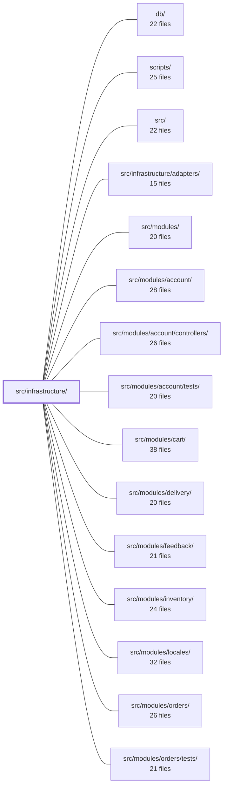

---
tags:
  - 2repo
  - 2repo/module
  - project/boilerplate-node-backend
type: module
module: src/infrastructure/
files: 43
updated: 2026-09-02T18:31:42.987947+00:00
---

# src/infrastructure/

## Purpose

`src/infrastructure/` is the shared, domain-agnostic layer that every feature module builds on. It owns the HTTP plumbing (request parsing, response envelope, validation, rate-limiting, caching), the i18n runtime, the observability stack (metrics, tracing, audit, analytics, SSE), persistence helpers around Mongoose, and the process runtime (database connection, environment coercion, OTel bootstrap, graceful shutdown). Modules in `src/modules/*` never import Mongoose, Express, i18next, or prom-client directly—they reach through this layer.

## Key parts

- **HTTP core** (`http/controller.ts`, `http/request.ts`, `http/response.ts`, `http/schemas.ts`, `http/errors.ts`, `http/uploads.ts`, `http/validation-messages.ts`) — The composable building blocks every Express handler uses: a single `readInput` entry point, the canonical success/error envelope, shared Zod query-param schemas, structured error types that map Mongoose failures to status codes, upload normalisation, and a global Zod message hook for localisation.
- **HTTP middlewares** (`http/middlewares/`) — Cross-cutting request concerns: Redis-backed response cache, locale resolution via AsyncLocalStorage, Redis-or-memory rate-limit stores and the six limiters, structured access-logging, and a path-segment flag helper.
- **i18n** (`i18n/`) — A request-scoped translation subsystem (catalog loading, locale negotiation, per-request `AsyncLocalStorage` context, database overlay) that replaces i18next's single-global-language model so concurrent requests in different languages don't interfere.
- **Observability** (`observability/`) — Prometheus metrics (HTTP RED, DB, cache), OpenTelemetry tracing wrapper, structured audit trail, product-analytics port with Umami/PostHog/no-op providers, dependency-health snapshot, an SSE live-metrics stream, and a shared process-snapshot reader.
- **Persistence** (`persistence/`) — A generic Mongoose repository factory, shared pagination/filter/serialisation helpers, fixture-building primitives, and domain-agnostic seed utilities that every module's repository and `demo.ts` spread into their own code.
- **Runtime** (`runtime/`) — MongoDB connection lifecycle, env-var coercion helpers, OpenTelemetry SDK bootstrap, and the ordered graceful-shutdown sequence.
- **Surfaces** (`surfaces/create-delete-controller.ts`) — A factory that assembles the shared plumbing (id extraction, hard-delete flag, validation, audit, error mapping) for any entity's DELETE handler, so each module supplies only its four per-entity differences.

## How it connects

- **`src/modules/*`** (account, orders, products, etc.) are the primary consumers: they import the HTTP helpers, the repository factory, the i18n context, the audit/analytics emitters, and the delete-controller factory. They never touch Mongoose, Express, or i18next globals directly.
- **`src/infrastructure/adapters/`** provides the concrete storage backends (Redis, file storage, queue) that the middlewares, cache layer, and analytics providers reference. The rate-limit store deliberately opens a *separate* Redis connection from the cache adapter so the two can be independently toggled.
- **`src/modules/locales/`** persists admin-edited translation overrides that `i18n/overrides.ts` reads at boot; the dependency is strictly one-directional (modules write, infrastructure reads).
- **`tests/unit/infrastructure/`** and **`tests/cross-cutting/`** exercise the HTTP envelope, middleware behaviour, persistence helpers, and i18n context in isolation.
- **`scripts/`** and **`db/`** interact at the edges: seed scripts call `persistence/seed.ts`, and the database connection in `runtime/database.ts` is the single Mongoose instance shared across the process.

## Where to start

1. **`http/response.ts`** — Read this first because it defines the one shape every endpoint returns (the `success` discriminant, stable error codes). Once you know the contract, every other HTTP file in the module becomes a variation on that theme.
2. **`persistence/create-repository.ts`** — Next, read the repository factory to see how data access is generalised. Understanding the spread-into-your-repository pattern (rather than inheritance) explains why each module's `repository.ts` is thin and why Mongoose never appears in service code.

## Connected modules

[[boilerplate-node-backend_db|db/]] · [[boilerplate-node-backend_scripts|scripts/]] · [[boilerplate-node-backend_src|src/]] · [[boilerplate-node-backend_src_infrastructure_adapters|src/infrastructure/adapters/]] · [[boilerplate-node-backend_src_modules|src/modules/]] · [[boilerplate-node-backend_src_modules_account|src/modules/account/]] · [[boilerplate-node-backend_src_modules_account_controllers|src/modules/account/controllers/]] · [[boilerplate-node-backend_src_modules_account_tests|src/modules/account/tests/]] · [[boilerplate-node-backend_src_modules_cart|src/modules/cart/]] · [[boilerplate-node-backend_src_modules_delivery|src/modules/delivery/]] · [[boilerplate-node-backend_src_modules_feedback|src/modules/feedback/]] · [[boilerplate-node-backend_src_modules_inventory|src/modules/inventory/]] · [[boilerplate-node-backend_src_modules_locales|src/modules/locales/]] · [[boilerplate-node-backend_src_modules_orders|src/modules/orders/]] · [[boilerplate-node-backend_src_modules_orders_tests|src/modules/orders/tests/]] · … and 9 more

## Files
- `src/infrastructure/http/controller.ts` — Shared HTTP helpers that extract the four steps every Express controller repeats—read input, validate, call a service, branch on the result, catch—into small composable functions. They deliberately avoid a `defineController()` wrapper so the `.catch()` call, the service result, and the handler itself remain visible to the `controller-chain-must-catch` AST linter.
- `src/infrastructure/http/errors.ts` — Defines the HTTP-layer error types and the single mapping point for database-driver failures to HTTP responses. It lets controllers `throw` a structured error (or delegate to a helper) instead of hand-rolling status codes, and guarantees that all twelve Mongoose models interpret a duplicate key, a bad ObjectId, or a validator rejection identically.
- `src/infrastructure/http/middlewares/cache.ts` — Express middleware layer that makes GET responses cacheable in Redis. It defines the response envelope format, the TTL policy (with a development ceiling), the per-entry size gate, and the key-derivation rules that determine which requests share a cached response. All of this lives here—rather than in the storage adapter—because it is specific to caching *HTTP responses*; a project caching arbitrary data inherits none of it.
- `src/infrastructure/http/middlewares/locale.ts` — Express middleware that resolves the client's preferred language once per request (from the `Accept-Language` header) and exposes the result both explicitly on the request object and ambiently via AsyncLocalStorage, so that any downstream code—handlers, services, Zod thunks—can call `t(...)` without threading the locale through parameters.
- `src/infrastructure/http/middlewares/rate-limit-store.ts` — Provides the storage backend for `express-rate-limit` counters. Because the default in-process `Map` multiplies every budget by the worker count under cluster mode, this file selects a Redis-backed store (shared across workers and instances) when a Redis URL is available, and falls back to `MemoryStore` otherwise. It deliberately uses a **separate** Redis connection from the cache adapter so that disabling the cache never silently disables rate limiting.
- `src/infrastructure/http/middlewares/rate-limit.ts` — Defines every rate-limiting middleware in the application: a global per-address burst brake, two independent credential budgets (per-account and per-address), a contact-submission budget, an MFA-challenge budget, an image-upload budget, and a bearer-token guard for the Prometheus scrape endpoint. All limiters share one Redis-or-memory store and fail open on store errors.
- `src/infrastructure/http/middlewares/request-logger.ts` — Express access-log middleware that emits exactly one structured log line per completed HTTP request, timed with `process.hrtime.bigint()` for sub-millisecond precision. It derives the log severity from the response status code (5xx → error, 4xx → warn, everything else → info) so infrastructure failures surface at the same level as the code failures they represent.
- `src/infrastructure/http/middlewares/route-flag.ts` — A single-purpose Express middleware factory that converts a URL path segment (e.g. a `/hard` suffix) into a value in `request.params`, so that an alternate spelling of the same operation (path segment vs. query param) can be consumed by the same `readInput` / controller entry point without duplicating handler code.
- `src/infrastructure/http/request.ts` — Centralises the rules for reading a route's input across multiple sources (route params, query string, JSON/multipart body) behind a single `readInput` entry point. This lets one controller serve both `GET /products?text=x` and `POST /products/search {text}` without duplicating handler logic, and keeps type-coercion of string-transported values (booleans, numbers, string arrays) out of every individual controller.
- `src/infrastructure/http/response.ts` — Defines the canonical response envelope that every HTTP endpoint in the codebase returns, guaranteeing a uniform top-level shape (`success` discriminant) regardless of route. This lets API clients branch on a single field and gives the orval-generated client one discriminated union to model. It also centralizes how status codes map to stable error codes and messages so no handler can leak an ad-hoc shape.
- `src/infrastructure/http/schemas.ts` — Shared Zod schemas for the handful of HTTP query-parameter scalars (`page`, `pageSize`, `hardDelete`) accepted by multiple endpoints. Declared once in infrastructure so controllers don't re-derive bounds and defaults per-module, keeping them aligned with `openapi.yaml` (via orval-generated constants) rather than drifting.
- `src/infrastructure/http/uploads.ts` — Read-side helper for multer-processed Express requests. Normalises the three shapes multer can attach to `request` (`.single`, `.array`, `.fields`) into uniform return types, and exposes the stored-image metadata (URLs, pending keys) that the storage adapter writes onto the request during the write phase. Controllers import this instead of touching `request.file` / `request.files` / `request.storedImageUrls` directly.
- `src/infrastructure/http/validation-messages.ts` — Centralises Zod validation error messages so that every schema—generated or hand-written—returns a localised, human-readable string in the caller's language instead of Zod's default English. It achieves this via a single global `customError` hook rather than annotating each schema, meaning codegen output needs no per-field message properties.
- `src/infrastructure/i18n/catalog.ts` — Discovers, merges, and loads the JSON translation dictionaries that `i18next.init()` consumes at boot. It is the single file to edit if a project relocates where its shared or per-module locale files live. The database overlay in `./overrides` layers on top of what this produces; the flow is one-directional.
- `src/infrastructure/i18n/context.ts` — Provides request-scoped, locale-bound translation so that concurrent requests in different languages don't interfere. `i18next`'s global instance holds one active language; this module replaces that with an `AsyncLocalStorage`-carried `t` per request and offers `runWithLocale` for out-of-band work (queues, boot-time jobs) that falls outside the request's async chain.
- `src/infrastructure/i18n/index.ts` — Barrel module for the request-scoped i18n subsystem. It re-exports the four sub-modules (`catalog`, `overrides`, `context`, `negotiate`) under a single import path so that every call site uses `@infrastructure/i18n` instead of reaching into i18next's global instance directly. This keeps the per-request translation context (see `./context`) on the hot path and avoids the one-global-instance-with-one-active-language model that i18next's default export exposes.
- `src/infrastructure/i18n/negotiate.ts` — Pure function for `Accept-Language` header negotiation: given a client-supplied language string and the API's supported locale list, returns the best-match locale. It has no I/O or ambient state (no request object, no module-level config) so it can be called from the HTTP middleware or directly in tests with an arbitrary supported list.
- `src/infrastructure/i18n/overrides.ts` — Database overlay for i18n: admin-edited copy layered on top of the static deployed dictionaries in `./catalog`. It exists so the `locales` module can persist per-locale key overrides in a database and have them picked up by i18next at runtime, without those edits ever being baked into the deployed files. The module is deliberately one-directional — nothing in `infrastructure` imports it back — so deleting this file and its two boot-sequence call sites removes the entire feature.
- `src/infrastructure/observability/analytics/index.ts` — Defines the product-analytics port, event taxonomy, payload schema, provider registry, and the single emit path (`emitAnalyticsEvent`) that every module funnels through. It is explicitly distinct from metrics/tracing: it answers product questions (funnels, adoption) rather than operational ones. The active backend is a deployment choice (`NODE_ANALYTICS_PROVIDER`, default `umami`); `none` disables collection entirely.
- `src/infrastructure/observability/analytics/none.ts` — A no-op analytics provider that satisfies the `AnalyticsProvider` port while collecting nothing. It exists so that "no analytics" is an explicit, deliberate choice (`NODE_ANALYTICS_PROVIDER=none`) rather than a silent side effect of missing credentials. Unlike the other providers, it emits no warnings when selected because the empty state *is* the configuration.
- `src/infrastructure/observability/analytics/posthog.ts` — PostHog analytics provider — an alternative to the default `umami` that supports identity-shaped funnels by stitching a user's timeline via `distinct_id`. It exists as an opt-in (selected with `NODE_ANALYTICS_PROVIDER=posthog`) because PostHog is a hosted dependency that Umami is not.
- `src/infrastructure/observability/analytics/umami.ts` — Implements the default `AnalyticsProvider` for the backend half of shared analytics funnels by posting events directly to a self-hosted Umami instance over HTTP (`/api/send`), mirroring the browser tracking script with no server SDK. It exists so server-side events (webhooks, jobs, API handlers) land in the same Umami database as browser events.
- `src/infrastructure/observability/audit.ts` — Defines the application's structured audit-trail system — a security/compliance artefact deliberately separated from general application logging. It provides the event schema, action-constant namespace, and the emit/persist pipeline that every module uses to record *who did what to which resource, and whether it succeeded*, via a dedicated `auditLogger` stream and an optional persistence sink.
- `src/infrastructure/observability/dependency-health.ts` — Provides a single, I/O-free snapshot of the readiness state of every backing service (database, cache, queue) the process depends on. It feeds the `GET /observability/health` endpoint and is explicitly separated from liveness so that a degraded dependency does not trigger an orchestrator container restart.
- `src/infrastructure/observability/metrics-cache.ts` — Defines a single Prometheus counter that makes cache-invalidation failures observable. When a successful write cannot invalidate its predecessor in Redis, the stale response is already served; this counter is the only actionable signal, turning a silent correctness gap into an alertable metric.
- `src/infrastructure/observability/metrics-http.ts` — Defines and registers all HTTP-level and Node.js process-level Prometheus metrics for the service. It provides the shared prom-client registry that every module's `metrics.ts` file registers against, the RED metrics (rate, errors, duration) for every request, in-flight gauge tracking, and helper utilities for reading and summarising histogram data in the in-app overview endpoint.
- `src/infrastructure/observability/process-snapshot.ts` — Centralizes a single atomic reading of `process.memoryUsage()` and `process.uptime()` so that the three observability payloads (SSE stream and two REST endpoints) all report numbers taken at the same instant. Without this shared call site, separate reads taken microseconds apart would disagree for no functional reason.
- `src/infrastructure/observability/stream.ts` — Implements a Server-Sent Events (SSE) stream that pushes live observability metrics (memory, HTTP counters, connection counts) from the server to a dashboard every 5 seconds. It chooses SSE over WebSockets because the data is strictly one-way, requires no protocol upgrade or extra dependency, and gets free auto-reconnect from the browser's built-in `EventSource`.
- `src/infrastructure/observability/tracer.ts` — Thin wrapper around the OpenTelemetry `@opentelemetry/api` interface package, providing a small set of helpers for creating custom spans and reading the active trace context. Exists so that application code never imports the OTel API directly and so that all hand-written spans share a single, consistent tracer name.
- `src/infrastructure/persistence/create-repository.ts` — A generic repository factory that every module's `repository.ts` builds on. It centralises Mongoose-specific concerns — `ObjectId` coercion, lean-to-serialized mapping, filter-bag-to-query compilation, and pagination — so that services and module repositories never hand-roll `$regex`, `$elemMatch`, or `ObjectId` conversion. Modules consume it by **spreading** the returned object into their own repository (not via `extends`), so a module that can't honour part of the contract narrows its own type rather than inheriting a method it would have to break.
- `src/infrastructure/persistence/fixtures.ts` — Shared building blocks for every module's `fixtures.ts` factory: generating an `_id`, pinning `createdAt`/`updatedAt` timestamps, and typing the overrides bag. Without this module each module would repeat the same identity/timestamp/override plumbing. Timestamps are deliberately fixed at fixture-definition time (not generated at seed-run time) so the committed seed artefact is reproducible.
- `src/infrastructure/persistence/metrics.ts` — Prometheus counters for database query volume and failures, plus a helper HOF that instruments repository methods. The counters are surfaced through the `GET /observability/metrics/overview` endpoint, mirroring how domain-level counters in `modules/*/metrics.ts` are read.
- `src/infrastructure/persistence/search.ts` — Shared pagination, text-search sanitization, and Mongoose filter-builder helpers used by every search/paginated endpoint. Exists so that pagination defaults, regex-escaping rules, and sort conventions live in one place (OCP) rather than being re-implemented per service or repository.
- `src/infrastructure/persistence/seed.ts` — Provides the domain-agnostic seeding primitives (upsert-by-id, upsert-by-owner, collection export) that every module's `demo.ts` calls to load or skip its fixture data. It lives in `infrastructure` because it knows nothing about any specific domain—it only sees a structural repository shape and a fixture with a fixed identifier.
- `src/infrastructure/persistence/serialize.ts` — Single serialization boundary that converts a stored Mongoose document into its wire payload (the shape declared in `openapi.yaml`). It renames `_id` → `id`, drops `__v`, and strips caller-named keys. One function serves both serialization paths: Mongoose `toJSON` (where the framework already supplies `id`/drops `__v`) and raw `.lean()`/`.aggregate()` results (where the caller must perform every step manually via the returned transform).
- `src/infrastructure/runtime/database.ts` — Manages the full MongoDB connection lifecycle for the application: resolving the connection URI from environment variables, connecting with bounded exponential-backoff retry, and cleanly disconnecting on shutdown. It centralises the single Mongoose singleton so every other module in the codebase shares one live connection.
- `src/infrastructure/runtime/environment.ts` — Centralises the two env-var coercions this app needs—integer and boolean—so that every consumer reads `process.env` lazily (at call time, not import time) but agrees on what "valid" means. Exists because the same two coercions were previously written several different ways, and two of the variants silently returned `NaN`.
- `src/infrastructure/runtime/otel-sdk.ts` — Bootstraps the OpenTelemetry `NodeSDK` for this process: wires up resource identity, the OTLP batch exporter, and auto-instrumentations for HTTP, Express, Mongoose, and Redis. It must be imported *before* any of those libraries begin handling traffic, because the instrumentation packages monkey-patch their targets at `sdk.start()` time — code that is already loaded stays un-patched and emits no spans.
- `src/infrastructure/runtime/server-lifecycle.ts` — Orchestrates graceful shutdown of the Node.js process: stops accepting traffic, drains in-flight connections, then tears down infrastructure adapters in a fixed sequence. Introduces a hard deadline so a hung teardown cannot block the orchestrator's restart cycle. Decoupled from Express routing — it only sequences the `stop*` calls each adapter already exposes.
- `src/infrastructure/surfaces/create-delete-controller.ts` — Factory that builds a fully-wired Express delete handler (soft and hard) for any entity. Each module's own controller file (e.g. `delete-orders.ts`) supplies only the four per-entity differences—entity name, service `remove` call, audit action, and i18n not-found key—and this factory assembles the shared plumbing: id extraction, `hardDelete` flag merging, schema validation, audit emission, and error mapping.
- `src/infrastructure/surfaces/create-item-controller.ts` — Factory that builds a "read-one" (fetch-by-ID) Express handler for any module. It centralizes the API contract that a missing item *and* a malformed ObjectId both produce a 404 (with the module's own i18n key), while any other database error is delegated to `rejectDatabaseError`. Exists so every module's `getXItem` handler shares one implementation of that contract rather than repeating it inline.
- `src/infrastructure/surfaces/create-list-controller.ts` — Factory that builds a single Express handler for a paged-list endpoint. It encapsulates the fixed pipeline — read the query string as input, validate it against a Zod schema, delegate to a module-supplied `runList`, and return `successResponse` or a 500 — so each module only supplies what varies (entity name, schema, input shape, query logic). Kept separate from `createSearchController` because a list has no request body; merging them would add a `surface` knob to a factory whose whole purpose is "where input comes from."
- `src/infrastructure/surfaces/create-search-controller.ts` — Factory that produces a single Express handler for a module's `POST /x/search` endpoint. It centralises the request pipeline (read input → overlay → validate → run search → respond / error) so that the `products`, `users`, and `orders` modules only supply what differs: the Zod schema, any extra input overlay, and the actual search logic. `feedback` deliberately does **not** use this (see `get-feedback.ts`).

---
[[boilerplate-node-backend_INDEX|← boilerplate-node-backend index]]
