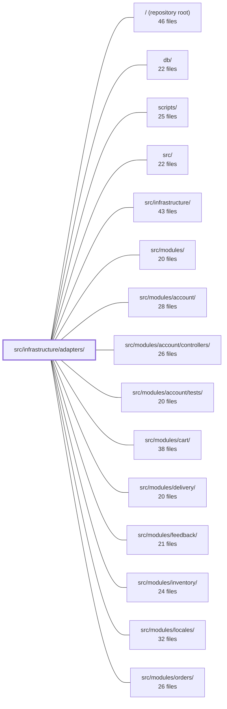

---
tags:
  - 2repo
  - 2repo/module
  - project/boilerplate-node-backend
type: module
module: src/infrastructure/adapters/
files: 15
updated: 2026-09-02T18:31:56.803241+00:00
---

# src/infrastructure/adapters/

## Purpose

This module is the infrastructure tier's collection of concrete adapters that wrap third-party services (Redis, RabbitMQ, SMTP, Puppeteer, Sharp, the local filesystem) behind narrow, purpose-specific interfaces. Each adapter isolates one transport or I/O concern so that application modules above it can call a small, well-defined function without knowing the underlying protocol, library, or failure-mode handling.

## Key parts

- **Connection & messaging** — `managed-connection.ts` provides a shared lifecycle factory (memoised handle, warn-once, fail-open getter, shutdown) that `queue.ts` (RabbitMQ publish/consume) and `cache.ts` (Redis byte store with tag-based invalidation) both consume. `demo-outbox.ts` is an in-memory email sink activated under `NODE_DEMO=true` so the e2e suite can inspect "sent" messages without SMTP.
- **Email pipeline** — `mailer.ts` renders EJS templates and dispatches via nodemailer (optionally enqueuing through the queue). `email.worker.ts` is the consumer-side counterpart that renders and sends a single queued job.
- **Image pipeline** — `storage.ts` configures multer (staging dir, filename safety, MIME/size limits, post-write validation). `image-signatures.ts` verifies real format via magic bytes. `image.ts` wraps Sharp for `digestImage` / `thumbnailImage` transforms. `image-store.ts` is the single port for persisting/retrieving/deleting uploaded images. `image.worker.ts` runs the full quarantine→promote→writeback pipeline (with an inverted port for document writeback supplied by `app/workers.ts`).
- **PDF pipeline** — `pdf.ts` exposes `renderHtmlToPdf` via puppeteer-core. `pdf.worker.ts` drains a queued job (render template → rasterise → write file), mirroring the email-worker structure.
- **Shared utilities** — `filesystem.ts` centralises cross-mount `moveFile` and non-throwing `deleteFile`. `logger.ts` is the single Winston-based structured-logging pipeline with credential-redaction and personal-data-hashing policies.

## How it connects

- **`src/modules/`** — Application modules are the primary consumers: `orders` calls `pdf.ts` for invoices, `products` and `users` use the image pipeline (`storage` → `image-signatures` → `image` → `image-store` → `image.worker`), `account` calls `mailer.ts` / `demo-outbox.ts` for transactional email, and `cart` / `feedback` / `delivery` / `payments` / `inventory` read/write through `cache.ts`.
- **`src/infrastructure/`** — The parent directory; adapters are the leaf tier beneath the infrastructure layer's other concerns (config, DI wiring).
- **`db/`** — `image.worker.ts` writes resulting image URLs back onto a waiting document; `queue.ts` publishes/consumes jobs that ultimately persist to the data store.
- **`tests/unit/infrastructure/adapters/`** and **`tests/cross-cutting/`** — Unit and integration tests that exercise individual adapters and the worker paths in isolation.
- **`scripts/`** — Operational scripts may instantiate adapters (e.g., a one-off PDF render or cache warm-up) without pulling in the full HTTP layer.

## Where to start

1. **`managed-connection.ts`** — Reading this first gives you the fail-open, warn-once, and lifecycle contract that every other adapter (cache, queue) inherits, so the remaining files read as "supply `connect`/`isReady`/`close` and the rest is handled."
2. **`image.worker.ts`** — It is the most complex single file here and demonstrates the inverted-port pattern (`ImageWriteback`) that decouples the adapter from `@kernel`/`@modules`. Understanding how the writeback is registered at boot time makes the rest of the image pipeline and the worker paths immediately legible.

## Connected modules

[[boilerplate-node-backend_ROOT|/ (repository root)]] · [[boilerplate-node-backend_db|db/]] · [[boilerplate-node-backend_scripts|scripts/]] · [[boilerplate-node-backend_src|src/]] · [[boilerplate-node-backend_src_infrastructure|src/infrastructure/]] · [[boilerplate-node-backend_src_modules|src/modules/]] · [[boilerplate-node-backend_src_modules_account|src/modules/account/]] · [[boilerplate-node-backend_src_modules_account_controllers|src/modules/account/controllers/]] · [[boilerplate-node-backend_src_modules_account_tests|src/modules/account/tests/]] · [[boilerplate-node-backend_src_modules_cart|src/modules/cart/]] · [[boilerplate-node-backend_src_modules_delivery|src/modules/delivery/]] · [[boilerplate-node-backend_src_modules_feedback|src/modules/feedback/]] · [[boilerplate-node-backend_src_modules_inventory|src/modules/inventory/]] · [[boilerplate-node-backend_src_modules_locales|src/modules/locales/]] · [[boilerplate-node-backend_src_modules_orders|src/modules/orders/]] · … and 8 more

## Files
- `src/infrastructure/adapters/cache.ts` — Redis cache adapter that exposes an opaque byte store with tag-based invalidation. It deliberately keeps zero knowledge of *what* is cached—serialisation, HTTP framing, and business semantics all belong to the caller (the HTTP middleware). Every public function fails open: if Redis is unreachable the app continues serving without a cache instead of erroring.
- `src/infrastructure/adapters/demo-outbox.ts` — In-memory email sink for the demo profile. When `NODE_DEMO=true` and the environment is not production, the mailer records every "send" here instead of calling nodemailer, so the e2e suite can read sent emails (e.g. extract a reset token) without an SMTP server. Lives in the infrastructure tier alongside the mailer because the mailer cannot import from `app`.
- `src/infrastructure/adapters/email.worker.ts` — Consumer-side handler for queued email jobs. Renders an EJS template and sends the message over SMTP via the shared `nodemailer` helper. It is the worker counterpart to `enqueueEmail` in `adapters/mailer.ts`, invoked by `consumeFromQueue` when a message-broker is configured.
- `src/infrastructure/adapters/filesystem.ts` — Small, dependency-light module that centralises two low-level filesystem operations every disk-touching adapter needs: a cross-mount `moveFile` (with an EXDEV fallback) and a non-throwing `deleteFile` (log-and-swallow). Existing so no other adapter re-derives either pattern on its own.
- `src/infrastructure/adapters/image-signatures.ts` — Identifies the real image format of an uploaded file by matching its leading bytes against known magic-byte signatures, rather than trusting the client-supplied `Content-Type`. This protects downstream consumers (static file serving, browser decoders) from mislabelled or maliciously disguised uploads. It is deliberately dependency-free: three inline signatures are easier to audit than a third-party library.
- `src/infrastructure/adapters/image-store.ts` — Single port (interface + implementation) through which every caller persists, retrieves, and deletes user-uploaded images. It exists to prevent the "move uploads to a bucket" change from touching five files: only this module translates an opaque `imageUrl` into a filesystem path. Today the sole backend is local disk under `NODE_PUBLIC_PATH/images/`.
- `src/infrastructure/adapters/image.ts` — Thin wrapper around `sharp` that exposes exactly two pure `Buffer → Buffer` transforms — `digestImage` and `thumbnailImage`. It exists to keep every sharp-specific detail (decode options, resize config, encode calls, pixel-limit safety) isolated behind this single file, so swapping the imaging library later means rewriting two functions rather than searching the codebase.
- `src/infrastructure/adapters/image.worker.ts` — Implements the single image-digest pipeline that turns a quarantined upload into a promoted original plus a thumbnail, then writes the resulting URLs back onto the waiting document. Because this adapter sits below `@kernel`/`@modules` and cannot import either, the writeback step is an inverted port (`ImageWriteback` + a boot-time registration function) supplied by `app/workers.ts`. Both the queued worker path and the no-broker inline fallback route through the same `digestQuarantinedImage` pipeline so the two cannot drift apart.
- `src/infrastructure/adapters/logger.ts` — Provides the application's single structured-logging pipeline built on Winston. It defines two distinct data-protection policies (credential redaction vs. personal-data hashing), serialises errors into log-safe shapes, and exposes a pre-configured `logger` instance that every other module imports for emitting structured log records to stdout.
- `src/infrastructure/adapters/mailer.ts` — Email infrastructure adapter: renders EJS templates into HTML and delivers via SMTP (nodemailer), with an optional path through the message queue. It is the single point where a logical email (template name + data) becomes a wire-format SMTP message or a queued job, isolating all transport concerns from application modules.
- `src/infrastructure/adapters/managed-connection.ts` — A generic factory (`manageConnection`) that encapsulates the full lifecycle of one optional external dependency — memoised handle, deduplicated connect, warn-once latching, a fail-open getter, a health-status reader, and clean shutdown. It exists so that each adapter (Redis cache, RabbitMQ queue, rate-limit store) supplies only its own `connect`/`isReady`/`close` logic while sharing the six cross-cutting rules once.
- `src/infrastructure/adapters/pdf.ts` — Provides a single exported function, `renderHtmlToPdf`, that converts a pre-rendered HTML string into a PDF `Uint8Array` by launching headless Chromium via `puppeteer-core`. It exists as an infrastructure adapter so that higher-level modules (e.g. the order-invoice controller) can obtain a PDF without knowing anything about browser management, and so the rendering strategy can be swapped without touching callers.
- `src/infrastructure/adapters/pdf.worker.ts` — Drains a single queued PDF job: renders an EJS template to HTML, then rasterizes that HTML to a PDF via Puppeteer (`renderHtmlToPdf`) and writes the file to the requested output path. Structurally mirrors `email.worker.ts` with the same dead-letter / retry split.
- `src/infrastructure/adapters/queue.ts` — RabbitMQ (AMQP 0-9-1) adapter that provides publish/consume primitives over a single shared channel. Every public function degrades to a safe no-op when the broker is unconfigured, so callers (e.g. `mailer.ts → enqueueEmail`) fall back to inline work without special-casing the absent-broker case.
- `src/infrastructure/adapters/storage.ts` — Configures the multer file-upload pipeline for the Express API: defines the staging destination, generates safe filenames, enforces MIME-type and size limits, and provides a post-write byte-level validation middleware. It is mounted per-route by the modules that accept image uploads.

---
[[boilerplate-node-backend_INDEX|← boilerplate-node-backend index]]
