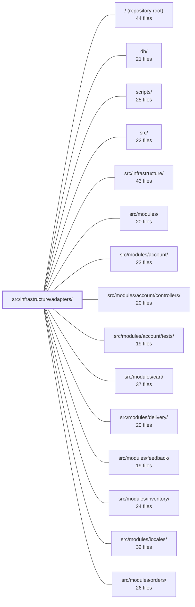

---
tags:
  - 2repo
  - 2repo/module
  - project/boilerplate-node-backend
type: module
module: src/infrastructure/adapters/
files: 15
updated: 2026-08-31T20:51:28.534331+00:00
---

# src/infrastructure/adapters/

## Purpose

This module houses the concrete, swappable implementations of every external concern the application touches: Redis caching, SMTP/RabbitMQ email delivery, headless-Chromium PDF rendering, image digesting and storage, structured logging, and the shared lifecycle rules for optional external services. Each file is a thin adapter that isolates one technology behind a small, testable surface so higher-level modules can call a function without knowing the protocol, library, or failure mode underneath.

## Key parts

- **Image pipeline** — `image.ts` (sharp Buffer transforms), `image-signatures.ts` (magic-byte sniffing), `image-store.ts` (the `ImageStore` port + filesystem implementation), `image.worker.ts` (queued/inline digest + writeback), `storage.ts` (multer upload config + validation middleware), and `filesystem.ts` (shared `moveFile`/`deleteFile` helpers). Together they turn a quarantined upload into a promoted original + thumbnail and expose stable URLs.
- **Email** — `mailer.ts` (template render + SMTP send or queue publish), `email.worker.ts` (consumer that renders and sends queued jobs), `demo-outbox.ts` (in-memory sink active only under `NODE_DEMO=true`).
- **PDF** — `pdf.ts` (Puppeteer HTML→PDF), `pdf.worker.ts` (queued consumer mirroring the email worker).
- **Plumbing** — `cache.ts` (Redis byte store with tag invalidation, fail-open), `queue.ts` (RabbitMQ publish/consume primitives, no-op when unconfigured), `managed-connection.ts` (generic lifecycle factory shared by cache, queue, and rate-limit adapters), `logger.ts` (Winston setup, redaction, `logger`/`auditLogger` instances).

## How it connects

- **`src/modules/`** (and their sub-directories such as `account`, `orders`, `products`, etc.) are the primary consumers: controllers import `mailer.enqueueEmail`, `imageStore.save`, `renderHtmlToPdf`, `cache.get/set`, and mount the multer middleware from `storage.ts`. They never touch sharp, nodemailer, or puppeteer directly.
- **`src/`** (the application root) contains `app/workers.ts`, which registers the inverted `ImageWriteback` port at boot time and wires `consumeFromQueue` to the email/PDF workers — the only place that bridges `@kernel`/`@modules` semantics back into this adapter layer.
- **`src/infrastructure/`** is the parent directory; this module sits one level below it as the concrete-adapter tier.
- **`scripts/`** likely contains the worker-entrypoint scripts that invoke `consumeFromQueue` and the individual worker handlers on separate processes.
- **`tests/unit/infrastructure/adapters/`** holds unit tests for each adapter (fail-open cache, image-signature matching, queue no-op, etc.). **`tests/support/`** and **`tests/cross-cutting/`** exercise the demo-outbox path and the queue-fallback paths in e2e/integration runs.
- **`db/`** provides the document store that `image.worker.ts` writes back to (via the registered port) and that mailer/PDF workers read template data from.

## Where to start

1. **`managed-connection.ts`** — reading its six shared rules (memoised handle, dedup connect, fail-open getter, etc.) gives you the mental model that `cache.ts` and `queue.ts` both plug into, and it explains why so many adapters "just work" when their external service is absent.
2. **`image-store.ts`** — it defines the single port boundary for image persistence and documents the one-file-swap guarantee for changing backends; understanding it makes the rest of the image pipeline (`image.ts`, `image.worker.ts`, `storage.ts`) click into place.

## Connected modules

[[boilerplate-node-backend_ROOT|/ (repository root)]] · [[boilerplate-node-backend_db|db/]] · [[boilerplate-node-backend_scripts|scripts/]] · [[boilerplate-node-backend_src|src/]] · [[boilerplate-node-backend_src_infrastructure|src/infrastructure/]] · [[boilerplate-node-backend_src_modules|src/modules/]] · [[boilerplate-node-backend_src_modules_account|src/modules/account/]] · [[boilerplate-node-backend_src_modules_account_controllers|src/modules/account/controllers/]] · [[boilerplate-node-backend_src_modules_account_tests|src/modules/account/tests/]] · [[boilerplate-node-backend_src_modules_cart|src/modules/cart/]] · [[boilerplate-node-backend_src_modules_delivery|src/modules/delivery/]] · [[boilerplate-node-backend_src_modules_feedback|src/modules/feedback/]] · [[boilerplate-node-backend_src_modules_inventory|src/modules/inventory/]] · [[boilerplate-node-backend_src_modules_locales|src/modules/locales/]] · [[boilerplate-node-backend_src_modules_orders|src/modules/orders/]] · … and 9 more

## Files
- `src/infrastructure/adapters/cache.ts` — Redis cache adapter that exposes an opaque byte store with tag-based invalidation. It deliberately keeps zero knowledge of *what* is cached—serialisation, HTTP framing, and business semantics all belong to the caller (the HTTP middleware). Every public function fails open: if Redis is unreachable the app continues serving without a cache instead of erroring.
- `src/infrastructure/adapters/demo-outbox.ts` — In-memory email sink for demo mode. Under `npm run demo` there is no SMTP server, yet the e2e suite must still read the emails the app "sent" (a password-reset token, for example). The mailer records each send here instead of calling nodemailer, and the demo router exposes the results over HTTP. The module is inert unless `NODE_DEMO=true`.
- `src/infrastructure/adapters/email.worker.ts` — Consumer-side handler for queued email jobs. Renders an EJS template and sends the message over SMTP via the shared `nodemailer` helper. It is the worker counterpart to `enqueueEmail` in `adapters/mailer.ts`, invoked by `consumeFromQueue` when a message-broker is configured.
- `src/infrastructure/adapters/filesystem.ts` — Small, dependency-light module that centralises two low-level filesystem operations every disk-touching adapter needs: a cross-mount `moveFile` (with an EXDEV fallback) and a non-throwing `deleteFile` (log-and-swallow). Existing so no other adapter re-derives either pattern on its own.
- `src/infrastructure/adapters/image-signatures.ts` — Identifies the real image format of an uploaded file by matching its leading bytes against known magic-byte signatures, rather than trusting the client-supplied `Content-Type`. This protects downstream consumers (static file serving, browser decoders) from mislabelled or maliciously disguised uploads. It is deliberately dependency-free: three inline signatures are easier to audit than a third-party library.
- `src/infrastructure/adapters/image-store.ts` — Defines the `ImageStore` port — the single boundary through which all callers interact with image persistence. It guarantees that no code outside this file converts an `imageUrl` into a filesystem path, so swapping the local-disk backend for S3/CDN touches one file instead of every write controller. Currently the only concrete implementation (`filesystemImageStore`) stores files under `NODE_PUBLIC_PATH/images/`.
- `src/infrastructure/adapters/image.ts` — Thin wrapper around `sharp` that exposes exactly two pure `Buffer → Buffer` transforms — `digestImage` and `thumbnailImage`. It exists to keep every sharp-specific detail (decode options, resize config, encode calls, pixel-limit safety) isolated behind this single file, so swapping the imaging library later means rewriting two functions rather than searching the codebase.
- `src/infrastructure/adapters/image.worker.ts` — Implements the single image-digest pipeline that turns a quarantined upload into a promoted original plus a thumbnail, then writes the resulting URLs back onto the waiting document. Because this adapter sits below `@kernel`/`@modules` and cannot import either, the writeback step is an inverted port (`ImageWriteback` + a boot-time registration function) supplied by `app/workers.ts`. Both the queued worker path and the no-broker inline fallback route through the same `digestQuarantinedImage` pipeline so the two cannot drift apart.
- `src/infrastructure/adapters/logger.ts` — Central structured-logging setup built on Winston. It defines the redaction pipeline, format selection (JSON vs. human-readable), log-level resolution, and exposes two ready-to-use logger instances (`logger` and `auditLogger`) that every other module in the codebase imports for emitting log records.
- `src/infrastructure/adapters/mailer.ts` — Email delivery adapter: renders EJS templates to HTML and sends them over SMTP (or records them to the demo outbox). Provides both a synchronous `nodemailer` send and an async `enqueueEmail` path that publishes to a message queue so a slow mail server cannot block an HTTP response. It owns the SMTP transport configuration, the template-path resolution, and the queue payload contract shared with the consumer.
- `src/infrastructure/adapters/managed-connection.ts` — A generic factory (`manageConnection`) that encapsulates the full lifecycle of one optional external dependency — memoised handle, deduplicated connect, warn-once latching, a fail-open getter, a health-status reader, and clean shutdown. It exists so that each adapter (Redis cache, RabbitMQ queue, rate-limit store) supplies only its own `connect`/`isReady`/`close` logic while sharing the six cross-cutting rules once.
- `src/infrastructure/adapters/pdf.ts` — Provides a single exported function, `renderHtmlToPdf`, that converts a pre-rendered HTML string into a PDF `Uint8Array` by launching headless Chromium via `puppeteer-core`. It exists as an infrastructure adapter so that higher-level modules (e.g. the order-invoice controller) can obtain a PDF without knowing anything about browser management, and so the rendering strategy can be swapped without touching callers.
- `src/infrastructure/adapters/pdf.worker.ts` — Drains a single queued PDF job: renders an EJS template to HTML, then rasterizes that HTML to a PDF via Puppeteer (`renderHtmlToPdf`) and writes the file to the requested output path. Structurally mirrors `email.worker.ts` with the same dead-letter / retry split.
- `src/infrastructure/adapters/queue.ts` — RabbitMQ (AMQP 0-9-1) adapter that exposes publish and consume primitives over a single shared channel. Every public function degrades to a safe no-op when the broker is unconfigured or unreachable — `publishToQueue` resolves `false` so callers (e.g. `mailer.ts → enqueueEmail`) can fall back to doing the work inline. Queue names are sourced from the generated `WORKER_CHANNELS` constant to keep producers and consumers in lock-step.
- `src/infrastructure/adapters/storage.ts` — Configures the multer file-upload pipeline for the Express API: defines the staging destination, generates safe filenames, enforces MIME-type and size limits, and provides a post-write byte-level validation middleware. It is mounted per-route by the modules that accept image uploads.

---
[[boilerplate-node-backend_INDEX|← boilerplate-node-backend index]]
