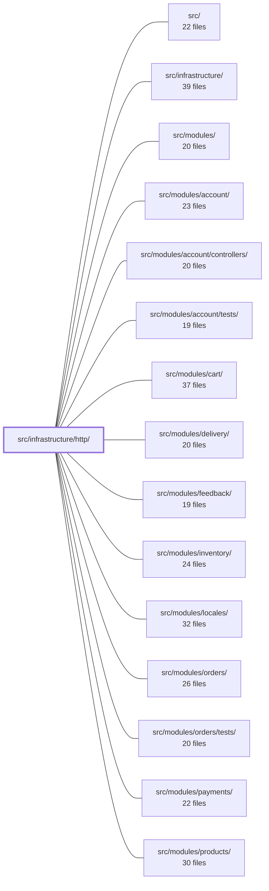

---
tags:
  - 2repo
  - 2repo/module
  - project/boilerplate-node-backend
type: module
module: src/infrastructure/http/
files: 14
updated: 2026-08-28T11:57:29.626416+00:00
---

# src/infrastructure/http/

## Purpose

This module is the shared HTTP transport layer of the application. It provides every cross-cutting concern a REST endpoint needs—request parsing, validation, response shaping, error mapping, caching, rate-limiting, locale negotiation, and security—so that individual domain modules only declare *what* they accept and return, not *how* the HTTP machinery works.

## Key parts

- **Controller & input helpers** — `controller.ts` (shared validation/refusal/error-catch helpers used by every route handler), `request.ts` (`readInput`: single entry point that resolves a field from route params, query, or body with defined precedence), `delete-controller.ts` (factory that generates the three DELETE variants for any entity in one place), `route-flag.ts` (middleware that injects a fixed value into `request.params` so literal path segments behave like declared boolean inputs).
- **Response & schema infrastructure** — `response.ts` (the canonical `{success, data|errors}` envelope every endpoint must emit), `errors.ts` (typed `ExtendedError` + Mongoose/driver-to-HTTP status translation), `schemas.ts` (shared Zod schemas for `page`, `pageSize`, `hardDelete`), `validation-messages.ts` (ensures all Zod errors produce translated, locale-consistent refusal copy).
- **Uploads** — `uploads.ts` (normalises `.single`/`.array`/`.fields` multer shapes into one uniform array for controllers; write-side logic lives in storage adapters).
- **Middleware** — `middlewares/cache.ts` (Redis-backed response cache with JSON envelope, dev TTL clamp, byte-size gate), `middlewares/locale.ts` (Accept-Language negotiation, async-local storage, cache-control headers), `middlewares/rate-limit-store.ts` (cross-process Redis store for `express-rate-limit`), `middlewares/request-logger.ts` (structured access log with severity by status class), `middlewares/security.ts` (global per-address limiter, credential-budget limiters for auth, bearer-token guard on the Prometheus endpoint).

## How it connects

- **`src/modules/*` (account, cart, delivery, feedback, inventory, locales, orders, payments, products, users, wishlist)** — Every domain module's controller files import the helpers, envelope, and schemas defined here. The `delete-controller.ts` factory is called from the per-module controller files for orders, products, and users. Domain modules never re-implement HTTP plumbing; they consume this layer.
- **`src/infrastructure/`** — Sibling infrastructure adapters (storage, Redis, etc.) are the *backing services* that the middlewares here talk to: the cache middleware writes to the Redis storage adapter, the rate-limit store reads/writes the same adapter, and `uploads.ts` delegates file persistence to the storage layer.
- **`tests/unit/infrastructure/`, `tests/cross-cutting/`, `tests/support/`** — Unit tests exercise individual helpers (envelope shape, input precedence, error mapping); cross-cutting tests validate middleware composition (locale + cache interaction, security limiter behaviour); support files provide shared fixtures for HTTP-level tests.

## Where to start

1. **`response.ts`** — Reading the canonical envelope first gives you the contract every endpoint speaks, which makes all other files (error mapping, validation, cache envelope) immediately meaningful.
2. **`controller.ts`** — This is the "shape of a handler" file: once you see the four-step pattern it codifies (validate → refuse → catch → respond), every domain controller in `src/modules/` reads as a thin configuration over it rather than a mystery.

## Connected modules

[[boilerplate-node-backend_src|src/]] · [[boilerplate-node-backend_src_infrastructure|src/infrastructure/]] · [[boilerplate-node-backend_src_modules|src/modules/]] · [[boilerplate-node-backend_src_modules_account|src/modules/account/]] · [[boilerplate-node-backend_src_modules_account_controllers|src/modules/account/controllers/]] · [[boilerplate-node-backend_src_modules_account_tests|src/modules/account/tests/]] · [[boilerplate-node-backend_src_modules_cart|src/modules/cart/]] · [[boilerplate-node-backend_src_modules_delivery|src/modules/delivery/]] · [[boilerplate-node-backend_src_modules_feedback|src/modules/feedback/]] · [[boilerplate-node-backend_src_modules_inventory|src/modules/inventory/]] · [[boilerplate-node-backend_src_modules_locales|src/modules/locales/]] · [[boilerplate-node-backend_src_modules_orders|src/modules/orders/]] · [[boilerplate-node-backend_src_modules_orders_tests|src/modules/orders/tests/]] · [[boilerplate-node-backend_src_modules_payments|src/modules/payments/]] · [[boilerplate-node-backend_src_modules_products|src/modules/products/]] · … and 6 more

## Files
- `src/infrastructure/http/controller.ts` — Shared helper functions that eliminate the four repeated steps in every HTTP controller (validation, refusal branching, error catching, and body parsing). Deliberately exported as individual helpers rather than a `defineController()` wrapper, so that stack traces stay pointed at the handler, generic type inference is preserved, and the `controller-chain-must-catch` ESLint rule can still see the literal `.catch()` at each call site.
- `src/infrastructure/http/delete-controller.ts` — A single factory that produces the full `DELETE /x`, `DELETE /x/:id`, and `DELETE /x/:id/hard` handler for any entity. It replaces three byte-identical per-module controllers (orders, products, users) with one implementation whose only per-entity differences are the service call, audit action, and i18n not-found key. Each module still owns a small file that calls the factory, satisfying the one-controller-per-file convention while centralising the shared logic.
- `src/infrastructure/http/errors.ts` — Defines the HTTP-layer error vocabulary: a custom `ExtendedError` class for throwing typed, status-carrying errors from any layer, and a set of helpers that translate raw Mongoose/driver failures into the correct HTTP status and a safe client message. It exists so that status codes are derived in one place, driver messages never leak to clients, and operational vs. programmer errors are handled (logged or not) consistently.
- `src/infrastructure/http/middlewares/cache.ts` — Express middleware that caches **HTTP responses** in Redis. It owns the JSON envelope (`{status, body}`), the development TTL clamp, and the per-entry byte-size gate — concerns specific to caching a response rather than arbitrary data, which is why they live here rather than in the storage adapter.
- `src/infrastructure/http/middlewares/locale.ts` — Express middleware that negotiates the request language from the `Accept-Language` header, exposes the result both explicitly on the request object and ambiently via async-local storage, and sets the two cache-related response headers needed for correct multilingual serving. It must be mounted before all route handlers that produce user-facing copy.
- `src/infrastructure/http/middlewares/rate-limit-store.ts` — Provides a shared, lazy-initialising Redis-backed store for `express-rate-limit` counters so that rate-limit budgets are enforced across all worker processes and instances rather than per-process. Falls open (passes requests through) when Redis is unreachable, logging the outage once at error severity.
- `src/infrastructure/http/middlewares/request-logger.ts` — Express middleware that emits a single structured access-log entry per HTTP request. It captures method, matched route template, status code, and sub-millisecond duration, then logs at a severity level that distinguishes caller faults (4xx → WARN) from server faults (5xx → ERROR).
- `src/infrastructure/http/middlewares/route-flag.ts` — A factory for an Express middleware that injects a fixed value into `request.params` under a named key. It exists so that literal path segments (e.g. `DELETE /products/:id/hard`) can be treated as declared boolean inputs by `readInput`, giving controllers a single input-declaration surface instead of special-casing path vs. query flags.
- `src/infrastructure/http/middlewares/security.ts` — Defines the application's transport-level security middleware: a global per-address rate limiter, a pair of credential-budget limiters for auth routes, and a static bearer-token guard for the Prometheus scrape endpoint. It exists so that brute-force, credential-stuffing, and unauthorized-metrics-scraping threats are blocked at the HTTP edge before they reach route logic.
- `src/infrastructure/http/request.ts` — Owns the multi-source input-resolution rules for HTTP endpoints so controllers don't re-assemble them. A single endpoint may accept the same field from a route param, query string, or JSON/form body; this module centralises the precedence, decoding, and collapse rules behind one entry point, `readInput`, keyed by a named "surface" declaration per route.
- `src/infrastructure/http/response.ts` — Defines the canonical response envelope that every HTTP endpoint in the application must use. By forcing a single discriminated-union shape (`success: true` → `data`, `success: false` → `errors`), clients and the generated orval API client can branch on one field without knowing which route they called. It also centralizes status-to-code/message mapping so no handler can accidentally leak internals or produce inconsistent wording.
- `src/infrastructure/http/schemas.ts` — Shared Zod schemas for the handful of scalar query parameters (`page`, `pageSize`, `hardDelete`) that multiple HTTP endpoints accept. They exist so that bounds, coercion, and defaults for these scalars are declared once in infrastructure rather than re-derived per controller, preventing divergent behaviour (e.g. one endpoint returning 422 for `?pageSize=500` while another silently clamped).
- `src/infrastructure/http/uploads.ts` — Read-side upload helpers that normalize the three shapes multer can put on an Express request (`.single`, `.array`, `.fields`) into one uniform array of paths, and expose the committed image URL. The write side (where files land, naming, persistence) lives entirely in the storage adapters; this module only makes controllers indifferent to which multer middleware variant a route used.
- `src/infrastructure/http/validation-messages.ts` — Centralizes Zod validation error messages so that every schema in the process—generated (`@api/schemas.zod`) or hand-written—returns a translated refusal in the caller's language. It exists because, without it, generated schemas fell back to Zod's built-in English while hand-written schemas used Italian, producing inconsistent 422 copy depending on the endpoint.

---
[[boilerplate-node-backend_INDEX|← boilerplate-node-backend index]]
