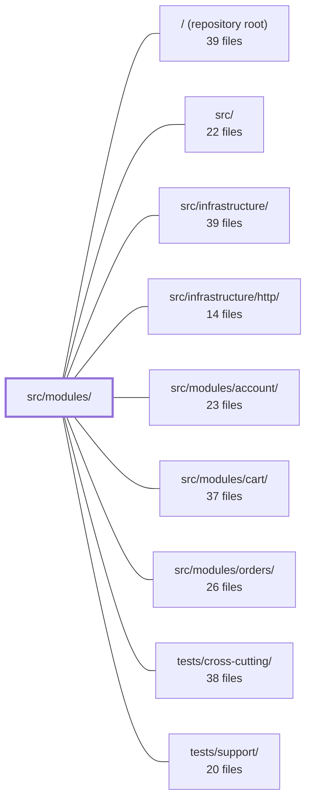

---
tags:
  - 2repo
  - 2repo/module
  - project/boilerplate-node-backend
type: module
module: src/modules/
files: 20
updated: 2026-08-28T11:57:42.726684+00:00
---

# src/modules/

## Purpose

`src/modules/` is the home for all application domain modules. Each subdirectory is a self-contained unit that declares its own data model, service logic, and (optionally) HTTP surface through a single `module.ts` registration file. The two modules present here are **audit-logs** (a headless, write-only persistence sink for an immutable event trail) and **observability** (a read-facing surface that exposes health, metrics, SSE, and the audit-log query endpoint to operators and dashboards).

## Key parts

- **`audit-logs/`** – Owns the `audit-logs` MongoDB collection and its append-only write path.
  - `model.ts` – Mongoose schema + TTL index (retention via `NODE_AUDIT_RETENTION_DAYS`, default 90 days).
  - `repository.ts` – Two-operation data-access layer (create, filtered search); no update or delete by design.
  - `service.ts` – Applies collection-specific policy (sort order, `since` scoping) and the asymmetric error contract: `record` is fail-open, `search` is fail-closed.
  - `metrics.ts` – Prometheus counter for write failures so silent drops are visible on dashboards.
  - `module.ts` – Headless registration; installs the audit sink into the observability layer at import time, declares no router.
  - `tests/` – Integration (repository against a real DB), unit (retention, schema-contract, service error semantics).

- **`observability/`** – Owns the `/observability` HTTP surface; declares a read-only dependency on `audit-logs`.
  - `module.ts` – Binds the router to `/observability`, classifies the subdomain as `generic`.
  - `routes.ts` – Express router wiring each endpoint to its controller with per-route auth (cookie, static credential, JWT).
  - `controllers/` – One handler per endpoint: audit-log read, readiness health, metrics overview.
  - `openapi.yaml` / `asyncapi.yaml` – API contracts (REST + SSE) for self-service discovery.
  - `tests/` – Contract tests pinning JSON shapes to the OpenAPI spec; unit tests for metrics-overview values and route table/auth strategy.

## How it connects

- **`audit-logs` → `observability`**: `audit-logs/module.ts` registers its write sink into the observability layer at import time; `observability/module.ts` declares `audit-logs` as a read-only dependency. Enabling `audit-logs` without `observability` is a valid build (trail is stored, nothing exposes it).
- **`observability` → `src/infrastructure/http/`**: The router and controllers use the shared HTTP infrastructure (Express app, middleware, response helpers).
- **`audit-logs` → `src/infrastructure/`**: The Mongoose model and repository rely on the shared database connection and query helpers.
- **`account`, `cart`, `orders` → `audit-logs` / `observability`**: Sibling domain modules emit audit entries through the observability layer's sink; the audit trail captures their actions without each module knowing the storage details.
- **`tests/cross-cutting/` & `tests/support/`**: Provide shared fixtures, helpers, and cross-module test scaffolding consumed by the unit and integration suites inside both sub-modules.

## Where to start

1. **`observability/module.ts`** – The smallest file that shows the full module-registration contract (router binding, dependency declaration, subdomain tag). Reading it first makes every other `module.ts` in the codebase predictable.
2. **`audit-logs/service.ts`** – The clearest expression of the module's core policy: fail-open writes, fail-closed reads, and the metric side-channel. Understanding this asymmetric error contract is the key to reading the tests and the `metrics.ts` file that surrounds it.

## Connected modules

[[boilerplate-node-backend_ROOT|/ (repository root)]] · [[boilerplate-node-backend_src|src/]] · [[boilerplate-node-backend_src_infrastructure|src/infrastructure/]] · [[boilerplate-node-backend_src_infrastructure_http|src/infrastructure/http/]] · [[boilerplate-node-backend_src_modules_account|src/modules/account/]] · [[boilerplate-node-backend_src_modules_cart|src/modules/cart/]] · [[boilerplate-node-backend_src_modules_orders|src/modules/orders/]] · [[boilerplate-node-backend_tests_cross-cutting|tests/cross-cutting/]] · [[boilerplate-node-backend_tests_support|tests/support/]]

## Files
- `src/modules/audit-logs/index.ts` — Barrel file that exposes the audit-logs module's single public symbol. Sibling modules are expected to import only through this file (same convention as `modules/products/index.ts`). The module owns a database collection but no HTTP URL; its write sink is registered at import time by the module's own `module.ts`, while its read path is served by the `observability` module.
- `src/modules/audit-logs/metrics.ts` — Defines the Prometheus counter for audit-log persistence failures. It exists so that silent, fail-open drops of audit entries into the queryable trail become visible on an existing dashboard instead of looking like "nothing happened." The counter lives in the module (not infrastructure) following the same convention as `modules/account/metrics.ts`.
- `src/modules/audit-logs/model.ts` — Mongoose model for the persisted audit-trail collection. It is the queryable, durable half of the audit system: it exists so `GET /observability/audit` can answer "what has actor X done" from the API without a log backend (Loki/file) being wired up. It replaced a 200-entry in-process ring buffer that was per-worker, per-restart, and shared across all actors.
- `src/modules/audit-logs/module.ts` — Headless module that installs the audit-log sink into the observability layer at import time. It owns the `audit-logs` domain collection but declares no router; the single read endpoint (`GET /observability/audit`) lives in the dashboard module that renders the data. Enabling this module without `observability` is a valid build — the trail is stored but nothing exposes it.
- `src/modules/audit-logs/repository.ts` — Append-only data access layer for audit-log entries. It exposes exactly two operations—create one entry and read a filtered, paginated page—and deliberately omits any update or delete path so that the repository type itself (not a reviewer) enforces immutability. Expiry is handled by a MongoDB TTL index on the model, not by application code.
- `src/modules/audit-logs/service.ts` — Audit log service that provides the two operations the audit path needs: writing emitted entries into the queryable store (fire-and-forget) and reading a filtered, paginated page of entries for the admin dashboard. It sits between the domain types (`AuditEntry`, `AuditLogDocument`) and the repository, applying collection-specific policies (sort order, `since` scoping) that the generic base repository does not encode.
- `src/modules/audit-logs/tests/integration/repository.test.ts` — Integration tests for `auditLogRepository` covering `create` (validation, field persistence) and `search` (filtering, pagination, sorting, serialization). Exists to pin the repository's contract against a real database so that service-layer policy concerns (`since` scoping, sort order) are exercised through the actual query path rather than mocks.
- `src/modules/audit-logs/tests/unit/retention.test.ts` — Unit test verifying that the audit-log collection's TTL index picks up the retention period from the `NODE_AUDIT_RETENTION_DAYS` environment variable at import time, and that it defaults to 90 days when the variable is absent.
- `src/modules/audit-logs/tests/unit/schema-contract.test.ts` — Locks down the audit-log schema as a compliance contract: required fields, closed enum sets, Mongoose options (`timestamps`, `bufferCommands`), and index/TTL configuration. Because the audit-log collection is the one in the system whose schema is a policy artifact rather than a convenience, these invariants are asserted explicitly so that any accidental change to the model is caught at test time.
- `src/modules/audit-logs/tests/unit/service.test.ts` — Unit tests for `auditLogService`, focused exclusively on the asymmetric error contract: `record` must be fail-open (swallow write failures, return `void`, never throw or leak an unhandled rejection) while `search` must be fail-closed (propagate read failures to the caller). The tests verify these guarantees plus the side-channel metric that makes lost rows observable.
- `src/modules/observability/asyncapi.yaml` — AsyncAPI 2.6.0 contract defining the three SSE channels served at `/observability/events` by the observability module. It is a self-validating slice that a bundler merges (servers, channels, components) into the service-wide contract; the `info` block exists only so the file can be linted and opened standalone.
- `src/modules/observability/controllers/get-observability-audit.ts` — HTTP handler for `GET /observability/audit`. Accepts a paginated, filterable query string (actor, action, outcome, since) and delegates to the audit-log service to return one page of matching audit events.
- `src/modules/observability/controllers/get-observability-health.ts` — Handler for `GET /observability/health` — the **readiness** endpoint. It reports whether the instance can serve what it promises (database, cache, queue status) and which telemetry sinks are wired in, returning a single `status` (`ok` / `degraded` / `down`) folded from dependency health only. It is deliberately separate from liveness (`GET /`), which is what container `HEALTHCHECK` probes.
- `src/modules/observability/controllers/get-observability-metrics-overview.ts` — Implements the `GET /observability/metrics/overview` endpoint, returning a structured JSON snapshot of HTTP, auth, business, database (placeholder), and process metrics in a single response. It exists as the dashboard's single read surface for operational health across all modules.
- `src/modules/observability/module.ts` — Module registration for the `observability` module. Exports a single `AppModule`-conforming object that binds the router from `./routes` to the base path `/observability`, declares a read-only dependency on `audit-logs`, and sets the subdomain classification to `'generic'`. It is the entry point the kernel uses to mount this module; it owns no data of its own.
- `src/modules/observability/openapi.yaml` — OpenAPI 3.0.3 contract (v2.0.0) for the observability module. It defines five endpoints that expose operational visibility — SSE event stream, health snapshot, Prometheus metrics, a JSON metrics summary, and a paginated audit log — each with its own auth model suited to the consumer (browsers, Prometheus scrapers, or admin JWTs).
- `src/modules/observability/routes.ts` — Defines the Express router for all `/observability` endpoints. It wires each route to its controller or streaming handler and applies the appropriate authentication middleware, distinguishing between cookie-authenticated browsers, static-credential Prometheus scrapers, and JWT-authenticated admin API clients.
- `src/modules/observability/tests/contract/api.contract.test.ts` — Contract tests for the three JSON endpoints under `/observability` (`/health`, `/metrics/overview`, `/audit`). These endpoints build their responses field-by-field in controllers rather than through a shared serializer, making them the most likely to silently drift from the OpenAPI spec. The suite pins their shapes via `toSatisfyApiSpec()` and adds a small number of value-level assertions where the shape alone cannot prove correctness (e.g., the health snapshot reflects the real connection state, the overview tolerates absent counters, the audit page honours its filters).
- `src/modules/observability/tests/unit/metrics-overview.test.ts` — Unit test that verifies `GET /observability/metrics/overview` returns real numeric values for each domain row (auth, business) by incrementing the actual Prometheus counters and reading them back through the shared registry. It exists to catch the silent degradation path where a renamed or unregistered metric name yields zero instead of the true count — a failure no other test in the suite would surface.
- `src/modules/observability/tests/unit/routes.test.ts` — Unit tests for the observability router (`routes.ts`). Verifies the mounted route table, the distinct auth-guard strategy per route, and the behaviour of the two inline handlers (SSE stream hand-off and Prometheus scrape, including the error path). The file exists because those handlers are written inline in `routes.ts` rather than in a separate controller module, so they cannot be imported and tested in isolation.

---
[[boilerplate-node-backend_INDEX|← boilerplate-node-backend index]]
